Statistical learning: linear regression
================
MACS 30100 - Perspectives on Computational Modeling

-   [Objectives](#objectives)
-   [Linear models](#linear-models)
-   [Least squares regression](#least-squares-regression)
-   [Generating predicted values](#generating-predicted-values)
-   [Generating residuals](#generating-residuals)
-   [Exploring the `credit` dataset](#exploring-the-credit-dataset)
    -   [Import data](#import-data)
    -   [Distribution of credit variable](#distribution-of-credit-variable)
    -   [Estimate single variable linear regression model](#estimate-single-variable-linear-regression-model)
    -   [Extracting model statistics](#extracting-model-statistics)
        -   [`tidy()`](#tidy)
        -   [`augment()`](#augment)
        -   [`glance()`](#glance)
    -   [Generating predicted values with confidence intervals](#generating-predicted-values-with-confidence-intervals)
    -   [Estimating multiple linear regression model](#estimating-multiple-linear-regression-model)
    -   [Qualitative predictors](#qualitative-predictors)
        -   [Qualitative predictors with 2 levels](#qualitative-predictors-with-2-levels)
        -   [Qualitative predictors with more than 2 levels](#qualitative-predictors-with-more-than-2-levels)
    -   [Extending the linear model](#extending-the-linear-model)
        -   [Removing the additive assumption: interaction terms](#removing-the-additive-assumption-interaction-terms)
        -   [Non-linear relationships](#non-linear-relationships)
-   [Session Info](#session-info)

Objectives
==========

-   Introduce the functional form of linear regression
-   Demonstrate how to estimate linear models using `lm()`
    -   Single variable linear regression
    -   Multiple linear regression
    -   Qualitative predictors
    -   Relaxing linear model assumptions
-   Explain how to extract model statistics using [`broom`](https://cran.r-project.org/web/packages/broom/index.html)
-   Use the [`modelr`](https://github.com/hadley/modelr) package to estimate predicted values and residuals

``` r
library(dplyr)
library(ggplot2)
library(tidyr)
library(modelr)
library(broom)

options(na.action = na.warn)
set.seed(1234)

theme_set(theme_minimal())
```

Linear models
=============

Linear models are the simplest functional form to understand. They adopt a generic form

*Y* = *β*<sub>0</sub> + *β*<sub>1</sub>*X*

where *y* is the **outcome of interest**, *x* is the **explanatory** or **predictor** variable, and *β*<sub>0</sub> and *β*<sub>1</sub> are **parameters** that vary to capture different patterns. In algebraic terms, *β*<sub>0</sub> is the **intercept** and *β*<sub>1</sub> the **slope** for the linear equation. Given the empirical values you have for *x* and *y*, you generate a **fitted model** that finds the values for the parameters that best fit the data.

``` r
ggplot(sim1, aes(x, y)) + 
  geom_point()
```

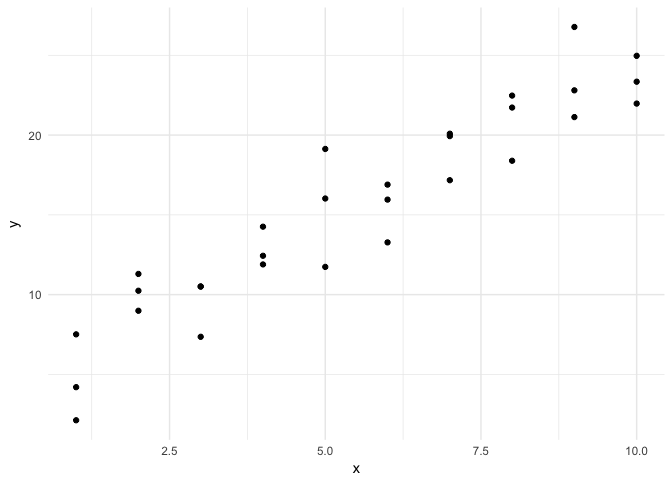

This looks like a linear relationship. We could randomly generate parameters for the formula *y* = *β*<sub>0</sub> + *β*<sub>1</sub> \* *x* to try and explain or predict the relationship between *x* and *y*:

``` r
models <- tibble(
  a1 = runif(250, -20, 40),
  a2 = runif(250, -5, 5)
)

ggplot(sim1, aes(x, y)) + 
  geom_abline(aes(intercept = a1, slope = a2), data = models, alpha = 1/4) +
  geom_point()
```

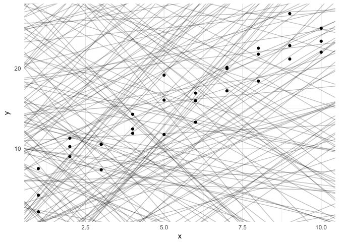

But obviously some parameters are better than others. We need a definition that can be used to differentiate good parameters from bad parameters.

Least squares regression
========================

One approach widely used is called **least squares** - it means that the overall solution minimizes the sum of the squares of the errors made in the results of every single equation. The errors are simply the difference between the actual values for *y* and the predicted values for *y* (also known as the **residuals**).

``` r
dist1 <- sim1 %>% 
  mutate(
    dodge = rep(c(-1, 0, 1) / 20, 10),
    x1 = x + dodge,
    pred = 7 + x1 * 1.5
  )

ggplot(dist1, aes(x1, y)) + 
  geom_abline(intercept = 7, slope = 1.5, color = "grey40") +
  geom_point(color = "grey40") +
  geom_linerange(aes(ymin = y, ymax = pred), color = "#3366FF")
```

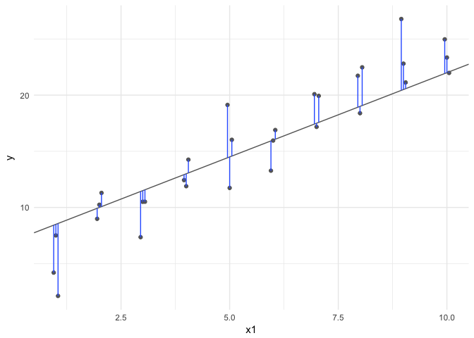

To estimate a linear regression model in R, we use the `lm()` function. The `lm()` function takes two parameters. The first is a **formula** specifying the equation to be estimated (`lm()` translates `y ~ x` into *y* = *β*<sub>0</sub> + *β*<sub>1</sub> \* *x*). The second is the data frame containing the variables:

``` r
sim1_mod <- lm(y ~ x, data = sim1)
```

We can use the `summary()` function to examine key model components, including parameter estimates, standard errors, and model goodness-of-fit statistics.

``` r
summary(sim1_mod)
```

    ## 
    ## Call:
    ## lm(formula = y ~ x, data = sim1)
    ## 
    ## Residuals:
    ##     Min      1Q  Median      3Q     Max 
    ## -4.1469 -1.5197  0.1331  1.4670  4.6516 
    ## 
    ## Coefficients:
    ##             Estimate Std. Error t value Pr(>|t|)    
    ## (Intercept)   4.2208     0.8688   4.858 4.09e-05 ***
    ## x             2.0515     0.1400  14.651 1.17e-14 ***
    ## ---
    ## Signif. codes:  0 '***' 0.001 '**' 0.01 '*' 0.05 '.' 0.1 ' ' 1
    ## 
    ## Residual standard error: 2.203 on 28 degrees of freedom
    ## Multiple R-squared:  0.8846, Adjusted R-squared:  0.8805 
    ## F-statistic: 214.7 on 1 and 28 DF,  p-value: 1.173e-14

The resulting line from this regression model looks like:

``` r
dist2 <- sim1 %>%
  add_predictions(sim1_mod) %>%
  mutate(
    dodge = rep(c(-1, 0, 1) / 20, 10),
    x1 = x + dodge
  )

ggplot(dist2, aes(x1, y)) + 
  geom_smooth(method = "lm", color = "grey40") +
  geom_point(color = "grey40") +
  geom_linerange(aes(ymin = y, ymax = pred), color = "#3366FF")
```

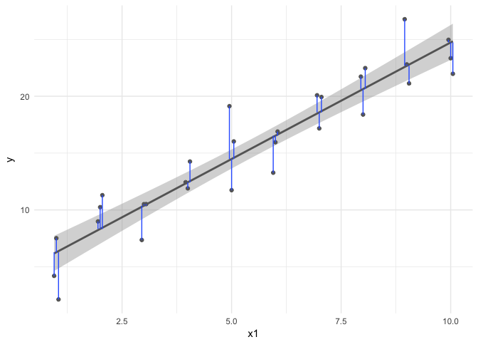

Generating predicted values
===========================

We can use `sim1_mod` to generate **predicted values**, or the expected value for *Y* given our knowledge of hypothetical observations with values for *X*, based on the estimated parameters using the `data_grid()` and `add_predictions()` functions from the `modelr` package. `data_grid()` generates an evenly spaced grid of data points covering the region where observed data lies. The first argument is a data frame, and subsequent arguments identify unique columns and generates all possible combinations.

``` r
grid <- sim1 %>% 
  data_grid(x) 
grid
```

    ## # A tibble: 10 × 1
    ##        x
    ##    <int>
    ## 1      1
    ## 2      2
    ## 3      3
    ## 4      4
    ## 5      5
    ## 6      6
    ## 7      7
    ## 8      8
    ## 9      9
    ## 10    10

`add_predictions()` takes a data frame and a model, and uses the model to generate predictions for each observation in the data frame.

``` r
grid <- grid %>% 
  add_predictions(sim1_mod) 
grid
```

    ## # A tibble: 10 × 2
    ##        x      pred
    ##    <int>     <dbl>
    ## 1      1  6.272355
    ## 2      2  8.323888
    ## 3      3 10.375421
    ## 4      4 12.426954
    ## 5      5 14.478487
    ## 6      6 16.530020
    ## 7      7 18.581553
    ## 8      8 20.633087
    ## 9      9 22.684620
    ## 10    10 24.736153

Using this information, we can draw the best-fit line without using `geom_smooth()`, and instead build it directly from the predicted values.

``` r
ggplot(sim1, aes(x)) +
  geom_point(aes(y = y)) +
  geom_line(aes(y = pred), data = grid, color = "red", size = 1)
```

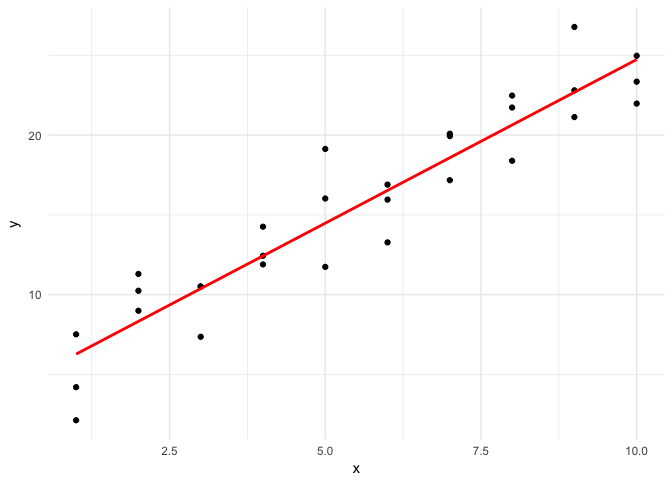

This looks like the line from before, but without the confidence interval. This is a bit more involved of a process, but it can work with any type of model you create - not just very basic, linear models.

Generating residuals
====================

We can also calculate the **residuals**, or the distance between the actual and predicted values of *Y*, using `add_residuals()`:

``` r
sim1 <- sim1 %>% 
  add_residuals(sim1_mod)
sim1
```

    ## # A tibble: 30 × 3
    ##        x         y        resid
    ##    <int>     <dbl>        <dbl>
    ## 1      1  4.199913 -2.072442018
    ## 2      1  7.510634  1.238279125
    ## 3      1  2.125473 -4.146882207
    ## 4      2  8.988857  0.664969362
    ## 5      2 10.243105  1.919217378
    ## 6      2 11.296823  2.972935148
    ## 7      3  7.356365 -3.019056466
    ## 8      3 10.505349  0.129928252
    ## 9      3 10.511601  0.136179642
    ## 10     4 12.434589  0.007634878
    ## # ... with 20 more rows

``` r
ggplot(sim1, aes(resid)) + 
  geom_freqpoly(binwidth = 0.5)
```

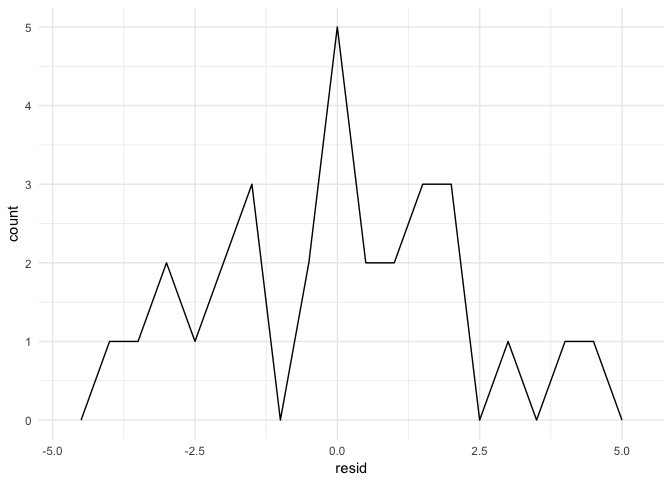

Reviewing your residuals can be helpful. Sometimes your model is better at predicting some types of observations better than others. This could help you isolate further patterns and improve the predictive accuracy of your model.

Exploring the `credit` dataset
==============================

Let's practice exploring data and estimating linear regression models using the `Credit` data set from [ISLR](http://www-bcf.usc.edu/~gareth/ISL/).

Import data
-----------

The first thing we want to do is load the libraries that contain the functions we will use for our analysis. Here we want to load the following libraries:

-   `dplyr` - functions for transforming data
-   `ggplot2` - graphing functions
-   `readr` - import data files
-   `modelr` - helper functions for statistical modeling
-   `broom` - functions for tidying the results of model objects

> Alternatively you can run `library(tidyverse)` which will automatically load the `ggplot2`, `tibble`, `tidyr`, `readr`, `purrr`, and `dplyr` libraries. Also by installing `tidyverse`, you will automatically install additional libraries used for important tasks such as handling dates and strings, importing SPSS/Stata files, and scraping web data. More information on `tidyverse` [here](https://github.com/tidyverse/tidyverse).

``` r
library(dplyr)
library(ggplot2)
library(readr)
library(modelr)
library(broom)
```

We can import the `.csv` file using the `read_csv()` function from [`readr`](https://github.com/tidyverse/readr). We also need to remove the ID column and convert the column names to lowercase for consistency and style.

``` r
credit <- read_csv("data/Credit.csv") %>%
  # remove first ID column
  select(-X1)
names(credit) <- stringr::str_to_lower(names(credit))   # convert column names to lowercase
str(credit)
```

    ## Classes 'tbl_df', 'tbl' and 'data.frame':    400 obs. of  11 variables:
    ##  $ income   : num  14.9 106 104.6 148.9 55.9 ...
    ##  $ limit    : int  3606 6645 7075 9504 4897 8047 3388 7114 3300 6819 ...
    ##  $ rating   : int  283 483 514 681 357 569 259 512 266 491 ...
    ##  $ cards    : int  2 3 4 3 2 4 2 2 5 3 ...
    ##  $ age      : int  34 82 71 36 68 77 37 87 66 41 ...
    ##  $ education: int  11 15 11 11 16 10 12 9 13 19 ...
    ##  $ gender   : chr  "Male" "Female" "Male" "Female" ...
    ##  $ student  : chr  "No" "Yes" "No" "No" ...
    ##  $ married  : chr  "Yes" "Yes" "No" "No" ...
    ##  $ ethnicity: chr  "Caucasian" "Asian" "Asian" "Asian" ...
    ##  $ balance  : int  333 903 580 964 331 1151 203 872 279 1350 ...
    ##  - attr(*, "spec")=List of 2
    ##   ..$ cols   :List of 12
    ##   .. ..$ X1       : list()
    ##   .. .. ..- attr(*, "class")= chr  "collector_integer" "collector"
    ##   .. ..$ Income   : list()
    ##   .. .. ..- attr(*, "class")= chr  "collector_double" "collector"
    ##   .. ..$ Limit    : list()
    ##   .. .. ..- attr(*, "class")= chr  "collector_integer" "collector"
    ##   .. ..$ Rating   : list()
    ##   .. .. ..- attr(*, "class")= chr  "collector_integer" "collector"
    ##   .. ..$ Cards    : list()
    ##   .. .. ..- attr(*, "class")= chr  "collector_integer" "collector"
    ##   .. ..$ Age      : list()
    ##   .. .. ..- attr(*, "class")= chr  "collector_integer" "collector"
    ##   .. ..$ Education: list()
    ##   .. .. ..- attr(*, "class")= chr  "collector_integer" "collector"
    ##   .. ..$ Gender   : list()
    ##   .. .. ..- attr(*, "class")= chr  "collector_character" "collector"
    ##   .. ..$ Student  : list()
    ##   .. .. ..- attr(*, "class")= chr  "collector_character" "collector"
    ##   .. ..$ Married  : list()
    ##   .. .. ..- attr(*, "class")= chr  "collector_character" "collector"
    ##   .. ..$ Ethnicity: list()
    ##   .. .. ..- attr(*, "class")= chr  "collector_character" "collector"
    ##   .. ..$ Balance  : list()
    ##   .. .. ..- attr(*, "class")= chr  "collector_integer" "collector"
    ##   ..$ default: list()
    ##   .. ..- attr(*, "class")= chr  "collector_guess" "collector"
    ##   ..- attr(*, "class")= chr "col_spec"

Distribution of credit variable
-------------------------------

Initially, we may just want to evaluate the distribution of `balance`. We can use the `ggplot2` library and `geom_histogram()` to generate a histogram plot:

``` r
ggplot(credit, mapping = aes(x = balance)) +
  geom_histogram() +
  labs(title = "Distribution of credit card balances",
       x = "Credit card balance",
       y = "Frequency count of individuals")
```

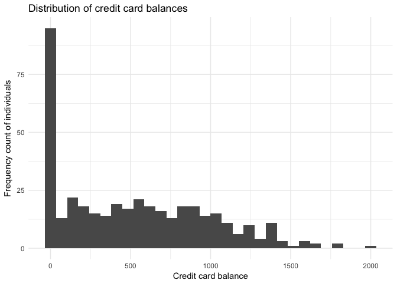

> Confused by all the `ggplot` functions? Use [this cheatsheet](https://www.rstudio.com/wp-content/uploads/2016/11/ggplot2-cheatsheet-2.1.pdf) to master the syntax and functions.

Estimate single variable linear regression model
------------------------------------------------

Suppose we want to understand the relationship between an individual's credit limit and their current balance on the credit card. We could visualize the data using a scatterplot:

``` r
credit %>% 
  ggplot(mapping = aes(x = limit, y = balance)) +
    geom_point()
```

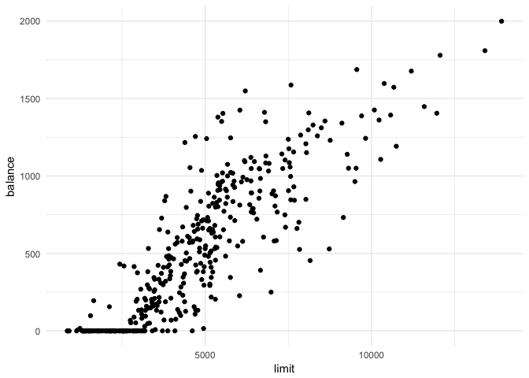

Not too bad. It seems like there is a clear positive trend. Why not estimate a simple linear model that summarizes this trend?

``` r
credit_limit <- lm(balance ~ limit, data = credit)
summary(credit_limit)
```

    ## 
    ## Call:
    ## lm(formula = balance ~ limit, data = credit)
    ## 
    ## Residuals:
    ##     Min      1Q  Median      3Q     Max 
    ## -676.95 -141.87  -11.55  134.11  776.44 
    ## 
    ## Coefficients:
    ##               Estimate Std. Error t value Pr(>|t|)    
    ## (Intercept) -2.928e+02  2.668e+01  -10.97   <2e-16 ***
    ## limit        1.716e-01  5.066e-03   33.88   <2e-16 ***
    ## ---
    ## Signif. codes:  0 '***' 0.001 '**' 0.01 '*' 0.05 '.' 0.1 ' ' 1
    ## 
    ## Residual standard error: 233.6 on 398 degrees of freedom
    ## Multiple R-squared:  0.7425, Adjusted R-squared:  0.7419 
    ## F-statistic:  1148 on 1 and 398 DF,  p-value: < 2.2e-16

``` r
grid <- credit %>% 
  data_grid(limit) 
grid
```

    ## # A tibble: 387 × 1
    ##    limit
    ##    <int>
    ## 1    855
    ## 2    886
    ## 3    905
    ## 4    906
    ## 5   1134
    ## 6   1160
    ## 7   1233
    ## 8   1300
    ## 9   1311
    ## 10  1335
    ## # ... with 377 more rows

``` r
grid <- grid %>% 
  add_predictions(credit_limit) 
grid
```

    ## # A tibble: 387 × 2
    ##    limit       pred
    ##    <int>      <dbl>
    ## 1    855 -146.04062
    ## 2    886 -140.71987
    ## 3    905 -137.45876
    ## 4    906 -137.28712
    ## 5   1134  -98.15382
    ## 6   1160  -93.69125
    ## 7   1233  -81.16173
    ## 8   1300  -69.66203
    ## 9   1311  -67.77402
    ## 10  1335  -63.65473
    ## # ... with 377 more rows

``` r
ggplot(credit, aes(x = limit)) +
  geom_point(aes(y = balance)) +
  geom_line(aes(y = pred), data = grid, color = "red", size = 1)
```

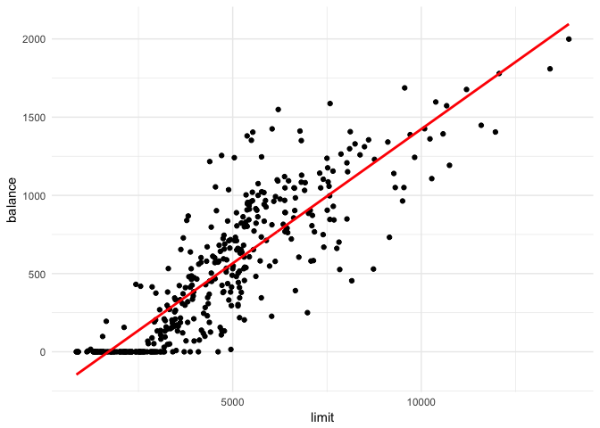

This is not too bad of a first model. Clearly it is not perfect as it suggests that individuals with a limit below approximately $1,000 have a negative balance, but it is a good first cut.

Extracting model statistics
---------------------------

Model objects are not very pretty in R. `lm()` objects are stored in [**lists**](http://r4ds.had.co.nz/vectors.html#lists). One important feature of lists is that they are **recursive** - lists can store other lists. We use the `str()` to print the structure of an object in R:

``` r
str(credit_limit)
```

    ## List of 12
    ##  $ coefficients : Named num [1:2] -292.79 0.172
    ##   ..- attr(*, "names")= chr [1:2] "(Intercept)" "limit"
    ##  $ residuals    : Named num [1:400] 6.87 55.26 -341.54 -374.45 -216.72 ...
    ##   ..- attr(*, "names")= chr [1:400] "1" "2" "3" "4" ...
    ##  $ effects      : Named num [1:400] -10400 -7914 -345 -380 -217 ...
    ##   ..- attr(*, "names")= chr [1:400] "(Intercept)" "limit" "" "" ...
    ##  $ rank         : int 2
    ##  $ fitted.values: Named num [1:400] 326 848 922 1338 548 ...
    ##   ..- attr(*, "names")= chr [1:400] "1" "2" "3" "4" ...
    ##  $ assign       : int [1:2] 0 1
    ##  $ qr           :List of 5
    ##   ..$ qr   : num [1:400, 1:2] -20 0.05 0.05 0.05 0.05 0.05 0.05 0.05 0.05 0.05 ...
    ##   .. ..- attr(*, "dimnames")=List of 2
    ##   .. .. ..$ : chr [1:400] "1" "2" "3" "4" ...
    ##   .. .. ..$ : chr [1:2] "(Intercept)" "limit"
    ##   .. ..- attr(*, "assign")= int [1:2] 0 1
    ##   ..$ qraux: num [1:2] 1.05 1.04
    ##   ..$ pivot: int [1:2] 1 2
    ##   ..$ tol  : num 1e-07
    ##   ..$ rank : int 2
    ##   ..- attr(*, "class")= chr "qr"
    ##  $ df.residual  : int 398
    ##  $ xlevels      : Named list()
    ##  $ call         : language lm(formula = balance ~ limit, data = credit)
    ##  $ terms        :Classes 'terms', 'formula'  language balance ~ limit
    ##   .. ..- attr(*, "variables")= language list(balance, limit)
    ##   .. ..- attr(*, "factors")= int [1:2, 1] 0 1
    ##   .. .. ..- attr(*, "dimnames")=List of 2
    ##   .. .. .. ..$ : chr [1:2] "balance" "limit"
    ##   .. .. .. ..$ : chr "limit"
    ##   .. ..- attr(*, "term.labels")= chr "limit"
    ##   .. ..- attr(*, "order")= int 1
    ##   .. ..- attr(*, "intercept")= int 1
    ##   .. ..- attr(*, "response")= int 1
    ##   .. ..- attr(*, ".Environment")=<environment: R_GlobalEnv> 
    ##   .. ..- attr(*, "predvars")= language list(balance, limit)
    ##   .. ..- attr(*, "dataClasses")= Named chr [1:2] "numeric" "numeric"
    ##   .. .. ..- attr(*, "names")= chr [1:2] "balance" "limit"
    ##  $ model        :'data.frame':   400 obs. of  2 variables:
    ##   ..$ balance: int [1:400] 333 903 580 964 331 1151 203 872 279 1350 ...
    ##   ..$ limit  : int [1:400] 3606 6645 7075 9504 4897 8047 3388 7114 3300 6819 ...
    ##   ..- attr(*, "terms")=Classes 'terms', 'formula'  language balance ~ limit
    ##   .. .. ..- attr(*, "variables")= language list(balance, limit)
    ##   .. .. ..- attr(*, "factors")= int [1:2, 1] 0 1
    ##   .. .. .. ..- attr(*, "dimnames")=List of 2
    ##   .. .. .. .. ..$ : chr [1:2] "balance" "limit"
    ##   .. .. .. .. ..$ : chr "limit"
    ##   .. .. ..- attr(*, "term.labels")= chr "limit"
    ##   .. .. ..- attr(*, "order")= int 1
    ##   .. .. ..- attr(*, "intercept")= int 1
    ##   .. .. ..- attr(*, "response")= int 1
    ##   .. .. ..- attr(*, ".Environment")=<environment: R_GlobalEnv> 
    ##   .. .. ..- attr(*, "predvars")= language list(balance, limit)
    ##   .. .. ..- attr(*, "dataClasses")= Named chr [1:2] "numeric" "numeric"
    ##   .. .. .. ..- attr(*, "names")= chr [1:2] "balance" "limit"
    ##  - attr(*, "class")= chr "lm"

While there are lots of important statistics and information stored inside the `credit_limit` object, it is very difficult to access them. Instead, we might prefer this information could be retrieved in a [**tidy** data frame](http://r4ds.had.co.nz/tidy-data.html). [**Data frames** (and their variants **tibles**)](http://r4ds.had.co.nz/tibbles.html) are one of the most common data objects in R. There are three rules which make a data frame tidy:

1.  Each variable must have its own column.
2.  Each observation must have its own row.
3.  Each value must have its own cell.

In order to extract model statistics and use them in a tidy manner, we can use a set of functions from the [`broom`](https://github.com/tidyverse/broom) package. For these functions, the input is always the model object generated by `lm()`, not the original data frame.

### `tidy()`

`tidy()` constructs a data frame that summarizes the model's statistical findings. This includes **coefficients** and **p-values** for each parameter in a model. Different models will report different elements.

``` r
library(broom)

tidy(credit_limit)
```

    ##          term     estimate    std.error statistic       p.value
    ## 1 (Intercept) -292.7904955 26.683414516 -10.97275  1.184152e-24
    ## 2       limit    0.1716373  0.005066234  33.87867 2.530581e-119

``` r
tidy(credit_limit) %>%
  str()
```

    ## 'data.frame':    2 obs. of  5 variables:
    ##  $ term     : chr  "(Intercept)" "limit"
    ##  $ estimate : num  -292.79 0.172
    ##  $ std.error: num  26.68341 0.00507
    ##  $ statistic: num  -11 33.9
    ##  $ p.value  : num  1.18e-24 2.53e-119

Notice that the structure of the resulting object is a tidy data frame. Every row contains a single parameter, every column contains a single statistic, and every cell contains exactly one value.

### `augment()`

`augment()` adds columns to the original data that was modeled. This could include predictions, residuals, and other observation-level statistics.

``` r
augment(credit_limit) %>%
  tbl_df()
```

    ## # A tibble: 400 × 9
    ##    balance limit   .fitted  .se.fit      .resid        .hat   .sigma
    ##      <int> <int>     <dbl>    <dbl>       <dbl>       <dbl>    <dbl>
    ## 1      333  3606  326.1335 13.00598    6.866470 0.003100247 233.8787
    ## 2      903  6645  847.7392 15.16512   55.260781 0.004215041 233.8625
    ## 3      580  7075  921.5432 16.63952 -341.543249 0.005074481 233.2468
    ## 4      964  9504 1338.4502 26.83292 -374.450198 0.013196114 233.1126
    ## 5      331  4897  547.7173 11.70784 -216.717257 0.002512254 233.6253
    ## 6     1151  8047 1088.3747 20.44138   62.625316 0.007658269 233.8577
    ## 7      203  3388  288.7166 13.52835  -85.716604 0.003354285 233.8393
    ## 8      872  7114  928.2371 16.78083  -56.237103 0.005161034 233.8619
    ## 9      279  3300  273.6125 13.75873    5.387477 0.003469499 233.8788
    ## 10    1350  6819  877.6041 15.74207  472.395894 0.004541860 232.6687
    ## # ... with 390 more rows, and 2 more variables: .cooksd <dbl>,
    ## #   .std.resid <dbl>

By default, `augment()` will only return statistics to the original data used to estimate the model, whereas `add_predictions()` is used to generate predictions for new data. For linear models, `augment()` generates columns for:

-   `.fitted` - fitted (or predicted) values based on the model
-   `se.fit` - standard errors of the fitted values
-   `.resid` - residuals (same as generated by `add_residuals()`)
-   `.hat` - diagonal of the hat matrix
-   `.sigma` - estimate of the residual standard deviation when the corresponding observation is dropped from the model
-   `.cooksd` - Cook's distance, useful for identifying **high leverage points**
-   `.std.resid` - standardized residuals (similar in concept to **studentized residuals**)

### `glance()`

`glance()` constructs a concise one-row summary of the model. This typically contains values such as *R*<sup>2</sup>, adjusted *R*<sup>2</sup>, and residual standard error that are computed once for the entire model.

``` r
glance(credit_limit)
```

    ##   r.squared adj.r.squared   sigma statistic       p.value df    logLik
    ## 1 0.7425222     0.7418753 233.585  1147.764 2.530581e-119  2 -2747.991
    ##        AIC      BIC deviance df.residual
    ## 1 5501.983 5513.957 21715657         398

For linear models, `glance()` generates several useful model metrics:

-   `r.squared` - the percent of variance explained by the model
    -   This is one of the metrics identified in ISL for evaluating model fit. It is relatively basic and we will soon consider more robust measures of fit, but it is a quick and dirty metric to compare the effectiveness of competing models of the same response variable.
-   `adj.r.squared` - *R*<sup>2</sup> adjusted based on the degrees of freedom of the model
-   `sigma` - the square root of the estimated residual variance
-   `statistic` - *F*-statistic testing the hypothesis that all parameters are equal to 0
-   `p.value` - the *p*-value from the F test
-   `df` - degrees of freedom used by the coefficients
-   `logLik` - the data's log-likelihood under the model
-   `AIC` - the Akaike Information Criterion, used to compare models
-   `BIC` - the Bayesian Information Criterion, also used to compare models
-   `deviance` - deviance of the model
-   `df.residual` - residual degrees of freedom

While `broom` may not work with every model in R, it is compatible with a wide range of common statistical models. A full list of models with which `broom` is compatible can be found on the [GitHub page for the package](https://github.com/tidyverse/broom).

Generating predicted values with confidence intervals
-----------------------------------------------------

`add_predictions()` generates predicted values for a dataset given a specified model, however it does not report the standard error of those predictions. To generate confidence intervals, we first use the `augment()` to generate predicted values for new data by using the `newdata` argument, then calculate the 95% confidence intervals manually. For example, what is the predicted credit card balance and 95% confidence interval for an individual with a credit limit of $2,000, $5,000, and $10,000?

``` r
# create data frame with new values
(pred_data <- data_frame(limit = c(2000, 5000, 10000)))
```

    ## # A tibble: 3 × 1
    ##   limit
    ##   <dbl>
    ## 1  2000
    ## 2  5000
    ## 3 10000

``` r
# use augment to generate predictions
(pred_aug <- augment(credit_limit, newdata = pred_data))
```

    ##   limit    .fitted  .se.fit
    ## 1  2000   50.48406 18.12407
    ## 2  5000  565.39590 11.75581
    ## 3 10000 1423.58229 29.11581

``` r
# Calculate 95% confidence intervals
(pred_ci <- mutate(pred_aug,
                   ymin = .fitted - .se.fit * 1.96,
                   ymax = .fitted + .se.fit * 1.96))
```

    ##   limit    .fitted  .se.fit       ymin       ymax
    ## 1  2000   50.48406 18.12407   14.96088   86.00725
    ## 2  5000  565.39590 11.75581  542.35450  588.43729
    ## 3 10000 1423.58229 29.11581 1366.51530 1480.64927

``` r
# do it in one piped operation
(pred_ci <- augment(credit_limit, newdata = data_frame(limit = c(2000, 5000, 10000))) %>%
  mutate(ymin = .fitted - .se.fit * 1.96,
         ymax = .fitted + .se.fit * 1.96))
```

    ##   limit    .fitted  .se.fit       ymin       ymax
    ## 1  2000   50.48406 18.12407   14.96088   86.00725
    ## 2  5000  565.39590 11.75581  542.35450  588.43729
    ## 3 10000 1423.58229 29.11581 1366.51530 1480.64927

Estimating multiple linear regression model
-------------------------------------------

`lm()` allows you to estimate linear regression models with multiple variables. For instance, say we want to evaluate an individual's credit balance using both their credit limit and income.

``` r
credit_limit_income <- lm(balance ~ limit + income, data = credit)
tidy(credit_limit_income)
```

    ##          term     estimate    std.error statistic       p.value
    ## 1 (Intercept) -385.1792604 19.464801525 -19.78850  3.878764e-61
    ## 2       limit    0.2643216  0.005879729  44.95471 7.717386e-158
    ## 3      income   -7.6633230  0.385072058 -19.90101  1.260933e-61

Now that we have two predictor variables in our model, remember how to accurately interpret these results. *β*<sub>*j*</sub> is interpreted as the **average** effect of *Y* of a one unit increase in *X*<sub>*j*</sub>, **holding all other predictors constant**. So the parameter for credit limit tells us the estimated effect on credit card balance of a $1 increase in the individual's credit limit, after controlling for the effects of income.

Qualitative predictors
----------------------

Predictor variables are frequently **quantitative**, but this is not a guarantee. In many datasets you will have **qualitiative** predictors, or variables that have discrete values. In the `credit` dataset, we have four such columns:

``` r
select(credit, gender, student, married, ethnicity)
```

    ## # A tibble: 400 × 4
    ##    gender student married        ethnicity
    ##     <chr>   <chr>   <chr>            <chr>
    ## 1    Male      No     Yes        Caucasian
    ## 2  Female     Yes     Yes            Asian
    ## 3    Male      No      No            Asian
    ## 4  Female      No      No            Asian
    ## 5    Male      No     Yes        Caucasian
    ## 6    Male      No      No        Caucasian
    ## 7  Female      No      No African American
    ## 8    Male      No      No            Asian
    ## 9  Female      No      No        Caucasian
    ## 10 Female     Yes     Yes African American
    ## # ... with 390 more rows

We can include these variables in a linear regression model and they will act as an **indicator** or **dummy** variable that takes on a value of 0 or 1.

### Qualitative predictors with 2 levels

For instance, let's use gender to explain an individual's credit card balance.

``` r
gender <- lm(balance ~ gender, data = credit)
tidy(gender)
```

    ##          term  estimate std.error  statistic      p.value
    ## 1 (Intercept) 529.53623  31.98819 16.5541153 3.312981e-47
    ## 2  genderMale -19.73312  46.05121 -0.4285039 6.685161e-01

In the background, R converts the column into a series of 0s and 1s. For this column, it automatically converted `Female` to 0 and `Male` to 1 (it transform the columns alphabetically). If we wish to override this order, we can assign an ordering using the `factor()` function:[1]

``` r
credit %>%
  mutate(gender = factor(gender, levels = c("Male", "Female"))) %>%
  lm(balance ~ gender, data = .) %>%
  tidy()
```

    ##           term  estimate std.error  statistic      p.value
    ## 1  (Intercept) 509.80311  33.12808 15.3888531 2.908941e-42
    ## 2 genderFemale  19.73312  46.05121  0.4285039 6.685161e-01

Note that the only difference is the directionality of the `genderFemale` parameter is reversed from the previous model.

Or we could convert the column directly to 0s and 1s:

``` r
credit %>%
  mutate(female = ifelse(gender == "Female", 1, 0)) %>%
  lm(balance ~ female, data = .) %>%
  tidy()
```

    ##          term  estimate std.error  statistic      p.value
    ## 1 (Intercept) 509.80311  33.12808 15.3888531 2.908941e-42
    ## 2      female  19.73312  46.05121  0.4285039 6.685161e-01

Frequently your data will originally be coded using this 0/1 scheme. If you don't like this, you can always convert it back using the `factor()` approach outlined above:

``` r
credit %>%
  select(gender) %>%
  mutate(gender_f = factor(gender, levels = c("Male", "Female")),
         female = ifelse(gender == "Female", 1, 0),
         female_f = factor(female, levels = 0:1, labels = c("Male", "Female")))
```

    ## # A tibble: 400 × 4
    ##    gender gender_f female female_f
    ##     <chr>   <fctr>  <dbl>   <fctr>
    ## 1    Male     Male      0     Male
    ## 2  Female   Female      1   Female
    ## 3    Male     Male      0     Male
    ## 4  Female   Female      1   Female
    ## 5    Male     Male      0     Male
    ## 6    Male     Male      0     Male
    ## 7  Female   Female      1   Female
    ## 8    Male     Male      0     Male
    ## 9  Female   Female      1   Female
    ## 10 Female   Female      1   Female
    ## # ... with 390 more rows

### Qualitative predictors with more than 2 levels

If your qualitative predictor uses more than two levels (for instance, `ethnicity`), you will include the column in your linear regression model and R will automatically convert it into a series of dummy variables, using 0/1 switches for each dummy variable. R will always omit one of the levels and leave it out as the **baseline**.[2]

``` r
ethnicity <- lm(balance ~ ethnicity, data = credit)
tidy(ethnicity)
```

    ##                 term  estimate std.error  statistic      p.value
    ## 1        (Intercept) 531.00000  46.31868 11.4640565 1.774117e-26
    ## 2     ethnicityAsian -18.68627  65.02107 -0.2873880 7.739652e-01
    ## 3 ethnicityCaucasian -12.50251  56.68104 -0.2205766 8.255355e-01

Here R created dummy variables for "Asian" and "Caucasian", leaving out "African American" as the baseline category.

Extending the linear model
--------------------------

Remember that because it is a basic functional form, the linear model is very unforgiving in a key assumption: it assumes an **additive** and **linear** shape. The additive assumption requires the effect of changes in any of the predictor variables *X*<sub>*j*</sub> on the response variable *Y* to be independent of all other predictors. The linear assumption presumes that the change in *Y* associated with a one-unit change in *X*<sub>*j*</sub> is constant regardless of the value of *X*<sub>*j*</sub>. While other, more complicated functional forms can be used to relax this assumption, we can also directly alter these assumptions based on how we specify our model

### Removing the additive assumption: interaction terms

#### Two quantitative variables

Let's evaluate the effect of income and age on an individual's credit card balance.

``` r
income_age <- lm(balance ~ income + age, data = credit)
tidy(income_age)
```

    ##          term   estimate  std.error statistic      p.value
    ## 1 (Intercept) 359.672743 70.3582998  5.112016 4.966220e-07
    ## 2      income   6.235879  0.5867574 10.627696 2.197302e-23
    ## 3         age  -2.185067  1.1988446 -1.822644 6.910931e-02

Both are statistically significant with sizeable effects on the response variable. However the effects are completely independent from one another. By this I mean, if I plot the relationship between income and predicted balance, the value for limit does not alter this relationship other than to adjust the intercept.

``` r
credit %>%
  data_grid(income, age) %>%
  add_predictions(income_age) %>%
  ggplot(aes(income, pred, group = age)) +
  geom_line(alpha = .5)
```

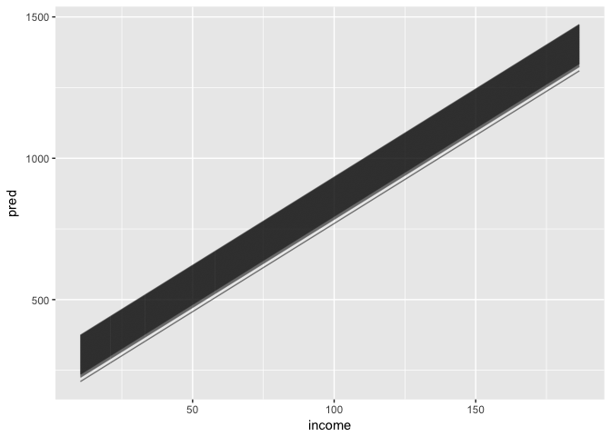

But is this really a safe assumption? After all, an individual's income is based (in part) on their age. The older your are and longer you have worked, the higher your expected income. So wouldn't we expect the relationship between income and credit balance to vary based on an individual's age? That is, **we expect the underlying relationship to directly violate the additive assumption**.

We should therefore relax this assumption by **interacting** income and age. The new linear regression model looks like

*Y* = *β*<sub>0</sub> + *β*<sub>1</sub>*X*<sub>1</sub> + *β*<sub>2</sub>*X*<sub>2</sub> + *β*<sub>3</sub>*X*<sub>1</sub>*X*<sub>2</sub>

where *X*<sub>1</sub> is income and *X*<sub>2</sub> is age. To specify this model in R, we write the following code:

``` r
inc_age_x <- lm(balance ~ income * age, data = credit)
tidy(inc_age_x)
```

    ##          term     estimate    std.error  statistic     p.value
    ## 1 (Intercept) 429.66553527 112.85270937  3.8073125 0.000162744
    ## 2      income   4.69805044   2.02501466  2.3200081 0.020848070
    ## 3         age  -3.39437360   1.93939704 -1.7502211 0.080854625
    ## 4  income:age   0.02548648   0.03211953  0.7934884 0.427968484

Now what happens if we graph the relationship between income and predicted credit card balance, controlling for the credit limit?

``` r
credit %>%
  data_grid(income, age) %>%
  add_predictions(inc_age_x) %>%
  ggplot(aes(income, pred, group = age)) +
  geom_line(alpha = .5)
```

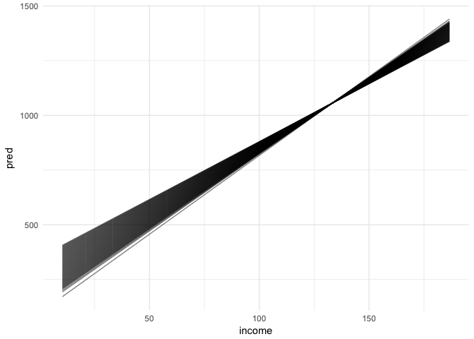

Not only have the intercepts changed, but so too have the slopes.

#### Quantitative and qualitative variable

We can also use interaction terms with a qualitative variable, such as `student`. Consider the regression model without an interaction

``` r
inc_student <- lm(balance ~ income + student, data = credit)
tidy(inc_student)
```

    ##          term   estimate  std.error statistic      p.value
    ## 1 (Intercept) 211.142964 32.4572113  6.505271 2.338288e-10
    ## 2      income   5.984336  0.5566232 10.751143 7.817642e-24
    ## 3  studentYes 382.670539 65.3108082  5.859222 9.775720e-09

``` r
credit %>%
  data_grid(income, student) %>%
  add_predictions(inc_student) %>%
  ggplot(aes(income, pred, color = student)) +
  geom_line()
```

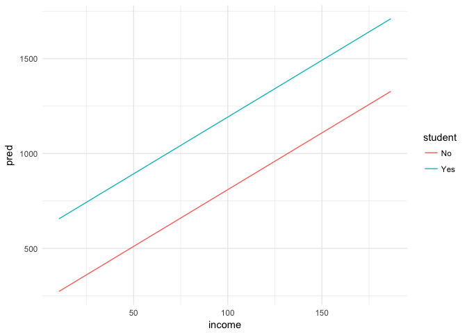

As before with the quantitative variables, the parameter for income does not change based on the value for student, only the intercept for the model shifts. However for an interactive model:

``` r
inc_student_x <- lm(balance ~ income * student, data = credit)
tidy(inc_student_x)
```

    ##                term   estimate   std.error statistic      p.value
    ## 1       (Intercept) 200.623153  33.6983706  5.953497 5.789658e-09
    ## 2            income   6.218169   0.5920936 10.502003 6.340684e-23
    ## 3        studentYes 476.675843 104.3512235  4.567995 6.586095e-06
    ## 4 income:studentYes  -1.999151   1.7312511 -1.154743 2.488919e-01

``` r
credit %>%
  data_grid(income, student) %>%
  add_predictions(inc_student_x) %>%
  ggplot(aes(income, pred, color = student)) +
  geom_line()
```

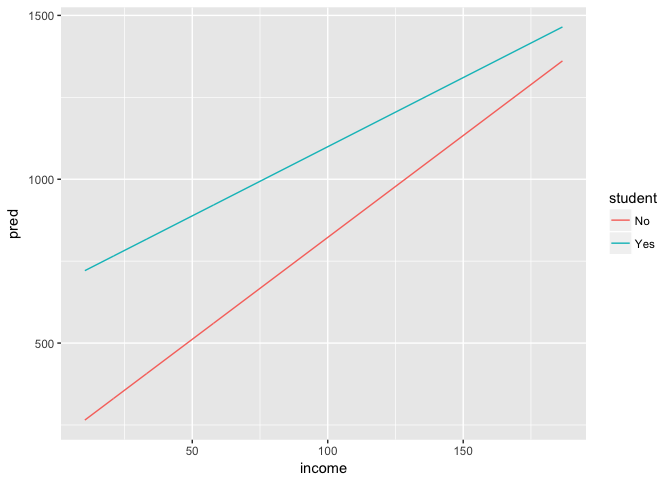

This suggests that changes in income may affect the credit card balance of students and non-students differently.

### Non-linear relationships

One way to relax the linearity assumption is to use **polynomials** in your regression model. For instance, take the `Auto` data set.

``` r
auto <- read_csv("data/Auto.csv",
                 # make sure horsepower is parsed as numeric
                 col_types = cols(horsepower = col_number())) %>%
  # remove missing data
  na.omit(horsepower)

# estimate linear model of horsepower and mpg
horse <- lm(mpg ~ horsepower, data = auto)
tidy(horse)
```

    ##          term   estimate   std.error statistic       p.value
    ## 1 (Intercept) 39.9358610 0.717498656  55.65984 1.220362e-187
    ## 2  horsepower -0.1578447 0.006445501 -24.48914  7.031989e-81

``` r
# generate predicted values
horse_pred <- auto %>%
  add_predictions(horse)

# draw the graph
ggplot(horse_pred, aes(horsepower)) +
  geom_point(aes(y = mpg), alpha = .5) +
  geom_line(aes(y = pred), color = "orange", size = 1)
```

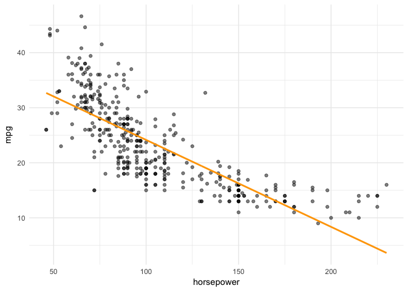

Is a linear regression line of the form mpg = *β*<sub>0</sub> + *β*<sub>1</sub>horsepower really the best fit here? The relationship appears to have a curvilinear shape to it. Instead, we can estimate a model of the form

mpg = *β*<sub>0</sub> + *β*<sub>1</sub>horsepower + *β*<sub>2</sub>horsepower<sup>2</sup>

``` r
# estimate polynomial squared model of horsepower and mpg
horse2 <- lm(mpg ~ horsepower + I(horsepower^2), data = auto)
tidy(horse2)
```

    ##              term     estimate    std.error statistic       p.value
    ## 1     (Intercept) 56.900099702 1.8004268063  31.60367 1.740911e-109
    ## 2      horsepower -0.466189630 0.0311246171 -14.97816  2.289429e-40
    ## 3 I(horsepower^2)  0.001230536 0.0001220759  10.08009  2.196340e-21

``` r
# generate predicted values
horse2_pred <- auto %>%
  add_predictions(horse2)

# draw the graph
ggplot(horse2_pred, aes(horsepower)) +
  geom_point(aes(y = mpg), alpha = .5) +
  geom_line(data = horse_pred, aes(y = pred), color = "orange", size = 1) +
  geom_line(aes(y = pred), color = "blue", size = 1)
```

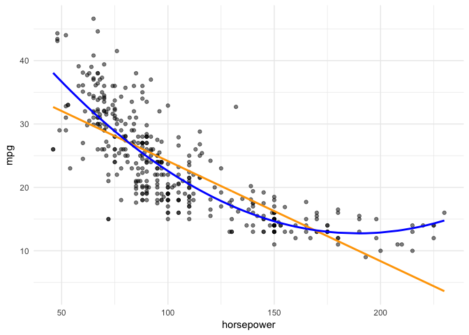

Or even a polynomial to the fifth power

mpg = *β*<sub>0</sub> + *β*<sub>1</sub>horsepower + *β*<sub>2</sub>horsepower<sup>2</sup> + *β*<sub>3</sub>horsepower<sup>3</sup> + *β*<sub>4</sub>horsepower<sup>4</sup> + *β*<sub>5</sub>horsepower<sup>5</sup>

``` r
# estimate polynomial fifth-order model of horsepower and mpg
# use the poly() function to generate the powers
horse5 <- lm(mpg ~ horsepower + poly(horsepower, degrees = 5), data = auto)
tidy(horse5)
```

    ##                             term   estimate   std.error   statistic
    ## 1                    (Intercept) 39.9358610 0.632690619  63.1206783
    ## 2                     horsepower -0.1578447 0.005683645 -27.7717434
    ## 3 poly(horsepower, degrees = 5)2 44.0895278 4.325898537  10.1919930
    ## 4 poly(horsepower, degrees = 5)3 -3.9488485 4.325898537  -0.9128389
    ## 5 poly(horsepower, degrees = 5)4 -5.1878103 4.325898537  -1.1992446
    ## 6 poly(horsepower, degrees = 5)5 13.2721869 4.325898537   3.0680763
    ##         p.value
    ## 1 1.669357e-205
    ## 2  4.617361e-94
    ## 3  9.240203e-22
    ## 4  3.618971e-01
    ## 5  2.311685e-01
    ## 6  2.306428e-03

``` r
# generate predicted values
horse5_pred <- auto %>%
  add_predictions(horse5)

# draw the graph
ggplot(horse5_pred, aes(horsepower)) +
  geom_point(aes(y = mpg), alpha = .5) +
  geom_line(data = horse_pred, aes(y = pred), color = "orange", size = 1) +
  geom_line(data = horse2_pred, aes(y = pred), color = "blue", size = 1) +
  geom_line(aes(y = pred), color = "green", size = 1)
```

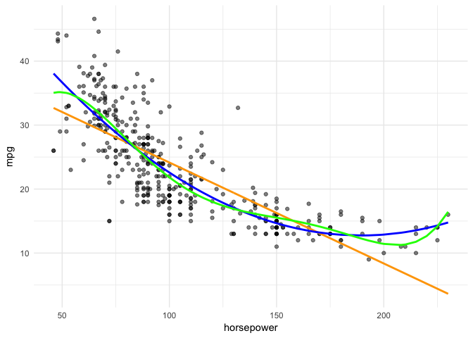

How do we know which model is most appropriate? One thing we could do is compare model fit statistics:

``` r
# combine models into a list and use a map() function to apply
# glance() to each model and store the result in a tidy data frame
list("degree_1" = horse,
     "degree_2" = horse2,
     "degree_5" = horse5) %>%
  map_df(glance, .id = "id")
```

    ##         id r.squared adj.r.squared    sigma statistic      p.value df
    ## 1 degree_1 0.6059483     0.6049379 4.905757  599.7177 7.031989e-81  2
    ## 2 degree_2 0.6875590     0.6859527 4.373921  428.0176 5.399723e-99  3
    ## 3 degree_5 0.6967390     0.6928108 4.325899  177.3662 1.162963e-97  6
    ##      logLik      AIC      BIC deviance df.residual
    ## 1 -1178.662 2363.324 2375.237 9385.916         390
    ## 2 -1133.177 2274.354 2290.239 7442.029         389
    ## 3 -1127.332 2268.663 2296.462 7223.372         386

Based on the *R*<sup>2</sup> values, the fifth-order polynomial explains the most variation in `mpg`. But the fifth-order polynomial is also more complicated and throws extra bends and curves into the predicted values for `mpg`. Ultimately whatever form we specify for the model, we are still making an **assumption** that the true relationship between horsepower and mileage takes on this form - ultimately it is untestable.

Session Info
============

``` r
devtools::session_info()
```

    ##  setting  value                       
    ##  version  R version 3.3.2 (2016-10-31)
    ##  system   x86_64, darwin13.4.0        
    ##  ui       X11                         
    ##  language (EN)                        
    ##  collate  en_US.UTF-8                 
    ##  tz       America/Chicago             
    ##  date     2017-02-08                  
    ## 
    ##  package    * version date       source        
    ##  assertthat   0.1     2013-12-06 CRAN (R 3.3.0)
    ##  backports    1.0.5   2017-01-18 CRAN (R 3.3.2)
    ##  broom      * 0.4.1   2016-06-24 CRAN (R 3.3.0)
    ##  colorspace   1.3-2   2016-12-14 CRAN (R 3.3.2)
    ##  DBI          0.5-1   2016-09-10 CRAN (R 3.3.0)
    ##  devtools     1.12.0  2016-06-24 CRAN (R 3.3.0)
    ##  digest       0.6.12  2017-01-27 CRAN (R 3.3.2)
    ##  dplyr      * 0.5.0   2016-06-24 CRAN (R 3.3.0)
    ##  evaluate     0.10    2016-10-11 CRAN (R 3.3.0)
    ##  foreign      0.8-67  2016-09-13 CRAN (R 3.3.2)
    ##  ggplot2    * 2.2.1   2016-12-30 CRAN (R 3.3.2)
    ##  gtable       0.2.0   2016-02-26 CRAN (R 3.3.0)
    ##  htmltools    0.3.5   2016-03-21 CRAN (R 3.3.0)
    ##  knitr        1.15.1  2016-11-22 cran (@1.15.1)
    ##  lattice      0.20-34 2016-09-06 CRAN (R 3.3.2)
    ##  lazyeval     0.2.0   2016-06-12 CRAN (R 3.3.0)
    ##  magrittr     1.5     2014-11-22 CRAN (R 3.3.0)
    ##  memoise      1.0.0   2016-01-29 CRAN (R 3.3.0)
    ##  mnormt       1.5-5   2016-10-15 CRAN (R 3.3.0)
    ##  modelr     * 0.1.0   2016-08-31 CRAN (R 3.3.0)
    ##  munsell      0.4.3   2016-02-13 CRAN (R 3.3.0)
    ##  nlme         3.1-130 2017-01-24 CRAN (R 3.3.2)
    ##  plyr         1.8.4   2016-06-08 CRAN (R 3.3.0)
    ##  psych        1.6.12  2017-01-08 CRAN (R 3.3.2)
    ##  purrr        0.2.2   2016-06-18 CRAN (R 3.3.0)
    ##  R6           2.2.0   2016-10-05 CRAN (R 3.3.0)
    ##  Rcpp         0.12.9  2017-01-14 CRAN (R 3.3.2)
    ##  reshape2     1.4.2   2016-10-22 CRAN (R 3.3.0)
    ##  rmarkdown    1.3     2016-12-21 CRAN (R 3.3.2)
    ##  rprojroot    1.2     2017-01-16 CRAN (R 3.3.2)
    ##  scales       0.4.1   2016-11-09 CRAN (R 3.3.1)
    ##  stringi      1.1.2   2016-10-01 CRAN (R 3.3.0)
    ##  stringr      1.1.0   2016-08-19 cran (@1.1.0) 
    ##  tibble       1.2     2016-08-26 cran (@1.2)   
    ##  tidyr      * 0.6.1   2017-01-10 CRAN (R 3.3.2)
    ##  withr        1.0.2   2016-06-20 CRAN (R 3.3.0)
    ##  yaml         2.1.14  2016-11-12 cran (@2.1.14)

[1] See [R for Data Science](http://r4ds.had.co.nz/factors.html) for more on working with factor variables.

[2] If you do not omit a category, your model will be perfectly multicollinear and you will not be able to estimate it. Alternatively, you can omit the intercept and keep all the original levels.
