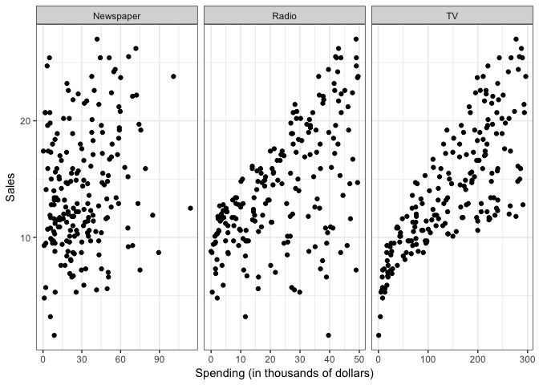
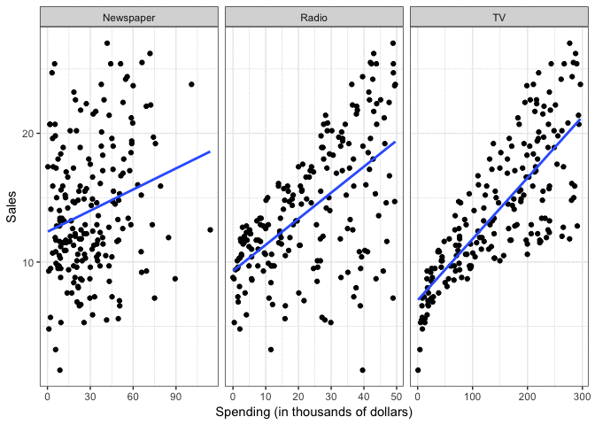
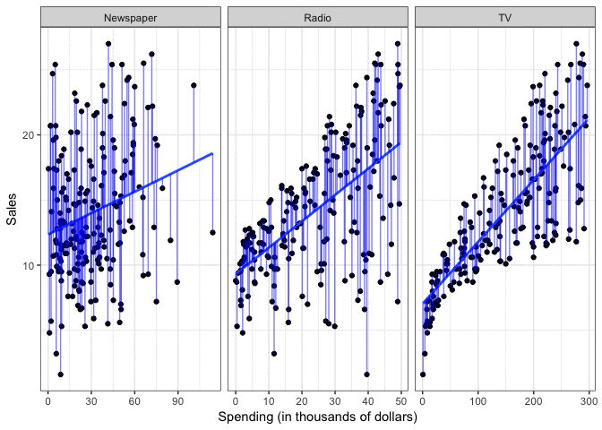
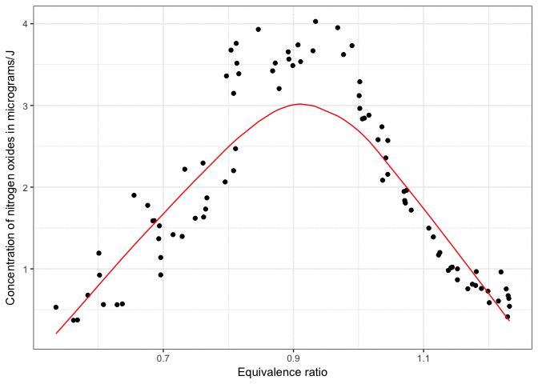
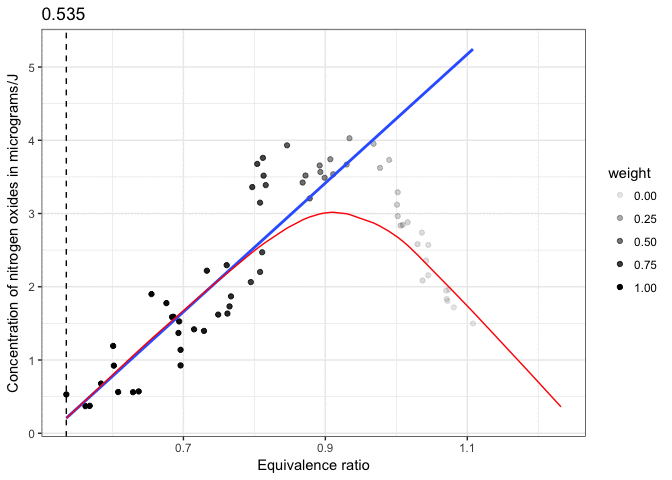
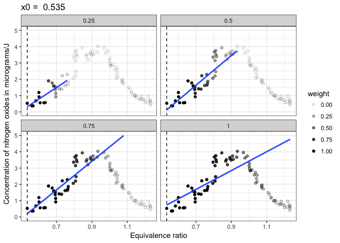

Statistical learning: the basics
================
MACS 30100 - Perspectives on Computational Modeling

-   [Objectives](#objectives)
-   [Statistical learning](#statistical-learning)
    -   [What is statistical learning?](#what-is-statistical-learning)
    -   [Why estimate *f*?](#why-estimate-f)
        -   [Prediction](#prediction)
        -   [Inference](#inference)
    -   [How do we estimate *f*?](#how-do-we-estimate-f)
        -   [Parametric methods](#parametric-methods)
        -   [Non-parametric methods](#non-parametric-methods)
    -   [Supervised vs. unsupervised learning](#supervised-vs.-unsupervised-learning)
-   [Statistical learning vs. machine learning](#statistical-learning-vs.-machine-learning)
-   [Classification vs. regression](#classification-vs.-regression)
-   [Model estimation vs. statistical learning](#model-estimation-vs.-statistical-learning)
    -   [Using canned packages](#using-canned-packages)
-   [Acknowledgments](#acknowledgments)
-   [Session Info](#session-info)

``` r
library(tidyverse)
theme_set(theme_bw())
```

Objectives
==========

-   Define statistical learning
-   Review the major goals of statistical learning
-   Explain the difference between parametric and non-parametric methods
-   Identify the difference between statistical learning and machine learning
-   Distinguish regression from classification
-   Connect model estimation to statistical learning

Statistical learning
====================

What is statistical learning?
-----------------------------

**Statistical models** attempt to summarize relationships between variables by reducing the dimensionality of the data. For example, here we have some simulated data on sales of [Shamwow](https://www.shamwow.com/) in 200 different markets.


Our goal is to improve sales of the Shamwow. Since we cannot directly increase sales of the product (unless we go out and buy it ourselves), our only option is to increase advertising across three potential mediums: newspaper, radio, and TV.

In this example, the advertising budgets are our **input variables**, also called **independent variables**, **features**, or **predictors**. The sales of Shamwows is the **output**, also called the **dependent variable** or **response**.

By plotting the variables against one another using a scatterplot, we can see there is some sort of relationship between each medium's advertising spending and Shamwow sales:

``` r
# get advertising data
(advertising <- read_csv("http://cfss.uchicago.edu/data/Advertising.csv") %>%
  tbl_df() %>%
  # remove id column
  select(-X1))
```

    ## # A tibble: 200 × 4
    ##       TV Radio Newspaper Sales
    ##    <dbl> <dbl>     <dbl> <dbl>
    ## 1  230.1  37.8      69.2  22.1
    ## 2   44.5  39.3      45.1  10.4
    ## 3   17.2  45.9      69.3   9.3
    ## 4  151.5  41.3      58.5  18.5
    ## 5  180.8  10.8      58.4  12.9
    ## 6    8.7  48.9      75.0   7.2
    ## 7   57.5  32.8      23.5  11.8
    ## 8  120.2  19.6      11.6  13.2
    ## 9    8.6   2.1       1.0   4.8
    ## 10 199.8   2.6      21.2  10.6
    ## # ... with 190 more rows

``` r
# plot separate facets for relationship between ad spending and sales
plot_ad <- advertising %>%
  gather(method, spend, -Sales) %>%
  ggplot(aes(spend, Sales)) +
  facet_wrap(~ method, scales = "free_x") +
  geom_point() +
  labs(x = "Spending (in thousands of dollars)")
plot_ad
```



But there seems to be a lot of noise in the data. How can we summarize this? We can do so by estimating a mathematical equation following the general form:

*Y* = *f*(*X*)+*ϵ*

where *f* is some fixed, unknown function of the relationship between the independent variable(s) *X* and the dependent variable *Y*, with some random error *ϵ*.

Statistical learning refers to the set of approaches for estimating *f*. There are many potential approaches to defining the functional form of *f*. One approach widely used is called **least squares** - it means that the overall solution minimizes the sum of the squares of the errors made in the results of the equation. The errors are simply the vertical difference between the actual values for *y* and the predicted values for *y*. Applied here, the results would look like:

``` r
plot_ad +
  geom_smooth(method = "lm", se = FALSE)
```



However statistical learning (and machine learning) allows us to use a wide range of functional forms beyond a simple linear model.

Why estimate *f*?
-----------------

There are two major goals of statistical modeling: prediction and inference.

### Prediction

Under a system of **prediction**, we use our knowledge of the relationship between *X* and *Y* to predict *Y* for given values of *X*. Often the function *f* is treated as a **black box** - we don't care what the function is, as long as it makes accurate predictions. If we are trying to boost sales of Shamwow, we may not care why specific factors drive an increase in sales - we just want to know how to adjust our advertising budgets to maximize sales.

### Inference

Under a system of **inference**, we use our knowledge of *X* and *Y* to understand the relationship between the variables. Here we are most interested in the explanation, not the prediction. So in the Shamwow example, we may not care about actual sales of the product - instead, we may be economists who wish to understand how advertising spending influences product sales. We don't care about the actual product, we simply want to learn more about the process and **generalize** it to a wider range of settings.

How do we estimate *f*?
-----------------------

There are two major approaches to estimating *f*: parametric and non-parametric methods.

### Parametric methods

Parametric methods involve a two-stage process:

1.  First make an assumption about the functional form of *f*. For instance, OLS assumes that the relationship between *X* and *Y* is **linear**. This greatly simplifies the problem of estimating the model because we know a great deal about the properties of linear models.
2.  After a model has been selected, we need to **fit** or **train** the model using the actual data. We demonstrated this previously with ordinary least squares. The estimation procedure minimizes the sum of the squares of the differences between the observed responses *Y* and those predicted by a linear function $\\hat{Y}$.

``` r
method_model <- function(df) {
  lm(Sales ~ spend, data = df)
}

ad_pred <- advertising %>%
  gather(method, spend, -Sales) %>%
  group_by(method) %>%
  nest() %>%
  mutate(model = map(data, method_model),
         pred = map(model, broom::augment)) %>%
  unnest(pred)

plot_ad +
  geom_smooth(method = "lm", se = FALSE) +
  geom_linerange(data = ad_pred,
                 aes(ymin = Sales, ymax = .fitted),
                 color = "blue",
                 alpha = .5) 
```



This is only one possible estimation procedure, but is popular because it is relatively intuitive. This model-based approach is referred to as **parametric**, because it simplifies the problem of estimating *f* to estimating a set of parameters in the function:

*Y* = *β*<sub>0</sub> + *β*<sub>1</sub>*X*<sub>1</sub>

where *Y* is the sales, *X*<sub>1</sub> is the advertising spending in a given medium (newspaper, radio, or TV), and *β*<sub>0</sub> and *β*<sub>1</sub> are parameters defining the intercept and slope of the line.

The downside to parametric methods is that they assume a specific functional form of the relationship between the variables. Sometimes relationships really are linear - often however they are not. They could be curvilinear, parbolic, interactive, etc. Unless we know this *a priori* or test for all of these potential functional forms, it is possible our parametric method will not accurately summarize the relationship between *X* and *Y*.

### Non-parametric methods

Non-parametric methods do not make any assumptions about the functional form of *f*. Instead, they use the data itself to estimate *f* so that it gets as close as possible to the data points without becoming overly complex. By avoiding any assumptions about the functional form, non-parametric methods avoid the issues caused by parametic models. However, by doing so non-parametric methods require a large set of observations to avoid **overfitting** the data and obtain an accurate estimate of *f*.

One non-parametric method is **locally weighted scatterplot smoothing** (LOWESS or LOESS). This method estimates a regression line based on localized subsets of the data, building up the global function *f* point-by-point. Here is an example of a LOESS on the `ethanol` dataset in the `lattice` package:



The LOESS is built up point-by-point:



One important argument you can control with LOESS is the **span**, or how smooth the LOESS function will become. A larger span will result in a smoother curve, but may not be as accurate.



Supervised vs. unsupervised learning
------------------------------------

All the examples above implement **supervised** learning. That is, for each observation we have both the predictor measurements and the response measurements (i.e. an *X* and *Y*). We seek to fit a model that summarizes the relationship between the predictors and response.

In **unsupervised** learning, all we have is a set of measurements *X* for a series of observations, but no corresponding response *Y*. Without an outcome measure, we cannot fit a linear regression model or employ a similar method. That does not mean we cannot use statistical learning to understand the data better. One example of unsupervised learning is **cluster analysis**. The goal is to determine whether the observations fall into distinct categories. [Latent Direchlet allocation (LDA)](https://en.wikipedia.org/wiki/Latent_Dirichlet_allocation) is an example of cluster analysis applied to text data. In LDA, the individual words are the features or measurements we use to determine the best fitting clusters.

Statistical learning vs. machine learning
=========================================

I prefer to use the term **statistical learning**, but the field of statistical learning is strongly related to that of **machine learning**. Statistical learning is a subfield of statistics that focuses predominantly on **inference**. It is ues to identify underlying relationships between variables and emphasizes models and their interpretability. People employing statistical learning methods are usually concerned with uncertainty and precision of their estimates.

Machine learning is a subfield of computer science and focuses more strongly on **prediction**. It typically employs larger scale applications (think of predictive analytics at Google or Netflix) and emphasizes prediction accuracy. Machine learning is happy to sacrifice model interpretability in exchange for more accurate predictions.

In truth, both are quite similar approaches to inference and prediction. Both use the same major methods of modeling (parametric and non-parametric). I think of them as different languages, speaking the same thing.

Classification vs. regression
=============================

Variables can be classified as **quantitative** or **qualitative**. Quantitative variables take on numeric values. In contrast, qualitative variables take on different **classes**, or discrete categories. Qualitative variables can have any number of classes, though binary categories are frequent:

-   Yes/no
-   Male/female

Problems with a quantitative dependent variable are typically called **regression** problems, whereas qualitative dependent variables are called **classification** problems. Part of this distinction is merely semantic, but different methods may be employed depending on the type of response variable. For instance, you would not use linear regression on a qualitative response variable. Conceptually, how would you define a linear function for a response variable that takes on the values "male" or "female"? It doesn't make any conceptual sense. Instead, you can employ classification methods such as **logistic regression** to estimate the probability that based on a set of predictors a specific observation is part of a response class.

That said, whether *predictors* are qualitative or quantitative is not important in determining whether the problem is one of regression or classification. As long as qualitative predictors are properly coded before the analysis is conducted, they can be used for either type of problem.

Model estimation vs. statistical learning
=========================================

How exactly does statistical learning complement what you learned in the first half of the course? Model estimation procedures such as [**maximum likelihood**](https://github.com/UC-MACSS/persp-model/blob/master/demos/MLE/MLest.ipynb) or [**generalized method of moments**](https://github.com/UC-MACSS/persp-model/blob/master/demos/GMM/GMMest.ipynb) are general procedures that can be applied to any **data generating process** (DGP). The functional form of that DGP was agnostic - you could apply it to a normal distribution, log-normal distribution, etc. In the second half of this course we will focus instead on the functional form of the DGP, how to specify it, and how to estimate it.

Using canned packages
---------------------

At this point we also shift away from writing our own functions to perform all the necessary calculations to relying on packages written to perform specific methods of analysis. In R that means relying on base functions such as `lm()` or `glm()` or the [`caret`](http://caret.r-forge.r-project.org/) package. In Python that typically means [`scikit-learn`](http://scikit-learn.org/). Could I require you to estimate a linear regression model using matrix algebra, or a logistic regression model by writing your own optimization function? I could, and in fact you already have [done](https://github.com/UC-MACSS/persp-model/blob/master/assignments/PS2/PS2.pdf) [this](https://github.com/UC-MACSS/persp-model/blob/master/assignments/PS3/PS3.pdf) [extensively](https://github.com/UC-MACSS/persp-model/blob/master/assignments/PS4/PS4.pdf). It is great to know how to do this, but in most applied research, either in academia, industry, or government, you will rely on existing packages to estimate your models. Now we will start to develop that part of your toolkit and focus on how the methods work and how to use these methods to estimate models, interpret them, and generate predictions.

Acknowledgments
===============

-   For more information on statistical learning and the math behind these methods, see the awesome book [*An Introduction to Statistical Learning*](http://link.springer.com.proxy.uchicago.edu/book/10.1007%2F978-1-4614-7138-7)
-   This page is derived in part from ["Creating a LOESS animation with `gganimate`"](http://varianceexplained.org/files/loess.html) by David Robinson.

Session Info
============

``` r
devtools::session_info()
```

    ##  setting  value                       
    ##  version  R version 3.3.2 (2016-10-31)
    ##  system   x86_64, darwin13.4.0        
    ##  ui       X11                         
    ##  language (EN)                        
    ##  collate  en_US.UTF-8                 
    ##  tz       America/Chicago             
    ##  date     2017-02-08                  
    ## 
    ##  package   * version date       source        
    ##  animation * 2.4     2015-08-16 cran (@2.4)   
    ##  backports   1.0.5   2017-01-18 CRAN (R 3.3.2)
    ##  devtools    1.12.0  2016-06-24 CRAN (R 3.3.0)
    ##  digest      0.6.12  2017-01-27 CRAN (R 3.3.2)
    ##  evaluate    0.10    2016-10-11 CRAN (R 3.3.0)
    ##  htmltools   0.3.5   2016-03-21 CRAN (R 3.3.0)
    ##  knitr     * 1.15.1  2016-11-22 cran (@1.15.1)
    ##  magrittr    1.5     2014-11-22 CRAN (R 3.3.0)
    ##  memoise     1.0.0   2016-01-29 CRAN (R 3.3.0)
    ##  Rcpp        0.12.9  2017-01-14 CRAN (R 3.3.2)
    ##  rmarkdown   1.3     2016-12-21 CRAN (R 3.3.2)
    ##  rprojroot   1.2     2017-01-16 CRAN (R 3.3.2)
    ##  stringi     1.1.2   2016-10-01 CRAN (R 3.3.0)
    ##  stringr     1.1.0   2016-08-19 cran (@1.1.0) 
    ##  withr       1.0.2   2016-06-20 CRAN (R 3.3.0)
    ##  yaml        2.1.14  2016-11-12 cran (@2.1.14)
