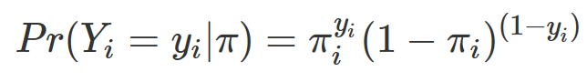
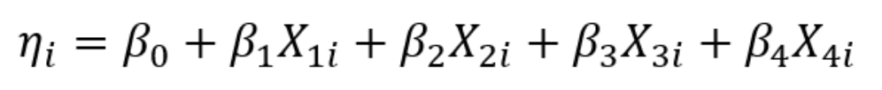
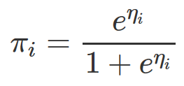
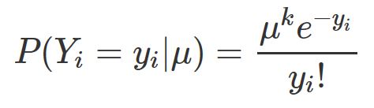
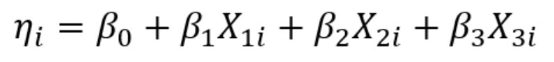
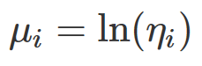

PS\#6: GLM
================
Chih-Yu Chiang
UCID 12145146
Feb. 19, 2017

Part 1: Modeling voter turnout
==============================

Describe the data
-----------------

``` r
#--Histogram
ggplot(data = vote, aes(x = vote96)) +
  geom_histogram(binwidth = 1) +
  scale_x_continuous(breaks = c(0, 1)) +
  labs(title = "Histogram of voter turnout",
       x = "Voter turnout (1 = vote)",
       y = "Number of people")
```

    ## Warning: Removed 219 rows containing non-finite values (stat_bin).


``` r
#--Scatter plot
ggplot(vote, aes(x = mhealth_sum, y = vote96)) +
  geom_point() +
  scale_y_continuous(breaks = c(0, 1)) +
  geom_smooth(method="lm", se=FALSE) +
  labs(title = "Mental health and voter turnout",
       x = "Mental health index",
       y = "Voter turnout (1 = vote)")
```

    ## Warning: Removed 1510 rows containing non-finite values (stat_smooth).

    ## Warning: Removed 1510 rows containing missing values (geom_point).


1.  The unconditional probability of a given individual turning out to vote is 68.24%.

2.  The linear smoothing line shows a negative relationship between mental health index and vote turnout. That is, when the respondents have a higher mental health index (more depressed), they are less likely to go out to vote. However, one potential problem of this linear smoothing line is that it assumes the dependent variable ranging from negative infinity to infinity; this could leads to problematic predictions such as a vote turnout rate larger than 1 or less than 0 when the mental health index is large or small to a degree, which could make the model's predictions unrealistic and interpretations improbable.

Basic model
-----------

``` r
#--Fit model
logistic_1 <- glm(vote96 ~ mhealth_sum, data = vote, family = binomial)
pander(summary(logistic_1))
```

<table style="width:86%;">
<colgroup>
<col width="25%" />
<col width="15%" />
<col width="18%" />
<col width="13%" />
<col width="13%" />
</colgroup>
<thead>
<tr class="header">
<th align="center"> </th>
<th align="center">Estimate</th>
<th align="center">Std. Error</th>
<th align="center">z value</th>
<th align="center">Pr(&gt;|z|)</th>
</tr>
</thead>
<tbody>
<tr class="odd">
<td align="center"><strong>mhealth_sum</strong></td>
<td align="center">-0.1435</td>
<td align="center">0.01969</td>
<td align="center">-7.289</td>
<td align="center">3.134e-13</td>
</tr>
<tr class="even">
<td align="center"><strong>(Intercept)</strong></td>
<td align="center">1.139</td>
<td align="center">0.08444</td>
<td align="center">13.49</td>
<td align="center">1.759e-41</td>
</tr>
</tbody>
</table>

(Dispersion parameter for binomial family taken to be 1 )

<table style="width:61%;">
<colgroup>
<col width="26%" />
<col width="34%" />
</colgroup>
<tbody>
<tr class="odd">
<td align="center">Null deviance:</td>
<td>1672 on 1321 degrees of freedom</td>
</tr>
<tr class="even">
<td align="center">Residual deviance:</td>
<td>1617 on 1320 degrees of freedom</td>
</tr>
</tbody>
</table>

``` r
#--Log-odds
vote_logistic_1 <- vote %>% 
  add_predictions(logistic_1)

ggplot(vote_logistic_1, aes(mhealth_sum, pred)) +
  geom_line(color = "blue", size = 1) +
  labs(title = "Mental health and log-odds of voter turnout",
       x = "Mental health index",
       y = "Log-odds of voter turnout")
```

    ## Warning: Removed 1418 rows containing missing values (geom_path).


``` r
#--Odds
vote_logistic_1 <- vote_logistic_1 %>%
  mutate(odds = exp(pred))

ggplot(vote_logistic_1, aes(mhealth_sum, odds)) +
  geom_line(color = "blue", size = 1) +
  labs(title = "Mental health and odds of voter turnout",
       x = "Mental health index",
       y = "Odds of voter turnout")
```

    ## Warning: Removed 1418 rows containing missing values (geom_path).


``` r
#--Probability
vote_logistic_1 <- vote_logistic_1 %>%
  mutate(prob = exp(pred) / (1 + exp(pred)))

ggplot(vote_logistic_1, aes(mhealth_sum, prob)) +
  geom_line(color = "blue", size = 1) +
  labs(title = "Mental health and probability of voter turnout",
       x = "Mental health index",
       y = "Probability of voter turnout")
```

    ## Warning: Removed 1418 rows containing missing values (geom_path).


``` r
#--First difference
pred_data <- augment(logistic_1, newdata = data_frame(mhealth_sum = c(1, 2, 5, 6))) %>%
  mutate(prob = exp(.fitted) / (1 + exp(.fitted)))

dif_1_2 <- (filter(pred_data, mhealth_sum == 2))$prob - (filter(pred_data, mhealth_sum == 1))$prob
dif_5_6 <- (filter(pred_data, mhealth_sum == 6))$prob - (filter(pred_data, mhealth_sum == 5))$prob


#--Evaluate model
#Accuracy
vote_logistic_1 <- vote_logistic_1 %>% 
  mutate(pred_vote = as.numeric(prob > .5))
accuracy <- mean(vote_logistic_1$vote96 == vote_logistic_1$pred_vote, na.rm = TRUE)

#PRE
# function to calculate PRE for a logistic regression model
PRE <- function(real, pred){
  # calculate the errors for the null model and your model
  E1 <- sum(real != median(real, na.rm = TRUE), na.rm = TRUE)
  E2 <- sum(real != pred, na.rm = TRUE)
  # calculate the proportional reduction in error
  PRE <- (E1 - E2) / E1
  return(PRE)
}
pre <- PRE(vote_logistic_1$vote96, vote_logistic_1$pred_vote)

#AUC
auc_x <- auc(vote_logistic_1$vote96, vote_logistic_1$prob)
```

1.  The relationship between mental health and voter turnout is statistically and substantively significant under a 99.9% confidence level, as the p-value of variable `mhealth_sum` in the model is extremly small and close to 0 (3.13e-13).

2.  The estimated parameter for `mhealth_sum` is -0.14348; there is a negative relationship between log-odd of voter turnout and `mhealth_sum`. When the `mhealth_sum` increases 1 unit, the log-odds of voter turnout decreases 0.14348 on average.

3.  While the estimated parameter for `mhealth_sum` is -0.14348, the relationship between the odds of voter turnout and `mhealth_sum` is negative. A one-unit increase in `mhealth_sum` corresponds to a differential decrease in the odds of voter turnout. The amount of the change in the odds of voter turnout depends on the initial value of `mhealth_sum`.

4.  While the estimated parameter for `mhealth_sum` is -0.14348, the relationship between the predicted probability of voter turnout and `mhealth_sum` is negative. A one-unit increase in `mhealth_sum` corresponds to a differential decrease in the predicted probability of voter turnout. The amount of the change in the predcted probability of voter turnout depends on the initial value of `mhealth_sum`. For example, an increase in the mental health index from 1 to 2 results in a 0.0292 decrease (the first difference) in the predcted probability of voter turnout, while an increase in the mental health index from 5 to 6 results in a 0.0348 decrease in the predcted probability of voter turnout.

5.  The accuracy rate of this model is 67.78%, which means the model's rate of correct prediction in voter turnout (with a threshold = 0.5) is 67.78%. The proportional reduction in error (PRE) of this model (with a threshold = 0.5) is 48.67%. That is, compare to the baseline prediction (all voters turnout, as the median of the sample data is turnout), the model reduces 48.67% of the prediction error. However, the AUC of this model is only 0.62. Although this model improves the prediction compared to the baseline at a 0.5 threshold, it is still hard to be considered a good model as its AUC is close to 0.5, which is the level of the null model we randomly guess the turnout result. That means this model is only slightly better than the null model for any threshold value.

Multiple variable model
-----------------------

``` r
#--Fit model
logistic_2 <- glm(vote96 ~ age + educ + married + inc10, data = vote, family = binomial)
pander(summary(logistic_2))
```

<table style="width:86%;">
<colgroup>
<col width="25%" />
<col width="15%" />
<col width="18%" />
<col width="13%" />
<col width="13%" />
</colgroup>
<thead>
<tr class="header">
<th align="center"> </th>
<th align="center">Estimate</th>
<th align="center">Std. Error</th>
<th align="center">z value</th>
<th align="center">Pr(&gt;|z|)</th>
</tr>
</thead>
<tbody>
<tr class="odd">
<td align="center"><strong>age</strong></td>
<td align="center">0.04286</td>
<td align="center">0.003356</td>
<td align="center">12.77</td>
<td align="center">2.416e-37</td>
</tr>
<tr class="even">
<td align="center"><strong>educ</strong></td>
<td align="center">0.2172</td>
<td align="center">0.0207</td>
<td align="center">10.5</td>
<td align="center">9.074e-26</td>
</tr>
<tr class="odd">
<td align="center"><strong>married</strong></td>
<td align="center">0.2218</td>
<td align="center">0.1066</td>
<td align="center">2.081</td>
<td align="center">0.03744</td>
</tr>
<tr class="even">
<td align="center"><strong>inc10</strong></td>
<td align="center">0.06455</td>
<td align="center">0.01813</td>
<td align="center">3.561</td>
<td align="center">0.0003696</td>
</tr>
<tr class="odd">
<td align="center"><strong>(Intercept)</strong></td>
<td align="center">-4.305</td>
<td align="center">0.3355</td>
<td align="center">-12.83</td>
<td align="center">1.08e-37</td>
</tr>
</tbody>
</table>

(Dispersion parameter for binomial family taken to be 1 )

<table style="width:61%;">
<colgroup>
<col width="26%" />
<col width="34%" />
</colgroup>
<tbody>
<tr class="odd">
<td align="center">Null deviance:</td>
<td>2869 on 2310 degrees of freedom</td>
</tr>
<tr class="even">
<td align="center">Residual deviance:</td>
<td>2522 on 2306 degrees of freedom</td>
</tr>
</tbody>
</table>

``` r
#--Generate predicted values
vote_logistic_2 <- vote %>%
  data_grid(age, educ, married, inc10 = seq(0, max(15), by = 1)) %>%
  add_predictions(logistic_2) %>%
  mutate(prob = exp(pred) / (1 + exp(pred)))
```

1-1. The random component of this model is the Bernoulli distribution as below.

where Y is a binary indicator of voter turnout or not; pi is the percentage of the voter turnout.

1-2. The linear predictor of this model is as follows.

where Xs denotes the four independent variables, `age`, `educ`, `married`, and `inc10`, respectively; betas are the corresponding parameters estimated.

1-3. The link function is the logit function as below.


2-1. After testing all the variables provided forward and backward, I choose age, education, marital status, and income as the predictors estimating the voter turnout, for the reason that these four show stronger relationships in the tested models with the voter turnout than others do, and they are more interpretable as well regrding their relationships with the voter turnout. The model is estimated and reported as the table above.

3-1. According to the p-values of the independent variables, all four included in the model have statistically significant relationships with the `vote96`, with `age` (p-value &lt; 2e-16), `inc10` (p-value = 0.00037), and `educ` (p-value &lt; 2e-16) at a 99.9% confidence level and `married` (p-value = 0.03744) at a 95% confidence level. All four relationships are positive as we observe positive parameters estimated for the corresponding independent variables, which means that when age (parameter est. = 0.042858), income (parameter est. = 0.064547), or education (parameter est. = 0.217209) increase, or when people get married (parameter est. = 0.221846), controlling other variables, the predected probability of voter turnout has a differential increase. The amount of the change in the probability of voter turnout depends on the initial value of the changing independent variable.

As the independent variables in a logistic model are inheritedly interactive with one another, and there are 4 variables included in the model, which lead to as many as 6 variable pairs, I am not going to enumerate and elaborate all the paired interactions. Instead, I select 2 pairs, `age` + `married` and `educ` + `inc10`, which are more interesting to me and more interpretable, and describe their interactive relationships with `vote96` below.

``` r
vote_logistic_2_grid_am <- vote_logistic_2 %>%
  data_grid(age, married, educ = median(educ, na.rm = TRUE), inc10 = median(inc10, na.rm = TRUE)) %>%
  add_predictions(logistic_2) %>%
  mutate(prob = exp(pred) / (1 + exp(pred)))

ggplot(vote_logistic_2_grid_am, aes(age, pred, group = factor(married), color = factor(married))) +
  geom_line() +
  scale_color_discrete(name = "Marital status (married = 1)") +
  labs(title = "Log-odds of voter turnout",
       subtitle = "by age and marital status, controlling education and income",
       x = "Age",
       y = "Log-odds of voter turnout")
```


``` r
ggplot(vote_logistic_2_grid_am, aes(age, prob, group = factor(married), color = factor(married))) +
  geom_line() +
  scale_color_discrete(name = "Marital status (married = 1)") +
  labs(title = "Predicted probability of voter turnout",
       subtitle = "by age and marital status, controlling education and income",
       x = "Age",
       y = "Predicted probability of voter turnout")
```


While controling the education and income at their medium, the above graphs illustrate the relationship between age, marital status, and voter turnout. In the graph *Log-odds of voter turnout*, we observe the mentioned positive relationship between age and log-odds of voter turnout, as well as the marital status and the log-odds. As age goes up, the log-odds go up, as the lines with a positive slope. This could be because the elderly people tend to care more about the public and therefore go voting while youngsters tend to see themself more important than the society as a whole. On the other hand, the difference between marital statuses shift the line from red to green. That is, The log-odds of voter turnout is higher for married people than unmarried at any given age. This is probably because that married people care more about their families and vote for their children's future.

In the graph *Predicted probability of voter turnout*, we observe the interactive relationship between marital status and age on the probability of voter turnout. As the gap between the two lines is getting smaller when age goes up, the effect difference between marital statuses on voter turnout is smaller when people get old. At age 20, the turnout rate is 5% higher for married people than unmarried people; at age 80, the difference shrinks to around 2.5%.

``` r
vote_logistic_2_grid_ei <- vote_logistic_2 %>%
  data_grid(age = median(age, na.rm = TRUE), married = median(married, na.rm = TRUE), educ, inc10 = seq(0, max(15), by = 3)) %>%
  add_predictions(logistic_2) %>%
  mutate(prob = exp(pred) / (1 + exp(pred)), inc10 = factor(inc10))

ggplot(vote_logistic_2_grid_ei, aes(educ, pred, group = inc10, color = inc10)) +
  geom_line() +
  scale_color_discrete(name = "Income (in $10,000s)") +
  labs(title = "Log-odds of voter turnout",
       subtitle = "by education and income, controlling marital status and age",
       x = "Education (years)",
       y = "Log-odds of voter turnout")
```


``` r
ggplot(vote_logistic_2_grid_ei, aes(educ, prob, group = inc10, color = inc10)) +
  geom_line() +
  scale_color_discrete(name = "Income (in $10,000s)") +
  labs(title = "Predicted probability of voter turnout",
       subtitle = "by education and income, controlling marital status and age",
       x = "Education (years)",
       y = "Predicted probability of voter turnout")
```


While controling the marital status and income at their medium, the above graphs illustrate the relationship between education, income, and voter turnout. In the graph *Log-odds of voter turnout*, we observe the mentioned positive relationship between education and log-odds of voter turnout, as well as the income level and the log-odds. As education goes longer, the log-odds go up, as the lines with a positive slope. This could be because the education makes people willing to assume more responsibility to the public and also have more knowledge in judging the policy, which leads to their intention in the turnout. On the other hand, the difference between income levels shift the line from orange to purple. That is, The log-odds of voter turnout is higher for hier-income people than lower-income ones. This is probably because that people with higher income have more flexibility in working, which ensures that they are able to turnout on the voting days.

In the graph *Predicted probability of voter turnout*, we observe the different effect size of education on the voter turnout rate at different levels of education. At higher and lower levels (compared to middle levels) of education, the relationship between education and the turnout probability is weaker and thus the lines have the smaller slopes. We also observe the interactive relationship between education and income on the probability of voter turnout. As the gaps between income levels are smaller at higher and lower levels (compared to middle levels) of education, the income-turnout relationsip is weaker at the higher and lower education levels. With 10-year education, people in the highest income bracket are predicted to have a 25% higher chance to vote than the lowest income bracket people; the difference is halve for people with 20-year education.

Part 2: Modeling tv consumption
===============================

Estimate a regression model
---------------------------

``` r
#--Fit model
poisson_1 <- glm(tvhours ~ educ + hrsrelax + black, data = tv, family = quasipoisson)
pander(summary(poisson_1))
```

<table style="width:86%;">
<colgroup>
<col width="25%" />
<col width="15%" />
<col width="18%" />
<col width="13%" />
<col width="13%" />
</colgroup>
<thead>
<tr class="header">
<th align="center"> </th>
<th align="center">Estimate</th>
<th align="center">Std. Error</th>
<th align="center">t value</th>
<th align="center">Pr(&gt;|t|)</th>
</tr>
</thead>
<tbody>
<tr class="odd">
<td align="center"><strong>educ</strong></td>
<td align="center">-0.04208</td>
<td align="center">0.008189</td>
<td align="center">-5.139</td>
<td align="center">3.317e-07</td>
</tr>
<tr class="even">
<td align="center"><strong>hrsrelax</strong></td>
<td align="center">0.03702</td>
<td align="center">0.006772</td>
<td align="center">5.466</td>
<td align="center">5.807e-08</td>
</tr>
<tr class="odd">
<td align="center"><strong>black</strong></td>
<td align="center">0.4463</td>
<td align="center">0.05084</td>
<td align="center">8.779</td>
<td align="center">7.032e-18</td>
</tr>
<tr class="even">
<td align="center"><strong>(Intercept)</strong></td>
<td align="center">1.257</td>
<td align="center">0.1207</td>
<td align="center">10.41</td>
<td align="center">3.7e-24</td>
</tr>
</tbody>
</table>

(Dispersion parameter for quasipoisson family taken to be 1.176556 )

<table style="width:61%;">
<colgroup>
<col width="26%" />
<col width="34%" />
</colgroup>
<tbody>
<tr class="odd">
<td align="center">Null deviance:</td>
<td>1229 on 1005 degrees of freedom</td>
</tr>
<tr class="even">
<td align="center">Residual deviance:</td>
<td>1062 on 1002 degrees of freedom</td>
</tr>
</tbody>
</table>

``` r
#--Generate predicted values
tv_poisson_1_grid <- tv %>%
  data_grid(educ, hrsrelax, black) %>%
  add_predictions(poisson_1) %>%
  mutate(count_pred = exp(pred))


#--Visualization
ggplot(tv_poisson_1_grid, aes(hrsrelax, pred, group = factor(black), color = factor(black))) +
  geom_line() +
  scale_color_discrete(name = "Black (is black = 1)") +
  labs(title = "Predicted log(hours) of TV watched per day",
       subtitle = "by hours has to relax, black or not, and years of education",
       x = "Hours has to relax per day",
       y = "Predicted log(hours) of TV watched per day")
```


``` r
ggplot(tv_poisson_1_grid, aes(hrsrelax, count_pred, group = factor(black), color = factor(black))) +
  geom_line() +
  scale_color_discrete(name = "Black (is black = 1)") +
  labs(title = "Predicted hours of TV watched per day",
       subtitle = "by hours has to relax, black or not, and years of education",
       x = "Hours has to relax per day",
       y = "Predicted hours of TV watched per day")
```


1-1. The random component of this model is the Poisson distribution as below.

where Y is the hours of TV watched a day; mu is the predictor.

1-2. The linear predictor of this model is as follows. 
where Xs denotes the four independent variables, `educ`, `hrsrelax`, and `black`, respectively; betas are the corresponding parameters estimated.

1-3. The link function of this model is the log function as below.


2-1. After testing all the variables provided forward and backward, I choose education, hours has to relax, and is black or not as the predictors estimating the hours of TV watched per day, for the reason that these three show stronger relationships in the tested models with the `tvhours` than others do, and they are more interpretable as well regrding their relationships with the `tvhours`. The model is estimated and reported as the table above.

3-1. According to the p-values of the independent variables, all three included in the model have statistically significant relationships with the `tvhours`, with `educ` (p-value = 3.32e-07), `hrsrelax` (p-value = 5.81e-08), and `black` (p-value &lt; 2e-16) all at a 99.9% confidence level. Both relationships of `hrsrelax` and `black` with `tvhours` are positive as we observe positive parameters estimated for the corresponding independent variables, which means that when the hours has to relax (parameter est. = 0.037015) increases, or the respondent is black compared to other races (parameter est. = 0.446314), controlling other variables, the predected hours of TV watched per day has a differential increase. The amount of the change in the hours of TV watched per day depends on the initial value of the changing independent variable. On the other hand, `educ` has a negative relationship with `tvhours`. According to its negative parameter estimate, -0.042084, controlling other variables, when `educ` increase by on-unit, the predected hours of TV watched per day has a differential decrease, depending on the initial value of the `educ`.

3-2. As in the graph, *Predicted log(hours) of TV watched per day*, hours has to relax per day has a positive and linear relationship with the log(hours) of TV watched per day, with around 1 log(hours) in size from 0 to 20+ relaxing hours. The relationship makes sense that people mostly watching TV for recreational purposes, and people need relaxing time to have the recreations. We also observe the green line (representing black people) is above the red line (non-black people), which indicates that at every level of relaxing hours, black people tend to watch more TV than non-black people, with around 0.4 log(hours) in size. One possible reason is that black people often have lower household income, compared to others, which limits the recreational options black people could have in their relaxing hours. While watching TV is one of the most inexpensive recreational activities, black people could tend to choose it considering the cost. Lastly, the line fluctuations illustrate the effect of the year of education, around 0.8 log(hours) in size, from the least educated people to the best educated ones, as the data grid is well-balanced for different levels of all independent variables. The negative effect of education could also explains by the options people have after having education. People tend to have higher income as having more education, which in turn brings about more possibilities in the relaxing hours, such as traveling or watching the movies.

3-3. As in graph *Predicted hours of TV watched per day*, we can observe the interactive relationships between the independent variables in the model. As hours has to relax goes up, the distance between the red and green lines are larger, indicating the larger difference between black and non-black people at higher levels of relaxing hours, regarding the time spending on watching TV. Also, the lines have larger fluctuation at higher levels of relaxing hours, which indicates that when relaxing hour goes up, the effect of education on `tvhours` also goes up. Lastly, the fluctuation is more drastical for black people than non-black people, that infers the education's effect on black people is more than on non-black people regarding the TV consumption (black people decreases TV consumption more than non-black people when education goes up).
