PS\#9: nonparametric methods and unsupervised learning
================
Chih-Yu Chiang
UCID 12145146
Mar. 13, 2017

Attitudes towards feminists
---------------------------

### 1.Split the data into a training and test set (70/30%).

``` r
set.seed(1234)

#--Split data
dfs_feminist <- resample_partition(df_feminist, c(test = 0.3, train = 0.7))
df_feminist_tr <- as_tibble(dfs_feminist$train)
df_feminist_te <- as_tibble(dfs_feminist$test)

#--Split data with factor
dfs_feministF <- resample_partition(df_feministF, c(test = 0.3, train = 0.7))
df_feministF_tr <- as_tibble(dfs_feministF$train)
df_feministF_te <- as_tibble(dfs_feministF$test)
```

Two versions of the data is split. One takes all variables cardinal (`dfs_feminist`); one takes `female`, `dem`, and `rep` as factors (`dfs_feministF`). The factor model will be applied with a priority as long as the algorithm accept non-numeric inputs.

### 2.Calculate the test MSE for KNN models with K = 5, 10, 15,.., 100, using whatever combination of variables you see fit. Which model produces the lowest test MSE?

``` r
set.seed(1234)

#--KNN and mse
KNN_1 <- data_frame(k = seq(5, 100, by=5),
                    knn = map(k, ~ knn.reg(select(df_feminist_tr, -feminist),
                                           y=df_feminist_tr$feminist,
                                           test=select(df_feminist_te, -feminist),
                                           k=.)
                    ),
                    mse = map_dbl(knn, ~ mean((df_feminist_te$feminist - .$pred)^2)))

KNN_1
```

    ## # A tibble: 20 × 3
    ##        k          knn   mse
    ##    <dbl>       <list> <dbl>
    ## 1      5 <S3: knnReg> 547.0
    ## 2     10 <S3: knnReg> 493.8
    ## 3     15 <S3: knnReg> 480.0
    ## 4     20 <S3: knnReg> 466.8
    ## 5     25 <S3: knnReg> 463.7
    ## 6     30 <S3: knnReg> 459.2
    ## 7     35 <S3: knnReg> 461.1
    ## 8     40 <S3: knnReg> 459.6
    ## 9     45 <S3: knnReg> 455.7
    ## 10    50 <S3: knnReg> 457.3
    ## 11    55 <S3: knnReg> 457.7
    ## 12    60 <S3: knnReg> 457.5
    ## 13    65 <S3: knnReg> 457.6
    ## 14    70 <S3: knnReg> 458.8
    ## 15    75 <S3: knnReg> 459.1
    ## 16    80 <S3: knnReg> 457.4
    ## 17    85 <S3: knnReg> 457.2
    ## 18    90 <S3: knnReg> 456.9
    ## 19    95 <S3: knnReg> 456.9
    ## 20   100 <S3: knnReg> 456.0

``` r
ggplot(KNN_1, aes(k, mse)) +
  geom_line() +
  geom_point() +
  labs(x = "K",
       y = "Test mean squared error")
```

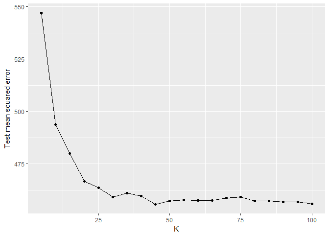 I apply all variables except `feminist` in the predicting task whereas `feminist` can be intuitively explained by any of the other variables. With the KNN method of different ks, the lowest test MSE (455.7) occurs at k = 45. The test MSE goes down very quickly from 5 to 25, and generally stabalized at 450-460 afterward.

### 3.Calculate the test MSE for weighted KNN models with 5, 10, 15,.., 100, using the same combination of variables as before. Which model produces the lowest test MSE?

``` r
set.seed(1234)

#--wKNN and mse
wKNN_1 <- data_frame(k = seq(5, 100, by=5),
                    knn = map(k, ~ kknn(feminist ~ .,
                                        train=df_feminist_tr,
                                        test=df_feminist_te, k =.)
                    ),
                    mse = map_dbl(knn, ~ mean((df_feminist_te$feminist - .$fitted.values)^2)))

wKNN_1
```

    ## # A tibble: 20 × 3
    ##        k        knn   mse
    ##    <dbl>     <list> <dbl>
    ## 1      5 <S3: kknn> 546.1
    ## 2     10 <S3: kknn> 489.6
    ## 3     15 <S3: kknn> 470.7
    ## 4     20 <S3: kknn> 462.0
    ## 5     25 <S3: kknn> 457.3
    ## 6     30 <S3: kknn> 452.5
    ## 7     35 <S3: kknn> 449.7
    ## 8     40 <S3: kknn> 447.5
    ## 9     45 <S3: kknn> 446.0
    ## 10    50 <S3: kknn> 444.7
    ## 11    55 <S3: kknn> 443.5
    ## 12    60 <S3: kknn> 442.4
    ## 13    65 <S3: kknn> 441.4
    ## 14    70 <S3: kknn> 440.5
    ## 15    75 <S3: kknn> 439.7
    ## 16    80 <S3: kknn> 439.1
    ## 17    85 <S3: kknn> 438.5
    ## 18    90 <S3: kknn> 438.1
    ## 19    95 <S3: kknn> 437.7
    ## 20   100 <S3: kknn> 437.4

``` r
ggplot(wKNN_1, aes(k, mse)) +
  geom_line() +
  geom_point() +
  labs(x = "K",
       y = "Test mean squared error")
```

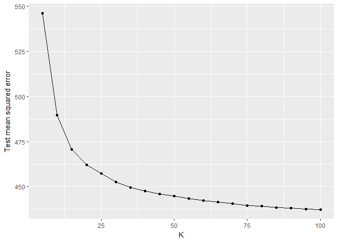 With the weighted KNN method of different ks, the lowest MSE (437.4) occurs at k = 100. While weighted by distance, the test MSE curve is less jagged and goes down smoothly from 5 to 100, and could keep going down afterwards.

### 4.Compare the test MSE for the best KNN/wKNN model(s) to the test MSE for the equivalent linear regression, decision tree, boosting, and random forest methods using the same combination of variables as before. Which performs the best? Why do you think this method performed the best, given your knowledge of how it works?

``` r
set.seed(1234)

#--Linear regression
lm_1 <- lm(feminist ~ ., data=df_feminist_tr)
summary(lm_1)
```

    ## 
    ## Call:
    ## lm(formula = feminist ~ ., data = df_feminist_tr)
    ## 
    ## Residuals:
    ##    Min     1Q Median     3Q    Max 
    ## -66.83 -10.82  -2.07  11.48  52.83 
    ## 
    ## Coefficients:
    ##             Estimate Std. Error t value Pr(>|t|)    
    ## (Intercept) 52.38120    3.77477   13.88  < 2e-16 ***
    ## female       6.18323    1.20585    5.13  3.4e-07 ***
    ## age         -0.00777    0.03587   -0.22  0.82848    
    ## educ         0.17257    0.25851    0.67  0.50453    
    ## income      -0.14771    0.10964   -1.35  0.17814    
    ## dem          7.07094    1.30606    5.41  7.4e-08 ***
    ## rep         -6.00588    1.63648   -3.67  0.00025 ***
    ## ---
    ## Signif. codes:  0 '***' 0.001 '**' 0.01 '*' 0.05 '.' 0.1 ' ' 1
    ## 
    ## Residual standard error: 20.6 on 1270 degrees of freedom
    ## Multiple R-squared:  0.0846, Adjusted R-squared:  0.0803 
    ## F-statistic: 19.6 on 6 and 1270 DF,  p-value: <2e-16

``` r
mse_lm1 <- mse(lm_1, df_feminist_te)
mse_lm1
```

    ## [1] 435.1

``` r
#--Decision tree
tree_1 <- tree(feminist ~ ., data=df_feminist_tr)
summary(tree_1)
```

    ## 
    ## Regression tree:
    ## tree(formula = feminist ~ ., data = df_feminist_tr)
    ## Variables actually used in tree construction:
    ## [1] "dem"    "female"
    ## Number of terminal nodes:  4 
    ## Residual mean deviance:  431 = 548000 / 1270 
    ## Distribution of residuals:
    ##    Min. 1st Qu.  Median    Mean 3rd Qu.    Max. 
    ##  -66.50  -10.80   -0.83    0.00   13.20   49.20

``` r
mse_tree1 <- mse(tree_1, df_feminist_te)
mse_tree1
```

    ## [1] 436.2

``` r
#--Boosting
boost_1 <- gbm(feminist ~ ., data=df_feminist_tr, n.trees=500)
```

    ## Distribution not specified, assuming gaussian ...

``` r
summary(boost_1)
```

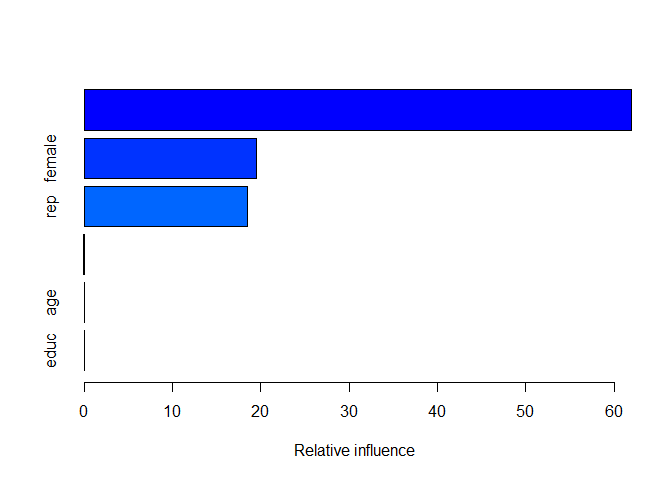

    ##           var  rel.inf
    ## dem       dem 61.98852
    ## female female 19.48180
    ## rep       rep 18.44842
    ## income income  0.08126
    ## age       age  0.00000
    ## educ     educ  0.00000

``` r
yhat.boost = predict(boost_1, newdata=df_feminist_te, n.trees=500)
mse_boost_1 <- mean((yhat.boost - df_feminist_te$feminist)^2)
mse_boost_1
```

    ## [1] 448.8

``` r
#--Random forest
rf_1 <- randomForest(feminist ~ ., data=df_feminist_tr, ntree=500)
summary(rf_1)
```

    ##                 Length Class  Mode     
    ## call               4   -none- call     
    ## type               1   -none- character
    ## predicted       1277   -none- numeric  
    ## mse              500   -none- numeric  
    ## rsq              500   -none- numeric  
    ## oob.times       1277   -none- numeric  
    ## importance         6   -none- numeric  
    ## importanceSD       0   -none- NULL     
    ## localImportance    0   -none- NULL     
    ## proximity          0   -none- NULL     
    ## ntree              1   -none- numeric  
    ## mtry               1   -none- numeric  
    ## forest            11   -none- list     
    ## coefs              0   -none- NULL     
    ## y               1277   -none- numeric  
    ## test               0   -none- NULL     
    ## inbag              0   -none- NULL     
    ## terms              3   terms  call

``` r
mse_rf1 <- mse(rf_1, df_feminist_te)
mse_rf1
```

    ## [1] 437.8

With the same variables of previous models, regarding test MSE, linear regression acquires 435.1, decision tree 436.2, boosting 448.8, and random forest 437.8. Among all, the linear regression performs the best even compared to the KNN models. This is probably because the general relation between the predictor and respondent variables is close to linear; this linear relationship allows the linear model captures the general trend well, as other non-parametric methods are more likely to be influenced by noise and more or less overfit the training data, while without the linear assumption about the relationship.

Voter turnout and depression
----------------------------

### 1.Split the data into a training and test set (70/30).

``` r
set.seed(1234)

#--Split data
dfs_mental <- resample_partition(df_mental, c(test = 0.3, train = 0.7))
df_mental_tr <- as_tibble(dfs_mental$train)
df_mental_te <- as_tibble(dfs_mental$test)

#--Split data with factor
dfs_mentalF <- resample_partition(df_mentalF, c(test = 0.3, train = 0.7))
df_mentalF_tr <- as_tibble(dfs_mentalF$train)
df_mentalF_te <- as_tibble(dfs_mentalF$test)
```

Two versions of the data is split. One takes all variables cardinal (`dfs_mental`); one takes `vote96`, `black`, `female`, and `married` as factors (`dfs_mentalF`). The factor model will be applied with a priority as long as the algorithm accept non-numeric inputs.

### 2.Calculate the test error rate for KNN models with K = 1, 2,.., 10, using whatever combination of variables you see fit. Which model produces the lowest test error rate?

``` r
set.seed(1234)

#--KNN and err
KNN_2 <- data_frame(k = 1:10,
                    knn = map(k, ~ knn(train=select(df_mental_tr, -vote96),
                                       test=select(df_mental_te, -vote96),
                                       cl=df_mental_tr$vote96,
                                       k=.)),
                    err = map_dbl(knn, ~ mean(df_mental_te$vote96 != .))
                    )
KNN_2
```

    ## # A tibble: 10 × 3
    ##        k          knn    err
    ##    <int>       <list>  <dbl>
    ## 1      1 <fctr [349]> 0.3266
    ## 2      2 <fctr [349]> 0.3782
    ## 3      3 <fctr [349]> 0.3152
    ## 4      4 <fctr [349]> 0.3295
    ## 5      5 <fctr [349]> 0.3295
    ## 6      6 <fctr [349]> 0.3467
    ## 7      7 <fctr [349]> 0.3295
    ## 8      8 <fctr [349]> 0.3266
    ## 9      9 <fctr [349]> 0.3123
    ## 10    10 <fctr [349]> 0.3152

``` r
ggplot(KNN_2, aes(k, err)) +
  geom_line() +
  geom_point() +
  labs(x = "K",
       y = "Test error rate")
```

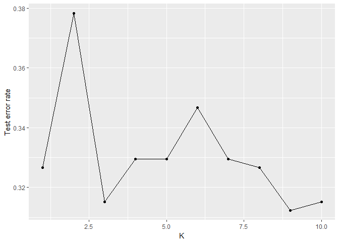 I apply all variables except `vote96` in the classification task whereas `vote96` can be intuitively explained by any of the other variables. The relationships between the variables are generally verified in the last few problems sets. With the KNN method of different ks, the lowest test error rate (31.23%) occurs at k = 9. The test error rate fluctuates quite a bit while with a generally downward pattern from k = 1 to 10.

### 3.Calculate the test MSE for weighted KNN models with K = 1, 2,.., 10 using the same combination of variables as before. Which model produces the lowest test error rate?

``` r
set.seed(1234)

#--wKNN and err
wKNN_2 <- data_frame(k = 1:10,
                     knn = map(k, ~ kknn(vote96 ~ .,
                                         train=df_mentalF_tr,
                                         test=df_mentalF_te, k =.)
                     ),
                     err = map_dbl(knn, ~ mean(df_mentalF_te$vote96 != .$fitted.values)))

wKNN_2
```

    ## # A tibble: 10 × 3
    ##        k        knn    err
    ##    <int>     <list>  <dbl>
    ## 1      1 <S3: kknn> 0.3610
    ## 2      2 <S3: kknn> 0.3610
    ## 3      3 <S3: kknn> 0.3610
    ## 4      4 <S3: kknn> 0.3610
    ## 5      5 <S3: kknn> 0.3152
    ## 6      6 <S3: kknn> 0.3152
    ## 7      7 <S3: kknn> 0.3181
    ## 8      8 <S3: kknn> 0.3095
    ## 9      9 <S3: kknn> 0.3037
    ## 10    10 <S3: kknn> 0.3009

``` r
ggplot(wKNN_2, aes(k, err)) +
  geom_line() +
  geom_point() +
  labs(x = "K",
       y = "Test error rate")
```

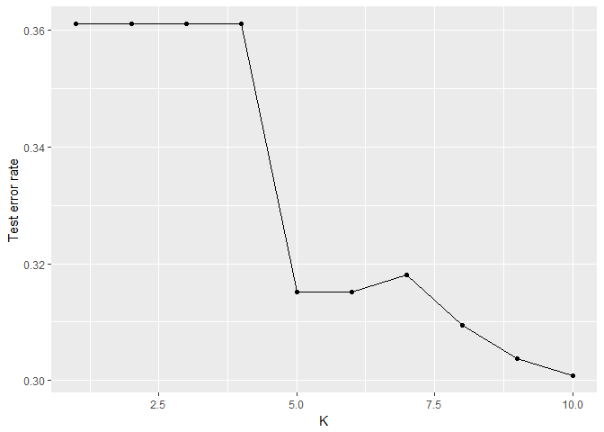 With the weighted KNN method of different ks, the lowest test error rate (30.09%) occurs at k = 10. Again, error rates of the weighted models are generally less fluctuating.

### 4.Compare the test error rate for the best KNN/wKNN model(s) to the test error rate for the equivalent logistic regression, decision tree, boosting, random forest, and SVM methods using the same combination of variables as before. Which performs the best? Why do you think this method performed the best, given your knowledge of how it works?

``` r
set.seed(1234)

#--Linear regression
logis_2 <- glm(vote96 ~ ., data=df_mentalF_tr, family=binomial)

summary(logis_2)
```

    ## 
    ## Call:
    ## glm(formula = vote96 ~ ., family = binomial, data = df_mentalF_tr)
    ## 
    ## Deviance Residuals: 
    ##    Min      1Q  Median      3Q     Max  
    ## -2.421  -1.037   0.520   0.852   2.086  
    ## 
    ## Coefficients:
    ##             Estimate Std. Error z value Pr(>|z|)    
    ## (Intercept) -4.29257    0.61412   -6.99  2.8e-12 ***
    ## mhealth_sum -0.07999    0.02888   -2.77   0.0056 ** 
    ## age          0.03945    0.00571    6.91  4.8e-12 ***
    ## educ         0.23529    0.03577    6.58  4.8e-11 ***
    ## black1       0.21705    0.23986    0.90   0.3655    
    ## female1     -0.00897    0.16665   -0.05   0.9571    
    ## married1     0.31259    0.18699    1.67   0.0946 .  
    ## inc10        0.07609    0.03244    2.35   0.0190 *  
    ## ---
    ## Signif. codes:  0 '***' 0.001 '**' 0.01 '*' 0.05 '.' 0.1 ' ' 1
    ## 
    ## (Dispersion parameter for binomial family taken to be 1)
    ## 
    ##     Null deviance: 1025.87  on 815  degrees of freedom
    ## Residual deviance:  872.47  on 808  degrees of freedom
    ## AIC: 888.5
    ## 
    ## Number of Fisher Scoring iterations: 4

``` r
logistic_2 <- df_mentalF_te %>%
  add_predictions(logis_2) %>%
  mutate(prob = exp(pred) / (1 + exp(pred))) %>%
  mutate(pred_bi = as.numeric(prob > .5))

err_logistic2 <- mean(df_mentalF_te$vote96 != logistic_2$pred_bi)
err_logistic2
```

    ## [1] 0.2865

``` r
#--Decision tree
tree_2 <- tree(vote96 ~ ., data=df_mentalF_tr)
summary(tree_2)
```

    ## 
    ## Classification tree:
    ## tree(formula = vote96 ~ ., data = df_mentalF_tr)
    ## Variables actually used in tree construction:
    ## [1] "age"         "educ"        "mhealth_sum"
    ## Number of terminal nodes:  5 
    ## Residual mean deviance:  1.09 = 888 / 811 
    ## Misclassification error rate: 0.281 = 229 / 816

``` r
err_tree2 <- err.rate.tree(tree_2, df_mentalF_te)
err_tree2
```

    ## [1] 0.3009

``` r
#--Boosting
boost_2 <- gbm(as.character(vote96) ~ ., data=df_mentalF_tr, n.trees=500)
```

    ## Distribution not specified, assuming bernoulli ...

``` r
summary(boost_2)
```

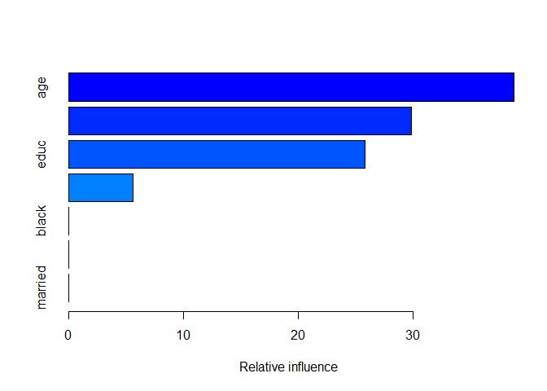

    ##                     var rel.inf
    ## age                 age  38.765
    ## mhealth_sum mhealth_sum  29.824
    ## educ               educ  25.822
    ## inc10             inc10   5.588
    ## black             black   0.000
    ## female           female   0.000
    ## married         married   0.000

``` r
yhat.boost <- predict(boost_2, newdata=df_mentalF_te, n.trees=500)
yhat.boost_bi <- as.numeric(yhat.boost > .5)
err_boost_2 <- mean(yhat.boost_bi != df_mentalF_te$vote96)
err_boost_2
```

    ## [1] 0.2951

``` r
#--Random forest
rf_2 <- randomForest(vote96 ~ ., data=df_mentalF_tr, ntree=500)
summary(rf_2)
```

    ##                 Length Class  Mode     
    ## call               4   -none- call     
    ## type               1   -none- character
    ## predicted        816   factor numeric  
    ## err.rate        1500   -none- numeric  
    ## confusion          6   -none- numeric  
    ## votes           1632   matrix numeric  
    ## oob.times        816   -none- numeric  
    ## classes            2   -none- character
    ## importance         7   -none- numeric  
    ## importanceSD       0   -none- NULL     
    ## localImportance    0   -none- NULL     
    ## proximity          0   -none- NULL     
    ## ntree              1   -none- numeric  
    ## mtry               1   -none- numeric  
    ## forest            14   -none- list     
    ## y                816   factor numeric  
    ## test               0   -none- NULL     
    ## inbag              0   -none- NULL     
    ## terms              3   terms  call

``` r
err_rf2 <- err.rate.tree(rf_2, df_mentalF_te)
err_rf2
```

    ## [1] 0.2722

``` r
#--SVM
svmlin_2 <- svm(vote96 ~ ., data=df_mentalF_tr, kernel="linear", cost=5)
summary(svmlin_2)
```

    ## 
    ## Call:
    ## svm(formula = vote96 ~ ., data = df_mentalF_tr, kernel = "linear", 
    ##     cost = 5)
    ## 
    ## 
    ## Parameters:
    ##    SVM-Type:  C-classification 
    ##  SVM-Kernel:  linear 
    ##        cost:  5 
    ##       gamma:  0.125 
    ## 
    ## Number of Support Vectors:  515
    ## 
    ##  ( 258 257 )
    ## 
    ## 
    ## Number of Classes:  2 
    ## 
    ## Levels: 
    ##  0 1

``` r
yhat.svm <- predict(svmlin_2, newdata=df_mentalF_te)
err_svm_2 <- mean(yhat.svm != df_mentalF_te$vote96)
err_svm_2
```

    ## [1] 0.2779

With the same variables of previous models, regarding test error rate, logistic regression acquires 28.65%, decision tree 30.09%, boosting 29.51%, random forest 27.22%, and SVM 27.79%. Among all, the random forest performs the best even compared to the KNN models. The data contains noise which damages the precision of the KNN and decision tree mehods. With bagging and random selection of features, random forest has less overfitting issue and hense captures better the general relationship between the variables. SVM also performs well (at the second place) as it decides the categorization boundary with only the support machines; this mechanism reduces some noise's influence and make the model stabler as well.

Colleges
--------

### Perform PCA analysis on the college dataset and plot the first two principal components. Describe the results. What variables appear strongly correlated on the first principal component? What about the second principal component?

``` r
set.seed(1234)

pca_3 <- prcomp(df_college, scale = TRUE)
pca_3$rotation
```

    ##                  PC1      PC2       PC3       PC4      PC5       PC6
    ## Private     -0.08901  0.34588 -0.151387 -0.231135  0.04429 -0.031448
    ## Apps        -0.19963 -0.34362 -0.004821 -0.305009 -0.02297 -0.008618
    ## Accept      -0.15380 -0.37256  0.025351 -0.317486  0.03144  0.013074
    ## Enroll      -0.11780 -0.39970  0.027576 -0.204836 -0.06567 -0.043065
    ## Top10perc   -0.36035  0.01624 -0.004681  0.107519 -0.38823 -0.059923
    ## Top25perc   -0.34475 -0.01773  0.058948  0.146260 -0.40981  0.020615
    ## F.Undergrad -0.09409 -0.41073  0.016806 -0.143032 -0.04659 -0.045743
    ## P.Undergrad  0.01748 -0.29306 -0.149371  0.097767  0.32797 -0.196779
    ## Outstate    -0.32766  0.19152 -0.066363 -0.128799  0.20325 -0.020296
    ## Room.Board  -0.26653  0.09398 -0.182114 -0.182427  0.52626  0.183029
    ## Books       -0.05719 -0.05734 -0.662310  0.089301 -0.15856  0.648309
    ## Personal     0.07190 -0.19276 -0.469563  0.290643 -0.18799 -0.347055
    ## PhD         -0.30325 -0.11619  0.208486  0.464586  0.20595  0.071892
    ## Terminal    -0.30387 -0.10419  0.146720  0.460404  0.26556  0.138323
    ## S.F.Ratio    0.21026 -0.20440  0.292254  0.074900 -0.05154  0.469366
    ## perc.alumni -0.23666  0.19406  0.159443 -0.010001 -0.21514 -0.051661
    ## Expend      -0.33301  0.07029 -0.217318 -0.007201  0.05709 -0.284475
    ## Grad.Rate   -0.27309  0.11783  0.172615 -0.268200 -0.14119  0.221848
    ##                    PC7       PC8      PC9     PC10     PC11      PC12
    ## Private      0.1783453 -0.032314  0.08498 -0.25960  0.67976 -0.245690
    ## Apps        -0.0610468  0.099177 -0.08409 -0.05815 -0.01038 -0.041806
    ## Accept      -0.0154741  0.054225 -0.16527 -0.08948  0.14263 -0.004545
    ## Enroll      -0.0082368 -0.063261 -0.11681 -0.07407  0.10583  0.034260
    ## Top10perc   -0.1444061  0.097143  0.35568 -0.05936 -0.02213  0.015181
    ## Top25perc   -0.0798886  0.078063  0.42245 -0.04356  0.13817  0.231232
    ## F.Undergrad  0.0002822 -0.083930 -0.04976 -0.05044  0.07836  0.062500
    ## P.Undergrad  0.1629649 -0.569890  0.54320  0.22948  0.04507 -0.121136
    ## Outstate     0.0949478  0.004122 -0.01143 -0.19733  0.06425 -0.255436
    ## Room.Board   0.1451417  0.248673  0.24424 -0.18986 -0.28076  0.485832
    ## Books       -0.1413707 -0.225032 -0.13326  0.07584  0.02042 -0.037193
    ## Personal     0.6091673  0.301427 -0.12160 -0.11688 -0.04678  0.020377
    ## PhD          0.0313471  0.070547 -0.16287  0.05600  0.17054 -0.090813
    ## Terminal     0.0038470  0.004632 -0.23315  0.02122  0.17843  0.010674
    ## S.F.Ratio    0.2757975  0.094498  0.28451 -0.44771 -0.21620 -0.424754
    ## perc.alumni  0.2863609 -0.640386 -0.29053 -0.34631 -0.26002  0.218230
    ## Expend      -0.2801681  0.037568 -0.05618 -0.03295 -0.45505 -0.548290
    ## Grad.Rate    0.5016531  0.077732 -0.02261  0.66005 -0.10309 -0.155926
    ##                 PC13       PC14     PC15      PC16       PC17       PC18
    ## Private      0.40065 -1.006e-02 -0.02320 -0.005373 -0.0447956  0.0077948
    ## Apps         0.03740  5.954e-01 -0.08068  0.133747 -0.4586034  0.3632833
    ## Accept      -0.07362  2.934e-01 -0.03335 -0.146347  0.5121883 -0.5474624
    ## Enroll       0.05907 -4.463e-01  0.08153  0.028481  0.4039065  0.6071737
    ## Top10perc    0.04435  9.187e-05  0.10617  0.697422  0.1480179 -0.1463078
    ## Top25perc   -0.09978  2.378e-02 -0.14867 -0.616897 -0.0501939  0.0806060
    ## F.Undergrad  0.06973 -5.251e-01  0.05339  0.009842 -0.5697247 -0.4089377
    ## P.Undergrad -0.02285  1.261e-01 -0.01956  0.020679  0.0506477  0.0089628
    ## Outstate    -0.80365 -1.280e-01  0.05720  0.041948 -0.0786221  0.0480235
    ## Room.Board   0.20140 -7.231e-02  0.05597  0.003513  0.0288899  0.0003683
    ## Books       -0.02491  1.183e-02  0.06768 -0.009266 -0.0017277  0.0006031
    ## Personal    -0.03788  4.009e-02 -0.02661 -0.003041  0.0129110 -0.0012111
    ## PhD          0.11722  1.246e-01  0.68645 -0.112695 -0.0358423  0.0151276
    ## Terminal     0.05437 -5.913e-02 -0.67455  0.157864  0.0202765  0.0071430
    ## S.F.Ratio    0.05841 -1.918e-02 -0.04487 -0.021720  0.0148271 -0.0012969
    ## perc.alumni  0.09156  1.031e-01  0.02684 -0.008155 -0.0004831 -0.0197045
    ## Expend       0.29930 -9.861e-02 -0.08087 -0.228764  0.0383172 -0.0348629
    ## Grad.Rate    0.07293 -7.005e-02 -0.03722 -0.003274  0.0069960 -0.0135066

``` r
biplot(pca_3, scale = 0, cex = .6)
```

 With the plot, we can see most observations gathering at the up-right part of the space, with both high PC1 and PC2 levels.

PC1 is most postively correlated with `S.F.Ratio` (with coefficient 0.21026) and negatively correlated with `Top10perc` (-0.36035), `Top25perc` (-0.34475), `Expend` (-0.33301), and `outstate` (-0.32766). Conceptually, PC1 could represent the institutions' lack of general quality of environment for learning. With a higher PC1, the school has a higher student/faculty rate, lower percentage of students coming from top high school classes, and with lower expenditure on students; they all potentially contribute to a lower quality of leaning environment.

PC2 is most postively correlated with `Private` (0.34588) and negatively correlated with `F.Undergrad` (-0.41073), `Enroll` (-0.39970), `Accept` (-0.37256), and `Apps` (-0.19963). Conceptually, PC2 could represent the scale of the institutions (reversely). With a higher PC2, the school is more likely private, and with less full time students, less enrolled and accepted students, and less applications; these all contributes a smaller scale of educational organization.

Combining the interpretation together, most of the institutions in the sample have a relatively lower quality of leaning environment and a relatively smaller scale and gather at the up-right section. With some schools have higher quality of leaning environment and smaller scale sitting at the top left part of the space; most schools with larger scale tend to have a mediocre quality of leaning environment (lower middle part of the space).

Clustering states
-----------------

### 1.Perform PCA on the dataset and plot the observations on the first and second principal components.

``` r
set.seed(1234)

pca_4 <- prcomp(select(df_arrest, -State), scale = TRUE)
pca_4$rotation
```

    ##              PC1     PC2     PC3      PC4
    ## Murder   -0.5359  0.4182 -0.3412  0.64923
    ## Assault  -0.5832  0.1880 -0.2681 -0.74341
    ## UrbanPop -0.2782 -0.8728 -0.3780  0.13388
    ## Rape     -0.5434 -0.1673  0.8178  0.08902

``` r
biplot(pca_4, scale = 0, cex = .6, xlabs=df_arrest$State)
```

 With the plot, we see the observations spreding across the entire space. PC1 here is negatively correlated with all four variables. It could represent a general safety of a state. The higher the PC1 of a state, the lower proportion of urban population it has and, more importantly, the less of all three types of crimes. PC2 is heavily and negatively correlated with urban population proportion. The higher the PC2 of a state, the lower proportion of urban population it has.

### 2.Perform K-means clustering with K = 2. Plot the observations on the first and second principal components and color-code each state based on their cluster membership. Describe your results.

``` r
set.seed(1234)

kmean_4_2 <- kmeans(select(df_arrest, -State), centers=2, nstart=1)
kmean_4_2
```

    ## K-means clustering with 2 clusters of sizes 29, 21
    ## 
    ## Cluster means:
    ##   Murder Assault UrbanPop  Rape
    ## 1  4.841   109.8    64.03 16.25
    ## 2 11.857   255.0    67.62 28.11
    ## 
    ## Clustering vector:
    ##  [1] 2 2 2 2 2 2 1 2 2 2 1 1 2 1 1 1 1 2 1 2 1 2 1 2 1 1 1 2 1 1 2 2 2 1 1
    ## [36] 1 1 1 1 2 1 2 2 1 1 1 1 1 1 1
    ## 
    ## Within cluster sum of squares by cluster:
    ## [1] 54762 41637
    ##  (between_SS / total_SS =  72.9 %)
    ## 
    ## Available components:
    ## 
    ## [1] "cluster"      "centers"      "totss"        "withinss"    
    ## [5] "tot.withinss" "betweenss"    "size"         "iter"        
    ## [9] "ifault"

``` r
ggplot(mapping=aes(x=pca_4$x[,1], y=pca_4$x[,2], label=df_arrest$State, color=factor(kmean_4_2$cluster))) +
  geom_point() +
  geom_text(hjust=0, vjust=0) +
  scale_color_discrete(guide=FALSE) +
  labs(title = "State clustering regarding crime statistics",
       x = "PC 1 (safety)",
       y = "PC 2 (rural-inclined)")
```

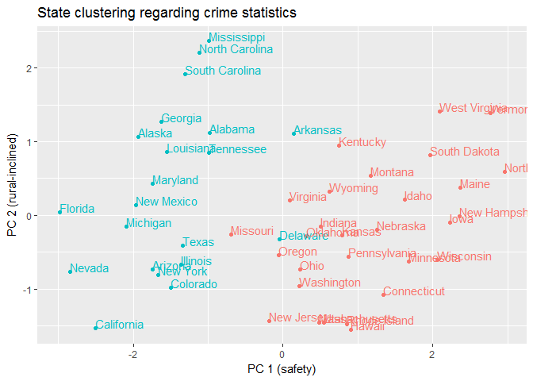 The two clusters are generally distinguished by the level of their PC1 score. One cluster at the left with lower PC1, including the States with more crimes, such as NY, CA, IL, etc. Another cluster at the right with higher PC1, it includes the safer states such as NH, WV, ND, etc.

### 3.Perform K-means clustering with K = 4. Plot the observations on the first and second principal components and color-code each state based on their cluster membership. Describe your results.

``` r
set.seed(1234)

kmean_4_4 <- kmeans(select(df_arrest, -State), centers=4, nstart=1)
kmean_4_4
```

    ## K-means clustering with 4 clusters of sizes 9, 14, 17, 10
    ## 
    ## Cluster means:
    ##   Murder Assault UrbanPop  Rape
    ## 1 10.167   202.2    68.22 23.32
    ## 2 12.136   277.6    68.79 29.79
    ## 3  5.794   129.6    68.29 18.80
    ## 4  2.950    62.7    53.90 11.51
    ## 
    ## Clustering vector:
    ##  [1] 1 2 2 1 2 1 3 1 2 1 4 3 2 3 4 3 3 2 4 2 3 2 4 2 1 3 3 2 4 3 2 2 2 4 3
    ## [36] 3 3 3 1 2 4 1 1 3 4 3 3 4 4 3
    ## 
    ## Within cluster sum of squares by cluster:
    ## [1]  6166 16272 10051  4548
    ##  (between_SS / total_SS =  89.6 %)
    ## 
    ## Available components:
    ## 
    ## [1] "cluster"      "centers"      "totss"        "withinss"    
    ## [5] "tot.withinss" "betweenss"    "size"         "iter"        
    ## [9] "ifault"

``` r
ggplot(mapping=aes(x=pca_4$x[,1], y=pca_4$x[,2], label=df_arrest$State, color=factor(kmean_4_4$cluster))) +
  geom_point() +
  geom_text(hjust=0, vjust=0) +
  scale_color_discrete(guide=FALSE) +
  labs(title = "State clustering regarding crime statistics",
       x = "PC 1 (safety)",
       y = "PC 2 (rural-inclined)")
```

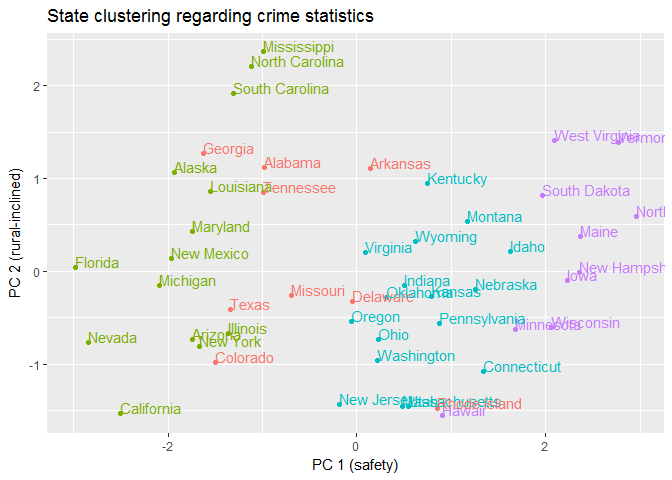 Again, the four clusters are generally distinguished by their safety levels. The first group with the most crimes, including FL, NV, CA, etc.; the second with the second most crimes, including TX, MO, AL, etc.; the third is the second to the safest, including PA, OH, MT, etc.; the fourth is the safest, including NH, ND, WI, etc.

### 4.Perform K-means clustering with K = 3. Plot the observations on the first and second principal components and color-code each state based on their cluster membership. Describe your results.

``` r
set.seed(1234)

kmean_4_3 <- kmeans(select(df_arrest, -State), centers=3, nstart=1)
kmean_4_3
```

    ## K-means clustering with 3 clusters of sizes 14, 16, 20
    ## 
    ## Cluster means:
    ##   Murder Assault UrbanPop  Rape
    ## 1  8.214  173.29    70.64 22.84
    ## 2 11.812  272.56    68.31 28.38
    ## 3  4.270   87.55    59.75 14.39
    ## 
    ## Clustering vector:
    ##  [1] 2 2 2 1 2 1 3 2 2 1 3 3 2 3 3 3 3 2 3 2 1 2 3 2 1 3 3 2 3 1 2 2 2 3 3
    ## [36] 1 1 3 1 2 3 1 1 3 3 1 1 3 3 1
    ## 
    ## Within cluster sum of squares by cluster:
    ## [1]  9137 19564 19264
    ##  (between_SS / total_SS =  86.5 %)
    ## 
    ## Available components:
    ## 
    ## [1] "cluster"      "centers"      "totss"        "withinss"    
    ## [5] "tot.withinss" "betweenss"    "size"         "iter"        
    ## [9] "ifault"

``` r
ggplot(mapping=aes(x=pca_4$x[,1], y=pca_4$x[,2], label=df_arrest$State, color=factor(kmean_4_3$cluster))) +
  geom_point() +
  geom_text(hjust=0, vjust=0) +
  scale_color_discrete(guide=FALSE) +
  labs(title = "State clustering regarding crime statistics",
       x = "PC 1 (safety)",
       y = "PC 2 (rural-inclined)")
```

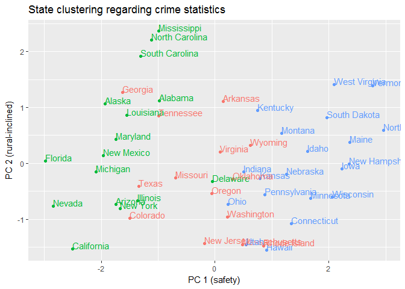 With a similar result, the three clusters are generally separated by safety levels. The first is with the lowest safety level, including IL, NY, CA, etc.; the second with the middle safety level, including MO, VA, AR, etc.; the third is the safest, including PA, NH, ID, etc.

### 5.Perform K-means clustering with K = 3 on the first two principal components score vectors, rather than the raw data. Describe your results and compare them to the clustering results with K = 3 based on the raw data.

``` r
set.seed(1234)

kmean_4_3p <- kmeans(pca_4$x[,1:2], centers=3, nstart=1)
kmean_4_3p
```

    ## K-means clustering with 3 clusters of sizes 12, 9, 29
    ## 
    ## Cluster means:
    ##      PC1     PC2
    ## 1 -1.869 -0.4767
    ## 2 -1.148  1.4180
    ## 3  1.130 -0.2428
    ## 
    ## Clustering vector:
    ##  [1] 2 2 1 2 1 1 3 3 1 2 3 3 1 3 3 3 3 2 3 1 3 1 3 2 1 3 3 1 3 3 1 1 2 3 3
    ## [36] 3 3 3 3 2 3 2 1 3 3 3 3 3 3 3
    ## 
    ## Within cluster sum of squares by cluster:
    ## [1]  8.053  5.500 43.156
    ##  (between_SS / total_SS =  66.6 %)
    ## 
    ## Available components:
    ## 
    ## [1] "cluster"      "centers"      "totss"        "withinss"    
    ## [5] "tot.withinss" "betweenss"    "size"         "iter"        
    ## [9] "ifault"

``` r
ggplot(mapping=aes(x=pca_4$x[,1], y=pca_4$x[,2], label=df_arrest$State, color=factor(kmean_4_3p$cluster))) +
  geom_point() +
  geom_text(hjust=0, vjust=0) +
  scale_color_discrete(guide=FALSE) +
  labs(title = "State clustering regarding crime statistics",
       x = "PC 1 (safety)",
       y = "PC 2 (rural-inclined)")
```

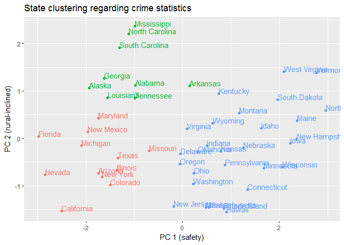 The first cluster is more urbanized and is relatively unsafe, including CA, NY, IL, etc.; the second is less urbanized while also unsafe, including SC, NC, AK, etc.; the third is generally the safer states, including PA, NH, ID, etc.

The three clusters here are distinguished by both "safety" and "rural-inclined" axes, compared to the only "safety" criterion in the previous models. This is probably because while using the PCs as the clustering input, we "up-weight" the originally not-so-important factor "rural-inclined" to the same level as "safety", which should be the dominant factor explaining the variance in this sample data.

### 6.Using hierarchical clustering with complete linkage and Euclidean distance, cluster the states.

``` r
set.seed(1234)

h <- 0
hc_4 <- hclust(dist(select(df_arrest, -State)), method="complete")

#--Extract dendro data
hcdata <- dendro_data(hc_4)
hclabs <- label(hcdata) %>%
  left_join(data_frame(label = as.factor(seq.int(nrow(df_arrest))),
                       State = df_arrest$State,
                       cl = as.factor(cutree(hc_4, h=h))))
```

    ## Joining, by = "label"

    ## Warning in left_join_impl(x, y, by$x, by$y, suffix$x, suffix$y): joining
    ## factors with different levels, coercing to character vector

``` r
#--Plot
ggdendrogram(hc_4) +
  geom_text(data=hclabs,
            aes(label=State, x=x, y=0, color=cl),
            vjust=.5, angle=90) +
  theme(axis.text.x=element_blank(),
        legend.position="none")
```

 The clustering is performed and plotted as above.

### 7.Cut the dendrogram at a height that results in three distinct clusters. Which states belong to which clusters?

``` r
set.seed(1234)

h <- 150
hc_4 <- hclust(dist(select(df_arrest, -State)), method="complete")

#--Extract dendro data
hcdata <- dendro_data(hc_4)
hclabs <- label(hcdata) %>%
  left_join(data_frame(label = as.factor(seq.int(nrow(df_arrest))),
                       State = df_arrest$State,
                       cl = as.factor(cutree(hc_4, h=h))))
```

    ## Joining, by = "label"

    ## Warning in left_join_impl(x, y, by$x, by$y, suffix$x, suffix$y): joining
    ## factors with different levels, coercing to character vector

``` r
#--Plot
ggdendrogram(hc_4) +
  geom_text(data=hclabs,
            aes(label=State, x=x, y=0, color=cl),
            vjust=.5, angle=90) +
  geom_hline(yintercept=h, linetype=2) +
  theme(axis.text.x=element_blank(),
        legend.position="none")
```

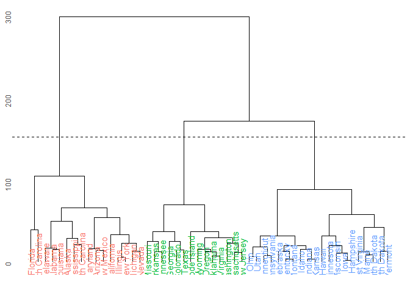 With a distance cut-off at 150, we acquire 3 clusters. The result is very similar to the k-mean clustering (k = 3) with the raw data.

-   One cluster is generally unsafe, including FL, SC, DE, AL, LA, AK, MS, NC, MD, AZ, NM, CA, IL, NY, MI, and NV.
-   One with middle safety, including MS, AR, TN, GA, TX, RI, WY, OR, OK, VA, WA, MA, and NJ.
-   One is relatively safe, including OH, UT, CT, PA, NE, KY, MT, IN, AR, HI, MN, WI, IA, NH, WV, ME, ND, SD, and VT.

From the hierarchical structure, we also observe that the second (green) and the third (blue) clusters are more similar to each other than the first (red) cluster.

### 8.Hierarchically cluster the states using complete linkage and Euclidean distance, after scaling the variables to have standard deviation 1. What effect does scaling the variables have on the hierarchical clustering obtained? In your opinion, should the variables be scaled before the inter-observation dissimilarities are computed? Provide a justification for your answer.

``` r
set.seed(1234)

#--Scaling (standardization)
df_arrest_s <- scale(select(df_arrest, -State))

h <- 4.41
hc_42 <- hclust(dist(df_arrest_s), method="complete")

#--Extract dendro data
hcdata <- dendro_data(hc_42)
hclabs <- label(hcdata) %>%
  left_join(data_frame(label = as.factor(seq.int(nrow(df_arrest))),
                       State = df_arrest$State,
                       cl = as.factor(cutree(hc_42, h=h))))
```

    ## Joining, by = "label"

    ## Warning in left_join_impl(x, y, by$x, by$y, suffix$x, suffix$y): joining
    ## factors with different levels, coercing to character vector

``` r
#--Plot
ggdendrogram(hc_42) +
  geom_text(data=hclabs,
            aes(label=State, x=x, y=0, color=cl),
            vjust=.5, angle=90) +
  geom_hline(yintercept=h, linetype=2) +
  theme(axis.text.x=element_blank(),
        legend.position="none")
```

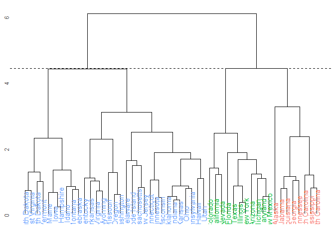 The scaling upweights the `Murder` and `Rape` variables, which have the lower original value and thus lower variance to be considered in the clustering. Also, the "rural-urban" factor is upweighted as well; the result is, therefore, more similar to the result coming from the clustering model with PCs as the input. The first cluster (green) is more urbanized and is relatively unsafe, including CA, NY, IL, etc.; the second (red) is less urbanized while also unsafe, including SC, NC, AK, etc.; the third (blue) is generally the safer states, including PA, NH, ID, etc.

While the Euclidean distance is influenced by the "scale" of each variable, I'd suggest, in this case, the variabes be standardized (to have standard deviation 1) before calculating the distance (inter-similarity), to avoid over-weighting the variables with larger scales. Here, `Assult` is generally 2-3 times in number compared to `Murder`, which could make the algorithm weights more on `Assult` in clustering while it provides a higher variance in the absolute value. However, without saying, the significance of 1 `Murder` event is much higher than 1 `Assult` event and shouldn't be overlooked only because the "number" of murder is smaller.
