PS\#7: Resampling
================
Chih-Yu Chiang
UCID 12145146
Feb. 26, 2017

Part 1: Sexy Joe Biden (redux)
==============================

### 1.Estimate the training MSE of the model using the traditional approach.

``` r
lm_biden <- lm(biden ~ age + female + educ + dem + rep, data = df_biden)
pander(summary(lm_biden))
```

<table style="width:86%;">
<colgroup>
<col width="25%" />
<col width="15%" />
<col width="18%" />
<col width="13%" />
<col width="13%" />
</colgroup>
<thead>
<tr class="header">
<th align="center"> </th>
<th align="center">Estimate</th>
<th align="center">Std. Error</th>
<th align="center">t value</th>
<th align="center">Pr(&gt;|t|)</th>
</tr>
</thead>
<tbody>
<tr class="odd">
<td align="center"><strong>age</strong></td>
<td align="center">0.04826</td>
<td align="center">0.02825</td>
<td align="center">1.708</td>
<td align="center">0.08773</td>
</tr>
<tr class="even">
<td align="center"><strong>female</strong></td>
<td align="center">4.103</td>
<td align="center">0.9482</td>
<td align="center">4.327</td>
<td align="center">1.593e-05</td>
</tr>
<tr class="odd">
<td align="center"><strong>educ</strong></td>
<td align="center">-0.3453</td>
<td align="center">0.1948</td>
<td align="center">-1.773</td>
<td align="center">0.07641</td>
</tr>
<tr class="even">
<td align="center"><strong>dem</strong></td>
<td align="center">15.42</td>
<td align="center">1.068</td>
<td align="center">14.44</td>
<td align="center">8.145e-45</td>
</tr>
<tr class="odd">
<td align="center"><strong>rep</strong></td>
<td align="center">-15.85</td>
<td align="center">1.311</td>
<td align="center">-12.09</td>
<td align="center">2.157e-32</td>
</tr>
<tr class="even">
<td align="center"><strong>(Intercept)</strong></td>
<td align="center">58.81</td>
<td align="center">3.124</td>
<td align="center">18.82</td>
<td align="center">2.694e-72</td>
</tr>
</tbody>
</table>

<table style="width:85%;">
<caption>Fitting linear model: biden ~ age + female + educ + dem + rep</caption>
<colgroup>
<col width="20%" />
<col width="30%" />
<col width="11%" />
<col width="22%" />
</colgroup>
<thead>
<tr class="header">
<th align="center">Observations</th>
<th align="center">Residual Std. Error</th>
<th align="center"><span class="math inline"><em>R</em><sup>2</sup></span></th>
<th align="center">Adjusted <span class="math inline"><em>R</em><sup>2</sup></span></th>
</tr>
</thead>
<tbody>
<tr class="odd">
<td align="center">1807</td>
<td align="center">19.91</td>
<td align="center">0.2815</td>
<td align="center">0.2795</td>
</tr>
</tbody>
</table>

``` r
mse <- function(model, data) {
  x <- modelr:::residuals(model, data)
  mean(x ^ 2, na.rm = TRUE)
}

mse_all <- mse(lm_biden, df_biden)
```

The estimated parameters and standard errors of the predictor variables by the training data are shown in the table above.

The training MSE (of the entire dataset) is 395.2701693.

### 2.Estimate the test MSE of the model using the validation set approach.

``` r
set.seed(1234)
df_biden_split <- resample_partition(df_biden, c(test = 0.3, train = 0.7))

lm_biden_train <- lm(biden ~ age + female + educ + dem + rep, data = df_biden_split$train)
pander(summary(lm_biden))
```

<table style="width:86%;">
<colgroup>
<col width="25%" />
<col width="15%" />
<col width="18%" />
<col width="13%" />
<col width="13%" />
</colgroup>
<thead>
<tr class="header">
<th align="center"> </th>
<th align="center">Estimate</th>
<th align="center">Std. Error</th>
<th align="center">t value</th>
<th align="center">Pr(&gt;|t|)</th>
</tr>
</thead>
<tbody>
<tr class="odd">
<td align="center"><strong>age</strong></td>
<td align="center">0.04826</td>
<td align="center">0.02825</td>
<td align="center">1.708</td>
<td align="center">0.08773</td>
</tr>
<tr class="even">
<td align="center"><strong>female</strong></td>
<td align="center">4.103</td>
<td align="center">0.9482</td>
<td align="center">4.327</td>
<td align="center">1.593e-05</td>
</tr>
<tr class="odd">
<td align="center"><strong>educ</strong></td>
<td align="center">-0.3453</td>
<td align="center">0.1948</td>
<td align="center">-1.773</td>
<td align="center">0.07641</td>
</tr>
<tr class="even">
<td align="center"><strong>dem</strong></td>
<td align="center">15.42</td>
<td align="center">1.068</td>
<td align="center">14.44</td>
<td align="center">8.145e-45</td>
</tr>
<tr class="odd">
<td align="center"><strong>rep</strong></td>
<td align="center">-15.85</td>
<td align="center">1.311</td>
<td align="center">-12.09</td>
<td align="center">2.157e-32</td>
</tr>
<tr class="even">
<td align="center"><strong>(Intercept)</strong></td>
<td align="center">58.81</td>
<td align="center">3.124</td>
<td align="center">18.82</td>
<td align="center">2.694e-72</td>
</tr>
</tbody>
</table>

<table style="width:85%;">
<caption>Fitting linear model: biden ~ age + female + educ + dem + rep</caption>
<colgroup>
<col width="20%" />
<col width="30%" />
<col width="11%" />
<col width="22%" />
</colgroup>
<thead>
<tr class="header">
<th align="center">Observations</th>
<th align="center">Residual Std. Error</th>
<th align="center"><span class="math inline"><em>R</em><sup>2</sup></span></th>
<th align="center">Adjusted <span class="math inline"><em>R</em><sup>2</sup></span></th>
</tr>
</thead>
<tbody>
<tr class="odd">
<td align="center">1807</td>
<td align="center">19.91</td>
<td align="center">0.2815</td>
<td align="center">0.2795</td>
</tr>
</tbody>
</table>

``` r
mse_test <- mse(lm_biden_train, df_biden_split$test)
```

The estimated parameters and standard errors of the predictor variables by the training data are shown in the table above.

The testing MSE is 399.8303029. While the MSE of the testing dataset of the validation approach is only slightly (4.5601336) higher than the MSE of the entire dataset, there's no strong evidence of overfitting. The model's stability and ability of generalization is considered good.

### 3.Repeat the validation set approach 100 times, using 100 different splits of the observations into a training set and a validation set. Comment on the results obtained.

``` r
split_model_mse <- function(df){
  df_split <- resample_partition(df, c(test = 0.3, train = 0.7))
  
  lm_df_train <- lm(biden ~ age + female + educ + dem + rep, data = df_split$train)
  
  mse_value <- mse(lm_df_train, df_split$test)

  return(data_frame(mse_value))
}

set.seed(1234)
mses <- rerun(100, split_model_mse(df_biden)) %>%
  bind_rows(.id = "id")

ggplot(data = mses, aes(x = "MSE (100 cross validations)", y = mse_value)) +
  geom_boxplot() +
  labs(title = "Boxplot of MSEs",
       x = element_blank(),
       y = "MSE value")
```

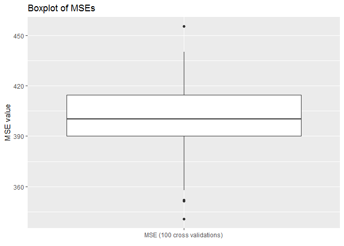

``` r
mse_test100 <- mean(mses$mse_value)
mseSd_test100 <- sd(mses$mse_value)
```

The result MSEs are plotted as above. Average MSE of the 100 replication is 401.664279. The 100 MSEs are generally stable, with a std at 20.7365732. The average MSE is slightly higher than the values in the previous attempt. The last attempt occasionally draws a split with a better MSE than average, which lets us underestimated the risk that the model overfitting the training data and reflects the potential drawback of CV method of higher variable results.

### 4.Estimate the test MSE of the model using the leave-one-out cross-validation (LOOCV) approach. Comment on the results obtained.

``` r
loocv_data <- crossv_kfold(df_biden, k = nrow(df_biden))

loocv_models <- map(loocv_data$train, ~ lm(biden ~ age + female + educ + dem + rep, data = .))

loocv_mse <- map2_dbl(loocv_models, loocv_data$test, mse)

ggplot(data = data_frame(loocv_mse), aes(x = "MSE (LOOSV)", y = data_frame(loocv_mse)[[1]])) +
  geom_boxplot() +
  labs(title = "Boxplot of MSEs",
       x = element_blank(),
       y = "MSE value")
```

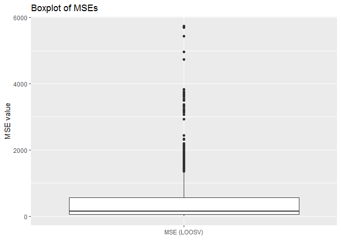

``` r
mse_loocv <- mean(loocv_mse)
mseSd_loocv <- sd(loocv_mse)
```

The result MSEs are plotted as above. Average MSE of the loocv replication is 397.9555046. It is at around the same level of the last attempt. However, the MSEs are quite unstable in this approach, with lots of outlier points and a std at 624.9499291. This implies some outlier observations whose variation can not be properly explained by this linear model. The unexplained variation could be due to random errors or some special hidden patterns. It requires further examinations on those observations to conclude.

### 5.Estimate the test MSE of the model using the 10-fold cross-validation approach. Comment on the results obtained.

``` r
set.seed(1234)
cv10_data <- crossv_kfold(df_biden, k = 10)

cv10_models <- map(cv10_data$train, ~ lm(biden ~ age + female + educ + dem + rep, data = .))

cv10_mse <- map2_dbl(cv10_models, cv10_data$test, mse)

ggplot(data = data_frame(cv10_mse), aes(x = "MSE (10-fold)", y = data_frame(cv10_mse)[[1]])) +
  geom_boxplot() +
  labs(title = "Boxplot of MSEs",
       x = element_blank(),
       y = "MSE value")
```


``` r
mse_cv10 <- mean(cv10_mse)
mseSd_cv10 <- sd(cv10_mse)
```

The result MSEs are plotted as above. Average MSE of the 10-fold replication is 397.8837233. It is at around the same level of the last few attempts. The MSEs are relatively unstable than in the cross-validation method, with a std at 34.413612. This confirms our suspect in the LOOCV attempt, of the outliers and potential hidden patterns. The 10-fold method naturally reflects more extreme sample information as it considers all sample points only once and without replacement. On the contrary, the multiple time cross-validation could reflects more about general sample patterns as the splits implies replacements, which make the common values and patterns more likely to be presented.

### 6.Repeat the 10-fold cross-validation approach 100 times, using 100 different splits of the observations into 10-folds. Comment on the results obtained.

``` r
fold_model_mse <- function(df, k){
  cv10_data <- crossv_kfold(df, k = k)
  
  cv10_models <- map(cv10_data$train, ~ lm(biden ~ age + female + educ + dem + rep, data = .))
  
  cv10_mse <- map2_dbl(cv10_models, cv10_data$test, mse)

  return(data_frame(cv10_mse))
}

set.seed(1234)
mses <- rerun(100, fold_model_mse(df_biden, 10)) %>%
  bind_rows(.id = "id")

ggplot(data = mses, aes(x = "MSE (100 times 10-fold)", y = cv10_mse)) +
  geom_boxplot() +
  labs(title = "Boxplot of MSEs",
       x = element_blank(),
       y = "MSE value")
```

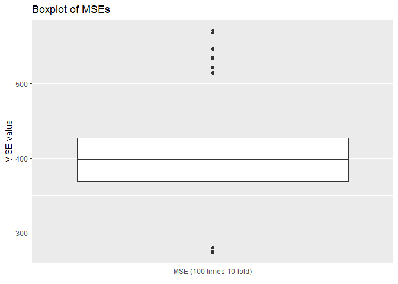

``` r
mse_100cv10 <- mean(mses$cv10_mse)
mseSd_100cv10 <- sd(mses$cv10_mse)
```

The result MSEs are plotted as above. Average MSE of the 100 replication is 398.0641646. The 100 MSEs are generally stable, with a std at 43.3249533. The average MSE is slightly higher than the values in the previous attempt. I'd suspect this is due to the random process in the k-fold splits in this attempt. I'd expect the MSEs' std slightly lower than the one in the last attempt, as the random splitting processes dilute the extreme observations in the calculation as argued in the last attempt.

### 7.Compare the estimated parameters and standard errors from the original model in step 1 (the model estimated using all of the available data) to parameters and standard errors estimated using the bootstrap (n=1000).

``` r
set.seed(1234)
boot_models <- df_biden %>%
  modelr::bootstrap(1000) %>%
  mutate(model = map(strap, ~ lm(biden ~ age + female + educ + dem + rep, data = .)), coef = map(model, tidy))

boot_summary <- boot_models %>%
  unnest(coef) %>%
  group_by(term) %>%
  summarize(est.boot = mean(estimate),
            se.boot = sd(estimate, na.rm = TRUE))

pander(boot_summary)
```

<table style="width:49%;">
<colgroup>
<col width="16%" />
<col width="18%" />
<col width="13%" />
</colgroup>
<thead>
<tr class="header">
<th align="center">term</th>
<th align="center">est.boot</th>
<th align="center">se.boot</th>
</tr>
</thead>
<tbody>
<tr class="odd">
<td align="center">(Intercept)</td>
<td align="center">58.96180746</td>
<td align="center">2.94989029</td>
</tr>
<tr class="even">
<td align="center">age</td>
<td align="center">0.04756082</td>
<td align="center">0.02846997</td>
</tr>
<tr class="odd">
<td align="center">dem</td>
<td align="center">15.42942074</td>
<td align="center">1.11104505</td>
</tr>
<tr class="even">
<td align="center">educ</td>
<td align="center">-0.35119332</td>
<td align="center">0.19201866</td>
</tr>
<tr class="odd">
<td align="center">female</td>
<td align="center">4.07552938</td>
<td align="center">0.94880851</td>
</tr>
<tr class="even">
<td align="center">rep</td>
<td align="center">-15.88710208</td>
<td align="center">1.43153427</td>
</tr>
</tbody>
</table>

``` r
ggplot(data = df_biden, aes(x = biden)) +
  geom_histogram(aes(y = ..density..), binwidth = 10, alpha = .4) +
  geom_density(adjust = 3) +
  labs(title = "Histogram of Biden's feeling thermometer",
       x = "Feeling thermometer",
       y = "Percent of people")
```

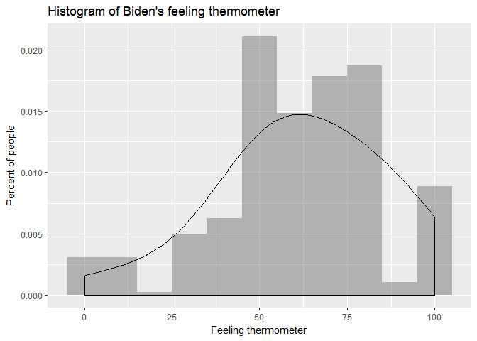

The estimated parameters and standard errors of the predictor variables by the training data are shown in the table above.

All the estimates and standard errors are more or less the same. Regarding the estimates, it's slightly higher for `age`, `dem`, and `educ`; it's slightly lower for the intercept, `female`, and `rep`. Regarding the std errors, it's slightly higher for `age`, `dem`, and `rep` it's slightly lower for the intercept, `educ`, and `female`. Generally, the results are really similar. While we still get very similar results as bootstrap looses the distribution assumptions, our distributional assumptions in the original model is considered appropriate. The respondent variable's sample distribution is shown above, which is generally close to normal.

Part 2: College (bivariate)
===========================

### Exploration the bivariate relationship

``` r
ggplot(data = df_college, aes(x = Outstate)) +
  geom_histogram(aes(y = ..density..), alpha = .4) +
  geom_density(adjust = 3) +
  labs(title = "Histogram of out-of-state tuition",
       x = "Out-of-state tuition",
       y = "Number of institution")
```

    ## `stat_bin()` using `bins = 30`. Pick better value with `binwidth`.

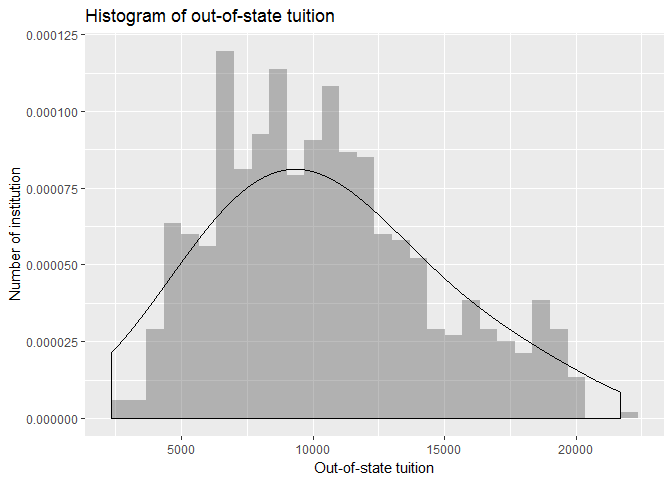

``` r
set.seed(1234)
cv10_data <- crossv_kfold(df_college, k = 10)
```

The histogram of `Outstate` is plotted as above. It's slightly right-skewed but generally bell-shaped distributed. For this, I'd not do any monotonic transformation to it for now.

The dataset is split into 10 portions as I'll apply 10-fold cross validation in the following analysis.

``` r
#--Top10perc
models_mses <- vector("numeric", 5)
terms <- 1:5

for(i in terms){
  models <- map(cv10_data$train, ~ glm(Outstate ~ poly(Top10perc, i) , data = .))
  models_mse <- map2_dbl(models, cv10_data$test, mse)
  models_mses[[i]] <- mean(models_mse, na.rm = TRUE)
}

data_frame(terms = terms,
           MSE = models_mses) %>%
  ggplot(aes(terms, MSE)) +
  geom_line() +
  scale_x_continuous(breaks = terms) +
  labs(title = "MSE estimates",
       subtitle = "Outstate ~ Top10perc",
       x = "Degree of Polynomial",
       y = "Mean Squared Error")
```

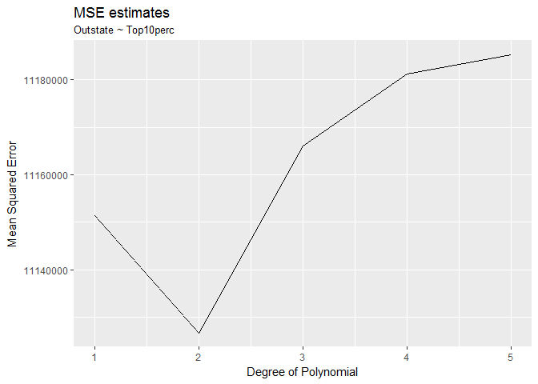

``` r
ggplot(df_college, aes(x = Top10perc, y = Outstate)) +
  geom_point() +
  geom_smooth(method = lm) +
  labs(title = "Variable relationship",
       subtitle = "Outstate ~ Top10perc",
       x = "Percent of new students from top 10% of H.S. class",
       y = "Out-of-state tuition")
```

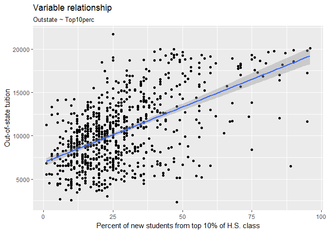

``` r
model_Top10perc <- lm(Outstate ~ Top10perc, data = df_college)
pander(summary(model_Top10perc))
```

<table style="width:86%;">
<colgroup>
<col width="25%" />
<col width="15%" />
<col width="18%" />
<col width="13%" />
<col width="13%" />
</colgroup>
<thead>
<tr class="header">
<th align="center"> </th>
<th align="center">Estimate</th>
<th align="center">Std. Error</th>
<th align="center">t value</th>
<th align="center">Pr(&gt;|t|)</th>
</tr>
</thead>
<tbody>
<tr class="odd">
<td align="center"><strong>Top10perc</strong></td>
<td align="center">128.2</td>
<td align="center">6.774</td>
<td align="center">18.93</td>
<td align="center">5.459e-66</td>
</tr>
<tr class="even">
<td align="center"><strong>(Intercept)</strong></td>
<td align="center">6906</td>
<td align="center">221.6</td>
<td align="center">31.16</td>
<td align="center">7.504e-139</td>
</tr>
</tbody>
</table>

<table style="width:85%;">
<caption>Fitting linear model: Outstate ~ Top10perc</caption>
<colgroup>
<col width="20%" />
<col width="30%" />
<col width="11%" />
<col width="22%" />
</colgroup>
<thead>
<tr class="header">
<th align="center">Observations</th>
<th align="center">Residual Std. Error</th>
<th align="center"><span class="math inline"><em>R</em><sup>2</sup></span></th>
<th align="center">Adjusted <span class="math inline"><em>R</em><sup>2</sup></span></th>
</tr>
</thead>
<tbody>
<tr class="odd">
<td align="center">777</td>
<td align="center">3329</td>
<td align="center">0.3162</td>
<td align="center">0.3153</td>
</tr>
</tbody>
</table>

#### Top10perc

As examining the scatter plot, I observe a generally linear and positive relationship between `Top10perc` and `Outstate`. The observation is confirmed by the MSE estimate plot with a 10-fold cross validation approach; the MSE is lowest at degree 1.

I therefore apply a linear model to this relationship; the result is reported in the table above. The parameter is statistically significant (p-value = 5.459e-66) at a 99.9 % confidence level. The parameter estimate is positive (128.2), which illustrates a positive relationship--an additional percent of new students from the top 10% high school class corresponds to an increase in the out-of-state tuition of $128.2.

This is probably because that the more `Top10perc`, the higher quality of the student body and thus education environment, which attributes to the schools' bargaining power for a higher out-of-state tuition level.

The linear fitting line is also plotted as above; it seems doing well. The only concern is as the observation with high `Top10perc` is relatively few, the standard error is higher for higher `Top10perc`, which gives us less confidence in predicting at higher `Top10perc` level.

``` r
#--P.Undergrad
ggplot(df_college, aes(x = P.Undergrad, y = Outstate)) +
  geom_point() +
  labs(title = "Variable relationship",
       subtitle = "Outstate ~ P.Undergrad",
       x = "Number of parttime undergraduates",
       y = "Out-of-state tuition")
```

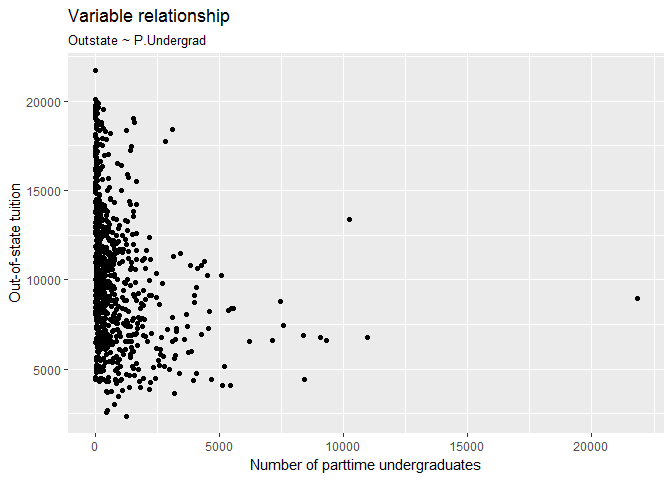

``` r
models_mses <- vector("numeric", 5)
terms <- 1:5

for(i in terms){
  models <- map(cv10_data$train, ~ glm(Outstate ~ poly(log(P.Undergrad), i) , data = .))
  models_mse <- map2_dbl(models, cv10_data$test, mse)
  models_mses[[i]] <- mean(models_mse, na.rm = TRUE)
}

data_frame(terms = terms,
           MSE = models_mses) %>%
  ggplot(aes(terms, MSE)) +
  geom_line() +
  scale_x_continuous(breaks = terms) +
  labs(title = "MSE estimates",
       subtitle = "Outstate ~ log(P.Undergrad)",
       x = "Degree of Polynomial",
       y = "Mean Squared Error")
```

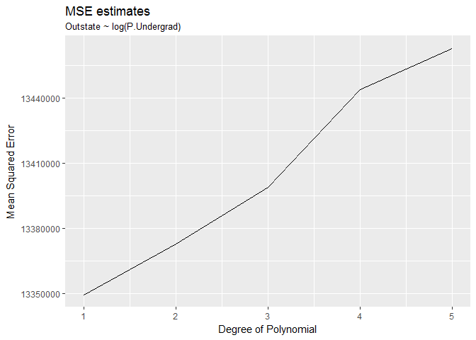

``` r
ggplot(df_college, aes(x = log(P.Undergrad), y = Outstate)) +
  geom_point() +
  geom_smooth(method = lm) +
  labs(title = "Variable relationship",
       subtitle = "Outstate ~ log(P.Undergrad)",
       x = "Log(number of parttime undergraduates)",
       y = "Out-of-state tuition")
```


``` r
model_PUndergrad <- lm(Outstate ~ log(P.Undergrad), data = df_college)
pander(summary(model_PUndergrad))
```

<table style="width:93%;">
<colgroup>
<col width="31%" />
<col width="15%" />
<col width="18%" />
<col width="13%" />
<col width="13%" />
</colgroup>
<thead>
<tr class="header">
<th align="center"> </th>
<th align="center">Estimate</th>
<th align="center">Std. Error</th>
<th align="center">t value</th>
<th align="center">Pr(&gt;|t|)</th>
</tr>
</thead>
<tbody>
<tr class="odd">
<td align="center"><strong>log(P.Undergrad)</strong></td>
<td align="center">-1044</td>
<td align="center">79.88</td>
<td align="center">-13.07</td>
<td align="center">2.004e-35</td>
</tr>
<tr class="even">
<td align="center"><strong>(Intercept)</strong></td>
<td align="center">16383</td>
<td align="center">473.1</td>
<td align="center">34.63</td>
<td align="center">1.544e-159</td>
</tr>
</tbody>
</table>

<table style="width:85%;">
<caption>Fitting linear model: Outstate ~ log(P.Undergrad)</caption>
<colgroup>
<col width="20%" />
<col width="30%" />
<col width="11%" />
<col width="22%" />
</colgroup>
<thead>
<tr class="header">
<th align="center">Observations</th>
<th align="center">Residual Std. Error</th>
<th align="center"><span class="math inline"><em>R</em><sup>2</sup></span></th>
<th align="center">Adjusted <span class="math inline"><em>R</em><sup>2</sup></span></th>
</tr>
</thead>
<tbody>
<tr class="odd">
<td align="center">777</td>
<td align="center">3644</td>
<td align="center">0.1806</td>
<td align="center">0.1796</td>
</tr>
</tbody>
</table>

#### P.Undergrad

As examining the scatter plot, I observe that most of the observations cluster with lower level `P.Undergrad`. Therefore, I do a log transformation to `P.Undergrad`. In the new scatter plot, I observe a generally linear and negative relationship between `log(P.Undergrad)` and `Outstate`. The observation is confirmed by the MSE estimate plot with a 10-fold cross validation approach; the MSE is lowest at degree 1.

I therefore apply a linear model to this relationship; the result is reported in the table above. The parameter for `log(P.Undergrad)` is statistically significant (p-value = 2.004e-35) at a 99.9 % confidence level. The parameter estimate is negative (-1044), which illustrates a negative relationship--a one percent increase in the number of parttime undergraduates corresponds to a decrease in the out-of-state tuition of $10.44.

This is probably because that part-time student signals the main student body of this institution is local, as part-time students work as they study, and can hard to be from other states. The lower needs from out-of-state decreases the price for the out-of-state students.

The linear fitting line is also plotted as above; it seems doing well. The only concern is as the observation with low `log(P.Undergrad)` is relatively few, the standard error is higher for lower `log(P.Undergrad)`, which gives us less confidence in predicting at lower `P.Undergrad` level.

``` r
#--PhD
models_mses <- vector("numeric", 5)
terms <- 1:5

for(i in terms){
  models <- map(cv10_data$train, ~ glm(Outstate ~ poly(PhD, i) , data = .))
  models_mse <- map2_dbl(models, cv10_data$test, mse)
  models_mses[[i]] <- mean(models_mse, na.rm = TRUE)
}

data_frame(terms = terms,
           MSE = models_mses) %>%
  ggplot(aes(terms, MSE)) +
  geom_line() +
  scale_x_continuous(breaks = terms) +
  labs(title = "MSE estimates",
       subtitle = "Outstate ~ PhD",
       x = "Degree of Polynomial",
       y = "Mean Squared Error")
```

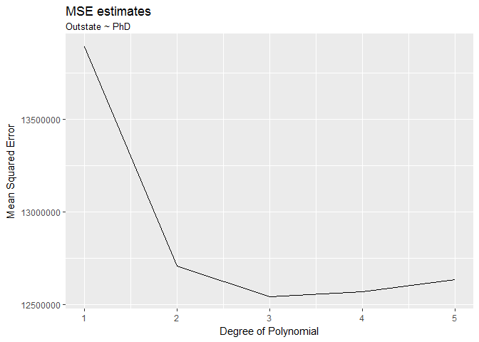

``` r
ggplot(df_college, aes(x = PhD, y = Outstate)) +
  geom_point() +
  geom_smooth(method = glm, formula = y ~ poly(x, 2), mapping = aes(color = "2")) +
  geom_smooth(method = glm, formula = y ~ poly(x, 3), mapping = aes(color = "3")) +
  scale_colour_manual(name = "Model degree", values = c("blue","red")) +
  labs(title = "Variable relationship",
       subtitle = "Outstate ~ PhD",
       x = "Percent of faculty with Ph.D.'s",
       y = "Out-of-state tuition")
```

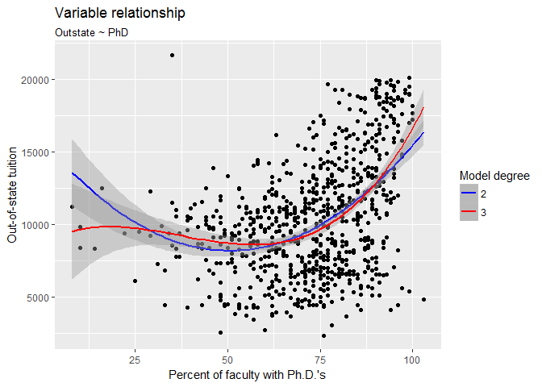

``` r
model_PhD <- glm(Outstate ~ poly(PhD, 3), data = df_college)
pander(summary(model_PhD))
```

<table style="width:89%;">
<colgroup>
<col width="27%" />
<col width="15%" />
<col width="18%" />
<col width="13%" />
<col width="13%" />
</colgroup>
<thead>
<tr class="header">
<th align="center"> </th>
<th align="center">Estimate</th>
<th align="center">Std. Error</th>
<th align="center">t value</th>
<th align="center">Pr(&gt;|t|)</th>
</tr>
</thead>
<tbody>
<tr class="odd">
<td align="center"><strong>poly(PhD, 3)1</strong></td>
<td align="center">42920</td>
<td align="center">3528</td>
<td align="center">12.17</td>
<td align="center">2.76e-31</td>
</tr>
<tr class="even">
<td align="center"><strong>poly(PhD, 3)2</strong></td>
<td align="center">30972</td>
<td align="center">3528</td>
<td align="center">8.78</td>
<td align="center">1.043e-17</td>
</tr>
<tr class="odd">
<td align="center"><strong>poly(PhD, 3)3</strong></td>
<td align="center">11772</td>
<td align="center">3528</td>
<td align="center">3.337</td>
<td align="center">0.0008872</td>
</tr>
<tr class="even">
<td align="center"><strong>(Intercept)</strong></td>
<td align="center">10441</td>
<td align="center">126.6</td>
<td align="center">82.5</td>
<td align="center">0</td>
</tr>
</tbody>
</table>

(Dispersion parameter for gaussian family taken to be 12444173 )

<table style="width:67%;">
<colgroup>
<col width="26%" />
<col width="40%" />
</colgroup>
<tbody>
<tr class="odd">
<td align="center">Null deviance:</td>
<td>1.256e+10 on 776 degrees of freedom</td>
</tr>
<tr class="even">
<td align="center">Residual deviance:</td>
<td>9.619e+09 on 773 degrees of freedom</td>
</tr>
</tbody>
</table>

#### PhD

As examining the scatter plot, I observe a seemingly quadratic relationship between `PhD` and `Outstate`. The observation is confirmed by the MSE estimate plot with a 10-fold cross validation approach; the MSE is much lower for degree 2 compared to degree 1, and has a lowest level at degree 3. Plotting both degree 2 and degree 3 fitting lines, I observe that the degree 3 line better explains the data with high and low levels of `PhD`.

I therefore apply a cubic model to this relationship; the result is reported in the table above. The parameters for degree 1, 2, and 3 are all statistically significant (p-value = 2.76e-31, 1.043e-17, and 0.0008872 respectively) at a 99.9 % confidence level. The parameter estimate are all positive (42920, 30972, and 11772 respectively), which illustrate a generally convex relationship--`PhD` and `Outstate` have little relationship at lower level of `PhD` (&lt; 70) but a positive relationship when `PhD` is high.

This is probably because that school has to pay more for PhD degree faculty and thus charges more from the students--but there's a threshold that could be a minimum level of market requirement, below which the school just don't have the power to increase the price.

``` r
#--Expend
ggplot(df_college, aes(x = Expend, y = Outstate)) +
  geom_point() +
  labs(title = "Variable relationship",
       subtitle = "Outstate ~ Expend",
       x = "Instructional expenditure per student",
       y = "Out-of-state tuition")
```

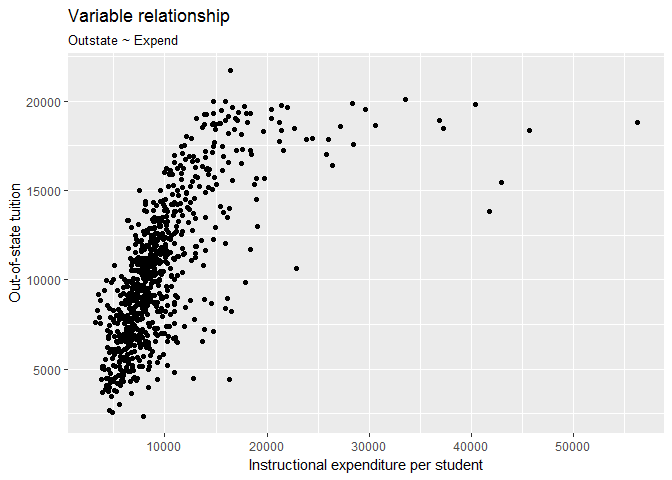

``` r
# function to simplify things
spline_cv <- function(data = cv10_data, degree = 3, df = 3){
  # estimate the model on each fold
  models <- map(data$train, ~ glm(Outstate ~ bs(log(Expend), df = df, degree = degree), data = .))
  
  # calculate mse for each test fold
  models_mse <- map2_dbl(models, data$test, mse)
  
  return(mean(models_mse, na.rm = TRUE))
}

# estimate mse for polynomial degrees
degree_mse <- data_frame(degrees = 1:5, mse = map_dbl(degrees, ~ spline_cv(degree = ., df = 3 + .)))
```

    ## Warning in bs(log(Expend), degree = 1L, knots =
    ## structure(c(8.81551832484895, : some 'x' values beyond boundary knots may
    ## cause ill-conditioned bases

    ## Warning in bs(log(Expend), degree = 1L, knots =
    ## structure(c(8.81789010229702, : some 'x' values beyond boundary knots may
    ## cause ill-conditioned bases

    ## Warning in bs(log(Expend), degree = 2L, knots =
    ## structure(c(8.81551832484895, : some 'x' values beyond boundary knots may
    ## cause ill-conditioned bases

    ## Warning in bs(log(Expend), degree = 2L, knots =
    ## structure(c(8.81789010229702, : some 'x' values beyond boundary knots may
    ## cause ill-conditioned bases

    ## Warning in bs(log(Expend), degree = 3L, knots =
    ## structure(c(8.81551832484895, : some 'x' values beyond boundary knots may
    ## cause ill-conditioned bases

    ## Warning in bs(log(Expend), degree = 3L, knots =
    ## structure(c(8.81789010229702, : some 'x' values beyond boundary knots may
    ## cause ill-conditioned bases

    ## Warning in bs(log(Expend), degree = 4L, knots =
    ## structure(c(8.81551832484895, : some 'x' values beyond boundary knots may
    ## cause ill-conditioned bases

    ## Warning in bs(log(Expend), degree = 4L, knots =
    ## structure(c(8.81789010229702, : some 'x' values beyond boundary knots may
    ## cause ill-conditioned bases

    ## Warning in bs(log(Expend), degree = 5L, knots =
    ## structure(c(8.81551832484895, : some 'x' values beyond boundary knots may
    ## cause ill-conditioned bases

    ## Warning in bs(log(Expend), degree = 5L, knots =
    ## structure(c(8.81789010229702, : some 'x' values beyond boundary knots may
    ## cause ill-conditioned bases

``` r
# estimate mse for degrees of freedom (aka knots)
df_mse <- data_frame(df = 1:10, mse = map_dbl(df, ~ spline_cv(df = 3 + .)))
```

    ## Warning in bs(log(Expend), degree = 3L, knots =
    ## structure(9.02737861029481, .Names = "50%"), : some 'x' values beyond
    ## boundary knots may cause ill-conditioned bases

    ## Warning in bs(log(Expend), degree = 3L, knots =
    ## structure(9.03693891255679, .Names = "50%"), : some 'x' values beyond
    ## boundary knots may cause ill-conditioned bases

    ## Warning in bs(log(Expend), degree = 3L, knots =
    ## structure(c(8.89649682258908, : some 'x' values beyond boundary knots may
    ## cause ill-conditioned bases

    ## Warning in bs(log(Expend), degree = 3L, knots =
    ## structure(c(8.89859306040825, : some 'x' values beyond boundary knots may
    ## cause ill-conditioned bases

    ## Warning in bs(log(Expend), degree = 3L, knots =
    ## structure(c(8.81551832484895, : some 'x' values beyond boundary knots may
    ## cause ill-conditioned bases

    ## Warning in bs(log(Expend), degree = 3L, knots =
    ## structure(c(8.81789010229702, : some 'x' values beyond boundary knots may
    ## cause ill-conditioned bases

    ## Warning in bs(log(Expend), degree = 3L, knots =
    ## structure(c(8.76823184019878, : some 'x' values beyond boundary knots may
    ## cause ill-conditioned bases

    ## Warning in bs(log(Expend), degree = 3L, knots =
    ## structure(c(8.77068746143964, : some 'x' values beyond boundary knots may
    ## cause ill-conditioned bases

    ## Warning in bs(log(Expend), degree = 3L, knots =
    ## structure(c(8.72923406806248, : some 'x' values beyond boundary knots may
    ## cause ill-conditioned bases

    ## Warning in bs(log(Expend), degree = 3L, knots =
    ## structure(c(8.74729763302861, : some 'x' values beyond boundary knots may
    ## cause ill-conditioned bases

    ## Warning in bs(log(Expend), degree = 3L, knots =
    ## structure(c(8.69411926349459, : some 'x' values beyond boundary knots may
    ## cause ill-conditioned bases

    ## Warning in bs(log(Expend), degree = 3L, knots =
    ## structure(c(8.71365242272042, : some 'x' values beyond boundary knots may
    ## cause ill-conditioned bases

    ## Warning in bs(log(Expend), degree = 3L, knots =
    ## structure(c(8.66604403794256, : some 'x' values beyond boundary knots may
    ## cause ill-conditioned bases

    ## Warning in bs(log(Expend), degree = 3L, knots =
    ## structure(c(8.6856692450384, : some 'x' values beyond boundary knots may
    ## cause ill-conditioned bases

    ## Warning in bs(log(Expend), degree = 3L, knots =
    ## structure(c(8.64133601758227, : some 'x' values beyond boundary knots may
    ## cause ill-conditioned bases

    ## Warning in bs(log(Expend), degree = 3L, knots =
    ## structure(c(8.65290757113369, : some 'x' values beyond boundary knots may
    ## cause ill-conditioned bases

    ## Warning in bs(log(Expend), degree = 3L, knots =
    ## structure(c(8.62266965887226, : some 'x' values beyond boundary knots may
    ## cause ill-conditioned bases

    ## Warning in bs(log(Expend), degree = 3L, knots =
    ## structure(c(8.62374895105093, : some 'x' values beyond boundary knots may
    ## cause ill-conditioned bases

    ## Warning in bs(log(Expend), degree = 3L, knots =
    ## structure(c(8.61059892218451, : some 'x' values beyond boundary knots may
    ## cause ill-conditioned bases

    ## Warning in bs(log(Expend), degree = 3L, knots =
    ## structure(c(8.61458169180897, : some 'x' values beyond boundary knots may
    ## cause ill-conditioned bases

``` r
# graph the results
ggplot(degree_mse, aes(degrees, mse)) +
  geom_point() +
  geom_line() +
  scale_x_continuous(breaks = 1:10) +
  labs(title = "Optimal number of degrees for spline regression",
       subtitle = "Outstate ~ log(Expend), knots = 3",
       x = "Highest-order polynomial",
       y = "10-fold CV MSE")
```

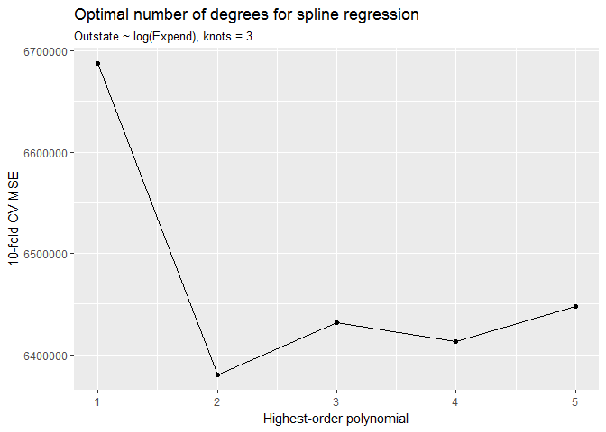

``` r
ggplot(df_mse, aes(df, mse)) +
  geom_point() +
  geom_line() +
  scale_x_continuous(breaks = 1:10) +
  labs(title = "Optimal number of knots for spline regression",
       subtitle = "Outstate ~ log(Expend), highest-order polynomial = 3",
       x = "Knots",
       y = "10-fold CV MSE")
```

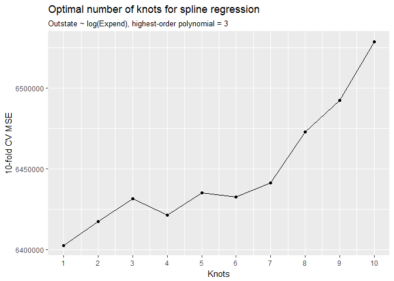

``` r
ggplot(df_college, aes(x = log(Expend), y = Outstate)) +
  geom_point() +
  geom_smooth(method = glm, formula = y ~ bs(log(x), df = 2 + 1, degree = 2))
```

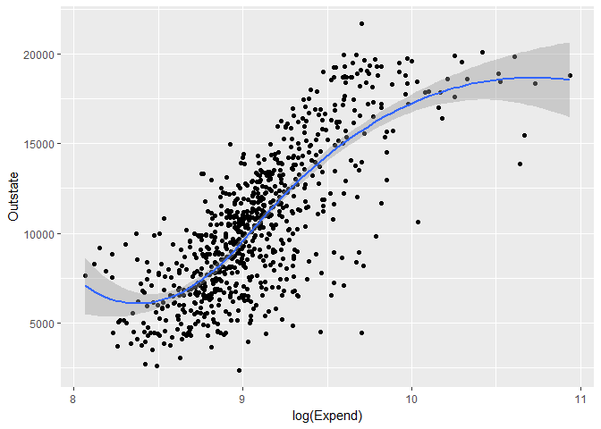

``` r
  labs(title = "Variable relationship",
       subtitle = "Outstate ~ log(Expend)",
       x = "Log(instructional expenditure per student)",
       y = "Out-of-state tuition")
```

    ## $title
    ## [1] "Variable relationship"
    ## 
    ## $subtitle
    ## [1] "Outstate ~ log(Expend)"
    ## 
    ## $x
    ## [1] "Log(instructional expenditure per student)"
    ## 
    ## $y
    ## [1] "Out-of-state tuition"
    ## 
    ## attr(,"class")
    ## [1] "labels"

``` r
model_Expend <- glm(Outstate ~ bs(log(Expend), df = 2 + 1, degree = 2), data = df_college)
pander(summary(model_Expend))
```

<table style="width:100%;">
<colgroup>
<col width="42%" />
<col width="14%" />
<col width="17%" />
<col width="13%" />
<col width="13%" />
</colgroup>
<thead>
<tr class="header">
<th align="center"> </th>
<th align="center">Estimate</th>
<th align="center">Std. Error</th>
<th align="center">t value</th>
<th align="center">Pr(&gt;|t|)</th>
</tr>
</thead>
<tbody>
<tr class="odd">
<td align="center"><strong>bs(log(Expend), df = 2 + 1, degree = 2)1</strong></td>
<td align="center">-2294</td>
<td align="center">964.4</td>
<td align="center">-2.379</td>
<td align="center">0.01759</td>
</tr>
<tr class="even">
<td align="center"><strong>bs(log(Expend), df = 2 + 1, degree = 2)2</strong></td>
<td align="center">13854</td>
<td align="center">735</td>
<td align="center">18.85</td>
<td align="center">1.664e-65</td>
</tr>
<tr class="odd">
<td align="center"><strong>bs(log(Expend), df = 2 + 1, degree = 2)3</strong></td>
<td align="center">11266</td>
<td align="center">1471</td>
<td align="center">7.658</td>
<td align="center">5.639e-14</td>
</tr>
<tr class="even">
<td align="center"><strong>(Intercept)</strong></td>
<td align="center">6754</td>
<td align="center">770.3</td>
<td align="center">8.768</td>
<td align="center">1.145e-17</td>
</tr>
</tbody>
</table>

(Dispersion parameter for gaussian family taken to be 6373111 )

<table style="width:67%;">
<colgroup>
<col width="26%" />
<col width="40%" />
</colgroup>
<tbody>
<tr class="odd">
<td align="center">Null deviance:</td>
<td>1.256e+10 on 776 degrees of freedom</td>
</tr>
<tr class="even">
<td align="center">Residual deviance:</td>
<td>4.926e+09 on 773 degrees of freedom</td>
</tr>
</tbody>
</table>

#### Expend

As examining the scatter plot, I observe that most of the observations cluster with lower level `Expend`. Therefore, I do a log transformation to `Expend`. In the new scatter plot, I observe a generally S-shaped relationship between `log(Expend)` and `Outstate`. The observation is confirmed by the MSE estimate plot with a 10-fold cross validation approach; the MSE has a lowest level at degree 2 and a lowest level with 1 knot if using splining.

I therefore apply a quadratic spline model with 1 knot to this relationship; the result is reported in the table above. The parameters for all degrees are significant at a 95% confidence level. An S-shaped fitting line is plotted; it seems generally doing well. The only caveat is the lack of information for extremly high and low `Expend`, which leads to higher std error and gives us less confidence in predicting at the extreme levels.

The S-shaped relationship is probably because that there's a general positive correlation of all fees charged by a school, corresponding to its education quality and market position. However, the relationship could stop above or below certain thresholds, which leads to the S-shaped curve in the graph.

To sum up, as we observe from the relationships, the higher quality of the institution provide, the higher out-of-state fee it charges to the students. The quality could reflects in many ways, for example, the number of PhD faculty it has, the quality of the incoming students, or other fees charged by the school.

Part 3: College (GAM)
=====================

### 1.Split the data into a training set and a test set.

``` r
set.seed(1234)

df_college_split <- resample_partition(df_college, c(test = 0.3, train = 0.7))
```

The data is split with a 70% training set and a 30% testing set.

### 2.Estimate an OLS model on the training data, using out-of-state tuition (Outstate) as the response variable and the other six variables as the predictors. Interpret the results and explain your findings, using appropriate techniques (tables, graphs, statistical tests, etc.).

``` r
lm_college <- lm(Outstate ~ Private + Room.Board + PhD + perc.alumni + log(Expend) + Grad.Rate, data = df_college_split$train)
pander(summary(lm_college))
```

<table style="width:86%;">
<colgroup>
<col width="25%" />
<col width="15%" />
<col width="18%" />
<col width="13%" />
<col width="13%" />
</colgroup>
<thead>
<tr class="header">
<th align="center"> </th>
<th align="center">Estimate</th>
<th align="center">Std. Error</th>
<th align="center">t value</th>
<th align="center">Pr(&gt;|t|)</th>
</tr>
</thead>
<tbody>
<tr class="odd">
<td align="center"><strong>PrivateYes</strong></td>
<td align="center">2149</td>
<td align="center">242.7</td>
<td align="center">8.852</td>
<td align="center">1.244e-17</td>
</tr>
<tr class="even">
<td align="center"><strong>Room.Board</strong></td>
<td align="center">0.838</td>
<td align="center">0.09837</td>
<td align="center">8.519</td>
<td align="center">1.634e-16</td>
</tr>
<tr class="odd">
<td align="center"><strong>PhD</strong></td>
<td align="center">19.32</td>
<td align="center">6.7</td>
<td align="center">2.884</td>
<td align="center">0.00409</td>
</tr>
<tr class="even">
<td align="center"><strong>perc.alumni</strong></td>
<td align="center">46.3</td>
<td align="center">8.542</td>
<td align="center">5.421</td>
<td align="center">8.992e-08</td>
</tr>
<tr class="odd">
<td align="center"><strong>log(Expend)</strong></td>
<td align="center">4009</td>
<td align="center">296.3</td>
<td align="center">13.53</td>
<td align="center">4.153e-36</td>
</tr>
<tr class="even">
<td align="center"><strong>Grad.Rate</strong></td>
<td align="center">30.54</td>
<td align="center">6.292</td>
<td align="center">4.854</td>
<td align="center">1.592e-06</td>
</tr>
<tr class="odd">
<td align="center"><strong>(Intercept)</strong></td>
<td align="center">-35608</td>
<td align="center">2310</td>
<td align="center">-15.41</td>
<td align="center">1.2e-44</td>
</tr>
</tbody>
</table>

<table style="width:85%;">
<caption>Fitting linear model: Outstate ~ Private + Room.Board + PhD + perc.alumni + log(Expend) + Grad.Rate</caption>
<colgroup>
<col width="20%" />
<col width="30%" />
<col width="11%" />
<col width="22%" />
</colgroup>
<thead>
<tr class="header">
<th align="center">Observations</th>
<th align="center">Residual Std. Error</th>
<th align="center"><span class="math inline"><em>R</em><sup>2</sup></span></th>
<th align="center">Adjusted <span class="math inline"><em>R</em><sup>2</sup></span></th>
</tr>
</thead>
<tbody>
<tr class="odd">
<td align="center">544</td>
<td align="center">1965</td>
<td align="center">0.758</td>
<td align="center">0.7553</td>
</tr>
</tbody>
</table>

``` r
ggplot(df_college, aes(x = perc.alumni, y = Outstate)) +
  geom_point() +
  geom_smooth(method = lm) +
  labs(title = "Variable relationship",
       subtitle = "Outstate ~ perc.alumni",
       x = "Percent of alumni who donate",
       y = "Out-of-state tuition")
```


``` r
ggplot(df_college, aes(x = Room.Board, y = Outstate)) +
  geom_point() +
  geom_smooth(method = lm) +
  labs(title = "Variable relationship",
       subtitle = "Outstate ~ Room.Board",
       x = "Room and board costs",
       y = "Out-of-state tuition")
```

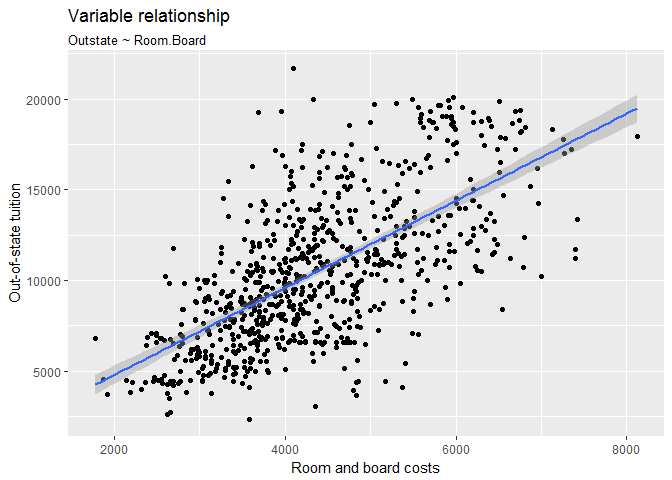

``` r
ggplot(df_college, aes(x = Private, y = Outstate)) +
  geom_point() +
  geom_smooth(method = lm) +
  labs(title = "Variable relationship",
       subtitle = "Outstate ~ Private",
       x = "Is private university",
       y = "Out-of-state tuition")
```

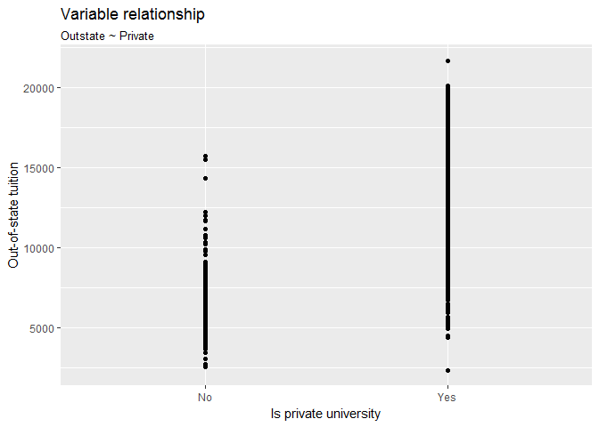

``` r
ggplot(df_college, aes(x = Grad.Rate, y = Outstate)) +
  geom_point() +
  geom_smooth(method = lm) +
  labs(title = "Variable relationship",
       subtitle = "Outstate ~ Grad.Rate",
       x = "Graduation rate",
       y = "Out-of-state tuition")
```

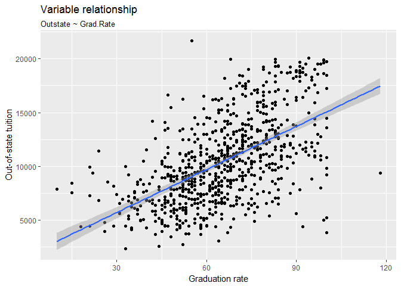

As visually examining the relationship between each predictor variable and the `Outstate`, I decide to do a log transformation to `Expend`, with the reason mentioned in the last problem, and preserve all other variables as their original form in this model. The estimated parameters and standard errors of the predictor variables by the training data and a linear model are shown in the table above.

All parameters are statistically significant at a 99.9% confidence level, with p-values ranging from 4.153e-36 for `log(Expend)` to 0.00409 for `PhD`. The R-squared value of this model is 0.758, which indicates that 75.8% of the variance of the respondent variable is explained by this model; it seems not bad as this model has the strong assumption of all linear relationships between predictor and respondent variables.

All parameters are positive, which means a positive relationship between each predictor and the `Outstate`, as presented in the graphs. Regarding each predictor:
The parameter estimate of `Private` is 2149, which illustrates that, holding other variables constant, on average, the private schools cahrge $2,149 more at `Outstate` than the public schools.
The parameter estimate of `Room.Board` is 0.838, which illustrates that, holding other variables constant, an additional dollar of the room and board costs corresponds to an increase in the out-of-state tuition of $0.838.
The parameter estimate of `PhD` is 19.32, which illustrates that, holding other variables constant, an additional percent of the faculty holding PhD degree corresponds to an increase in the out-of-state tuition of $19.32.
The parameter estimate of `perc.alumni` is 46.3, which illustrates that, holding other variables constant, an additional percent of the alumni donates corresponds to an increase in the out-of-state tuition of $46.3.
The parameter estimate of `log(Expend)` is 4009, which illustrates that, holding other variables constant, an additional percent of the instructional expenditure corresponds to an increase in the out-of-state tuition of $40.09. Finally, the parameter estimate of `Grad.Rate` is 30.54, which illustrates that, holding other variables constant, an additional percent of the instructional expenditure corresponds to an increase in the out-of-state tuition of $30.54.

As summarized in the last problem, generally, the higher the education, the higher the `Outstate` charge. The quality can be estimated from `Private`, `PhD`, `perc.alumni`, and `Grad.Rate`. Also, the `Outstate` fee is positively correlated to other expenses, including `Expend` and `Room.Board` in this model.

### 3.Estimate a GAM on the training data, using out-of-state tuition (Outstate) as the response variable and the other six variables as the predictors. You can select any non-linear method (or linear) presented in the readings or in-class to fit each variable. Plot the results, and explain your findings. Interpret the results and explain your findings, using appropriate techniques (tables, graphs, statistical tests, etc.).

``` r
gam_college <- gam(Outstate ~ Private + Room.Board + poly(PhD, 3) + perc.alumni + bs(log(Expend), df = 2 + 1, degree = 2) + poly(Grad.Rate, 3), data = df_college_split$train)

gam_terms <- preplot(gam_college, se = TRUE, rug = FALSE)
```

As Examining the scatter plots drawn in the previous question and the MSE calculated in the last problem part, I apply linear model for `Private`, `Room.Board`, and `perc.alumni`, cubic model for `PhD` and `Grad.Rate`, and a quadratic spline model with 1 knot for log-transformed `Expend`.

``` r
## Private
data_frame(x = gam_terms$`Private`$x,
           y = gam_terms$`Private`$y,
           se.fit = gam_terms$`Private`$se.y) %>%
  unique %>%
  mutate(y_low = y - 1.96 * se.fit,
         y_high = y + 1.96 * se.fit,
         x = factor(x, levels = c("Yes", "No"), labels = c("Yes", "No"))) %>%
  ggplot(aes(x, y, ymin = y_low, ymax = y_high)) +
  geom_errorbar() +
  geom_point() +
  labs(title = "GAM of out-of-state tuition",
       subtitle = "Linear",
       x = NULL,
       y = expression(f[1](private)))
```

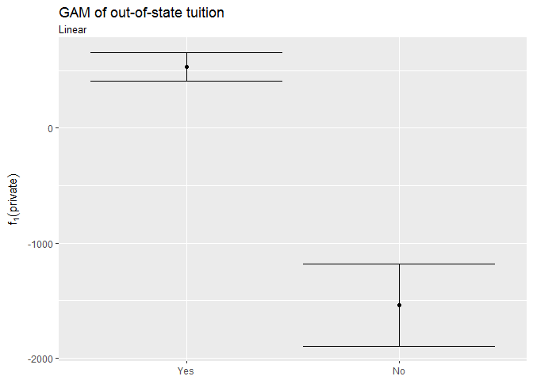

As for `Private`, the 95% confidence interval is not overlapped, which indicates a statistically significant difference between private and public schools regarding `Outstate`. The amount of difference is about 2,500, similar to the result from my pure linear model.

``` r
# Room.Board
data_frame(x = gam_terms$`Room.Board`$x,
           y = gam_terms$`Room.Board`$y,
           se.fit = gam_terms$`Room.Board`$se.y) %>%
  mutate(y_low = y - 1.96 * se.fit,
         y_high = y + 1.96 * se.fit) %>%
  ggplot(aes(x, y)) +
  geom_line() +
  geom_line(aes(y = y_low), linetype = 2) +
  geom_line(aes(y = y_high), linetype = 2) +
  labs(title = "GAM of out-of-state tuition",
       subtitle = "Linear",
       x = "Room and board costs",
       y = expression(f[1](Room.Board)))
```

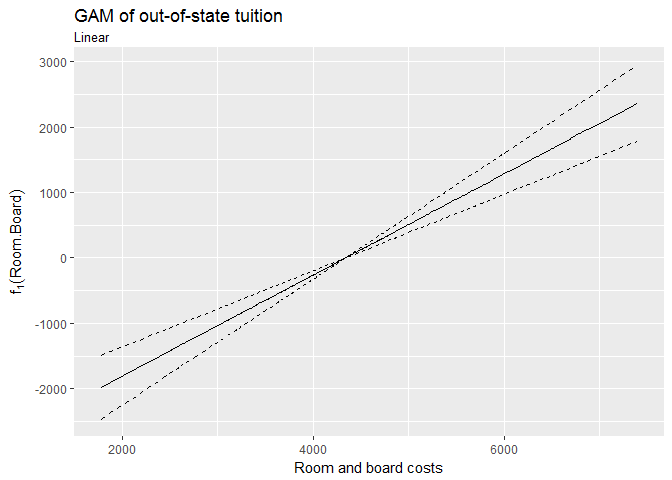

As for `Room.Board`, its positive relatinoship with `Outstate` seems statistically strong as the belt of the 95% confidence interval is narrow.

``` r
#  PhD
data_frame(x = gam_terms$`poly(PhD, 3)`$x,
           y = gam_terms$`poly(PhD, 3)`$y,
           se.fit = gam_terms$`poly(PhD, 3)`$se.y) %>%
  mutate(y_low = y - 1.96 * se.fit,
         y_high = y + 1.96 * se.fit) %>%
  ggplot(aes(x, y)) +
  geom_line() +
  geom_line(aes(y = y_low), linetype = 2) +
  geom_line(aes(y = y_high), linetype = 2) +
  labs(title = "GAM of out-of-state tuition",
       subtitle = "Cubic",
       x = "PhD",
       y = expression(f[3](PhD)))
```

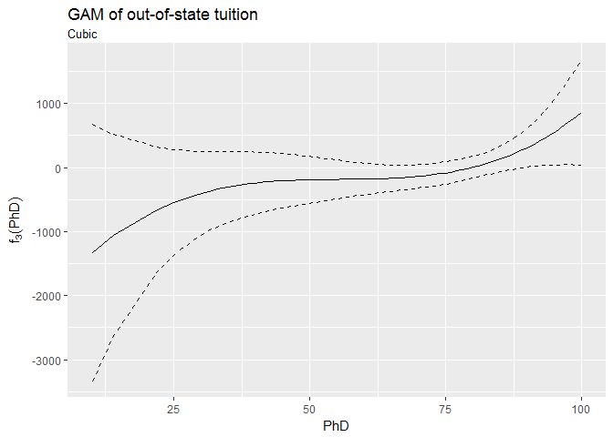

As for `PhD`, its cubic relatinoship with `Outstate` seems weak as the belt of the 95% confidence interval is wide and the slope of the fitting line is close to zero.

``` r
# perc.alumni
data_frame(x = gam_terms$`perc.alumni`$x,
           y = gam_terms$`perc.alumni`$y,
           se.fit = gam_terms$`perc.alumni`$se.y) %>%
  mutate(y_low = y - 1.96 * se.fit,
         y_high = y + 1.96 * se.fit) %>%
  ggplot(aes(x, y)) +
  geom_line() +
  geom_line(aes(y = y_low), linetype = 2) +
  geom_line(aes(y = y_high), linetype = 2) +
  labs(title = "GAM of out-of-state tuition",
       subtitle = "Linear",
       x = "Percent of alumni who donate",
       y = expression(f[1](perc.alumni)))
```

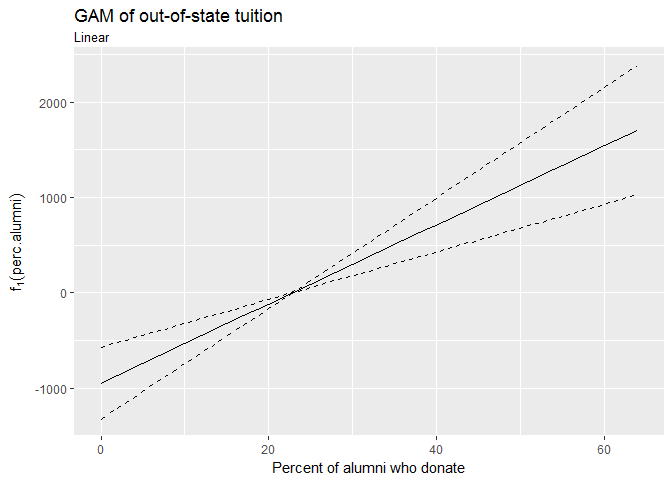

As for `perc.alumni`, its linear relatinoship with `Outstate` seems weak as the belt of the 95% confidence interval is wide.

``` r
# Expend
data_frame(x = gam_terms$`bs(log(Expend), df = 2 + 1, degree = 2)`$x,
           y = gam_terms$`bs(log(Expend), df = 2 + 1, degree = 2)`$y,
           se.fit = gam_terms$`bs(log(Expend), df = 2 + 1, degree = 2)`$se.y) %>%
  mutate(y_low = y - 1.96 * se.fit,
         y_high = y + 1.96 * se.fit) %>%
  ggplot(aes(x, y)) +
  geom_line() +
  geom_line(aes(y = y_low), linetype = 2) +
  geom_line(aes(y = y_high), linetype = 2) +
  labs(title = "GAM of out-of-state tuition",
       subtitle = "Cubic spline",
       x = "Log(Instructional expenditure per student)",
       y = expression(f[3](log(Expend))))
```

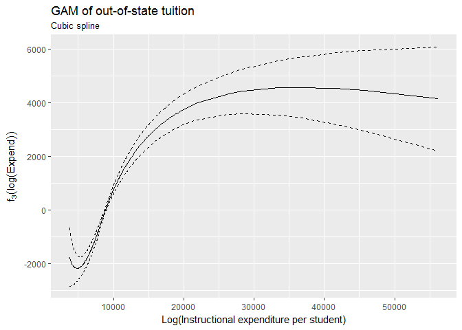

As for `log(Expend)`, its relatinoship with `Outstate` described by a quadratic spline model seems not so strong as the belt of the 95% confidence interval at the higher level of `log(Expend)` is very wide.

``` r
# Grad.Rate
data_frame(x = gam_terms$`poly(Grad.Rate, 3)`$x,
           y = gam_terms$`poly(Grad.Rate, 3)`$y,
           se.fit = gam_terms$`poly(Grad.Rate, 3)`$se.y) %>%
  mutate(y_low = y - 1.96 * se.fit,
         y_high = y + 1.96 * se.fit) %>%
  ggplot(aes(x, y)) +
  geom_line() +
  geom_line(aes(y = y_low), linetype = 2) +
  geom_line(aes(y = y_high), linetype = 2) +
  labs(title = "GAM of out-of-state tuition",
       subtitle = "Cubic",
       x = "Graduation rate",
       y = expression(f[3](Grad.Rate)))
```

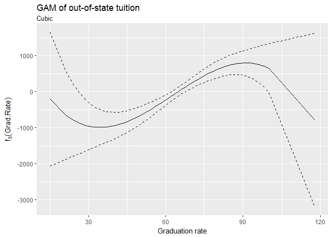

As for `Grad.Rate`, its cubic relatinoship with `Outstate` seems not so strong as the belt of the 95% confidence interval at the higher and lower level of `Grad.Rate` is very wide.

### 4.Use the test set to evaluate the model fit of the estimated OLS and GAM models, and explain the results obtained.

``` r
lm_mse <- mse(lm_college, df_college_split$test)
gam_mse <- mse(gam_college, df_college_split$test)
```

    ## Warning in bs(log(Expend), degree = 2L, knots =
    ## structure(9.03872127488767, .Names = "50%"), : some 'x' values beyond
    ## boundary knots may cause ill-conditioned bases

``` r
data_frame(model = c("LM", "GAM"),
           MSE = c(lm_mse, gam_mse))
```

    ## # A tibble: 2 × 2
    ##   model     MSE
    ##   <chr>   <dbl>
    ## 1    LM 3619101
    ## 2   GAM 3435798

The GAM does better than the LM in terms of a lower MSE (3435798) compared to LM's (3619101), which indicates a 5.0648766% improvement of the LM's MSE, and a larger proportion of variance in the dependent variable is successfully captured by the non-linear models used in the GAM.

### 5.For which variables, if any, is there evidence of a non-linear relationship with the response?

I put the variables with non-linear models in the GAM to test if they are appropriate. I include three models for each variable, the non-linear model, the linear model, and the model excluding the specific variable, in the ANOVA test.

``` r
#-- PhD
gam_PhD_rm <- gam(Outstate ~ Private + Room.Board + perc.alumni + bs(log(Expend), df = 2 + 1, degree = 2) + poly(Grad.Rate, 3), data = df_college_split$train)

gam_PhD_lm <- gam(Outstate ~ Private + Room.Board + PhD + perc.alumni + bs(log(Expend), df = 2 + 1, degree = 2) + poly(Grad.Rate, 3), data = df_college_split$train)

pander(anova(gam_PhD_rm, gam_PhD_lm, gam_college, test = "F"))
```

<table style="width:76%;">
<caption>Analysis of Deviance Table</caption>
<colgroup>
<col width="16%" />
<col width="18%" />
<col width="6%" />
<col width="15%" />
<col width="8%" />
<col width="11%" />
</colgroup>
<thead>
<tr class="header">
<th align="center">Resid. Df</th>
<th align="center">Resid. Dev</th>
<th align="center">Df</th>
<th align="center">Deviance</th>
<th align="center">F</th>
<th align="center">Pr(&gt;F)</th>
</tr>
</thead>
<tbody>
<tr class="odd">
<td align="center">534</td>
<td align="center">1.95e+09</td>
<td align="center">NA</td>
<td align="center">NA</td>
<td align="center">NA</td>
<td align="center">NA</td>
</tr>
<tr class="even">
<td align="center">533</td>
<td align="center">1.936e+09</td>
<td align="center">1</td>
<td align="center">13498949</td>
<td align="center">3.716</td>
<td align="center">0.05441</td>
</tr>
<tr class="odd">
<td align="center">531</td>
<td align="center">1.929e+09</td>
<td align="center">2</td>
<td align="center">7453225</td>
<td align="center">1.026</td>
<td align="center">0.3592</td>
</tr>
</tbody>
</table>

As for `PhD`, the p-value for the simple linear model is 0.05441, which means the residual deviance of the model is reduced statistically significant at a 99% confidence level and it is appropriate to include the linear-form `PhD` in the model. However, the p-value for the non-linear (cubic in this case) model is large, at 0.3592, which means the residual deviance is not significantly reduced by including `PhD`'s cubic model. The F test suggests that we should change the modeling of `PhD` to a simpler linear relationship.

``` r
#-- Expend
gam_Expend_rm <- gam(Outstate ~ Private + Room.Board + poly(PhD, 3) + perc.alumni + poly(Grad.Rate, 3), data = df_college_split$train)

gam_Expend_lm <- gam(Outstate ~ Private + Room.Board + poly(PhD, 3) + perc.alumni + log(Expend) + poly(Grad.Rate, 3), data = df_college_split$train)

pander(anova(gam_Expend_rm, gam_Expend_lm, gam_college, test = "F"))
```

<table style="width:78%;">
<caption>Analysis of Deviance Table</caption>
<colgroup>
<col width="16%" />
<col width="18%" />
<col width="6%" />
<col width="15%" />
<col width="8%" />
<col width="12%" />
</colgroup>
<thead>
<tr class="header">
<th align="center">Resid. Df</th>
<th align="center">Resid. Dev</th>
<th align="center">Df</th>
<th align="center">Deviance</th>
<th align="center">F</th>
<th align="center">Pr(&gt;F)</th>
</tr>
</thead>
<tbody>
<tr class="odd">
<td align="center">534</td>
<td align="center">2.572e+09</td>
<td align="center">NA</td>
<td align="center">NA</td>
<td align="center">NA</td>
<td align="center">NA</td>
</tr>
<tr class="even">
<td align="center">533</td>
<td align="center">2.033e+09</td>
<td align="center">1</td>
<td align="center">538162265</td>
<td align="center">148.2</td>
<td align="center">3.094e-30</td>
</tr>
<tr class="odd">
<td align="center">531</td>
<td align="center">1.929e+09</td>
<td align="center">2</td>
<td align="center">104646255</td>
<td align="center">14.41</td>
<td align="center">8.086e-07</td>
</tr>
</tbody>
</table>

As for `log(Expend)`, the p-value for both linear and the degree-3 spline model are low (3.094e-30 and 8.086e-07 respectively). This indicates the effective reduction in the residual deviance by the non-linear model, statistically significant at a 99.9% confidence level. The F test suggests that we retain the non-linear spline model of `log(Expend)`.

``` r
#-- Grad.Rate
gam_GradRate_rm <- gam(Outstate ~ Private + Room.Board + poly(PhD, 3) + perc.alumni + bs(log(Expend), df = 2 + 1, degree = 2), data = df_college_split$train)

gam_GradRate_lm <- gam(Outstate ~ Private + Room.Board + poly(PhD, 3) + perc.alumni + bs(log(Expend), df = 2 + 1, degree = 2) + Grad.Rate, data = df_college_split$train)

pander(anova(gam_GradRate_rm, gam_GradRate_lm, gam_college, test = "F"))
```

<table style="width:78%;">
<caption>Analysis of Deviance Table</caption>
<colgroup>
<col width="16%" />
<col width="18%" />
<col width="6%" />
<col width="15%" />
<col width="8%" />
<col width="12%" />
</colgroup>
<thead>
<tr class="header">
<th align="center">Resid. Df</th>
<th align="center">Resid. Dev</th>
<th align="center">Df</th>
<th align="center">Deviance</th>
<th align="center">F</th>
<th align="center">Pr(&gt;F)</th>
</tr>
</thead>
<tbody>
<tr class="odd">
<td align="center">534</td>
<td align="center">2.04e+09</td>
<td align="center">NA</td>
<td align="center">NA</td>
<td align="center">NA</td>
<td align="center">NA</td>
</tr>
<tr class="even">
<td align="center">533</td>
<td align="center">1.946e+09</td>
<td align="center">1</td>
<td align="center">93993044</td>
<td align="center">25.88</td>
<td align="center">5.054e-07</td>
</tr>
<tr class="odd">
<td align="center">531</td>
<td align="center">1.929e+09</td>
<td align="center">2</td>
<td align="center">17375326</td>
<td align="center">2.392</td>
<td align="center">0.09245</td>
</tr>
</tbody>
</table>

The result for `Grad.Rate` is similar to `PhD`'s. The p-value for the simple linear model is 5.054e-07, which means the residual deviance of the model is reduced statistically significant at a 99.9% confidence level and it is appropriate to include the linear-form `Grad.Rate` in the model. However, the p-value for the non-linear (cubic in this case) model is large, at 0.09245, which means the residual deviance is only slightly significantly reduced by including `Grad.Rate`'s cubic model at a 90% confidence level. The F test suggests that we could consider changing the modeling of `Grad.Rate` to a simpler linear relationship.
