PS\#8: tree-based methods and support vector machines
================
Chih-Yu Chiang
UCID 12145146
Mar. 6, 2017

``` r
library(knitr)
library(tidyverse)
```

    ## Loading tidyverse: ggplot2
    ## Loading tidyverse: tibble
    ## Loading tidyverse: tidyr
    ## Loading tidyverse: readr
    ## Loading tidyverse: purrr
    ## Loading tidyverse: dplyr

    ## Conflicts with tidy packages ----------------------------------------------

    ## filter(): dplyr, stats
    ## lag():    dplyr, stats

``` r
library(forcats)
library(broom)
library(modelr)
```

    ## 
    ## Attaching package: 'modelr'

    ## The following object is masked from 'package:broom':
    ## 
    ##     bootstrap

``` r
library(tree)
library(randomForest)
```

    ## randomForest 4.6-12

    ## Type rfNews() to see new features/changes/bug fixes.

    ## 
    ## Attaching package: 'randomForest'

    ## The following object is masked from 'package:dplyr':
    ## 
    ##     combine

    ## The following object is masked from 'package:ggplot2':
    ## 
    ##     margin

``` r
library(stringr)
library(ISLR)
library(gridExtra)
```

    ## 
    ## Attaching package: 'gridExtra'

    ## The following object is masked from 'package:randomForest':
    ## 
    ##     combine

    ## The following object is masked from 'package:dplyr':
    ## 
    ##     combine

``` r
library(grid)
library(pROC)
```

    ## Type 'citation("pROC")' for a citation.

    ## 
    ## Attaching package: 'pROC'

    ## The following objects are masked from 'package:stats':
    ## 
    ##     cov, smooth, var

``` r
library(gbm)
```

    ## Loading required package: survival

    ## Loading required package: lattice

    ## Loading required package: splines

    ## Loading required package: parallel

    ## Loaded gbm 2.1.1

``` r
library(ggdendro)
library(e1071)

options(digits = 4)
set.seed(1234)

df_biden <- read_csv("data/biden.csv") %>%
  mutate_each(funs(as.factor(.)), female, dem, rep)
```

    ## Parsed with column specification:
    ## cols(
    ##   biden = col_integer(),
    ##   female = col_integer(),
    ##   age = col_integer(),
    ##   educ = col_integer(),
    ##   dem = col_integer(),
    ##   rep = col_integer()
    ## )

``` r
df_mental <- read_csv("data/mental_health.csv") %>% 
  mutate(vote96 = factor(vote96, levels = 0:1, labels = c("xvote", "vote")), black = factor(black), female = factor(female), married = factor(married))
```

    ## Parsed with column specification:
    ## cols(
    ##   vote96 = col_double(),
    ##   mhealth_sum = col_double(),
    ##   age = col_double(),
    ##   educ = col_double(),
    ##   black = col_double(),
    ##   female = col_double(),
    ##   married = col_double(),
    ##   inc10 = col_double()
    ## )

``` r
df_mental_n <- read_csv("data/mental_health.csv")
```

    ## Parsed with column specification:
    ## cols(
    ##   vote96 = col_double(),
    ##   mhealth_sum = col_double(),
    ##   age = col_double(),
    ##   educ = col_double(),
    ##   black = col_double(),
    ##   female = col_double(),
    ##   married = col_double(),
    ##   inc10 = col_double()
    ## )

``` r
df_simpson <- read_csv("data/simpson.csv") %>%
  mutate_each(funs(as.factor(.)), guilt, dem, rep, ind, female, black, hispanic, educ, income)
```

    ## Parsed with column specification:
    ## cols(
    ##   guilt = col_double(),
    ##   dem = col_double(),
    ##   rep = col_double(),
    ##   ind = col_double(),
    ##   age = col_double(),
    ##   educ = col_character(),
    ##   female = col_double(),
    ##   black = col_double(),
    ##   hispanic = col_double(),
    ##   income = col_character()
    ## )

``` r
mse <- function(model, data) {
  x <- modelr:::residuals(model, data)
  mean(x ^ 2, na.rm = TRUE)
}

err.rate.tree <- function(model, data) {
  data <- as_tibble(data)
  response <- as.character(model$terms[[2]])
  
  pred <- predict(model, newdata = data, type = "class")
  actual <- data[[response]]
  
  return(mean(pred != actual, na.rm = TRUE))
}
```

Part 1: Sexy Joe Biden (redux times two)
----------------------------------------

### 1. Split the data into a training set (70%) and a validation set (30%).

``` r
set.seed(1234)

#Split data
df_biden_split <- resample_partition(df_biden, c(test = 0.3, train = 0.7))
```

The Biden data is split into 70% training and 30% validation sets.

### 2. Fit a decision tree to the training data with default options, with biden as the response variable and the other variables as predictors. Plot the tree and interpret the results. What is the test MSE?

``` r
set.seed(1234)

#Grow tree
biden_tree_default <- tree(biden ~ female + age + dem + rep + educ, data = df_biden_split$train)

#Plot tree
tree_data <- dendro_data(biden_tree_default)

ggplot(segment(tree_data)) +
  geom_segment(aes(x = x, y = y, xend = xend, yend = yend), alpha = 0.5) +
  geom_text(data = label(tree_data), aes(x = x, y = y, label = label_full), vjust = -0.5, size = 3) +
  geom_text(data = leaf_label(tree_data), aes(x = x, y = y, label = label), vjust = 0.5, size = 3) +
  theme_dendro() +
  labs(title = "Biden thermometer tree - default",
       subtitle = "female + age + dem + rep + educ")
```

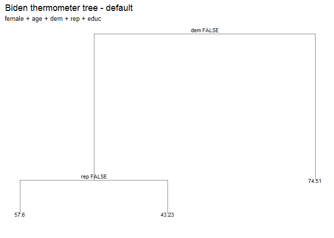

``` r
#Mse
biden_tree_default_testmse <- mse(biden_tree_default, df_biden_split$test)
biden_tree_default_testmse
```

    ## [1] 406.4

A decision tree with default setting is fit and graphed as above.

If `dem` = FALSE (the respondent is not a Democrat), then we proceed down the left branch to the next internal node.
- If `rep` = FALSE (the respondent is not a Republican), then the model estimates the Biden thermometer to be 57.6.
- If `rep` = TRUE (the respondent is a Republican), then the model estimates the Biden thermometer to be 43.23.

If `dem` = TRUE (the respondent is a Democrat), then the model estimates the Biden thermometer to be 74.51.

The test MSE is 406.4167.

### 3. Fit another tree to the training data with specified control options. Use cross-validation to determine the optimal level of tree complexity, plot the optimal tree, and interpret the results. Does pruning the tree improve the test MSE?

``` r
set.seed(1234)

#grow tree
biden_tree_option <- tree(biden ~ female + age + dem + rep + educ, data = df_biden_split$train, control = tree.control(nobs = nrow(df_biden_split$train), mindev = 0))

#Plot tree-all
tree_data <- dendro_data(biden_tree_option)

ggplot(segment(tree_data)) +
  geom_segment(aes(x = x, y = y, xend = xend, yend = yend), alpha = 0.5) +
  geom_text(data = label(tree_data), aes(x = x, y = y, label = label_full), vjust = -0.5, size = 3) +
  geom_text(data = leaf_label(tree_data), aes(x = x, y = y, label = label), vjust = 0.5, size = 3) +
  theme_dendro() +
  labs(title = "Biden thermometer tree - all nodes",
       subtitle = "female + age + dem + rep + educ")
```

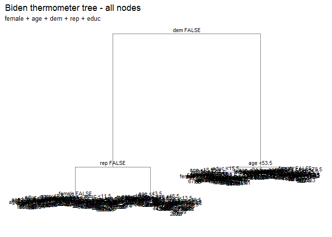

``` r
#Mse-all
biden_tree_optionall_testmse <- mse(biden_tree_option, df_biden_split$test)
biden_tree_optionall_testmse
```

    ## [1] 481.5

``` r
#Generate 10-fold CV trees
biden_cv <- crossv_kfold(df_biden, k = 10) %>%
  mutate(tree = map(train, ~ tree(biden ~ female + age + dem + rep + educ, data = ., control = tree.control(nobs = nrow(df_biden), mindev = 0))))

# calculate each possible prune result for each fold
biden_cv <- expand.grid(biden_cv$.id, 2:20) %>%
  as_tibble() %>%
  mutate(Var2 = as.numeric(Var2)) %>%
  rename(.id = Var1,
         k = Var2) %>%
  left_join(biden_cv) %>%
  mutate(prune = map2(tree, k, ~ prune.tree(.x, best = .y)),
         mse = map2_dbl(prune, test, mse))
```

    ## Joining, by = ".id"

    ## Warning in left_join_impl(x, y, by$x, by$y, suffix$x, suffix$y): joining
    ## character vector and factor, coercing into character vector

``` r
biden_cv %>%
  select(k, mse) %>%
  group_by(k) %>%
  summarize(test_mse = mean(mse),
            sd = sd(mse, na.rm = TRUE)) %>%
  ggplot(aes(k, test_mse)) +
  geom_point() +
  geom_line() +
  labs(title = "Biden thermometer tree",
       subtitle = "female + age + dem + rep + educ",
       x = "Number of terminal nodes",
       y = "Test MSE")
```

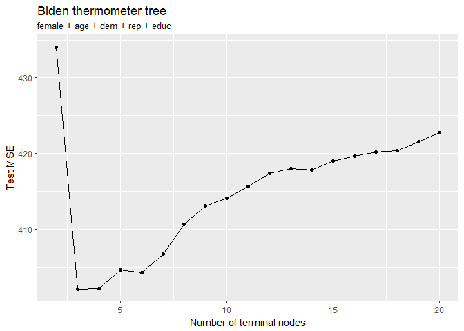

``` r
#MSE with different number of nodes
biden_cv %>%
  select(k, mse) %>%
  group_by(k) %>%
  summarize(test_mse = mean(mse),
            sd = sd(mse, na.rm = TRUE))
```

    ## # A tibble: 19 × 3
    ##        k test_mse    sd
    ##    <dbl>    <dbl> <dbl>
    ## 1      2    434.1 28.84
    ## 2      3    402.1 38.45
    ## 3      4    402.1 39.41
    ## 4      5    404.6 39.63
    ## 5      6    404.3 38.92
    ## 6      7    406.7 41.27
    ## 7      8    410.6 40.45
    ## 8      9    413.1 38.31
    ## 9     10    414.1 37.31
    ## 10    11    415.6 35.94
    ## 11    12    417.4 34.16
    ## 12    13    418.0 34.71
    ## 13    14    417.8 34.84
    ## 14    15    419.0 34.80
    ## 15    16    419.6 33.24
    ## 16    17    420.2 32.55
    ## 17    18    420.3 33.76
    ## 18    19    421.6 33.22
    ## 19    20    422.7 32.17

``` r
#Plot tree-optimal
mod <- prune.tree(biden_tree_option, best = 4)

tree_data <- dendro_data(mod)
ggplot(segment(tree_data)) +
  geom_segment(aes(x = x, y = y, xend = xend, yend = yend), 
               alpha = 0.5) +
  geom_text(data = label(tree_data), 
            aes(x = x, y = y, label = label_full), vjust = -0.5, size = 3) +
  geom_text(data = leaf_label(tree_data), 
            aes(x = x, y = y, label = label), vjust = 0.5, size = 3) +
  theme_dendro() +
  labs(title = "Biden thermometer tree - optimal",
       subtitle = "female + age + dem + rep + educ")
```

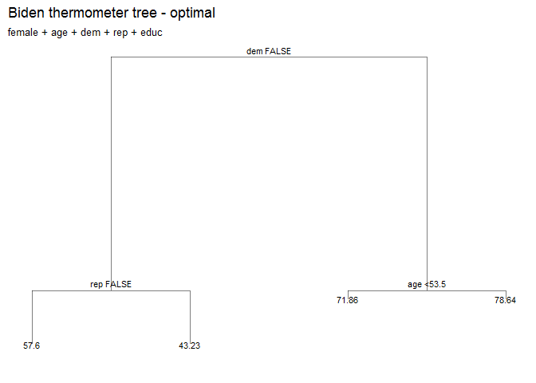 A decision tree with `nobs = nrow(df_biden)` and `mindev = 0` is fit and graphed as above.

With a 10-fold cross validation, test MSEs of different number of terminal nodes are examined and graphed as above. Test MSE achieves the lowest level with 3 or 4 nodes (among 1-20 nodes). I'll go for 4 nodes to include the `age` branch in the final model, as after comparing the graph of 3-node and 4-node, the `age` branch provides a meaningful and interpretable result that the Biden thermometer is higher for older people.

The test MSE without pruning is 481.4899, the pruned tree with 4 nodes has an MSE at 402.1, which is lower than the MSE without pruning. This could indicate that the full model potentially overfitting the training data and thus did not do well in the testing data.

### 4. Use the bagging approach to analyze this data. What test MSE do you obtain? Obtain variable importance measures and interpret the results.

``` r
set.seed(1234)

biden_bag <- randomForest(biden ~ ., data = df_biden, mtry = 5, ntree = 500)
biden_bag
```

    ## 
    ## Call:
    ##  randomForest(formula = biden ~ ., data = df_biden, mtry = 5,      ntree = 500) 
    ##                Type of random forest: regression
    ##                      Number of trees: 500
    ## No. of variables tried at each split: 5
    ## 
    ##           Mean of squared residuals: 494.6
    ##                     % Var explained: 10.1

``` r
data_frame(var = rownames(importance(biden_bag)),
           MeanDecreaseRSS = importance(biden_bag)[,1]) %>%
  mutate(var = fct_reorder(var, MeanDecreaseRSS, fun = median)) %>%
  ggplot(aes(var, MeanDecreaseRSS)) +
  geom_point() +
  coord_flip() +
  labs(title = "Predicting Biden thermometer",
       subtitle = "Bagging",
       x = NULL,
       y = "Average decrease in the RSS")
```

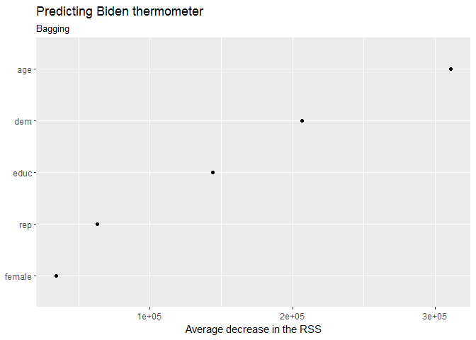 With bagging, the test MSE becomes 494.6 (estimated by out-of-bag error estimate), which is much higher than the MSE obtained in the previous model, and indicates a potential overfitting issue.

From the variable importance measures, `age`, `dem`, and `educ` are the three most important predictors in the model, whereas `rep` and `female` are relatively unimportant. This is somewhat contradict with the result from the last model where `rep` is also important.

### 5. Use the random forest approach to analyze this data. What test MSE do you obtain? Obtain variable importance measures and interpret the results. Describe the effect of m, the number of variables considered at each split, on the error rate obtained.

``` r
set.seed(1234)

biden_rf <- randomForest(biden ~ ., data = df_biden, ntree = 500)
biden_rf
```

    ## 
    ## Call:
    ##  randomForest(formula = biden ~ ., data = df_biden, ntree = 500) 
    ##                Type of random forest: regression
    ##                      Number of trees: 500
    ## No. of variables tried at each split: 1
    ## 
    ##           Mean of squared residuals: 407.8
    ##                     % Var explained: 25.88

``` r
data_frame(var = rownames(importance(biden_rf)),
           MeanDecreaseRSS = importance(biden_rf)[,1]) %>%
  mutate(var = fct_reorder(var, MeanDecreaseRSS, fun = median)) %>%
  ggplot(aes(var, MeanDecreaseRSS)) +
  geom_point() +
  coord_flip() +
  labs(title = "Predicting Biden thermometer",
       subtitle = "Random forest",
       x = NULL,
       y = "Average decrease in the RSS")
```

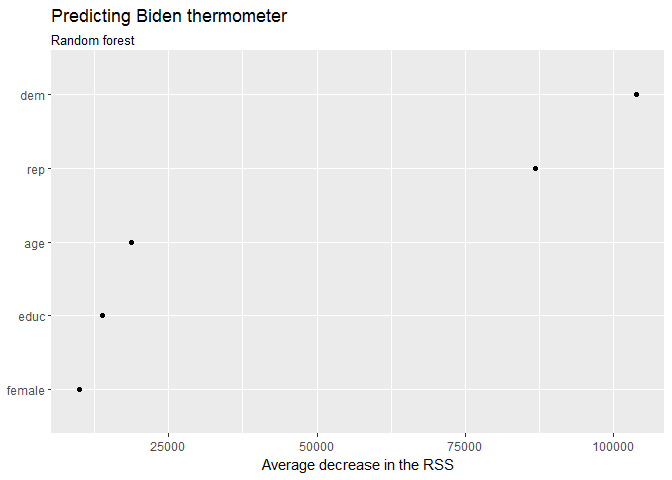 With random forest, the test MSE is 407.8 (estimated by out-of-bag error estimate), which is much lower than the MSE obtained in the bagging model and indicates a stabler result. The most important predictor in the random forest is `dem` and `rep`, and the impoprtance of `educ` and `age` is relatively decreased compare to the bagging model. We can also observe that the average RSS decrease is smaller on the random forest model as the model limits the predictors can be chosen (m) in each split from 5 (all predictors) to 1 in this case.

### 6. Use the boosting approach to analyze the data. What test MSE do you obtain? How does the value of the shrinkage parameter λ influence the test MSE?

``` r
set.seed(1234)

biden_boost <- gbm(biden ~ ., data = df_biden_split$train, n.trees = 10000, interaction.depth = 1)
```

    ## Distribution not specified, assuming gaussian ...

``` r
yhat.boost = predict(biden_boost, newdata = df_biden_split$test, n.trees = 10000)

mean((yhat.boost - df_biden[df_biden_split$test[2]$idx, ]$biden)^2)
```

    ## [1] 399.5

``` r
mses <- numeric(4)
shrinkages <- numeric(4)
for (s in 1:4){
  shrinkages[s] <- 10^(-s)
  biden_boost <- gbm(biden ~ ., data = df_biden_split$train, n.trees = 10000, interaction.depth = 1, shrinkage = shrinkages[s])
  yhat.boost = predict(biden_boost, newdata = df_biden_split$test, n.trees = 10000)
  mses[s] <- mean((yhat.boost - df_biden[df_biden_split$test[2]$idx, ]$biden)^2)
}
```

    ## Distribution not specified, assuming gaussian ...
    ## Distribution not specified, assuming gaussian ...
    ## Distribution not specified, assuming gaussian ...
    ## Distribution not specified, assuming gaussian ...

``` r
data_frame(mse = mses, shrinkage = shrinkages) %>% 
  ggplot(aes(shrinkage, mse)) +
  geom_point() +
  geom_line() +
  labs(title = "Predicting Biden thermometer",
       subtitle = "female + age + dem + rep + educ",
       x = "Shrinkage",
       y = "Test MSE")
```

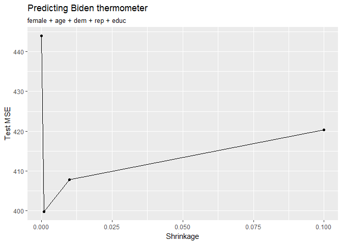 With boosting, the test MSE becomes 399.5, even slightly lower than the one obtained from rondom forest. It indicates a potentially better model performance. As testing different shrinkage level (0.0001, 0.001, 0.01, 0.1), the test MSE goes down first from 0.0001 to 0.001, and goes up from 0.001, 0.01, to 0.1. The best shrinkage level in this case is around 0.001, which produces a test MSE around 400.

Part 2: Modeling voter turnout
------------------------------

### 1. Use cross-validation techniques and standard measures of model fit to compare and evaluate at least five tree-based models of voter turnout. Select the best model and interpret the results using whatever methods you see fit.

For this question, I apply a 30% testing and 70% training cross validation to try out different tree models including one tree with default setting and one tree pruned from full nodes with all 7 `predictors`, `mhealth_sum`, `age`, `educ`, `black`, `female`, `married`, and `inc10`. I also did one bagging, one random forest with all predictors, and one additional tree only with the relatively important predictors identified in the process.

#### Model 1: Decision tree with default setting

``` r
set.seed(1234)

#Split data
df_mental_split <- resample_partition(df_mental, c(test = 0.3, train = 0.7))

#Grow tree
mental_tree_default <- tree(vote96 ~ mhealth_sum + age + educ + black + female + married + inc10, data = df_mental_split$train)

#Plot tree
tree_data <- dendro_data(mental_tree_default)

ggplot(segment(tree_data)) +
  geom_segment(aes(x = x, y = y, xend = xend, yend = yend), alpha = 0.5) +
  geom_text(data = label(tree_data), aes(x = x, y = y, label = label_full), vjust = -0.5, size = 3) +
  geom_text(data = leaf_label(tree_data), aes(x = x, y = y, label = label), vjust = 0.5, size = 3) +
  theme_dendro() +
  labs(title = "Voter turnout tree",
       subtitle = "mhealth_sum + age + educ + black + female + married + inc10")
```

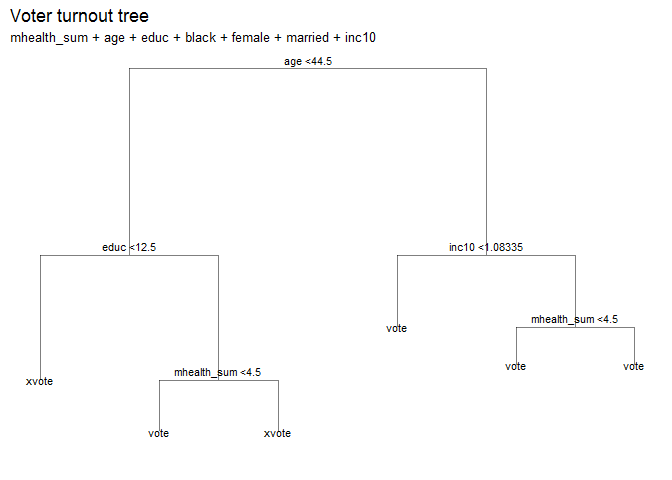

``` r
#ROC
fitted <- predict(mental_tree_default, as_tibble(df_mental_split$test), type = "class")

roc_td <- roc(as.numeric(as_tibble(df_mental_split$test)$vote96), as.numeric(fitted))
plot(roc_td)
```

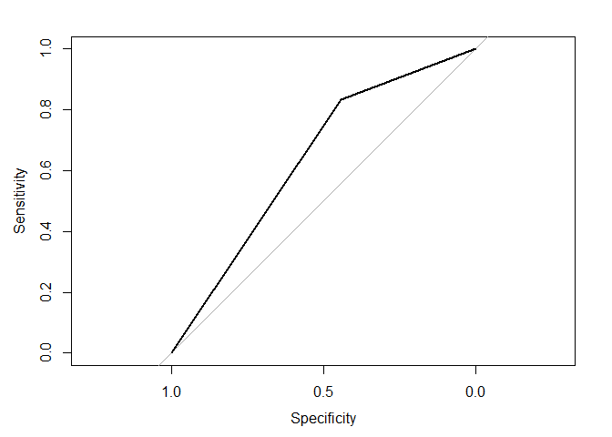

``` r
auc(roc_td)
```

    ## Area under the curve: 0.638

``` r
#Mse
mental_tree_default_testerr <- err.rate.tree(mental_tree_default, df_mental_split$test)
mental_tree_default_testerr
```

    ## [1] 0.2809

``` r
#PRE
real <- as.numeric(na.omit(as_tibble(df_mental_split$test)$vote96))
E1 <- mean(as.numeric(real != median(real)))
E2 <- mental_tree_default_testerr
PRE <- (E1 - E2) / E1
PRE
```

    ## [1] 0.04292

The decision tree with default setting and all predictor variables has a test error rate 28.09%. The model emphsizes age, education, income, and mental health condition in predicting the voting behavior. Also, the AUC us 0.638 and the PRE is 4.292%, meaning when compared to the NULL model, estimating all with the median data value, this model decreases the error rate by only 4.292%.

#### Model 2: Decision tree with full nodes

``` r
set.seed(1234)

#grow tree
mental_tree_option <- tree(vote96 ~ mhealth_sum + age + educ + black + female + married + inc10, data = df_mental_split$train, control = tree.control(nobs = nrow(df_mental_split$train), mindev = 0))

#Plot tree
tree_data <- dendro_data(mental_tree_option)

ggplot(segment(tree_data)) +
  geom_segment(aes(x = x, y = y, xend = xend, yend = yend), alpha = 0.5) +
  geom_text(data = label(tree_data), aes(x = x, y = y, label = label_full), vjust = -0.5, size = 3) +
  geom_text(data = leaf_label(tree_data), aes(x = x, y = y, label = label), vjust = 0.5, size = 3) +
  theme_dendro() +
  labs(title = "Voter turnout tree",
       subtitle = "mhealth_sum + age + educ + black + female + married + inc10")
```

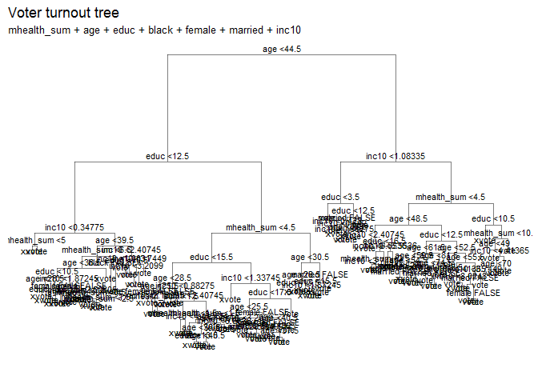

``` r
#ROC
fitted <- predict(mental_tree_option, as_tibble(df_mental_split$test), type = "class")

roc_to <- roc(as.numeric(as_tibble(df_mental_split$test)$vote96), as.numeric(fitted))
plot(roc_to)
```

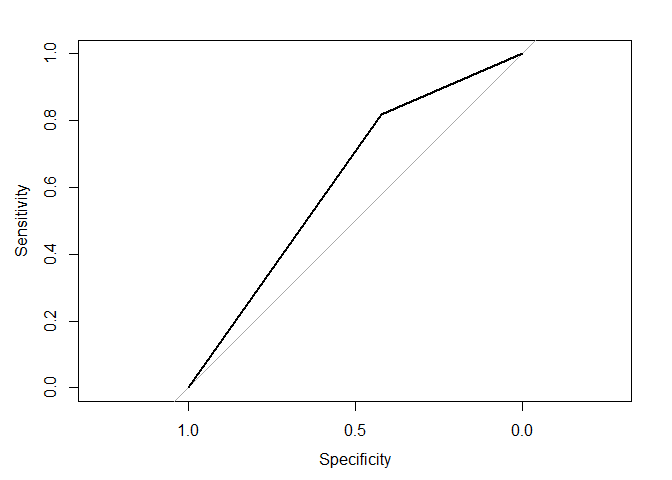

``` r
auc(roc_to)
```

    ## Area under the curve: 0.619

``` r
#Mse-all
mental_tree_optionall_testmse <- err.rate.tree(mental_tree_option, df_mental_split$test)
mental_tree_optionall_testmse
```

    ## [1] 0.296

``` r
#PRE
real <- as.numeric(na.omit(as_tibble(df_mental_split$test)$vote96))
E1 <- mean(as.numeric(real != median(real)))
E2 <- mental_tree_optionall_testmse
PRE <- (E1 - E2) / E1
PRE
```

    ## [1] -0.008584

The decision tree with full nodes and all predictor variables has a test error rate 29.85%, which is higher than the default one and indicates a potential overfitting problem. While including allnodes, the tree also became too complicated to be interpreted. Also, the AUC us 0.619 and the PRE is -0.8584%, meaning when compared to the NULL model, estimating all with the median data value, this model even increases the error rate by 0.8584%.

#### Model 3: Bagging

``` r
set.seed(1234)

mental_bag <- randomForest(vote96 ~ ., data = na.omit(as_tibble(df_mental_split$train)), mtry = 7, ntree = 500)
mental_bag
```

    ## 
    ## Call:
    ##  randomForest(formula = vote96 ~ ., data = na.omit(as_tibble(df_mental_split$train)),      mtry = 7, ntree = 500) 
    ##                Type of random forest: classification
    ##                      Number of trees: 500
    ## No. of variables tried at each split: 7
    ## 
    ##         OOB estimate of  error rate: 33.13%
    ## Confusion matrix:
    ##       xvote vote class.error
    ## xvote   120  149      0.5539
    ## vote    118  419      0.2197

``` r
data_frame(var = rownames(importance(mental_bag)),
           MeanDecreaseRSS = importance(mental_bag)[,1]) %>%
  mutate(var = fct_reorder(var, MeanDecreaseRSS, fun = median)) %>%
  ggplot(aes(var, MeanDecreaseRSS)) +
  geom_point() +
  coord_flip() +
  labs(title = "Predicting voter turnout",
       subtitle = "Bagging",
       x = NULL,
       y = "Average decrease in the Gini Index")
```

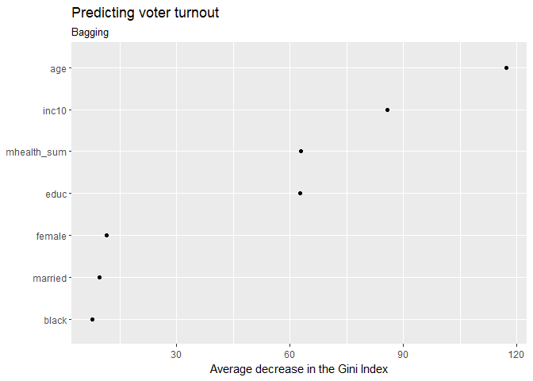

``` r
#ROC
fitted <- predict(mental_bag, na.omit(as_tibble(df_mental_split$test)), type = "prob")[,2]

roc_b <- roc(na.omit(as_tibble(df_mental_split$test))$vote96, fitted)
plot(roc_b)
```

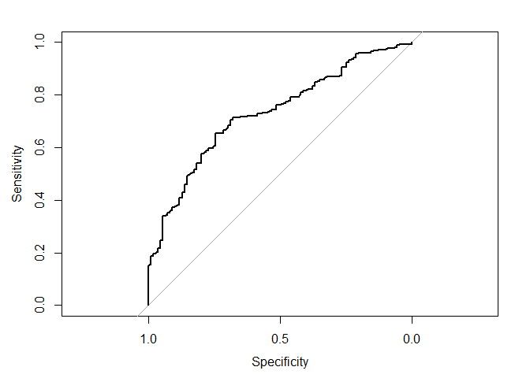

``` r
auc(roc_b)
```

    ## Area under the curve: 0.73

``` r
#PRE
real <- as.numeric(na.omit(as_tibble(df_mental_split$test)$vote96))
E1 <- mean(as.numeric(real != median(real)))
E2 <- 0.3313
PRE <- (E1 - E2) / E1
PRE
```

    ## [1] -0.129

Using bagging, with all predictor variables, the model emphasizes `age`, `inc10`, `educ`, and mental health and has a test error rate 33.13% (estimated by out-of-bag error estimate), which is higher than the default one and indicates a potential overfitting problem. Also, the AUC us 0.73 and the PRE is -12.9%, meaning when compared to the NULL model, estimating all with the median data value, this model even increases the error rate by 12.9%.

#### Model 4: Random forest

``` r
set.seed(1234)

mental_rf <- randomForest(vote96 ~ ., data = na.omit(as_tibble(df_mental_split$train)), ntree = 500)
mental_rf
```

    ## 
    ## Call:
    ##  randomForest(formula = vote96 ~ ., data = na.omit(as_tibble(df_mental_split$train)),      ntree = 500) 
    ##                Type of random forest: classification
    ##                      Number of trees: 500
    ## No. of variables tried at each split: 2
    ## 
    ##         OOB estimate of  error rate: 30.4%
    ## Confusion matrix:
    ##       xvote vote class.error
    ## xvote   104  165      0.6134
    ## vote     80  457      0.1490

``` r
data_frame(var = rownames(importance(mental_rf)),
           MeanDecreaseRSS = importance(mental_rf)[,1]) %>%
  mutate(var = fct_reorder(var, MeanDecreaseRSS, fun = median)) %>%
  ggplot(aes(var, MeanDecreaseRSS)) +
  geom_point() +
  coord_flip() +
  labs(title = "Predicting voter turnout",
       subtitle = "Random forest",
       x = NULL,
       y = "Average decrease in the Gini Index")
```

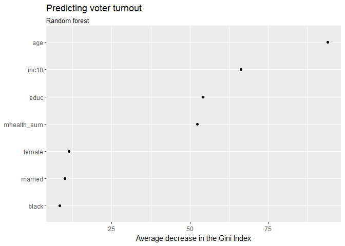

``` r
#ROC
fitted <- predict(mental_rf, na.omit(as_tibble(df_mental_split$test)), type = "prob")[,2]

roc_rf <- roc(na.omit(as_tibble(df_mental_split$test))$vote96, fitted)
plot(roc_rf)
```


``` r
auc(roc_rf)
```

    ## Area under the curve: 0.766

``` r
#PRE
real <- as.numeric(na.omit(as_tibble(df_mental_split$test)$vote96))
E1 <- mean(as.numeric(real != median(real)))
E2 <- 0.304
PRE <- (E1 - E2) / E1
PRE
```

    ## [1] -0.03595

Using random forest, with all predictor variables, the model emphasizes `age`, `inc10`, `educ`, and mental health (the same as bagging) and has a test error rate 30.4% (estimated by out-of-bag error estimate), which is higher than the default one. Also, the AUC us 0.766 and the PRE is -3.595%, meaning when compared to the NULL model, estimating all with the median data value, this model even increases the error rate by 3.595%.

#### Model 5: default model with only `age` and `inc10` as predictors

``` r
set.seed(1234)

#Grow tree
mental_tree_last <- tree(vote96 ~ age + inc10, data = df_mental_split$train)

#Plot tree
tree_data <- dendro_data(mental_tree_last)

ggplot(segment(tree_data)) +
  geom_segment(aes(x = x, y = y, xend = xend, yend = yend), alpha = 0.5) +
  geom_text(data = label(tree_data), aes(x = x, y = y, label = label_full), vjust = -0.5, size = 3) +
  geom_text(data = leaf_label(tree_data), aes(x = x, y = y, label = label), vjust = 0.5, size = 3) +
  theme_dendro() +
  labs(title = "Voter turnout tree",
       subtitle = "age + inc10")
```

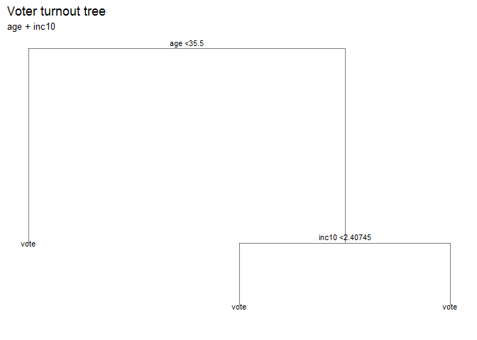

``` r
#ROC
fitted <- predict(mental_tree_last, as_tibble(df_mental_split$test), type = "class")

roc_t <- roc(as.numeric(as_tibble(df_mental_split$test)$vote96), as.numeric(fitted))
plot(roc_t)
```

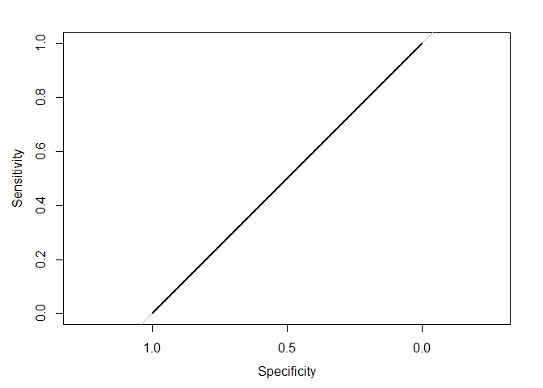

``` r
auc(roc_t)
```

    ## Area under the curve: 0.5

``` r
#Mse
mental_tree_last_testerr <- err.rate.tree(mental_tree_last, df_mental_split$test)
mental_tree_last_testerr
```

    ## [1] 0.2935

``` r
#PRE
real <- as.numeric(na.omit(as_tibble(df_mental_split$test)$vote96))
E1 <- mean(as.numeric(real != median(real)))
E2 <- mental_tree_last_testerr
PRE <- (E1 - E2) / E1
PRE
```

    ## [1] 0

I apply a single decision tree with the most important predictors identified by the bagging and random forest models, `age` and `inc10`. The model basically estimates all people vote, no matter the predictor lavels. This results in a 29.35% error rate, an 0.5 AUC, and 0 PRE, which indicates the model has a performance equals to the NULL model.

#### A quick summary

The best model is the first one--decision tree with the default setting. It has the lowest test error rate and the best PRE. I neglect the lower AUC at this moment as the single tree in AUC has only single point and could make the area indicator less informative.

Its prediction is as below: (Please refer to the graph for model 1)
If `age` &lt; 44.5, then we proceed down the left branch to the next internal node.
- If `educ` &lt; 12.5 (year), then the model estimates the person don't vote. - If `educ` &gt;= 12.5, then we proceed down the right branch to the next internal node. - If the mental health index &lt; 4.5, then the model estimates the person vote. - If the mental health index &gt;= 4.5, then the model estimates the person don't vote.

If `age` &gt;= 44.5, then we proceed down the right branch to the next internal node.
- If `inc10` &lt; 1.08335 (in $10,000s), then the model estimates the person vote. - If `inc10` &gt; 1.08335, the we proceed down the right branch to the next internal node. - If the mental health index &lt; 4.5, then the model estimates the person vote. - If the mental health index &gt;= 4.5, then the model estimates the person vote.

### 2. Use cross-validation techniques and standard measures of model fit to compare and evaluate at least five SVM models of voter turnout. Select the best model and interpret the results using whatever methods you see fit.

For this question, I, again, apply a 30% testing and 70% training cross validation to try out different SVM models with four different kernels and parameters with all 7 `predictors`, `mhealth_sum`, `age`, `educ`, `black`, `female`, `married`, and `inc10`.

``` r
set.seed(1234)
mh_split <- resample_partition(na.omit(df_mental), p = c("test" = .3, "train" = .7))
```

#### Model 1: linear kernel

``` r
set.seed(1234)

mh_lin_tune <- tune(svm, vote96 ~ ., data = as_tibble(mh_split$train),
                    kernel = "linear",
                    range = list(cost = c(.001, .01, .1, 1, 5, 10, 100)))
summary(mh_lin_tune)
```

    ## 
    ## Parameter tuning of 'svm':
    ## 
    ## - sampling method: 10-fold cross validation 
    ## 
    ## - best parameters:
    ##  cost
    ##     1
    ## 
    ## - best performance: 0.2856 
    ## 
    ## - Detailed performance results:
    ##    cost  error dispersion
    ## 1 1e-03 0.3199    0.04401
    ## 2 1e-02 0.3187    0.04537
    ## 3 1e-01 0.2929    0.04149
    ## 4 1e+00 0.2856    0.02535
    ## 5 5e+00 0.2892    0.02894
    ## 6 1e+01 0.2892    0.02894
    ## 7 1e+02 0.2892    0.02894

``` r
mh_lin <- mh_lin_tune$best.model
summary(mh_lin)
```

    ## 
    ## Call:
    ## best.tune(method = svm, train.x = vote96 ~ ., data = as_tibble(mh_split$train), 
    ##     ranges = list(cost = c(0.001, 0.01, 0.1, 1, 5, 10, 100)), 
    ##     kernel = "linear")
    ## 
    ## 
    ## Parameters:
    ##    SVM-Type:  C-classification 
    ##  SVM-Kernel:  linear 
    ##        cost:  1 
    ##       gamma:  0.125 
    ## 
    ## Number of Support Vectors:  508
    ## 
    ##  ( 256 252 )
    ## 
    ## 
    ## Number of Classes:  2 
    ## 
    ## Levels: 
    ##  xvote vote

``` r
#Best
mh_lin <- mh_lin_tune$best.model
summary(mh_lin)
```

    ## 
    ## Call:
    ## best.tune(method = svm, train.x = vote96 ~ ., data = as_tibble(mh_split$train), 
    ##     ranges = list(cost = c(0.001, 0.01, 0.1, 1, 5, 10, 100)), 
    ##     kernel = "linear")
    ## 
    ## 
    ## Parameters:
    ##    SVM-Type:  C-classification 
    ##  SVM-Kernel:  linear 
    ##        cost:  1 
    ##       gamma:  0.125 
    ## 
    ## Number of Support Vectors:  508
    ## 
    ##  ( 256 252 )
    ## 
    ## 
    ## Number of Classes:  2 
    ## 
    ## Levels: 
    ##  xvote vote

``` r
#ROC
fitted <- predict(mh_lin, as_tibble(mh_split$test), decision.values = TRUE) %>%
  attributes

roc_line <- roc(as_tibble(mh_split$test)$vote96, fitted$decision.values)
```

    ## Warning in roc.default(as_tibble(mh_split$test)$vote96, fitted
    ## $decision.values): Deprecated use a matrix as predictor. Unexpected results
    ## may be produced, please pass a numeric vector.

``` r
plot(roc_line)
```

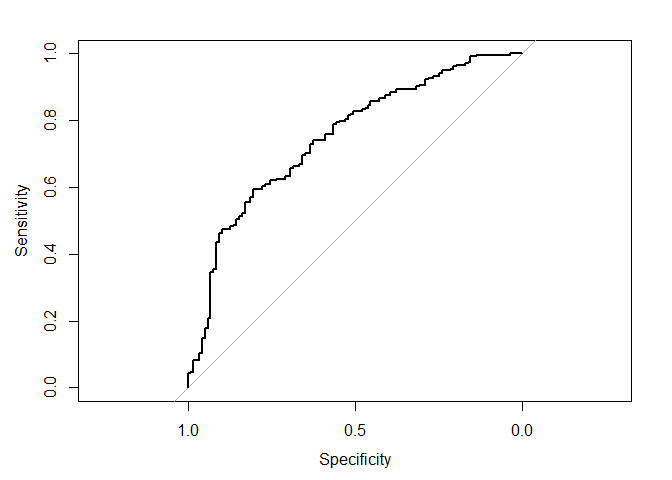

``` r
auc(roc_line)
```

    ## Area under the curve: 0.746

``` r
#PRE
real <- na.omit(as.numeric(as_tibble(mh_split$test)$vote96))
E1 <- mean(as.numeric(real != median(real)))
E2 <- 0.2856
PRE <- (E1 - E2) / E1
PRE
```

    ## [1] 0.1481

Using linear kernel, with all predictor variables and tested at different cost levels (0.001, 0.01, 0.1, 1, 5, 10, and 100), the model gets the best cost level at 1 and has a 10-fold CV error rate 28.56%. Also, the AUC us 0.746 and the PRE is 14.81% (the model MSE is estimated by the 10-fold error rate), meaning when compared to the NULL model, estimating all with the median data value, this model decreases the error rate by 14.81%.

#### Model 2: polynomial kernel

``` r
set.seed(1234)

mh_poly_tune <- tune(svm, vote96 ~ ., data = as_tibble(mh_split$train),
                    kernel = "polynomial",
                    range = list(cost = c(.001, .01, .1, 1, 5, 10, 100)))
summary(mh_poly_tune)
```

    ## 
    ## Parameter tuning of 'svm':
    ## 
    ## - sampling method: 10-fold cross validation 
    ## 
    ## - best parameters:
    ##  cost
    ##     5
    ## 
    ## - best performance: 0.3015 
    ## 
    ## - Detailed performance results:
    ##    cost  error dispersion
    ## 1 1e-03 0.3199    0.04401
    ## 2 1e-02 0.3199    0.04401
    ## 3 1e-01 0.3175    0.04920
    ## 4 1e+00 0.3077    0.03645
    ## 5 5e+00 0.3015    0.02945
    ## 6 1e+01 0.3150    0.03401
    ## 7 1e+02 0.3249    0.04070

``` r
#Best
mh_poly <- mh_poly_tune$best.model
summary(mh_poly)
```

    ## 
    ## Call:
    ## best.tune(method = svm, train.x = vote96 ~ ., data = as_tibble(mh_split$train), 
    ##     ranges = list(cost = c(0.001, 0.01, 0.1, 1, 5, 10, 100)), 
    ##     kernel = "polynomial")
    ## 
    ## 
    ## Parameters:
    ##    SVM-Type:  C-classification 
    ##  SVM-Kernel:  polynomial 
    ##        cost:  5 
    ##      degree:  3 
    ##       gamma:  0.125 
    ##      coef.0:  0 
    ## 
    ## Number of Support Vectors:  495
    ## 
    ##  ( 258 237 )
    ## 
    ## 
    ## Number of Classes:  2 
    ## 
    ## Levels: 
    ##  xvote vote

``` r
#ROC
fitted <- predict(mh_poly, as_tibble(mh_split$test), decision.values = TRUE) %>%
  attributes

roc_poly <- roc(as_tibble(mh_split$test)$vote96, fitted$decision.values)
```

    ## Warning in roc.default(as_tibble(mh_split$test)$vote96, fitted
    ## $decision.values): Deprecated use a matrix as predictor. Unexpected results
    ## may be produced, please pass a numeric vector.

``` r
plot(roc_poly)
```

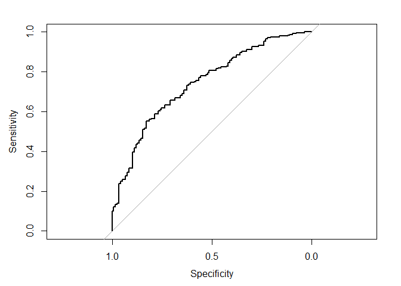

``` r
auc(roc_poly)
```

    ## Area under the curve: 0.741

``` r
#PRE
real <- na.omit(as.numeric(as_tibble(mh_split$test)$vote96))
E1 <- mean(as.numeric(real != median(real)))
E2 <- 0.3015
PRE <- (E1 - E2) / E1
PRE
```

    ## [1] 0.1007

Using polynomial kernel, with all predictor variables, default degree level (3), and tested at different cost levels (0.001, 0.01, 0.1, 1, 5, 10, and 100), the model gets the best cost level at 5 and has a 10-fold CV error rate 30.15%. Also, the AUC us 0.741 and the PRE is 10.07% (the model MSE is estimated by the 10-fold error rate), meaning when compared to the NULL model, estimating all with the median data value, this model decreases the error rate by 10.07%. All measures perform worse than the linear kernel model and generally is a worse one.

#### Model 3: radial kernel

``` r
set.seed(1234)

mh_rad_tune <- tune(svm, vote96 ~ ., data = as_tibble(mh_split$train),
                    kernel = "radial",
                    range = list(cost = c(.001, .01, .1, 1, 5, 10, 100)))
summary(mh_rad_tune)
```

    ## 
    ## Parameter tuning of 'svm':
    ## 
    ## - sampling method: 10-fold cross validation 
    ## 
    ## - best parameters:
    ##  cost
    ##     1
    ## 
    ## - best performance: 0.2917 
    ## 
    ## - Detailed performance results:
    ##    cost  error dispersion
    ## 1 1e-03 0.3199    0.04401
    ## 2 1e-02 0.3199    0.04401
    ## 3 1e-01 0.3065    0.04453
    ## 4 1e+00 0.2917    0.03049
    ## 5 5e+00 0.2954    0.04000
    ## 6 1e+01 0.2930    0.03390
    ## 7 1e+02 0.3199    0.03130

``` r
mh_rad <- mh_rad_tune$best.model
summary(mh_rad)
```

    ## 
    ## Call:
    ## best.tune(method = svm, train.x = vote96 ~ ., data = as_tibble(mh_split$train), 
    ##     ranges = list(cost = c(0.001, 0.01, 0.1, 1, 5, 10, 100)), 
    ##     kernel = "radial")
    ## 
    ## 
    ## Parameters:
    ##    SVM-Type:  C-classification 
    ##  SVM-Kernel:  radial 
    ##        cost:  1 
    ##       gamma:  0.125 
    ## 
    ## Number of Support Vectors:  509
    ## 
    ##  ( 265 244 )
    ## 
    ## 
    ## Number of Classes:  2 
    ## 
    ## Levels: 
    ##  xvote vote

``` r
fitted <- predict(mh_rad, as_tibble(mh_split$test), decision.values = TRUE) %>%
  attributes

#ROC
roc_rad <- roc(as_tibble(mh_split$test)$vote96, fitted$decision.values)
```

    ## Warning in roc.default(as_tibble(mh_split$test)$vote96, fitted
    ## $decision.values): Deprecated use a matrix as predictor. Unexpected results
    ## may be produced, please pass a numeric vector.

``` r
plot(roc_rad)
```


``` r
auc(roc_rad)
```

    ## Area under the curve: 0.735

``` r
#PRE
real <- na.omit(as.numeric(as_tibble(mh_split$test)$vote96))
E1 <- mean(as.numeric(real != median(real)))
E2 <- 0.2917
PRE <- (E1 - E2) / E1
PRE
```

    ## [1] 0.1299

Using radial kernel, with all predictor variables and tested at different cost levels (0.001, 0.01, 0.1, 1, 5, 10, and 100), the model gets the best cost level at 1 and has a 10-fold CV error rate 31.87%. Also, the AUC us 0.735 and the PRE is 12.99% (the model MSE is estimated by the 10-fold error rate), meaning when compared to the NULL model, estimating all with the median data value, this model decreases the error rate by 12.99%. Some measures are doing better than the polynomial model. However, all measures perform worse than the linear kernel model and generally is a worse one.

#### Model 4: sigmoid kernel

``` r
set.seed(1234)

mh_sig_tune <- tune(svm, vote96 ~ ., data = as_tibble(mh_split$train),
                    kernel = "sigmoid",
                    range = list(cost = c(.001, .01, .1, 1, 5, 10, 100)))
summary(mh_sig_tune)
```

    ## 
    ## Parameter tuning of 'svm':
    ## 
    ## - sampling method: 10-fold cross validation 
    ## 
    ## - best parameters:
    ##  cost
    ##   0.1
    ## 
    ## - best performance: 0.3187 
    ## 
    ## - Detailed performance results:
    ##    cost  error dispersion
    ## 1 1e-03 0.3199    0.04401
    ## 2 1e-02 0.3199    0.04401
    ## 3 1e-01 0.3187    0.04537
    ## 4 1e+00 0.3480    0.02938
    ## 5 5e+00 0.3700    0.03230
    ## 6 1e+01 0.3712    0.03917
    ## 7 1e+02 0.3761    0.03529

``` r
mh_sig <- mh_sig_tune$best.model
summary(mh_sig)
```

    ## 
    ## Call:
    ## best.tune(method = svm, train.x = vote96 ~ ., data = as_tibble(mh_split$train), 
    ##     ranges = list(cost = c(0.001, 0.01, 0.1, 1, 5, 10, 100)), 
    ##     kernel = "sigmoid")
    ## 
    ## 
    ## Parameters:
    ##    SVM-Type:  C-classification 
    ##  SVM-Kernel:  sigmoid 
    ##        cost:  0.1 
    ##       gamma:  0.125 
    ##      coef.0:  0 
    ## 
    ## Number of Support Vectors:  525
    ## 
    ##  ( 264 261 )
    ## 
    ## 
    ## Number of Classes:  2 
    ## 
    ## Levels: 
    ##  xvote vote

``` r
fitted <- predict(mh_sig, as_tibble(mh_split$test), decision.values = TRUE) %>%
  attributes

#ROC
roc_sig <- roc(as_tibble(mh_split$test)$vote96, fitted$decision.values)
```

    ## Warning in roc.default(as_tibble(mh_split$test)$vote96, fitted
    ## $decision.values): Deprecated use a matrix as predictor. Unexpected results
    ## may be produced, please pass a numeric vector.

``` r
plot(roc_sig)
```


``` r
auc(roc_sig)
```

    ## Area under the curve: 0.73

``` r
#PRE
real <- na.omit(as.numeric(as_tibble(mh_split$test)$vote96))
E1 <- mean(as.numeric(real != median(real)))
E2 <- 0.3187
PRE <- (E1 - E2) / E1
PRE
```

    ## [1] 0.04935

Using sigmoid kernel, with all predictor variables and tested at different cost levels (0.001, 0.01, 0.1, 1, 5, 10, and 100), the model gets the best cost level at 0.1 and has a 10-fold CV error rate 31.87%. Also, the AUC us 0.73 and the PRE is 14.81% (the model MSE is estimated by the 10-fold error rate), meaning when compared to the NULL model, estimating all with the median data value, this model decreases the error rate by 14.81%. Some measures are doing better than the polynomial and radial models. However, all measures perform worse than the linear kernel model and generally is a worse one.

#### Model 5: polynomial kernel with different degrees

``` r
set.seed(1234)

mh_poly_tune2 <- tune(svm, vote96 ~ mhealth_sum + age + educ + inc10, data = as_tibble(mh_split$train),
                    kernel = "polynomial",
                    range = list(cost = c(.001, .01, .1, 1, 5, 10, 100), degree = c(3, 4, 5)))
summary(mh_poly_tune2)
```

    ## 
    ## Parameter tuning of 'svm':
    ## 
    ## - sampling method: 10-fold cross validation 
    ## 
    ## - best parameters:
    ##  cost degree
    ##     5      3
    ## 
    ## - best performance: 0.2955 
    ## 
    ## - Detailed performance results:
    ##     cost degree  error dispersion
    ## 1  1e-03      3 0.3199    0.04401
    ## 2  1e-02      3 0.3212    0.05032
    ## 3  1e-01      3 0.3065    0.04811
    ## 4  1e+00      3 0.2967    0.04792
    ## 5  5e+00      3 0.2955    0.04655
    ## 6  1e+01      3 0.2955    0.04655
    ## 7  1e+02      3 0.2955    0.04655
    ## 8  1e-03      4 0.3199    0.04401
    ## 9  1e-02      4 0.3224    0.04466
    ## 10 1e-01      4 0.3175    0.04428
    ## 11 1e+00      4 0.3236    0.04443
    ## 12 5e+00      4 0.3199    0.04213
    ## 13 1e+01      4 0.3187    0.03873
    ## 14 1e+02      4 0.3175    0.03721
    ## 15 1e-03      5 0.3236    0.04171
    ## 16 1e-02      5 0.3175    0.04820
    ## 17 1e-01      5 0.3089    0.04359
    ## 18 1e+00      5 0.3015    0.03680
    ## 19 5e+00      5 0.3089    0.02960
    ## 20 1e+01      5 0.3150    0.02374
    ## 21 1e+02      5 0.3199    0.03236

``` r
#Best
mh_poly2 <- mh_poly_tune2$best.model
summary(mh_poly2)
```

    ## 
    ## Call:
    ## best.tune(method = svm, train.x = vote96 ~ mhealth_sum + age + 
    ##     educ + inc10, data = as_tibble(mh_split$train), ranges = list(cost = c(0.001, 
    ##     0.01, 0.1, 1, 5, 10, 100), degree = c(3, 4, 5)), kernel = "polynomial")
    ## 
    ## 
    ## Parameters:
    ##    SVM-Type:  C-classification 
    ##  SVM-Kernel:  polynomial 
    ##        cost:  5 
    ##      degree:  3 
    ##       gamma:  0.25 
    ##      coef.0:  0 
    ## 
    ## Number of Support Vectors:  492
    ## 
    ##  ( 247 245 )
    ## 
    ## 
    ## Number of Classes:  2 
    ## 
    ## Levels: 
    ##  xvote vote

``` r
#ROC
fitted <- predict(mh_poly2, as_tibble(mh_split$test), decision.values = TRUE) %>%
  attributes

roc_poly2 <- roc(as_tibble(mh_split$test)$vote96, fitted$decision.values)
```

    ## Warning in roc.default(as_tibble(mh_split$test)$vote96, fitted
    ## $decision.values): Deprecated use a matrix as predictor. Unexpected results
    ## may be produced, please pass a numeric vector.

``` r
plot(roc_poly2)
```

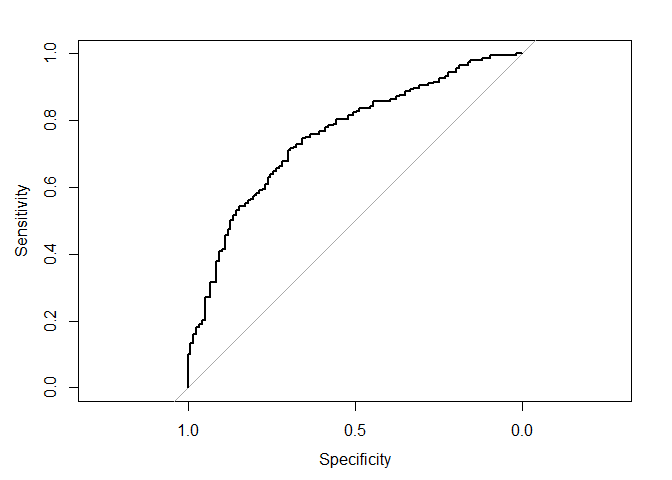

``` r
auc(roc_poly2)
```

    ## Area under the curve: 0.754

``` r
#PRE
real <- na.omit(as.numeric(as_tibble(mh_split$test)$vote96))
E1 <- mean(as.numeric(real != median(real)))
E2 <- 0.2955
PRE <- (E1 - E2) / E1
PRE
```

    ## [1] 0.1186

Using polynomial kernel, with all predictor variables, this time, I try different degree levels (3-5), and tested at different cost levels (0.001, 0.01, 0.1, 1, 5, 10, and 100), the model gets the best cost level at 5, best degree level at 3, the same as the previous polynomial model. However, this time the model set the algorithm automatically gamma at 0.25 (compared to 0.125 in other models). This leads to a slightly better 10-fold CV error rate 29.55%. Also, the AUC us 0.754 and the PRE is 11.86% (the model MSE is estimated by the 10-fold error rate). All measures except the AUC perform worse than the linear kernel model. Though performed worse at this specific case and test set, with its higher AUC, this model is still generally a better choice than the linear kernel.

#### A quick recap

``` r
plot(roc_line, print.auc = TRUE, col = "blue")
plot(roc_poly, print.auc = TRUE, col = "red", print.auc.y = .4, add = TRUE)
plot(roc_rad, print.auc = TRUE, col = "orange", print.auc.y = .3, add = TRUE)
plot(roc_sig, print.auc = TRUE, col = "green", print.auc.y = .2, add = TRUE)
plot(roc_poly2, print.auc = TRUE, col = "black", print.auc.y = .1, add = TRUE)
```

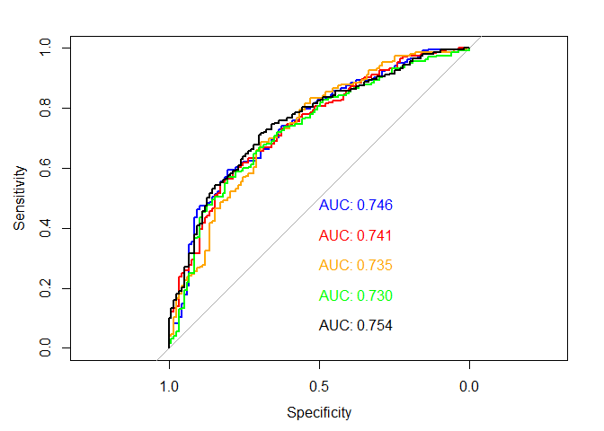 Comparing all 5 model's AUC, the second polynomial kernel model performed the best, followed by the linear one, the first polynomial one, the radial one, and the sigmoid one, as shown in the image. However, the SVM models is not good at interpretation and do not provide clear ways for interpreting the relative importance and influence of individual predictors on the separating hyperplane.

Part 3: OJ Simpson
------------------

### 1. What is the relationship between race and belief of OJ Simpson's guilt? Develop a robust statistical learning model and use this model to explain the impact of an individual's race on their beliefs about OJ Simpson's guilt.

For this exercise, I compare logistic, single tree, and random forest models, for their ability of providing clearer interpretations about beliefs of OJ Simpson's guilt explained by an individual's race (include `black` and `hispanic` but exclude `ind` for avoiding collinarity). I also split the data into 30% testing and 70% training sets for cross validating their fittness.

#### Logistic

``` r
set.seed(1234)

getProb <- function(model, data){
  data <- data %>% 
    add_predictions(model) %>% 
    mutate(prob = exp(pred) / (1 + exp(pred)),
           pred_bi = as.numeric(prob > .5))
  return(data)
}

#Split data
df_simpson_split <- resample_partition(df_simpson, c(test = 0.3, train = 0.7))

model_logistic <- glm(guilt ~ black + hispanic, data = df_simpson_split$train, family = binomial)
summary(model_logistic)
```

    ## 
    ## Call:
    ## glm(formula = guilt ~ black + hispanic, family = binomial, data = df_simpson_split$train)
    ## 
    ## Deviance Residuals: 
    ##    Min      1Q  Median      3Q     Max  
    ## -1.826  -0.608   0.647   0.647   2.119  
    ## 
    ## Coefficients:
    ##             Estimate Std. Error z value Pr(>|z|)    
    ## (Intercept)   1.4587     0.0938   15.55   <2e-16 ***
    ## black1       -3.0529     0.2169  -14.07   <2e-16 ***
    ## hispanic1    -0.5388     0.2846   -1.89    0.058 .  
    ## ---
    ## Signif. codes:  0 '***' 0.001 '**' 0.01 '*' 0.05 '.' 0.1 ' ' 1
    ## 
    ## (Dispersion parameter for binomial family taken to be 1)
    ## 
    ##     Null deviance: 1233.12  on 986  degrees of freedom
    ## Residual deviance:  956.83  on 984  degrees of freedom
    ##   (112 observations deleted due to missingness)
    ## AIC: 962.8
    ## 
    ## Number of Fisher Scoring iterations: 4

``` r
df_logistic_test <- getProb(model_logistic, as.data.frame(df_simpson_split$test))

#ROC
auc_x <- auc(df_logistic_test$guilt, df_logistic_test$pred_bi)
auc_x
```

    ## Area under the curve: 0.744

``` r
#Accuracy
accuracy <- mean(df_logistic_test$guilt == df_logistic_test$pred_bi, na.rm = TRUE)
accuracy
```

    ## [1] 0.8298

``` r
#PRE
real <- na.omit(as.numeric(as_tibble(df_simpson_split$test)$guilt))
E1 <- mean(as.numeric(real != median(real)))
E2 <- 1 - accuracy
PRE <- (E1 - E2) / E1
PRE
```

    ## [1] 0.4341

As for the logistic model, it gives us a 17.02% test error rate, a 0.4341 PRE, and a 0.744 AUC, which is pretty good.. compared to the models for the last two dataset..

According to the p-values of the independent variables, both two included in the model have statistically significant relationships with the `guilt`, with `black` (p-value &lt; 2e-16) at a 99.9% confidence level and `hispanic` (p-value = 0.058) at a 90% confidence level. Both relationships are negative as we observe negative parameters estimated for the corresponding independent variables, which means that when the respondent is black (parameter est. = -3.0529) or hispanic (parameter est. = -0.5388), the predected probability of believing Simpson's guilty has a differential increase. In terms of explanation, `black` has a even stronger power than `hispanic` as it has a smaller p-value and a larger parameter absolute value. The amount of the change in the probability depends on the initial value of the changing independent variable.

``` r
logistic_grid <- as.data.frame(df_simpson_split$test) %>%
  data_grid(black, hispanic) %>%
  add_predictions(model_logistic) %>% 
  mutate(prob = exp(pred) / (1 + exp(pred)))

ggplot(logistic_grid, aes(black, pred, group = factor(hispanic), color = factor(hispanic))) +
  geom_line() +
  scale_color_discrete(name = "Hispanic or not (hispanic = 1)") +
  labs(title = "Log-odds of guilt belief",
       subtitle = "by race",
       x = "Black or not (black = 1)",
       y = "Log-odds of voter turnout")
```

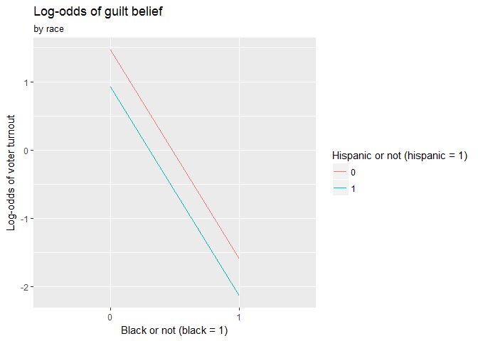

``` r
ggplot(logistic_grid, aes(black, prob, group = factor(hispanic), color = factor(hispanic))) +
  geom_line() +
  scale_color_discrete(name = "Hispanic or not (hispanic = 1)") +
  labs(title = "Predicted probability of guilt belief",
       subtitle = "by race",
       x = "Black or not (black = 1)",
       y = "Predicted probability of voter turnout")
```

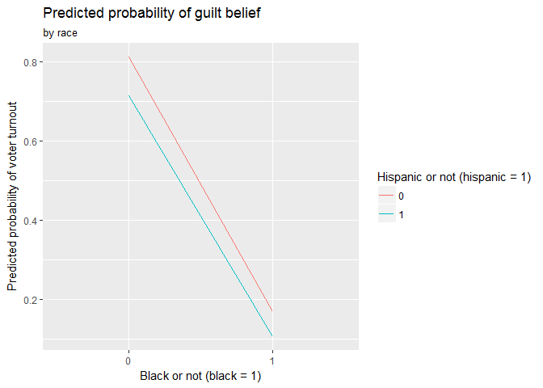 The above graphs illustrate the relationship between black, hispanic status, and the belief of Simpson's guilty. In the graph *Log-odds of guilt belief*, we observe the mentioned negative relationship between race and guilt belief log-odds. The log-odds goes down when people are black, as the lines with a negative slope. In addition, hispanic people have a line below the non-hispanic people. That is, The log-odds of guilt belief is lower for hispanic people. This could be because the the similarity between the respondents and Simpson in terms of race.

#### Single tree

``` r
set.seed(1234)

#Grow tree
simpson_tree_default <- tree(guilt ~ black + hispanic, data = df_simpson_split$train)

#Plot tree
tree_data <- dendro_data(simpson_tree_default)

ggplot(segment(tree_data)) +
  geom_segment(aes(x = x, y = y, xend = xend, yend = yend), alpha = 0.5) +
  geom_text(data = label(tree_data), aes(x = x, y = y, label = label_full), vjust = -0.5, size = 3) +
  geom_text(data = leaf_label(tree_data), aes(x = x, y = y, label = label), vjust = 0.5, size = 3) +
  theme_dendro() +
  labs(title = "Simpson guilt opinion tree",
       subtitle = "black + hispanic")
```


``` r
#ROC
fitted <- predict(simpson_tree_default, as_tibble(df_simpson_split$test), type = "class")

roc_t <- roc(as.numeric(as_tibble(df_simpson_split$test)$guilt), as.numeric(fitted))
plot(roc_t)
```

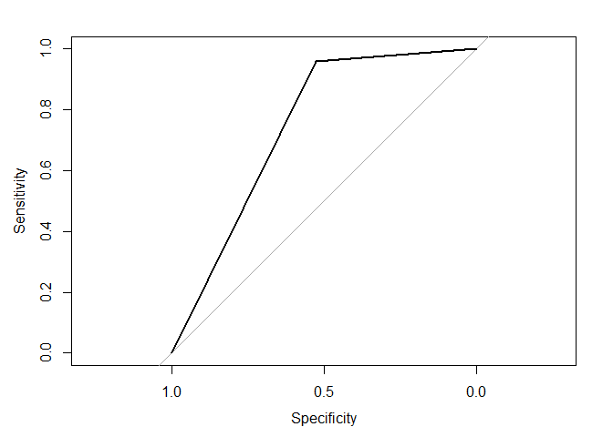

``` r
auc(roc_t)
```

    ## Area under the curve: 0.744

``` r
#Accuracy
pred_bi <- predict(simpson_tree_default, newdata = df_simpson_split$test, type = "class")

accuracy <- mean(df_logistic_test$guilt == pred_bi, na.rm = TRUE)
accuracy
```

    ## [1] 0.8298

``` r
#PRE
real <- na.omit(as.numeric(as_tibble(df_simpson_split$test)$guilt))
E1 <- mean(as.numeric(real != median(real)))
E2 <- 1 - accuracy
PRE <- (E1 - E2) / E1
PRE
```

    ## [1] 0.4341

As for the single tree model with default setting, it gives us a 17.02% test error rate, a 0.4341 PRE, and a 0.744 AUC, exactly the same as we got from the logistic model. Basically, the tree model uses only `black` to estimate the guilt belief. - If the person is not black, the model estimates that the person would believe Simpson is guilty. - If the person is black, the model estimates that the person would believe Simpson is not guilty.

#### Random forest

``` r
set.seed(1234)

simpson_rf <- randomForest(guilt ~ black + hispanic, data = na.omit(as_tibble(df_simpson_split$train)), ntree = 500)
simpson_rf
```

    ## 
    ## Call:
    ##  randomForest(formula = guilt ~ black + hispanic, data = na.omit(as_tibble(df_simpson_split$train)),      ntree = 500) 
    ##                Type of random forest: classification
    ##                      Number of trees: 500
    ## No. of variables tried at each split: 1
    ## 
    ##         OOB estimate of  error rate: 19.05%
    ## Confusion matrix:
    ##     0   1 class.error
    ## 0 156 157     0.50160
    ## 1  31 643     0.04599

``` r
data_frame(var = rownames(importance(simpson_rf)),
           MeanDecreaseRSS = importance(simpson_rf)[,1]) %>%
  mutate(var = fct_reorder(var, MeanDecreaseRSS, fun = median)) %>%
  ggplot(aes(var, MeanDecreaseRSS)) +
  geom_point() +
  coord_flip() +
  labs(title = "Predicting opinion on Simpson guilty",
       subtitle = "Random forest",
       x = NULL,
       y = "Average decrease in the Gini Index")
```

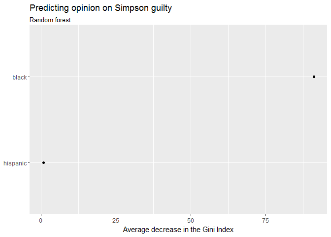

``` r
#ROC
fitted <- predict(simpson_rf, na.omit(as_tibble(df_simpson_split$test)), type = "prob")[,2]

roc_rf <- roc(na.omit(as_tibble(df_simpson_split$test))$guilt, fitted)
plot(roc_rf)
```


``` r
auc(roc_rf)
```

    ## Area under the curve: 0.745

``` r
#PRE
real <- na.omit(as.numeric(as_tibble(df_simpson_split$test)$guilt))
E1 <- mean(as.numeric(real != median(real)))
E2 <- 0.1843
PRE <- (E1 - E2) / E1
PRE
```

    ## [1] 0.3871

As for the random forest model with default setting and 500 trees, it gives us a 19.05% test error rate (estimated by out-of-bag error estimate) and a 38.71% PRE, both are worse than the previous two models. However, the random forest model has a 0.745 AUC at a similar level as the previous two models do. Regarding the predictor importance, the `black` has a way higher average decrease in the Gini index than `hispanic`, which indicates `black`'s importance and confirms the results from the previous two models.

While both the logistic model and tree model perform well, I'll choose the logistic model as my final model, since its interpretability in terms of single relationship direction, the strength of effect, and the specific amount of effect in estimation. I thus redo the logistic model with a 100-time 10-fold cross validation to examine its robustness.

``` r
fold_model_mse <- function(df, k){
  cv10_data <- crossv_kfold(df, k = k)
  cv10_models <- map(cv10_data$train, ~ glm(guilt ~ black + hispanic, family = binomial, data = .))
  cv10_prob <- map2(cv10_models, cv10_data$train, ~getProb(.x, as.data.frame(.y)))
  cv10_mse <- map(cv10_prob, ~ mean(.$guilt != .$pred_bi, na.rm = TRUE))
  return(data_frame(cv10_mse))
}

set.seed(1234)
mses <- rerun(100, fold_model_mse(df_simpson, 10)) %>%
  bind_rows(.id = "id")

ggplot(data = mses, aes(x = "MSE (100 times 10-fold)", y = as.numeric(cv10_mse))) +
  geom_boxplot() +
  labs(title = "Boxplot of MSEs - logistic model",
       x = element_blank(),
       y = "MSE value")
```

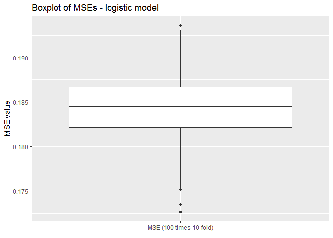

``` r
mse_100cv10 <- mean(as.numeric(mses$cv10_mse))
mseSd_100cv10 <- sd(as.numeric(mses$cv10_mse))
mse_100cv10
```

    ## [1] 0.1843

``` r
mseSd_100cv10
```

    ## [1] 0.003359

The model gets a 18.4322% average error rate, which is still pretty good, with a small std of the error rate at 0.0034.

### 2. How can you predict whether individuals believe OJ Simpson to be guilty of these murders? Develop a robust statistical learning model to predict whether individuals believe OJ Simpson to be either probably guilty or probably not guilty and demonstrate the effectiveness of this model using methods we have discussed in class.

For this exercise, I compare SVM with linear, polynomial, and radial kernels, and a random forest model, for their ability of providing better prediction power about beliefs of OJ Simpson's guilt explained by the predictors. I also split the data into 30% testing and 70% training sets for cross validating their fittness.

#### SVM: linear kernel

``` r
set.seed(1234)

simpson_lin_tune <- tune(svm, guilt ~ dem + rep + age + educ + female + black + hispanic + income, data = na.omit(as_tibble(df_simpson_split$train)),
                    kernel = "linear",
                    range = list(cost = c(.001, .01, .1, 1, 5, 10, 100)))
summary(simpson_lin_tune)
```

    ## 
    ## Parameter tuning of 'svm':
    ## 
    ## - sampling method: 10-fold cross validation 
    ## 
    ## - best parameters:
    ##  cost
    ##  0.01
    ## 
    ## - best performance: 0.1905 
    ## 
    ## - Detailed performance results:
    ##    cost  error dispersion
    ## 1 1e-03 0.3172    0.03493
    ## 2 1e-02 0.1905    0.02885
    ## 3 1e-01 0.1905    0.02885
    ## 4 1e+00 0.1905    0.02885
    ## 5 5e+00 0.1905    0.02885
    ## 6 1e+01 0.1905    0.02885
    ## 7 1e+02 0.1905    0.02885

``` r
simpson_lin <- simpson_lin_tune$best.model
summary(simpson_lin)
```

    ## 
    ## Call:
    ## best.tune(method = svm, train.x = guilt ~ dem + rep + age + educ + 
    ##     female + black + hispanic + income, data = na.omit(as_tibble(df_simpson_split$train)), 
    ##     ranges = list(cost = c(0.001, 0.01, 0.1, 1, 5, 10, 100)), 
    ##     kernel = "linear")
    ## 
    ## 
    ## Parameters:
    ##    SVM-Type:  C-classification 
    ##  SVM-Kernel:  linear 
    ##        cost:  0.01 
    ##       gamma:  0.0625 
    ## 
    ## Number of Support Vectors:  644
    ## 
    ##  ( 331 313 )
    ## 
    ## 
    ## Number of Classes:  2 
    ## 
    ## Levels: 
    ##  0 1

``` r
#Best
simpson_lin <- simpson_lin_tune$best.model
summary(simpson_lin)
```

    ## 
    ## Call:
    ## best.tune(method = svm, train.x = guilt ~ dem + rep + age + educ + 
    ##     female + black + hispanic + income, data = na.omit(as_tibble(df_simpson_split$train)), 
    ##     ranges = list(cost = c(0.001, 0.01, 0.1, 1, 5, 10, 100)), 
    ##     kernel = "linear")
    ## 
    ## 
    ## Parameters:
    ##    SVM-Type:  C-classification 
    ##  SVM-Kernel:  linear 
    ##        cost:  0.01 
    ##       gamma:  0.0625 
    ## 
    ## Number of Support Vectors:  644
    ## 
    ##  ( 331 313 )
    ## 
    ## 
    ## Number of Classes:  2 
    ## 
    ## Levels: 
    ##  0 1

``` r
#ROC
fitted <- predict(simpson_lin, as_tibble(df_simpson_split$test), decision.values = TRUE) %>%
  attributes

roc_line <- roc(as_tibble(df_simpson_split$test)$guilt, fitted$decision.values)
```

    ## Warning in roc.default(as_tibble(df_simpson_split$test)$guilt, fitted
    ## $decision.values): Deprecated use a matrix as predictor. Unexpected results
    ## may be produced, please pass a numeric vector.

``` r
plot(roc_line)
```

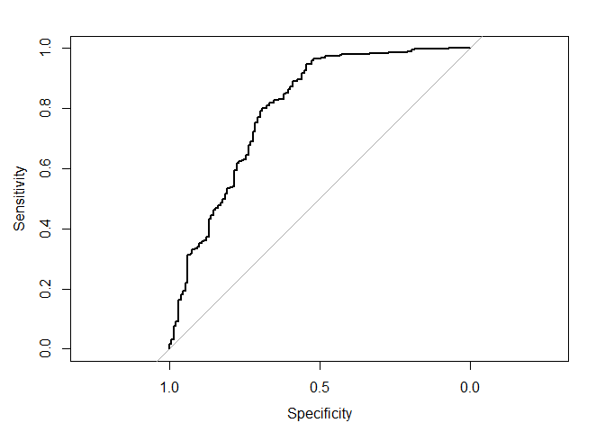

``` r
auc(roc_line)
```

    ## Area under the curve: 0.796

``` r
#PRE
real <- na.omit(as.numeric(as_tibble(df_simpson_split$test)$guilt))
E1 <- mean(as.numeric(real != median(real)))
E2 <- 0.1905
PRE <- (E1 - E2) / E1
PRE
```

    ## [1] 0.3665

Using linear kernel, with all predictor variables and tested at different cost levels (0.001, 0.01, 0.1, 1, 5, 10, and 100), the model gets the best cost level at 0.01, and a 19.05% 10-fold CV error rate. Also, the AUC us 0.796 and the PRE is 36.65% (the model MSE is estimated by the 10-fold error rate).

#### SVM: polynomial kernel

``` r
set.seed(1234)

simpson_poly_tune <- tune(svm, guilt ~ dem + rep + age + educ + female + black + hispanic + income, data = na.omit(as_tibble(df_simpson_split$train)),
                    kernel = "polynomial",
                    range = list(cost = c(.001, .01, .1, 1, 5, 10, 100), degree = c(3, 4, 5)))
summary(simpson_poly_tune)
```

    ## 
    ## Parameter tuning of 'svm':
    ## 
    ## - sampling method: 10-fold cross validation 
    ## 
    ## - best parameters:
    ##  cost degree
    ##    10      3
    ## 
    ## - best performance: 0.1986 
    ## 
    ## - Detailed performance results:
    ##     cost degree  error dispersion
    ## 1  1e-03      3 0.3172    0.03493
    ## 2  1e-02      3 0.3172    0.03493
    ## 3  1e-01      3 0.3172    0.03493
    ## 4  1e+00      3 0.3152    0.03608
    ## 5  5e+00      3 0.2108    0.02392
    ## 6  1e+01      3 0.1986    0.02270
    ## 7  1e+02      3 0.1986    0.02895
    ## 8  1e-03      4 0.3172    0.03493
    ## 9  1e-02      4 0.3172    0.03493
    ## 10 1e-01      4 0.3172    0.03493
    ## 11 1e+00      4 0.3172    0.03493
    ## 12 5e+00      4 0.2929    0.04318
    ## 13 1e+01      4 0.2462    0.03695
    ## 14 1e+02      4 0.2027    0.02684
    ## 15 1e-03      5 0.3172    0.03493
    ## 16 1e-02      5 0.3172    0.03493
    ## 17 1e-01      5 0.3172    0.03493
    ## 18 1e+00      5 0.3172    0.03493
    ## 19 5e+00      5 0.3162    0.03647
    ## 20 1e+01      5 0.3111    0.03901
    ## 21 1e+02      5 0.2330    0.03341

``` r
simpson_poly <- simpson_poly_tune$best.model
summary(simpson_poly)
```

    ## 
    ## Call:
    ## best.tune(method = svm, train.x = guilt ~ dem + rep + age + educ + 
    ##     female + black + hispanic + income, data = na.omit(as_tibble(df_simpson_split$train)), 
    ##     ranges = list(cost = c(0.001, 0.01, 0.1, 1, 5, 10, 100), 
    ##         degree = c(3, 4, 5)), kernel = "polynomial")
    ## 
    ## 
    ## Parameters:
    ##    SVM-Type:  C-classification 
    ##  SVM-Kernel:  polynomial 
    ##        cost:  10 
    ##      degree:  3 
    ##       gamma:  0.0625 
    ##      coef.0:  0 
    ## 
    ## Number of Support Vectors:  561
    ## 
    ##  ( 308 253 )
    ## 
    ## 
    ## Number of Classes:  2 
    ## 
    ## Levels: 
    ##  0 1

``` r
#Best
simpson_poly <- simpson_poly_tune$best.model
summary(simpson_poly)
```

    ## 
    ## Call:
    ## best.tune(method = svm, train.x = guilt ~ dem + rep + age + educ + 
    ##     female + black + hispanic + income, data = na.omit(as_tibble(df_simpson_split$train)), 
    ##     ranges = list(cost = c(0.001, 0.01, 0.1, 1, 5, 10, 100), 
    ##         degree = c(3, 4, 5)), kernel = "polynomial")
    ## 
    ## 
    ## Parameters:
    ##    SVM-Type:  C-classification 
    ##  SVM-Kernel:  polynomial 
    ##        cost:  10 
    ##      degree:  3 
    ##       gamma:  0.0625 
    ##      coef.0:  0 
    ## 
    ## Number of Support Vectors:  561
    ## 
    ##  ( 308 253 )
    ## 
    ## 
    ## Number of Classes:  2 
    ## 
    ## Levels: 
    ##  0 1

``` r
#ROC
fitted <- predict(simpson_poly, as_tibble(df_simpson_split$test), decision.values = TRUE) %>%
  attributes

roc_poly <- roc(as_tibble(df_simpson_split$test)$guilt, fitted$decision.values)
```

    ## Warning in roc.default(as_tibble(df_simpson_split$test)$guilt, fitted
    ## $decision.values): Deprecated use a matrix as predictor. Unexpected results
    ## may be produced, please pass a numeric vector.

``` r
plot(roc_poly)
```

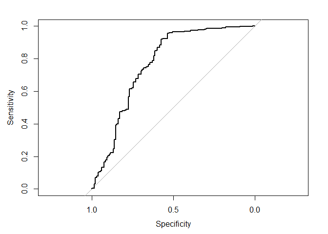

``` r
auc(roc_poly)
```

    ## Area under the curve: 0.766

``` r
#PRE
real <- na.omit(as.numeric(as_tibble(df_simpson_split$test)$guilt))
E1 <- mean(as.numeric(real != median(real)))
E2 <- 0.1986
PRE <- (E1 - E2) / E1
PRE
```

    ## [1] 0.3395

Using polynomial kernel, with all predictor variables and tested at different cost levels (0.001, 0.01, 0.1, 1, 5, 10, and 100) and different degree levels (3, 4, and 5), the model gets the best cost level at 10, degree level at 3, and a 19.86% 10-fold CV error rate. Also, the AUC us 0.766 and the PRE is 33.95% (the model MSE is estimated by the 10-fold error rate). Generally, the model is slightly worse than the linear one.

#### SVM: radial kernel

``` r
set.seed(1234)

simpson_lin_tune <- tune(svm, guilt ~ dem + rep + age + educ + female + black + hispanic + income, data = na.omit(as_tibble(df_simpson_split$train)),
                    kernel = "radial",
                    range = list(cost = c(.001, .01, .1, 1, 5, 10, 100)))
summary(simpson_lin_tune)
```

    ## 
    ## Parameter tuning of 'svm':
    ## 
    ## - sampling method: 10-fold cross validation 
    ## 
    ## - best parameters:
    ##  cost
    ##     1
    ## 
    ## - best performance: 0.1905 
    ## 
    ## - Detailed performance results:
    ##    cost  error dispersion
    ## 1 1e-03 0.3172    0.03493
    ## 2 1e-02 0.3172    0.03493
    ## 3 1e-01 0.2696    0.04362
    ## 4 1e+00 0.1905    0.02885
    ## 5 5e+00 0.1905    0.02885
    ## 6 1e+01 0.1915    0.02985
    ## 7 1e+02 0.2047    0.03133

``` r
simpson_lin <- simpson_lin_tune$best.model
summary(simpson_lin)
```

    ## 
    ## Call:
    ## best.tune(method = svm, train.x = guilt ~ dem + rep + age + educ + 
    ##     female + black + hispanic + income, data = na.omit(as_tibble(df_simpson_split$train)), 
    ##     ranges = list(cost = c(0.001, 0.01, 0.1, 1, 5, 10, 100)), 
    ##     kernel = "radial")
    ## 
    ## 
    ## Parameters:
    ##    SVM-Type:  C-classification 
    ##  SVM-Kernel:  radial 
    ##        cost:  1 
    ##       gamma:  0.0625 
    ## 
    ## Number of Support Vectors:  489
    ## 
    ##  ( 261 228 )
    ## 
    ## 
    ## Number of Classes:  2 
    ## 
    ## Levels: 
    ##  0 1

``` r
#Best
simpson_lin <- simpson_lin_tune$best.model
summary(simpson_lin)
```

    ## 
    ## Call:
    ## best.tune(method = svm, train.x = guilt ~ dem + rep + age + educ + 
    ##     female + black + hispanic + income, data = na.omit(as_tibble(df_simpson_split$train)), 
    ##     ranges = list(cost = c(0.001, 0.01, 0.1, 1, 5, 10, 100)), 
    ##     kernel = "radial")
    ## 
    ## 
    ## Parameters:
    ##    SVM-Type:  C-classification 
    ##  SVM-Kernel:  radial 
    ##        cost:  1 
    ##       gamma:  0.0625 
    ## 
    ## Number of Support Vectors:  489
    ## 
    ##  ( 261 228 )
    ## 
    ## 
    ## Number of Classes:  2 
    ## 
    ## Levels: 
    ##  0 1

``` r
#ROC
fitted <- predict(simpson_lin, as_tibble(df_simpson_split$test), decision.values = TRUE) %>%
  attributes

roc_rad <- roc(as_tibble(df_simpson_split$test)$guilt, fitted$decision.values)
```

    ## Warning in roc.default(as_tibble(df_simpson_split$test)$guilt, fitted
    ## $decision.values): Deprecated use a matrix as predictor. Unexpected results
    ## may be produced, please pass a numeric vector.

``` r
plot(roc_rad)
```

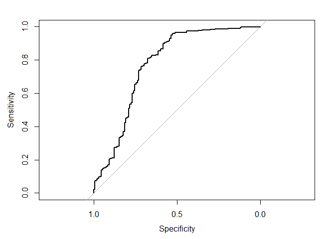

``` r
auc(roc_rad)
```

    ## Area under the curve: 0.771

``` r
#PRE
real <- na.omit(as.numeric(as_tibble(df_simpson_split$test)$guilt))
E1 <- mean(as.numeric(real != median(real)))
E2 <- 0.1905
PRE <- (E1 - E2) / E1
PRE
```

    ## [1] 0.3665

Using linear kernel, with all predictor variables and tested at different cost levels (0.001, 0.01, 0.1, 1, 5, 10, and 100), the model gets the best cost level at 0.01, and a 19.05% 10-fold CV error rate. Also, the AUC us 0.771 and the PRE is 36.65% (the model MSE is estimated by the 10-fold error rate). The result is exactly the same as the linear kernel one except the AUC. Generally, this is better than the polynomial one.

#### Random forest

``` r
set.seed(1234)

simpson_rf <- randomForest(guilt ~ dem + rep + age + educ + female + black + hispanic + income, data = na.omit(as_tibble(df_simpson_split$train)))
simpson_rf
```

    ## 
    ## Call:
    ##  randomForest(formula = guilt ~ dem + rep + age + educ + female +      black + hispanic + income, data = na.omit(as_tibble(df_simpson_split$train))) 
    ##                Type of random forest: classification
    ##                      Number of trees: 500
    ## No. of variables tried at each split: 2
    ## 
    ##         OOB estimate of  error rate: 19.35%
    ## Confusion matrix:
    ##     0   1 class.error
    ## 0 157 156     0.49840
    ## 1  35 639     0.05193

``` r
varImpPlot(simpson_rf)
```

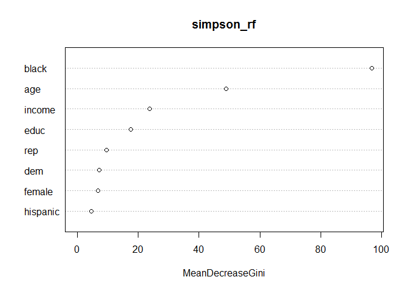

``` r
fitted <- predict(simpson_rf, na.omit(as_tibble(df_simpson_split$test)), type = "prob")[,2]

#ROC
roc_rf <- roc(na.omit(as_tibble(df_simpson_split$test))$guilt, fitted)
plot(roc_rf)
```

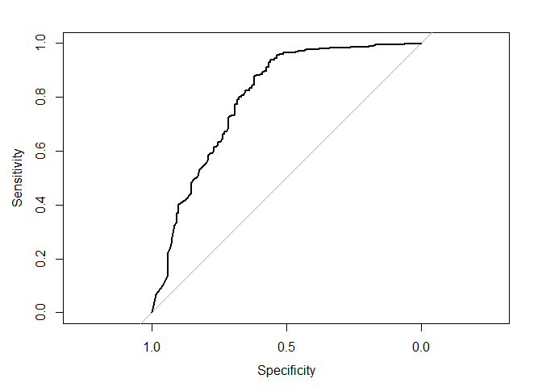

``` r
auc(roc_rf)
```

    ## Area under the curve: 0.795

``` r
#PRE
real <- na.omit(as.numeric(as_tibble(df_simpson_split$test)$guilt))
E1 <- mean(as.numeric(real != median(real)))
E2 <- 0.1935
PRE <- (E1 - E2) / E1
PRE
```

    ## [1] 0.3565

Lastly, let's try a random forest. With all predictor variables, the model emphasizes `black` and `age`, and has a test error rate 19.35% (estimated by out-of-bag error estimate). Also, the AUC is 0.795 and the PRE is 35.65%, meaning when compared to the NULL model, estimating all with the median data value, this model decreases the error rate by 35.65%. These indicators are all worse than the linear kernel SVM model and is considered a worse one in this case.

``` r
plot(roc_line, print.auc = TRUE, col = "blue", print.auc.x = .2)
plot(roc_poly, print.auc = TRUE, col = "red", print.auc.x = .2, print.auc.y = .4, add = TRUE)
plot(roc_rad, print.auc = TRUE, col = "orange", print.auc.x = .2, print.auc.y = .3, add = TRUE)
plot(roc_rf, print.auc = TRUE, col = "green", print.auc.x = .2, print.auc.y = .2, add = TRUE)
```

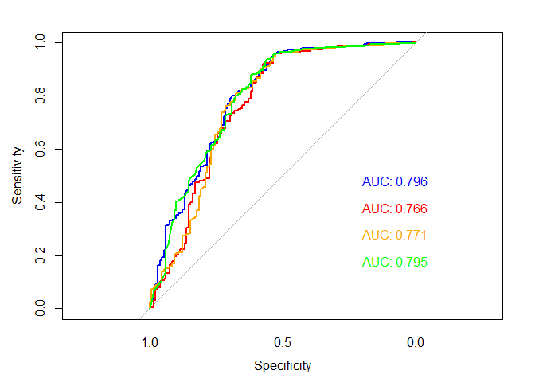 Comparing the ROC line and the AUC values, the SVM model with a linear kernel has the best performance. Also the linear kernek SVM has the lowest error rate with a 10-fold cross validation. This would be a potential optimal best model in this case.
