Perspectives on Computational Modeling PS8
================
HyungJin Cho
March 6, 2017

Part 1: Sexy Joe Biden (redux times two)
========================================

#### 1.Split the data into a training set (70%) and a validation set (30%). Be sure to set your seed prior to this part of your code to guarantee reproducibility of results.

``` r
set.seed(1234)    #Reproducibility
SPLIT.DATA_1 = resample_partition(DATA_1, c(train=0.7, test=0.3))
```

#### 2.Fit a decision tree to the training data, with biden as the response variable and the other variables as predictors. Plot the tree and interpret the results. What is the test MSE?

``` r
# < Tree Model Estimation >
TREE.DATA_1 = tree(biden ~ ., data=SPLIT.DATA_1$train)

# < Graph >
DENDRO.DATA_1 = dendro_data(TREE.DATA_1)

PLOT.DATA_1 = ggplot(segment(DENDRO.DATA_1)) +
  geom_segment(mapping=aes(x=x, y=y, xend=xend, yend=yend), alpha = 0.5) +
  geom_text(data=label(DENDRO.DATA_1), mapping=aes(x=x, y=y, label=label_full), vjust=-0.5, size=3) +
  geom_text(data=leaf_label(DENDRO.DATA_1), mapping=aes(x=x, y=y, label=label), vjust=0.5, size=3) +
  theme_dendro() +
  labs(title='Decision Tree for Biden Score -Default')
PLOT.DATA_1
```

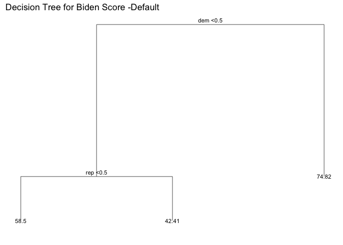

``` r
# < Function: MSE >
FUNC_MSE = function(model, data){
  x = modelr:::residuals(model, data)
  mean(x^2, na.rm=TRUE)
}

MSE.DATA_1 = FUNC_MSE(model=TREE.DATA_1, data=SPLIT.DATA_1$test)
LEAF.DATA_1 = leaf_label(DENDRO.DATA_1)$yval
```

The decision tree used `dem` and `rep` as predictors. At the first decision point, if `dem > 0.5` (if someone is a democrat), then the decision tree predicts a `biden` score of 74.816. Else if `dem < 0.5` (if someone is not a democrat), then the decision tree proceeds to the next decision point. At the second decision point, `rep > 0.5` (if someone is a republican), then the decision tree predicts a `biden` score of 42.409. Else if `rep < 0.5` (if someone is not a republican) then the decision tree predicts `biden` score of 58.499 The test MSE is 418.331.

#### 3.Use cross-validation to determine the optimal level of tree complexity, plot the optimal tree, and interpret the results. Does pruning the tree improve the test MSE?

``` r
# < Tree Model Estimation >
set.seed(1234)

TREE.DATA_1.A = tree(biden ~ ., data=SPLIT.DATA_1$train,
                     control=tree.control(nobs=nrow(SPLIT.DATA_1$train), mindev = 0))
summary(TREE.DATA_1.A)$size
```

    ## [1] 196

``` r
# < MSE >
MSE.DATA_1.A = FUNC_MSE(model=TREE.DATA_1.A, data=SPLIT.DATA_1$test)


# < Tree Model Estimation >
NODE = 2:25
TREE.PRUNED = map(NODE, prune.tree, tree=TREE.DATA_1.A, k=NULL)
MSE.TEST = map_dbl(TREE.PRUNED, FUNC_MSE, data=SPLIT.DATA_1$test)

TREE.DATA_1.B = TREE.PRUNED[[which.min(MSE.TEST)]]
summary(TREE.DATA_1.B)$size
```

    ## [1] 4

``` r
# < MSE >
MSE.DATA_1.B = FUNC_MSE(model=TREE.DATA_1.B, data=SPLIT.DATA_1$test)

# < Graph >
tibble(NODE=NODE, MSE.TEST=MSE.TEST) %>%
  ggplot(aes(x=NODE, y=MSE.TEST)) +
  geom_line() + 
  labs(title = 'Numbers of Terminal Nodes and Test MSE',
       x = 'Terminal Nodes',
       y = 'MSE')
```

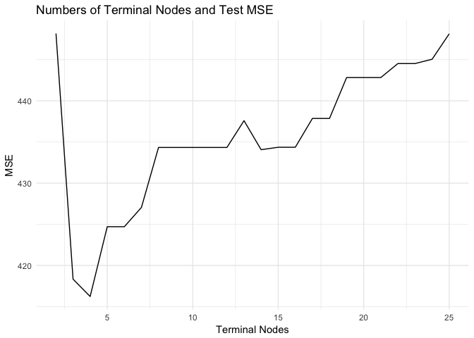

``` r
# < Graph >
DENDRO.PRUNED = dendro_data(TREE.PRUNED[[which.min(MSE.TEST)]], type='uniform')

ggplot(segment(DENDRO.PRUNED)) +
  geom_segment(mapping=aes(x=x, y=y, xend=xend, yend=yend), alpha = 0.5) +
  geom_text(data=label(DENDRO.PRUNED), mapping=aes(x=x, y=y, label=label_full), vjust=-0.5, size=3) +
  geom_text(data=leaf_label(DENDRO.PRUNED), mapping=aes(x=x, y=y, label=label), vjust=0.5, size=3) +
  theme_dendro() +
  labs(title='Decision Tree for Biden Score -Optimal')
```


The minimum test MSE occurs at 4 number of terminal nodes. The pruned tree with 4 nodes includes `age` branch in the model. Pruning the tree reduces the test MSE (416.225) compared to the test MSE without pruning (\`r MSE.DATA\_1.A).

#### 4.Use the bagging approach to analyze this data. What test MSE do you obtain? Obtain variable importance measures and interpret the results.

``` r
set.seed(1234)

BAG.DATA_1 = randomForest(biden ~ ., data=DATA_1, mtry=5, ntree=500)
BAG.DATA_1
```

    ## 
    ## Call:
    ##  randomForest(formula = biden ~ ., data = DATA_1, mtry = 5, ntree = 500) 
    ##                Type of random forest: regression
    ##                      Number of trees: 500
    ## No. of variables tried at each split: 5
    ## 
    ##           Mean of squared residuals: 493
    ##                     % Var explained: 10.4

``` r
data_frame(VAR=rownames(importance(BAG.DATA_1)), RSS=importance(BAG.DATA_1)[,1]) %>%
  mutate(VAR=fct_reorder(VAR, RSS, fun=median)) %>%
  ggplot(mapping=aes(VAR, RSS)) +
  geom_point() +
  coord_flip() +
  labs(title = "Prediction for Biden Score -Bagging",
       x = NULL, y = "Average RSS Decrease")
```

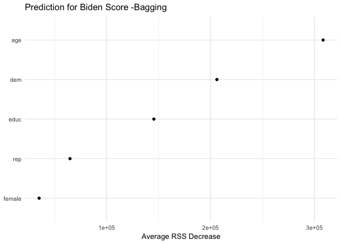

The test MSE with bagging is 493, which is higher than the the test MSE with pruning. Variable importance measures indicates that `age`, `dem`, and `educ` are the important predictors in the model. This is different from the previous models which involve `rep` as an important predictor.

#### 5.Use the random forest approach to analyze this data. What test MSE do you obtain? Obtain variable importance measures and interpret the results. Describe the effect of m, the number of variables considered at each split, on the error rate obtained.

``` r
set.seed(1234)

RF.DATA_1 = randomForest(biden ~ ., data=DATA_1, ntree = 500)
RF.DATA_1
```

    ## 
    ## Call:
    ##  randomForest(formula = biden ~ ., data = DATA_1, ntree = 500) 
    ##                Type of random forest: regression
    ##                      Number of trees: 500
    ## No. of variables tried at each split: 1
    ## 
    ##           Mean of squared residuals: 407
    ##                     % Var explained: 26

``` r
data_frame(VAR=rownames(importance(RF.DATA_1)), RSS=importance(RF.DATA_1)[,1]) %>%
  mutate(VAR=fct_reorder(VAR, RSS, fun=median)) %>%
  ggplot(mapping=aes(VAR, RSS)) +
  geom_point() +
  coord_flip() +
  labs(title = "Predition for Biden Score -Random Forest",
       x = NULL, y = "Average RSS Decrease")
```

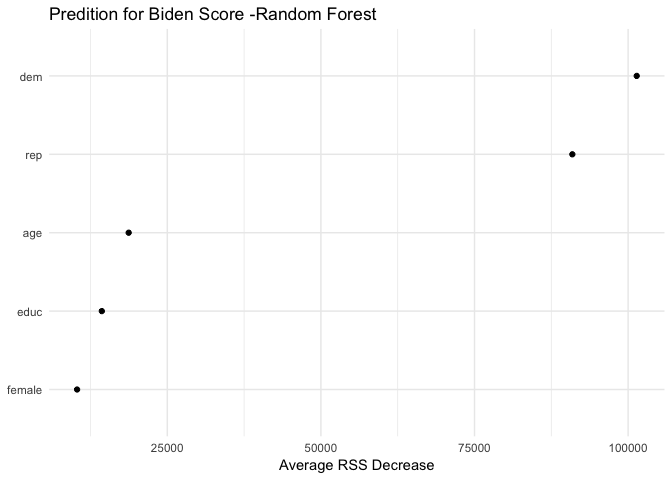

The test MSE with random forest is 407, which is lower than the the test MSE with bagging. Variable importance measures indicates that `dem`, and `rep` are the important predictors in the model. This is different from the previous models which involve `rep` as an important predictor. Average RSS decrease is smaller in the random forest model compared to the previous model.

#### 6.Use the boosting approach to analyze the data. What test MSE do you obtain? How does the value of the shrinkage parameter λ influence the test MSE?

``` r
set.seed(1234)

BOOST.DATA_1 = gbm(biden ~ ., data=SPLIT.DATA_1$train, n.trees=10000, interaction.depth=1)
```

    ## Distribution not specified, assuming gaussian ...

``` r
BOOST.PREDICT = predict(BOOST.DATA_1, newdata=SPLIT.DATA_1$test, n.trees=10000)
mean((BOOST.PREDICT - DATA_1[SPLIT.DATA_1$test[2]$idx, ]$biden)^2)
```

    ## [1] 410

``` r
VECTOR.MSE = numeric(4)
VECTOR.SHIRINKAGE = numeric(4)
for (i in 1:4){
  VECTOR.SHIRINKAGE[i] = 10^(-i)
  BOOST.DATA_1 = gbm(biden ~ ., data=SPLIT.DATA_1$train, n.trees=10000, interaction.depth=1, shrinkage=VECTOR.SHIRINKAGE[i])
  BOOST.PREDICT = predict(BOOST.DATA_1, newdata=SPLIT.DATA_1$test, n.trees=10000)
  VECTOR.MSE[i] = mean((BOOST.PREDICT - DATA_1[SPLIT.DATA_1$test[2]$idx, ]$biden)^2)
}
```

    ## Distribution not specified, assuming gaussian ...
    ## Distribution not specified, assuming gaussian ...
    ## Distribution not specified, assuming gaussian ...
    ## Distribution not specified, assuming gaussian ...

``` r
data_frame(MSE = VECTOR.MSE, SHIRINKAGE = VECTOR.SHIRINKAGE) %>% 
  ggplot(aes(SHIRINKAGE, MSE)) +
  geom_point() +
  geom_line() +
  labs(title="Predition for Biden Score -Boosting",
       x="Shrinkage", y="MSE")
```

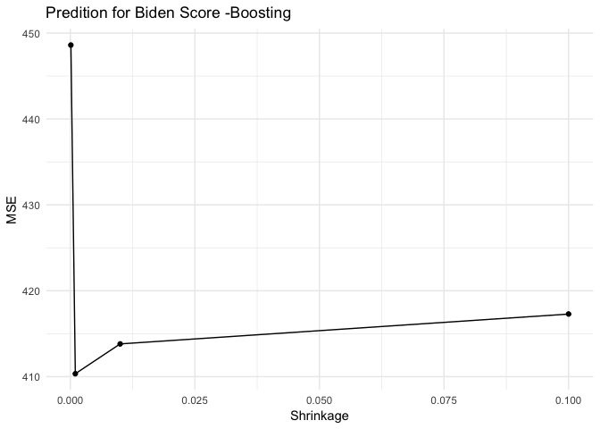

The test MSE with boosting is 410, which is higer than the the test MSE with random forest. The optimal shrinkage level is 0.001. The test MSE increases from the shrinkage level point 0.001.

Part 2: Modeling voter turnout
==============================

#### 1.Use cross-validation techniques and standard measures of model fit (e.g. test error rate, PRE, ROC curves/AUC) to compare and evaluate at least five tree-based models of voter turnout. Select the best model and interpret the results using whatever methods you see fit (graphs, tables, model fit statistics, predictions for hypothetical observations, etc.)

``` r
# < Model1: Decision Tree -Default >
set.seed(1234)
DATA_2 = DATA_2 %>%
  mutate(vote96 = factor(vote96), black = factor(black), female = factor(female), married = factor(married))

SPLIT.DATA_2 = resample_partition(DATA_2, c(train=0.7, test=0.3))

TREE.DATA_2 = tree(vote96 ~ ., data=SPLIT.DATA_2$train)

# < Graph >
DANDRO.DATA_2 = dendro_data(TREE.DATA_2)

ggplot(segment(DANDRO.DATA_2)) +
  geom_segment(mapping=aes(x=x, y=y, xend=xend, yend=yend), alpha=0.5) +
  geom_text(data=label(DANDRO.DATA_2), mapping=aes(x=x, y=y, label=label_full), vjust=-0.5, size=3) +
  geom_text(data=leaf_label(DANDRO.DATA_2), mapping=aes(x=x, y=y, label=label), vjust=0.5, size=3) +
  theme_dendro() +
  labs(title = "Decision Tree for Voter Turnout")
```

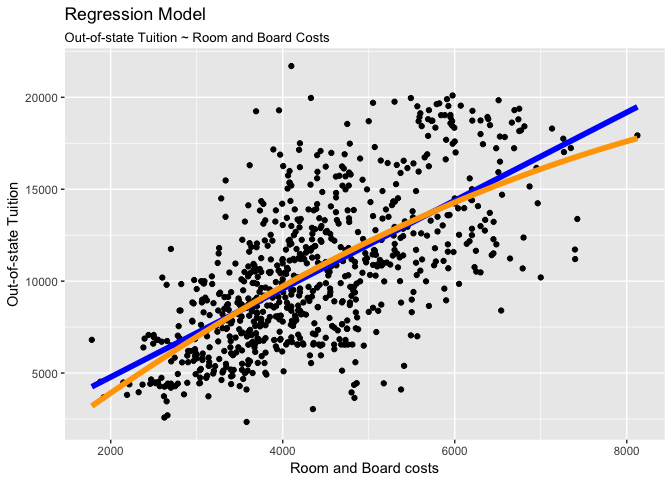

``` r
# < ROC >
PRED.DATA_2 = predict(TREE.DATA_2, as_tibble(SPLIT.DATA_2$test), type="class")

ROC.DATA_2 = roc(as.numeric(as_tibble(SPLIT.DATA_2$test)$vote96), as.numeric(PRED.DATA_2))

plot(ROC.DATA_2)
```

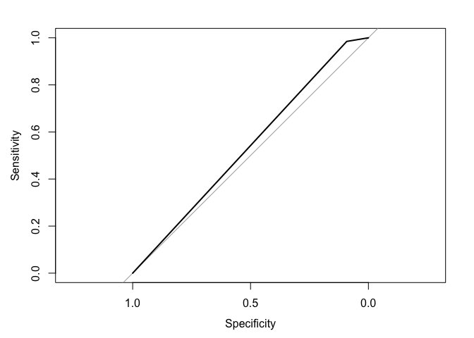

``` r
auc(ROC.DATA_2) #Area under the curve
```

    ## Area under the curve: 0.538

``` r
# < MSE >
FUNC_ERR = function(model, data){
  data = as_tibble(data)
  response = as.character(model$terms[[2]])
  pred = predict(model, newdata=data, type="class")
  actual = data[[response]]
  return(mean(pred != actual, na.rm=TRUE))
}

ERR.DATA_2 = FUNC_ERR(TREE.DATA_2, SPLIT.DATA_2$test)
ERR.DATA_2
```

    ## [1] 0.313

``` r
# < PRE >
R = as.numeric(na.omit(as_tibble(SPLIT.DATA_2$test)$vote96))
E1 = mean(as.numeric(R != median(R)))
E2 = ERR.DATA_2
PRE = (E1 - E2) / E1
PRE
```

    ## [1] 0.0613

``` r
# < Model2: Decision Tree -Default (Predictors: `age` and `mhealth_sum`) >
set.seed(1234)

TREE.DATA_2.D = tree(vote96 ~ age + mhealth_sum, data=SPLIT.DATA_2$train)

# < Graph >
DANDRO.DATA_2.D <- dendro_data(TREE.DATA_2.D)

ggplot(segment(DANDRO.DATA_2.D)) +
  geom_segment(aes(x=x, y=y, xend=xend, yend=yend), alpha=0.5) +
  geom_text(data = label(DANDRO.DATA_2.D), aes(x=x, y=y, label=label_full), vjust=-0.5, size=3) +
  geom_text(data = leaf_label(DANDRO.DATA_2.D), aes(x=x, y=y, label=label), vjust=0.5, size=3) +
  theme_dendro() +
  labs(title = "Decision Tree for Voter Turnout")
```

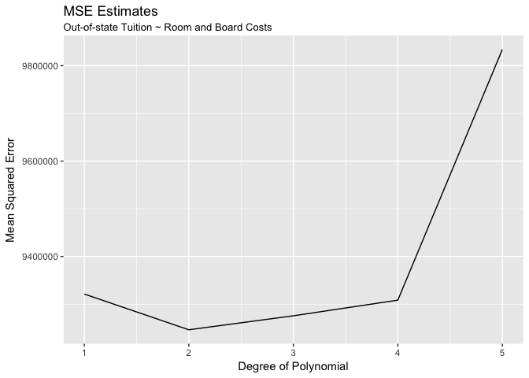

``` r
# < ROC >
PRED.DATA_2.D = predict(TREE.DATA_2.D, as_tibble(SPLIT.DATA_2$test), type="class")

ROC.DATA_2.D = roc(as.numeric(as_tibble(SPLIT.DATA_2$test)$vote96), as.numeric(PRED.DATA_2.D))

plot(ROC.DATA_2.D)
```

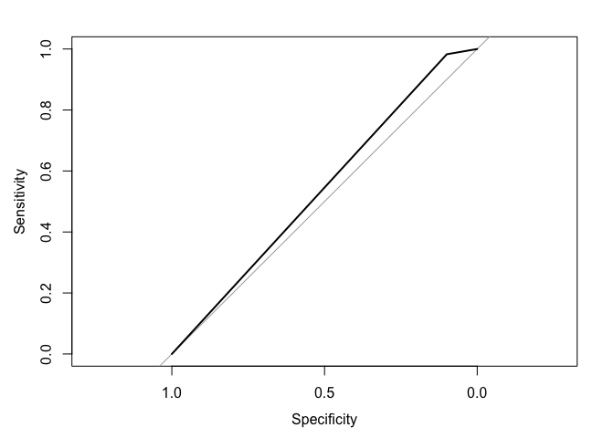

``` r
auc(ROC.DATA_2.D) #Area under the curve
```

    ## Area under the curve: 0.541

``` r
# < MSE >
ERR.DATA_2.D = FUNC_ERR(TREE.DATA_2.D, SPLIT.DATA_2$test)
ERR.DATA_2.D
```

    ## [1] 0.312

``` r
# < PRE >
R = as.numeric(na.omit(as_tibble(SPLIT.DATA_2$test)$vote96))
E1 = mean(as.numeric(R != median(R)))
E2 = ERR.DATA_2.D
PRE = (E1 - E2) / E1
PRE
```

    ## [1] 0.0651

``` r
# < Model3: Decision Tree -All Nodes >

set.seed(1234)

TREE.DATA_2.A = tree(vote96 ~ ., data=SPLIT.DATA_2$train,
                     control=tree.control(nobs=nrow(SPLIT.DATA_2$train), mindev=0))

# < Graph >
DANDRO.DATA_2.A = dendro_data(TREE.DATA_2.A)

ggplot(segment(DANDRO.DATA_2.A)) +
  geom_segment(mapping=aes(x=x, y=y, xend=xend, yend=yend), alpha=0.5) +
  geom_text(data=label(DANDRO.DATA_2.A), mapping=aes(x=x, y=y, label=label_full), vjust=-0.5, size=3) +
  geom_text(data=leaf_label(DANDRO.DATA_2.A), mapping=aes(x=x, y=y, label=label), vjust=0.5, size=3) +
  theme_dendro() +
  labs(title = "Decision Tree for Voter Turnout")
```

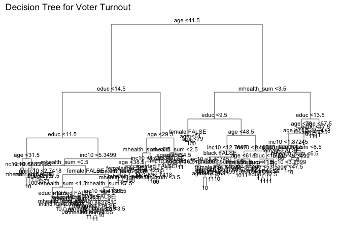

``` r
# < ROC >
PRED.DATA_2.A = predict(TREE.DATA_2.A, as_tibble(SPLIT.DATA_2$test), type="class")

ROC.DATA_2.A = roc(as.numeric(as_tibble(SPLIT.DATA_2$test)$vote96), as.numeric(PRED.DATA_2.A))

plot(ROC.DATA_2.A)
```


``` r
auc(ROC.DATA_2.A) #Area under the curve
```

    ## Area under the curve: 0.6

``` r
# < MSE >
ERR.DATA_2.A = FUNC_ERR(TREE.DATA_2.A, SPLIT.DATA_2$test)
ERR.DATA_2.A
```

    ## [1] 0.33

``` r
# < PRE >
R = as.numeric(na.omit(as_tibble(SPLIT.DATA_2$test)$vote96))
E1 = mean(as.numeric(R != median(R)))
E2 = ERR.DATA_2.A
PRE = (E1 - E2) / E1
PRE
```

    ## [1] 0.0115

``` r
# < Model4: Bagging >

set.seed(1234)

BAG.DATA_2 = randomForest(vote96 ~ ., data = na.omit(as_tibble(SPLIT.DATA_2$train)), mtry=7, ntree=500)
BAG.DATA_2
```

    ## 
    ## Call:
    ##  randomForest(formula = vote96 ~ ., data = na.omit(as_tibble(SPLIT.DATA_2$train)),      mtry = 7, ntree = 500) 
    ##                Type of random forest: classification
    ##                      Number of trees: 500
    ## No. of variables tried at each split: 7
    ## 
    ##         OOB estimate of  error rate: 29.5%
    ## Confusion matrix:
    ##     0   1 class.error
    ## 0 107 145       0.575
    ## 1  95 466       0.169

``` r
data_frame(VAR = rownames(importance(BAG.DATA_2)),
           RSS = importance(BAG.DATA_2)[,1]) %>%
  mutate(VAR = fct_reorder(VAR, RSS, fun=median)) %>%
  ggplot(aes(VAR, RSS)) +
  geom_point() +
  coord_flip() +
  labs(title = "Predition for Voter Turnout -Bagging",
       x = NULL,
       y = "Average RSS Decrease")
```

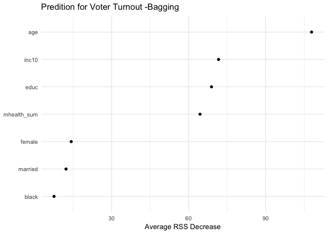

``` r
# < ROC >
PRED.DATA_2.B = predict(BAG.DATA_2, na.omit(as_tibble(SPLIT.DATA_2$test)), type = "prob")[,2]

ROC.DATA_2.B = roc(na.omit(as_tibble(SPLIT.DATA_2$test))$vote96, PRED.DATA_2.B)

plot(ROC.DATA_2.B)
```

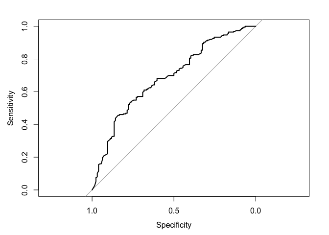

``` r
auc(ROC.DATA_2.B) #Area under the curve
```

    ## Area under the curve: 0.687

``` r
# < PRE >
R = as.numeric(na.omit(as_tibble(SPLIT.DATA_2$test)$vote96))
E1 = mean(as.numeric(R != median(R)))
E2 = 0.295   #OOB estimate of  error rate: 29.5%
PRE = (E1 - E2) / E1
PRE
```

    ## [1] 0.115

``` r
# < Model5: Random Forest >

set.seed(1234)

RF.DATA_2 = randomForest(vote96 ~ ., data=na.omit(as_tibble(SPLIT.DATA_2$train)), ntree=500)
RF.DATA_2
```

    ## 
    ## Call:
    ##  randomForest(formula = vote96 ~ ., data = na.omit(as_tibble(SPLIT.DATA_2$train)),      ntree = 500) 
    ##                Type of random forest: classification
    ##                      Number of trees: 500
    ## No. of variables tried at each split: 2
    ## 
    ##         OOB estimate of  error rate: 29.1%
    ## Confusion matrix:
    ##    0   1 class.error
    ## 0 97 155       0.615
    ## 1 82 479       0.146

``` r
data_frame(VAR = rownames(importance(RF.DATA_2)),
           RSS = importance(RF.DATA_2)[,1]) %>%
  mutate(VAR = fct_reorder(VAR, RSS, fun=median)) %>%
  ggplot(aes(VAR, RSS)) +
  geom_point() +
  coord_flip() +
  labs(title = "Predition for Voter Turnout -Random forest",
       x = NULL,
       y = "Average RSS Decrease")
```

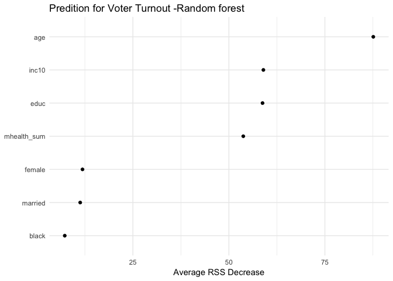

``` r
# < ROC >
PRED.DATA_2.C = predict(RF.DATA_2, na.omit(as_tibble(SPLIT.DATA_2$test)), type="prob")[,2]

ROC.DATA_2.C = roc(na.omit(as_tibble(SPLIT.DATA_2$test))$vote96, PRED.DATA_2.C)

plot(ROC.DATA_2.C)
```

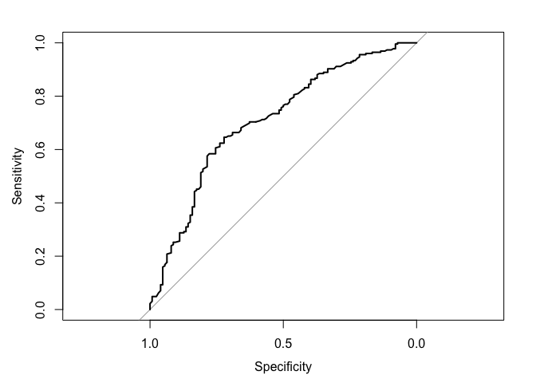

``` r
auc(ROC.DATA_2.C)
```

    ## Area under the curve: 0.709

``` r
# <PRE>
R = as.numeric(na.omit(as_tibble(SPLIT.DATA_2$test)$vote96))
E1 = mean(as.numeric(R != median(R)))
E2 = 0.291    #OOB estimate of  error rate: 29.1%
PRE = (E1 - E2) / E1
PRE
```

    ## [1] 0.127

Model1: Decision Tree -Default The decision tree with all predictors has a test error rate of 31.3%, AUC of 0.538, and PRE of 6.13%. `educ`, `mhealth_sum`, and `age` are the important variables in predicting the voting behavior.

Model2: Decision Tree -Default (Predictors: `age` and `mhealth_sum`) The decision tree with `age` and `mhealth_sum` as predictors has a test error rate of 31.2%, AUC of 0.541, and PRE of 6.51%. `age` and `mhealth_sum` are the important variables in predicting the voting behavior.

Model3: Decision Tree -All Nodes The decision tree with full nodes has a test error rate 33%, AUC OF 0.6, AND PRE OF 1.15%.

Model4: Bagging The bagging with all predictors has a test error rate of 29.5%, AUC of 0.687, and PRE of 11.5%. `age`, `inc10`, `educ`, and `mheath_sum` are the important variables in predicting the voting behavior.

Model5: Random Forest The random forest with all predictors has a test error rate of 29.1%, AUC of 0.709, and PRE of 12.7%. `age`, `inc10`, `educ`, and `mheath_sum` are the important variables in predicting the voting behavior.

Therefore, the best model is the random forest model, since it has the lowest test error rate (29.1%) and the highset PRE (12.7%).

#### 2.Use cross-validation techniques and standard measures of model fit (e.g. test error rate, PRE, ROC curves/AUC) to compare and evaluate at least five SVM models of voter turnout. Select the best model and interpret the results using whatever methods you see fit (graphs, tables, model fit statistics, predictions for hypothetical observations, etc.)

``` r
set.seed(1234)

SPLIT.DATA_2 = resample_partition(na.omit(DATA_2), c(train=0.7, test=0.3))

# < Model1: Linear Kernel >

set.seed(1234)

TUNE.DATA_2 = tune(svm, vote96 ~ ., data=as_tibble(SPLIT.DATA_2$train),
                   kernel = "linear",
                   range = list(cost = c(0.001, 0.01, 0.1, 1, 5, 10, 100)))
summary(TUNE.DATA_2)
```

    ## 
    ## Parameter tuning of 'svm':
    ## 
    ## - sampling method: 10-fold cross validation 
    ## 
    ## - best parameters:
    ##  cost
    ##     1
    ## 
    ## - best performance: 0.277 
    ## 
    ## - Detailed performance results:
    ##    cost error dispersion
    ## 1 1e-03 0.320     0.0420
    ## 2 1e-02 0.317     0.0422
    ## 3 1e-01 0.280     0.0428
    ## 4 1e+00 0.277     0.0552
    ## 5 5e+00 0.277     0.0552
    ## 6 1e+01 0.277     0.0552
    ## 7 1e+02 0.277     0.0552

``` r
# < Best Model >
LIN.DATA_2 = TUNE.DATA_2$best.model
summary(LIN.DATA_2)
```

    ## 
    ## Call:
    ## best.tune(method = svm, train.x = vote96 ~ ., data = as_tibble(SPLIT.DATA_2$train), 
    ##     ranges = list(cost = c(0.001, 0.01, 0.1, 1, 5, 10, 100)), 
    ##     kernel = "linear")
    ## 
    ## 
    ## Parameters:
    ##    SVM-Type:  C-classification 
    ##  SVM-Kernel:  linear 
    ##        cost:  1 
    ##       gamma:  0.125 
    ## 
    ## Number of Support Vectors:  509
    ## 
    ##  ( 256 253 )
    ## 
    ## 
    ## Number of Classes:  2 
    ## 
    ## Levels: 
    ##  0 1

``` r
# < ROC >
PRED.LIN = predict(LIN.DATA_2, as_tibble(SPLIT.DATA_2$test), decision.values=TRUE) %>%
  attributes

ROC.LIN = roc(as_tibble(SPLIT.DATA_2$test)$vote96, PRED.LIN$decision.values)

plot(ROC.LIN)
```

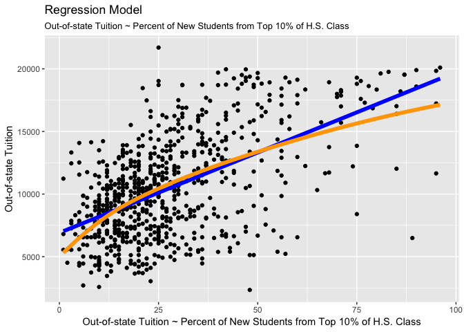

``` r
auc(ROC.LIN)
```

    ## Area under the curve: 0.759

``` r
# < PRE >
R = na.omit(as.numeric(as_tibble(SPLIT.DATA_2$test)$vote96))
E1 = mean(as.numeric(R != median(R)))
E2 = 0.277     #best performance: 0.277 
PRE = (E1 - E2) / E1
PRE
```

    ## [1] 0.171

``` r
# < Model2: Polynomial Kernel >

set.seed(1234)

TUNE.DATA_2.A = tune(svm, vote96 ~ ., data = as_tibble(SPLIT.DATA_2$train),
                     kernel = "polynomial",
                     range = list(cost = c(0.001, 0.01, 0.1, 1, 5, 10, 100)))
summary(TUNE.DATA_2.A)
```

    ## 
    ## Parameter tuning of 'svm':
    ## 
    ## - sampling method: 10-fold cross validation 
    ## 
    ## - best parameters:
    ##  cost
    ##     5
    ## 
    ## - best performance: 0.282 
    ## 
    ## - Detailed performance results:
    ##    cost error dispersion
    ## 1 1e-03 0.320     0.0420
    ## 2 1e-02 0.320     0.0420
    ## 3 1e-01 0.307     0.0404
    ## 4 1e+00 0.290     0.0443
    ## 5 5e+00 0.282     0.0374
    ## 6 1e+01 0.285     0.0476
    ## 7 1e+02 0.298     0.0369

``` r
# < Best Model >
POLY.DATA_2 = TUNE.DATA_2.A$best.model
summary(POLY.DATA_2)
```

    ## 
    ## Call:
    ## best.tune(method = svm, train.x = vote96 ~ ., data = as_tibble(SPLIT.DATA_2$train), 
    ##     ranges = list(cost = c(0.001, 0.01, 0.1, 1, 5, 10, 100)), 
    ##     kernel = "polynomial")
    ## 
    ## 
    ## Parameters:
    ##    SVM-Type:  C-classification 
    ##  SVM-Kernel:  polynomial 
    ##        cost:  5 
    ##      degree:  3 
    ##       gamma:  0.125 
    ##      coef.0:  0 
    ## 
    ## Number of Support Vectors:  485
    ## 
    ##  ( 253 232 )
    ## 
    ## 
    ## Number of Classes:  2 
    ## 
    ## Levels: 
    ##  0 1

``` r
# < ROC >
PRED.POLY = predict(POLY.DATA_2, as_tibble(SPLIT.DATA_2$test), decision.values=TRUE) %>%
  attributes

ROC.POLY = roc(as_tibble(SPLIT.DATA_2$test)$vote96, PRED.POLY$decision.values)

plot(ROC.POLY)
```

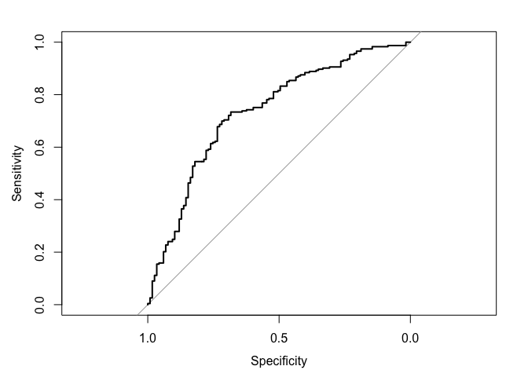

``` r
auc(ROC.POLY)
```

    ## Area under the curve: 0.735

``` r
# < PRE >
R = na.omit(as.numeric(as_tibble(SPLIT.DATA_2$test)$vote96))
E1 = mean(as.numeric(R != median(R)))
E2 = 0.282     #best performance: 0.282 
PRE = (E1 - E2) / E1
PRE
```

    ## [1] 0.156

``` r
# < Model3: Polynomial Kernel (Degree Levels: 3~5) >

set.seed(1234)

TUNE.DATA_2.B = tune(svm, vote96 ~ ., data = as_tibble(SPLIT.DATA_2$train),
                     kernel = "polynomial",
                     range = list(cost = c(0.001, 0.01, 0.1, 1, 5, 10, 100), degree = c(3, 4, 5)))
summary(TUNE.DATA_2.B)
```

    ## 
    ## Parameter tuning of 'svm':
    ## 
    ## - sampling method: 10-fold cross validation 
    ## 
    ## - best parameters:
    ##  cost degree
    ##     5      3
    ## 
    ## - best performance: 0.282 
    ## 
    ## - Detailed performance results:
    ##     cost degree error dispersion
    ## 1  1e-03      3 0.320     0.0420
    ## 2  1e-02      3 0.320     0.0420
    ## 3  1e-01      3 0.307     0.0404
    ## 4  1e+00      3 0.290     0.0443
    ## 5  5e+00      3 0.282     0.0374
    ## 6  1e+01      3 0.285     0.0476
    ## 7  1e+02      3 0.298     0.0369
    ## 8  1e-03      4 0.320     0.0420
    ## 9  1e-02      4 0.319     0.0434
    ## 10 1e-01      4 0.312     0.0396
    ## 11 1e+00      4 0.301     0.0510
    ## 12 5e+00      4 0.291     0.0557
    ## 13 1e+01      4 0.293     0.0653
    ## 14 1e+02      4 0.334     0.0726
    ## 15 1e-03      5 0.320     0.0420
    ## 16 1e-02      5 0.319     0.0434
    ## 17 1e-01      5 0.315     0.0399
    ## 18 1e+00      5 0.307     0.0422
    ## 19 5e+00      5 0.301     0.0449
    ## 20 1e+01      5 0.301     0.0511
    ## 21 1e+02      5 0.328     0.0591

``` r
# < Best Model >
POLY.DATA_2.B = TUNE.DATA_2.B$best.model
summary(POLY.DATA_2.B)
```

    ## 
    ## Call:
    ## best.tune(method = svm, train.x = vote96 ~ ., data = as_tibble(SPLIT.DATA_2$train), 
    ##     ranges = list(cost = c(0.001, 0.01, 0.1, 1, 5, 10, 100), 
    ##         degree = c(3, 4, 5)), kernel = "polynomial")
    ## 
    ## 
    ## Parameters:
    ##    SVM-Type:  C-classification 
    ##  SVM-Kernel:  polynomial 
    ##        cost:  5 
    ##      degree:  3 
    ##       gamma:  0.125 
    ##      coef.0:  0 
    ## 
    ## Number of Support Vectors:  485
    ## 
    ##  ( 253 232 )
    ## 
    ## 
    ## Number of Classes:  2 
    ## 
    ## Levels: 
    ##  0 1

``` r
# < ROC >
PRED.POLY.B = predict(POLY.DATA_2.B, as_tibble(SPLIT.DATA_2$test), decision.values=TRUE) %>%
  attributes

ROC.POLY.B = roc(as_tibble(SPLIT.DATA_2$test)$vote96, PRED.POLY.B$decision.values)

plot(ROC.POLY.B)
auc(ROC.POLY.B)
```

    ## Area under the curve: 0.735

``` r
# < PRE >
R = na.omit(as.numeric(as_tibble(SPLIT.DATA_2$test)$vote96))
E1 = mean(as.numeric(R != median(R)))
E2 = 0.282     #best performance: 0.282 
PRE = (E1 - E2) / E1
PRE
```

    ## [1] 0.156

``` r
# < Model4: Radial Kernel >

set.seed(1234)

TUNE.DATA_2.C <- tune(svm, vote96 ~ ., data = as_tibble(SPLIT.DATA_2$train),
                      kernel = "radial",
                      range = list(cost = c(0.001, 0.01, 0.1, 1, 5, 10, 100)))
summary(TUNE.DATA_2.C)
```

    ## 
    ## Parameter tuning of 'svm':
    ## 
    ## - sampling method: 10-fold cross validation 
    ## 
    ## - best parameters:
    ##  cost
    ##     5
    ## 
    ## - best performance: 0.278 
    ## 
    ## - Detailed performance results:
    ##    cost error dispersion
    ## 1 1e-03 0.320     0.0420
    ## 2 1e-02 0.320     0.0420
    ## 3 1e-01 0.304     0.0397
    ## 4 1e+00 0.286     0.0503
    ## 5 5e+00 0.278     0.0502
    ## 6 1e+01 0.286     0.0511
    ## 7 1e+02 0.319     0.0625

``` r
# < Best Model >
RAD.DATA_2 = TUNE.DATA_2.C$best.model
summary(RAD.DATA_2)
```

    ## 
    ## Call:
    ## best.tune(method = svm, train.x = vote96 ~ ., data = as_tibble(SPLIT.DATA_2$train), 
    ##     ranges = list(cost = c(0.001, 0.01, 0.1, 1, 5, 10, 100)), 
    ##     kernel = "radial")
    ## 
    ## 
    ## Parameters:
    ##    SVM-Type:  C-classification 
    ##  SVM-Kernel:  radial 
    ##        cost:  5 
    ##       gamma:  0.125 
    ## 
    ## Number of Support Vectors:  498
    ## 
    ##  ( 268 230 )
    ## 
    ## 
    ## Number of Classes:  2 
    ## 
    ## Levels: 
    ##  0 1

``` r
# < ROC >
PRED.RAD = predict(RAD.DATA_2, as_tibble(SPLIT.DATA_2$test), decision.values=TRUE) %>%
  attributes

ROC.RAD = roc(as_tibble(SPLIT.DATA_2$test)$vote96, PRED.RAD$decision.values)

plot(ROC.RAD)
```

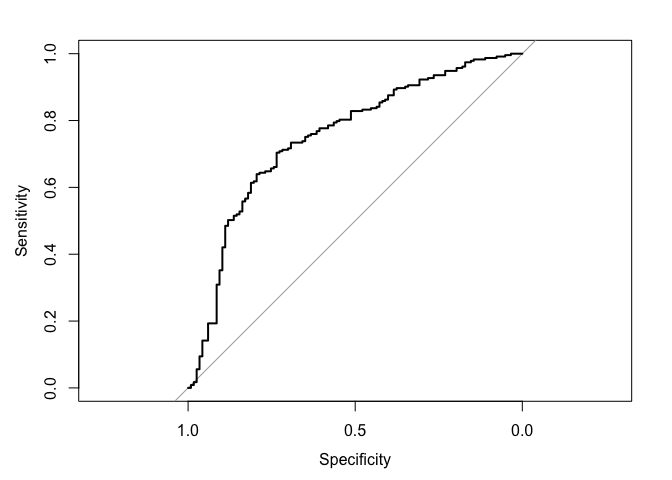

``` r
auc(ROC.RAD)
```

    ## Area under the curve: 0.752

``` r
# < PRE >
R = na.omit(as.numeric(as_tibble(SPLIT.DATA_2$test)$vote96))
E1 = mean(as.numeric(R != median(R)))
E2 = 0.278     #best performance: 0.278 
PRE = (E1 - E2) / E1
PRE
```

    ## [1] 0.168

``` r
# < Model5: Sigmoid Kernel >

set.seed(1234)

TUNE.DATA_2.D = tune(svm, vote96 ~ ., data = as_tibble(SPLIT.DATA_2$train),
                     kernel = "sigmoid",
                     range = list(cost = c(0.001, 0.01, 0.1, 1, 5, 10, 100)))
summary(TUNE.DATA_2.D)
```

    ## 
    ## Parameter tuning of 'svm':
    ## 
    ## - sampling method: 10-fold cross validation 
    ## 
    ## - best parameters:
    ##   cost
    ##  0.001
    ## 
    ## - best performance: 0.32 
    ## 
    ## - Detailed performance results:
    ##    cost error dispersion
    ## 1 1e-03 0.320     0.0420
    ## 2 1e-02 0.320     0.0420
    ## 3 1e-01 0.320     0.0451
    ## 4 1e+00 0.347     0.0434
    ## 5 5e+00 0.357     0.0366
    ## 6 1e+01 0.358     0.0430
    ## 7 1e+02 0.365     0.0449

``` r
# < Best Model >
SIG.DATA_2 = TUNE.DATA_2.D$best.model
summary(SIG.DATA_2)
```

    ## 
    ## Call:
    ## best.tune(method = svm, train.x = vote96 ~ ., data = as_tibble(SPLIT.DATA_2$train), 
    ##     ranges = list(cost = c(0.001, 0.01, 0.1, 1, 5, 10, 100)), 
    ##     kernel = "sigmoid")
    ## 
    ## 
    ## Parameters:
    ##    SVM-Type:  C-classification 
    ##  SVM-Kernel:  sigmoid 
    ##        cost:  0.001 
    ##       gamma:  0.125 
    ##      coef.0:  0 
    ## 
    ## Number of Support Vectors:  522
    ## 
    ##  ( 261 261 )
    ## 
    ## 
    ## Number of Classes:  2 
    ## 
    ## Levels: 
    ##  0 1

``` r
# < ROC >
PRED.SIG = predict(SIG.DATA_2, as_tibble(SPLIT.DATA_2$test), decision.values=TRUE) %>%
  attributes

ROC.SIG = roc(as_tibble(SPLIT.DATA_2$test)$vote96, PRED.SIG$decision.values)

plot(ROC.SIG)
```

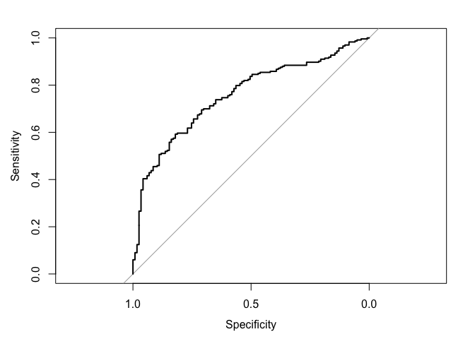

``` r
auc(ROC.SIG)
```

    ## Area under the curve: 0.756

``` r
# < PRE >
R = na.omit(as.numeric(as_tibble(SPLIT.DATA_2$test)$vote96))
E1 = mean(as.numeric(R != median(R)))
E2 = 0.32     #best performance: 0.32 
PRE = (E1 - E2) / E1
PRE
```

    ## [1] 0.0427

Model1: Linear Kernel The linear kernel has the best cost level at 1. The error rate is 27.7%, AUC is 0.759 and the PRE is 21.6%.

Model2: Polynomial Kernel The polynomial kernel has the best cost level at 3. The error rate is 28.2%, AUC is 0.735 and the PRE is 15.6%.

Model3: Polynomial Kernel (Degree Levels: 3~5) The polynomial kernel with different degree levels (3~5) has the best cost level at 5, best degree level at 3. The error rate is 28.2%, AUC is 0.735 and the PRE is 15.6%.

Model4: Radial Kernel The radial kernel has the best cost level at 5. The error rate is 27.8%, AUC is 0.752 and the PRE is 16.8%

Model5: Sigmoid Kernel The radial kernel has the best cost level at 0.1. The error rate is 32%, AUC is 0.756 and the PRE is 4.27%

Therefore, the best model is the linear kernel model, since it has the highset AUC (0.759).

Part 3: OJ Simpson
==================

#### 1.What is the relationship between race and belief of OJ Simpson's guilt? Develop a robust statistical learning model and use this model to explain the impact of an individual's race on their beliefs about OJ Simpson's guilt.

``` r
set.seed(1234)

FUNC_PROB = function(model, data){
  data = data %>% 
  add_predictions(model) %>% 
  mutate(prob = exp(pred) / (1 + exp(pred)),
         pred_bi = as.numeric(prob > .5))
  return(data)
}

DATA_3 = DATA_3 %>%
  mutate_each(funs(as.factor(.)), guilt, dem, rep, ind, female, black, hispanic, educ, income)

SPLIT.DATA_3 = resample_partition(DATA_3, c(train=0.7, test=0.3))

# < Model1: Logistic >

LOG.DATA_3 = glm(guilt ~ black + hispanic, data=SPLIT.DATA_3$train, family=binomial)
summary(LOG.DATA_3)
```

    ## 
    ## Call:
    ## glm(formula = guilt ~ black + hispanic, family = binomial, data = SPLIT.DATA_3$train)
    ## 
    ## Deviance Residuals: 
    ##    Min      1Q  Median      3Q     Max  
    ## -1.857  -0.575   0.627   0.627   2.089  
    ## 
    ## Coefficients:
    ##             Estimate Std. Error z value Pr(>|z|)    
    ## (Intercept)    1.528      0.095    16.1   <2e-16 ***
    ## black1        -3.245      0.222   -14.6   <2e-16 ***
    ## hispanic1     -0.345      0.314    -1.1     0.27    
    ## ---
    ## Signif. codes:  0 '***' 0.001 '**' 0.01 '*' 0.05 '.' 0.1 ' ' 1
    ## 
    ## (Dispersion parameter for binomial family taken to be 1)
    ## 
    ##     Null deviance: 1239.80  on 999  degrees of freedom
    ## Residual deviance:  928.26  on 997  degrees of freedom
    ##   (98 observations deleted due to missingness)
    ## AIC: 934.3
    ## 
    ## Number of Fisher Scoring iterations: 4

``` r
PROB.DATA_3 = FUNC_PROB(LOG.DATA_3, as.data.frame(SPLIT.DATA_3$test))

# < ROC >
AUC.DATA_3 = auc(PROB.DATA_3$guilt, PROB.DATA_3$pred_bi)
AUC.DATA_3
```

    ## Area under the curve: 0.704

``` r
# < Accuracy >
ACC.DATA_3 = mean(PROB.DATA_3$guilt == PROB.DATA_3$pred_bi, na.rm=TRUE)
ACC.DATA_3
```

    ## [1] 0.796

``` r
# < PRE >
R = na.omit(as.numeric(as_tibble(SPLIT.DATA_3$test)$guilt))
E1 = mean(as.numeric(R != median(R)))
E2 = 1 - ACC.DATA_3
PRE = (E1 - E2) / E1
PRE
```

    ## [1] 0.351

``` r
# < Graph >
GRID.DATA_3 = as.data.frame(SPLIT.DATA_3$test) %>%
  data_grid(black, hispanic) %>%
  add_predictions(LOG.DATA_3) %>% 
  mutate(prob = exp(pred) / (1 + exp(pred)))

ggplot(data=GRID.DATA_3, mapping=aes(black, prob, group=factor(hispanic), color=factor(hispanic))) +
  geom_line() +
  scale_color_discrete(name = "Non-Hispanic=0, Hispanic=1)") +
  labs(title = "Prediction for Simpson Guilt -Logistic",
       x = "Non-Black=0, Black=1",
       y = "Predicted Probability of Guilt")
```

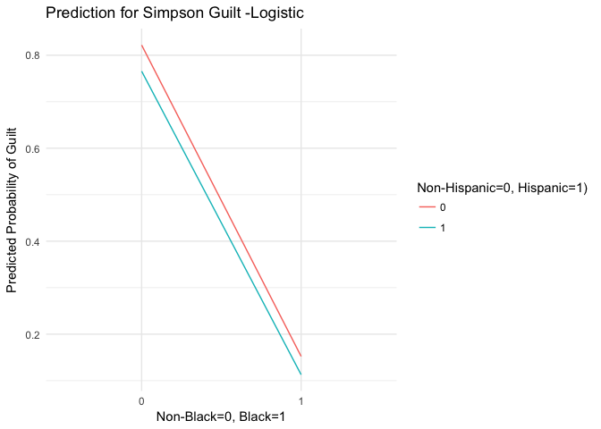

``` r
# < Model2: Single Tree >
set.seed(1234)

TREE.DATA_3 = tree(guilt ~ black + hispanic, data = SPLIT.DATA_3$train)

# < Graph >
DENDRO.DATA_3 = dendro_data(TREE.DATA_3)

ggplot(segment(DENDRO.DATA_3)) +
  geom_segment(mapping=aes(x=x, y=y, xend=xend, yend=yend), alpha = 0.5) +
  geom_text(data=label(DENDRO.DATA_3), mapping=aes(x=x, y=y, label=label_full), vjust=-0.5, size=3) +
  geom_text(data=leaf_label(DENDRO.DATA_3), mapping=aes(x=x, y=y, label=label), vjust=0.5, size=3) +
  theme_dendro() +
  labs(title = "Decision Tree for Simpson Guilt")
```


``` r
# < ROC >
PRED.DATA_3 = predict(TREE.DATA_3, as_tibble(SPLIT.DATA_3$test), type="class")

ROC.DATA_3 = roc(as.numeric(as_tibble(SPLIT.DATA_3$test)$guilt), as.numeric(PRED.DATA_3))

plot(ROC.DATA_3)
```


``` r
auc(ROC.DATA_3)
```

    ## Area under the curve: 0.704

``` r
# < Accuracy >
ACC.DATA_3 = mean(PROB.DATA_3$guilt == predict(TREE.DATA_3, newdata=SPLIT.DATA_3$test, type="class"), na.rm=TRUE)
ACC.DATA_3
```

    ## [1] 0.796

``` r
# < PRE >
R = na.omit(as.numeric(as_tibble(SPLIT.DATA_3$test)$guilt))
E1 = mean(as.numeric(R != median(R)))
E2 = 1 - ACC.DATA_3
PRE = (E1 - E2) / E1
PRE
```

    ## [1] 0.351

``` r
# < Model3: Random Forest >
set.seed(1234)

RF.DATA_3 = randomForest(guilt ~ black + hispanic, data=na.omit(as_tibble(SPLIT.DATA_3$train)), ntree = 500)
RF.DATA_3
```

    ## 
    ## Call:
    ##  randomForest(formula = guilt ~ black + hispanic, data = na.omit(as_tibble(SPLIT.DATA_3$train)),      ntree = 500) 
    ##                Type of random forest: classification
    ##                      Number of trees: 500
    ## No. of variables tried at each split: 1
    ## 
    ##         OOB estimate of  error rate: 17.6%
    ## Confusion matrix:
    ##     0   1 class.error
    ## 0 164 147      0.4727
    ## 1  29 660      0.0421

``` r
data_frame(VAR = rownames(importance(RF.DATA_3)),
           RSS = importance(RF.DATA_3)[,1]) %>%
  mutate(VAR = fct_reorder(VAR, RSS, fun=median)) %>%
  ggplot(aes(VAR, RSS)) +
  geom_point() +
  coord_flip() +
  labs(title = "Prediction for Simpson Guilt -Random Forest",
       x = NULL,
       y = "Average RSS Decrease")
```

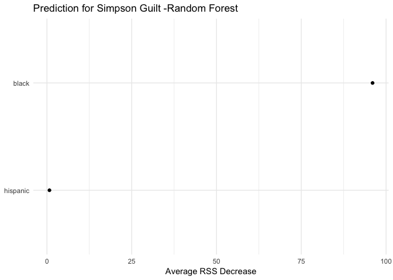

``` r
# < ROC >
PRED.DATA_3.B = predict(RF.DATA_3, na.omit(as_tibble(SPLIT.DATA_3$test)), type="prob")[,2]

ROC.DATA_3.B = roc(na.omit(as_tibble(SPLIT.DATA_3$test))$guilt, PRED.DATA_3.B)

plot(ROC.DATA_3.B)
```

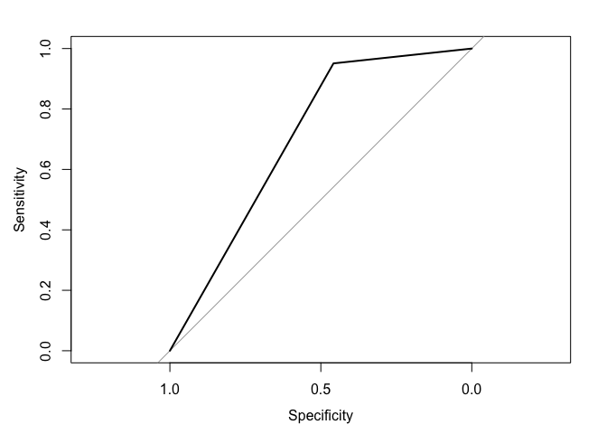

``` r
auc(ROC.DATA_3.B)
```

    ## Area under the curve: 0.704

``` r
# < PRE >
R = na.omit(as.numeric(as_tibble(SPLIT.DATA_3$test)$guilt))
E1 = mean(as.numeric(R != median(R)))
E2 = 0.176    #OOB estimate of  error rate: 17.6%
PRE = (E1 - E2) / E1
PRE
```

    ## [1] 0.441

Model1: Logistic The logistic model has the AUC of 0.704, and the PRE of 0.351. `guilt` = 1.528 + (-3.245) x `black1` + (-0.345) x `hispanic1`. All the relationships are statistically significant.

Model2: Single Tree The single tree model has the AUC of 0.704, and the PRE of 0.351. Only `black1` is used in the single tree model.

Model3: Random Forest The random forest model has the test error rate of 17.6%, the AUC of 0.704, and the PRE of 0.441. `black1` is an important variable in predicting the `Guilt`, since `black1` has higher average RSS decrease than `hispanic1`.

Therefore, the best model is the random forest model, since it has the best preciction for the `Guilt`.

#### 2.How can you predict whether individuals believe OJ Simpson to be guilty of these murders? Develop a robust statistical learning model to predict whether individuals believe OJ Simpson to be either probably guilty or probably not guilty and demonstrate the effectiveness of this model using methods we have discussed in class.

``` r
# < Model1: Linear Kernel >

DATA_3 = DATA_3 %>%
  mutate_each(funs(as.factor(.)), guilt, dem, rep, ind, female, black, hispanic, educ, income)

SPLIT.DATA_3 = resample_partition(na.omit(DATA_3), c(train=0.7, test=0.3))

set.seed(1234)

TUNE.DATA_3 = tune(svm, guilt ~ dem + rep + age + educ + female + black + hispanic + income,
                   data = na.omit(as_tibble(SPLIT.DATA_3$train)),
                   kernel = "linear",
                   range = list(cost = c(0.001, 0.01, 0.1, 1, 5, 10, 100)))
summary(TUNE.DATA_3)
```

    ## 
    ## Parameter tuning of 'svm':
    ## 
    ## - sampling method: 10-fold cross validation 
    ## 
    ## - best parameters:
    ##  cost
    ##  0.01
    ## 
    ## - best performance: 0.172 
    ## 
    ## - Detailed performance results:
    ##    cost error dispersion
    ## 1 1e-03 0.301     0.0544
    ## 2 1e-02 0.172     0.0462
    ## 3 1e-01 0.172     0.0462
    ## 4 1e+00 0.172     0.0462
    ## 5 5e+00 0.172     0.0462
    ## 6 1e+01 0.172     0.0462
    ## 7 1e+02 0.172     0.0462

``` r
# < Best Model >
LIN.DATA_3 = TUNE.DATA_3$best.model
summary(LIN.DATA_3)
```

    ## 
    ## Call:
    ## best.tune(method = svm, train.x = guilt ~ dem + rep + age + educ + 
    ##     female + black + hispanic + income, data = na.omit(as_tibble(SPLIT.DATA_3$train)), 
    ##     ranges = list(cost = c(0.001, 0.01, 0.1, 1, 5, 10, 100)), 
    ##     kernel = "linear")
    ## 
    ## 
    ## Parameters:
    ##    SVM-Type:  C-classification 
    ##  SVM-Kernel:  linear 
    ##        cost:  0.01 
    ##       gamma:  0.0625 
    ## 
    ## Number of Support Vectors:  619
    ## 
    ##  ( 321 298 )
    ## 
    ## 
    ## Number of Classes:  2 
    ## 
    ## Levels: 
    ##  0 1

``` r
# < ROC >
PRED.LIN = predict(LIN.DATA_3, as_tibble(SPLIT.DATA_3$test), decision.values=TRUE) %>%
  attributes

ROC.LIN = roc(as_tibble(SPLIT.DATA_3$test)$guilt, PRED.LIN$decision.values)

plot(ROC.LIN)
```

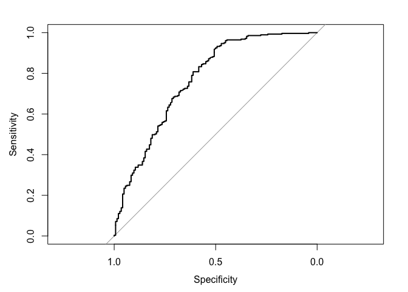

``` r
auc(ROC.LIN)
```

    ## Area under the curve: 0.768

``` r
# < PRE >
R = na.omit(as.numeric(as_tibble(SPLIT.DATA_3$test)$guilt))
E1 = mean(as.numeric(R != median(R)))
E2 = 0.187     #best performance: 0.187 
PRE = (E1 - E2) / E1
PRE
```

    ## [1] 0.448

``` r
# < Model2: Polynomial Kernel >
set.seed(1234)

TUNE.DATA_3.A = tune(svm, guilt ~ dem + rep + age + educ + female + black + hispanic + income,
                     data = na.omit(as_tibble(SPLIT.DATA_3$train)),
                     kernel = "polynomial",
                     range = list(cost = c(0.001, 0.01, 0.1, 1, 5, 10, 100), degree = c(3, 4, 5)))
summary(TUNE.DATA_3.A)
```

    ## 
    ## Parameter tuning of 'svm':
    ## 
    ## - sampling method: 10-fold cross validation 
    ## 
    ## - best parameters:
    ##  cost degree
    ##    10      3
    ## 
    ## - best performance: 0.177 
    ## 
    ## - Detailed performance results:
    ##     cost degree error dispersion
    ## 1  1e-03      3 0.301     0.0544
    ## 2  1e-02      3 0.301     0.0544
    ## 3  1e-01      3 0.301     0.0544
    ## 4  1e+00      3 0.301     0.0544
    ## 5  5e+00      3 0.189     0.0513
    ## 6  1e+01      3 0.177     0.0477
    ## 7  1e+02      3 0.181     0.0538
    ## 8  1e-03      4 0.301     0.0544
    ## 9  1e-02      4 0.301     0.0544
    ## 10 1e-01      4 0.301     0.0544
    ## 11 1e+00      4 0.301     0.0544
    ## 12 5e+00      4 0.277     0.0590
    ## 13 1e+01      4 0.222     0.0623
    ## 14 1e+02      4 0.185     0.0529
    ## 15 1e-03      5 0.301     0.0544
    ## 16 1e-02      5 0.301     0.0544
    ## 17 1e-01      5 0.301     0.0544
    ## 18 1e+00      5 0.301     0.0544
    ## 19 5e+00      5 0.301     0.0544
    ## 20 1e+01      5 0.294     0.0545
    ## 21 1e+02      5 0.207     0.0615

``` r
# < Best Model >
POLY.DATA_3 = TUNE.DATA_3.A$best.model
summary(POLY.DATA_3)
```

    ## 
    ## Call:
    ## best.tune(method = svm, train.x = guilt ~ dem + rep + age + educ + 
    ##     female + black + hispanic + income, data = na.omit(as_tibble(SPLIT.DATA_3$train)), 
    ##     ranges = list(cost = c(0.001, 0.01, 0.1, 1, 5, 10, 100), 
    ##         degree = c(3, 4, 5)), kernel = "polynomial")
    ## 
    ## 
    ## Parameters:
    ##    SVM-Type:  C-classification 
    ##  SVM-Kernel:  polynomial 
    ##        cost:  10 
    ##      degree:  3 
    ##       gamma:  0.0625 
    ##      coef.0:  0 
    ## 
    ## Number of Support Vectors:  526
    ## 
    ##  ( 288 238 )
    ## 
    ## 
    ## Number of Classes:  2 
    ## 
    ## Levels: 
    ##  0 1

``` r
# < ROC >
PRED.POLY = predict(POLY.DATA_3, as_tibble(SPLIT.DATA_3$test), decision.values=TRUE) %>%
  attributes

ROC.POLY = roc(as_tibble(SPLIT.DATA_3$test)$guilt, PRED.POLY$decision.values)

plot(ROC.POLY)
```

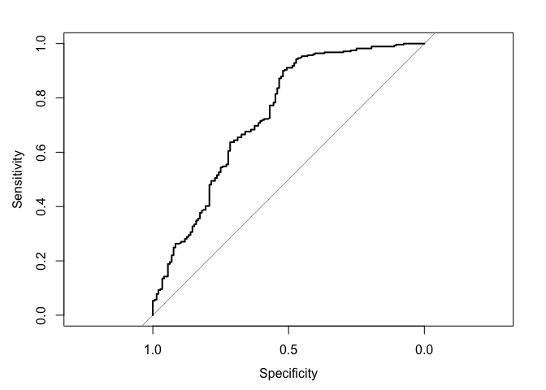

``` r
auc(ROC.POLY)
```

    ## Area under the curve: 0.738

``` r
# < PRE >
R = na.omit(as.numeric(as_tibble(SPLIT.DATA_3$test)$guilt))
E1 = mean(as.numeric(R != median(R)))
E2 = 0.194     #best performance: 0.194
PRE = (E1 - E2) / E1
PRE
```

    ## [1] 0.427

``` r
# < Model3: Radial Kernel >
set.seed(1234)

TUNE.DATA_3.B = tune(svm, guilt ~ dem + rep + age + educ + female + black + hispanic + income,
                     data = na.omit(as_tibble(SPLIT.DATA_3$train)),
                     kernel = "radial",
                     range = list(cost = c(0.001, 0.01, 0.1, 1, 5, 10, 100)))
summary(TUNE.DATA_3.B)
```

    ## 
    ## Parameter tuning of 'svm':
    ## 
    ## - sampling method: 10-fold cross validation 
    ## 
    ## - best parameters:
    ##  cost
    ##     1
    ## 
    ## - best performance: 0.172 
    ## 
    ## - Detailed performance results:
    ##    cost error dispersion
    ## 1 1e-03 0.301     0.0544
    ## 2 1e-02 0.301     0.0544
    ## 3 1e-01 0.229     0.0508
    ## 4 1e+00 0.172     0.0462
    ## 5 5e+00 0.172     0.0462
    ## 6 1e+01 0.172     0.0462
    ## 7 1e+02 0.187     0.0453

``` r
# < Best Model >
RAD.DATA_3 = TUNE.DATA_3.B$best.model
summary(RAD.DATA_3)
```

    ## 
    ## Call:
    ## best.tune(method = svm, train.x = guilt ~ dem + rep + age + educ + 
    ##     female + black + hispanic + income, data = na.omit(as_tibble(SPLIT.DATA_3$train)), 
    ##     ranges = list(cost = c(0.001, 0.01, 0.1, 1, 5, 10, 100)), 
    ##     kernel = "radial")
    ## 
    ## 
    ## Parameters:
    ##    SVM-Type:  C-classification 
    ##  SVM-Kernel:  radial 
    ##        cost:  1 
    ##       gamma:  0.0625 
    ## 
    ## Number of Support Vectors:  457
    ## 
    ##  ( 249 208 )
    ## 
    ## 
    ## Number of Classes:  2 
    ## 
    ## Levels: 
    ##  0 1

``` r
# < ROC >
PRE.DATA_3.B = predict(RAD.DATA_3, as_tibble(SPLIT.DATA_3$test), decision.values=TRUE) %>%
  attributes

ROC.RAD = roc(as_tibble(SPLIT.DATA_3$test)$guilt, PRE.DATA_3.B$decision.values)

plot(ROC.RAD)
```

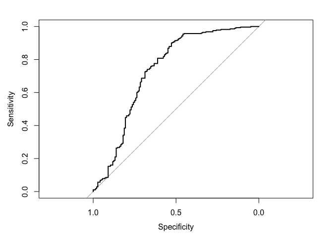

``` r
auc(ROC.RAD)
```

    ## Area under the curve: 0.736

``` r
# < PRE >
R = na.omit(as.numeric(as_tibble(SPLIT.DATA_3$test)$guilt))
E1 = mean(as.numeric(R != median(R)))
E2 = 0.187     #best performance: 0.187
PRE = (E1 - E2) / E1
PRE
```

    ## [1] 0.448

``` r
# < Model4: Random Forest >
set.seed(1234)

TUNE.DATA_3.C = randomForest(guilt ~ dem + rep + age + educ + female + black + hispanic + income,
                             data = na.omit(as_tibble(SPLIT.DATA_3$train)))
TUNE.DATA_3.C
```

    ## 
    ## Call:
    ##  randomForest(formula = guilt ~ dem + rep + age + educ + female +      black + hispanic + income, data = na.omit(as_tibble(SPLIT.DATA_3$train))) 
    ##                Type of random forest: classification
    ##                      Number of trees: 500
    ## No. of variables tried at each split: 2
    ## 
    ##         OOB estimate of  error rate: 17.4%
    ## Confusion matrix:
    ##     0   1 class.error
    ## 0 161 137      0.4597
    ## 1  35 658      0.0505

``` r
# < Graph >
varImpPlot(TUNE.DATA_3.C)
```

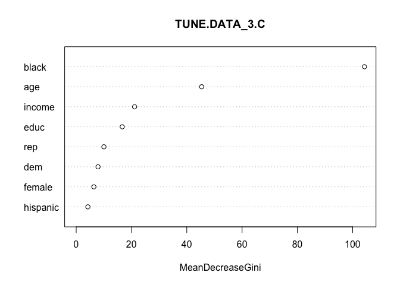

``` r
# < ROC >
PRE.DATA_3.C = predict(TUNE.DATA_3.C, na.omit(as_tibble(SPLIT.DATA_3$test)), type="prob")[,2]

ROC.RF = roc(na.omit(as_tibble(SPLIT.DATA_3$test))$guilt, PRE.DATA_3.C)

plot(ROC.RF)
```

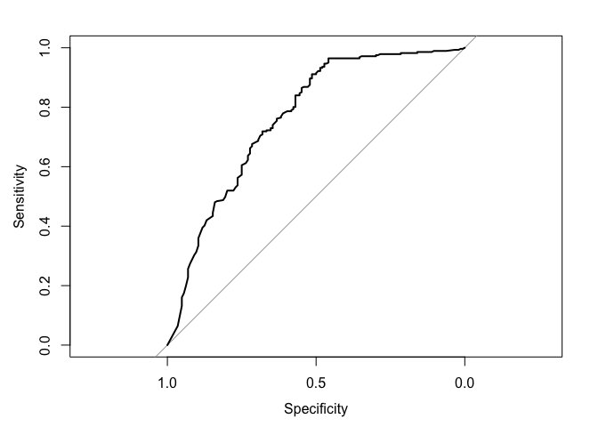

``` r
auc(ROC.RF)
```

    ## Area under the curve: 0.764

``` r
# < PRE >
R = na.omit(as.numeric(as_tibble(SPLIT.DATA_3$test)$guilt))
E1 = mean(as.numeric(R != median(R)))
E2 = 0.191     #best performance: 0.191
PRE = (E1 - E2) / E1
PRE
```

    ## [1] 0.436

Model1: Linear Kernel The linear kernel has the best cost level at 0.01. The error rate is 18.7%, AUC is 0.797 and the PRE is 43.5%.

Model2: Polynomial Kernel The polynomial kernel has the best cost level at 100 and degree level at 3. The error rate is 19.4%, AUC is 0.752 and the PRE is 38.5%.

Model3: Radial Kernel The radial kernel has the best cost level at 1. The error rate is 18.7%, AUC is 0.773 and the PRE is 40.7%.

Model4: Random Forest The random forest has `black1` and `age` as important variables. The error rate is 19.1%, AUC is 0.797 and the PRE is 39.4%.

Therefore, the best model is the linear kernel model, since it has the highset AUC (0.797).
