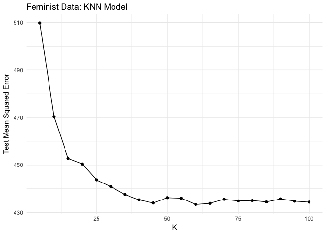
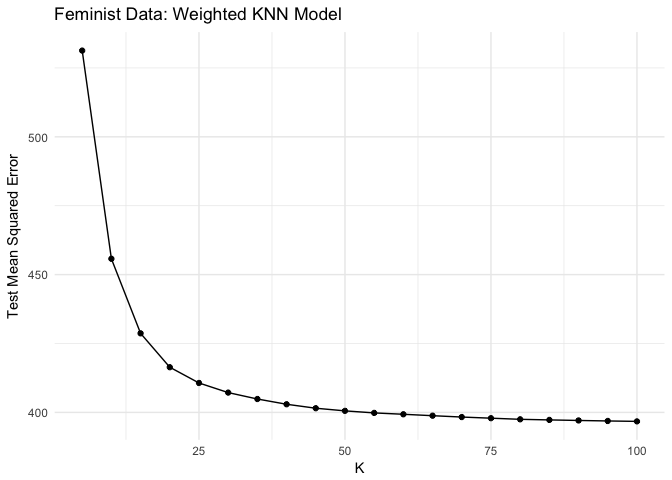
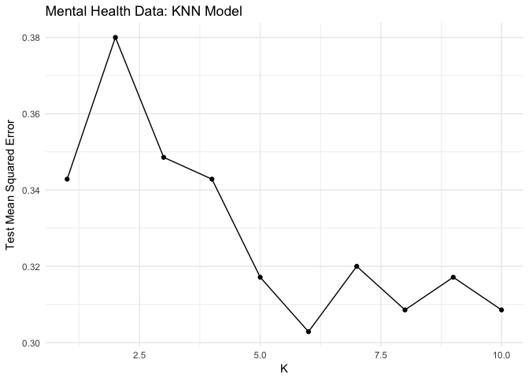
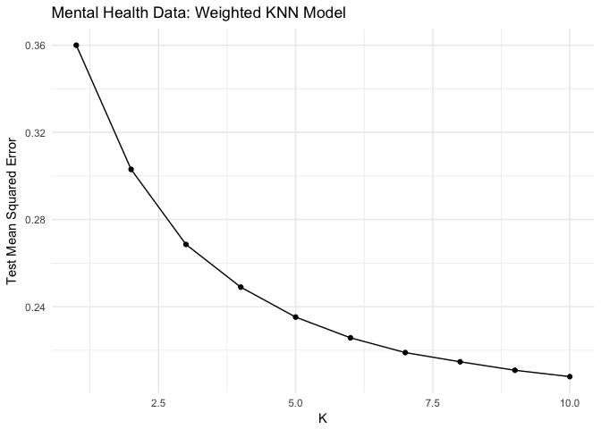
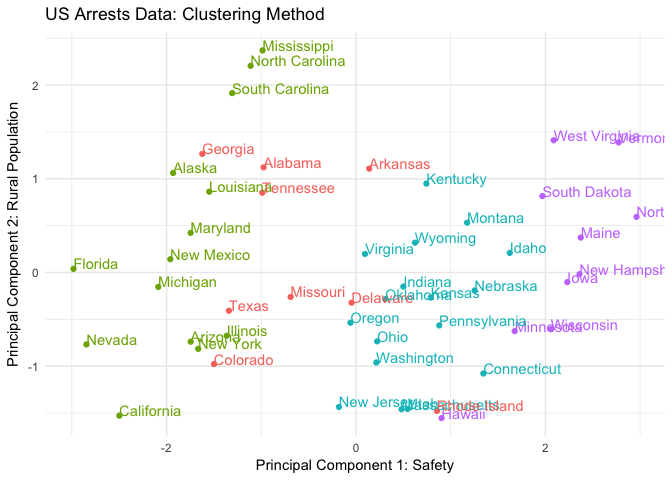
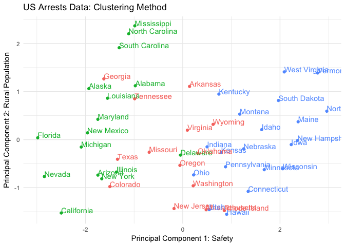
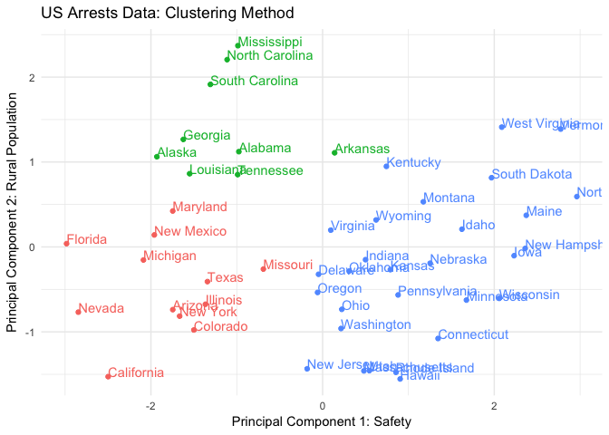
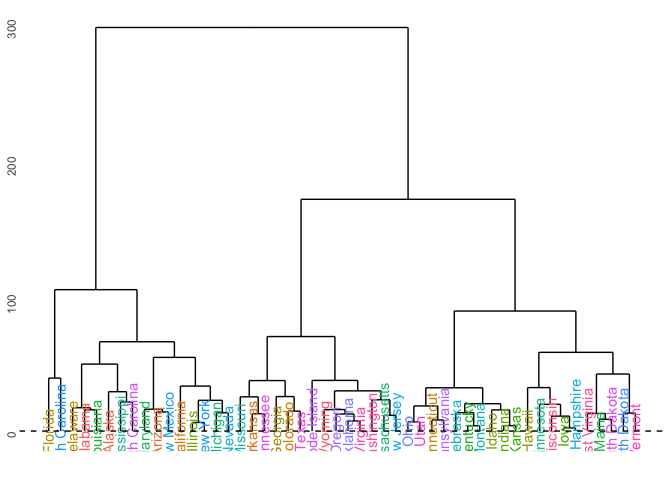
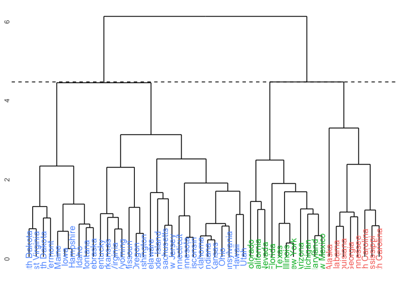

Perspectives on Computational Modeling PS9
================
HyungJin Cho
March 13, 2017

Part 1: Attitudes towards feminists
===================================

#### 1.Split the data into a training and test set (70/30%).

``` r
set.seed(1234)    #Reproducibility

SPLIT.DF_FEM = resample_partition(DF_FEM, c(train=0.7, test=0.3))
DF_FEM_TRAIN = as_tibble(SPLIT.DF_FEM$train)
DF_FEM_TEST = as_tibble(SPLIT.DF_FEM$test)
```

#### 2.Calculate the test MSE for KNN models with K=5,10,15,…,100, using whatever combination of variables you see fit. Which model produces the lowest test MSE?

``` r
set.seed(1234)    #Reproducibility

# < KNN Model >
DF_FEM_KNN = data_frame(k = seq(5, 100, by = 5),
                        knn = map(k, ~ knn.reg(select(DF_FEM_TRAIN, -feminist),
                                               y = DF_FEM_TRAIN$feminist,
                                               test = select(DF_FEM_TEST, -feminist),
                                               k = .)),
                        mse = map_dbl(knn, ~ mean((DF_FEM_TEST$feminist - .$pred)^2)))
DF_FEM_KNN
```

    ## # A tibble: 20 × 3
    ##        k          knn   mse
    ##    <dbl>       <list> <dbl>
    ## 1      5 <S3: knnReg>   510
    ## 2     10 <S3: knnReg>   470
    ## 3     15 <S3: knnReg>   453
    ## 4     20 <S3: knnReg>   450
    ## 5     25 <S3: knnReg>   444
    ## 6     30 <S3: knnReg>   441
    ## 7     35 <S3: knnReg>   437
    ## 8     40 <S3: knnReg>   435
    ## 9     45 <S3: knnReg>   434
    ## 10    50 <S3: knnReg>   436
    ## 11    55 <S3: knnReg>   436
    ## 12    60 <S3: knnReg>   433
    ## 13    65 <S3: knnReg>   434
    ## 14    70 <S3: knnReg>   436
    ## 15    75 <S3: knnReg>   435
    ## 16    80 <S3: knnReg>   435
    ## 17    85 <S3: knnReg>   434
    ## 18    90 <S3: knnReg>   436
    ## 19    95 <S3: knnReg>   435
    ## 20   100 <S3: knnReg>   434

``` r
# < Graph >
ggplot(data=DF_FEM_KNN, mapping=aes(k, mse)) +
  geom_line() +
  geom_point() + 
  labs(title = "Feminist Data: KNN Model",
       x = "K",
       y = "Test Mean Squared Error")
```



The KNN model with K=60 produces the lowest test MSE of 433.

#### 3.Calculate the test MSE for weighted KNN models with K=5,10,15,…,100 using the same combination of variables as before. Which model produces the lowest test MSE?

``` r
set.seed(1234)    #Reproducibility

# < wKNN Model >
DF_FEM_WKNN = data_frame(k = seq(5, 100, by = 5),
                         knn = map(k, ~ kknn(feminist ~ .,
                                             train = DF_FEM_TRAIN,
                                             test = DF_FEM_TEST, k = .)),
                         mse = map_dbl(knn, ~ mean((DF_FEM_TEST$feminist - .$fitted.values)^2)))
DF_FEM_WKNN
```

    ## # A tibble: 20 × 3
    ##        k        knn   mse
    ##    <dbl>     <list> <dbl>
    ## 1      5 <S3: kknn>   531
    ## 2     10 <S3: kknn>   456
    ## 3     15 <S3: kknn>   429
    ## 4     20 <S3: kknn>   416
    ## 5     25 <S3: kknn>   411
    ## 6     30 <S3: kknn>   407
    ## 7     35 <S3: kknn>   405
    ## 8     40 <S3: kknn>   403
    ## 9     45 <S3: kknn>   402
    ## 10    50 <S3: kknn>   401
    ## 11    55 <S3: kknn>   400
    ## 12    60 <S3: kknn>   399
    ## 13    65 <S3: kknn>   399
    ## 14    70 <S3: kknn>   398
    ## 15    75 <S3: kknn>   398
    ## 16    80 <S3: kknn>   397
    ## 17    85 <S3: kknn>   397
    ## 18    90 <S3: kknn>   397
    ## 19    95 <S3: kknn>   397
    ## 20   100 <S3: kknn>   397

``` r
# < Graph >
ggplot(data=DF_FEM_WKNN, mapping=aes(k, mse)) +
  geom_line() +
  geom_point() + 
  labs(title = "Feminist Data: Weighted KNN Model",
       x = "K",
       y = "Test Mean Squared Error")
```



The KNN model with K=100 produces the lowest test MSE of 397.

#### 4.Compare the test error rate for the best KNN/wKNN model(s) to the test error rate for the equivalent logistic regression, decision tree, boosting, random forest, and SVM methods using the same combination of variables as before. Which performs the best? Why do you think this method performed the best, given your knowledge of how it works?

``` r
set.seed(1234)    #Reproducibility

# < Function >
FUNC_MSE = function(model, data){
  x = model - data
  mean(x^2, na.rm=TRUE)
}

# < Weighted KNN >
DF_FEM_WKNN_1 = DF_FEM_WKNN %>% 
  filter(k == 100)
MSE_WKNN = DF_FEM_WKNN_1$mse

# < Linear Regression >
DF_FEM_LM = lm(feminist ~ ., data = DF_FEM_TRAIN)
MSE_LM = FUNC_MSE(predict(DF_FEM_LM, DF_FEM_TEST), DF_FEM_TEST$feminist)

# < Decision Tree >
DF_FEM_TREE = tree(feminist ~ ., data = DF_FEM_TRAIN)
MSE_TREE = FUNC_MSE(predict(DF_FEM_TREE, DF_FEM_TEST), DF_FEM_TEST$feminist)

# < Random Forest >
DF_FEM_RF = randomForest(feminist ~ ., data = DF_FEM_TRAIN, ntree = 500)
MSE_RF = FUNC_MSE(predict(DF_FEM_RF, DF_FEM_TEST), DF_FEM_TEST$feminist)

# < Boosting >
DF_FEM_BOOST = gbm(DF_FEM_TRAIN$feminist ~ ., data=DF_FEM_TRAIN, n.trees = 500, interaction.depth = 2)
```

    ## Distribution not specified, assuming gaussian ...

``` r
MSE_BOOST = FUNC_MSE(predict(DF_FEM_BOOST, DF_FEM_TEST, n.trees=500), DF_FEM_TEST$feminist)

# < Test Error Rate >
METHOD = c("Weighted KNN", "Linear model", "Decision Tree", "Random Forests", "Boosting")
MSE = c(MSE_WKNN, MSE_LM, MSE_TREE, MSE_RF, MSE_BOOST)
kable(data.frame(METHOD, MSE))
```

| METHOD         |  MSE|
|:---------------|----:|
| Weighted KNN   |  397|
| Linear model   |  402|
| Decision Tree  |  409|
| Random Forests |  408|
| Boosting       |  418|

The results show that test MSE for *W**e**i**g**h**t**e**d**K**N**N* = 397 &lt; *L**i**n**e**a**r**R**e**g**r**e**s**s**i**o**n* = 402 &lt; *R**a**n**d**o**m**F**o**r**e**s**t**s* = 408 &lt; *D**e**c**i**s**i**o**n**T**r**e**e* = 409 &lt; *B**o**o**s**t**i**n**g* = 418. Among all methods, the weighted KNN had the lowest test MSE. This implies that using the near data points leads to a good prediction of the attitude towards feminists. The second best model turnout to be Linear model. This suggests that there is a linear relationship which minimizes test MSE.

Part 2: Voter turnout and depression
====================================

#### 1.Split the data into a training and test set (70/30).

``` r
set.seed(1234)    #Reproducibility

SPLIT.DF_MH = resample_partition(DF_MH, c(train=0.7, test=0.3))
DF_MH_TRAIN = as_tibble(SPLIT.DF_MH$train)
DF_MH_TEST = as_tibble(SPLIT.DF_MH$test)
```

#### 2.Calculate the test error rate for KNN models with K=1,2,…,10, using whatever combination of variables you see fit. Which model produces the lowest test MSE?

``` r
set.seed(1234)    #Reproducibility

# < KNN Model >
DF_MH_KNN = data_frame(k = 1:10,
                       knn = map(k, ~ class::knn(select(DF_MH_TRAIN, -vote96),
                                                 test = select(DF_MH_TEST, -vote96),
                                                 cl = DF_MH_TRAIN$vote96,
                                                 k = .)),
                       mse = map_dbl(knn, ~ mean(DF_MH_TEST$vote96 != .)))
DF_MH_KNN
```

    ## # A tibble: 10 × 3
    ##        k          knn   mse
    ##    <int>       <list> <dbl>
    ## 1      1 <fctr [350]> 0.343
    ## 2      2 <fctr [350]> 0.380
    ## 3      3 <fctr [350]> 0.349
    ## 4      4 <fctr [350]> 0.343
    ## 5      5 <fctr [350]> 0.317
    ## 6      6 <fctr [350]> 0.303
    ## 7      7 <fctr [350]> 0.320
    ## 8      8 <fctr [350]> 0.309
    ## 9      9 <fctr [350]> 0.317
    ## 10    10 <fctr [350]> 0.309

``` r
# < Graph >
ggplot(data=DF_MH_KNN, mapping=aes(k, mse)) +
  geom_line() +
  geom_point() + 
  labs(title = "Mental Health Data: KNN Model",
       x = "K",
       y = "Test Mean Squared Error")
```



The KNN model with K=6 produces the lowest test MSE of 0.303.

#### 3.Calculate the test error rate for weighted KNN models with K=1,2,…,10 using the same combination of variables as before. Which model produces the lowest test error rate?

``` r
set.seed(1234)    #Reproducibility

# < wKNN Model >
DF_MH_WKNN = data_frame(k = seq(1, 10, by = 1),
                        knn = map(k, ~ kknn(vote96 ~ .,
                                            train = DF_MH_TRAIN, test = DF_MH_TEST,
                                            k = .)),
                        mse = map_dbl(knn, ~ mean((DF_MH_TEST$vote96 - .$fitted.values)^2)))
DF_MH_WKNN
```

    ## # A tibble: 10 × 3
    ##        k        knn   mse
    ##    <dbl>     <list> <dbl>
    ## 1      1 <S3: kknn> 0.360
    ## 2      2 <S3: kknn> 0.303
    ## 3      3 <S3: kknn> 0.269
    ## 4      4 <S3: kknn> 0.249
    ## 5      5 <S3: kknn> 0.235
    ## 6      6 <S3: kknn> 0.226
    ## 7      7 <S3: kknn> 0.219
    ## 8      8 <S3: kknn> 0.215
    ## 9      9 <S3: kknn> 0.211
    ## 10    10 <S3: kknn> 0.208

``` r
# < Graph >
ggplot(data=DF_MH_WKNN, mapping=aes(k, mse)) +
  geom_line() +
  geom_point() + 
  labs(title = "Mental Health Data: Weighted KNN Model",
       x = "K",
       y = "Test Mean Squared Error")
```



The KNN model with K=10 produces the lowest test MSE of 0.208.

#### 4.Compare the test error rate for the best KNN/wKNN model(s) to the test error rate for the equivalent logistic regression, decision tree, boosting, random forest, and SVM methods using the same combination of variables as before. Which performs the best? Why do you think this method performed the best, given your knowledge of how it works?

``` r
set.seed(1234)    #Reproducibility

# < Function >
FUNC_MSE = function(model, data){
  x = model - data
  mean(x^2, na.rm=TRUE)
}

# < Weighted KNN >
DF_MH_WKNN_1 = DF_MH_WKNN %>% 
  filter(k == 10)
MSE_WKNN = DF_MH_WKNN_1$mse

# < Logistic  Regression >
DF_MH_GLM = glm(vote96 ~ ., family = binomial, data = DF_MH_TRAIN)
DF_MH_LG = DF_MH_TEST %>%
  add_predictions(DF_MH_GLM) %>%
  mutate(prob = exp(pred) / (1 + exp(pred))) %>%
  mutate(pred_bi = as.numeric(prob > .5))
MSE_GLM = mean(DF_MH_TEST$vote96 != DF_MH_LG$pred_bi)
MSE_GLM
```

    ## [1] 0.291

``` r
# < Decision Tree >
DF_MH_TREE = tree(vote96 ~ ., data = DF_MH_TRAIN)
MSE_TREE = FUNC_MSE(predict(DF_MH_TREE, DF_MH_TRAIN), DF_MH_TEST$vote96)

# < Random Forest >
DF_MH_RF = randomForest(vote96 ~., data = DF_MH_TRAIN, ntree = 500)
MSE_RF = FUNC_MSE(predict(DF_MH_RF, DF_MH_TRAIN), DF_MH_TEST$vote96)

# < Boosting >
DF_MH_BOOST = gbm(DF_MH_TRAIN$vote96 ~ ., data=DF_MH_TRAIN, n.trees = 500, interaction.depth = 2)
```

    ## Distribution not specified, assuming bernoulli ...

``` r
MSE_BOOST = FUNC_MSE(predict(DF_MH_BOOST, DF_MH_TRAIN, n.trees=500), DF_MH_TEST$vote96)

# < Linear SVM >
DF_MH_LSVM = tune(svm, vote96 ~., data = DF_MH_TRAIN, kernel = "linear", 
                  range = list(cost = c(.001, 0.01, .1, 1, 5, 10, 100)))
DF_MH_LSVM_1 = DF_MH_LSVM$best.model
MSE_LSVM = FUNC_MSE(predict(DF_MH_LSVM_1, DF_MH_TEST, decision.values = TRUE), DF_MH_TEST$vote96)

# < Polynomial SVM >
DF_MH_PSVM = tune(svm, vote96 ~ ., data = DF_MH_TRAIN, kernel = "polynomial",
                  range = list(cost = c(.001, .01, .1, 1, 5, 10, 100)))
DF_MH_LSVM_1 = DF_MH_PSVM$best.model
MSE_PSVM = FUNC_MSE(predict(DF_MH_LSVM_1, DF_MH_TEST, decision.values = TRUE), DF_MH_TEST$vote96)

# < Test Error Rate >
METHOD = c("Weighted KNN", "Logistic  Regression", "Decision Tree", "Random Forests", "Boosting", "Linear SVM", "Polynomial SVM")
MSE = c(MSE_WKNN, MSE_GLM, MSE_TREE, MSE_RF, MSE_BOOST, MSE_LSVM, MSE_PSVM)
kable(data.frame(METHOD, MSE))
```

| METHOD              |    MSE|
|:--------------------|------:|
| Weighted KNN        |  0.208|
| Logistic Regression |  0.291|
| Decision Tree       |  0.270|
| Random Forests      |  0.284|
| Boosting            |  0.297|
| Linear SVM          |  0.273|
| Polynomial SVM      |  0.267|

The results show that test MSE for *W**e**i**g**h**t**e**d**K**N**N* = 0.208 &lt; *P**o**l**y**n**o**m**i**a**l**S**V**M* = 0.267 &lt; *D**e**c**i**s**i**o**n**T**r**e**e* = 0.270 &lt; *L**i**n**e**a**r**S**V**M* = 0.273 &lt; *R**a**n**d**o**m**F**o**r**e**s**t**s* = 0.284 &lt; *L**o**g**i**s**t**i**c**R**e**g**r**e**s**s**i**o**n* = 0.291 &lt; *B**o**o**s**t**i**n**g* = 0.297. Among all methods, the weighted KNN had the lowest test MSE. This implies that using the near data points leads to a good prediction of the attitude towards feminists. The second best model turnout to be Polynomial SVM. This suggests that predicition is improved withthe categorization boundary of the support vector machine.

Part 3: Colleges
================

#### 1.Perform PCA analysis on the college dataset and plot the first two principal components. Describe the results. What variables appear strongly correlated on the first principal component? What about the second principal component?

``` r
set.seed(1234)    #Reproducibility

PCA.DF_CL = prcomp(DF_CL, scale=TRUE)

PCA.DF_CL$rotation %>%
  kable()
```

|             |     PC1|     PC2|     PC3|     PC4|     PC5|     PC6|     PC7|     PC8|     PC9|    PC10|    PC11|    PC12|    PC13|    PC14|    PC15|    PC16|    PC17|    PC18|
|-------------|-------:|-------:|-------:|-------:|-------:|-------:|-------:|-------:|-------:|-------:|-------:|-------:|-------:|-------:|-------:|-------:|-------:|-------:|
| Private     |  -0.089|   0.346|  -0.151|  -0.231|   0.044|  -0.031|   0.178|  -0.032|   0.085|  -0.260|   0.680|  -0.246|   0.401|  -0.010|  -0.023|  -0.005|  -0.045|   0.008|
| Apps        |  -0.200|  -0.344|  -0.005|  -0.305|  -0.023|  -0.009|  -0.061|   0.099|  -0.084|  -0.058|  -0.010|  -0.042|   0.037|   0.595|  -0.081|   0.134|  -0.459|   0.363|
| Accept      |  -0.154|  -0.373|   0.025|  -0.317|   0.031|   0.013|  -0.015|   0.054|  -0.165|  -0.089|   0.143|  -0.005|  -0.074|   0.293|  -0.033|  -0.146|   0.512|  -0.547|
| Enroll      |  -0.118|  -0.400|   0.028|  -0.205|  -0.066|  -0.043|  -0.008|  -0.063|  -0.117|  -0.074|   0.106|   0.034|   0.059|  -0.446|   0.082|   0.028|   0.404|   0.607|
| Top10perc   |  -0.360|   0.016|  -0.005|   0.108|  -0.388|  -0.060|  -0.144|   0.097|   0.356|  -0.059|  -0.022|   0.015|   0.044|   0.000|   0.106|   0.697|   0.148|  -0.146|
| Top25perc   |  -0.345|  -0.018|   0.059|   0.146|  -0.410|   0.021|  -0.080|   0.078|   0.422|  -0.044|   0.138|   0.231|  -0.100|   0.024|  -0.149|  -0.617|  -0.050|   0.081|
| F.Undergrad |  -0.094|  -0.411|   0.017|  -0.143|  -0.047|  -0.046|   0.000|  -0.084|  -0.050|  -0.050|   0.078|   0.062|   0.070|  -0.525|   0.053|   0.010|  -0.570|  -0.409|
| P.Undergrad |   0.017|  -0.293|  -0.149|   0.098|   0.328|  -0.197|   0.163|  -0.570|   0.543|   0.229|   0.045|  -0.121|  -0.023|   0.126|  -0.020|   0.021|   0.051|   0.009|
| Outstate    |  -0.328|   0.192|  -0.066|  -0.129|   0.203|  -0.020|   0.095|   0.004|  -0.011|  -0.197|   0.064|  -0.255|  -0.804|  -0.128|   0.057|   0.042|  -0.079|   0.048|
| Room.Board  |  -0.267|   0.094|  -0.182|  -0.182|   0.526|   0.183|   0.145|   0.249|   0.244|  -0.190|  -0.281|   0.486|   0.201|  -0.072|   0.056|   0.004|   0.029|   0.000|
| Books       |  -0.057|  -0.057|  -0.662|   0.089|  -0.159|   0.648|  -0.141|  -0.225|  -0.133|   0.076|   0.020|  -0.037|  -0.025|   0.012|   0.068|  -0.009|  -0.002|   0.001|
| Personal    |   0.072|  -0.193|  -0.470|   0.291|  -0.188|  -0.347|   0.609|   0.301|  -0.122|  -0.117|  -0.047|   0.020|  -0.038|   0.040|  -0.027|  -0.003|   0.013|  -0.001|
| PhD         |  -0.303|  -0.116|   0.208|   0.465|   0.206|   0.072|   0.031|   0.071|  -0.163|   0.056|   0.171|  -0.091|   0.117|   0.125|   0.686|  -0.113|  -0.036|   0.015|
| Terminal    |  -0.304|  -0.104|   0.147|   0.460|   0.266|   0.138|   0.004|   0.005|  -0.233|   0.021|   0.178|   0.011|   0.054|  -0.059|  -0.675|   0.158|   0.020|   0.007|
| S.F.Ratio   |   0.210|  -0.204|   0.292|   0.075|  -0.052|   0.469|   0.276|   0.094|   0.285|  -0.448|  -0.216|  -0.425|   0.058|  -0.019|  -0.045|  -0.022|   0.015|  -0.001|
| perc.alumni |  -0.237|   0.194|   0.159|  -0.010|  -0.215|  -0.052|   0.286|  -0.640|  -0.291|  -0.346|  -0.260|   0.218|   0.092|   0.103|   0.027|  -0.008|   0.000|  -0.020|
| Expend      |  -0.333|   0.070|  -0.217|  -0.007|   0.057|  -0.284|  -0.280|   0.038|  -0.056|  -0.033|  -0.455|  -0.548|   0.299|  -0.099|  -0.081|  -0.229|   0.038|  -0.035|
| Grad.Rate   |  -0.273|   0.118|   0.173|  -0.268|  -0.141|   0.222|   0.502|   0.078|  -0.023|   0.660|  -0.103|  -0.156|   0.073|  -0.070|  -0.037|  -0.003|   0.007|  -0.014|

``` r
biplot(PCA.DF_CL, scale = 0, cex = 0.6)
```


PC1 has postive correlation with `S.F.Ratio` (coefficient = 0.210) and negative correlation with `Top10perc` (coefficient = -0.360), `Top25perc` (coefficient = -0.345), `Expend` (coefficient = -0.333), and `outstate` (coefficient = -0.328). This means as PC1 increases, *S**t**u**d**e**n**t*/*f**a**c**u**l**t**y**r**a**t**i**o* goes up and *P**e**r**c**e**n**t**o**f**n**e**w**s**t**u**d**e**n**t**s**f**r**o**m**t**o**p**t**i**e**r**o**f**H*.*S*.*c**l**a**s**s*, *I**n**s**t**r**u**c**t**i**o**n**a**l**e**x**p**e**n**d**i**t**u**r**e**p**e**r**s**t**u**d**e**n**t*, *O**u**t* − *o**f* − *s**t**a**t**e**t**u**i**t**i**o**n* goes down. Thus, PC1 could be interpreted as a negative educational evironment.

PC2 has postive correlation with `Private` (coefficient = 0.346) and negative correlation with `F.Undergrad` (coefficient = -0.411), `Enroll` (coefficient = -0.400), `Accept` (coefficient = -0.373). This means as PC2 increases, *p**r**i**v**a**t**e*/*p**u**b**l**i**c**u**n**i**v**e**r**s**i**t**y**r**a**t**i**o* goes up and *N**u**m**b**e**r**o**f**f**u**l**l**t**i**m**e**u**n**d**e**r**g**r**a**d**u**a**t**e**s*, *N**u**m**b**e**r**o**f**n**e**w**s**t**u**d**e**n**t**s**e**n**r**o**l**l**e**d*, *N**u**m**b**e**r**o**f**a**p**p**l**i**c**a**t**i**o**n**s**a**c**c**e**p**t**e**d* goes down. Thus, PC2 could be interpreted as a small size of educational institution.

The plot shows that most observations are located at PC1 &gt; 0 and PC2 &gt; 0. This indicates most institutions have relatively negative educational environment and are relatively small size of educational institution.

Part 4: Clustering states
=========================

#### 1.Perform PCA on the dataset and plot the observations on the first and second principal components.

``` r
set.seed(1234)    #Reproducibility

PCA.DF_AR = prcomp(select(DF_AR, -State), scale=TRUE)

PCA.DF_AR$rotation %>%
  kable()
```

|          |     PC1|     PC2|     PC3|     PC4|
|----------|-------:|-------:|-------:|-------:|
| Murder   |  -0.536|   0.418|  -0.341|   0.649|
| Assault  |  -0.583|   0.188|  -0.268|  -0.743|
| UrbanPop |  -0.278|  -0.873|  -0.378|   0.134|
| Rape     |  -0.543|  -0.167|   0.818|   0.089|

``` r
biplot(PCA.DF_AR, scale = 0, cex = 0.6)
```


PC1 has negative correlation with all four variables. PC1 can be interpreted as general safety. PC2 has strong negative correlation with `UrbanPop`. PC2 can be interpreted as urban population.

#### 2.Perform K-means clustering with K=2. Plot the observations on the first and second principal components and color-code each state based on their cluster membership. Describe your results.

``` r
set.seed(1234)    #Reproducibility

MEAN_2.DF_AR = kmeans(select(DF_AR, -State), centers=2, nstart=1)
MEAN_2.DF_AR
```

    ## K-means clustering with 2 clusters of sizes 29, 21
    ## 
    ## Cluster means:
    ##   Murder Assault UrbanPop Rape
    ## 1   4.84     110     64.0 16.2
    ## 2  11.86     255     67.6 28.1
    ## 
    ## Clustering vector:
    ##  [1] 2 2 2 2 2 2 1 2 2 2 1 1 2 1 1 1 1 2 1 2 1 2 1 2 1 1 1 2 1 1 2 2 2 1 1
    ## [36] 1 1 1 1 2 1 2 2 1 1 1 1 1 1 1
    ## 
    ## Within cluster sum of squares by cluster:
    ## [1] 54762 41637
    ##  (between_SS / total_SS =  72.9 %)
    ## 
    ## Available components:
    ## 
    ## [1] "cluster"      "centers"      "totss"        "withinss"    
    ## [5] "tot.withinss" "betweenss"    "size"         "iter"        
    ## [9] "ifault"

``` r
ggplot(mapping=aes(x=PCA.DF_AR$x[,1], y=PCA.DF_AR$x[,2],
                   label=DF_AR$State, color=factor(MEAN_2.DF_AR$cluster))) +
geom_point() +
geom_text(hjust=0, vjust=0) +
scale_color_discrete(guide=FALSE) +
labs(title = "US Arrests Data: Clustering Method",
     x = "Principal Component 1: Safety",
     y = "Principal Component 2: Rural Population")
```

 The plot visualizes 2 clusters based on the first principal component values. The plot shows the low PC1 value group (e.g. Florida, Nevada, California) and the hig PC1 value group (e.g. North Dakota, Vermont, New Hampshire). Therefore, states are mainly clustered by the high and low safety.

#### 3.Perform K-means clustering with K=4. Plot the observations on the first and second principal components and color-code each state based on their cluster membership. Describe your results.

``` r
set.seed(1234)    #Reproducibility

MEAN_4.DF_AR = kmeans(select(DF_AR, -State), centers=4, nstart=1)
MEAN_4.DF_AR
```

    ## K-means clustering with 4 clusters of sizes 9, 14, 17, 10
    ## 
    ## Cluster means:
    ##   Murder Assault UrbanPop Rape
    ## 1  10.17   202.2     68.2 23.3
    ## 2  12.14   277.6     68.8 29.8
    ## 3   5.79   129.6     68.3 18.8
    ## 4   2.95    62.7     53.9 11.5
    ## 
    ## Clustering vector:
    ##  [1] 1 2 2 1 2 1 3 1 2 1 4 3 2 3 4 3 3 2 4 2 3 2 4 2 1 3 3 2 4 3 2 2 2 4 3
    ## [36] 3 3 3 1 2 4 1 1 3 4 3 3 4 4 3
    ## 
    ## Within cluster sum of squares by cluster:
    ## [1]  6166 16272 10051  4548
    ##  (between_SS / total_SS =  89.6 %)
    ## 
    ## Available components:
    ## 
    ## [1] "cluster"      "centers"      "totss"        "withinss"    
    ## [5] "tot.withinss" "betweenss"    "size"         "iter"        
    ## [9] "ifault"

``` r
ggplot(mapping=aes(x=PCA.DF_AR$x[,1], y=PCA.DF_AR$x[,2],
                   label=DF_AR$State, color=factor(MEAN_4.DF_AR$cluster))) +
geom_point() +
geom_text(hjust=0, vjust=0) +
scale_color_discrete(guide=FALSE) +
labs(title = "US Arrests Data: Clustering Method",
     x = "Principal Component 1: Safety",
     y = "Principal Component 2: Rural Population")
```

 The plot visualizes 4 clusters based on the first principal component values. The plot shows the lowest PC1 value group, the second lowesest PC1 value group, the second highest PC1 value group, and the highest PC1 value group. Therefore, states are mainly clustered by the high and low safety.

#### 4.Perform K-means clustering with K=3. Plot the observations on the first and second principal components and color-code each state based on their cluster membership. Describe your results.

``` r
set.seed(1234)    #Reproducibility

MEAN_3.DF_AR = kmeans(select(DF_AR, -State), centers=3, nstart=1)
MEAN_3.DF_AR
```

    ## K-means clustering with 3 clusters of sizes 14, 16, 20
    ## 
    ## Cluster means:
    ##   Murder Assault UrbanPop Rape
    ## 1   8.21   173.3     70.6 22.8
    ## 2  11.81   272.6     68.3 28.4
    ## 3   4.27    87.5     59.8 14.4
    ## 
    ## Clustering vector:
    ##  [1] 2 2 2 1 2 1 3 2 2 1 3 3 2 3 3 3 3 2 3 2 1 2 3 2 1 3 3 2 3 1 2 2 2 3 3
    ## [36] 1 1 3 1 2 3 1 1 3 3 1 1 3 3 1
    ## 
    ## Within cluster sum of squares by cluster:
    ## [1]  9137 19564 19264
    ##  (between_SS / total_SS =  86.5 %)
    ## 
    ## Available components:
    ## 
    ## [1] "cluster"      "centers"      "totss"        "withinss"    
    ## [5] "tot.withinss" "betweenss"    "size"         "iter"        
    ## [9] "ifault"

``` r
ggplot(mapping=aes(x=PCA.DF_AR$x[,1], y=PCA.DF_AR$x[,2],
                   label=DF_AR$State, color=factor(MEAN_3.DF_AR$cluster))) +
geom_point() +
geom_text(hjust=0, vjust=0) +
scale_color_discrete(guide=FALSE) +
labs(title = "US Arrests Data: Clustering Method",
     x = "Principal Component 1: Safety",
     y = "Principal Component 2: Rural Population")
```



The plot visualizes 3 clusters based on the first principal component values. The plot shows the low PC1 value group, the middle PC1 value group, and the high PC1 value group. Therefore, states are mainly clustered by the high and low safety.

#### 5.Perform K-means clustering with K=3 on the first two principal components score vectors, rather than the raw data. Describe your results and compare them to the clustering results with K=3 based on the raw data.

``` r
set.seed(1234)    #Reproducibility

MEAN_3A.DF_AR = kmeans(PCA.DF_AR$x[,1:2], centers=3, nstart=1)
MEAN_3A.DF_AR
```

    ## K-means clustering with 3 clusters of sizes 12, 9, 29
    ## 
    ## Cluster means:
    ##     PC1    PC2
    ## 1 -1.87 -0.477
    ## 2 -1.15  1.418
    ## 3  1.13 -0.243
    ## 
    ## Clustering vector:
    ##  [1] 2 2 1 2 1 1 3 3 1 2 3 3 1 3 3 3 3 2 3 1 3 1 3 2 1 3 3 1 3 3 1 1 2 3 3
    ## [36] 3 3 3 3 2 3 2 1 3 3 3 3 3 3 3
    ## 
    ## Within cluster sum of squares by cluster:
    ## [1]  8.05  5.50 43.16
    ##  (between_SS / total_SS =  66.6 %)
    ## 
    ## Available components:
    ## 
    ## [1] "cluster"      "centers"      "totss"        "withinss"    
    ## [5] "tot.withinss" "betweenss"    "size"         "iter"        
    ## [9] "ifault"

``` r
ggplot(mapping=aes(x=PCA.DF_AR$x[,1], y=PCA.DF_AR$x[,2],
                   label=DF_AR$State, color=factor(MEAN_3A.DF_AR$cluster))) +
geom_point() +
geom_text(hjust=0, vjust=0) +
scale_color_discrete(guide=FALSE) +
labs(title = "US Arrests Data: Clustering Method",
     x = "Principal Component 1: Safety",
     y = "Principal Component 2: Rural Population")
```



The plot visualizes 3 clusters based on the first and second principal component values. The plot shows the group of low PC1 and low PC2 value , the group of low PC1 but high PC2 value, and the group of high PC1 value. Therefore, states are mainly clustered by the safety and rural population.

#### 6.Using hierarchical clustering with complete linkage and Euclidean distance, cluster the states.

``` r
set.seed(1234)    #Reproducibility

# < Hierarchical Clustering >
H = 0
HC.DF_AR = hclust(dist(select(DF_AR, -State)), method="complete")

# < Dendro Data >
DENDRO.DF_AR = dendro_data(HC.DF_AR)
HC.LABS = label(DENDRO.DF_AR) %>%
  left_join(data_frame(label = as.factor(seq.int(nrow(DF_AR))),
                       State = DF_AR$State,
                       cl = as.factor(cutree(HC.DF_AR, h=H))))

# < Graph >
ggdendrogram(HC.DF_AR) +
  geom_text(data=HC.LABS, mapping=aes(label=State, x=x, y=0, color=cl),
            vjust=.5, angle=90) +
  geom_hline(yintercept=H, linetype=2) +
  theme(axis.text.x=element_blank(),
        legend.position="none")
```



#### 7.Cut the dendrogram at a height that results in three distinct clusters. Which states belong to which clusters?

``` r
set.seed(1234)    #Reproducibility

# < Hierarchical Clustering >
H = 150
HC.DF_AR = hclust(dist(select(DF_AR, -State)), method="complete")

# < Dendro Data >
DENDRO.DF_AR = dendro_data(HC.DF_AR)
HC.LABS = label(DENDRO.DF_AR) %>%
  left_join(data_frame(label = as.factor(seq.int(nrow(DF_AR))),
                       State = DF_AR$State,
                       cl = as.factor(cutree(HC.DF_AR, h=H))))

# < Graph >
ggdendrogram(HC.DF_AR) +
  geom_text(data=HC.LABS, mapping=aes(label=State, x=x, y=0, color=cl),
            vjust=.5, angle=90) +
  geom_hline(yintercept=H, linetype=2) +
  theme(axis.text.x=element_blank(),
        legend.position="none")
```


Similar to k-mean clustering, dendrogram with cut-off of 150 groups 3 clusters.The hierarchical structure reveals that the green group and the blue group share more similarity than the red group.

#### 8.Hierarchically cluster the states using complete linkage and Euclidean distance, after scaling the variables to have standard deviation 1. What effect does scaling the variables have on the hierarchical clustering obtained? In your opinion, should the variables be scaled before the inter-observation dissimilarities are computed? Provide a justification for your answer.

``` r
set.seed(1234)    #Reproducibility

# < Hierarchical Clustering >
DF_AR_SCALE = scale(select(DF_AR, -State))

H = 4.42
HC.DF_AR = hclust(dist(DF_AR_SCALE), method="complete")

# < Dendro Data >
DENDRO.DF_AR = dendro_data(HC.DF_AR)
HC.LABS = label(DENDRO.DF_AR) %>%
  left_join(data_frame(label = as.factor(seq.int(nrow(DF_AR))),
                       State = DF_AR$State,
                       cl = as.factor(cutree(HC.DF_AR, h=H))))

# < Graph >
ggdendrogram(HC.DF_AR) +
  geom_text(data=HC.LABS, mapping=aes(label=State, x=x, y=0, color=cl),
            vjust=.5, angle=90) +
  geom_hline(yintercept=H, linetype=2) +
  theme(axis.text.x=element_blank(),
        legend.position="none")
```



To avoid over-weighting the variables with large scale and under-weighting the variables with small scale, stadardization of variables before calculating the distance in recommended. The scaling provides equal wightage by giving higher weights on the variables of `Murder`,`Rape` since they have small values. The scaling has the effect on the dendrogram by making four splits at the top. Therefore, in my opinion, the variables should be scaled before the inter-observation dissimilarities are computed.
