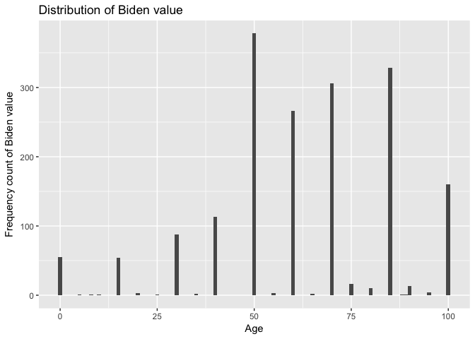
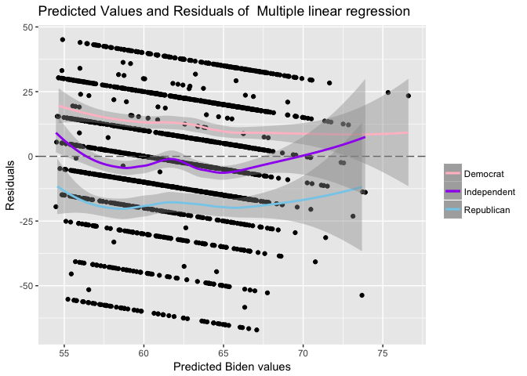
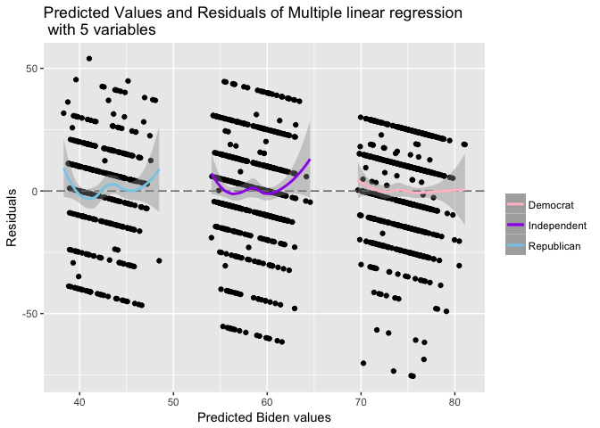

MACSS PS5  Alice Mee Seon Chung

-   [Problem 1. Describe the data](#problem-1.-describe-the-data)
-   [Problem 2. Simple linear
    regression](#problem-2.-simple-linear-regression)
-   [Problem 3. Multiple linear
    regression](#problem-3.-multiple-linear-regression)
-   [Problem 4. Multiple linear regression with more
    variables](#problem-4.-multiple-linear-regression-with-more-variables)
-   [Problem 5. Interactive linear
    regression model.](#problem-5.-interactive-linear-regression-model.)

1 Describe the data
-------------------

    ggplot(biden, mapping = aes(x = biden_2)) +
      geom_histogram(binwidth = 1) +
      labs(title = "Distribution of Biden value",
           x = "Age",
           y = "Frequency count of Biden value")

 As seen in
the histogram, at some certain points like 50, 60, 70, 85 bins have high
frequency level but at points like 55, 65, 75, 80, 90, 95 have low
frequency level or none. It means that the data is not continous. Since
the midpoint is 50, we can compare the distribution between under 50 and
over 50. The histogram shows that there are more frequencies over 50
than under 50. It means that people tend to warm feeling to Biden.

2 Simple linear regression
--------------------------

    # simple linear regression
    biden_lm <- lm(biden ~ age, data = biden)
    summary(biden_lm)

    ## 
    ## Call:
    ## lm(formula = biden ~ age, data = biden)
    ## 
    ## Residuals:
    ##     Min      1Q  Median      3Q     Max 
    ## -64.876 -12.318  -1.257  21.684  39.617 
    ## 
    ## Coefficients:
    ##             Estimate Std. Error t value Pr(>|t|)    
    ## (Intercept) 59.19736    1.64792   35.92   <2e-16 ***
    ## age          0.06241    0.03267    1.91   0.0563 .  
    ## ---
    ## Signif. codes:  0 '***' 0.001 '**' 0.01 '*' 0.05 '.' 0.1 ' ' 1
    ## 
    ## Residual standard error: 23.44 on 1805 degrees of freedom
    ## Multiple R-squared:  0.002018,   Adjusted R-squared:  0.001465 
    ## F-statistic: 3.649 on 1 and 1805 DF,  p-value: 0.05626

    grid <- biden %>% 
      data_grid(age) 

    # add predicted value 
    grid <- grid %>%
      add_predictions(biden_lm) 

*β*0 for intercept in the linear regression is 59.19736 and
standard error is 1.64792 and *β*1 for age is 0.06241 and
standard error is 0.03267.

1.  Since the coefficient of *β*1 for age which is 0.06241 is
    greater than 0, we can say that the predictor and the response have
    vert small positive relationship.

2.  In this model, the predictor is age and the response is biden warmth
    which indicates feeling thermometer. To see the relationship between
    the predictor and the response, we have to look at the coefficient
    of *β*1 for age and it is 0.06241. This figure can be
    interpreted as the average effect of biden warmth of a one unit
    increase in age. However, we can say that the coefficient of
    *β*1 for age is close to 0, so there is weak relationship
    between the predictor and the response.

3.  Since the the coefficient of *β*1 for age is 0.06241 and
    we know that it is the slope of the model. So, we can say that the
    slope is positive and the relationship between the predictor and the
    response is positive.

4.  In the summary of the model, multiple R-squared score is 0.002018.
    It means that age alone explains only approximately 0.2% of the
    variation in biden warmth. 0.2% is relatively small figure compared
    to 100%, so we can conclude that this model is bad model.

<!-- -->

    # use augment to generate predictions
    pred_aug <- augment(biden_lm, newdata = data_frame(age = c(45))) 

    # Calculate 95% confidence intervals
    (pred_ci <- mutate(pred_aug,
                       ymin = .fitted - .se.fit * 1.96,
                       ymax = .fitted + .se.fit * 1.96))

    ##   age .fitted   .se.fit     ymin     ymax
    ## 1  45 62.0056 0.5577123 60.91248 63.09872

1.  The predicted biden warmth value associated with an age of 45 with
    the model is 62.0056. It is simply apply 45 into the predictor value
    of the model. The assiciated 95% confidence intervals
    is \[60.91248,63.09872\]. Here, the upper bound is 63.09872 and the
    lower bound is 60.91248.

2.  

<!-- -->

    # plot the model 
    ggplot(biden, aes(x = age)) +
      geom_point(aes(y = biden_2)) +
      geom_line(aes(y = pred), data = grid, color = "red", size = 1)+
      labs(title = 'Plot of Biden warmth values and the linear regrssion model',
           y = 'Biden warmth value')

3 Multiple linear regression
----------------------------

    # multiple linear regression
    biden_age_gen_edu <- lm(biden_2 ~ age + gender + edu, data = biden)
    summary(biden_age_gen_edu)

    ## 
    ## Call:
    ## lm(formula = biden_2 ~ age + gender + edu, data = biden)
    ## 
    ## Residuals:
    ##     Min      1Q  Median      3Q     Max 
    ## -67.084 -14.662   0.703  18.847  45.105 
    ## 
    ## Coefficients:
    ##             Estimate Std. Error t value Pr(>|t|)    
    ## (Intercept) 68.62101    3.59600  19.083  < 2e-16 ***
    ## age          0.04188    0.03249   1.289    0.198    
    ## gender       6.19607    1.09670   5.650 1.86e-08 ***
    ## edu         -0.88871    0.22469  -3.955 7.94e-05 ***
    ## ---
    ## Signif. codes:  0 '***' 0.001 '**' 0.01 '*' 0.05 '.' 0.1 ' ' 1
    ## 
    ## Residual standard error: 23.16 on 1803 degrees of freedom
    ## Multiple R-squared:  0.02723,    Adjusted R-squared:  0.02561 
    ## F-statistic: 16.82 on 3 and 1803 DF,  p-value: 8.876e-11

*β*0 for intercept of the multiple linear regression is
68.62101 and standard error is 3.59600 and *β*1 for age is
0.04188 and standard error is 0.03249. *β*2 for gender is
6.19607 and standard error is 1.09670 and *β*3 for education
is -0.88871 and standard error is 0.22469.

1.  There is a statistically significant relationship between the
    predictor gender and the response biden value because its p-value is
    1.86e-08 which is very close to zero, so it means that it is
    statisticaly significant. The predictor education and the response
    biden warmth value has a statistically significant relationship
    because its p-value is 7.94e-05. It is also very close to zero so we
    can say it is statistically significant. However, we can not say
    that the predictor age and the response biden warmth value have a
    statistically significant relationship because its p-value is 0.198
    whichh is higher than significant level 0.05 so it is not
    statistically significnat.

2.  The parameters for female(gender) is *β*2 and the figure
    is 6.19607. *β*2 can be interpreted as the average effect
    of biden warmth of a one unit increase in gender(which means it is
    female), holding all other predictors constant. Since the parameter
    is positive value so it means that it has positive relationship with
    the response and it has relatively high coefficient value compared
    to the coefficient of other parameters, so we can say that among the
    predictors, gender has the strongest relationship with the response.

3.  In the summary of the model, multiple R-squared is 0.02723. It means
    that age, gender and education explains 2.723% of the variation in
    biden warmth. Age-only model explains 0.2% of the variation in biden
    warmth and this multiple linear regression model explains 2.723%, so
    we can say that this model expains better than age-only model.

4.  

<!-- -->

    ## `geom_smooth()` using method = 'loess'
    ## `geom_smooth()` using method = 'loess'
    ## `geom_smooth()` using method = 'loess'

 This
multiple linear regression model has a problem. If the model fits the
data well enough, the residuals scatter randomly around residuals = 0
line. When we consider the plot with the black residual points, we can
see that the large proportion of residual points do not disperse around
residuals = 0 line in the plot. By plotting additional three seperate
smooth fit lines for each party ID type(Democraric, Republican,
Independant), we can notice that Democrat's predicted biden warmth value
is higher than the predicted biden warmth value of multiple linear
regression model and Republican and Independent's predicted biden warmth
value is lower than the predicted biden warmth value of multiple linear
regression model. This implies that there is a relationship between the
party ID types and the biden warmth values. It can not be explained by
this multiple linear regression model since the model does not include
party ID types as the predictors.

4 Multiple linear regression model (with more variables)
--------------------------------------------------------

    biden_age_gen_edu_demo_rep <- lm(biden_2 ~ age + gender + edu +dem + rep, data = biden)
    summary(biden_age_gen_edu_demo_rep)

    ## 
    ## Call:
    ## lm(formula = biden_2 ~ age + gender + edu + dem + rep, data = biden)
    ## 
    ## Residuals:
    ##     Min      1Q  Median      3Q     Max 
    ## -75.546 -11.295   1.018  12.776  53.977 
    ## 
    ## Coefficients:
    ##              Estimate Std. Error t value Pr(>|t|)    
    ## (Intercept)  58.81126    3.12444  18.823  < 2e-16 ***
    ## age           0.04826    0.02825   1.708   0.0877 .  
    ## gender        4.10323    0.94823   4.327 1.59e-05 ***
    ## edu          -0.34533    0.19478  -1.773   0.0764 .  
    ## dem          15.42426    1.06803  14.442  < 2e-16 ***
    ## rep         -15.84951    1.31136 -12.086  < 2e-16 ***
    ## ---
    ## Signif. codes:  0 '***' 0.001 '**' 0.01 '*' 0.05 '.' 0.1 ' ' 1
    ## 
    ## Residual standard error: 19.91 on 1801 degrees of freedom
    ## Multiple R-squared:  0.2815, Adjusted R-squared:  0.2795 
    ## F-statistic: 141.1 on 5 and 1801 DF,  p-value: < 2.2e-16

*β*0 of intercept in the multiple linear regression is
58.81126 and standard error is 3.12444 and *β*1 for age is
0.04826 and standard error is 0.02825. *β*2 for gender is
4.10323 and standard error is 0.94823 and *β*3 for education
is -0.34533 and standard error is 0.19478. *β*4 for
Democratic is 15.42426 and standard error is 1.06803 and *β*5
for Republican is -15.84951 and standard error is 1.31136.

1.  The relationship between gender and biden warmth changed. The
    parameters for female(gender) is *β*2 and the figure was
    6.19607 in the age,gender,education model, but in the 5 variables
    model, *β*2 is 4.10323. It means that the average effect
    of biden warmth of a one unit increase in gender(which means it is
    female), holding all other predictors constant is decreased in this
    model when compared to the three-variables model. The coefficient of
    the parameter gender is still positive value and the p-value is
    1.59e-05 which is close to zero. So it means that it is
    statistically signigicant. We can say that gender has a positive
    relationship with the response.

2.  In the summary of the model, multiple R-squared is 0.2815. It means
    that age, gender, education, and party identification model explains
    28.15% of the variation in biden warmth. Age, gender, education
    model explains 2.723% of the variation in biden warmth and this age,
    gender, education, and party identification linear regression model
    explains 28.15% so we can say that this model is better than age,
    gender, education model.

3.  

<!-- -->

    dist3 <- biden %>%
      add_predictions(biden_age_gen_edu_demo_rep) %>%
      add_residuals(biden_age_gen_edu_demo_rep) 

    griddem_5 <- filter(dist3, dem == 1)
    gridrep_5 <- filter(dist3, rep == 1)
    gridinde_5 <- filter(dist3, dem == 0 & rep == 0)

    ggplot(dist3, aes(pred)) +
      geom_point(aes(y = resid)) +
      geom_hline(yintercept= 0, color = 'grey40',linetype = "longdash") +
      geom_smooth(aes(y = resid , color = 'Democrat'), 
                data = griddem_5, size = 1) +
      geom_smooth(aes(y = resid, color = 'Republican'), 
                data = gridrep_5, size = 1) +
      geom_smooth(aes(y = resid, color = 'Independent'), 
                data = gridinde_5, size = 1) +
      scale_colour_manual("", 
              values = c("Democrat"="pink","Republican"="skyblue",
                         "Independent"="purple")) +
      labs(title = "Predicted Values and Residuals of Multiple linear regression \n with 5 variables",
            x = "Predicted Biden values",
            y = "Residuals")

    ## `geom_smooth()` using method = 'loess'
    ## `geom_smooth()` using method = 'loess'
    ## `geom_smooth()` using method = 'loess'

By adding party ID type variables to the multiple linear regression
model, we fix the previous problem. Now we can see three smooth fit
lines of party ID types (Democraric, Republican, Independant) are close
to residual = 0 line, which means that this multiple linear regression
model explaines the relationships between each of three party ID types
and biden warmth values well. However, when we see the plot with the
black residual points, we still can see the large proportion of residual
points does not disperse around residuals = 0 line in the plot which
means that this model does not fit the data well.

5 Interactive linear regression model
-------------------------------------

    df <- read.csv('biden.csv', header=TRUE)
    df_lm4 <- df %>%
      filter(dem == 1 | rep == 1)
    lm_interactive <- lm(biden ~ female * dem, data = df_lm4)
    summary(lm_interactive)

    ## 
    ## Call:
    ## lm(formula = biden ~ female * dem, data = df_lm4)
    ## 
    ## Residuals:
    ##     Min      1Q  Median      3Q     Max 
    ## -75.519 -13.070   4.223  11.930  55.618 
    ## 
    ## Coefficients:
    ##             Estimate Std. Error t value Pr(>|t|)    
    ## (Intercept)   39.382      1.455  27.060  < 2e-16 ***
    ## female         6.395      2.018   3.169  0.00157 ** 
    ## dem           33.688      1.835  18.360  < 2e-16 ***
    ## female:dem    -3.946      2.472  -1.597  0.11065    
    ## ---
    ## Signif. codes:  0 '***' 0.001 '**' 0.01 '*' 0.05 '.' 0.1 ' ' 1
    ## 
    ## Residual standard error: 19.42 on 1147 degrees of freedom
    ## Multiple R-squared:  0.3756, Adjusted R-squared:  0.374 
    ## F-statistic:   230 on 3 and 1147 DF,  p-value: < 2.2e-16

*β*0 of intercept in the interactive linear regression is
39.382 and standard error is 1.455 and *β*1 for
gender(female) is 6.395 and standard error is 2.018. *β*2 for
Democrat is 33.688 and standard error is 1.835 and *β*3 for
gender \* Democrat is -3.946 and standard error is 2.472.

    df_lm4 %>%
       data_grid(female, dem) %>%
       augment(lm_interactive, newdata = .) %>%
       mutate(ymin = .fitted - .se.fit * 1.96,
              ymax = .fitted + .se.fit * 1.96) %>%
       mutate(female = ifelse(female == 0, 'Male', 'Female'),
             dem = ifelse(dem == 0, 'Republican', 'Democrats')) %>%
             {.} -> ci
    ci

    ##   female        dem  .fitted   .se.fit     ymin     ymax
    ## 1   Male Republican 39.38202 1.4553632 36.52951 42.23453
    ## 2   Male  Democrats 73.06954 1.1173209 70.87959 75.25949
    ## 3 Female Republican 45.77720 1.3976638 43.03778 48.51662
    ## 4 Female  Democrats 75.51883 0.8881114 73.77813 77.25953

For female Democrates, estimate predicted biden warmth feeling
thermometer ratings is 75.51883. The upper bound of 95% confidence
interval is 77.25953 and the lower bound is 73.77813. For female
Republicans, estimate predicted biden warmth feeling thermometer ratings
is 45.77720. The upper bound of 95% confidence interval is 48.51662 and
the lower bound is 43.03778. For male Democrats, estimate predicted
biden warmth feeling thermometer ratings is 73.06954. The upper bound of
95% confidence interval is 75.25949 and the lower bound is 70.87959. For
male Republicans, estimate predicted biden warmth feeling thermometer
ratings is 39.38202. The upper bound of 95% confidence interval is
42.23453 and the lower bound is 36.52951. The relationship between
between party ID and Biden warmth differs for males/ females. The
relationship between party ID types and biden warmth seems to be
stronger for male than female. The difference of biden warmth between
Democrats and Republicans is about 29.74683 for female. On the other
hands, for male, the difference of Biden warmth between Democrats and
Republicans is about 33.68752. The relationship between gender and biden
warmth differs for Democrats/Republicans. The Republican party seems to
have stronger relationship between gender and biden warmth than the
Democratic party. For Republican party, the difference between male and
female is approximately 6.3952. Whereas the difference between male and
female is approximately 2.4493 for democratic party.
