Part 1: Sexy Joe Biden
======================

    ## 
    ## Call:
    ## lm(formula = biden ~ ., data = df_biden)
    ## 
    ## Residuals:
    ##     Min      1Q  Median      3Q     Max 
    ## -75.546 -11.295   1.018  12.776  53.977 
    ## 
    ## Coefficients:
    ##              Estimate Std. Error t value Pr(>|t|)    
    ## (Intercept)  58.81126    3.12444  18.823  < 2e-16 ***
    ## female        4.10323    0.94823   4.327 1.59e-05 ***
    ## age           0.04826    0.02825   1.708   0.0877 .  
    ## educ         -0.34533    0.19478  -1.773   0.0764 .  
    ## dem          15.42426    1.06803  14.442  < 2e-16 ***
    ## rep         -15.84951    1.31136 -12.086  < 2e-16 ***
    ## ---
    ## Signif. codes:  0 '***' 0.001 '**' 0.01 '*' 0.05 '.' 0.1 ' ' 1
    ## 
    ## Residual standard error: 19.91 on 1801 degrees of freedom
    ## Multiple R-squared:  0.2815, Adjusted R-squared:  0.2795 
    ## F-statistic: 141.1 on 5 and 1801 DF,  p-value: < 2.2e-16

*β*0 of intercept in the multivariable linear regression is
58.81126 and standard error is 3.12444. *β*1 for female is
4.10323 and standard error is 0.94823. *β*2 for age is
0.04826 and standard error is 0.02825. *β*3 for education is
-0.34533 and standard error is 0.19478. *β*4 for Democratic
is 15.42426 and standard error is 1.06803. *β*5 for
Republican is -15.84951 and standard error is 1.31136.

    ## [1] 395.2702

1.  Using 5- factor linear regression model, the training MSE
    is 395.2702.

<!-- -->

    ## [1] 399.8303

1.  The value of MSE using test set observation with all predictors
    linear regression model is 395.2702. To compare to the training MSE
    from step 1, which is 399.8303, the value of MSE increases
    about 4.5601. This is because the model only fits to train data, so
    when it applies to other data set, the results could become worse.

<!-- -->

    ## [1] 401.6643

1.  The mean MSE of repeating the validaion set approach 100 times,
    using 100 different splits of the observation into training and
    validation set is 401.6643. It is 6.3941 higher than the MSE of
    whole data set and 1.834 higher than the MSE of one time validation
    set approach with test data set. Repeating 100 times of validation
    set approach will help to remove over-fitting or
    under-fitting error.

<!-- -->

    ## [1] 397.9555

1.  The mean MSE of the model using the leave-one-out cross-validation
    approach is 397.9555. It is lower than the MSE of repeating the
    validaion set approach 100 times. The LOOCV model is flexible method
    but the computation time is long because it is
    computationally difficult.

<!-- -->

    ## [1] 397.8837

1.  The mean MSE of the model using the 10-fold cross-validation
    approach is 397.8837. It is slightly lower than the MSE of the model
    using LOOCV. Compared with LOOCV model, it is only compute 10 times,
    so the flexibility decreases. However, the computation time is much
    shorter than LOOCV, so efficiency increases.

<!-- -->

    ## [1] 398.0712

1.  The mean MSE of repeating 10-fold cross-validation approach 100
    times is 398.0712. It is 2.0801 higher than the MSE of whole data
    set and 0.1875 higher than the MSE of test data set. From this
    result, 10-fold cross-validation approach has smaller differences
    when comparing to the validation set approach, that is, 10-fold
    cross-validation approach is steadier.

<!-- -->

    ## # A tibble: 6 × 3
    ##          term     est.boot    se.boot
    ##         <chr>        <dbl>      <dbl>
    ## 1 (Intercept)  58.96180746 2.94989029
    ## 2         age   0.04756082 0.02846997
    ## 3         dem  15.42942074 1.11104505
    ## 4        educ  -0.35119332 0.19201866
    ## 5      female   4.07552938 0.94880851
    ## 6         rep -15.88710208 1.43153427

    ## 
    ## Call:
    ## lm(formula = biden ~ ., data = df_biden)
    ## 
    ## Residuals:
    ##     Min      1Q  Median      3Q     Max 
    ## -75.546 -11.295   1.018  12.776  53.977 
    ## 
    ## Coefficients:
    ##              Estimate Std. Error t value Pr(>|t|)    
    ## (Intercept)  58.81126    3.12444  18.823  < 2e-16 ***
    ## female        4.10323    0.94823   4.327 1.59e-05 ***
    ## age           0.04826    0.02825   1.708   0.0877 .  
    ## educ         -0.34533    0.19478  -1.773   0.0764 .  
    ## dem          15.42426    1.06803  14.442  < 2e-16 ***
    ## rep         -15.84951    1.31136 -12.086  < 2e-16 ***
    ## ---
    ## Signif. codes:  0 '***' 0.001 '**' 0.01 '*' 0.05 '.' 0.1 ' ' 1
    ## 
    ## Residual standard error: 19.91 on 1801 degrees of freedom
    ## Multiple R-squared:  0.2815, Adjusted R-squared:  0.2795 
    ## F-statistic: 141.1 on 5 and 1801 DF,  p-value: < 2.2e-16

1.  Compared to the results from original model and bootstrap, the
    estimated parameters and standard errors are very close. The
    bootstrap estimated parameters of intercept and dem is larger and
    estimated parameters of standard error is lower than the
    original model. Also the bootstrap estimated parameters of female,
    educ, dem, age, rep is smaller and the estimated parameters of
    standard error is larger than the original mode. 4 out of 6
    variables the bootstrap estimated standard error is larger than
    original model and this is because bootstrap does not depend on the
    distributional assumptions. Thus it is extremly flexible and can be
    applied to any statistical method.

2 College(bivariate)
====================

(1) Simple linear regression (Out of state and Room.Board)
==========================================================

Linear regression models assume the relationship between predictors and
the response variable is a straight line. To check if the relationship
between the predictor Room.Board and the response Out of state is
linear, let's draw the graph of two varaibles and its simple linear
regression model.

    ## 
    ## Call:
    ## lm(formula = Outstate ~ ., data = df_college)
    ## 
    ## Residuals:
    ##     Min      1Q  Median      3Q     Max 
    ## -6782.6 -1267.5   -40.9  1244.5  9953.3 
    ## 
    ## Coefficients:
    ##               Estimate Std. Error t value Pr(>|t|)    
    ## (Intercept) -1.587e+03  7.660e+02  -2.072  0.03860 *  
    ## PrivateYes   2.264e+03  2.480e+02   9.128  < 2e-16 ***
    ## Apps        -3.034e-01  6.734e-02  -4.506 7.64e-06 ***
    ## Accept       8.124e-01  1.293e-01   6.286 5.51e-10 ***
    ## Enroll      -5.492e-01  3.541e-01  -1.551  0.12134    
    ## Top10perc    2.834e+01  1.098e+01   2.582  0.01002 *  
    ## Top25perc   -3.779e+00  8.475e+00  -0.446  0.65576    
    ## F.Undergrad -9.567e-02  6.152e-02  -1.555  0.12038    
    ## P.Undergrad  1.166e-02  6.049e-02   0.193  0.84720    
    ## Room.Board   8.816e-01  8.558e-02  10.302  < 2e-16 ***
    ## Books       -4.592e-01  4.479e-01  -1.025  0.30551    
    ## Personal    -2.294e-01  1.183e-01  -1.940  0.05280 .  
    ## PhD          1.124e+01  8.730e+00   1.288  0.19822    
    ## Terminal     2.467e+01  9.538e+00   2.587  0.00988 ** 
    ## S.F.Ratio   -4.644e+01  2.441e+01  -1.902  0.05753 .  
    ## perc.alumni  4.180e+01  7.561e+00   5.528 4.45e-08 ***
    ## Expend       1.990e-01  2.269e-02   8.769  < 2e-16 ***
    ## Grad.Rate    2.400e+01  5.506e+00   4.359 1.49e-05 ***
    ## ---
    ## Signif. codes:  0 '***' 0.001 '**' 0.01 '*' 0.05 '.' 0.1 ' ' 1
    ## 
    ## Residual standard error: 1958 on 759 degrees of freedom
    ## Multiple R-squared:  0.7684, Adjusted R-squared:  0.7632 
    ## F-statistic: 148.1 on 17 and 759 DF,  p-value: < 2.2e-16

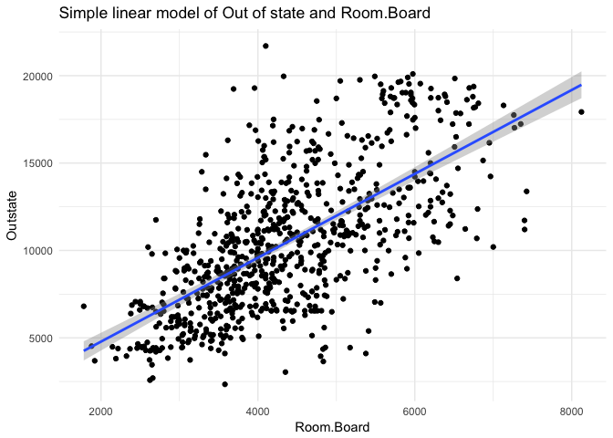 When we
focus on the points of variables, we can say that they have positive
relationship. However, with simple linear graph, it seems like simplie
linear regrssion model does not explain the observations fully. To look
more closely, we have to check actual residuals of simple linear
regrssion model. If the residuals of the observations is distributed
normally with an expected error 0 and not be correlated with the fitted
values then we can assume the assumption holds.

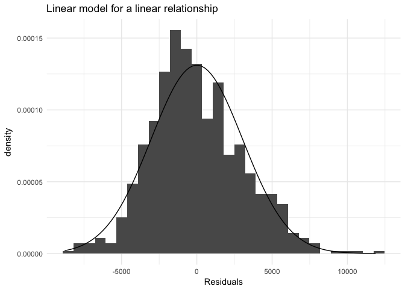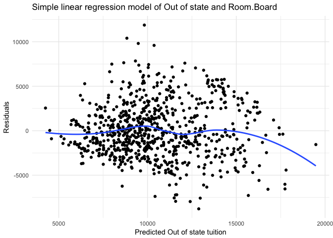
Looking the histogram, the residuals are close to 0 and the shape is
bell-shaped but slightly left -skewed. When we see the smoothe fit line,
it seems that the residuals are not correlated with fitted values
overall. However, with higher predicted values it seems to have negative
relationship, but overall it is negligible. The result seems like simple
linear model explains the correlationship between the predictor and the
response, but the relationship is not perfectly linear so we need to
check other non-linear fitting techniques.

Polynomial regression
=====================

I will use LOOCV and k-fold CV methods to figure out what degree of
polynomial model produces lowest MSE and determine which model is better
model.

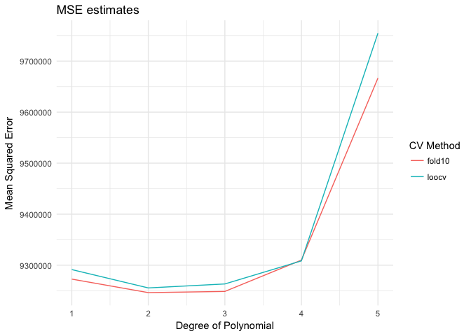 Based on
the MSE for the validation tests (k-fold, loocv), a polynomial model
with a quadratic term (Room.Board2) produces the lowest average error.
2nd degree and 3rd degree are quite similar but 2nd degree is easier to
interprete so we will take 2nd degree. Adding higher order terms is not
necessary. Now draw the graphs of 2nd degree polynomial model and
compare with the linear model.

    ## 
    ## Call:
    ## lm(formula = Outstate ~ poly(Room.Board, 2), data = df_college)
    ## 
    ## Residuals:
    ##     Min      1Q  Median      3Q     Max 
    ## -8889.1 -2057.8  -318.4  1896.0 11722.0 
    ## 
    ## Coefficients:
    ##                      Estimate Std. Error t value Pr(>|t|)    
    ## (Intercept)             10441        109  95.817   <2e-16 ***
    ## poly(Room.Board, 2)1    73321       3037  24.140   <2e-16 ***
    ## poly(Room.Board, 2)2    -6535       3037  -2.151   0.0317 *  
    ## ---
    ## Signif. codes:  0 '***' 0.001 '**' 0.01 '*' 0.05 '.' 0.1 ' ' 1
    ## 
    ## Residual standard error: 3037 on 774 degrees of freedom
    ## Multiple R-squared:  0.4315, Adjusted R-squared:   0.43 
    ## F-statistic: 293.7 on 2 and 774 DF,  p-value: < 2.2e-16

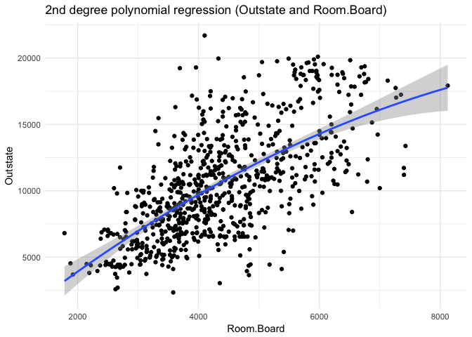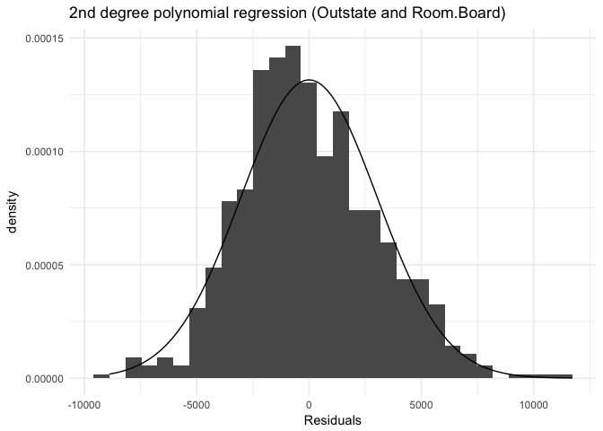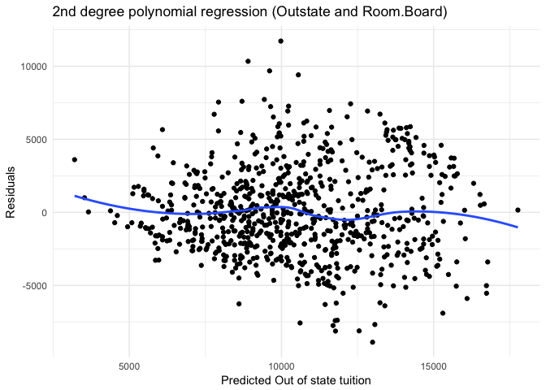

    ## [1] 9244880

    ## [1] 9189921

Looking the histogram, the shape and trend are quite similar to simple
linear model. The residuals are close to 0 and the shape is bell-shaped
but slightly left -skewed. When we see the smoothe fit line of 2nd
degree polynomial regression model, it seems that the residuals are not
correlated with fitted values overall. Comparing with simple linear
model, this model does not have trend that higher predicted values have
negative relationship with residuals. The last graph seems like 2nd
degree polynomial model explains the correlationship between the
predictor and the response better and fits the data well than simple
linear model. MSE of simple linear model is 9244880 and MSE of 2nd
degree polynomial model is 9189921. Thus we can say the 2nd degree
polynomial model predicts better.

(2) Simple linear regression (Out of state and perc.alumni)
===========================================================

Like first simple regression model, to check if the relationship between
the predictor Room.Board and the response Out of state is linear, I will
draw the graph of two varaibles and its simple linear regression model.
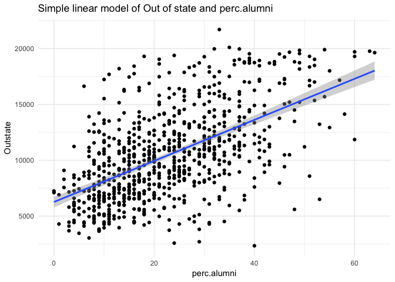 When we
focus on the points of variables, we can say that they have positive
relationship. However with simple linear graph, it seems like simplie
linear regrssion model does not explain the observations perfectly. To
look more closely, we have to check actual residuals of simple linear
regrssion model. If the residuals of the observations is distributed
normally with an expected error 0 and not be correlated with the fitted
values then we can assume the assumption holds.

Looking the histogram, most of the residuals are around 0 and the shape
is bell-shaped but slightly left -skewed. When we see the smoothe fit
line, the smooth line draws almost horizontal line. We can say that the
residuals are not correlated with fitted values overall. The result
seems like simple linear model explains the correlationship between the
predictor and the response, but the relationship is not perfectly linear
so we need to check other non-linear fitting techniques.

Polynomial regression
=====================

I will use LOOCV and k-fold CV methods to figure out what degree of
polynomial model produces lowest MSE and determine which model is better
model.

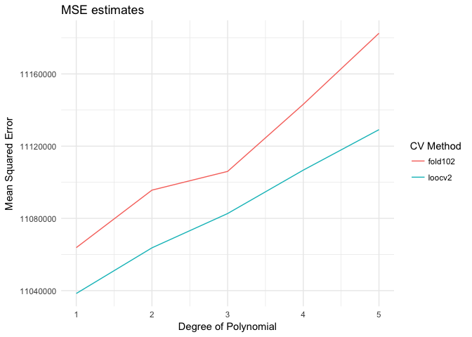 Based on
the MSE for the validation tests (k-fold, loocv), suprisingly the simple
degree model produces the lowest average error. Adding higher order
terms is not necessary at all. However, to compare the exact value, I
will test 2nd degree polynomical model, draw the graphs and compare the
result with the simple linear model.

    ## 
    ## Call:
    ## lm(formula = Outstate ~ poly(perc.alumni, 2), data = df_college)
    ## 
    ## Residuals:
    ##      Min       1Q   Median       3Q      Max 
    ## -11272.0  -2250.7   -365.4   2021.8   9724.9 
    ## 
    ## Coefficients:
    ##                       Estimate Std. Error t value Pr(>|t|)    
    ## (Intercept)            10440.7      119.1  87.657   <2e-16 ***
    ## poly(perc.alumni, 2)1  63460.1     3320.1  19.114   <2e-16 ***
    ## poly(perc.alumni, 2)2   -361.2     3320.1  -0.109    0.913    
    ## ---
    ## Signif. codes:  0 '***' 0.001 '**' 0.01 '*' 0.05 '.' 0.1 ' ' 1
    ## 
    ## Residual standard error: 3320 on 774 degrees of freedom
    ## Multiple R-squared:  0.3207, Adjusted R-squared:  0.3189 
    ## F-statistic: 182.7 on 2 and 774 DF,  p-value: < 2.2e-16

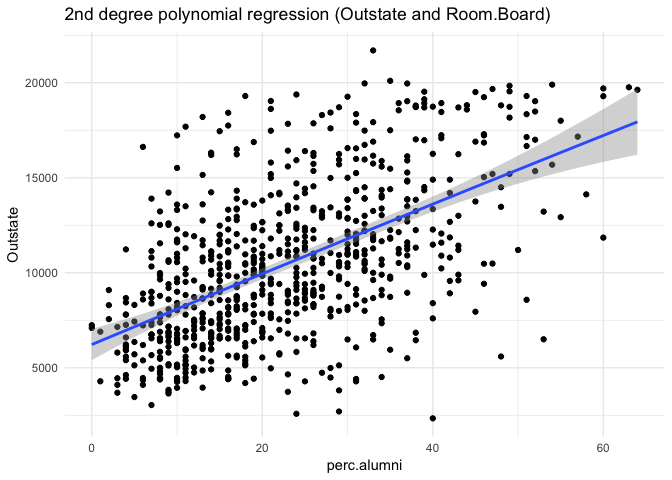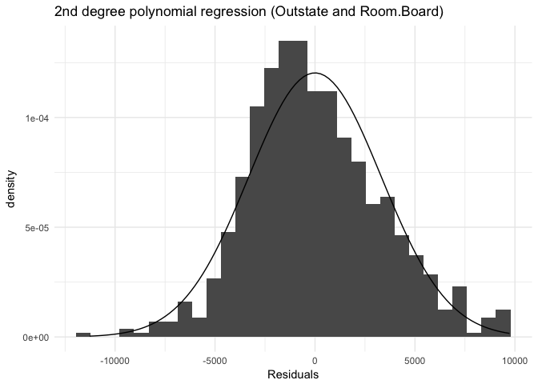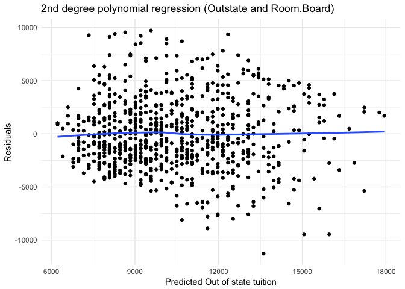

    ## [1] 10980849

    ## [1] 10980681

Looking the histogram, the shape and trend are quite similar to simple
linear model. The residuals are close to 0 and the shape is bell-shaped
but slightly left -skewed. When we see the smoothe fit line of 2nd
degree polynomial regression model, it seems that the residuals are not
correlated with fitted values overall. The graph and histograms are very
similar with simple linear model so it is hard to tell which model is
better model with these graphs. We compare MSE of each model. The MSE of
simple linear model is 10980849 and MSE of 2nd degree polynomial model
is 10980681. The MSE of 2nd degree polynomial model is about 168 lower.
Thus we can say the 2nd degree polynomial model predicts slightly better
than simple linear model.

(3) Simple linear regression (Out of state and Expend)
======================================================

Like first and second simple regression model, to check if the
relationship between the predictor Room.Board and the response Out of
state is linear, I will draw the graph of two varaibles and its simple
linear regression model.
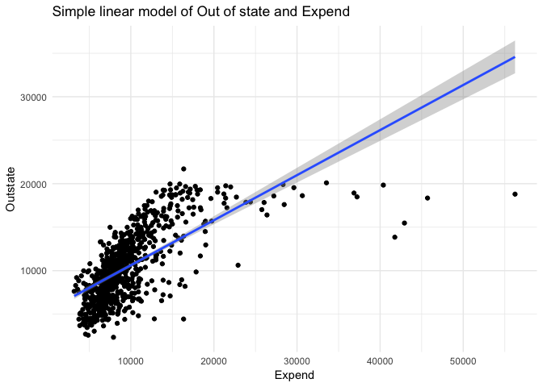 When we
focus on the points of variables, we can say that they have positive
relationship. However with simple linear graph, it seems like simple
linear regrssion model does not explain the observations perfectly. To
look more closely, we have to check actual residuals of simple linear
regrssion model. If the residuals of the observations is distributed
normally with an expected error 0 and not be correlated with the fitted
values then we can assume the assumption holds.

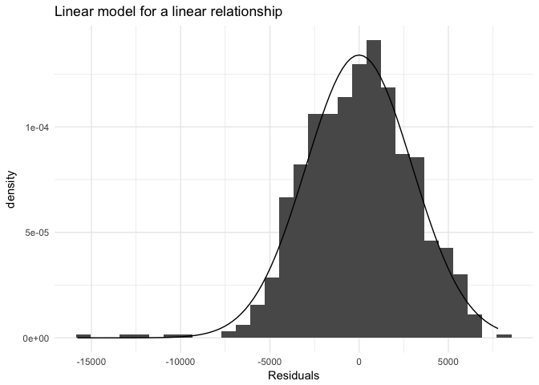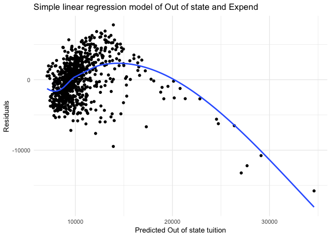
Looking the histogram, most of the residuals are around 0 and the shape
is bell-shaped but slightly right -skewed. When we see the smoothe fit
line, we can figure out that the linear model does not explain the data
well. From the graph, we can infer that it is form of logarithm so we
can do log transformation of X.

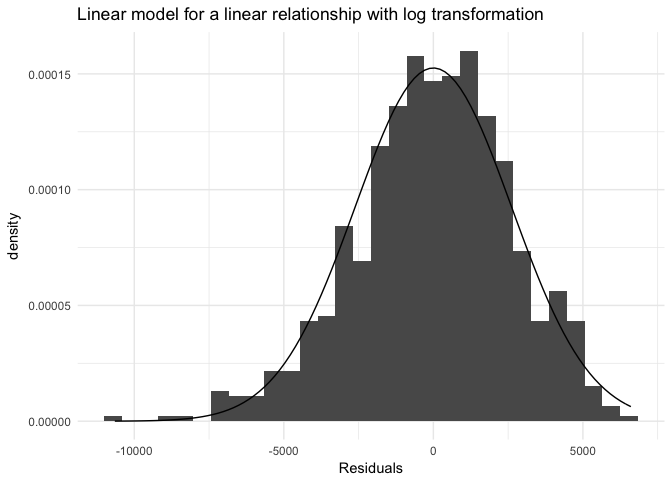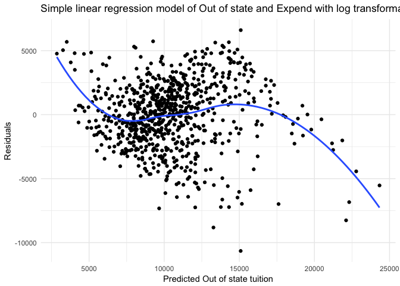
Looking the histogram, most of the residuals are around 0 and the shape
is bell-shaped. However, the smooth line does not draw a line close to 0
overall. We can not say that the residuals are not correlated with
fitted values overall. The result seems like simple linear model with
log transformation of X explains the correlationship between the
predictor and the response better than simple linear model, but we need
to check other non-linear fitting techniques.

Polynomial regression
=====================

I will use LOOCV and 10-fold CV methods to figure out what degree of
polynomial modelw without log transformation produces lowest MSE and
determine which model is better model.

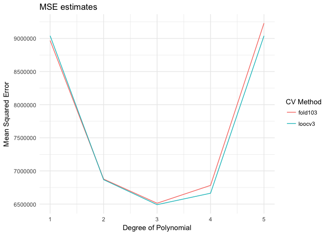 Based on
the MSE for the validation tests (10-fold, loocv), a polynomial model
with a quadratic term (Expend3) produces the lowest average error.
Adding higher order terms is not necessary. Now draw the graphs of 3rd
degree polynomial model and compare with the linear model and log
transformation model.

    ## 
    ## Call:
    ## lm(formula = Outstate ~ poly(Expend, 3), data = df_college)
    ## 
    ## Residuals:
    ##      Min       1Q   Median       3Q      Max 
    ## -11428.4  -1513.1    199.9   1722.1   5932.1 
    ## 
    ## Coefficients:
    ##                   Estimate Std. Error t value Pr(>|t|)    
    ## (Intercept)       10440.67      91.11 114.588  < 2e-16 ***
    ## poly(Expend, 3)1  75397.14    2539.79  29.686  < 2e-16 ***
    ## poly(Expend, 3)2 -41623.05    2539.79 -16.388  < 2e-16 ***
    ## poly(Expend, 3)3  12483.02    2539.79   4.915 1.08e-06 ***
    ## ---
    ## Signif. codes:  0 '***' 0.001 '**' 0.01 '*' 0.05 '.' 0.1 ' ' 1
    ## 
    ## Residual standard error: 2540 on 773 degrees of freedom
    ## Multiple R-squared:  0.603,  Adjusted R-squared:  0.6014 
    ## F-statistic: 391.3 on 3 and 773 DF,  p-value: < 2.2e-16

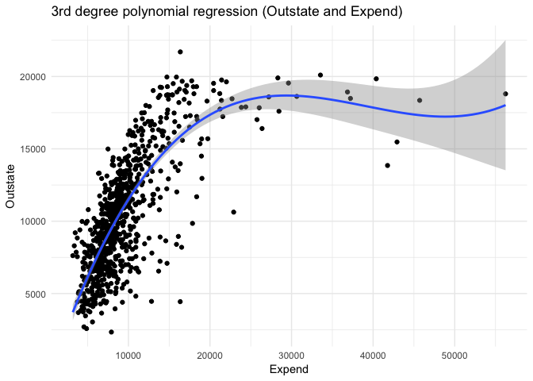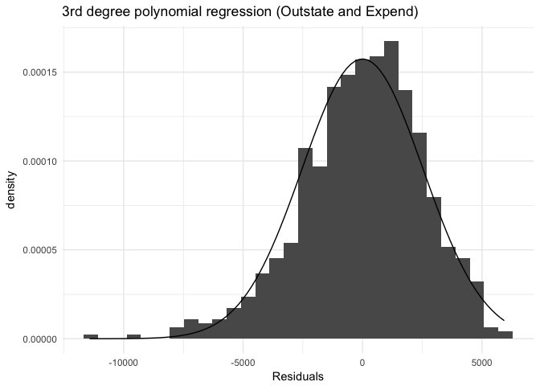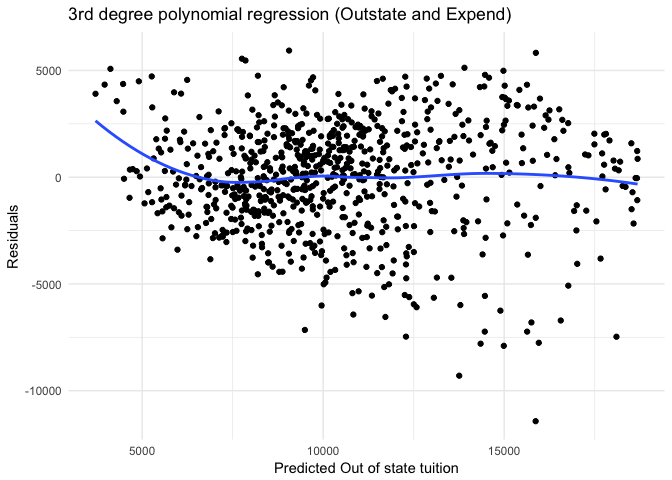

    ## [1] 6862770

    ## [1] 6417330

    ## 
    ## Call:
    ## lm(formula = Outstate ~ poly(Expend, 3), data = df_college)
    ## 
    ## Residuals:
    ##      Min       1Q   Median       3Q      Max 
    ## -11428.4  -1513.1    199.9   1722.1   5932.1 
    ## 
    ## Coefficients:
    ##                   Estimate Std. Error t value Pr(>|t|)    
    ## (Intercept)       10440.67      91.11 114.588  < 2e-16 ***
    ## poly(Expend, 3)1  75397.14    2539.79  29.686  < 2e-16 ***
    ## poly(Expend, 3)2 -41623.05    2539.79 -16.388  < 2e-16 ***
    ## poly(Expend, 3)3  12483.02    2539.79   4.915 1.08e-06 ***
    ## ---
    ## Signif. codes:  0 '***' 0.001 '**' 0.01 '*' 0.05 '.' 0.1 ' ' 1
    ## 
    ## Residual standard error: 2540 on 773 degrees of freedom
    ## Multiple R-squared:  0.603,  Adjusted R-squared:  0.6014 
    ## F-statistic: 391.3 on 3 and 773 DF,  p-value: < 2.2e-16

    ## 
    ## Call:
    ## lm(formula = Outstate ~ log(Expend), data = df_college)
    ## 
    ## Residuals:
    ##      Min       1Q   Median       3Q      Max 
    ## -10650.6  -1571.5    100.5   1805.8   6603.9 
    ## 
    ## Coefficients:
    ##             Estimate Std. Error t value Pr(>|t|)    
    ## (Intercept) -57502.0     2089.9  -27.51   <2e-16 ***
    ## log(Expend)   7482.1      229.9   32.54   <2e-16 ***
    ## ---
    ## Signif. codes:  0 '***' 0.001 '**' 0.01 '*' 0.05 '.' 0.1 ' ' 1
    ## 
    ## Residual standard error: 2617 on 775 degrees of freedom
    ## Multiple R-squared:  0.5774, Adjusted R-squared:  0.5769 
    ## F-statistic:  1059 on 1 and 775 DF,  p-value: < 2.2e-16

The smooth regression seems to explain the data well. Looking the
histogram, the shape and trend are similar to simple linear model. The
residuals are close to 0 and the shape is bell-shaped but slightly right
-skewed. When we see the smoothe fit line of 3rd degree polynomial
regression model, it seems that the residuals are not correlated with
fitted values overall. However, with lower predicted values it seems to
have negative relationship, but overall it is negligible. It is hard to
tell which model is better model with these graphs. We compare the MSE
of each model. The MSE of simple linear model is 8847579, the MSE of log
transformation of X is 6862770 and the MSE of 3rd degree polynomial
model is 6417330. The MSE of 3rd degree polynomial model is about 445440
lower. The R-sauared score of 3rd degree polynomical model is 0.603 and
the R-squared score of log transformation model is 0.5774. Thus we can
say the 3rd degree polynomial model predicts slightly better than
log-transformation of X model.

To sum up, the three predictors that use in simple linear regressin
models are Room and board cost, percent of alumni who donate and
instructional expenditure per student. The p-values of all three
variable with all variables linear model are less than 0.05 so they are
statistically significant. Thus all three variables have significnat
relationship with out of state tuition. However, when we only consider
one variable, Room and board cost explains out of state tuition more
precisely when it is 2nd degree polynomial model. Instructional
expenditure per student explains out of state tuition more precisely
when it is 3rd polynomial model. Lastly, percent of alumni perfomes
better when it is simple linear model.

3 College(GAM)
==============

1.  

<!-- -->

    ## 
    ## Call:
    ## lm(formula = Outstate ~ Private + Room.Board + PhD + perc.alumni + 
    ##     Expend + Grad.Rate, data = gam_split$train)
    ## 
    ## Residuals:
    ##     Min      1Q  Median      3Q     Max 
    ## -7837.9 -1294.5    17.8  1238.1  5943.1 
    ## 
    ## Coefficients:
    ##               Estimate Std. Error t value Pr(>|t|)    
    ## (Intercept) -3.886e+03  6.225e+02  -6.243 1.14e-09 ***
    ## PrivateYes   2.762e+03  2.934e+02   9.414  < 2e-16 ***
    ## Room.Board   1.033e+00  1.205e-01   8.574 2.52e-16 ***
    ## PhD          3.763e+01  8.240e+00   4.567 6.68e-06 ***
    ## perc.alumni  5.655e+01  1.046e+01   5.405 1.14e-07 ***
    ## Expend       1.765e-01  2.398e-02   7.359 1.14e-12 ***
    ## Grad.Rate    3.290e+01  7.834e+00   4.199 3.34e-05 ***
    ## ---
    ## Signif. codes:  0 '***' 0.001 '**' 0.01 '*' 0.05 '.' 0.1 ' ' 1
    ## 
    ## Residual standard error: 2032 on 382 degrees of freedom
    ## Multiple R-squared:  0.7521, Adjusted R-squared:  0.7482 
    ## F-statistic: 193.1 on 6 and 382 DF,  p-value: < 2.2e-16

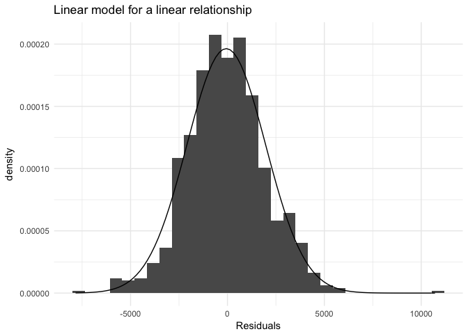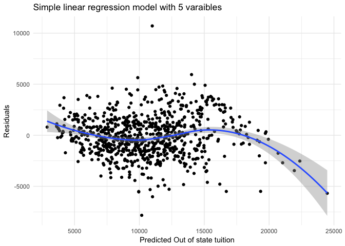

1.  In the summary of OLS model on the training data, the R-squared is
    0.7515 and p-value is less than 2.2e-16. We can say that this model
    explains approximately 75.15% of whole data and the p-value is less
    thatn significant level 0.05 so it is statistically significant.
    Also when we look into the p-value of all the variables including
    intercept, the vlaues are less than 0.05 and all are very close
    to 0. So we can say that all variables are
    statistically significant. Looking the histogram, most of the
    residuals are around 0 and the shape is bell-shaped. The smooth line
    draw a line close to 0 overall. We can say that the residuals are
    not correlated with fitted values overall. However, with higher
    predicted values it seems to have negative relationship, but the
    number of predicted out of state tution values are relatively small
    in the higher part so we can say overall it is negligible. The
    result seems like OLS model explains the correlationship between the
    predictor and the response quite well.

<!-- -->

    ## 
    ## Call: gam(formula = Outstate ~ Private + bs(Room.Board, degree = 2, 
    ##     df = 3) + lo(PhD) + lo(perc.alumni) + bs(Expend, degree = 3, 
    ##     df = 5) + lo(Grad.Rate), data = gam_split$train, na.action = na.fail)
    ## Deviance Residuals:
    ##      Min       1Q   Median       3Q      Max 
    ## -6857.07  -981.51   -40.22  1301.52  4454.40 
    ## 
    ## (Dispersion Parameter for gaussian family taken to be 3457762)
    ## 
    ##     Null Deviance: 6362233950 on 388 degrees of freedom
    ## Residual Deviance: 1273529097 on 368.3102 degrees of freedom
    ## AIC: 6982.889 
    ## 
    ## Number of Local Scoring Iterations: 2 
    ## 
    ## Anova for Parametric Effects
    ##                                        Df     Sum Sq    Mean Sq F value
    ## Private                              1.00 1956790442 1956790442 565.912
    ## bs(Room.Board, degree = 2, df = 3)   3.00 1501285771  500428590 144.726
    ## lo(PhD)                              1.00  640400018  640400018 185.207
    ## lo(perc.alumni)                      1.00  281743642  281743642  81.481
    ## bs(Expend, degree = 3, df = 5)       5.00  469292210   93858442  27.144
    ## lo(Grad.Rate)                        1.00   88949764   88949764  25.725
    ## Residuals                          368.31 1273529097    3457762        
    ##                                       Pr(>F)    
    ## Private                            < 2.2e-16 ***
    ## bs(Room.Board, degree = 2, df = 3) < 2.2e-16 ***
    ## lo(PhD)                            < 2.2e-16 ***
    ## lo(perc.alumni)                    < 2.2e-16 ***
    ## bs(Expend, degree = 3, df = 5)     < 2.2e-16 ***
    ## lo(Grad.Rate)                      6.253e-07 ***
    ## Residuals                                       
    ## ---
    ## Signif. codes:  0 '***' 0.001 '**' 0.01 '*' 0.05 '.' 0.1 ' ' 1
    ## 
    ## Anova for Nonparametric Effects
    ##                                    Npar Df  Npar F  Pr(F)
    ## (Intercept)                                              
    ## Private                                                  
    ## bs(Room.Board, degree = 2, df = 3)                       
    ## lo(PhD)                                2.6 0.69976 0.5350
    ## lo(perc.alumni)                        2.6 1.25461 0.2894
    ## bs(Expend, degree = 3, df = 5)                           
    ## lo(Grad.Rate)                          2.5 2.09132 0.1128

1.  As we conclude in the problem 2, we will use our appropriate
    flexible model to the data according to the variables. Basically we
    will use the same result model in the problem 2. We will use linear
    regression on Private, 3 degrees of freedom and 2 degrees polynomial
    on Room.Board and 5 degrees of freedom and 3 degrees polynomial
    on Expend. We also use local regression on other three predictors.
    From the summary of the model, when we see the p-value, we can say
    that all 6 variavles are less than 2.2e-16 so it is lower than
    significant level 0.05. Thus all varibles are
    statistiaclly significant. For explicit understanding, we will plot
    all the variables with response.

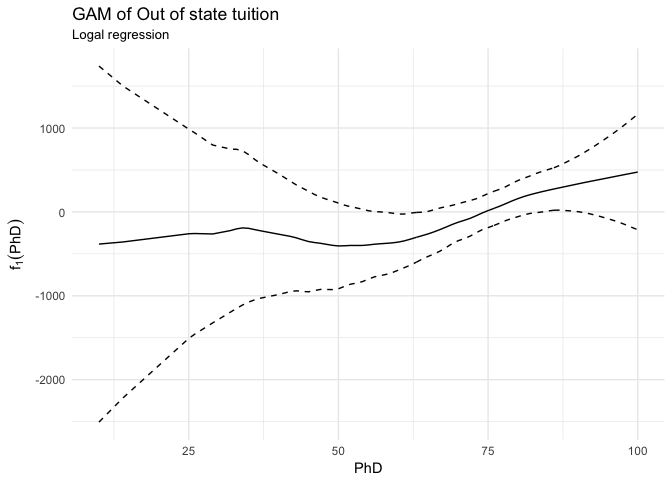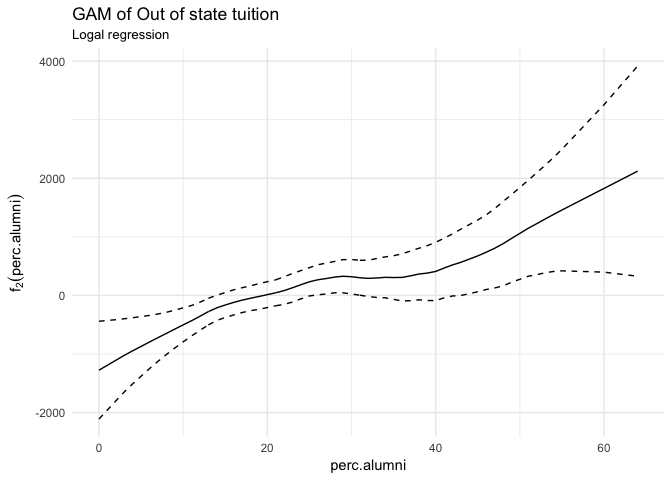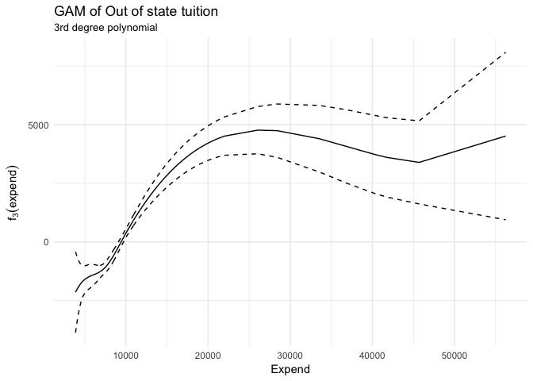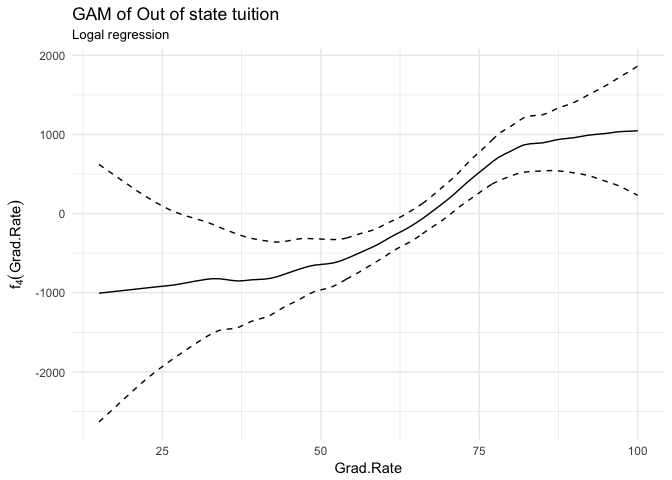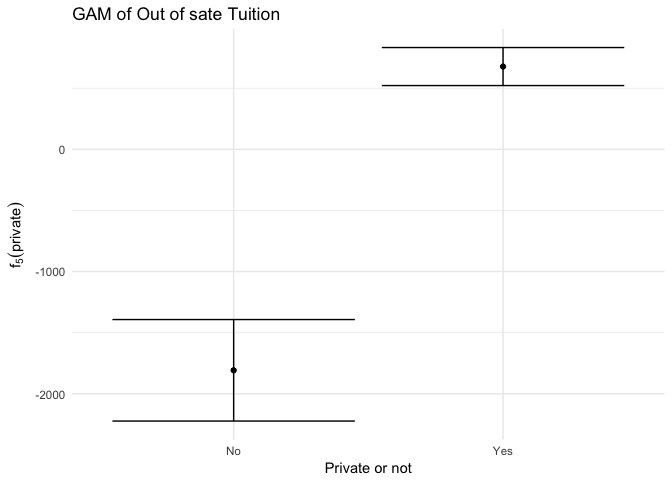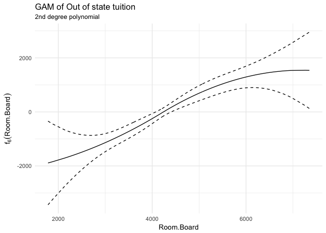

All these six variables shows that each variables have substantial and
significant relationship with out of state tuition. When we see the PhD
graph, overall it has positive relationship with the out of state
tuition. However, with lower percentage range, the slope is not large
and draw almost horizontal line. So we can say that the relationship is
weak in the lower percentage range and the 95% confidential interval is
bit larger than higher percentage range. The percentage of alumni who
donate graph show that thre is a positive relationshop and the line
draws steadily uprising so it means the percentage of alumni influences
out of state tuition modestly. In Instructional expenditure per student
graph, we can say that there is positive relationship. But when the
expenditure exceed 30000, the tuition is slightly going down and around
45000, the tuition goes up again. For graduation rate graph, overall
there is positive relationship, so with high graduation rate, we can
predic the high out of state tuition. But when you see lower 25% part
higher 80% part the relationship become weak. When we see the private
graph, we can see clear result and substantial positive relationship.
The difference between private university and public university is
substantially large. For room and board costs graph, we can observe that
there is positive relationship. Like percentage of alumni graph, it is
steadily uprising so it means that as room and board costs increase, the
out of state tuition also increases.

    ## [1] 4195761

    ## [1] 3736387

1.  The MSE of OLS is 4117111 and the MSE of GAM is 3885684. The MSE of
    GAM is 231427 smaller, so we can say that GAM model fits the
    data well. Contrast to OLS model, we include non-linear model into
    GAM model to predict reality more closely. This is why the MSE of
    GAM is lower than simple OLS model.

2.  

<!-- -->

    ## Analysis of Deviance Table
    ## 
    ## Model 1: Outstate ~ lo(perc.alumni) + bs(Expend, degree = 3, df = 5) + 
    ##     lo(Grad.Rate) + Private + bs(Room.Board, degree = 2, df = 3)
    ## Model 2: Outstate ~ PhD + lo(perc.alumni) + bs(Expend, degree = 3, df = 5) + 
    ##     lo(Grad.Rate) + Private + bs(Room.Board, degree = 2, df = 3)
    ## Model 3: Outstate ~ Private + bs(Room.Board, degree = 2, df = 3) + lo(PhD) + 
    ##     lo(perc.alumni) + bs(Expend, degree = 3, df = 5) + lo(Grad.Rate)
    ##   Resid. Df Resid. Dev    Df Deviance      F Pr(>F)
    ## 1    371.95 1287675970                             
    ## 2    370.95 1279739397 1.000  7936573 2.2953 0.1306
    ## 3    368.31 1273529097 2.637  6210300 0.6811 0.5457

None of two models has statistically significant level of p-value. Both
are higher than significant level 0.05. Thus we can not say that PhD
variables has linear relationship with out of state tuition.

    ## Analysis of Deviance Table
    ## 
    ## Model 1: Outstate ~ lo(PhD) + bs(Expend, degree = 3, df = 5) + lo(Grad.Rate) + 
    ##     Private + bs(Room.Board, degree = 2, df = 3)
    ## Model 2: Outstate ~ lo(PhD) + perc.alumni + bs(Expend, degree = 3, df = 5) + 
    ##     lo(Grad.Rate) + Private + bs(Room.Board, degree = 2, df = 3)
    ## Model 3: Outstate ~ Private + bs(Room.Board, degree = 2, df = 3) + lo(PhD) + 
    ##     lo(perc.alumni) + bs(Expend, degree = 3, df = 5) + lo(Grad.Rate)
    ##   Resid. Df Resid. Dev     Df Deviance       F    Pr(>F)    
    ## 1    371.88 1331682664                                      
    ## 2    370.88 1285251020 1.0000 46431644 13.4282 0.0002843 ***
    ## 3    368.31 1273529097 2.5653 11721923  1.3215 0.2684066    
    ## ---
    ## Signif. codes:  0 '***' 0.001 '**' 0.01 '*' 0.05 '.' 0.1 ' ' 1

We can see the 2nd model has the statistically significiant p-value
because it is close to 0 and 3rd model is not statistically significant.
It means that perc.alumni has linear relationship with the out of state
tuition.

    ## Analysis of Deviance Table
    ## 
    ## Model 1: Outstate ~ lo(PhD) + lo(perc.alumni) + lo(Grad.Rate) + Private + 
    ##     bs(Room.Board, degree = 2, df = 3)
    ## Model 2: Outstate ~ lo(PhD) + lo(perc.alumni) + Expend + lo(Grad.Rate) + 
    ##     Private + bs(Room.Board, degree = 2, df = 3)
    ## Model 3: Outstate ~ Private + bs(Room.Board, degree = 2, df = 3) + lo(PhD) + 
    ##     lo(perc.alumni) + bs(Expend, degree = 3, df = 5) + lo(Grad.Rate)
    ##   Resid. Df Resid. Dev Df  Deviance      F    Pr(>F)    
    ## 1    373.31 1639825694                                  
    ## 2    372.31 1482604507  1 157221187 45.469 6.013e-11 ***
    ## 3    368.31 1273529097  4 209075409 15.116 1.878e-11 ***
    ## ---
    ## Signif. codes:  0 '***' 0.001 '**' 0.01 '*' 0.05 '.' 0.1 ' ' 1

We can see the 2nd and 3rd model has the statistically significiant
p-value because both are close to 0. We then consider F-test lowest
value and it means that expenditure has non-linear relationship.

    ## Analysis of Deviance Table
    ## 
    ## Model 1: Outstate ~ lo(PhD) + lo(perc.alumni) + bs(Expend, degree = 3, 
    ##     df = 5) + Private + bs(Room.Board, degree = 2, df = 3)
    ## Model 2: Outstate ~ lo(PhD) + lo(perc.alumni) + bs(Expend, degree = 3, 
    ##     df = 5) + Grad.Rate + Private + bs(Room.Board, degree = 2, 
    ##     df = 3)
    ## Model 3: Outstate ~ Private + bs(Room.Board, degree = 2, df = 3) + lo(PhD) + 
    ##     lo(perc.alumni) + bs(Expend, degree = 3, df = 5) + lo(Grad.Rate)
    ##   Resid. Df Resid. Dev     Df Deviance       F   Pr(>F)    
    ## 1    371.80 1370949014                                     
    ## 2    370.80 1291579374 1.0000 79369640 22.9540 2.41e-06 ***
    ## 3    368.31 1273529097 2.4874 18050276  2.0986   0.1118    
    ## ---
    ## Signif. codes:  0 '***' 0.001 '**' 0.01 '*' 0.05 '.' 0.1 ' ' 1

We can see the 2nd model p-value is close to 0, so it has the
statistically signiciant p-value. The p-value of 3rd model is not
statistically significant because it is greater than 0.05. We can say
that graduation rate has linear relationship with the out of state
tuition.

    ## Analysis of Deviance Table
    ## 
    ## Model 1: Outstate ~ lo(PhD) + lo(perc.alumni) + bs(Expend, degree = 3, 
    ##     df = 5) + lo(Grad.Rate) + Private
    ## Model 2: Outstate ~ lo(PhD) + lo(perc.alumni) + bs(Expend, degree = 3, 
    ##     df = 5) + lo(Grad.Rate) + Private + Room.Board
    ## Model 3: Outstate ~ Private + bs(Room.Board, degree = 2, df = 3) + lo(PhD) + 
    ##     lo(perc.alumni) + bs(Expend, degree = 3, df = 5) + lo(Grad.Rate)
    ##   Resid. Df Resid. Dev Df  Deviance       F    Pr(>F)    
    ## 1    371.31 1440543443                                   
    ## 2    370.31 1279753879  1 160789564 46.5011 3.765e-11 ***
    ## 3    368.31 1273529097  2   6224781  0.9001    0.4074    
    ## ---
    ## Signif. codes:  0 '***' 0.001 '**' 0.01 '*' 0.05 '.' 0.1 ' ' 1

We can see the 2nd model p-value is close to 0, so it has the
statistically signiciant p-value. The p-value of 3rd model is not
statistically significant because it is greater than 0.05. We can say
that Room.Board has linear relationship with the out of state tuition.

Thus the predictor PhD and Expend has non-linear relationship with the
response.
