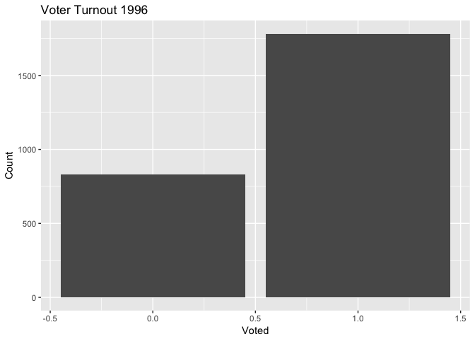
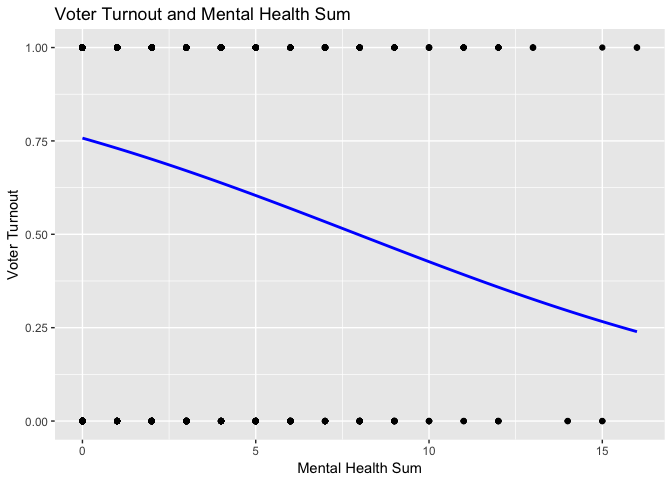
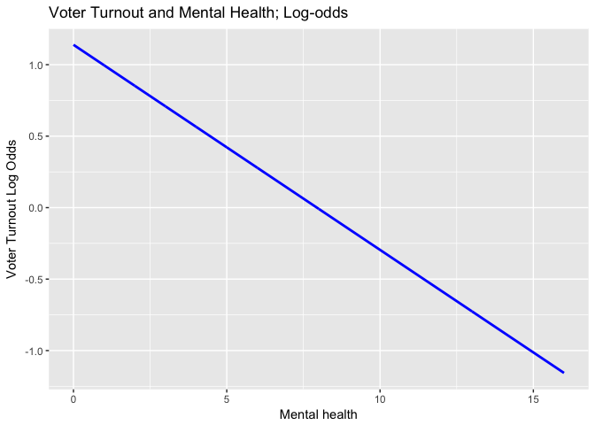
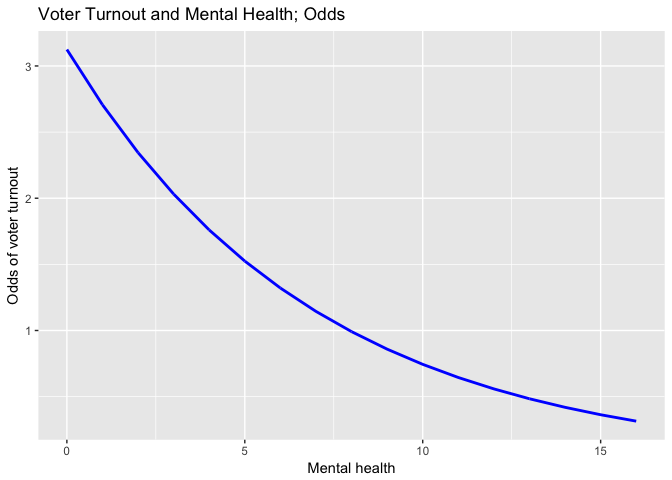
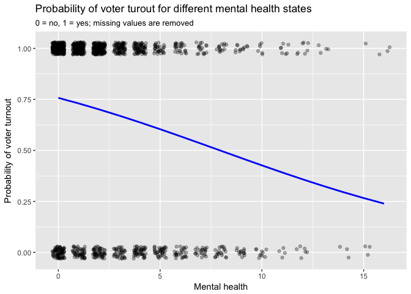
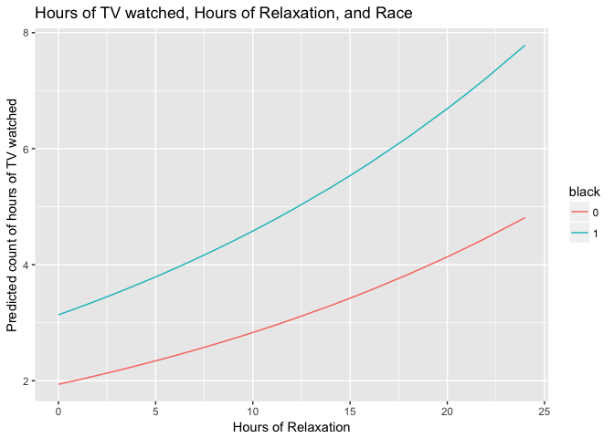

PS5
================
Chelsea Ernhofer

Question 1
----------

Describe the Data
-----------------

``` r
attach(mh_data)

vote96 = na.omit(vote96)
mhealth_sum = na.omit(mhealth_sum)

# counts
ggplot(mh_data, aes(vote96)) +
  geom_bar() + 
  labs(title = 'Voter Turnout 1996', x = 'Voted', y = 'Count') +
  guides(fill = guide_legend(title = ''))
```

    ## Warning: Removed 219 rows containing non-finite values (stat_count).



``` r
vote_prob = sum(vote96)/length(vote96)
```

The unconditional probability of a given individual turning out to vote is 0.682.

``` r
ggplot(mh_data, aes(mhealth_sum, vote96)) +
  geom_point() +
  geom_smooth(method = "glm", method.args = list(family = "binomial"),
              se = FALSE, fullrange = TRUE, color = "blue", size = 1) +
  ggtitle("Voter Turnout and Mental Health Sum") +
  labs(x = "Mental Health Sum",
       y = "Voter Turnout")
```

    ## Warning: Removed 1510 rows containing non-finite values (stat_smooth).

    ## Warning: Removed 1510 rows containing missing values (geom_point).



This graph shows us that mental health and voter turnout have a negative relationship. However, since voter turnout is a dichotomous variable, it does no make sense to plot a line to the data since there are no observed (or even possible) value between 1 and 0.

Simple Regression
-----------------

``` r
vote_mhealth <- glm(vote96 ~ mhealth_sum , data = mh_data, family = binomial)
tidy(vote_mhealth)
```

    ##          term   estimate  std.error statistic      p.value
    ## 1 (Intercept)  1.1392097 0.08444019 13.491321 1.759191e-41
    ## 2 mhealth_sum -0.1434752 0.01968511 -7.288516 3.133883e-13

``` r
summary(vote_mhealth)
```

    ## 
    ## Call:
    ## glm(formula = vote96 ~ mhealth_sum, family = binomial, data = mh_data)
    ## 
    ## Deviance Residuals: 
    ##     Min       1Q   Median       3Q      Max  
    ## -1.6834  -1.2977   0.7452   0.8428   1.6911  
    ## 
    ## Coefficients:
    ##             Estimate Std. Error z value Pr(>|z|)    
    ## (Intercept)  1.13921    0.08444  13.491  < 2e-16 ***
    ## mhealth_sum -0.14348    0.01969  -7.289 3.13e-13 ***
    ## ---
    ## Signif. codes:  0 '***' 0.001 '**' 0.01 '*' 0.05 '.' 0.1 ' ' 1
    ## 
    ## (Dispersion parameter for binomial family taken to be 1)
    ## 
    ##     Null deviance: 1672.1  on 1321  degrees of freedom
    ## Residual deviance: 1616.7  on 1320  degrees of freedom
    ##   (1510 observations deleted due to missingness)
    ## AIC: 1620.7
    ## 
    ## Number of Fisher Scoring iterations: 4

1.  This relationship is statistically significant. The p-value for the relationship between mental health and voter turnout is less than 0.001. I also believe this model to show substantive significance. For every one unit increase in mental health sum, the log odds of an individual voting descreases by 0.143. This estimate may seem small, but that is desceptive because of the fact that it's log odds.

``` r
logit2prob <- function(x){
  exp(x) / (1 + exp(x))
}
prob2odds <- function(x){
  x / (1 - x)
}
prob2logodds <- function(x){
  log(prob2odds(x))
}

vote_log <- mh_data %>%
  add_predictions(vote_mhealth) %>%
  mutate(prob = logit2prob(pred)) %>%
  mutate(odds = prob2odds(prob)) %>%
  mutate(logodds = prob2logodds(prob))

ggplot(vote_log, aes(x = mhealth_sum)) +
  geom_line(aes(y = logodds), color = "blue", size = 1) +
  labs(title = "Voter Turnout and Mental Health; Log-odds",
       x = "Mental health",
       y = "Voter Turnout Log Odds")
```

    ## Warning: Removed 1418 rows containing missing values (geom_path).

 2. When an individual's mental health sum increases by one unit, the log odds of that indiviual voting decrease by 0.143.

``` r
ggplot(vote_log, aes(x = mhealth_sum)) +
  geom_line(aes(y = odds), color = "blue", size = 1) +
  labs(title = "Voter Turnout and Mental Health; Odds",
       x = "Mental health",
       y = "Odds of voter turnout")
```

    ## Warning: Removed 1418 rows containing missing values (geom_path).



``` r
geom_point(aes(y = vote96))
```

    ## mapping: y = vote96 
    ## geom_point: na.rm = FALSE
    ## stat_identity: na.rm = FALSE
    ## position_identity

1.  When an individual's mental health sum increases by one unit, the odds of that indiviual voting decrease by 15%.

``` r
ggplot(vote_log, aes(x = mhealth_sum)) +
  geom_jitter(aes(y=vote96), na.rm=TRUE, height=.03, width=.3, alpha=.3) +
  geom_line(aes(y = prob), color = "blue", size = 1) +
  labs(title = "Probability of voter turout for different mental health states",
       subtitle = '0 = no, 1 = yes; missing values are removed',
       x = "Mental health",
       y = "Probability of voter turnout")
```

    ## Warning: Removed 1418 rows containing missing values (geom_path).



``` r
tibble(mhealth_sum = 0:16) %>%
  add_predictions(vote_mhealth, var = 'logit') %>%
  mutate(prob = logit2prob(logit)) %>%
  {.} -> diff_grid

dif1 = diff_grid[3,]$prob - diff_grid[2,]$prob
dif2 = diff_grid[7,]$prob - diff_grid[6,]$prob
```

1.  The change in voter turnout probability is -0.029 from scores of 1-2 in mental health sum. With a change in mental health from 5-6, the change in probability is -0.034.

``` r
vote_accuracy <- mh_data %>%
  na.omit %>%
  add_predictions(vote_mhealth) %>%
  mutate(pred = logit2prob(pred),
         pred = as.numeric(pred > .5))

ac_rate = mean(vote_accuracy$vote96 == vote_accuracy$pred, na.rm = TRUE)

PRE <- function(model){
  # get the actual values for y from the data
  y <- model$y
  
  # get the predicted values for y from the model
  y.hat <- round(model$fitted.values)
  
  # calculate the errors for the null model and your model
  E1 <- sum(y != median(y))
  E2 <- sum(y != y.hat)
  
  # calculate the proportional reduction in error
  PRE <- (E1 - E2) / E1
  return(PRE)
}

pre_val = PRE(vote_mhealth)

auc <- auc(vote_accuracy$vote96, vote_accuracy$pred, na.rm=TRUE)
```

1.  Accuracy rate: 0.682 PRE: 0.016 AUC: 0.541

I do not believe this model is very good. Although the accuracy rate could be seen as high (at 68%), there is no baseline to compare with this number. The PRE, therefore is calculated to determine how we have reduced the error from the useless classifier. A value of 0.016 for the PRE, shows that we have not reduced that error very well. Finally, the AUC value also suggests that the results, as influenced by the independent variable we chose, are not far from what could have been generated randomly.

Multivariate Regression
-----------------------

``` r
vote_pred <- glm(vote96 ~ ., data=mh_data, family=binomial())
summary(vote_pred)
```

    ## 
    ## Call:
    ## glm(formula = vote96 ~ ., family = binomial(), data = mh_data)
    ## 
    ## Deviance Residuals: 
    ##     Min       1Q   Median       3Q      Max  
    ## -2.4843  -1.0258   0.5182   0.8428   2.0758  
    ## 
    ## Coefficients:
    ##              Estimate Std. Error z value Pr(>|z|)    
    ## (Intercept) -4.304103   0.508103  -8.471  < 2e-16 ***
    ## mhealth_sum -0.089102   0.023642  -3.769 0.000164 ***
    ## age          0.042534   0.004814   8.835  < 2e-16 ***
    ## educ         0.228686   0.029532   7.744 9.65e-15 ***
    ## black        0.272984   0.202585   1.347 0.177820    
    ## female      -0.016969   0.139972  -0.121 0.903507    
    ## married      0.296915   0.153164   1.939 0.052557 .  
    ## inc10        0.069614   0.026532   2.624 0.008697 ** 
    ## ---
    ## Signif. codes:  0 '***' 0.001 '**' 0.01 '*' 0.05 '.' 0.1 ' ' 1
    ## 
    ## (Dispersion parameter for binomial family taken to be 1)
    ## 
    ##     Null deviance: 1468.3  on 1164  degrees of freedom
    ## Residual deviance: 1241.8  on 1157  degrees of freedom
    ##   (1667 observations deleted due to missingness)
    ## AIC: 1257.8
    ## 
    ## Number of Fisher Scoring iterations: 4

1.  The elements of this general linear model are as follows:

The random component of this model is the Bernoulli distribution.

*P**r*(*Y*<sub>*i*</sub> = *y*<sub>*i*</sub>|*π*)=*π*<sub>*i*</sub><sup>*y*<sub>*i*</sub></sup>(1 − *π*<sub>*i*</sub>)<sup>(1 − *y*<sub>*i*</sub>)</sup>

The linear predictor is the basic linear regression equation.

*η* = *β*<sub>0</sub> + *β*<sub>1</sub>*M**e**n**t**a**l**H**e**a**l**t**h* + *β*<sub>2</sub>*A**g**e* + *β*<sub>3</sub>*E**d**u**c**a**t**i**o**n* + *β*<sub>4</sub>*B**l**a**c**k* + *β*<sub>5</sub>*F**e**m**a**l**e* + *β*<sub>6</sub>*M**a**r**r**i**e**d* + *β*<sub>7</sub>*i**n**c*10

Where
*η*
 = voter turnout.

The link function is:

$${\\pi\_i} = \\frac{e^{\\eta\_i}}{1 + e^{\\eta\_i}}$$

1.  

``` r
vote_all <- mh_data %>%
  data_grid(mhealth_sum, educ, .model=vote_pred) %>%
  add_predictions(vote_pred) %>%
  mutate(pred = logit2prob(pred))

vote_all_reg <- glm(vote96 ~ ., data = mh_data, family = binomial)
summary(vote_all_reg)
```

    ## 
    ## Call:
    ## glm(formula = vote96 ~ ., family = binomial, data = mh_data)
    ## 
    ## Deviance Residuals: 
    ##     Min       1Q   Median       3Q      Max  
    ## -2.4843  -1.0258   0.5182   0.8428   2.0758  
    ## 
    ## Coefficients:
    ##              Estimate Std. Error z value Pr(>|z|)    
    ## (Intercept) -4.304103   0.508103  -8.471  < 2e-16 ***
    ## mhealth_sum -0.089102   0.023642  -3.769 0.000164 ***
    ## age          0.042534   0.004814   8.835  < 2e-16 ***
    ## educ         0.228686   0.029532   7.744 9.65e-15 ***
    ## black        0.272984   0.202585   1.347 0.177820    
    ## female      -0.016969   0.139972  -0.121 0.903507    
    ## married      0.296915   0.153164   1.939 0.052557 .  
    ## inc10        0.069614   0.026532   2.624 0.008697 ** 
    ## ---
    ## Signif. codes:  0 '***' 0.001 '**' 0.01 '*' 0.05 '.' 0.1 ' ' 1
    ## 
    ## (Dispersion parameter for binomial family taken to be 1)
    ## 
    ##     Null deviance: 1468.3  on 1164  degrees of freedom
    ## Residual deviance: 1241.8  on 1157  degrees of freedom
    ##   (1667 observations deleted due to missingness)
    ## AIC: 1257.8
    ## 
    ## Number of Fisher Scoring iterations: 4

1.  From this regression output, we can state a few conclusions. Firstly, mental health index continues to have a significant relationship with voting status, with log odds of voting decreasing by 0.08 with every added unit in mental health sum. We can also posit that both age and education also have significant relationships with the log odds of an individual voting. With a one unit increase in age, individuals' log odds of voting increase by 0.04. Similarly, with a one unit increase in education, the log odds of an individual voting increase by 0.22. Increasing income and being married also increase the log odds that one will vote.

Question 2
----------

1.  The elements of this general linear model are as follows:

The random component of this model is the Poisson distribution.

$$Pr(Y = y | \\mu) = \\frac{\\mu^k e^{-y}}{y!}$$

The linear predictor is, again, a basic linear model:

*η* = *β*<sub>0</sub> + *β*<sub>1</sub>*h**r**s**r**e**l**a**x* + *β*<sub>2</sub>*b**l**a**c**k*

The link function is the log function:

*μ* = *l**n*(*η*)

``` r
detach(mh_data)

attach(gss_data)


tv_pred <- glm(tvhours ~ hrsrelax + black, data=gss_data, family=poisson())
summary(tv_pred)
```

    ## 
    ## Call:
    ## glm(formula = tvhours ~ hrsrelax + black, family = poisson(), 
    ##     data = gss_data)
    ## 
    ## Deviance Residuals: 
    ##     Min       1Q   Median       3Q      Max  
    ## -3.0763  -0.8411  -0.1209   0.4710   5.5984  
    ## 
    ## Coefficients:
    ##             Estimate Std. Error z value Pr(>|z|)    
    ## (Intercept) 0.662267   0.033687  19.659  < 2e-16 ***
    ## hrsrelax    0.037870   0.006183   6.125 9.08e-10 ***
    ## black       0.480921   0.046358  10.374  < 2e-16 ***
    ## ---
    ## Signif. codes:  0 '***' 0.001 '**' 0.01 '*' 0.05 '.' 0.1 ' ' 1
    ## 
    ## (Dispersion parameter for poisson family taken to be 1)
    ## 
    ##     Null deviance: 1242.9  on 1008  degrees of freedom
    ## Residual deviance: 1102.7  on 1006  degrees of freedom
    ##   (3501 observations deleted due to missingness)
    ## AIC: 3696
    ## 
    ## Number of Fisher Scoring iterations: 5

``` r
gss_data %>%
  data_grid(hrsrelax, black = c(0,1)) %>%
  add_predictions(tv_pred) %>%
  mutate(pred = exp(pred),
         black = factor(black)) %>%
  ggplot(aes(hrsrelax, pred, color = black)) +
  geom_line() +
  ggtitle("Hours of TV watched, Hours of Relaxation, and Race") +
  labs(x = "Hours of Relaxation",
       y = "Predicted count of hours of TV watched")
```

 3. For my poisson model, I chose to model the predicted count of TV hours watched with hours of relaxation and race. From the regression output, we can see that both of these variables have a significant relationship with the response variable, hours of television watched. A unit increase in hours of relaxation is correlated with a 0.037-fold increase in hours of television watched. This make intuitive sense, since if one has more time to relax, they are more likely to spend and increased amount of time watching television when compared with someone who has little to no relaxation time. What I found particularly interesting in this model is the effect of race on hours of television watched. From the regression we can conclude that being black is correlated with a 0.48-fold increase in hours of television watched. To further demostrate this interesting relationship, I create the plot above which shows the different predicted counts of TV hours watched vs. hours of relaxation, taking race into account as well. From this, we can see that the initial values for hours of television watched is already higher for black respondents than it is for individuals of other races. It is of note, however, that this difference grows with more hours of relaxation. Because of this, we can conclude that there may be a systematic difference of TV watching habits between black individuals and individuals of other races.
