PS7
================
Chelsea Ernhofer

Question 1
----------

``` r
biden_lm = lm(biden ~ age + female + educ + dem + rep, data = biden_data)
summary(biden_lm)
```

    ## 
    ## Call:
    ## lm(formula = biden ~ age + female + educ + dem + rep, data = biden_data)
    ## 
    ## Residuals:
    ##    Min     1Q Median     3Q    Max 
    ## -75.55 -11.29   1.02  12.78  53.98 
    ## 
    ## Coefficients:
    ##             Estimate Std. Error t value Pr(>|t|)    
    ## (Intercept)  58.8113     3.1244   18.82  < 2e-16 ***
    ## age           0.0483     0.0282    1.71    0.088 .  
    ## female        4.1032     0.9482    4.33  1.6e-05 ***
    ## educ         -0.3453     0.1948   -1.77    0.076 .  
    ## dem          15.4243     1.0680   14.44  < 2e-16 ***
    ## rep         -15.8495     1.3114  -12.09  < 2e-16 ***
    ## ---
    ## Signif. codes:  0 '***' 0.001 '**' 0.01 '*' 0.05 '.' 0.1 ' ' 1
    ## 
    ## Residual standard error: 19.9 on 1801 degrees of freedom
    ## Multiple R-squared:  0.282,  Adjusted R-squared:  0.28 
    ## F-statistic:  141 on 5 and 1801 DF,  p-value: <2e-16

``` r
tidy(biden_lm)
```

    ##          term estimate std.error statistic  p.value
    ## 1 (Intercept)  58.8113    3.1244     18.82 2.69e-72
    ## 2         age   0.0483    0.0282      1.71 8.77e-02
    ## 3      female   4.1032    0.9482      4.33 1.59e-05
    ## 4        educ  -0.3453    0.1948     -1.77 7.64e-02
    ## 5         dem  15.4243    1.0680     14.44 8.14e-45
    ## 6         rep -15.8495    1.3114    -12.09 2.16e-32

Above is a summary of the linear regression, including the coefficient values and the standard errors for each on the included variables.

Part 1
------

``` r
mse <- function(model, data) {
  x <- modelr:::residuals(model, data)
  mean(x ^ 2, na.rm = TRUE)
}

biden_mse = mse(biden_lm, biden_data)

biden_mse
```

    ## [1] 395

Part 2
------

``` r
set.seed(1234)
biden_split = resample_partition(biden_data, c(test = 0.3, train = 0.7))

train_lm = lm(biden ~ age + female + educ + dem + rep, data = biden_split$train)

test_mse = mse(train_lm, biden_split$test)

test_mse
```

    ## [1] 400

The two values I MSE calculated from the testing and training data are quite similar. The MSE created using the training linear model and testing data (400) was higher than the previous MSE (398), but this is not completely out of the ordinary since we are using two different subsets of the data. It is likely that in the first calculation, we overfit the model very slightly which led to the increased MSE when using a new set of data. However, since the two MSEs are very similar, I believe that this model is not incredibly overfit.

Part 3
------

``` r
mse100 = numeric(100)

for (i in 1:100){
  split = resample_partition(biden_data, c(test = 0.3, train = 0.7))
  train_lm = lm(biden ~ age + female + educ + dem + rep, data = split$train)
  test_mse = mse(train_lm, split$test)
  
  mse100[i] = test_mse
  
  }


mse_mean = mean(mse100)

histogram(mse100, type = "density", breaks = 10, col = "lightblue", main= "Distribution of 100 MSE values: Training and Testing Data")
```

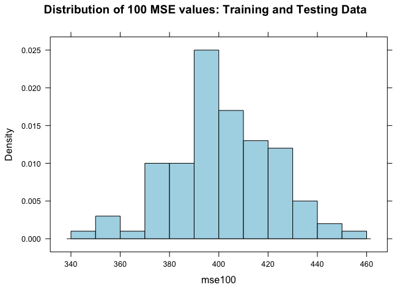

``` r
mse_mean #399
```

    ## [1] 402

After running this resampling procedure, I can conclude that a testing MSE of 400 is normal. The mean of my 100 sampled MSEs is 399 which is only slightly higher than the MSE calculated with all of the data (397).

Part 4
------

``` r
  loocv_data <- crossv_kfold(biden_data, k = nrow(biden_data))
  loocv_models <- map(loocv_data$train, ~ lm(biden ~ age + female + educ + dem + rep, data = .))
  loocv_mse <- map2_dbl(loocv_models, loocv_data$test, mse)
  mean(loocv_mse)
```

    ## [1] 398

These results are the closest to the original MSE calculated so far. The MSE calculated with all of the data was 397 and the results from the leave one out cross-validation was 398. However, the one downside to this method is the speed of it. Since it is doing n number of calculations, the loocv is significantly slower than any other method.

Part 5
------

``` r
  loocv_data <- crossv_kfold(biden_data, k = 10)
  loocv_models <- map(loocv_data$train, ~ lm(biden ~ age + female + educ + dem + rep, data = .))
  loocv_mse <- map2_dbl(loocv_models, loocv_data$test, mse)
  mean(loocv_mse)
```

    ## [1] 398

This method produced the same results as the loocv method and was much quicker.

Part 6
------

``` r
kmse100 = numeric(100)

for (i in 1:100){
  loocv_data <- crossv_kfold(biden_data, k = 10)
  loocv_models <- map(loocv_data$train, ~ lm(biden ~ age + female + educ + dem + rep, data = .))
  loocv_mse <- map2_dbl(loocv_models, loocv_data$test, mse)
  test_mse = mean(loocv_mse)
  
  kmse100[i] = test_mse
  
}

mean(kmse100)
```

    ## [1] 398

``` r
histogram(kmse100, type = "density", breaks = 10, col = "lightblue", main= "Distribution of 100 MSE values: Cross Validation k=10")
```

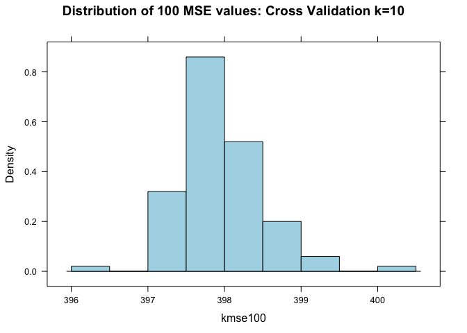 After running the k-fold resampling simulation 100 times, I can conclude that a MSE of 398 is normal.

Part 7
------

``` r
biden_boot <- biden_data %>%
  modelr::bootstrap(1000) %>%
  mutate(model = map(strap, ~ lm(biden ~ age + female + educ + dem + rep, data = .)),
         coef = map(model, tidy))

biden_boot %>%
  unnest(coef) %>%
  group_by(term) %>%
  summarize(est.boot = mean(estimate),
            se.boot = sd(estimate, na.rm = TRUE))
```

    ## # A tibble: 6 × 3
    ##          term est.boot se.boot
    ##         <chr>    <dbl>   <dbl>
    ## 1 (Intercept)  58.9134  2.9781
    ## 2         age   0.0477  0.0288
    ## 3         dem  15.4302  1.1072
    ## 4        educ  -0.3495  0.1921
    ## 5      female   4.0880  0.9488
    ## 6         rep -15.8743  1.4443

``` r
tidy(biden_lm)
```

    ##          term estimate std.error statistic  p.value
    ## 1 (Intercept)  58.8113    3.1244     18.82 2.69e-72
    ## 2         age   0.0483    0.0282      1.71 8.77e-02
    ## 3      female   4.1032    0.9482      4.33 1.59e-05
    ## 4        educ  -0.3453    0.1948     -1.77 7.64e-02
    ## 5         dem  15.4243    1.0680     14.44 8.14e-45
    ## 6         rep -15.8495    1.3114    -12.09 2.16e-32

Between the original linear model and the one created through the bootstrap, the coefficients do not vary greatly. As expected, the standard errors for almost all coefficients are larger in the bootstrap than in the original linear model (with the exception of education and gender). This makes sense since the bootstrap method does not rely on any assumptions of the distribution and therefore has larger errors, on average.

Question 2
----------

Model 1: Terminal and Outstate
------------------------------

For my first predictor variable, I chose Terminal which measures the percent of faculty with terminal degrees. To start, I plotted the two variables against each other to see if I could visually detect whether the relationship was linear or non-linear.

``` r
college_data = read.csv("College.csv")
glimpse(college_data)
```

    ## Observations: 777
    ## Variables: 18
    ## $ Private     <fctr> Yes, Yes, Yes, Yes, Yes, Yes, Yes, Yes, Yes, Yes,...
    ## $ Apps        <dbl> 1660, 2186, 1428, 417, 193, 587, 353, 1899, 1038, ...
    ## $ Accept      <dbl> 1232, 1924, 1097, 349, 146, 479, 340, 1720, 839, 4...
    ## $ Enroll      <dbl> 721, 512, 336, 137, 55, 158, 103, 489, 227, 172, 4...
    ## $ Top10perc   <dbl> 23, 16, 22, 60, 16, 38, 17, 37, 30, 21, 37, 44, 38...
    ## $ Top25perc   <dbl> 52, 29, 50, 89, 44, 62, 45, 68, 63, 44, 75, 77, 64...
    ## $ F.Undergrad <dbl> 2885, 2683, 1036, 510, 249, 678, 416, 1594, 973, 7...
    ## $ P.Undergrad <dbl> 537, 1227, 99, 63, 869, 41, 230, 32, 306, 78, 110,...
    ## $ Outstate    <dbl> 7440, 12280, 11250, 12960, 7560, 13500, 13290, 138...
    ## $ Room.Board  <dbl> 3300, 6450, 3750, 5450, 4120, 3335, 5720, 4826, 44...
    ## $ Books       <dbl> 450, 750, 400, 450, 800, 500, 500, 450, 300, 660, ...
    ## $ Personal    <dbl> 2200, 1500, 1165, 875, 1500, 675, 1500, 850, 500, ...
    ## $ PhD         <dbl> 70, 29, 53, 92, 76, 67, 90, 89, 79, 40, 82, 73, 60...
    ## $ Terminal    <dbl> 78, 30, 66, 97, 72, 73, 93, 100, 84, 41, 88, 91, 8...
    ## $ S.F.Ratio   <dbl> 18.1, 12.2, 12.9, 7.7, 11.9, 9.4, 11.5, 13.7, 11.3...
    ## $ perc.alumni <dbl> 12, 16, 30, 37, 2, 11, 26, 37, 23, 15, 31, 41, 21,...
    ## $ Expend      <dbl> 7041, 10527, 8735, 19016, 10922, 9727, 8861, 11487...
    ## $ Grad.Rate   <dbl> 60, 56, 54, 59, 15, 55, 63, 73, 80, 52, 73, 76, 74...

``` r
attach(college_data)
ggplot(college_data, aes(Terminal, Outstate)) +
  geom_point() +
  geom_smooth(method = "loess") +
  labs(title = "Terminal professors and Out of State Tuition")
```

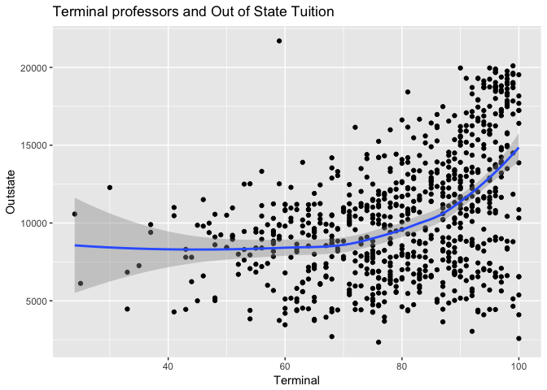 From this plot, I began to suspect that this relationship was, perhaps, non-linear. To investigate further, I plotted the residuals against the predicted values to see if there were patterns. If the relationship was truly linear, there would be not systematic patterns in the distribution of the residuals, the plotted line would be straight and horizontal at a value of 0 for residuals.

``` r
sim_linear_mod <- glm(Outstate ~ Terminal, data = college_data)

sim_linear_pred <- college_data %>%
  add_predictions(sim_linear_mod) %>%
  add_residuals(sim_linear_mod)

ggplot(sim_linear_pred, aes(pred, resid)) +
  geom_point() +
  geom_smooth(se = FALSE) +
  labs(title = "Plot of residuals of solely linear model: Terminal vs Outstate",
       x = "Predicted values",
       y = "Residuals")
```

    ## `geom_smooth()` using method = 'loess'

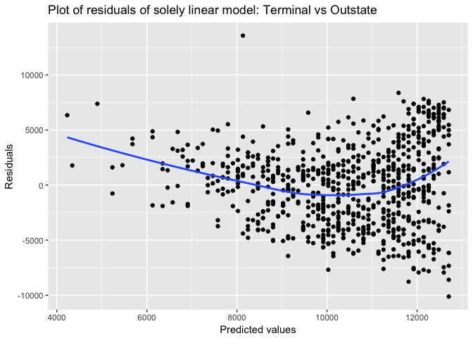 This plot gives more evidence to support the claim that the relationship between Terminal and Outstate is not linear. There is a clear visual correlation between the residuals and the predicted values. From this plot, I am confident that I should relax the linear assumption between the two variables in order to create a better model.

Once I decided to relax the linear assumption for this variable, I first plotted the linear regression line to be able to compare it against the other models I created.

``` r
ggplot(sim_linear_mod, aes(Terminal)) +
  geom_point(data = college_data, aes(Terminal, Outstate)) +
  geom_line(aes(y = .fitted), col="blue") +
  labs(title = "Outstate Tuition costs and Terminal Professors",
       x = "Terminal",
       y = "Out of State Tuition")
```

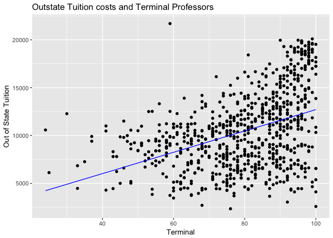

I then performed a general linear regression using the squared values for my explanatory variable, calculated the mean squared errors for the relaxed linear model to compare to the pure linear model, and plotted this regression line.

``` r
term_out = glm(Outstate ~ I(Terminal^2), data = college_data)

summary(term_out) 
```

    ## 
    ## Call:
    ## glm(formula = Outstate ~ I(Terminal^2), data = college_data)
    ## 
    ## Deviance Residuals: 
    ##    Min      1Q  Median      3Q     Max  
    ## -10585   -2845     326    2400   13711  
    ## 
    ## Coefficients:
    ##               Estimate Std. Error t value Pr(>|t|)    
    ## (Intercept)   5.22e+03   4.13e+02    12.7   <2e-16 ***
    ## I(Terminal^2) 7.94e-01   5.96e-02    13.3   <2e-16 ***
    ## ---
    ## Signif. codes:  0 '***' 0.001 '**' 0.01 '*' 0.05 '.' 0.1 ' ' 1
    ## 
    ## (Dispersion parameter for gaussian family taken to be 13185062)
    ## 
    ##     Null deviance: 1.2559e+10  on 776  degrees of freedom
    ## Residual deviance: 1.0218e+10  on 775  degrees of freedom
    ## AIC: 14948
    ## 
    ## Number of Fisher Scoring iterations: 2

``` r
mse(sim_linear_mod, college_data)
```

    ## [1] 13473357

``` r
mse(term_out, college_data)
```

    ## [1] 13151124

Above we see that a one unit increase in about of professors with terminal degrees results in a $sqrt(7.94)\_$ increase in out of state tuition. The MSE for this regresssion is smaller than for the purely linear regression, which indicates that this model better fits our data.

``` r
# plot the curve
ggplot(term_out, aes(Terminal)) +
  geom_point(data = college_data, aes(Terminal, Outstate)) +
  geom_line(aes(y = .fitted), col="blue") +
  labs(title = "Outstate Tuition costs and Terminal Professors",
       x = "Terminal squared",
       y = "Out of State Tuition")
```

 Visually, there is not a dramatic difference between this regression line and the linear regression line. However, the line does appear linealy relaxed and looks like a good fits for the general pattern of the data.

Next, I ran a polynomial regression to see if I could find a better fitting model.

``` r
term_out_glm = glm(Outstate ~ I(Terminal^2) + I(Terminal^3) + I(Terminal^4), data = college_data)

summary(term_out_glm)
```

    ## 
    ## Call:
    ## glm(formula = Outstate ~ I(Terminal^2) + I(Terminal^3) + I(Terminal^4), 
    ##     data = college_data)
    ## 
    ## Deviance Residuals: 
    ##    Min      1Q  Median      3Q     Max  
    ## -12326   -2614     208    2443   13235  
    ## 
    ## Coefficients:
    ##                Estimate Std. Error t value Pr(>|t|)   
    ## (Intercept)    7.46e+03   2.50e+03    2.98    0.003 **
    ## I(Terminal^2)  2.46e+00   3.13e+00    0.79    0.432   
    ## I(Terminal^3) -6.51e-02   5.83e-02   -1.12    0.264   
    ## I(Terminal^4)  4.79e-04   2.98e-04    1.61    0.108   
    ## ---
    ## Signif. codes:  0 '***' 0.001 '**' 0.01 '*' 0.05 '.' 0.1 ' ' 1
    ## 
    ## (Dispersion parameter for gaussian family taken to be 12651367)
    ## 
    ##     Null deviance: 1.2559e+10  on 776  degrees of freedom
    ## Residual deviance: 9.7795e+09  on 773  degrees of freedom
    ## AIC: 14918
    ## 
    ## Number of Fisher Scoring iterations: 2

``` r
mse(term_out_glm, college_data)
```

    ## [1] 12586237

``` r
mse(sim_linear_mod, college_data)
```

    ## [1] 13473357

This MSE is even smaller than the first relaxed-linear model. However, when looking at the summary of the model, it appears as though the relationship between outstate and the polynomial versions of terminal are not significant.

``` r
ggplot(term_out_glm, aes(Terminal)) +
  geom_point(data = college_data, aes(Terminal, Outstate)) +
  geom_line(aes(y = .fitted), col="blue") +
  labs(title = "Outstate Tuition costs and Terminal Professors",
       x = "Terminal Polynomial",
       y = "Out of State Tuition")
```

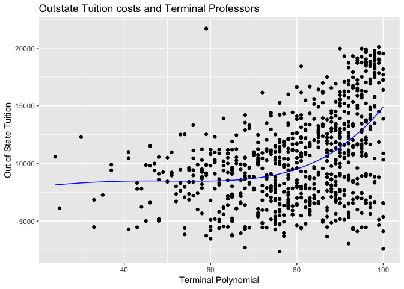 The plot of this regression line is also less linear. It appears to fit the data very well.

Model 2: Graduate Rate and Outstate
-----------------------------------

``` r
#expend
#PhD
#Grad.Rate
#Terminal

ggplot(college_data, aes(Grad.Rate, Outstate)) +
  geom_point() +
  geom_smooth(method = "loess") +
  labs(title = "Out of State Tuition and Graduation Rate")
```

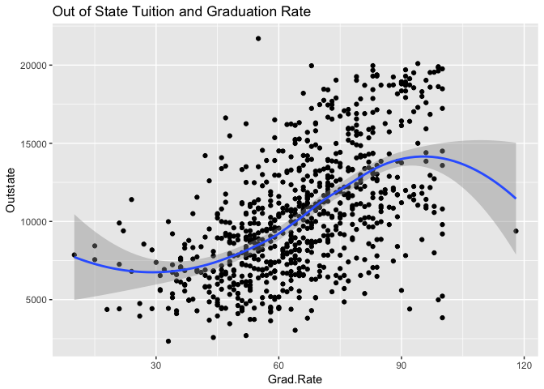

``` r
lm_grad <- glm(Outstate ~ Grad.Rate, data = college_data)

sim_linear_pred <- college_data %>%
  add_predictions(lm_grad) %>%
  add_residuals(lm_grad)

ggplot(sim_linear_pred, aes(pred, resid)) +
  geom_point() +
  geom_smooth(se = FALSE) +
  labs(title = "Plot of residuals of solely linear model: Graduation Rate and Outstate",
       x = "Predicted values",
       y = "Residuals")
```

    ## `geom_smooth()` using method = 'loess'

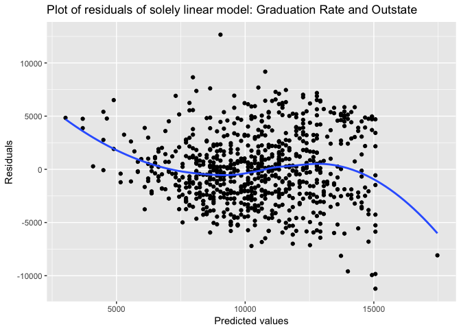 This plot shows that the residuals are fairly randomly patterned. Looking at this plot, it is less clear whether a relaxed linear model is necessary to explore the relationship between graduation rate and outstate tuition. In order to further explore the potential need for non-linearity in this model, I made a histogram to look at the distribution of the residuals.

``` r
grad_pred <- college_data %>%
  add_predictions(lm_grad) %>%
  add_residuals(lm_grad)

# distribution of residuals
ggplot(grad_pred, aes(resid)) +
  geom_histogram(aes(y = ..density..)) +
  stat_function(fun = dnorm,
                args = list(mean = mean(grad_pred$resid),
                            sd = sd(grad_pred$resid))) +
  labs(title = "Linear model for a linear relationship",
       x = "Residuals")
```

    ## `stat_bin()` using `bins = 30`. Pick better value with `binwidth`.

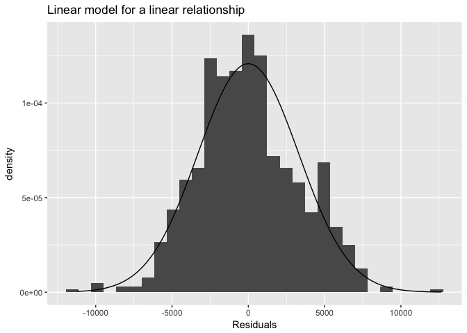 The distribution of the residuals, while not perfectly normal, is very close to the normal distribution. There is no clear way in which these data stray from the normal distribution. Because of this, I am content to model this relationship in a purely linear way.

``` r
grad_glm = glm(Outstate ~Grad.Rate, data = college_data)

summary(grad_glm)
```

    ## 
    ## Call:
    ## glm(formula = Outstate ~ Grad.Rate, data = college_data)
    ## 
    ## Deviance Residuals: 
    ##    Min      1Q  Median      3Q     Max  
    ## -11222   -2252    -161    2157   12659  
    ## 
    ## Coefficients:
    ##             Estimate Std. Error t value Pr(>|t|)    
    ## (Intercept)   1681.9      467.3     3.6  0.00034 ***
    ## Grad.Rate      133.8        6.9    19.4  < 2e-16 ***
    ## ---
    ## Signif. codes:  0 '***' 0.001 '**' 0.01 '*' 0.05 '.' 0.1 ' ' 1
    ## 
    ## (Dispersion parameter for gaussian family taken to be 10916506)
    ## 
    ##     Null deviance: 1.2559e+10  on 776  degrees of freedom
    ## Residual deviance: 8.4603e+09  on 775  degrees of freedom
    ## AIC: 14801
    ## 
    ## Number of Fisher Scoring iterations: 2

``` r
mse(grad_glm, college_data)
```

    ## [1] 10888407

From this model, we can expect that for every unit increase in graduation rate, there is a 133 unit increase in out of state tuition. This result is statistically significant.

``` r
ggplot(grad_glm, aes(Grad.Rate)) +
  geom_point(data = college_data, aes(Grad.Rate, Outstate)) +
  geom_line(aes(y = .fitted), col="blue") +
  labs(title = "Outstate Tuition costs and Graduation Rate",
       x = "Graduation Rate",
       y = "Out of State Tuition")
```

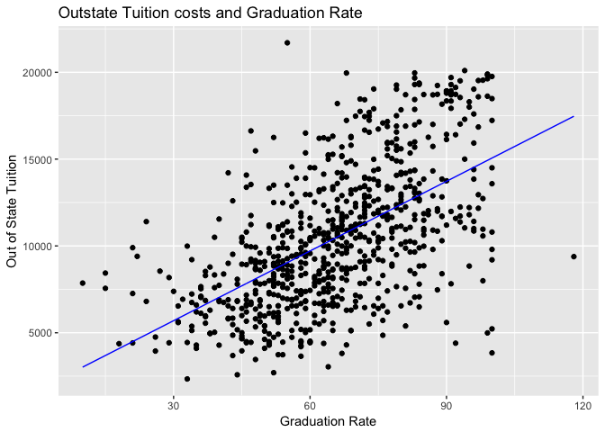

Model 3: S.F. Ratio
-------------------

``` r
ggplot(college_data, aes(S.F.Ratio, Outstate)) +
  geom_point() +
  geom_smooth(method = "auto") +
  labs(title="Relationship between S.F.Ratio and Outstate")
```

    ## `geom_smooth()` using method = 'loess'

 Looking at this scatter plot, it appears as though there is a negative relationship between S.F. Ration and Outstate tuition. The relationship may need to have relaxed linearity because of a few outliers in the data.

``` r
sim_linear <- college_data
sim_linear_mod <- glm(Outstate ~ S.F.Ratio, data = sim_linear)

sim_linear_pred <- sim_linear %>%
  add_predictions(sim_linear_mod) %>%
  add_residuals(sim_linear_mod)

ggplot(sim_linear_pred, aes(pred, resid)) +
  geom_point() +
  geom_smooth(se = FALSE) +
  labs(title = "Predicted vs. Residuals for the S.F.Ratio predictor",
       x = "Predicted values",
       y = "Residuals")
```

    ## `geom_smooth()` using method = 'loess'

 Looking at the plot, it appears as though there are patterns in the residuals which would indicate a need for non-linearity in this relationship. I have chosen to do splines.

``` r
sim_piece <- college_data

sim_piece_smooth <- glm(Outstate ~ bs(S.F.Ratio, knots = c(5)), data = sim_piece)

sim_piece %>%
  add_predictions(sim_piece_smooth) %>%
  ggplot(aes(S.F.Ratio)) +
  geom_point(aes(y = Outstate)) +
  geom_line(aes(y = pred), size = 1) +
  geom_vline(xintercept = 10, linetype = 2, color = "blue") +
  labs(title = "Cubic spline",
       x = "X",
       y = "Y") +
  theme(legend.position = "none")
```

 Using 5 knots allows for more flexibility in the model which can be seen in the above plot.

``` r
data_frame(terms = c(1, 5, 10),
           models = map(terms, ~ glm(Outstate ~ bs(S.F.Ratio, df = . + 3), data = sim_piece)),
           pred = map(models, ~ add_predictions(sim_piece, .))) %>%
  unnest(pred) %>%
  ggplot(aes(S.F.Ratio, Outstate)) +
  geom_point(data = sim_piece, alpha = .2) +
  geom_line(aes(y = pred, color = factor(terms))) +
  labs(title = "Cubic spline",
       x = "X",
       y = "Y",
       color = "Knots")
```

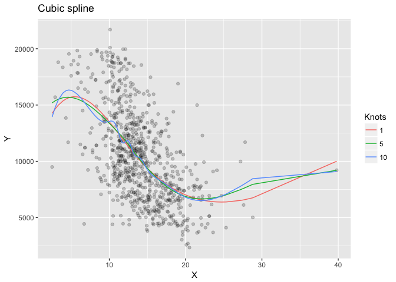 Again, it seems as though the model with 5 knots is the best fit because it is flexible, but is hopefully not overfitting the model. The line with 10 knots appears to move more with the data, but this will most likely lead to overfitting when using the testing data.

Question 3
----------

Part 1
------

``` r
college_split = resample_partition(college_data, c(test = 0.3, train = 0.7))

split_glm = glm(Outstate ~ Private + Room.Board + PhD + perc.alumni + Expend + Grad.Rate, data = college_split$train)

summary(split_glm)
```

    ## 
    ## Call:
    ## glm(formula = Outstate ~ Private + Room.Board + PhD + perc.alumni + 
    ##     Expend + Grad.Rate, data = college_split$train)
    ## 
    ## Deviance Residuals: 
    ##    Min      1Q  Median      3Q     Max  
    ##  -7469   -1254      -8    1215   10584  
    ## 
    ## Coefficients:
    ##              Estimate Std. Error t value Pr(>|t|)    
    ## (Intercept) -3.76e+03   5.48e+02   -6.85  2.0e-11 ***
    ## PrivateYes   2.48e+03   2.46e+02   10.08  < 2e-16 ***
    ## Room.Board   1.08e+00   1.02e-01   10.49  < 2e-16 ***
    ## PhD          3.13e+01   7.08e+00    4.42  1.2e-05 ***
    ## perc.alumni  5.42e+01   9.25e+00    5.86  8.2e-09 ***
    ## Expend       1.95e-01   2.01e-02    9.69  < 2e-16 ***
    ## Grad.Rate    3.47e+01   6.41e+00    5.41  9.5e-08 ***
    ## ---
    ## Signif. codes:  0 '***' 0.001 '**' 0.01 '*' 0.05 '.' 0.1 ' ' 1
    ## 
    ## (Dispersion parameter for gaussian family taken to be 4203737)
    ## 
    ##     Null deviance: 8884149253  on 543  degrees of freedom
    ## Residual deviance: 2257406548  on 537  degrees of freedom
    ## AIC: 9850
    ## 
    ## Number of Fisher Scoring iterations: 2

From this model, we can see the different relationships between out of state tuition and other variables. All relationships are statistically significant. If a university is private it is asociated with a ~18.40 unit increase in out of state tuition. This makes sense since private universities are often more expensive for both instate and out of state students. A one unit increase in room and board is associate with a 9.92 unit increase in out of state tuition. A one unit increase in percent of faculty with PhDs results in a 3.76 increase in out of state tuition. A one unit increase in percentage of alumni who donate to the university results in a 4.2 increase in out of state tuition. This relationship is interesting to me since one would think that more alumni support would mean that current students may be charged less for tuition. A one unit increase in expenditures per student results in a 2.44 increase in out of state tuition and a unit increase in graduation rate is associated with a 2.77 increase in out of state tuition.

``` r
train_df = data.frame(college_split$train)

train_df %>%
  add_predictions(split_glm) %>%
  add_residuals(split_glm) %>%
  {.} -> grid2
gridpriv <- filter(grid2, Private == "Yes")
gridnopriv <- filter(grid2, Private == "No")
ggplot(grid2, aes(jitter(pred, 8))) +
  geom_point(aes(y = jitter(resid, 8))) +
  geom_smooth(method='lm', aes(y = resid, color = 'Private'), data = gridpriv, size = 1) +
  geom_smooth(method='lm', aes(y = resid, color = 'Not Private'), data = gridnopriv, size = 1) +
  labs(title = "Out of State Tuition: Predicted Values and Residuals",
        x = "Outstate Tuition",
        y = "Residuals")
```

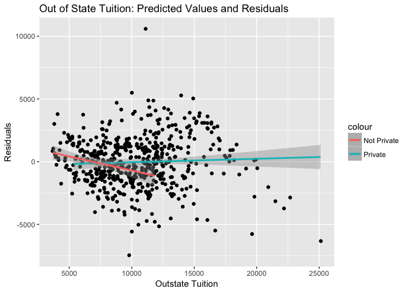 From this plot we can see that for private schools, the residuals of the multivariate regression are normally distributed. The residuals for non-private schools seem less normal. This could indicate a non-linear relationship between not private schools and out of state tuition.

Part 3
------

``` r
outstate_gam <- gam(Outstate ~ lo(PhD) + lo(perc.alumni) + log(Expend) + lo(Grad.Rate) + Private + log(Room.Board), data = college_split$train, na.action = na.fail)

summary(outstate_gam)
```

    ## 
    ## Call: gam(formula = Outstate ~ lo(PhD) + lo(perc.alumni) + log(Expend) + 
    ##     lo(Grad.Rate) + Private + log(Room.Board), data = college_split$train, 
    ##     na.action = na.fail)
    ## Deviance Residuals:
    ##     Min      1Q  Median      3Q     Max 
    ## -7006.4 -1219.9   -10.7  1193.0  8629.9 
    ## 
    ## (Dispersion Parameter for gaussian family taken to be 3776009)
    ## 
    ##     Null Deviance: 8.88e+09 on 543 degrees of freedom
    ## Residual Deviance: 2e+09 on 530 degrees of freedom
    ## AIC: 9799 
    ## 
    ## Number of Local Scoring Iterations: 2 
    ## 
    ## Anova for Parametric Effects
    ##                  Df   Sum Sq  Mean Sq F value Pr(>F)    
    ## lo(PhD)           1 1.25e+09 1.25e+09   332.2 <2e-16 ***
    ## lo(perc.alumni)   1 2.34e+09 2.34e+09   619.3 <2e-16 ***
    ## log(Expend)       1 1.90e+09 1.90e+09   503.8 <2e-16 ***
    ## lo(Grad.Rate)     1 3.50e+08 3.50e+08    92.7 <2e-16 ***
    ## Private           1 4.73e+08 4.73e+08   125.2 <2e-16 ***
    ## log(Room.Board)   1 2.98e+08 2.98e+08    79.0 <2e-16 ***
    ## Residuals       530 2.00e+09 3.78e+06                   
    ## ---
    ## Signif. codes:  0 '***' 0.001 '**' 0.01 '*' 0.05 '.' 0.1 ' ' 1
    ## 
    ## Anova for Nonparametric Effects
    ##                 Npar Df Npar F Pr(F)  
    ## (Intercept)                           
    ## lo(PhD)             2.4   3.79 0.017 *
    ## lo(perc.alumni)     2.4   0.63 0.562  
    ## log(Expend)                           
    ## lo(Grad.Rate)       2.7   1.86 0.141  
    ## Private                               
    ## log(Room.Board)                       
    ## ---
    ## Signif. codes:  0 '***' 0.001 '**' 0.01 '*' 0.05 '.' 0.1 ' ' 1

The results of the GAM are above, including coefficients and siginificance levels. It is interesting to note that relationships between Outstate and all predictor variables are siginificant. It appears as though as relationships are also positive.

``` r
grid_gam <- train_df %>%
  add_predictions(outstate_gam)%>%
  add_residuals(outstate_gam)

ggplot(grid_gam, aes(x = pred, y = resid)) +
  geom_point() +
  geom_smooth()+
  labs(title = 'Predicted value against residual of GAM',x = 'pred',y = 'resid')
```

    ## `geom_smooth()` using method = 'loess'

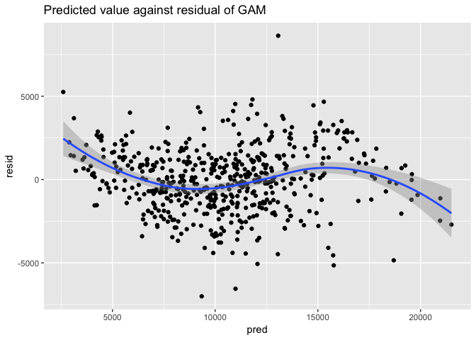 The residual plot above shows a random-looking distribution of the residuals. This indicates that we have done a good job modelling out of state tuition since there don't appear to be any systematic patterns in the residuals of this model.

To further test the accuracy of this model, I've made plots of the GAMs of the inidividual variables.

``` r
gam_terms <- preplot(outstate_gam, se = TRUE, rug = FALSE)

data_frame(x = gam_terms$`lo(perc.alumni)`$x,
           y = gam_terms$`lo(perc.alumni)`$y,
           se.fit =  gam_terms$`lo(perc.alumni)`$se.y) %>%
  mutate(y_low = y - 1.96 * se.fit,
         y_high = y + 1.96 * se.fit) %>%
  ggplot(aes(x, y)) +
  geom_line() +
  geom_line(aes(y = y_low), linetype = 2) +
  geom_line(aes(y = y_high), linetype = 2) +
  labs(title = "Percent Alumni and Outstate, GAM",
       x = "Percent Alumni",
       y = expression(f[1](perc.alumni)))
```

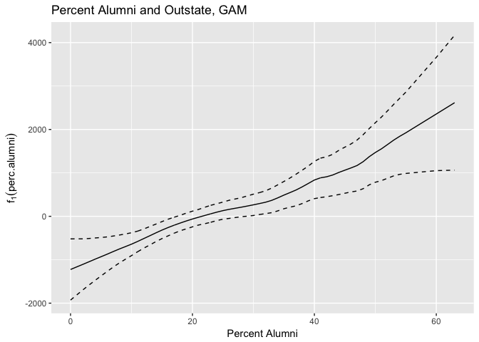 Percent Alumni was assumed to have a linear relationship with outstate tuition and it appears as though this relationship holds. The 95% confidence interval is wider when a school has more that 40% alumni who contribute to the school, but this could be because less schools have more than 40% alumni contributing.

``` r
data_frame(x = gam_terms$`log(Expend)`$x,
           y = gam_terms$`log(Expend)`$y,
           se.fit = gam_terms$`log(Expend)`$se.y) %>%
  mutate(y_low = y - 1.96 * se.fit,
         y_high = y + 1.96 * se.fit) %>%
  ggplot(aes(x, y)) +
  geom_line() +
  geom_line(aes(y = y_low), linetype = 2) +
  geom_line(aes(y = y_high), linetype = 2) +
  labs(title = "Logged Expenditures per student and Outstate Tuition, GAM",
       x = "Expend",
       y = expression(f[3](expend)))
```

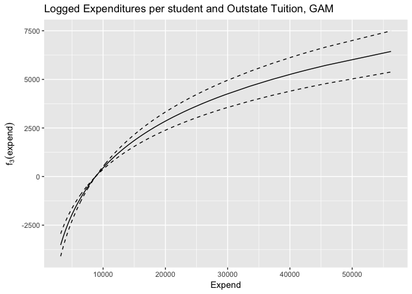 Logged expenditures seem to fit into this model well.

``` r
data_frame(x = gam_terms$`log(Room.Board)`$x,
           y = gam_terms$`log(Room.Board)`$y,
           se.fit = gam_terms$`log(Room.Board)`$se.y) %>%
  mutate(y_low = y - 1.96 * se.fit,
         y_high = y + 1.96 * se.fit) %>%
  ggplot(aes(x, y)) +
  geom_line() +
  geom_line(aes(y = y_low), linetype = 2) +
  geom_line(aes(y = y_high), linetype = 2) +
  labs(title = "Logged Room/Board costs and Outstate Tuition, GAM",
       x = "Room and Board",
       y = expression(f[3](Room.Board)))
```

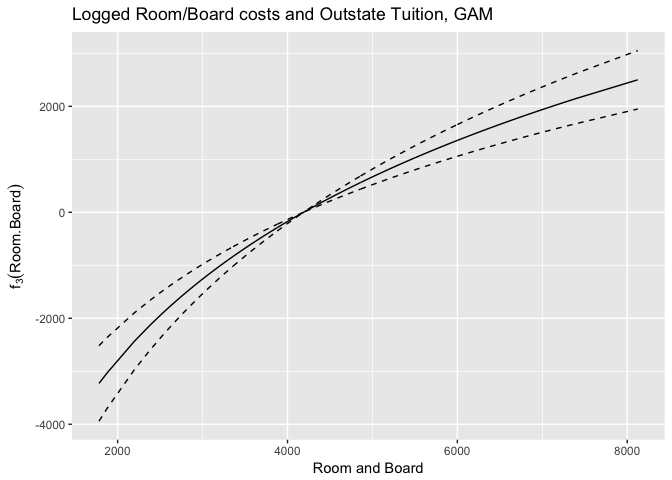 Room and Board appears to have a positive relationship with outstate tuition. The slope does not decrease or increase dramatically with increased Room and Board, so one would assume that there is a steady increase between these two variables.

``` r
data_frame(x = gam_terms$`lo(Grad.Rate)`$x,
           y = gam_terms$`lo(Grad.Rate)`$y,
           se.fit =  gam_terms$`lo(Grad.Rate)`$se.y) %>%
  mutate(y_low = y - 1.96 * se.fit,
         y_high = y + 1.96 * se.fit) %>%
  ggplot(aes(x, y)) +
  geom_line() +
  geom_line(aes(y = y_low), linetype = 2) +
  geom_line(aes(y = y_high), linetype = 2) +
  labs(title = "Graduation Rate and Outstate, GAM",
       x = "Graduation Rate",
       y = expression(f[1](Grad.Rate)))
```


``` r
data_frame(x = gam_terms$`lo(PhD)`$x,
           y = gam_terms$`lo(PhD)`$y,
           se.fit =  gam_terms$`lo(PhD)`$se.y) %>%
  mutate(y_low = y - 1.96 * se.fit,
         y_high = y + 1.96 * se.fit) %>%
  ggplot(aes(x, y)) +
  geom_line() +
  geom_line(aes(y = y_low), linetype = 2) +
  geom_line(aes(y = y_high), linetype = 2) +
  labs(title = "PhD and Outstate, GAM",
       x = "PhD",
       y = expression(f[1](PhD)))
```

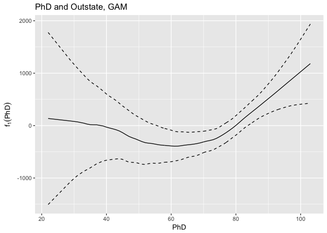

Part 4
------

In order to evaluate the fit of this model (both the OLS version and GAM version), I will calculate the MSE for both models.

``` r
ols <- mse(split_glm, college_split$test)
gam <- mse(outstate_gam, college_split$test)
```

    ## Warning in gam.lo(data[["lo(PhD)"]], z, w, span = 0.5, degree = 1, ncols =
    ## 1, : eval 10

    ## Warning in gam.lo(data[["lo(PhD)"]], z, w, span = 0.5, degree = 1, ncols =
    ## 1, : lowerlimit 21.595

    ## Warning in gam.lo(data[["lo(PhD)"]], z, w, span = 0.5, degree = 1, ncols =
    ## 1, : extrapolation not allowed with blending

    ## Warning in gam.lo(data[["lo(PhD)"]], z, w, span = 0.5, degree = 1, ncols =
    ## 1, : eval 8

    ## Warning in gam.lo(data[["lo(PhD)"]], z, w, span = 0.5, degree = 1, ncols =
    ## 1, : lowerlimit 21.595

    ## Warning in gam.lo(data[["lo(PhD)"]], z, w, span = 0.5, degree = 1, ncols =
    ## 1, : extrapolation not allowed with blending

    ## Warning in gam.lo(data[["lo(PhD)"]], z, w, span = 0.5, degree = 1, ncols =
    ## 1, : eval 14

    ## Warning in gam.lo(data[["lo(PhD)"]], z, w, span = 0.5, degree = 1, ncols =
    ## 1, : lowerlimit 21.595

    ## Warning in gam.lo(data[["lo(PhD)"]], z, w, span = 0.5, degree = 1, ncols =
    ## 1, : extrapolation not allowed with blending

    ## Warning in gam.lo(data[["lo(PhD)"]], z, w, span = 0.5, degree = 1, ncols =
    ## 1, : eval 16

    ## Warning in gam.lo(data[["lo(PhD)"]], z, w, span = 0.5, degree = 1, ncols =
    ## 1, : lowerlimit 21.595

    ## Warning in gam.lo(data[["lo(PhD)"]], z, w, span = 0.5, degree = 1, ncols =
    ## 1, : extrapolation not allowed with blending

    ## Warning in gam.lo(data[["lo(PhD)"]], z, w, span = 0.5, degree = 1, ncols =
    ## 1, : eval 10

    ## Warning in gam.lo(data[["lo(PhD)"]], z, w, span = 0.5, degree = 1, ncols =
    ## 1, : lowerlimit 21.595

    ## Warning in gam.lo(data[["lo(PhD)"]], z, w, span = 0.5, degree = 1, ncols =
    ## 1, : extrapolation not allowed with blending

    ## Warning in gam.lo(data[["lo(perc.alumni)"]], z, w, span = 0.5, degree =
    ## 1, : eval 64

    ## Warning in gam.lo(data[["lo(perc.alumni)"]], z, w, span = 0.5, degree =
    ## 1, : upperlimit 63.315

    ## Warning in gam.lo(data[["lo(perc.alumni)"]], z, w, span = 0.5, degree =
    ## 1, : extrapolation not allowed with blending

``` r
ols
```

    ## [1] 4037176

``` r
gam
```

    ## [1] 3832414

From this test, we can see that the GAM model best fits the data.

Part 5
------

``` r
gam1 = gam(Outstate ~ lo(PhD) + lo(perc.alumni) + log(Expend) + lo(Grad.Rate) + Private + log(Room.Board), data = college_split$train, na.action = na.fail)

gam2 = gam(Outstate ~ lo(PhD) + lo(perc.alumni) + Private + lo(Expend) + log(Room.Board), data = college_split$train, na.action = na.fail)

gam3 = gam(Outstate ~ lo(PhD) + lo(perc.alumni) + Private + log(Expend) + lo(Room.Board), data = college_split$train, na.action = na.fail)

gam4 = gam(Outstate ~ lo(PhD) + lo(perc.alumni) + Private + lo(Expend) + lo(Room.Board), data = college_split$train, na.action = na.fail)

anova(gam1, gam2, gam3, gam4)
```

    ## Analysis of Deviance Table
    ## 
    ## Model 1: Outstate ~ lo(PhD) + lo(perc.alumni) + log(Expend) + lo(Grad.Rate) + 
    ##     Private + log(Room.Board)
    ## Model 2: Outstate ~ lo(PhD) + lo(perc.alumni) + Private + lo(Expend) + 
    ##     log(Room.Board)
    ## Model 3: Outstate ~ lo(PhD) + lo(perc.alumni) + Private + log(Expend) + 
    ##     lo(Room.Board)
    ## Model 4: Outstate ~ lo(PhD) + lo(perc.alumni) + Private + lo(Expend) + 
    ##     lo(Room.Board)
    ##   Resid. Df Resid. Dev     Df  Deviance Pr(>Chi)    
    ## 1       530   2.00e+09                              
    ## 2       529   1.98e+09  0.394  1.95e+07   0.0057 ** 
    ## 3       530   2.10e+09 -0.977 -1.20e+08  1.1e-08 ***
    ## 4       526   1.94e+09  4.085  1.55e+08  1.9e-08 ***
    ## ---
    ## Signif. codes:  0 '***' 0.001 '**' 0.01 '*' 0.05 '.' 0.1 ' ' 1

These results show that there may not be a significant need to use non-linear parametrics in this case. The most significant model is the one that is completely linear. The model using only a log of Expenditures is also very significant.
