PS8
================
Chelsea
2017-03-05

Question 1: Biden
-----------------

### Part 1

``` r
set.seed(1234) 
biden_split <- resample_partition(biden_data, c(test = .3, train = .7))
```

### Part 2

``` r
# estimate model
biden_tree <- tree(biden ~ ., data = biden_split$train)

# plot tree
tree_data <- dendro_data(biden_tree)


ptree <- ggplot(segment(tree_data)) +
  geom_segment(aes(x = x, y = y, xend = xend, yend = yend), 
               alpha = 0.5) +
  geom_text(data = label(tree_data), 
            aes(x = x, y = y, label = label), vjust = -0.5, size = 3) +
  geom_text(data = leaf_label(tree_data), 
            aes(x = x, y = y, label = label), vjust = 0.5, size = 3) +
  theme_dendro()+
  labs(title = 'Decision Tree for Biden Scores',
       subtitle = 'All predictors, Default Controls')

# function to get MSE
mse <- function(model, data) {
  x <- modelr:::residuals(model, data)
  mean(x ^ 2, na.rm = TRUE)
}

mse_biden_1 = mse(biden_tree,biden_split$test)
leaf_vals <- leaf_label(tree_data)$yval
ptree
```

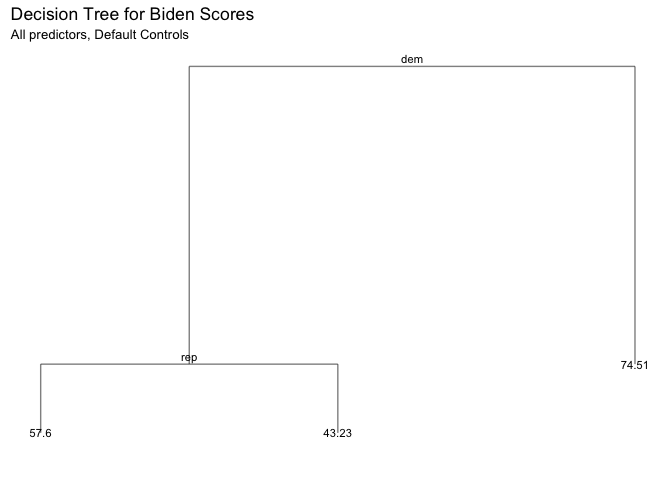 This tree predicts democrats to be associated with a biden score of 74.51. Republicans are predicted to have a biden warmth score of 43.23 and respondents who are neither democrat nor republican are predicted to have a biden score of 57.6.

The MSE of this tree is 406.

### Part 3

``` r
set.seed(1234) # For reproducibility

biden_tree_2 <- tree(biden ~ ., data = biden_split$train,
     control = tree.control(nobs = nrow(biden_split$train),
                            mindev = 0))
mod <- biden_tree_2

mse_biden_2 <- mse(biden_tree_2, biden_split$test)

num_nodes <- 2:25
pruned_trees <- map(num_nodes, prune.tree, tree = biden_tree_2, k = NULL)
test_mses <- map_dbl(pruned_trees, mse, data = biden_split$test)

tree.opt <- pruned_trees[[which.min(test_mses)]]
opt_test_mse <- mse(tree.opt, biden_split$test)

tibble(num_nodes = num_nodes, test_mse = test_mses) %>%
  ggplot(aes(x = num_nodes, y = test_mse)) +
  geom_line() + 
  labs(title = 'Test MSE for Different Numbers of Terminal Nodes',
       subtitle = '(Test MSE calculated on Test data defined in Step 1)',
       x = 'Terminal Nodes in Tree',
       y = 'Test MSE')
```


``` r
biden_pruned <- prune.tree(biden_tree_2, best=11)
mse_pruned = mse(biden_pruned,biden_split$test)
```

This plot shows that the number of terminal nodes that results in the lowest MSE (for the testing data) is 11.

``` r
plot(biden_pruned, col='black', lwd=2.5)
title("Regression Tree for Biden Scores")
text(biden_pruned, col='black')
```

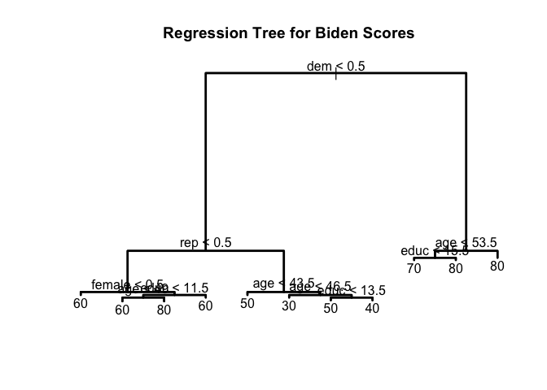 From this tree, we can see that the political party affiliation continues to be the most important indicator for biden warmth scale. For republicans, gender is the second most important indicator. This is in line with previous research which showed that gender has a significant effect on biden warmth score. For democrats and unaffiliated, age is the second strongest predictor of warmth score.

The MSE of this tree is 401.

### Part 4

``` r
df = read.csv('biden.csv')
df$Party[df$dem == 1] = 'Democrat'
df$Party[df$dem == 0 & df$rep == 0] = 'No Affiliation'
df$Party[df$rep == 1] = 'Republican'

set.seed(1234)

biden_split7030 = resample_partition(df, c(test = 0.3, train = 0.7))
biden_train70 = biden_split7030$train %>%
                tbl_df()
biden_test30 = biden_split7030$test %>%
               tbl_df()

biden_bag_data_train = biden_train70 %>%
                       select(-Party) %>%
                       mutate_each(funs(as.factor(.)), dem, rep) %>%
                       na.omit

biden_bag_data_test = biden_test30 %>%
                      select(-Party) %>%
                      mutate_each(funs(as.factor(.)), dem, rep) %>%
                      na.omit

# estimate model
(bag_biden <- randomForest(biden ~ ., data = biden_bag_data_train, mtry = 5, ntree = 500, importance=TRUE))
```

    ## 
    ## Call:
    ##  randomForest(formula = biden ~ ., data = biden_bag_data_train,      mtry = 5, ntree = 500, importance = TRUE) 
    ##                Type of random forest: regression
    ##                      Number of trees: 500
    ## No. of variables tried at each split: 5
    ## 
    ##           Mean of squared residuals: 497
    ##                     % Var explained: 8.91

``` r
# find MSE
mse_bag_biden = mse(bag_biden, biden_bag_data_test)
```

The MSE for this model is 486, significantly higher than the previous, simpler model. The model only explains 8.91% of the variation which is low.

``` r
set.seed(1234)

bag_biden_importance = as.data.frame(importance(bag_biden))

ggplot(bag_biden_importance, mapping=aes(x=rownames(bag_biden_importance), y=IncNodePurity)) +
       geom_bar(stat="identity", aes(fill=IncNodePurity)) +
       labs(title = "Average Increased Node Purity Across 500 Regression Trees",
       x = "Variable",
       y = "Mean Increased Node Purity") + 
       theme(plot.title = element_text(hjust = 0.5), plot.subtitle = element_text(hjust = 0.5),
             panel.border = element_rect(linetype = "solid", color = "grey70", fill=NA, size=1.1), legend.position = 'none') 
```

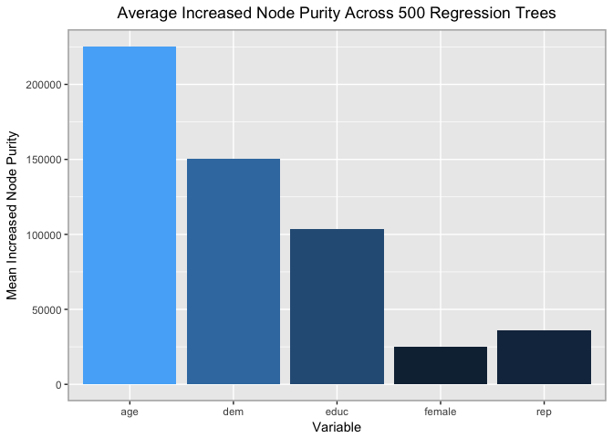 Age and democrat produce the highest increase in node purity.

### Part 5

``` r
set.seed(1234)

(biden_rf <- randomForest(biden ~ ., data = biden_bag_data_train,mtry =2,ntree = 500))
```

    ## 
    ## Call:
    ##  randomForest(formula = biden ~ ., data = biden_bag_data_train,      mtry = 2, ntree = 500) 
    ##                Type of random forest: regression
    ##                      Number of trees: 500
    ## No. of variables tried at each split: 2
    ## 
    ##           Mean of squared residuals: 404
    ##                     % Var explained: 25.9

``` r
mse_rf = mse(biden_rf, biden_bag_data_test)

rf_biden_importance = as.data.frame(importance(biden_rf))

ggplot(rf_biden_importance, mapping=aes(x=rownames(rf_biden_importance), y=IncNodePurity)) +
       geom_bar(stat="identity", aes(fill=IncNodePurity)) +
       labs(title = "Average Increased Node Purity Across 500 Regression Trees",
       x = "Variable",
       y = "Mean Increased Node Purity") + 
       theme(plot.title = element_text(hjust = 0.5), plot.subtitle = element_text(hjust = 0.5),
             panel.border = element_rect(linetype = "solid", color = "grey70", fill=NA, size=1.1), legend.position = 'none') 
```

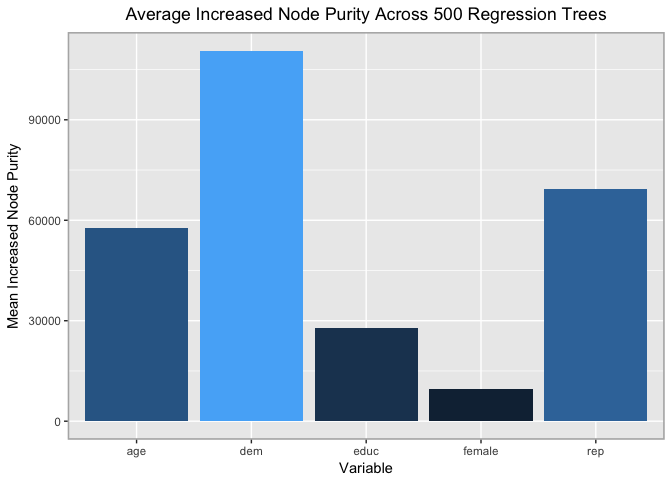 The MSE of the random forest method, 403, is siginifcantly better than the MSE produced by the bagging technique. In the above graph, you can see that the inclusion of the democrat and republican variables led to the highest increase in node purity. This makes sense since political affiliation is a key indicator for feelings towards Joe Biden.

### Part 6

``` r
set.seed(1234)
biden_models <- list("boosting_depth1" = gbm(as.numeric(biden) - 1 ~ .,
                                               data = biden_bag_data_train,
                                               n.trees = 10000, interaction.depth = 1),
                       "boosting_depth2" = gbm(as.numeric(biden) - 1 ~ .,
                                               data = biden_bag_data_train,
                                               n.trees = 10000, interaction.depth = 2),
                       "boosting_depth4" = gbm(as.numeric(biden) - 1 ~ .,
                                               data = biden_bag_data_train,
                                               n.trees = 10000, interaction.depth = 4))
```

    ## Distribution not specified, assuming gaussian ...
    ## Distribution not specified, assuming gaussian ...
    ## Distribution not specified, assuming gaussian ...

``` r
data_frame(depth = c(1, 2, 4),
           model = biden_models[c("boosting_depth1", "boosting_depth2", "boosting_depth4")],
           optimal = map_dbl(model, gbm.perf, plot.it = FALSE)) %>%
  select(-model) %>%
  knitr::kable(caption = "Optimal number of boosting iterations",
               col.names = c("Depth", "Optimal number of iterations"))
```

    ## Using OOB method...

    ## Warning in .f(.x[[i]], ...): OOB generally underestimates the optimal
    ## number of iterations although predictive performance is reasonably
    ## competitive. Using cv.folds>0 when calling gbm usually results in improved
    ## predictive performance.

    ## Using OOB method...

    ## Warning in .f(.x[[i]], ...): OOB generally underestimates the optimal
    ## number of iterations although predictive performance is reasonably
    ## competitive. Using cv.folds>0 when calling gbm usually results in improved
    ## predictive performance.

    ## Using OOB method...

    ## Warning in .f(.x[[i]], ...): OOB generally underestimates the optimal
    ## number of iterations although predictive performance is reasonably
    ## competitive. Using cv.folds>0 when calling gbm usually results in improved
    ## predictive performance.

|  Depth|  Optimal number of iterations|
|------:|-----------------------------:|
|      1|                          3302|
|      2|                          2700|
|      4|                          2094|

``` r
biden_boost_1 = gbm(as.numeric(biden) - 1 ~ .,
                                               data = biden_bag_data_train,
                                               n.trees = 3302, interaction.depth = 1)
```

    ## Distribution not specified, assuming gaussian ...

``` r
biden_boost_2 = gbm(as.numeric(biden) - 1 ~ .,
                                               data = biden_bag_data_train,
                                               n.trees = 2700, interaction.depth = 2)
```

    ## Distribution not specified, assuming gaussian ...

``` r
biden_boost_4 = gbm(as.numeric(biden) - 1 ~ .,
                                               data = biden_bag_data_train,
                                               n.trees = 2094, interaction.depth = 4)
```

    ## Distribution not specified, assuming gaussian ...

``` r
predict.gbm <- function (object, newdata, n.trees, type = "link", single.tree = FALSE, ...) {
  if (missing(n.trees)) {
    if (object$train.fraction < 1) {
      n.trees <- gbm.perf(object, method = "test", plot.it = FALSE)
    }
    else if (!is.null(object$cv.error)) {
      n.trees <- gbm.perf(object, method = "cv", plot.it = FALSE)
    }
    else {
      n.trees <- length(object$train.error)
    }
    cat(paste("Using", n.trees, "trees...\n"))
    gbm::predict.gbm(object, newdata, n.trees, type, single.tree, ...)
  }
}
mse_1 = mse(biden_boost_1,biden_bag_data_test)
```

    ## Using 3302 trees...

``` r
mse_2 = mse(biden_boost_2,biden_bag_data_test)
```

    ## Using 2700 trees...

``` r
mse_4 = mse(biden_boost_4,biden_bag_data_test)
```

    ## Using 2094 trees...

With a depth of 2 and an optimal number of iterations of 2700, we get an MSE of 403 which is the best result from the boosting method. A depth of 1 and 3302 iterations, we see an MSE of 406, and with a depth of 4 and 2094 iterations, there is an MSE of 405.

``` r
set.seed(1234)

biden_boost_1 = gbm(as.numeric(biden) - 1 ~ .,
                                               data = biden_bag_data_train,
                                               n.trees = 3302, interaction.depth = 1,shrinkage=0.02)
```

    ## Distribution not specified, assuming gaussian ...

``` r
biden_boost_2 = gbm(as.numeric(biden) - 1 ~ .,
                                               data = biden_bag_data_train,
                                               n.trees = 2700, interaction.depth = 2,shrinkage=0.02)
```

    ## Distribution not specified, assuming gaussian ...

``` r
biden_boost_4 = gbm(as.numeric(biden) - 1 ~ .,
                                               data = biden_bag_data_train,
                                               n.trees = 2094, interaction.depth = 4,shrinkage=0.02)
```

    ## Distribution not specified, assuming gaussian ...

``` r
mse_1 = mse(biden_boost_1,biden_bag_data_test)
```

    ## Using 3302 trees...

``` r
mse_2 = mse(biden_boost_2,biden_bag_data_test)
```

    ## Using 2700 trees...

``` r
mse_4 = mse(biden_boost_4,biden_bag_data_test)
```

    ## Using 2094 trees...

It would seem that increasing the default shrinkage from 0.001 to 0.01 causes the majority of the tree MSEs to increase. The excpetion to this is the tree with depth 1, whose MSE decreased from 406 to 405. The tree with depth 2 increased from 403 to 416 and the tree with depth 4 increased from 405 to 429.

Question 2: Mental Health and Voting
------------------------------------

### Part 1: trees

#### Model 1: eduction as predictor

``` r
mh_tree <- tree(vote96 ~ educ, data = as_tibble(mh_split$train))
mh_tree
```

    ## node), split, n, deviance, yval, (yprob)
    ##       * denotes terminal node
    ## 
    ## 1) root 816 1000 1 ( 0 1 )  
    ##   2) educ < 14.5 554  700 1 ( 0 1 )  
    ##     4) educ < 11.5 132  200 0 ( 1 0 ) *
    ##     5) educ > 11.5 422  600 1 ( 0 1 ) *
    ##   3) educ > 14.5 262  200 1 ( 0 1 ) *

``` r
plot(mh_tree)
text(mh_tree, pretty = 0)
```


``` r
fitted <- predict(mh_tree, as_tibble(mh_split$test), type = "class")
tree_err <- mean(as_tibble(mh_split$test)$vote96 != fitted)
tree_err
```

    ## [1] 0.301

``` r
roc_tree1 <- roc(as.numeric(as_tibble(mh_split$test)$vote96), as.numeric(fitted))
plot(roc_tree1)
```

 Area under the curve is 0.579.

#### Model 2: education and mental health score

``` r
mh_tree <- tree(vote96 ~ educ + mhealth_sum, data = as_tibble(mh_split$train))
mh_tree
```

    ## node), split, n, deviance, yval, (yprob)
    ##       * denotes terminal node
    ## 
    ## 1) root 816 1000 1 ( 0 1 )  
    ##   2) mhealth_sum < 4.5 639  700 1 ( 0 1 )  
    ##     4) educ < 15.5 450  600 1 ( 0 1 ) *
    ##     5) educ > 15.5 189  100 1 ( 0 1 ) *
    ##   3) mhealth_sum > 4.5 177  200 0 ( 1 0 ) *

``` r
plot(mh_tree)
text(mh_tree, pretty = 0)
```

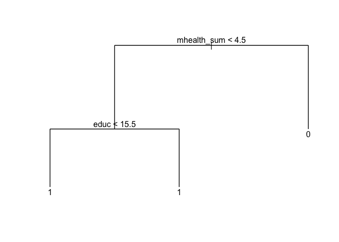

``` r
fitted <- predict(mh_tree, as_tibble(mh_split$test), type = "class")
tree_err <- mean(as_tibble(mh_split$test)$vote96 != fitted)
tree_err
```

    ## [1] 0.301

``` r
roc_tree2 <- roc(as.numeric(as_tibble(mh_split$test)$vote96), as.numeric(fitted))
plot(roc_tree2)
```


``` r
auc(roc_tree2)
```

    ## Area under the curve: 0.601

Area under the curve is 0.601. This is slightly higher than the first model.

#### Model 3: Education, mental health score, and age

``` r
mh_tree <- tree(vote96 ~ educ + mhealth_sum + age, data = as_tibble(mh_split$train))
mh_tree
```

    ## node), split, n, deviance, yval, (yprob)
    ##       * denotes terminal node
    ## 
    ##  1) root 816 1000 1 ( 0 1 )  
    ##    2) age < 44.5 448  600 1 ( 0 1 )  
    ##      4) educ < 13.5 243  300 0 ( 1 0 ) *
    ##      5) educ > 13.5 205  200 1 ( 0 1 )  
    ##       10) mhealth_sum < 3.5 153  200 1 ( 0 1 )  
    ##         20) educ < 16.5 119  100 1 ( 0 1 ) *
    ##         21) educ > 16.5 34    9 1 ( 0 1 ) *
    ##       11) mhealth_sum > 3.5 52   70 0 ( 1 0 ) *
    ##    3) age > 44.5 368  400 1 ( 0 1 )  
    ##      6) educ < 12.5 180  200 1 ( 0 1 )  
    ##       12) mhealth_sum < 4.5 138  100 1 ( 0 1 ) *
    ##       13) mhealth_sum > 4.5 42   60 0 ( 1 0 ) *
    ##      7) educ > 12.5 188  100 1 ( 0 1 ) *

``` r
plot(mh_tree)
text(mh_tree, pretty = 0)
```


``` r
fitted <- predict(mh_tree, as_tibble(mh_split$test), type = "class")
tree_err <- mean(as_tibble(mh_split$test)$vote96 != fitted)
tree_err
```

    ## [1] 0.289

``` r
roc_tree3 <- roc(as.numeric(as_tibble(mh_split$test)$vote96), as.numeric(fitted))
plot(roc_tree3)
```

 Area under the curve is 0.686. Again, this is an improvement from the first and second models.

#### Model 4: Education, mental health score, age, and income as predictors

``` r
mh_tree <- tree(vote96 ~ educ + mhealth_sum + age + inc10, data = as_tibble(mh_split$train))
mh_tree
```

    ## node), split, n, deviance, yval, (yprob)
    ##       * denotes terminal node
    ## 
    ##  1) root 816 1000 1 ( 0 1 )  
    ##    2) age < 44.5 448  600 1 ( 0 1 )  
    ##      4) educ < 13.5 243  300 0 ( 1 0 ) *
    ##      5) educ > 13.5 205  200 1 ( 0 1 )  
    ##       10) mhealth_sum < 3.5 153  200 1 ( 0 1 )  
    ##         20) inc10 < 2.40745 31   40 1 ( 0 1 ) *
    ##         21) inc10 > 2.40745 122  100 1 ( 0 1 )  
    ##           42) educ < 16.5 89   90 1 ( 0 1 ) *
    ##           43) educ > 16.5 33    0 1 ( 0 1 ) *
    ##       11) mhealth_sum > 3.5 52   70 0 ( 1 0 ) *
    ##    3) age > 44.5 368  400 1 ( 0 1 )  
    ##      6) educ < 12.5 180  200 1 ( 0 1 )  
    ##       12) mhealth_sum < 4.5 138  100 1 ( 0 1 )  
    ##         24) inc10 < 1.08335 31   40 1 ( 0 1 ) *
    ##         25) inc10 > 1.08335 107   90 1 ( 0 1 ) *
    ##       13) mhealth_sum > 4.5 42   60 0 ( 1 0 ) *
    ##      7) educ > 12.5 188  100 1 ( 0 1 ) *

``` r
plot(mh_tree)
text(mh_tree, pretty = 0)
```


``` r
fitted <- predict(mh_tree, as_tibble(mh_split$test), type = "class")
tree_err <- mean(as_tibble(mh_split$test)$vote96 != fitted)
tree_err
```

    ## [1] 0.289

``` r
roc_tree4 <- roc(as.numeric(as_tibble(mh_split$test)$vote96), as.numeric(fitted))
plot(roc_tree4)
```

 The area under the surve is 0.686. This is the same as the model excluded income.

#### Model 5: Total model

``` r
mh_tree <- tree(vote96 ~ ., data = as_tibble(mh_split$train))
mh_tree
```

    ## node), split, n, deviance, yval, (yprob)
    ##       * denotes terminal node
    ## 
    ##  1) root 816 1000 1 ( 0 1 )  
    ##    2) age < 44.5 448  600 1 ( 0 1 )  
    ##      4) educ < 13.5 243  300 0 ( 1 0 ) *
    ##      5) educ > 13.5 205  200 1 ( 0 1 )  
    ##       10) mhealth_sum < 3.5 153  200 1 ( 0 1 )  
    ##         20) inc10 < 2.40745 31   40 1 ( 0 1 ) *
    ##         21) inc10 > 2.40745 122  100 1 ( 0 1 )  
    ##           42) educ < 16.5 89   90 1 ( 0 1 ) *
    ##           43) educ > 16.5 33    0 1 ( 0 1 ) *
    ##       11) mhealth_sum > 3.5 52   70 0 ( 1 0 ) *
    ##    3) age > 44.5 368  400 1 ( 0 1 )  
    ##      6) educ < 12.5 180  200 1 ( 0 1 )  
    ##       12) mhealth_sum < 4.5 138  100 1 ( 0 1 )  
    ##         24) inc10 < 1.08335 31   40 1 ( 0 1 ) *
    ##         25) inc10 > 1.08335 107   90 1 ( 0 1 ) *
    ##       13) mhealth_sum > 4.5 42   60 0 ( 1 0 ) *
    ##      7) educ > 12.5 188  100 1 ( 0 1 ) *

``` r
plot(mh_tree)
text(mh_tree, pretty = 0)
```


``` r
fitted <- predict(mh_tree, as_tibble(mh_split$test), type = "class")
tree_err <- mean(as_tibble(mh_split$test)$vote96 != fitted)
tree_err
```

    ## [1] 0.289

``` r
roc_tree5 <- roc(as.numeric(as_tibble(mh_split$test)$vote96), as.numeric(fitted))
plot(roc_tree5)
```

 The area under the curve is, again, 0.686.

``` r
plot(roc_tree1, print.auc = TRUE, col = "blue", print.auc.x = .2)
plot(roc_tree2, print.auc = TRUE, col = "red", print.auc.x = .2, print.auc.y = .4, add = TRUE)
plot(roc_tree3, print.auc = TRUE, col = "orange", print.auc.x = .2, print.auc.y = .3, add = TRUE)
plot(roc_tree4, print.auc = TRUE, col = "green", print.auc.x = .2, print.auc.y = .2, add = TRUE)
plot(roc_tree5, print.auc = TRUE, col = "purple", print.auc.x = .2, print.auc.y = .1, add = TRUE)
```


These models slowly increase the number of variables used to explain the response variable. First, only education was used in the model. This resulted in the lowest AUC, 0.579. This makes sense since in most social science cases, using only one explanatory variable often leads to incomplete results. The second model, using education and mental health score led to a higher AUC, 0.601. In the third model, age was included in addition to education and mental health score. This led to the highest AUC seen, 0.686. The following models produces the same area under the curve, suggesting that the variables income, race, gender, and marital status are not the most important predictors of who is likely to vote and who is not. These models are not as good as the third model since the AUC is the same, but the computational cost increases.

From the trees themselves, we can make some interesting predictions. Firstly, I can predict that younger individuals who have less than 13.5 years of schooling (less than a high school degree) are not likely to vote. If an individual is young (less than 44.5 years old), but has a higher education and a mental health score of less than 3.5, I can predict that they will vote. However, young, educated individuals who have higher mental health scores are predicted to not vote. If an older individual is less educated and has a higher mental health score, I predict they will not vote, while it seems as though indiviudals greater than 44.5 and with more years of education will vote regardless of mental health score.

It is interesting to observe that, although these data show that mental health has an important influence on voting patterns, it is still not the most important indicator of who votes and who does not. From this tree, and the previous trees produced, we can see that age and education are more important influencers.

``` r
mh_tree <- tree(vote96 ~ educ + mhealth_sum + age, data = as_tibble(mh_split$train))
mh_tree
```

    ## node), split, n, deviance, yval, (yprob)
    ##       * denotes terminal node
    ## 
    ##  1) root 816 1000 1 ( 0 1 )  
    ##    2) age < 44.5 448  600 1 ( 0 1 )  
    ##      4) educ < 13.5 243  300 0 ( 1 0 ) *
    ##      5) educ > 13.5 205  200 1 ( 0 1 )  
    ##       10) mhealth_sum < 3.5 153  200 1 ( 0 1 )  
    ##         20) educ < 16.5 119  100 1 ( 0 1 ) *
    ##         21) educ > 16.5 34    9 1 ( 0 1 ) *
    ##       11) mhealth_sum > 3.5 52   70 0 ( 1 0 ) *
    ##    3) age > 44.5 368  400 1 ( 0 1 )  
    ##      6) educ < 12.5 180  200 1 ( 0 1 )  
    ##       12) mhealth_sum < 4.5 138  100 1 ( 0 1 ) *
    ##       13) mhealth_sum > 4.5 42   60 0 ( 1 0 ) *
    ##      7) educ > 12.5 188  100 1 ( 0 1 ) *

``` r
plot(mh_tree)
text(mh_tree, pretty = 0)
```

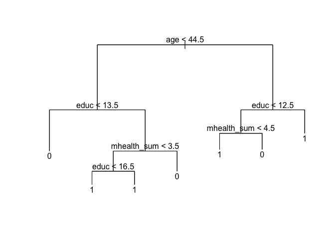

Part 2: SVMs
------------

``` r
mh_split <- resample_partition(mh_data, p = c("test" = .3, "train" = .7))
```

#### Model 1: Linear Kernel with education, age, mhealthsum

``` r
mh_lin_tune <- tune(svm, vote96 ~ educ + age + mhealth_sum, data = as_tibble(mh_split$train),
                    kernel = "linear",
                    range = list(cost = c(.001, .01, .1, 1, 5, 10, 100)))

mh_lin <- mh_lin_tune$best.model
summary(mh_lin)
```

    ## 
    ## Call:
    ## best.tune(method = svm, train.x = vote96 ~ educ + age + mhealth_sum, 
    ##     data = as_tibble(mh_split$train), ranges = list(cost = c(0.001, 
    ##         0.01, 0.1, 1, 5, 10, 100)), kernel = "linear")
    ## 
    ## 
    ## Parameters:
    ##    SVM-Type:  C-classification 
    ##  SVM-Kernel:  linear 
    ##        cost:  1 
    ##       gamma:  0.333 
    ## 
    ## Number of Support Vectors:  511
    ## 
    ##  ( 255 256 )
    ## 
    ## 
    ## Number of Classes:  2 
    ## 
    ## Levels: 
    ##  0 1

``` r
fitted <- predict(mh_lin, as_tibble(mh_split$test), decision.values = TRUE) %>%
  attributes


roc_line <- roc(as_tibble(mh_split$test)$vote96, fitted$decision.values)
```

    ## Warning in roc.default(as_tibble(mh_split$test)$vote96, fitted
    ## $decision.values): Deprecated use a matrix as predictor. Unexpected results
    ## may be produced, please pass a numeric vector.

``` r
auc(roc_line)
```

    ## Area under the curve: 0.737

``` r
plot(roc_line, main = "ROC of Voter Turnout - Linear Kernel, Partial Model")
```

 The area under the curve is 0.737.

#### Model 2: Linear Kernel with all variables

``` r
mh_lin_all <- tune(svm, vote96 ~ ., data = as_tibble(mh_split$train),
                    kernel = "linear",
                    range = list(cost = c(.001, .01, .1, 1, 5, 10, 100)))

mh_lall <- mh_lin_all$best.model
summary(mh_lall)
```

    ## 
    ## Call:
    ## best.tune(method = svm, train.x = vote96 ~ ., data = as_tibble(mh_split$train), 
    ##     ranges = list(cost = c(0.001, 0.01, 0.1, 1, 5, 10, 100)), 
    ##     kernel = "linear")
    ## 
    ## 
    ## Parameters:
    ##    SVM-Type:  C-classification 
    ##  SVM-Kernel:  linear 
    ##        cost:  10 
    ##       gamma:  0.125 
    ## 
    ## Number of Support Vectors:  507
    ## 
    ##  ( 255 252 )
    ## 
    ## 
    ## Number of Classes:  2 
    ## 
    ## Levels: 
    ##  0 1

``` r
fitted <- predict(mh_lall, as_tibble(mh_split$test), decision.values = TRUE) %>%
  attributes


roc_line_all <- roc(as_tibble(mh_split$test)$vote96, fitted$decision.values)
```

    ## Warning in roc.default(as_tibble(mh_split$test)$vote96, fitted
    ## $decision.values): Deprecated use a matrix as predictor. Unexpected results
    ## may be produced, please pass a numeric vector.

``` r
auc(roc_line_all)
```

    ## Area under the curve: 0.746

``` r
plot(roc_line_all, main = "ROC of Voter Turnout- Linear Kernel, Total Model")
```

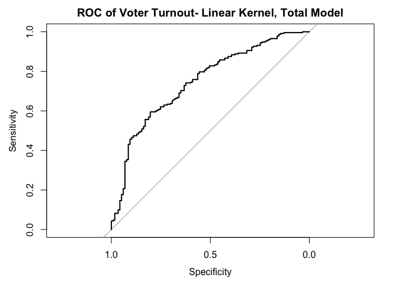 Area under the curve is 0.746.

#### Model 3: Polynomial Kernel with education, age, mhealth

``` r
mh_poly_tune <- tune(svm, vote96 ~ age + educ + mhealth_sum, data = as_tibble(mh_split$train),
                    kernel = "polynomial",
                    range = list(cost = c(.001, .01, .1, 1, 5, 10, 100)))

mh_poly <- mh_poly_tune$best.model
summary(mh_poly)
```

    ## 
    ## Call:
    ## best.tune(method = svm, train.x = vote96 ~ age + educ + mhealth_sum, 
    ##     data = as_tibble(mh_split$train), ranges = list(cost = c(0.001, 
    ##         0.01, 0.1, 1, 5, 10, 100)), kernel = "polynomial")
    ## 
    ## 
    ## Parameters:
    ##    SVM-Type:  C-classification 
    ##  SVM-Kernel:  polynomial 
    ##        cost:  10 
    ##      degree:  3 
    ##       gamma:  0.333 
    ##      coef.0:  0 
    ## 
    ## Number of Support Vectors:  494
    ## 
    ##  ( 248 246 )
    ## 
    ## 
    ## Number of Classes:  2 
    ## 
    ## Levels: 
    ##  0 1

``` r
fitted <- predict(mh_poly, as_tibble(mh_split$test), decision.values = TRUE) %>%
  attributes

roc_poly <- roc(as_tibble(mh_split$test)$vote96, fitted$decision.values)
```

    ## Warning in roc.default(as_tibble(mh_split$test)$vote96, fitted
    ## $decision.values): Deprecated use a matrix as predictor. Unexpected results
    ## may be produced, please pass a numeric vector.

``` r
plot(roc_poly, main = "ROC of Voter Turnout - Polynomial Kernel, Partial Model")
```

 The area under the curve is 0.743.

#### Model 4: Polynomial Kernel with all variables

``` r
mh_poly_all <- tune(svm, vote96 ~ ., data = as_tibble(mh_split$train),
                    kernel = "polynomial",
                    range = list(cost = c(.001, .01, .1, 1, 5, 10, 100)))

mh_poly <- mh_poly_all$best.model
summary(mh_poly)
```

    ## 
    ## Call:
    ## best.tune(method = svm, train.x = vote96 ~ ., data = as_tibble(mh_split$train), 
    ##     ranges = list(cost = c(0.001, 0.01, 0.1, 1, 5, 10, 100)), 
    ##     kernel = "polynomial")
    ## 
    ## 
    ## Parameters:
    ##    SVM-Type:  C-classification 
    ##  SVM-Kernel:  polynomial 
    ##        cost:  5 
    ##      degree:  3 
    ##       gamma:  0.125 
    ##      coef.0:  0 
    ## 
    ## Number of Support Vectors:  495
    ## 
    ##  ( 258 237 )
    ## 
    ## 
    ## Number of Classes:  2 
    ## 
    ## Levels: 
    ##  0 1

``` r
fitted <- predict(mh_poly, as_tibble(mh_split$test), decision.values = TRUE) %>%
  attributes

roc_poly_all <- roc(as_tibble(mh_split$test)$vote96, fitted$decision.values)
```

    ## Warning in roc.default(as_tibble(mh_split$test)$vote96, fitted
    ## $decision.values): Deprecated use a matrix as predictor. Unexpected results
    ## may be produced, please pass a numeric vector.

``` r
plot(roc_poly_all, main = "ROC of Voter Turnout - Polynomial Kernel, Total Model")
```

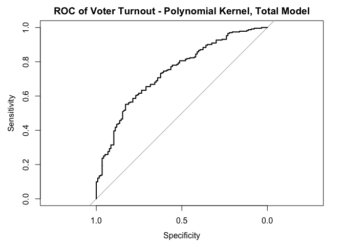 Area under the curve: 0.741.

#### Model 5: Radial Kernel

``` r
mh_rad_tune <- tune(svm, vote96 ~ ., data = as_tibble(mh_split$train),
                    kernel = "radial",
                    range = list(cost = c(.001, .01, .1, 1, 5, 10, 100)))

mh_rad <- mh_rad_tune$best.model
summary(mh_rad)
```

    ## 
    ## Call:
    ## best.tune(method = svm, train.x = vote96 ~ ., data = as_tibble(mh_split$train), 
    ##     ranges = list(cost = c(0.001, 0.01, 0.1, 1, 5, 10, 100)), 
    ##     kernel = "radial")
    ## 
    ## 
    ## Parameters:
    ##    SVM-Type:  C-classification 
    ##  SVM-Kernel:  radial 
    ##        cost:  5 
    ##       gamma:  0.125 
    ## 
    ## Number of Support Vectors:  494
    ## 
    ##  ( 258 236 )
    ## 
    ## 
    ## Number of Classes:  2 
    ## 
    ## Levels: 
    ##  0 1

``` r
fitted <- predict(mh_rad, as_tibble(mh_split$test), decision.values = TRUE) %>%
  attributes

roc_rad <- roc(as_tibble(mh_split$test)$vote96, fitted$decision.values)
```

    ## Warning in roc.default(as_tibble(mh_split$test)$vote96, fitted
    ## $decision.values): Deprecated use a matrix as predictor. Unexpected results
    ## may be produced, please pass a numeric vector.

``` r
plot(roc_rad, main= "ROC of Voter Turnout - Radial Kernel, Total Model")
```

 Area under the curve is 0.737.

``` r
plot(roc_line, print.auc = TRUE, col = "blue", print.auc.x = .2)
plot(roc_line_all, print.auc = TRUE, col = "red", print.auc.x = .2, print.auc.y = .4, add = TRUE)
plot(roc_poly, print.auc = TRUE, col = "orange", print.auc.x = .2, print.auc.y = .3, add = TRUE)
plot(roc_poly_all, print.auc = TRUE, col = "green", print.auc.x = .2, print.auc.y = .2, add = TRUE)
plot(roc_rad, print.auc = TRUE, col = "purple", print.auc.x = .2, print.auc.y = .1, add = TRUE)
```


The best model, in this case is the linear kernel with only education, age, and mental health. This model has the highest area under the curve so it is the most distinguished from the useless classifier. This model has a cost of 1, so the margins are narrow around the linear hyperplane. As we can see from the plot below, the error drops to below 0.3 and remains there, regardless of the increases error.

``` r
plot(mh_lin_tune)
```

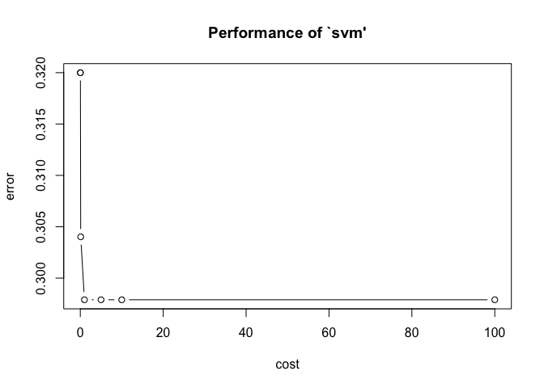

The plots below show the SVMs, each plotting 2 out of the 3 important indicators for voting patterns.

``` r
svm(vote96 ~ age + educ + mhealth_sum, data = as_tibble(mh_split$test), kernel = "linear", scale = FALSE, cost = 1) %>%
  plot(as_tibble(mh_split$test), age ~ educ)
```

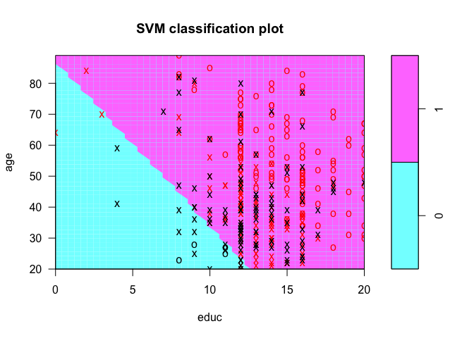 This plot shows that as education and age increase, individuals are more and more likely to have voted. Looking at the plot, however, there do seem to be a few misclassifications.

``` r
svm(vote96 ~ educ + mhealth_sum + age, data = as_tibble(mh_split$test), kernel = "linear", scale = FALSE, cost = 1) %>%
  plot(as_tibble(mh_split$test), educ ~ mhealth_sum)
```

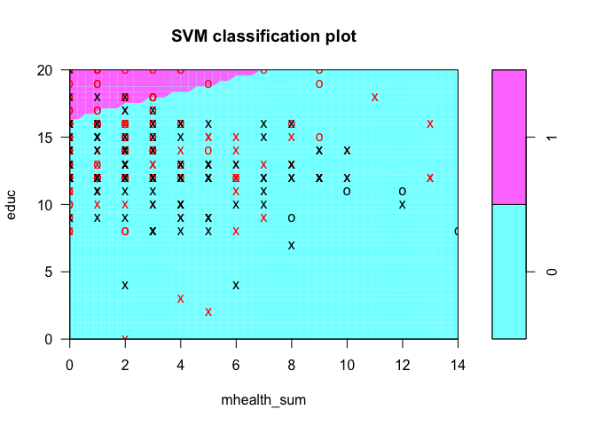 This plot shows that individuals with high education and low mental health sums are predicted to have voted. It is interesting to note that individuals with high mental health scores are predicted to not have voted, regardless of potentially high levels of education.

``` r
svm(vote96 ~ mhealth_sum + age + educ, data = as_tibble(mh_split$test), kernel = "linear", scale = FALSE, cost = 1) %>%
  plot(as_tibble(mh_split$test), mhealth_sum ~ age)
```

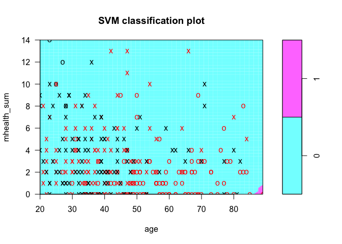 This plot is very interesting because there is only the tiniest bit of purple (indicating predicted vote). Individuals who are very old and have a low mental health sum are predicted to have voted. However, theredoes appear to be a good number of misclassifications in this plot.

Question 3: OJ Simpson
----------------------

### Part 1

In order to find an inferential relationship between beliefs on OJ Simpson's guilt and various predictor variables, I chose to use logistic regression. This is because logistic regression provides information that we can use inference and it makes sense statistically since we're dealing with a dichotomous response variable.

``` r
oj_pred <- glm(guilt ~ ., data= oj, family=binomial())
```

    ## Warning: Dropping 153 rows with missing values

``` r
summary(oj_pred)
```

    ## 
    ## Call:
    ## glm(formula = guilt ~ ., family = binomial(), data = oj)
    ## 
    ## Deviance Residuals: 
    ##    Min      1Q  Median      3Q     Max  
    ## -2.515  -0.530   0.503   0.670   2.381  
    ## 
    ## Coefficients: (1 not defined because of singularities)
    ##                                      Estimate Std. Error z value Pr(>|z|)
    ## (Intercept)                           0.96514    0.34522    2.80   0.0052
    ## dem                                   0.07465    0.22419    0.33   0.7392
    ## rep                                   0.51366    0.23445    2.19   0.0285
    ## ind                                        NA         NA      NA       NA
    ## age                                   0.01931    0.00442    4.36  1.3e-05
    ## educHIGH SCHOOL GRAD                 -0.42512    0.19068   -2.23   0.0258
    ## educNOT A HIGH SCHOOL GRAD           -1.13185    0.28261   -4.01  6.2e-05
    ## educREFUSED                          13.32200  478.03049    0.03   0.9778
    ## educSOME COLLEGE(TRADE OR BUSINESS)  -0.28895    0.20038   -1.44   0.1493
    ## female                               -0.35879    0.14909   -2.41   0.0161
    ## black                                -2.92348    0.19333  -15.12  < 2e-16
    ## hispanic                             -0.19697    0.25915   -0.76   0.4472
    ## income$30,000-$50,000                -0.12200    0.19013   -0.64   0.5211
    ## income$50,000-$75,000                 0.17810    0.24748    0.72   0.4717
    ## incomeOVER $75,000                    0.52135    0.31186    1.67   0.0946
    ## incomeREFUSED/NO ANSWER              -0.90688    0.31505   -2.88   0.0040
    ## incomeUNDER $15,000                  -0.18007    0.23959   -0.75   0.4523
    ##                                        
    ## (Intercept)                         ** 
    ## dem                                    
    ## rep                                 *  
    ## ind                                    
    ## age                                 ***
    ## educHIGH SCHOOL GRAD                *  
    ## educNOT A HIGH SCHOOL GRAD          ***
    ## educREFUSED                            
    ## educSOME COLLEGE(TRADE OR BUSINESS)    
    ## female                              *  
    ## black                               ***
    ## hispanic                               
    ## income$30,000-$50,000                  
    ## income$50,000-$75,000                  
    ## incomeOVER $75,000                  .  
    ## incomeREFUSED/NO ANSWER             ** 
    ## incomeUNDER $15,000                    
    ## ---
    ## Signif. codes:  0 '***' 0.001 '**' 0.01 '*' 0.05 '.' 0.1 ' ' 1
    ## 
    ## (Dispersion parameter for binomial family taken to be 1)
    ## 
    ##     Null deviance: 1758.1  on 1415  degrees of freedom
    ## Residual deviance: 1271.1  on 1400  degrees of freedom
    ##   (153 observations deleted due to missingness)
    ## AIC: 1303
    ## 
    ## Number of Fisher Scoring iterations: 13

This logistic regression shows a few interesting and significant relationships. Firstly, being Republican increases one's log odds of thinking OJ is guilty by 0.513. As age goes up, so do the chances that one would think that OJ is guilty, more specifically, with each year increase in age there is a 0.019 increase in log odds. High school graduates are less likely to believe OJ was guilty than are individuals who graudated college "and beyond", although respondents who did not graduate high school are even less likely to believe OJ was guilty, recieving a log odds of -1.131 when compared to college grads. Females are more likely to beleive OJ was innocent than are males. Being black is associated with a decrease in 2.923 log odds of believing that OJ was guilty. Individuals who made over 75,000$ were more likely to belive OJ was guilty than those making 15-30,000$ while those who refused to answer are correlated with a decrease in log odds of 0.907.

``` r
logit2prob <- function(x){
 exp(x) / (1 + exp(x))
}

accuracy <- oj %>%
  add_predictions(oj_pred) %>%
  mutate(pred = logit2prob(pred),
         pred = as.numeric(pred > .5))
```

    ## Warning in predict.lm(object, newdata, se.fit, scale = 1, type =
    ## ifelse(type == : prediction from a rank-deficient fit may be misleading

``` r
model_accuracy_log = mean(accuracy$guilt == accuracy$pred, na.rm = TRUE)

PRE <- function(model){
  y <- model$y

   y.hat <- round(model$fitted.values)
   
  E1 <- sum(y != median(y))
  E2 <- sum(y != y.hat)


  PRE <- (E1 - E2) / E1
  return(PRE)
}

pre_log <- PRE(oj_pred)
auc_log <- auc(accuracy$guilt, accuracy$pred)

model_accuracy_log
```

    ## [1] 0.816

``` r
pre_log
```

    ## [1] 0.412

``` r
auc_log
```

    ## Area under the curve: 0.736

The model accuracy is 81.6%. The proportional error reduction is 0.412. The area under the curve is 0.736.

### Part 2

``` r
set.seed(1234)
oj_split = resample_partition(oj, c(test=.3, train=.7))
oj_train = oj_split$train

ojj <- oj_train %>%
  as_tibble() %>%
  mutate(guilty = factor(guilt, levels = 0:1, labels = c("Not Guilty", "Guilty")))

oj_tree <- tree(guilt ~ ., data = oj,
                     control = tree.control(nobs = nrow(oj),
                            mindev = .001))
```

    ## Warning: Dropping 153 rows with missing values

``` r
mod <- oj_tree

tree_data <- dendro_data(mod)
ggplot(segment(tree_data)) +
  geom_segment(aes(x = x, y = y, xend = xend, yend = yend), 
               alpha = 0.5) +
  geom_text(data = label(tree_data), 
            aes(x = x, y = y, label = label), vjust = -0.5, size = 3) +
  geom_text(data = leaf_label(tree_data), 
            aes(x = x, y = y, label = label), vjust = 0.5, size = 3) +
  theme_dendro()
```


``` r
mse1 = mse(oj_tree, oj_split$test)
msetest = mse(mod, oj_split$test)
```

The MSE for this first tree is 0.111.

``` r
err.rate.tree <- function(model, data) {
  data <- as_tibble(data)
  response <- as.character(model$terms[[2]])
  
  pred <- predict(model, newdata = data, type = "class")
  actual <- data[[response]]
  
  return(mean(pred != actual, na.rm = TRUE))
}

oj_cv2 <- oj %>%
  na.omit() %>%
  crossv_kfold(k = 10) %>%
  mutate(tree = map(train, ~ tree(guilt ~ ., data = .,
     control = tree.control(nobs = nrow(oj),
                            mindev = .001))))

oj_cv2 <- expand.grid(oj_cv2$.id, 2:10) %>%
  as_tibble() %>%
  mutate(Var2 = as.numeric(Var2)) %>%
  rename(.id = Var1,
         k = Var2) %>%
  left_join(oj_cv2) %>%
  mutate(prune = map2(tree, k, ~ prune.tree(.x, best = .y)),
         mse = map2_dbl(prune, test, mse))
```

    ## Joining, by = ".id"

    ## Warning in left_join_impl(x, y, by$x, by$y, suffix$x, suffix$y): joining
    ## character vector and factor, coercing into character vector

``` r
oj_cv2 %>%
  group_by(k) %>%
  summarize(test_mse = mean(mse),
            sd = sd(mse, na.rm = TRUE)) %>%
  ggplot(aes(k, test_mse)) +
  geom_point() +
  geom_line() +
  labs(title = "OJ Simpson guilt tree",
       x = "Number of terminal nodes",
       y = "Test error rate")
```


``` r
mod1 <- prune.tree(oj_tree, best = 3)

tree_data <- dendro_data(mod1)
ggplot(segment(tree_data)) +
  geom_segment(aes(x = x, y = y, xend = xend, yend = yend), 
               alpha = 0.5) +
  geom_text(data = label(tree_data), 
            aes(x = x, y = y, label = label), vjust = -0.5, size = 3) +
  geom_text(data = leaf_label(tree_data), 
            aes(x = x, y = y, label = label), vjust = 0.5, size = 3) +
  theme_dendro() +
  labs(title = "OJ Simpson guilt tree")
```

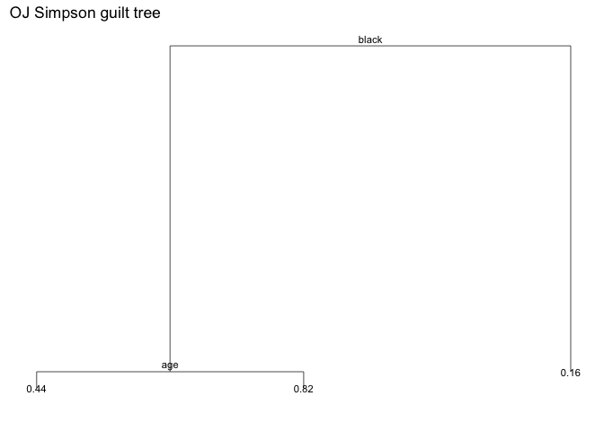

``` r
plot(mod1)
text(mod1, pretty = 0)
```

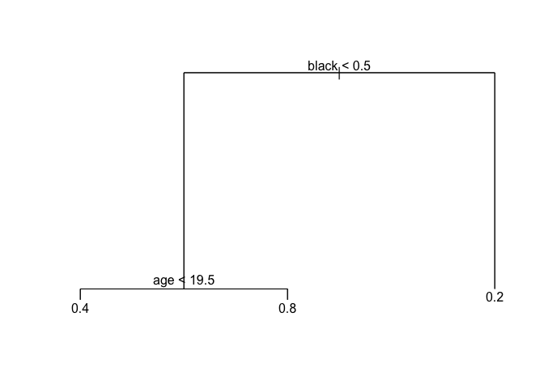 This tree shows that black individuals are predicted to find OJ Simpson not guilty, regardless of age. When considering age, older individuals are more likely to find OJ guilty than are younger individuals. Although not reported in the first tree, the line of demarcation for age is 19.5 years old.

``` r
mse2 = mse(mod1, oj_split$test)
```

The MSE for this pruned tree is now 0.139. This is slightly higher than the original tree, indicating that we have lost some valuable information. This tree could be considered best since it is very easy to read and it has the lowest test error rate.

``` r
oj_train = oj_split$train %>%
                tbl_df()
oj_test = oj_split$test %>%
               tbl_df()

oj_bag_train = oj_train %>%
                na.omit

oj_bag_test = oj_test %>%
                na.omit

# estimate model
(oj_bag <- randomForest(guilt ~ ., data = oj_bag_train, mtry = 5, ntree = 500, importance=TRUE))
```

    ## Warning in randomForest.default(m, y, ...): The response has five or fewer
    ## unique values. Are you sure you want to do regression?

    ## 
    ## Call:
    ##  randomForest(formula = guilt ~ ., data = oj_bag_train, mtry = 5,      ntree = 500, importance = TRUE) 
    ##                Type of random forest: regression
    ##                      Number of trees: 500
    ## No. of variables tried at each split: 5
    ## 
    ##           Mean of squared residuals: 0.165
    ##                     % Var explained: 23.6

``` r
# find MSE
mse3 = mse(oj_bag, oj_bag_test)
```

The MSE of this bagged method is larger than before, now 0.151. The percent variance explained is now 23.6%.

``` r
oj_import = as.data.frame(importance(oj_bag))

ggplot(oj_import, mapping=aes(x=rownames(oj_import), y=IncNodePurity)) +
       geom_bar(stat="identity", aes(fill=IncNodePurity)) +
       labs(title = "Average Increased Node Purity Across 500 Regression Trees",
       x = "Variable",
       y = "Mean Increased Node Purity") + 
       theme(plot.title = element_text(hjust = 0.5), plot.subtitle = element_text(hjust = 0.5),
             panel.border = element_rect(linetype = "solid", color = "grey70", fill=NA, size=1.1), legend.position = 'none') 
```

 This graph shows that race and age are the indicators which most increase node purity. This means that they are the variables that best predict whether or not a respondent would believe that OJ was guilty or not.

``` r
(oj_rf <- randomForest(guilt ~ ., data = oj_bag_train, mtry =2,ntree = 500))
```

    ## Warning in randomForest.default(m, y, ...): The response has five or fewer
    ## unique values. Are you sure you want to do regression?

    ## 
    ## Call:
    ##  randomForest(formula = guilt ~ ., data = oj_bag_train, mtry = 2,      ntree = 500) 
    ##                Type of random forest: regression
    ##                      Number of trees: 500
    ## No. of variables tried at each split: 2
    ## 
    ##           Mean of squared residuals: 0.155
    ##                     % Var explained: 28.3

``` r
mse4 = mse(oj_rf, oj_bag_test)
```

Using a random forest, the MSE, at 0.141 is still higher than it was in the original and pruned tree. However, the percent variance explained ha increased to 28.4%.

``` r
oj_bag_test %>%
  na.omit()
```

    ## # A tibble: 429 × 10
    ##    guilt   dem   rep   ind   age                            educ female
    ##    <dbl> <dbl> <dbl> <dbl> <dbl>                          <fctr>  <dbl>
    ## 1      1     0     1     0    29         COLLEGE GRAD AND BEYOND      1
    ## 2      1     0     1     0    43                HIGH SCHOOL GRAD      1
    ## 3      1     1     0     0    33         COLLEGE GRAD AND BEYOND      1
    ## 4      1     1     0     0    47 SOME COLLEGE(TRADE OR BUSINESS)      1
    ## 5      1     1     0     0    73 SOME COLLEGE(TRADE OR BUSINESS)      0
    ## 6      0     1     0     0    70 SOME COLLEGE(TRADE OR BUSINESS)      1
    ## 7      0     1     0     0    69          NOT A HIGH SCHOOL GRAD      1
    ## 8      1     0     1     0    33         COLLEGE GRAD AND BEYOND      0
    ## 9      1     1     0     0    34         COLLEGE GRAD AND BEYOND      0
    ## 10     0     1     0     0    31          NOT A HIGH SCHOOL GRAD      1
    ## # ... with 419 more rows, and 3 more variables: black <dbl>,
    ## #   hispanic <dbl>, income <fctr>

``` r
oj_bag_train %>%
  na.omit()
```

    ## # A tibble: 987 × 10
    ##    guilt   dem   rep   ind   age                            educ female
    ##    <dbl> <dbl> <dbl> <dbl> <dbl>                          <fctr>  <dbl>
    ## 1      1     0     1     0    29                HIGH SCHOOL GRAD      0
    ## 2      1     1     0     0    21 SOME COLLEGE(TRADE OR BUSINESS)      1
    ## 3      1     0     1     0    36 SOME COLLEGE(TRADE OR BUSINESS)      0
    ## 4      1     0     1     0    33 SOME COLLEGE(TRADE OR BUSINESS)      0
    ## 5      0     0     1     0    27                HIGH SCHOOL GRAD      1
    ## 6      0     0     0     0    58 SOME COLLEGE(TRADE OR BUSINESS)      1
    ## 7      0     1     0     0    49                HIGH SCHOOL GRAD      1
    ## 8      0     1     0     0    68          NOT A HIGH SCHOOL GRAD      1
    ## 9      0     1     0     0    49 SOME COLLEGE(TRADE OR BUSINESS)      0
    ## 10     0     0     1     0    26          NOT A HIGH SCHOOL GRAD      1
    ## # ... with 977 more rows, and 3 more variables: black <dbl>,
    ## #   hispanic <dbl>, income <fctr>

``` r
set.seed(1234)
oj_models <- list("boosting_depth1" = gbm(as.numeric(guilt) ~ .,
                                               data = oj_bag_train,
                                               n.trees = 10000, interaction.depth = 1),
                  "boosting_depth2" = gbm(as.numeric(guilt) ~ .,
                                               data = oj_bag_train,
                                               n.trees = 10000, interaction.depth = 2),
                  "boosting_depth4" = gbm(as.numeric(guilt) ~ .,
                                               data = oj_bag_train,
                                               n.trees = 10000, interaction.depth = 4))
```

    ## Distribution not specified, assuming bernoulli ...

    ## Warning in gbm.fit(x, y, offset = offset, distribution = distribution, w =
    ## w, : variable 3: ind has no variation.

    ## Distribution not specified, assuming bernoulli ...

    ## Warning in gbm.fit(x, y, offset = offset, distribution = distribution, w =
    ## w, : variable 3: ind has no variation.

    ## Distribution not specified, assuming bernoulli ...

    ## Warning in gbm.fit(x, y, offset = offset, distribution = distribution, w =
    ## w, : variable 3: ind has no variation.

``` r
data_frame(depth = c(1, 2, 4),
           model = oj_models[c("boosting_depth1", "boosting_depth2", "boosting_depth4")],
           optimal = map_dbl(model, gbm.perf, plot.it = FALSE)) %>%
  select(-model) %>%
  knitr::kable(caption = "Optimal number of boosting iterations",
               col.names = c("Depth", "Optimal number of iterations"))
```

    ## Using OOB method...

    ## Warning in .f(.x[[i]], ...): OOB generally underestimates the optimal
    ## number of iterations although predictive performance is reasonably
    ## competitive. Using cv.folds>0 when calling gbm usually results in improved
    ## predictive performance.

    ## Using OOB method...

    ## Warning in .f(.x[[i]], ...): OOB generally underestimates the optimal
    ## number of iterations although predictive performance is reasonably
    ## competitive. Using cv.folds>0 when calling gbm usually results in improved
    ## predictive performance.

    ## Using OOB method...

    ## Warning in .f(.x[[i]], ...): OOB generally underestimates the optimal
    ## number of iterations although predictive performance is reasonably
    ## competitive. Using cv.folds>0 when calling gbm usually results in improved
    ## predictive performance.

|  Depth|  Optimal number of iterations|
|------:|-----------------------------:|
|      1|                          3582|
|      2|                          2389|
|      4|                          1952|

``` r
oj1 = gbm(as.numeric(guilt) ~ .,
                                               data = oj_bag_train,
                                               n.trees = 3302, interaction.depth = 1)
```

    ## Distribution not specified, assuming bernoulli ...

    ## Warning in gbm.fit(x, y, offset = offset, distribution = distribution, w =
    ## w, : variable 3: ind has no variation.

``` r
oj2 = gbm(as.numeric(guilt) ~ .,
                                               data = oj_bag_train,
                                               n.trees = 2700, interaction.depth = 2)
```

    ## Distribution not specified, assuming bernoulli ...

    ## Warning in gbm.fit(x, y, offset = offset, distribution = distribution, w =
    ## w, : variable 3: ind has no variation.

``` r
oj4 = gbm(as.numeric(guilt) ~ .,
                                               data = oj_bag_train,
                                               n.trees = 2094, interaction.depth = 4)
```

    ## Distribution not specified, assuming bernoulli ...

    ## Warning in gbm.fit(x, y, offset = offset, distribution = distribution, w =
    ## w, : variable 3: ind has no variation.

``` r
predict.gbm <- function (object, newdata, n.trees, type = "link", single.tree = FALSE, ...) {
  if (missing(n.trees)) {
    if (object$train.fraction < 1) {
      n.trees <- gbm.perf(object, method = "test", plot.it = FALSE)
    }
    else if (!is.null(object$cv.error)) {
      n.trees <- gbm.perf(object, method = "cv", plot.it = FALSE)
    }
    else {
      n.trees <- length(object$train.error)
    }
    cat(paste("Using", n.trees, "trees...\n"))
    gbm::predict.gbm(object, newdata, n.trees, type, single.tree, ...)
  }
}
mseb_1 = mse(oj1,oj_bag_test)
```

    ## Using 3302 trees...

``` r
mseb_2 = mse(oj2,oj_bag_test)
```

    ## Using 2700 trees...

``` r
mseb_4 = mse(oj4,oj_bag_test)
```

    ## Using 2094 trees...

For a boosted tree with depth 1 the MSE is 0.727. For a boosted tree with depth 2, the MSE is 0.812 and the tree with depth 4 is 0.778. Again, these are not as good as the original tree, which had an MSE of 0.111.

Out of these methods, I believe that the best tree is still the first pruned tree which has the lowest MSE and error rate, but is still easy to interpret.
