PS9
================
Chelsea
2017-03-05

Question 1
----------

``` r
mse = function(model, data) {
  x = modelr:::residuals(model, data)
  mean(x ^ 2, na.rm = TRUE)
}

predict.gbm = function (object, newdata, n.trees, type = "link", single.tree = FALSE, ...) {
  if (missing(n.trees)) {
    if (object$train.fraction < 1) {
      n.trees = gbm.perf(object, method = "test", plot.it = FALSE)
    }
    else if (!is.null(object$cv.error)) {
      n.trees = gbm.perf(object, method = "cv", plot.it = FALSE)
    }
    else {
      n.trees = length(object$train.error)
    }
    cat(paste("Using", n.trees, "trees...\n"))
    gbm::predict.gbm(object, newdata, n.trees, type, single.tree, ...)
  }
}
```

### Part 1

``` r
set.seed(1234)

fem_split7030 = resample_partition(fem, c(test = 0.3, train = 0.7))
fem_train70 = fem_split7030$train %>%
              tbl_df()
fem_test30 = fem_split7030$test %>%
             tbl_df()
```

### Part 2

``` r
fem_knn = data_frame(k = seq(5, 100, by = 5), 
                     knn = map(k, ~ knn.reg(select(fem_train70, -feminist, -age),
                                            y = fem_train70$feminist,
                                            test = select(fem_test30, -feminist, -age), k = .)), 
                     mse = map_dbl(knn, ~ mean((fem_test30$feminist - .$pred)^2))) 

ggplot(fem_knn, aes(k, mse)) +
  geom_line(color='darkturquoise', size=1) +
  geom_point(size = 1.5, color='deeppink') +
  labs(title = "Test MSE for KNN models",
       subtitle = "Attitude Toward Feminists Based on Gender, Education, Income, & Party Affiliation",
       x = "Using K Nearest Neighbors",
       y = "Test MSE") +
       theme(plot.title = element_text(hjust = 0.5), plot.subtitle = element_text(hjust = 0.5),
             panel.border = element_rect(linetype = "solid", color = "grey70", fill=NA, size=1.1)) +
       scale_x_continuous(breaks = seq(0,100,by=10)) +
       scale_y_continuous(breaks = seq(440,510,by=10))
```

 The model which produces the lowest MSE is the model using 35 nearest neighbours.

``` r
fem_w_knn = data_frame(k = seq(5, 100, by = 5), 
                       wknn = map(k, ~ kknn(feminist ~ female + educ + income + dem + rep,
                                            train = fem_train70, test = fem_test30, k = .)), 
                       mse_wknn = map_dbl(wknn, ~ mean((fem_test30$feminist - .$fitted.values)^2))) %>%
            left_join(fem_knn, by = "k") %>%
            mutate(fem_knn = mse)%>%
            select(k, fem_knn, mse_wknn) %>%
            gather(method, mse, -k) %>%
            mutate(method = str_replace(method, "mse_", ""))%>%
            mutate(Method = factor(method, levels = c("fem_knn","wknn"), labels = c("KNN","Weighted KNN")))

ggplot(fem_w_knn, aes(k, mse, color = Method)) +
       geom_line() +
       geom_point() +
       labs(title = "Test MSE for KNN vs. Weighted KNN",
            subtitle = "Attitude Toward Feminists Based on Gender, Education, Income, & Party Affiliation",                 x = "K",
            y = "Test mean squared error") +
       theme(plot.title = element_text(hjust = 0.5), plot.subtitle = element_text(hjust = 0.5),
             panel.border = element_rect(linetype = "solid", color = "grey70", fill=NA, size=1.1)) +
       scale_x_continuous(breaks = seq(0,100,by=10)) +
       scale_y_continuous(breaks = seq(420,510,by=10))
```

 For the weighted KNN, the model which produces the lowest MSE is 95 nearest neighbours.

``` r
lm_fem = lm(feminist ~ female + educ + income + dem + rep, data=fem_train70)
mse_lm_fem = mse(lm_fem, fem_test30)

fem_tree = tree(feminist ~ female + educ + income + dem + rep, data = fem_train70)
mse_fem_tree = mse(fem_tree,fem_test30)

set.seed(1234)
fem_boost_mdls = list("boosting_depth1" = gbm(as.numeric(feminist) - 1 ~ female + educ + income + dem + rep,
                                              data = fem_train70,
                                              n.trees = 10000, interaction.depth = 1),
                      "boosting_depth2" = gbm(as.numeric(feminist) - 1 ~ female + educ + income + dem + rep,
                                              data = fem_train70,
                                              n.trees = 10000, interaction.depth = 2),
                      "boosting_depth4" = gbm(as.numeric(feminist) - 1 ~ female + educ + income + dem + rep,
                                              data = fem_train70,
                                              n.trees = 10000, interaction.depth = 4))
```

    ## Distribution not specified, assuming gaussian ...
    ## Distribution not specified, assuming gaussian ...
    ## Distribution not specified, assuming gaussian ...

``` r
data_frame(depth = c(1, 2, 4),
           model = fem_boost_mdls[c("boosting_depth1", "boosting_depth2", "boosting_depth4")],
           optimal = map_dbl(model, gbm.perf, plot.it = FALSE)) %>%
           select(-model) %>%
           knitr::kable(caption = "Optimal number of boosting iterations",
                        col.names = c("Depth", "Optimal number of iterations"))
```

    ## Using OOB method...

    ## Warning in .f(.x[[i]], ...): OOB generally underestimates the optimal
    ## number of iterations although predictive performance is reasonably
    ## competitive. Using cv.folds>0 when calling gbm usually results in improved
    ## predictive performance.

    ## Using OOB method...

    ## Warning in .f(.x[[i]], ...): OOB generally underestimates the optimal
    ## number of iterations although predictive performance is reasonably
    ## competitive. Using cv.folds>0 when calling gbm usually results in improved
    ## predictive performance.

    ## Using OOB method...

    ## Warning in .f(.x[[i]], ...): OOB generally underestimates the optimal
    ## number of iterations although predictive performance is reasonably
    ## competitive. Using cv.folds>0 when calling gbm usually results in improved
    ## predictive performance.

|  Depth|  Optimal number of iterations|
|------:|-----------------------------:|
|      1|                          2558|
|      2|                          1850|
|      4|                          1400|

``` r
fem_boost1 = gbm(as.numeric(feminist) - 1 ~ female + educ + income + dem + rep, data = fem_train70,
                 n.trees = 2558, interaction.depth = 1)
```

    ## Distribution not specified, assuming gaussian ...

``` r
fem_boost2 = gbm(as.numeric(feminist) - 1 ~ female + educ + income + dem + rep, data = fem_train70,
                 n.trees = 1850, interaction.depth = 2)
```

    ## Distribution not specified, assuming gaussian ...

``` r
fem_boost4 = gbm(as.numeric(feminist) - 1 ~ female + educ + income + dem + rep, data = fem_train70,
                 n.trees = 1400, interaction.depth = 4)
```

    ## Distribution not specified, assuming gaussian ...

``` r
mse_fem_boost1 = mse(fem_boost1,fem_test30)
```

    ## Using 2558 trees...

``` r
mse_fem_boost2 = mse(fem_boost2,fem_test30)
```

    ## Using 1850 trees...

``` r
mse_fem_boost4 = mse(fem_boost4,fem_test30)
```

    ## Using 1400 trees...

``` r
m = floor(sqrt(5))

(fem_rf = randomForest(feminist ~ female + educ + income + dem + rep, data = fem_train70, mtry = m,
                        ntree = 500))
```

    ## 
    ## Call:
    ##  randomForest(formula = feminist ~ female + educ + income + dem +      rep, data = fem_train70, mtry = m, ntree = 500) 
    ##                Type of random forest: regression
    ##                      Number of trees: 500
    ## No. of variables tried at each split: 2
    ## 
    ##           Mean of squared residuals: 434
    ##                     % Var explained: 6.28

``` r
mse_fem_rf = mse(fem_rf, fem_test30)

ggplot(fem_w_knn, aes(k, mse, color = Method)) +
       geom_line() +
       geom_point() +
       geom_hline(aes(yintercept=mse_fem_boost1, linetype = "Boosting (depth=1)"), color='orangered') +
       geom_hline(aes(yintercept=mse_fem_boost2, linetype = "Boosting (depth=2)"), color='springgreen1') +
       geom_hline(aes(yintercept=mse_fem_boost4, linetype = "Boosting (depth=4)"), color='purple1') +
       geom_hline(aes(yintercept=mse_lm_fem, linetype = "Multiple Regression"), color='darkturquoise') +
       geom_hline(aes(yintercept=mse_fem_rf, linetype = "Random Forest"), color='grey30') +
       geom_hline(aes(yintercept=mse_fem_tree, linetype = "Regression Tree"), color='deeppink') +
       scale_linetype_manual(name = "", values = c(2,1,2,2,1,1), 
                             guide = guide_legend(override.aes = 
                                                  list(color = c('orangered', 'springgreen1','purple1',
                                                                 'darkturquoise','grey30','deeppink')))) +
       labs(title = "Test MSE for Various Approaches",
            subtitle = "Attitude Toward Feminists Based on Gender, Education, Income, & Party Affiliation",                 x = "K",
            y = "Test mean squared error") +
       theme(plot.title = element_text(hjust = 0.5), plot.subtitle = element_text(hjust = 0.5),
             panel.border = element_rect(linetype = "solid", color = "grey70", fill=NA, size=1.1)) +
       scale_x_continuous(breaks = seq(0,100,by=10)) +
       scale_y_continuous(breaks = seq(420,510,by=10))
```

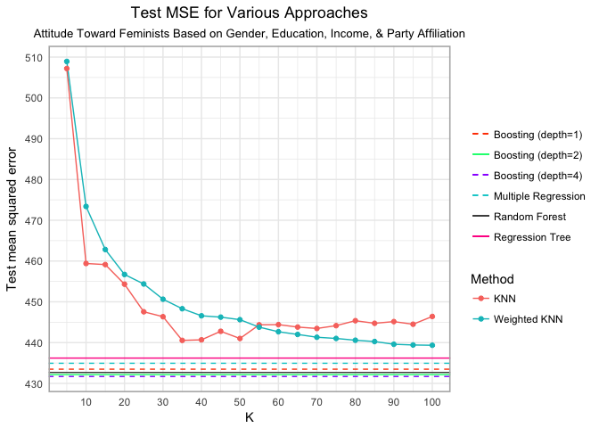 The strategy which produces the lowest MSE is boosting with a depth of 4. This makes sense since tree-based methods deal with classification which is also what this problem focuses on. Also in terms of all the possible tree-based methods, boosting often provides the best fitting model since it builds off of the best results at every step of creating the tree.

Question 2
----------

### Part 1

``` r
mh <- mh %>%
  select(vote96, age, inc10, educ, mhealth_sum)%>%
  na.omit()

set.seed(111)
mh_split <- resample_partition(mh, c(test = 0.3, train = 0.7))
mh_train <- as_tibble(mh_split$train)
mh_test <- as_tibble(mh_split$test)
```

### Part 2

``` r
set.seed(234)
## estimate the MSE for GLM and KNN models:
# Define logit2prob():
logit2prob <- function(x){
  exp(x) / (1 + exp(x))
}

# estimate the MSE for GLM
mh_glm <- glm(vote96 ~ age + inc10 + mhealth_sum + educ, data = mh_train, family = binomial) 
# estimate the error rate for this model:
x<- mh_test %>%
  add_predictions(mh_glm) %>%
  mutate (pred = logit2prob(pred),
          prob = pred,
          pred = as.numeric(pred > 0.5))
err.rate.glm <-mean(x$vote96 != x$pred)

# estimate the MSE for KNN K=1,2,...,10
mse_knn <- data_frame(k = seq(1, 10, by = 1),
                      knn_train = map(k, ~ class::knn(select(mh_train, -vote96),
                                                test = select(mh_train, -vote96),
                                                cl = mh_train$vote96, k = .)),
                      knn_test = map(k, ~ class::knn(select(mh_train, -vote96),
                                                test = select(mh_test, -vote96),
                                                cl = mh_train$vote96, k = .)),
                      mse_train = map_dbl(knn_train, ~ mean(mh_test$vote96 != .)),
                      mse_test = map_dbl(knn_test, ~ mean(mh_test$vote96 != .)))
```

    ## Warning in is.na(e1) | is.na(e2): longer object length is not a multiple of
    ## shorter object length

    ## Warning in `!=.default`(mh_test$vote96, .): longer object length is not a
    ## multiple of shorter object length

    ## Warning in is.na(e1) | is.na(e2): longer object length is not a multiple of
    ## shorter object length

    ## Warning in `!=.default`(mh_test$vote96, .): longer object length is not a
    ## multiple of shorter object length

    ## Warning in is.na(e1) | is.na(e2): longer object length is not a multiple of
    ## shorter object length

    ## Warning in `!=.default`(mh_test$vote96, .): longer object length is not a
    ## multiple of shorter object length

    ## Warning in is.na(e1) | is.na(e2): longer object length is not a multiple of
    ## shorter object length

    ## Warning in `!=.default`(mh_test$vote96, .): longer object length is not a
    ## multiple of shorter object length

    ## Warning in is.na(e1) | is.na(e2): longer object length is not a multiple of
    ## shorter object length

    ## Warning in `!=.default`(mh_test$vote96, .): longer object length is not a
    ## multiple of shorter object length

    ## Warning in is.na(e1) | is.na(e2): longer object length is not a multiple of
    ## shorter object length

    ## Warning in `!=.default`(mh_test$vote96, .): longer object length is not a
    ## multiple of shorter object length

    ## Warning in is.na(e1) | is.na(e2): longer object length is not a multiple of
    ## shorter object length

    ## Warning in `!=.default`(mh_test$vote96, .): longer object length is not a
    ## multiple of shorter object length

    ## Warning in is.na(e1) | is.na(e2): longer object length is not a multiple of
    ## shorter object length

    ## Warning in `!=.default`(mh_test$vote96, .): longer object length is not a
    ## multiple of shorter object length

    ## Warning in is.na(e1) | is.na(e2): longer object length is not a multiple of
    ## shorter object length

    ## Warning in `!=.default`(mh_test$vote96, .): longer object length is not a
    ## multiple of shorter object length

    ## Warning in is.na(e1) | is.na(e2): longer object length is not a multiple of
    ## shorter object length

    ## Warning in `!=.default`(mh_test$vote96, .): longer object length is not a
    ## multiple of shorter object length

``` r
ggplot(mse_knn, aes(k, mse_test)) +
  geom_line() +
  geom_hline(yintercept = err.rate.glm, linetype = 2) +
  labs(x = "K",
       y = "Test error rate",
       title = "KNN on Vote Turnout") +
  expand_limits(y = 0)
```

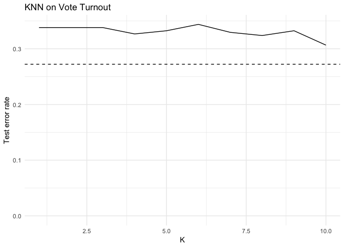

``` r
hm_knn_mse<-min(mse_knn$mse_test)
```

The model which produces the best MSE is the model with 10 nearest neighbours.

### Part 3

``` r
mse_wknn <- data_frame(k = seq(1, 10, by = 1),
                      wknn = map(k, ~ kknn(vote96 ~., train = mh_train, test = mh_test, k =.)),
                      mse_test_wknn = map_dbl(wknn, ~ mean(mh_test$vote96 != as.numeric(.$fitted.values > 0.5))))

mse_wknn_mh <- min(mse_wknn$mse_test_wknn)

err<-mse_wknn %>%
  left_join(mse_knn, by = "k") %>%
  select(k, mse_test_wknn, mse_test) %>%
  gather(method,mse, -k) %>%
  mutate(method = factor(method, levels =c("mse_test_wknn","mse_test"), labels = c("Weighted KNN","KNN")))

err %>%
  ggplot(aes(k, mse, color = method)) +
  geom_line() +
  geom_point() +
  geom_hline(yintercept = err.rate.glm, linetype = 2) +
  labs(title = "Test MSE for linear regression vs. KNN, on Vote Turnout",
       subtitle = "Traditional and weighted KNN",
       x = "K",
       y = "Test mean squared error",
       method = NULL) +
  expand_limits(y = 0) +
  theme(legend.position = "bottom")
```

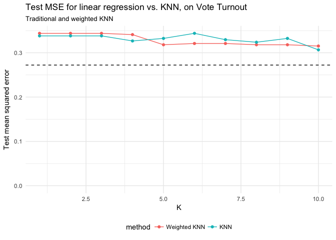 With the weighted KNN, 9 nearest neighbours produces the best model.

### Part 4

``` r
set.seed(1234)
mh_tree <- tree(vote96 ~ ., data = mh_train,
     control = tree.control(nobs = nrow(mh),
                            mindev = 0))
mh_rf <- randomForest(vote96 ~., data = mh_train, ntree = 500)
```

    ## Warning in randomForest.default(m, y, ...): The response has five or fewer
    ## unique values. Are you sure you want to do regression?

``` r
mh_boost <- gbm(mh_train$vote96 ~ ., data=mh_train, n.trees = 10000, interaction.depth = 2)
```

    ## Distribution not specified, assuming bernoulli ...

``` r
mh_tune <- tune(svm, vote96 ~., data = mh_train, 
                          kernel = "linear", 
                          range = list(cost = c(.001, 0.01, .1, 1, 5, 10, 100)))
mh_lm_best <- mh_tune$best.model
mh_poly_tune <- tune(svm, vote96 ~ ., data = mh_train,
                     kernel = "polynomial",
                     range = list(cost = c(.001, .01, .1, 1, 5, 10, 100)))
mh_best <- mh_poly_tune$best.model


mse_lmsvm <- mse(mh_best, mh_test)
mse_glm <- mse(mh_glm, mh_test)
mse_tree <- mse(mh_tree, mh_test)
mse_rf <- mse(mh_rf, mh_test)
mse_boost <- mse(mh_boost, mh_test)
```

    ## Using 10000 trees...

    ## Warning in response(model, data) - stats::predict(model, data): longer
    ## object length is not a multiple of shorter object length

``` r
mse_polysvm <- mse(mh_best, mh_test)

Methods <- c("Logistic model", "Decision Tree", "Random Forests", "Boosting", "Support Vector Machine (Poly)", "Support vector Machine (linear)", "Weighted KNN")
Errors <- c(mse_glm, mse_tree, mse_rf, mse_boost, mse_polysvm, mse_lmsvm, mse_wknn_mh)

kable(data.frame(Methods, Errors))
```

| Methods                            |                                                                                                                                                                                                                                                                                                                                                                                                                                 Errors|
|:-----------------------------------|--------------------------------------------------------------------------------------------------------------------------------------------------------------------------------------------------------------------------------------------------------------------------------------------------------------------------------------------------------------------------------------------------------------------------------------:|
| Logistic model                     |                                                                                                                                                                                                                                                                                                                                                                                                                                  1.075|
| Decision Tree                      |                                                                                                                                                                                                                                                                                                                                                                                                                                  0.269|
| Random Forests                     |                                                                                                                                                                                                                                                                                                                                                                                                                                  0.198|
| Boosting                           |                                                                                                                                                                                                                                                                                                                                                                                                                                  1.718|
| Support Vector Machine (Poly)      |                                                                                                                                                                                                                                                                                                                                                                                                                                  0.270|
| Support vector Machine (linear)    |                                                                                                                                                                                                                                                                                                                                                                                                                                  0.270|
| Weighted KNN                       |                                                                                                                                                                                                                                                                                                                                                                                                                                  0.315|
| The method which gave the lowest M |  SE is random forests, which gives an MSE of 0.198. The second lowest MSE was produced by decision tree. Again, this question also deals with classification so tree-methods would address this particular question well. And similar to the last problem, random forests provide more accurate results than a decision tree alone since creating random forests is just simulating many decision trees to find the best combinations.|

Question 3
----------

``` r
college = College
college$Private = as.numeric(college$Private)
college_pca = prcomp(college, scale = TRUE)
college_pca_1_2 = as.data.frame(college_pca$rotation)[1:2]
college_pca_1_2
```

    ##                 PC1     PC2
    ## Private     -0.0890  0.3459
    ## Apps        -0.1996 -0.3436
    ## Accept      -0.1538 -0.3726
    ## Enroll      -0.1178 -0.3997
    ## Top10perc   -0.3603  0.0162
    ## Top25perc   -0.3448 -0.0177
    ## F.Undergrad -0.0941 -0.4107
    ## P.Undergrad  0.0175 -0.2931
    ## Outstate    -0.3277  0.1915
    ## Room.Board  -0.2665  0.0940
    ## Books       -0.0572 -0.0573
    ## Personal     0.0719 -0.1928
    ## PhD         -0.3033 -0.1162
    ## Terminal    -0.3039 -0.1042
    ## S.F.Ratio    0.2103 -0.2044
    ## perc.alumni -0.2367  0.1941
    ## Expend      -0.3330  0.0703
    ## Grad.Rate   -0.2731  0.1178

``` r
biplot(college_pca, scale = 0, cex = c(.1,.6))
```

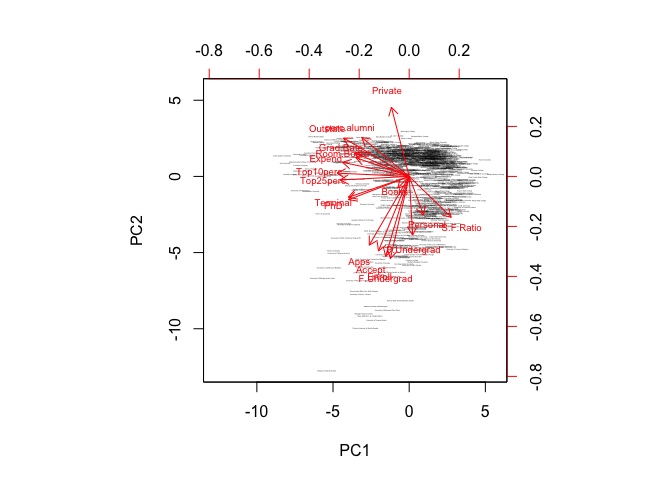

The variables that seem the most correlated with the first principle component are S.F. Ration and Personal. The variables most correlated with the second PC are Private and Percentage Alumni.

Question 4
----------

### Part 1

``` r
# Principal Component Analysis 
arrests_label <-arrests$State
arrests_df <- arrests[c("Murder", "Assault", "UrbanPop", "Rape")]
pr.out <- prcomp(arrests_df, scale = TRUE)
pr.out$rotation 
```

    ##             PC1    PC2    PC3    PC4
    ## Murder   -0.536  0.418 -0.341  0.649
    ## Assault  -0.583  0.188 -0.268 -0.743
    ## UrbanPop -0.278 -0.873 -0.378  0.134
    ## Rape     -0.543 -0.167  0.818  0.089

``` r
biplot(pr.out, scale = 0, cex = .6)
```

 Urban Population seems to be the variable most correlated with PC1. Murder, Assault, and Rape seem about equally correlated with PC2.

### Part 2

``` r
kmeans_fit2 <- kmeans(arrests_df, 2, nstart = 20)
biplot(pr.out, scale = 0, cex = .6)
```


``` r
PC1 <- as.data.frame(pr.out$x)$PC1
PC2 <- as.data.frame(pr.out$x)$PC2
plot(PC1, PC2, label=arrests_label)
```

    ## Warning in plot.window(...): "label" is not a graphical parameter

    ## Warning in plot.xy(xy, type, ...): "label" is not a graphical parameter

    ## Warning in axis(side = side, at = at, labels = labels, ...): "label" is not
    ## a graphical parameter

    ## Warning in axis(side = side, at = at, labels = labels, ...): "label" is not
    ## a graphical parameter

    ## Warning in box(...): "label" is not a graphical parameter

    ## Warning in title(...): "label" is not a graphical parameter


``` r
state_group <- as.factor(kmeans_fit2$cluster)
d <- data.frame(x=PC1, y=PC2, name=arrests_label)
p <- ggplot(d, aes(x, y, label=name, color=state_group))
p +  geom_text() + labs(title = "PCA: Divide States into 2 Groups (K-Means Clustering, K=2)")
```

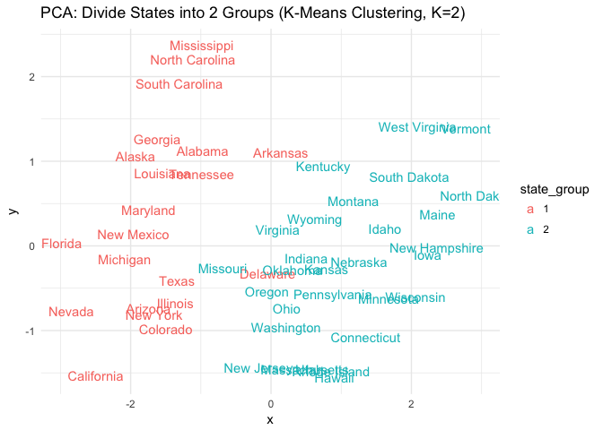 This divide is interesting because it looks as though they are divided by the x-axis and mostly randomly grouped around the y-axis. Looking at the specific states, it looks like southern states are in one group and northern states are in the other.

### Part 3

``` r
kmeans_fit4 <- kmeans(arrests_df, 4, nstart = 20)

biplot(pr.out, scale = 0, cex = .6)
```


``` r
PC1 <- as.data.frame(pr.out$x)$PC1
PC2 <- as.data.frame(pr.out$x)$PC2

plot(PC1, PC2, label=arrests_label)
```

    ## Warning in plot.window(...): "label" is not a graphical parameter

    ## Warning in plot.xy(xy, type, ...): "label" is not a graphical parameter

    ## Warning in axis(side = side, at = at, labels = labels, ...): "label" is not
    ## a graphical parameter

    ## Warning in axis(side = side, at = at, labels = labels, ...): "label" is not
    ## a graphical parameter

    ## Warning in box(...): "label" is not a graphical parameter

    ## Warning in title(...): "label" is not a graphical parameter


``` r
state_group <- as.factor(kmeans_fit4$cluster)

d <- data.frame(x=PC1, y=PC2, name=arrests_label)
p <- ggplot(d, aes(x, y, label=name, color=state_group))
p +  geom_text() + labs(title = "PCA: Divide States into 4 Groups (K-Means Clustering, K=4)")
```

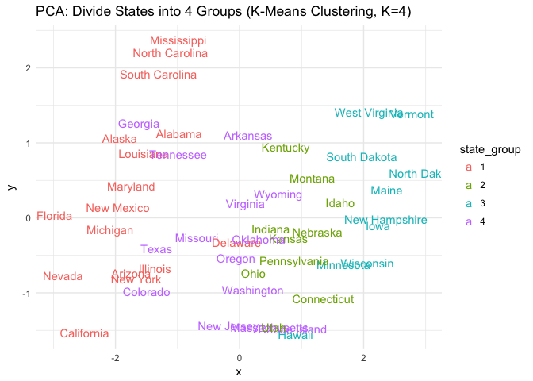 This plot, with K=4, looks very hectic. There are now 4 groups which are, again, divided mostly by the x axis. With the exceptions of Mississippi, North Carolina, and South Carolina, the states are evenly spread around the y-axis.

### Part 4

``` r
kmeans_fit3 <- kmeans(arrests_df, 3, nstart = 20)
biplot(pr.out, scale = 0, cex = .6)
```


``` r
PC1 <- as.data.frame(pr.out$x)$PC1
PC2 <- as.data.frame(pr.out$x)$PC2

plot(PC1, PC2, label=arrests_label)
```

    ## Warning in plot.window(...): "label" is not a graphical parameter

    ## Warning in plot.xy(xy, type, ...): "label" is not a graphical parameter

    ## Warning in axis(side = side, at = at, labels = labels, ...): "label" is not
    ## a graphical parameter

    ## Warning in axis(side = side, at = at, labels = labels, ...): "label" is not
    ## a graphical parameter

    ## Warning in box(...): "label" is not a graphical parameter

    ## Warning in title(...): "label" is not a graphical parameter


``` r
state_group <- as.factor(kmeans_fit3$cluster)

d <- data.frame(x=PC1, y=PC2, name=arrests_label)
p <- ggplot(d, aes(x, y, label=name, color=state_group))
p +  geom_text() + labs(title = "PCA: Divide States into 3 Groups (K-Means Clustering, K=3)")
```

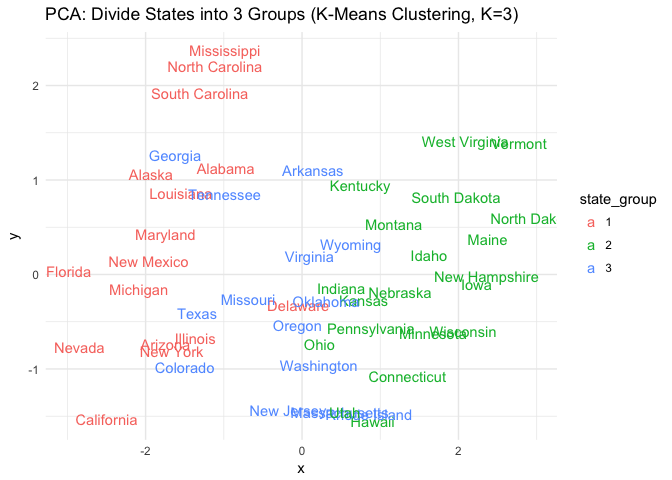 This plot split the data into 3 groups. The divide is, again, along the x-asix but there is still quite a bit of overlap between the three different groups.

### Part 5

``` r
pr.out <- prcomp(arrests_df, scale = TRUE)
PCS <- data.frame(v1=PC1, v2=PC2)
kmeans_fit3_pca <- kmeans(PCS, 3, nstart = 20)
state_group <- as.factor(kmeans_fit3_pca$cluster)
d <- data.frame(x=PC1, y=PC2, name=arrests_label)
p <- ggplot(d, aes(x, y, label=name, color=state_group))
p +  geom_text() + labs(title = "PCA: Divide States into 3 Groups based on PC1, PC2 (K-Means Clustering, K=2)")
```

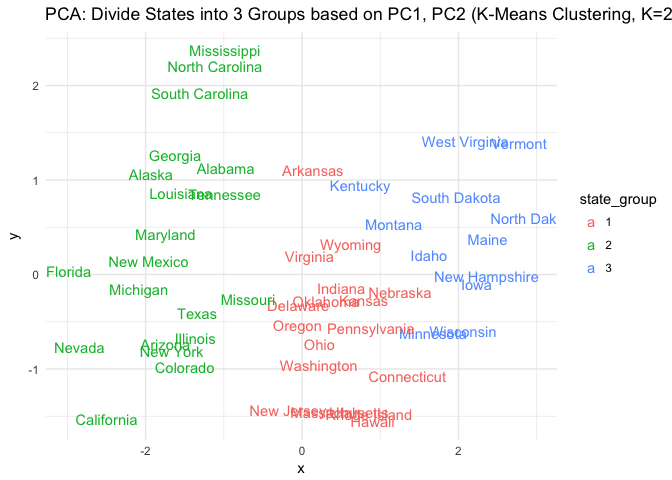 This plot looks much cleaner and more properly separated. The divides between clusters are clean and there is little to no overlap! This is a strong improvement from the model that split the raw data arbitrarily into 3 groups.

### Part 6

``` r
hc.complete <- hclust(dist(select(arrests, -State)), method = "complete")

# plot
ggdendrogram(hc.complete, labels=TRUE)
```

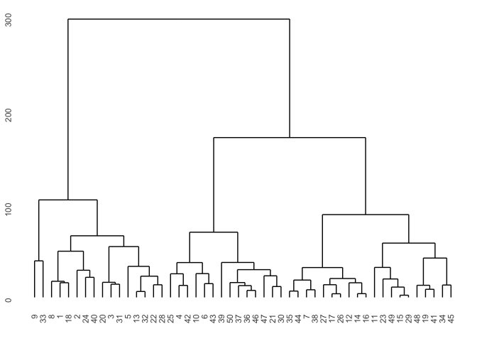

### Part 7

``` r
h <- 150
# extract dendro data
hcdata <- dendro_data(hc.complete)
hclabs <- label(hcdata) %>%
  left_join(data_frame(label = as.factor(seq.int(nrow(arrests_df))),
                       cl = as.factor(cutree(hc.complete, h = h))))
```

    ## Joining, by = "label"

    ## Warning in left_join_impl(x, y, by$x, by$y, suffix$x, suffix$y): joining
    ## factors with different levels, coercing to character vector

``` r
# plot dendrogram
ggdendrogram(hc.complete, labels = TRUE) +
  geom_text(data = hclabs,
            aes(label = arrests$State, x = x, y = 0, color = cl),
            vjust = .5, angle = 90) +
  geom_hline(yintercept = h, linetype = 2) +
  theme(axis.text.x = element_blank(),
        legend.position = "none")
```

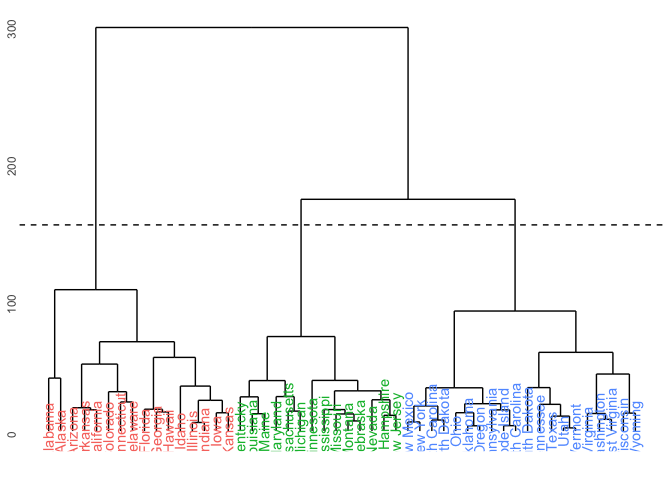 Above is the hierarchically clustered dendrogram. The states clustered into each of the three groups can be seen above.

``` r
hc.standard <- hclust(dist(scale(select(arrests, -State))), method = "complete")

hcdata <- dendro_data(hc.standard)
hclabs <- label(hcdata) %>%
  left_join(data_frame(label = as.factor(seq.int(nrow(arrests))),
                       State = arrests$State,
                       cl = as.factor(cutree(hc.standard, h=h))))
```

    ## Joining, by = "label"

    ## Warning in left_join_impl(x, y, by$x, by$y, suffix$x, suffix$y): joining
    ## factors with different levels, coercing to character vector

``` r
#plot
ggdendrogram(hc.standard) 
```

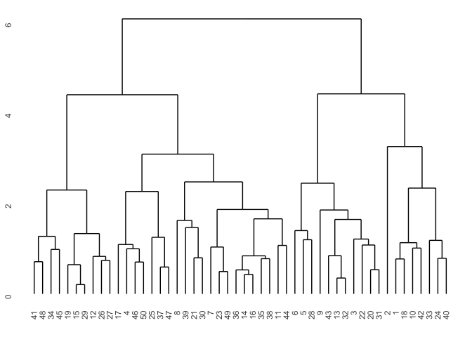
