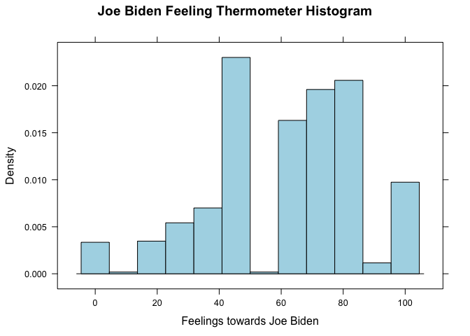
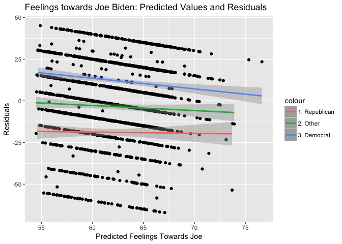
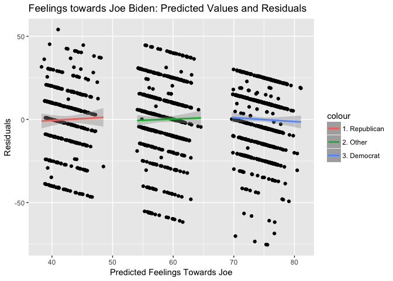

PS5
================
Chelsea Ernhofer

Question 1
----------

``` r
biden_data = read.csv("biden.csv")

attach(biden_data)

histogram(biden, main='Joe Biden Feeling Thermometer Histogram', xlab ='Feelings towards Joe Biden', col ="lightblue")
```



Question 2
----------

``` r
simple <- lm(biden ~ age, data = biden_data)
summary(simple)
```

    ## 
    ## Call:
    ## lm(formula = biden ~ age, data = biden_data)
    ## 
    ## Residuals:
    ##     Min      1Q  Median      3Q     Max 
    ## -64.876 -12.318  -1.257  21.684  39.617 
    ## 
    ## Coefficients:
    ##             Estimate Std. Error t value Pr(>|t|)    
    ## (Intercept) 59.19736    1.64792   35.92   <2e-16 ***
    ## age          0.06241    0.03267    1.91   0.0563 .  
    ## ---
    ## Signif. codes:  0 '***' 0.001 '**' 0.01 '*' 0.05 '.' 0.1 ' ' 1
    ## 
    ## Residual standard error: 23.44 on 1805 degrees of freedom
    ## Multiple R-squared:  0.002018,   Adjusted R-squared:  0.001465 
    ## F-statistic: 3.649 on 1 and 1805 DF,  p-value: 0.05626

Parameters and standard errors of this simple linear model are shown below.

1.  It appears as though there is a very small, positive relationship between age and feelings towards Joe Biden. However, since the R-squared value is also very small and the p value is more than 0.05, I would argue that this apparent relationship is not meaningful. In addition we cannot be sure if it is legitimate and not just caused by random chance.

2.  As discussed above, the relationship between age and feelings towards Joe Biden is incredibly weak. From the coefficients, we can see that a one unit increase in age leads to a 0.06241 unit increase in feelings towards Joe Biden. I would describe this relationship as, not only weak, but both inconsequential (because of the low coeffient and R-squared values) and basically insignificant (because of the higher p-value).

3.  The relationship between age and feelings towards Joe Biden is positive.

4.  The R-squared value is 0.002018. This means that age alone can explain 0.2018% of the variation in public feeling towards Joe Biden. This is not a good model since our explanatory variable can't even explain 1% of the variation in the response variable.

``` r
(pred_ci <- augment(simple, newdata = data_frame(age = c(45))) %>%
  mutate(ymin = .fitted - .se.fit * 1.96,
         ymax = .fitted + .se.fit * 1.96))
```

    ##   age .fitted   .se.fit     ymin     ymax
    ## 1  45 62.0056 0.5577123 60.91248 63.09872

1.  The predicted value of our response variable with a value of 45 in our explanatory variable would be 62.0056. The 95% confidence intervals are 60.91248 and 63.09872.

Question 3
----------

``` r
plot(age, jitter(biden, 7), main="Joe Biden Feelings Thermometer against Age", 
    xlab="Age ", ylab="Joe Biden Feelings ", pch=19, abline(lm(biden ~ age), lwd=3, col = "red"))
```


``` r
mult <- lm(biden ~ age + female + educ, data = biden_data)
summary(mult)
```

    ## 
    ## Call:
    ## lm(formula = biden ~ age + female + educ, data = biden_data)
    ## 
    ## Residuals:
    ##     Min      1Q  Median      3Q     Max 
    ## -67.084 -14.662   0.703  18.847  45.105 
    ## 
    ## Coefficients:
    ##             Estimate Std. Error t value Pr(>|t|)    
    ## (Intercept) 68.62101    3.59600  19.083  < 2e-16 ***
    ## age          0.04188    0.03249   1.289    0.198    
    ## female       6.19607    1.09670   5.650 1.86e-08 ***
    ## educ        -0.88871    0.22469  -3.955 7.94e-05 ***
    ## ---
    ## Signif. codes:  0 '***' 0.001 '**' 0.01 '*' 0.05 '.' 0.1 ' ' 1
    ## 
    ## Residual standard error: 23.16 on 1803 degrees of freedom
    ## Multiple R-squared:  0.02723,    Adjusted R-squared:  0.02561 
    ## F-statistic: 16.82 on 3 and 1803 DF,  p-value: 8.876e-11

1.  There is a statistically significant relationship between gender and education and feelings towards Joe Biden. There is no significant relationship between age and Joe Biden feelings.

2.  The parameter for female suggests that being female is correlated with high feelings towards Joe Biden. Specifically, it can be expected that females, on average, score 6.196 points higher than males on the Joe Biden feeling thermometer.

3.  The R-squared for this model is 0.02723. This means that almost 3% of the variance in public feelings towards Joe Biden can be explained by age, gender, and education. The R-squared value of this model is higher than the R-squared of the model which contained the age variable alone \*\*\*\*MORE

``` r
biden_data %>%
  add_predictions(mult) %>%
  add_residuals(mult) %>%
  {.} -> grid
gridrep <- filter(grid, rep == 1)
griddem <- filter(grid, dem == 1)
gridother <- filter(grid, dem == 0 & rep == 0)
ggplot(grid, aes(jitter(pred, 8))) +
  geom_point(aes(y = jitter(resid, 8))) +
  geom_smooth(method='lm', aes(y = resid, color = '2. Other'), data = gridother, size = 1) +
  geom_smooth(method='lm', aes(y = resid, color = '1. Republican'), data = gridrep, size = 1) +
  geom_smooth(method='lm', aes(y = resid , color = '3. Democrat'), data = griddem, size = 1) +
  labs(title = "Feelings towards Joe Biden: Predicted Values and Residuals",
        x = "Predicted Feelings Towards Joe",
        y = "Residuals")
```

 4. This plot of the predicted values and residuals clearly shows that there are systematic differences in feelings towards Joe Biden based upon political party. Democrats favour Joe more highly than do Republicans or persons with other political views. This shows a weakness in the above model. We are leaving out a key piece of information that could help explain public feelings about Joe Biden. I believe that by including political views, our model with be able to predict feeling towards Joe Biden more succesfully (ie. higher R2).

Question 4
----------

``` r
m3 = lm(biden ~ age + female + educ + dem + rep, data = biden_data)
summary(m3)
```

    ## 
    ## Call:
    ## lm(formula = biden ~ age + female + educ + dem + rep, data = biden_data)
    ## 
    ## Residuals:
    ##     Min      1Q  Median      3Q     Max 
    ## -75.546 -11.295   1.018  12.776  53.977 
    ## 
    ## Coefficients:
    ##              Estimate Std. Error t value Pr(>|t|)    
    ## (Intercept)  58.81126    3.12444  18.823  < 2e-16 ***
    ## age           0.04826    0.02825   1.708   0.0877 .  
    ## female        4.10323    0.94823   4.327 1.59e-05 ***
    ## educ         -0.34533    0.19478  -1.773   0.0764 .  
    ## dem          15.42426    1.06803  14.442  < 2e-16 ***
    ## rep         -15.84951    1.31136 -12.086  < 2e-16 ***
    ## ---
    ## Signif. codes:  0 '***' 0.001 '**' 0.01 '*' 0.05 '.' 0.1 ' ' 1
    ## 
    ## Residual standard error: 19.91 on 1801 degrees of freedom
    ## Multiple R-squared:  0.2815, Adjusted R-squared:  0.2795 
    ## F-statistic: 141.1 on 5 and 1801 DF,  p-value: < 2.2e-16

1.  The direction of the relationship between gender and feelings towards Joe Biden did not change, however, the strength of the relationship weakened. That is, when accounting for political views, being female is expected to raise an observation of feelings towards Joe by 4.1 units compared with ~6 units from the last model. This could be due to a possible interaction between gender and political view (I hope we get to observe that next!).

2.  The R-squared value is 0.2815. This means that together, age, gender, education, and political views are able to explain 28% of the variance in feelings about good 'ole Joe. This model is much better than the previous model which was only able to explain about 2% of the variance.

``` r
biden_data %>%
  add_predictions(m3) %>%
  add_residuals(m3) %>%
  {.} -> grid2
gridrep <- filter(grid2, rep == 1)
griddem <- filter(grid2, dem == 1)
gridother <- filter(grid2, dem == 0 & rep == 0)
ggplot(grid2, aes(jitter(pred, 8))) +
  geom_point(aes(y = jitter(resid, 8))) +
  geom_smooth(method='lm', aes(y = resid, color = '2. Other'), data = gridother, size = 1) +
  geom_smooth(method='lm', aes(y = resid, color = '1. Republican'), data = gridrep, size = 1) +
  geom_smooth(method='lm', aes(y = resid , color = '3. Democrat'), data = griddem, size = 1) +
  labs(title = "Feelings towards Joe Biden: Predicted Values and Residuals",
        x = "Predicted Feelings Towards Joe",
        y = "Residuals")
```



Question 5
----------

``` r
m_inter =lm(biden ~ female + dem + female*dem, data = biden_data)
summary(m_inter)
```

    ## 
    ## Call:
    ## lm(formula = biden ~ female + dem + female * dem, data = biden_data)
    ## 
    ## Residuals:
    ##     Min      1Q  Median      3Q     Max 
    ## -75.519 -13.070  -0.198  11.930  49.802 
    ## 
    ## Coefficients:
    ##             Estimate Std. Error t value Pr(>|t|)    
    ## (Intercept)  50.1976     0.9219  54.452  < 2e-16 ***
    ## female        5.0135     1.2943   3.874 0.000111 ***
    ## dem          22.8719     1.5079  15.168  < 2e-16 ***
    ## female:dem   -2.5642     1.9997  -1.282 0.199902    
    ## ---
    ## Signif. codes:  0 '***' 0.001 '**' 0.01 '*' 0.05 '.' 0.1 ' ' 1
    ## 
    ## Residual standard error: 20.74 on 1803 degrees of freedom
    ## Multiple R-squared:  0.2201, Adjusted R-squared:  0.2188 
    ## F-statistic: 169.6 on 3 and 1803 DF,  p-value: < 2.2e-16

``` r
t_inter <- augment(m_inter, newdata = data.frame(female = c(1, 1, 0, 0), dem = c(1, 0, 1, 0)))
t_inter <- t_inter%>%
  mutate(ymin = .fitted - 1.96 * .se.fit,
         ymax = .fitted + 1.96 * .se.fit)
t_inter
```

    ##   female dem  .fitted   .se.fit     ymin     ymax
    ## 1      1   1 75.51883 0.9484884 73.65979 77.37787
    ## 2      1   0 55.21113 0.9085045 53.43046 56.99180
    ## 3      0   1 73.06954 1.1932803 70.73071 75.40837
    ## 4      0   0 50.19763 0.9218722 48.39076 52.00450

1.  The relationship between partyID and feelings towards Joe Biden does indeed change based on gender. Overall, Republicans score lower on the Jow Biden feelings thermometer, however, female Republicans score noticeably higher than their male counterparts. The 95% confidence intervals for male vs female Republicans do not even overlap (with the male republican CI ending at ~52.0 and the female republican CI starting at ~53.4). This shows that gender effects the relationship between being Republican and Joe Biden feelings. For Democrats, there is also a difference between women and men, although the difference is less pronounced. Women score higher (~75.5) on the Joe Biden feelings thermometer than men (~73.0).

Looking at this problem in a different way, the relationship between gender and feelings toward Joe Biden also change based on political party. Both Republican men and women score lower than Democrat men and women. The pattern of women scoring higher than men, however, is evident across both political views.
