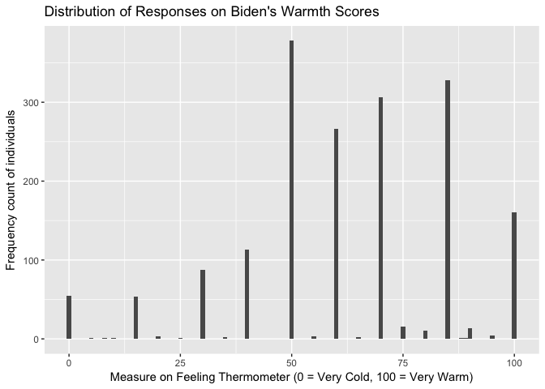
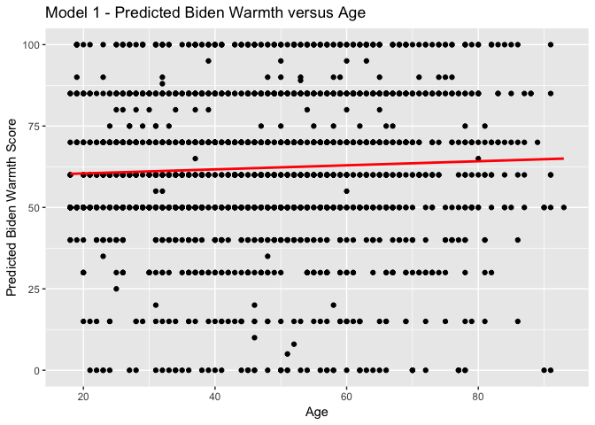
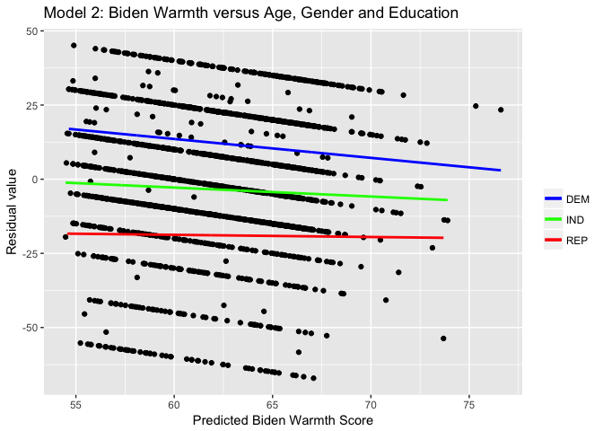
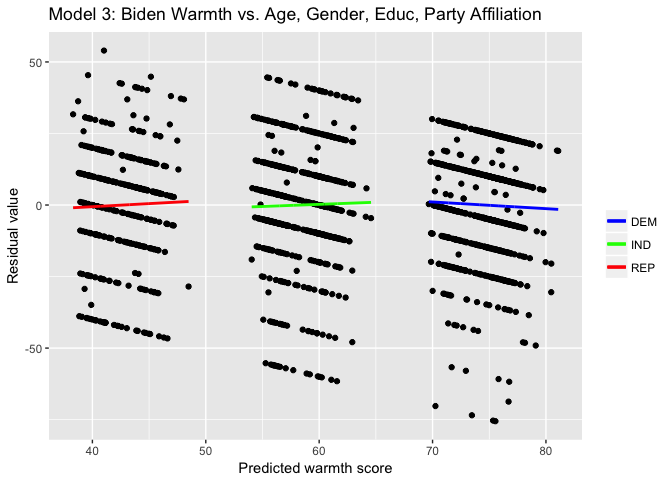

Problem set \#5: Linear Regression
================
Sushmita V Gopalan

-   [Description of the Data](#description-of-the-data)
-   [Simple Linear Regression](#simple-linear-regression)
-   [Multiple Linear Regression](#multiple-linear-regression)
-   [Multiple Linear Regression - More variables!](#multiple-linear-regression---more-variables)
-   [Interactive Linear Regression](#interactive-linear-regression)

Description of the Data
-----------------------

Most individuals who responded to the survey feel at least neutrally, if not positively, about Joe Biden. The histogram has its peak at 50, with high frequencies observed near 60, 70 and 90 as well. The responses are also concentrated around units of 10.

``` r
ggplot(biden, mapping = aes(x = biden)) +
  geom_histogram(binwidth=1) +
  labs(title = "Distribution of Responses on Biden's Warmth Scores",
       x = "Measure on Feeling Thermometer (0 = Very Cold, 100 = Very Warm)",
       y = "Frequency count of individuals")
```



Simple Linear Regression
------------------------

``` r
# create model, display results
biden_age <- lm(biden ~ age, data = biden)
summary(biden_age)
```

    ## 
    ## Call:
    ## lm(formula = biden ~ age, data = biden)
    ## 
    ## Residuals:
    ##     Min      1Q  Median      3Q     Max 
    ## -64.876 -12.318  -1.257  21.684  39.617 
    ## 
    ## Coefficients:
    ##             Estimate Std. Error t value Pr(>|t|)    
    ## (Intercept) 59.19736    1.64792   35.92   <2e-16 ***
    ## age          0.06241    0.03267    1.91   0.0563 .  
    ## ---
    ## Signif. codes:  0 '***' 0.001 '**' 0.01 '*' 0.05 '.' 0.1 ' ' 1
    ## 
    ## Residual standard error: 23.44 on 1805 degrees of freedom
    ## Multiple R-squared:  0.002018,   Adjusted R-squared:  0.001465 
    ## F-statistic: 3.649 on 1 and 1805 DF,  p-value: 0.05626

**Is there a relationship between the predictor and the response?**

We cannot reject the hypothesis that there is no relationship between the predictor and the response at the 5% significance level. The p-value for the estimate of the coefficient for age is 0.056 which is greater 0.05.

**How strong is the relationship between the predictor and the response?**

The estimated relationship between the predictor and the response is that for a unit increase in age,the response on Biden's feeling thermometer increases 0.06241 units. This is a weak relationship - not even a 0.1% increase. Besides, this relationship is not found to be statistically significant, even at the 5% signifance level.

**Is the relationship between the predictor and the response positive or negative?**

The estimated relationship between the predictor and the response is positive. It predicts a 0.06421 unit increase in biden, on average, for a unit increase in age.

**Report the R2 of the model. What percentage of the variation in biden does age alone explain? Is this a good or bad model?**

This is a bad model because the R2 of the model is 0.002, i.e., age only explains 0.2% of the variation in biden.

**What is the predicted biden associated with an age of 45? What are the associated 95% confidence intervals?**

``` r
predict(biden_age,data.frame(age=c(45)), interval ="confidence")
```

The predicted biden associated with an age of 45 is 62.0056. The associated 95% confidence interval is (60.91177,63.09943)

**Plot the response and predictor. Draw the least squares regression line.**

``` r
grid <- biden %>% 
  data_grid(age) 

grid <- grid %>% 
  add_predictions(biden_age) 
```

``` r
ggplot(biden_age, aes(x = age)) +
  labs(title="Model 1 - Predicted Biden Warmth versus Age",
       x= "Age",
       y= "Predicted Biden Warmth Score")+
  geom_point(aes(y = biden)) +
  geom_line(aes(y = pred), data = grid, color = "red", size = 1)
```



Multiple Linear Regression
--------------------------

``` r
## Create model and summarize results
biden_2 <- lm(biden ~ age+female+educ,data = biden)
summary(biden_2)
```

    ## 
    ## Call:
    ## lm(formula = biden ~ age + female + educ, data = biden)
    ## 
    ## Residuals:
    ##     Min      1Q  Median      3Q     Max 
    ## -67.084 -14.662   0.703  18.847  45.105 
    ## 
    ## Coefficients:
    ##             Estimate Std. Error t value Pr(>|t|)    
    ## (Intercept) 68.62101    3.59600  19.083  < 2e-16 ***
    ## age          0.04188    0.03249   1.289    0.198    
    ## female       6.19607    1.09670   5.650 1.86e-08 ***
    ## educ        -0.88871    0.22469  -3.955 7.94e-05 ***
    ## ---
    ## Signif. codes:  0 '***' 0.001 '**' 0.01 '*' 0.05 '.' 0.1 ' ' 1
    ## 
    ## Residual standard error: 23.16 on 1803 degrees of freedom
    ## Multiple R-squared:  0.02723,    Adjusted R-squared:  0.02561 
    ## F-statistic: 16.82 on 3 and 1803 DF,  p-value: 8.876e-11

**Is there a statistically significant relationship between the predictors and response?**

The relationship between education and gender, and the response, is statistically signficant at the 1% significance level with p-values &lt; 0.01 for both predictors. The relationship between age and the response is not statistically significant, even at a 5% signifcance level, with a p-value of 0.198 &gt; 0.05.

**What does the parameter for female suggest?**

Women are predicted to rate Biden an average of 6.19607 points higher on the Feeling Thermometer than men do. The estimated parameter is statistically significant at the 1% significance level.

**Report the R2 of the model. What percentage of the variation in biden does age, gender, and education explain? Is this a better or worse model than the age-only model?**

The R2 of the model is 0.02561. Age, gender and education explain 2.56% of the variation in biden. This is a better model than the age-only model because that only explained 0.2% of the variation. It is however, still a bad model.

**Generate a plot comparing the predicted values and residuals, drawing separate smooth fit lines for each party ID type. Is there a problem with this model? If so, what?**

``` r
biden %>%
  select(age, educ, female, biden, dem, rep) %>%
  add_predictions(biden_2, var = 'pred0') %>%
  add_residuals(biden_2) %>%
  {.} -> grid

griddem = filter(grid, dem == 1)
gridrep = filter(grid, rep == 1)
gridind = filter(grid, dem == 0 & rep == 0)

dem_resid_lm = lm(resid ~ pred0, data = griddem)
rep_resid_lm = lm(resid ~ pred0, data = gridrep)
ind_resid_lm = lm(resid ~ pred0, data = gridind)

griddem %>%
  add_predictions(dem_resid_lm) %>%
  {.} -> griddem

gridrep %>%
  add_predictions(rep_resid_lm) %>%
  {.} -> gridrep

gridind %>%
  add_predictions(ind_resid_lm) %>%
  {.} -> gridind
```

``` r
ggplot(grid, aes(pred0, resid)) +
  labs(title = "Model 2: Biden Warmth versus Age, Gender and Education",
       y = 'Residual value',
       x = "Predicted Biden Warmth Score") +
  geom_point() +
  geom_line(aes(y = pred, color = "DEM"), data = griddem, size = 1, show.legend = TRUE) +
  geom_line(aes(y = pred, color = "REP"), data = gridrep, size = 1, show.legend = TRUE) +
  geom_line(aes(y = pred, color = "IND"), data = gridind, size = 1, show.legend = TRUE) +
  scale_color_manual('', values = c("DEM" = "blue", "REP" = "red", "IND" = "green"))
```



There is, indeed, a problem with this model. As the graph indicates, the model overestimates warmth scores for Republicans and underestimates it for Democrats. Being affiliated to the Democratic party, the Republican party or independent appears to have a distinct effect on residual values. Visually, each of the three regression lines has a slightly different slope and a very different intercept. We need to modify our model to account for the effects of party affiliations on warmth scores.

Multiple Linear Regression - More variables!
--------------------------------------------

``` r
biden_3 <- lm(biden ~ age + female + educ + dem + rep,data = biden)
summary(biden_2)
```

    ## 
    ## Call:
    ## lm(formula = biden ~ age + female + educ, data = biden)
    ## 
    ## Residuals:
    ##     Min      1Q  Median      3Q     Max 
    ## -67.084 -14.662   0.703  18.847  45.105 
    ## 
    ## Coefficients:
    ##             Estimate Std. Error t value Pr(>|t|)    
    ## (Intercept) 68.62101    3.59600  19.083  < 2e-16 ***
    ## age          0.04188    0.03249   1.289    0.198    
    ## female       6.19607    1.09670   5.650 1.86e-08 ***
    ## educ        -0.88871    0.22469  -3.955 7.94e-05 ***
    ## ---
    ## Signif. codes:  0 '***' 0.001 '**' 0.01 '*' 0.05 '.' 0.1 ' ' 1
    ## 
    ## Residual standard error: 23.16 on 1803 degrees of freedom
    ## Multiple R-squared:  0.02723,    Adjusted R-squared:  0.02561 
    ## F-statistic: 16.82 on 3 and 1803 DF,  p-value: 8.876e-11

**Did the relationship between gender and Biden warmth change?**

Yes. While it remains positive and significant at the 1% significance level with a p-value &lt;0.01, the estimated magnitude of this effect changed. When you take into account party affiliations, we find that women are predicted to rate Biden 4.10323 points higher, on average, than men do. This is less than the 6.19607 estimated by the previous model.

**Report the R2 of the model. What percentage of the variation in biden does age, gender, education, and party identification explain? Is this a better or worse model than the age + gender + education model?**

The R2 of the model is 0.2795. Age, gender, education and party identification explain 27.95% of the variation in biden. This is a better model than the age+gender+education model, because this explains 27.95% of the variation in biden while age+gender+education explained only 2.56% of the variation.

**Generate a plot comparing the predicted values and residuals, drawing separate smooth fit lines for each party ID type. By adding variables for party ID to the regression model, did we fix the previous problem?**

``` r
biden %>%
  select(age, educ, female, biden, dem, rep) %>%
  add_predictions(biden_3, var = 'pred0') %>%
  add_residuals(biden_3) %>%
  {.} -> grid

griddem = filter(grid, dem == 1)
gridrep = filter(grid, rep == 1)
gridind = filter(grid, dem == 0 & rep == 0)

dem_resid_lm = lm(resid ~ pred0, data = griddem)
rep_resid_lm = lm(resid ~ pred0, data = gridrep)
ind_resid_lm = lm(resid ~ pred0, data = gridind)

griddem %>%
  add_predictions(dem_resid_lm) %>%
  {.} -> griddem

gridrep %>%
  add_predictions(rep_resid_lm) %>%
  {.} -> gridrep

gridind %>%
  add_predictions(ind_resid_lm) %>%
  {.} -> gridind
```

``` r
ggplot(grid, aes(pred0, resid)) +
  labs(title = 'Model 3: Biden Warmth vs. Age, Gender, Educ, Party Affiliation',
       y = 'Residual value',
       x = 'Predicted warmth score') +
  geom_point() +
  geom_line(aes(y = pred, color = "DEM"), data = griddem, size = 1, show.legend = TRUE) +
  geom_line(aes(y = pred, color = "REP"), data = gridrep, size = 1, show.legend = TRUE) +
  geom_line(aes(y = pred, color = "IND"), data = gridind, size = 1, show.legend = TRUE) +
  scale_color_manual('', values = c("DEM" = "blue", "REP" = "red", "IND" = "green"))
```



We have fixed the previous problem in that the residual values are not greatly affected anymore by party affiliation. All three linear regressions lines appear to have a slope and intercept very close to zero.

Interactive Linear Regression
-----------------------------

**Filter your dataset to remove any independent respondents (keeping only those who identify as Democrats or Republicans), and estimate the following linear regression:**

``` r
question4 <- subset(biden, rep == 1 | dem == 1)

biden_4 <- lm(biden ~ female + dem + female*dem, data = question4)
tidy(biden_4)
```

    ##          term  estimate std.error statistic       p.value
    ## 1 (Intercept) 39.382022  1.455363 27.059928 4.045546e-125
    ## 2      female  6.395180  2.017807  3.169371  1.568102e-03
    ## 3         dem 33.687514  1.834799 18.360328  3.295008e-66
    ## 4  female:dem -3.945888  2.471577 -1.596506  1.106513e-01

\*\* Estimate predicted Biden warmth feeling thermometer ratings and 95% confidence intervals for female Democrats, female Republicans, male Democrats, and male Republicans. \*\*

``` r
# female democrats
predict(biden_4,data.frame(female=c(1), dem = c(1)), interval ="confidence")
# male democrats
predict(biden_4,data.frame(female=c(0), dem = c(1)), interval ="confidence")
# female republicans
predict(biden_4,data.frame(female=c(1), dem = c(0)), interval ="confidence")
# male republicans
predict(biden_4,data.frame(female=c(0), dem = c(0)), interval ="confidence")
```

**Predicted Biden Warmth with 95% confidence intervals:**

Female Democrats - 75.51883 with confidence interval (73.77362,77.26133)
Male Democrats - 73.06954 with confidence interval (70.87731,75.26176)
Female Republicans - 45.7772 with confidence interval (43.03494,48.51947)
Male Republicans - 39.38202 with confidence interval (36.52655,42.23750)

**Does the relationship between party ID and Biden warmth differ for males/females?** Female Democrats are predicted to rate Biden 29.74163 points higher, on average, than Female Republicans. This different is statistically different at the 5% significance level because their 95% confidence intervals do not overlap.

Male Democrats are predicted to rate Biden 33.68752 points higher, on average, than Male Republicans.This different is statistically different at the 5% significance level because their 95% confidence intervals do not overlap.

The relationship between party ID and Biden warmth is positive and statistically signifcant for both males and females. The predicted increase in Biden warmth by virtue of association with the Democratic party is roughly 4 points higher for males than for females.

**Does the relationship between gender and Biden warmth differ for Democrats/Republicans?**

Female Democrats are predicted to rate Biden an average of 2.44929 points higher than Male Democrats. This is both low and not statistically significant at the 5% level, since their 95% confidence intervals overlap.

Female Republicans are predicted to rate Biden an average of 6.39518 points higher than Male Republicans. This is higher and statistically significant at the 5% level, since their 95% confidence intervals do not overlap.

In conclusion, the relationship between being female and Biden warmth is positive for both Democrats and Republicans. However, it is higher and statistically significant for Republicans, while it is relatively low and not statistically significant for Democrats (at the 5% significance level).
