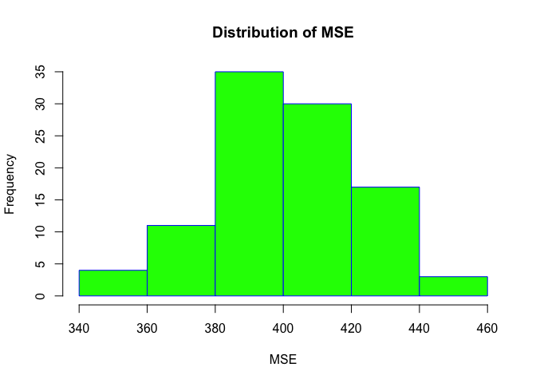

Problem set \#7: Re-Sampling and Non-Linearity
================
Sushmita V Gopalan

-   [Part 1](#part-1)

Part 1
------

-   Question 1 \*

Y = β0 + β1X1 + β2X2 + β3X3 + β4X4 + β5X5 + ϵ

where Y is the Joe Biden feeling thermometer, X1 is age, X2 is gender, X3 is education, X4 is Democrat, and X5 is Republican.\[2\] Report the parameters and standard errors.

``` r
model1 <- lm(biden ~ ., data = biden)
tidy(model1)
```

    ##          term estimate std.error statistic  p.value
    ## 1 (Intercept)  58.8113    3.1244     18.82 2.69e-72
    ## 2      female   4.1032    0.9482      4.33 1.59e-05
    ## 3         age   0.0483    0.0282      1.71 8.77e-02
    ## 4        educ  -0.3453    0.1948     -1.77 7.64e-02
    ## 5         dem  15.4243    1.0680     14.44 8.14e-45
    ## 6         rep -15.8495    1.3114    -12.09 2.16e-32

``` r
 mse <- function(model, data) {
  x <- modelr:::residuals(model, data)
  mean(x ^ 2, na.rm = TRUE)
 }

mse(model1,biden)
```

    ## [1] 395

MSE = 395

-   Question 3 \*

Estimate the test MSE of the model using the validation set approach.

Split the sample set into a training set (70%) and a validation set (30%). Be sure to set your seed prior to this part of your code to guarantee reproducibility of results. Fit the linear regression model using only the training observations. Calculate the MSE using only the test set observations. How does this value compare to the training MSE from step 1?

``` r
# split data into testing and training subsets
set.seed(1234)

biden_split <- resample_partition(biden, c(test = 0.3, train = 0.7))
# fit model on training data 
train_model <- lm(biden ~ ., data = biden_split$train,)
summary(train_model)
```

    ## 
    ## Call:
    ## lm(formula = biden ~ ., data = biden_split$train)
    ## 
    ## Residuals:
    ##    Min     1Q Median     3Q    Max 
    ##  -75.8  -10.7    0.9   12.9   53.7 
    ## 
    ## Coefficients:
    ##             Estimate Std. Error t value Pr(>|t|)    
    ## (Intercept)  57.3374     3.6977   15.51  < 2e-16 ***
    ## female        4.1721     1.1267    3.70  0.00022 ***
    ## age           0.0373     0.0336    1.11  0.26770    
    ## educ         -0.2602     0.2322   -1.12  0.26275    
    ## dem          16.3277     1.2766   12.79  < 2e-16 ***
    ## rep         -14.6070     1.5580   -9.38  < 2e-16 ***
    ## ---
    ## Signif. codes:  0 '***' 0.001 '**' 0.01 '*' 0.05 '.' 0.1 ' ' 1
    ## 
    ## Residual standard error: 19.9 on 1259 degrees of freedom
    ## Multiple R-squared:  0.279,  Adjusted R-squared:  0.276 
    ## F-statistic: 97.3 on 5 and 1259 DF,  p-value: <2e-16

``` r
# find MSE using test observations
mse(train_model,biden_split$test)
```

    ## [1] 400

MSE = 400 is higher than the previous MSE.

-   Question 3 \* Repeat the validation set approach 100 times, using 100 different splits of the observations into a training set and a validation set. Comment on the results obtained.

``` r
list <- numeric(100)
for (i in 1:100){
  biden_split <- resample_partition(biden, c(test = 0.3, train = 0.7))
  # fit model on training data 
  train_model <- lm(biden ~ ., data = biden_split$train,)
  list[i] <- mse(train_model,biden_split$test)
}

mse_val = mean(list)
mse_val
```

    ## [1] 402



-   Question 4 \* Estimate the test MSE of the model using the leave-one-out cross-validation (LOOCV) approach. Comment on the results obtained.

``` r
loocv_data <- crossv_kfold(biden, k = nrow(biden))
loocv_models <- map(loocv_data$train, ~ lm(biden ~ ., data = .))
loocv_mse <- map2_dbl(loocv_models, loocv_data$test, mse)
mean(loocv_mse)
```

    ## [1] 398

-   Question 5 \*

Estimate the test MSE of the model using the 10-fold cross-validation approach. Comment on the results obtained.

``` r
cv10_data <- crossv_kfold(biden, k = 10)
cv10_models <- map(cv10_data$train, ~ lm(biden ~ ., data = .))
cv10_mse <- map2_dbl(loocv_models, loocv_data$test, mse)
mean(cv10_mse)
```

    ## [1] 398

-   Question 6 \*

Repeat the 10-fold cross-validation approach 100 times, using 100 different splits of the observations into 10-folds. Comment on the results obtained.

``` r
list <- numeric(100)
for (i in 1:100){
  biden_split <- resample_partition(biden, c(test = 0.3, train = 0.7))
  # fit model on training data 
  cv10_data <- crossv_kfold(biden, k = 10)
  cv10_models <- map(cv10_data$train, ~ lm(biden ~ ., data = .))
  cv10_mse <- map2_dbl(loocv_models, loocv_data$test, mse)
  list[i] <- mse(train_model,biden_split$test)
}

mse_val = mean(list)
mse_val
```

    ## [1] 396

-   Question 7 \*

Compare the estimated parameters and standard errors from the original model in step 1 (the model estimated using all of the available data) to parameters and standard errors estimated using the bootstrap (n = 1000).

``` r
# bootstrapped estimates of the parameter estimates and standard errors
biden_boot <- biden %>%
  modelr::bootstrap(1000) %>%
  mutate(model = map(strap, ~ lm(biden ~ ., data = .)),
         coef = map(model, tidy))

biden_boot %>%
  unnest(coef) %>%
  group_by(term) %>%
  summarize(est.boot = mean(estimate),
            se.boot = sd(estimate, na.rm = TRUE))
```

    ## # A tibble: 6 × 3
    ##          term est.boot se.boot
    ##         <chr>    <dbl>   <dbl>
    ## 1 (Intercept)  58.8084  3.0195
    ## 2         age   0.0487  0.0287
    ## 3         dem  15.4386  1.0896
    ## 4        educ  -0.3458  0.1947
    ## 5      female   4.1012  0.9583
    ## 6         rep -15.8823  1.4073

The estimates from the bootstrapped
