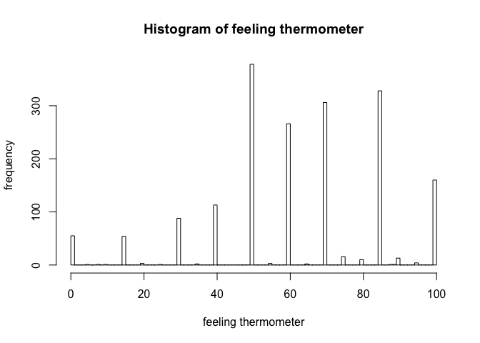

    bd = read.csv("biden.csv",header=T)

Describe the data
-----------------

    hist(bd$biden,breaks=c(0:100),main = "Histogram of feeling thermometer",xlab = "feeling thermometer",ylab="frequency")

We can see from the histogram above that most of participants of the
survey gave scores above 50, which shows a general positive feeling
towards Biden. The mode is around 50 and there are several other peaks
above 50. One interesting feature is that most scores takes one of the
following values: 0,15, 30,40,50,60,70,85,100. Therefore we can observe
9 peaks. One reason may be related to the design of the survey. Maybe
the survey provided several discrete scores for participants to choose
from. Another reason is that participants are more likely to give scores
the number value of which ends with 0 or 5.

Simple linear regression
------------------------

    sim <- lm(biden~age,data = bd)
    summary(sim)

    ## 
    ## Call:
    ## lm(formula = biden ~ age, data = bd)
    ## 
    ## Residuals:
    ##     Min      1Q  Median      3Q     Max 
    ## -64.876 -12.318  -1.257  21.684  39.617 
    ## 
    ## Coefficients:
    ##             Estimate Std. Error t value Pr(>|t|)    
    ## (Intercept) 59.19736    1.64792   35.92   <2e-16 ***
    ## age          0.06241    0.03267    1.91   0.0563 .  
    ## ---
    ## Signif. codes:  0 '***' 0.001 '**' 0.01 '*' 0.05 '.' 0.1 ' ' 1
    ## 
    ## Residual standard error: 23.44 on 1805 degrees of freedom
    ## Multiple R-squared:  0.002018,   Adjusted R-squared:  0.001465 
    ## F-statistic: 3.649 on 1 and 1805 DF,  p-value: 0.05626

*b**e**t**a*0 = 59.19736
 and its standard error is
1.64792
.
