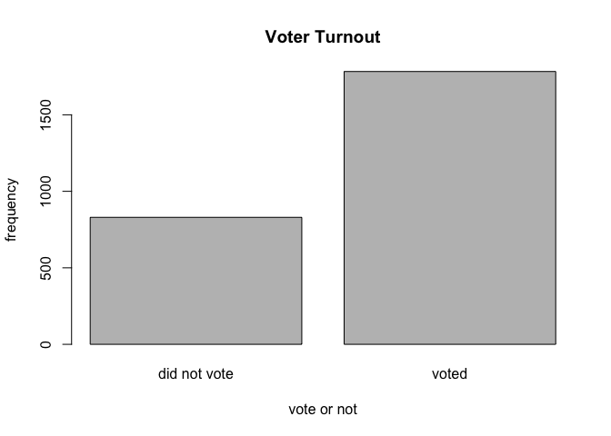
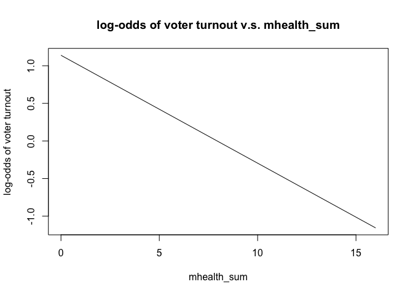
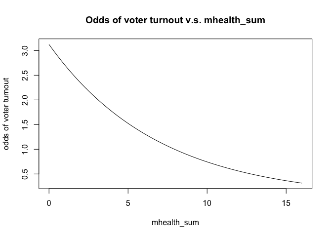
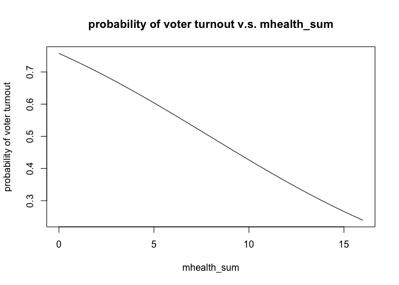
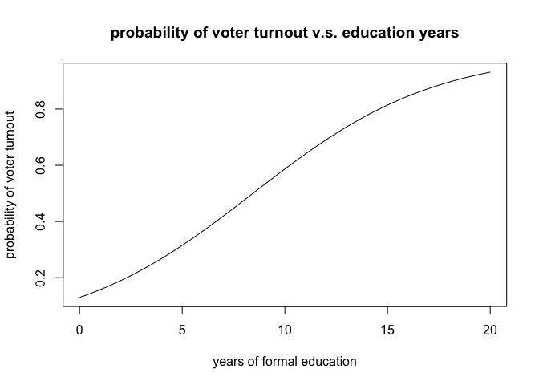
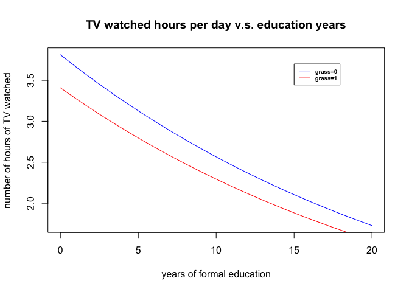

    # if ROCR package not installed, uncomment the next line
    #install.packages("ROCR")
    library(ROCR)

    ## Loading required package: gplots

    ## 
    ## Attaching package: 'gplots'

    ## The following object is masked from 'package:stats':
    ## 
    ##     lowess

    vt = read.csv("mental_health.csv",header=TRUE)

Describe the data
=================

    tab<-table(vt$vote96)
    barplot(tab, names.arg=c('did not vote','voted'),main="Voter Turnout",xlab="vote or not",ylab="frequency") 

    prob_vote = tab['1']/(tab['0']+tab['1'])
    prob_vote

    ##         1 
    ## 0.6823574

1.  The histogram is shown above, and the unconditional probability of a
    given individual turning out to be a vote is 0.6823574.

<!-- -->

    plot(vt$mhealth_sum,vt$vote96,pch=20,ylab="vote or not",xlab="mental health index")
    crude_lm = lm(vote96~mhealth_sum,data=vt)
    abline(crude_lm,col='red')

1.  The scatter plot between mental health and observed voter turnout is
    shown above with the overlaid linear smoothing line. We can see from
    the fitted line that those who suffer from depressed mood more
    severely are more reluctant to vote. The problem of applying linear
    regression model here is that the repsonse varible is meant to be
    binary, however using this linear model we will predict the response
    variable to be a real number given a mental health index, and if the
    given mental health index is limited within the scope from 0 to 9 as
    specified, the predicted values of the response variable will be in
    the range approximately from 0.47 to 0.76, which is hard to
    interpret if we want to do some further classification based on it,
    and it also implies that the assumed linear relationship between
    variable mhealth\_sum and variable voter96 is problematic.

Basic model
===========

    basic_vt = glm(vote96~mhealth_sum,data=vt,family = binomial)
    summary(basic_vt)

    ## 
    ## Call:
    ## glm(formula = vote96 ~ mhealth_sum, family = binomial, data = vt)
    ## 
    ## Deviance Residuals: 
    ##     Min       1Q   Median       3Q      Max  
    ## -1.6834  -1.2977   0.7452   0.8428   1.6911  
    ## 
    ## Coefficients:
    ##             Estimate Std. Error z value Pr(>|z|)    
    ## (Intercept)  1.13921    0.08444  13.491  < 2e-16 ***
    ## mhealth_sum -0.14348    0.01969  -7.289 3.13e-13 ***
    ## ---
    ## Signif. codes:  0 '***' 0.001 '**' 0.01 '*' 0.05 '.' 0.1 ' ' 1
    ## 
    ## (Dispersion parameter for binomial family taken to be 1)
    ## 
    ##     Null deviance: 1672.1  on 1321  degrees of freedom
    ## Residual deviance: 1616.7  on 1320  degrees of freedom
    ##   (1510 observations deleted due to missingness)
    ## AIC: 1620.7
    ## 
    ## Number of Fisher Scoring iterations: 4

1.  The relationship between mental health and voter turnout is
    statistically significant since the P value of the coefficient of
    variable mhealth\_sum is pretty close to zero. The relationship is
    also substantively significant because the estimated coefficient of
    variable mhealth\_sum is -0.14348, which amounts to a decrease of
    *e*−0.14348=0.8663381 in odds ratio if variable
    mhealth\_sum increases by 1 unit.

2.  The estimated coefficient of variable mhealth\_sum is -0.14348 means
    that if variable mhealth\_sum increases by 1 unit, the log-odds of
    voter turnout will decrease by 0.14348. The relationship between
    mental health and the log-odds of voter turnout is shown below.

<!-- -->

    plot(c(0:16),predict(basic_vt,list(mhealth_sum=c(0:16))),xlab = "mhealth_sum",ylab="log-odds of voter turnout",main="log-odds of voter turnout v.s. mhealth_sum", type='l')

1.  The estimated coefficient of variable mhealth\_sum is -0.14348 also
    means that if variable mhealth\_sum increases by 1 unit from
    *x*0, the odds of voter turnout will decrease from
    *e*1.13921 − 0.14348 \* *x*0 to
    *e*0.99573 − 0.14348 \* *x*0.The relationship
    between mental health and the odds of voter turnout is shown below.

<!-- -->

    expr = function(x){exp(predict(basic_vt,list(mhealth_sum=x)))}
    curve(expr,from=0,to=16,xlab = "mhealth_sum",ylab="odds of voter turnout",main="Odds of voter turnout v.s. mhealth_sum")

1.  The estimated coefficient of variable mhealth\_sum is -0.14348 also
    means that if variable mhealth\_sum increases by 1 unit from
    *x*0, the probability of voter turnout will decrease from
    *e*1.13921 − 0.14348 \* *x*0/(1 + *e*1.13921 − 0.14348 \* *x*0)
    to
    *e*0.99573 − 0.14348 \* *x*0/(1 + *e*0.99573 − 0.14348 \* *x*0).
    The relationship between mental health and the probability of voter
    turnout is shown below. The first difference for an increase in the
    mental health index from 1 to 2 is -0.0291793, and the first
    difference for an increase in the mental health index from 5 to 6
    is -0.03477953.

<!-- -->

    expr = function(x){1/(1+exp(-predict(basic_vt,list(mhealth_sum=x))))}
    curve(expr,from=0,to=16,xlab = "mhealth_sum",ylab="probability of voter turnout",main="probability of voter turnout v.s. mhealth_sum")

1.  We choose a threshold of 0.5 such that if the predicted probability
    of voter turnout is greater than or equal to 0.5, we consider this
    person will vote, but if the probability is less than 0.5, we
    predict this person will not vote. After some calculations we find
    the accracy rate is 0.677761. However, notice that the the modal
    category of the varible vote95 from the data used for training the
    basic model is vote95=1, which means if we blindly predict all voter
    turnout to be 1, the number of error using the useless classifier
    would be the number of 1s in the vote95 column of the dataframe we
    use for training the basic model, which filters out all observations
    with missing values in either column vote95 or column mhealth\_sum,
    and the number of error using the useless classifier is 433. Now
    using the basic model, we find that the number of wrong prediction
    is 426, so the proportion reduction error is
    (433 − 426)/(433)=1.616628%, which means the basic model is slightly
    better than the useless classifier in terms of error rate of
    prediction. The AUC for the basic model is 0.6243087. So the basic
    model using only mhealth\_sum as predictor is not a good model.

<!-- -->

    threshold = 0.5
    pred_prob = predict(basic_vt,type="response")
    # filter out observations with missing values in either column vote95 or column mhealth_sum
    tmp_df = vt[complete.cases(vt[,1:2]),1:2]
    tab = table(pred_prob>threshold,tmp_df$vote96)
    accuracy_rate = (tab['FALSE','0']+tab['TRUE','1'])/(tab['FALSE','0']+tab['TRUE','1']+tab['FALSE','1']+tab['TRUE','0'])
    print(accuracy_rate)

    ## [1] 0.677761

    useless_classifier_error = tab['FALSE','0']+tab['TRUE','0']
    basic_model_error = tab['FALSE','1']+tab['TRUE','0']
    print(useless_classifier_error)

    ## [1] 433

    print(basic_model_error)

    ## [1] 426

    pred = prediction(pred_prob, tmp_df$vote96)
    auc=as.numeric(performance(pred, "auc")@y.values)
    print(auc)

    ## [1] 0.6243087

Multiple variable model
=======================

1.  The probability distribution is the Bernoulli distribution:
    *P**r*(*v**o**t**e*96*i* = *v**o**t**e*96*i*)|*π**i*)=*π**i**v**o**t**e*96*i*(1 − *π**i*)(1 − *v**o**t**e*96*i*)
    where *v**o**t**e*96*i* is the random varible of voter
    turnout which can only take values of 0 or 1, therefore the repsonse
    variable *v**o**t**e*96 is drawn from a Bernorlli distribution with
    probability *π* of taking the value 1.

    Next we choose a linear predictor *η**i* as a linear
    function of all other regressors which are other variables:
    *m**h**e**a**l**t**h*\_*s**u**m**i*,
    *a**g**e**i*,*e**d**u**c**i*,*b**l**a**c**k**i*,*f**e**m**a**l**e**i*,*m**a**r**r**i**e**d**i*
    and *i**n**c*10*i*. The linear function therefore is:

    *η**i* = *α* + *β*1*m**h**e**a**l**t**h*\_*s**u**m**i* + *β*2*a**g**e* + *β*3*e**d**u**c* + *β*4*b**l**a**c**k* + *β*5*f**e**m**a**l**e* + *β*6*m**a**r**r**i**e**d* + *β*7*i**n**c*10

    Next since probability *π**i* takes value only between 0
    and 1 while *η**i* could take any real number, we need a
    mapping or link function to map *η**i* to
    *π**i*, a natural choice is the sigmoid transformation:

    $\\pi\_i=\\frac{1}{1+e^{-\\eta\_i}}$ then plug in the expression for
    *η**i* above into this equation.

2.  

<!-- -->

    multi_vt = glm(vote96~mhealth_sum + age + educ + black + female + married + inc10,data=vt,family = binomial)
    summary(multi_vt)

    ## 
    ## Call:
    ## glm(formula = vote96 ~ mhealth_sum + age + educ + black + female + 
    ##     married + inc10, family = binomial, data = vt)
    ## 
    ## Deviance Residuals: 
    ##     Min       1Q   Median       3Q      Max  
    ## -2.4843  -1.0258   0.5182   0.8428   2.0758  
    ## 
    ## Coefficients:
    ##              Estimate Std. Error z value Pr(>|z|)    
    ## (Intercept) -4.304103   0.508103  -8.471  < 2e-16 ***
    ## mhealth_sum -0.089102   0.023642  -3.769 0.000164 ***
    ## age          0.042534   0.004814   8.835  < 2e-16 ***
    ## educ         0.228686   0.029532   7.744 9.65e-15 ***
    ## black        0.272984   0.202585   1.347 0.177820    
    ## female      -0.016969   0.139972  -0.121 0.903507    
    ## married      0.296915   0.153164   1.939 0.052557 .  
    ## inc10        0.069614   0.026532   2.624 0.008697 ** 
    ## ---
    ## Signif. codes:  0 '***' 0.001 '**' 0.01 '*' 0.05 '.' 0.1 ' ' 1
    ## 
    ## (Dispersion parameter for binomial family taken to be 1)
    ## 
    ##     Null deviance: 1468.3  on 1164  degrees of freedom
    ## Residual deviance: 1241.8  on 1157  degrees of freedom
    ##   (1667 observations deleted due to missingness)
    ## AIC: 1257.8
    ## 
    ## Number of Fisher Scoring iterations: 4

The estimated intercept is -4.304103 with standard error 0.508103. The
estimated coefficients of predictors mhealth\_sum, age, educ, black,
female, married and inc10 are -0.089102, 0.042534, 0.228686, 0.272984,
-0.016969, 0.296915 and 0.069614 respectively, and the corresponding
standard error 0.023642, 0.004814, 0.029532, 0.202585, 0.139972,
0.153164 and 0.026532. Among the 7 coefficients, 2 are not statistically
significant, one is variable female's and and the other one is variable
black's, which means these two predictors may not be strong predictors
of the response variable in this model. As a whole, the multiple
variable model is better than the basic model as the AIC decrease from
1620.7 to 1257.8.

1.  So if predictor black and predictor female are not strong predictors
    as the previous result shows, we could remove them from the model
    and run the logistic regression using the other variables:

<!-- -->

    multi1_vt = glm(vote96~mhealth_sum + educ+ age+married+inc10 ,data=vt,family = binomial)
    summary(multi1_vt)

    ## 
    ## Call:
    ## glm(formula = vote96 ~ mhealth_sum + educ + age + married + inc10, 
    ##     family = binomial, data = vt)
    ## 
    ## Deviance Residuals: 
    ##     Min       1Q   Median       3Q      Max  
    ## -2.4907  -1.0297   0.5192   0.8418   2.1205  
    ## 
    ## Coefficients:
    ##              Estimate Std. Error z value Pr(>|z|)    
    ## (Intercept) -4.200133   0.497962  -8.435  < 2e-16 ***
    ## mhealth_sum -0.088332   0.023603  -3.742 0.000182 ***
    ## educ         0.225271   0.029376   7.669 1.74e-14 ***
    ## age          0.042113   0.004791   8.790  < 2e-16 ***
    ## married      0.293856   0.153009   1.921 0.054793 .  
    ## inc10        0.066239   0.026207   2.528 0.011487 *  
    ## ---
    ## Signif. codes:  0 '***' 0.001 '**' 0.01 '*' 0.05 '.' 0.1 ' ' 1
    ## 
    ## (Dispersion parameter for binomial family taken to be 1)
    ## 
    ##     Null deviance: 1468.3  on 1164  degrees of freedom
    ## Residual deviance: 1243.6  on 1159  degrees of freedom
    ##   (1667 observations deleted due to missingness)
    ## AIC: 1255.6
    ## 
    ## Number of Fisher Scoring iterations: 4

Now we observe the AIC value drops from 1257.8 to 1255.6, and more
importantly, this model is more parsimonious than the previous one. We
can then estimate the accuracy rate, pRE and AUC of this model:

    threshold = 0.5
    pred_prob = predict(multi1_vt,type="response")
    # filter out observations with missing values in at least one column of dataframe vt
    tmp_df = vt[complete.cases(vt),]
    tab = table(pred_prob>threshold,tmp_df$vote96)
    accuracy_rate = (tab['FALSE','0']+tab['TRUE','1'])/(tab['FALSE','0']+tab['TRUE','1']+tab['FALSE','1']+tab['TRUE','0'])
    print(accuracy_rate)

    ## [1] 0.7201717

    multiple_model_error = tab['FALSE','1']+tab['TRUE','0']

    print(multiple_model_error)

    ## [1] 326

    pred = prediction(pred_prob, tmp_df$vote96)
    auc=as.numeric(performance(pred, "auc")@y.values)
    print(auc)

    ## [1] 0.758913

We find that the accuracy rate increases from 0.677761 by using the
basic model to 0.7201717, and the number of error prediction decreases
from 426 to 326, so PRE is (426 − 326)/426 = 23.47418%, and AUC improves
from 0.6243087 to 0.758913. All these criterion indicate this multiple
variable model is better than the previous basic model.

Next we can observe that among all predictors in the model, predictor
married seems the most sbustantively significant. So keeping all other
predictors fixed, we can estimate the effect of years of formal
education on the response variable in terms of predicted probability of
voter turnout. Assume the values of all other predictors are:
mhealth\_sum = 3, age = 35, married=1 and inc10 =12k. We can graph the
relationship between years of formal education and the probability of
voter turnout as below:

    expr = function(x){predict(multi1_vt,data.frame(mhealth_sum=3,age=35,educ=x,married=1,inc10=12),type="response")}
    curve(expr,from=0,to=20,xlab = "years of formal education",ylab="probability of voter turnout",main="probability of voter turnout v.s. education years")

From the above we can see a clear trend of increase in probability of
voter turnout as the voter's years of formal education increases.
Keeping other predictors fixed, someone with 20-year formal education,
probably with a PhD degree, is predicted to be 93% sure to vote, but the
probabilty drops to around 36% for those who have only 5-year formal
education. Therefore voter turnout rate will increase if our education
system is improved and thus more people will become aware of the value
and benefits of political participation.

Estimate a regression model
===========================

    tv = read.csv("gss2006.csv",header=TRUE)

1.  The probability distribution is the Poisson distribution:
    $Pr(tvhours\_{i}=t)|\\mu\_{i})=\\frac{\\mu^{-tvhours\_i}e^{-\\mu}}{tvhours\_i!}$
    where *t**v**h**o**u**r**s**i* is the random varible of
    number of hours of TV watched per day which can only take values of
    {0,1,2...}, therefore the repsonse variable *t**v**h**o**u**r**s* is
    drawn from a Poisson distribution with rate *μ*.

    Next we choose a linear predictor *η**i* as a linear
    function of all other regressors which are other variables: ,
    *a**g**e**i*,*c**h**i**l**d**s**i*,*e**d**u**c**i*,*f**e**m**a**l**e**i*,*g**r**a**s**s**i*,*h**r**s**r**e**l**a**x**i*,
    *b**l**a**c**k**i*,*s**o**c**i**a**l*\_*c**o**n**n**e**c**t**i*,*v**o**t**e**d*04*i*,*x**m**o**v**i**e**i*,*z**o**d**i**a**c**i*.
    The linear function therefore is:

    *η**i* = *α* + *β*1*a**g**e**i* + *β*2*c**h**i**l**d**s**i* + *β*3*e**d**u**c**i* + *β*4*f**e**m**a**l**e**i* + *β*5*g**r**a**s**s**i* + *β*6*h**r**s**r**e**l**a**x**i* + *β*7*b**l**a**c**k**i* + *β*8*s**o**c**i**a**l*\_*c**o**n**n**e**c**t**i* + *β*9*v**o**t**e**d*04*i* + *β*10*x**m**o**v**i**e**i* + *β*11*z**o**d**i**a**c**i*

    Next since the average rate *μ**i* only takes postive
    valuewhile *η**i* could take any real number, we need a
    mapping or link function to map *η**i* to
    *μ**i*, a natural choice is the exponential
    transformation:

    *μ**i* = *e**η**i* and then plug in
    the expression for *η**i* above into this equation.

2.  

<!-- -->

    poi_tv = glm(tvhours~.-ind,data=tv,family = "poisson")
    summary(poi_tv)

    ## 
    ## Call:
    ## glm(formula = tvhours ~ . - ind, family = "poisson", data = tv)
    ## 
    ## Deviance Residuals: 
    ##     Min       1Q   Median       3Q      Max  
    ## -3.1120  -0.6741  -0.1144   0.4224   4.9257  
    ## 
    ## Coefficients:
    ##                     Estimate Std. Error z value Pr(>|z|)    
    ## (Intercept)        1.0795865  0.2419794   4.461 8.14e-06 ***
    ## age                0.0016522  0.0028397   0.582   0.5607    
    ## childs            -0.0003896  0.0238729  -0.016   0.9870    
    ## educ              -0.0292174  0.0126351  -2.312   0.0208 *  
    ## female             0.0457000  0.0652987   0.700   0.4840    
    ## grass             -0.1002726  0.0686146  -1.461   0.1439    
    ## hrsrelax           0.0468472  0.0102790   4.558 5.18e-06 ***
    ## black              0.4657924  0.0841629   5.534 3.12e-08 ***
    ## social_connect     0.0437349  0.0407999   1.072   0.2837    
    ## voted04           -0.0994787  0.0785680  -1.266   0.2055    
    ## xmovie             0.0708408  0.0773420   0.916   0.3597    
    ## zodiacAries       -0.1011364  0.1508248  -0.671   0.5025    
    ## zodiacCancer       0.0267776  0.1451557   0.184   0.8536    
    ## zodiacCapricorn   -0.2155760  0.1657034  -1.301   0.1933    
    ## zodiacGemini       0.0285895  0.1481143   0.193   0.8469    
    ## zodiacLeo         -0.1515676  0.1553215  -0.976   0.3291    
    ## zodiacLibra       -0.0392537  0.1379102  -0.285   0.7759    
    ## zodiacNaN         -0.2985240  0.2126126  -1.404   0.1603    
    ## zodiacPisces      -0.1446731  0.1649895  -0.877   0.3806    
    ## zodiacSagittarius -0.2177846  0.1577638  -1.380   0.1674    
    ## zodiacScorpio      0.0225911  0.1538460   0.147   0.8833    
    ## zodiacTaurus      -0.1273891  0.1644799  -0.774   0.4386    
    ## zodiacVirgo       -0.1240442  0.1564495  -0.793   0.4279    
    ## dem                0.0103276  0.0917055   0.113   0.9103    
    ## rep                0.0148615  0.0927662   0.160   0.8727    
    ## ---
    ## Signif. codes:  0 '***' 0.001 '**' 0.01 '*' 0.05 '.' 0.1 ' ' 1
    ## 
    ## (Dispersion parameter for poisson family taken to be 1)
    ## 
    ##     Null deviance: 527.72  on 440  degrees of freedom
    ## Residual deviance: 429.42  on 416  degrees of freedom
    ##   (4069 observations deleted due to missingness)
    ## AIC: 1600.4
    ## 
    ## Number of Fisher Scoring iterations: 5

    poi_tv1 = glm(tvhours~educ+grass+hrsrelax+black,data=tv,family = "poisson")
    summary(poi_tv1)

    ## 
    ## Call:
    ## glm(formula = tvhours ~ educ + grass + hrsrelax + black, family = "poisson", 
    ##     data = tv)
    ## 
    ## Deviance Residuals: 
    ##     Min       1Q   Median       3Q      Max  
    ## -3.0020  -0.7578  -0.0931   0.4745   5.4017  
    ## 
    ## Coefficients:
    ##              Estimate Std. Error z value Pr(>|z|)    
    ## (Intercept)  1.252169   0.167757   7.464 8.38e-14 ***
    ## educ        -0.039589   0.010915  -3.627 0.000287 ***
    ## grass       -0.111854   0.060572  -1.847 0.064803 .  
    ## hrsrelax     0.043044   0.009264   4.646 3.38e-06 ***
    ## black        0.452819   0.070783   6.397 1.58e-10 ***
    ## ---
    ## Signif. codes:  0 '***' 0.001 '**' 0.01 '*' 0.05 '.' 0.1 ' ' 1
    ## 
    ## (Dispersion parameter for poisson family taken to be 1)
    ## 
    ##     Null deviance: 538.60  on 459  degrees of freedom
    ## Residual deviance: 454.77  on 455  degrees of freedom
    ##   (4050 observations deleted due to missingness)
    ## AIC: 1638
    ## 
    ## Number of Fisher Scoring iterations: 5

After initially running the poisson regression with all potential
predictors and selecting out redundant variables in the order of big
p-value to small p-value, four predictor remained: educ, grass, hrsrelax
and black, and the model has AIC 1638. Now the linear predictor:
*η**i* = *α* + *β*1*e**d**u**c* + *β*2*g**r**a**s**s* + *β*3*h**r**s**r**e**l**a**x* + *β*4*h**r**s**r**e**l**a**x*  
The estimated intercept is 1.252169 with standard error 0.167757, and
the estimated coefficients of educ, grass, hrsrelax and black are
-0.039589, -0.111854, 0.043044 and 0.452819 respectively with standard
error 0.010915, 0.060572, 0.009264, 0.070783 and p-value 0.000287,
0.064803, 3.38e-06 and 1.58e-10.

1.  Generally, the coefficient of a predictor means the change in log
    counts of the number of hours of TV watched per day as the predictor
    increases by 1 unit by fixing other predictors.

Again I want to focus on the effect of years of formal education on the
number of hours of TV watched per day since variable educ is one of the
sigificant predictors. Assume other three predictors grass = 0, hrsrelax
= 2, black = 0. The graph below shows the relationship between predicted
number of hours of TV watched per day and years of education:

    expr1 = function(x){exp(predict(poi_tv1,data.frame(grass=0,hrsrelax=2,educ=x,black=0)))}
    curve(expr1,from=0,to=20,xlab = "years of formal education",ylab="number of hours of TV watched",main="TV watched hours per day v.s. education years",col='blue')
    expr2 = function(x){exp(predict(poi_tv1,data.frame(grass=1,hrsrelax=2,educ=x,black=0)))}
    curve(expr2,from=0,to=20,xlab = "years of formal education",ylab="number of hours of TV watched",main="TV watched hours per day v.s. education years",col='red',add =TRUE)
    legend(15,3.7,legend = c("grass=0","grass=1"),col=c('blue','red'),lty=1,cex = 0.6,text.font=2)

Therefore we can see a general decreasing trend in number of TV watched
hours as people's formal education years increase. A interesting
observation is that those respondents who thinks marjiuana should be
legalized generally spend fewer hours on watching TV than those who
believe marjiuana do. Another obvious difference in TV watched hours is
between black respondents and non-black respondent:

    expr3 = function(x){exp(predict(poi_tv1,data.frame(grass=0,hrsrelax=2,educ=x,black=0)))}
    curve(expr3,from=0,to=20,xlab = "years of formal education",ylab="number of hours of TV watched",main="TV watched hours per day v.s. education years",col='blue',ylim = c(0,8))

    expr4 = function(x){exp(predict(poi_tv1,data.frame(grass=0,hrsrelax=2,educ=x,black=1)))}
    curve(expr4,from=0,to=20,xlab = "years of formal education",ylab="number of hours of TV watched",main="TV watched hours per day v.s. education years",col='red',add =TRUE)
    legend(15,8,legend = c("non-black","black"),col=c('blue','red'),lty=1,cex = 0.6,text.font=2)

We can see that black respondents spend more time on watching TV per day
than non-white respondents.  
In order to check if the model over or under-dispersed, we run the
poisson regression to estimate a quasi-poisson model:

    poi_tv_quasi = glm(tvhours~educ+grass+hrsrelax+black,data=tv,family = "quasipoisson")
    summary(poi_tv_quasi)

    ## 
    ## Call:
    ## glm(formula = tvhours ~ educ + grass + hrsrelax + black, family = "quasipoisson", 
    ##     data = tv)
    ## 
    ## Deviance Residuals: 
    ##     Min       1Q   Median       3Q      Max  
    ## -3.0020  -0.7578  -0.0931   0.4745   5.4017  
    ## 
    ## Coefficients:
    ##              Estimate Std. Error t value Pr(>|t|)    
    ## (Intercept)  1.252169   0.174826   7.162 3.21e-12 ***
    ## educ        -0.039589   0.011375  -3.480 0.000549 ***
    ## grass       -0.111854   0.063124  -1.772 0.077071 .  
    ## hrsrelax     0.043044   0.009655   4.458 1.04e-05 ***
    ## black        0.452819   0.073765   6.139 1.81e-09 ***
    ## ---
    ## Signif. codes:  0 '***' 0.001 '**' 0.01 '*' 0.05 '.' 0.1 ' ' 1
    ## 
    ## (Dispersion parameter for quasipoisson family taken to be 1.086044)
    ## 
    ##     Null deviance: 538.60  on 459  degrees of freedom
    ## Residual deviance: 454.77  on 455  degrees of freedom
    ##   (4050 observations deleted due to missingness)
    ## AIC: NA
    ## 
    ## Number of Fisher Scoring iterations: 5

We can see the dispersion parameter is 1.086044, slightly bigger than 1,
which means the original model is weakly over-dispersed.
