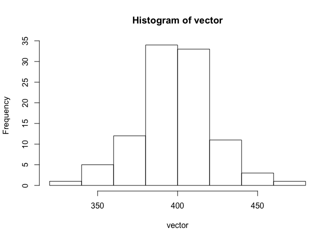
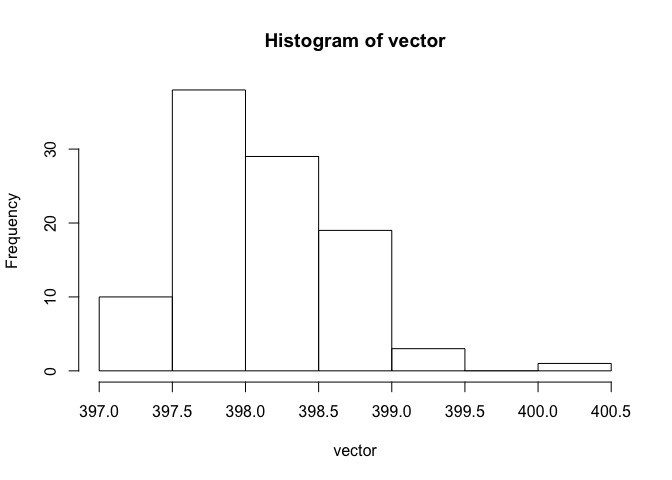
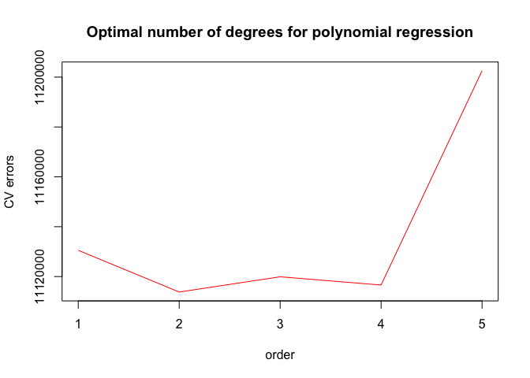
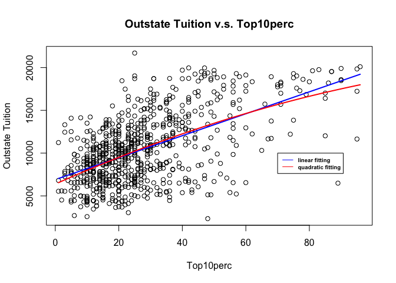
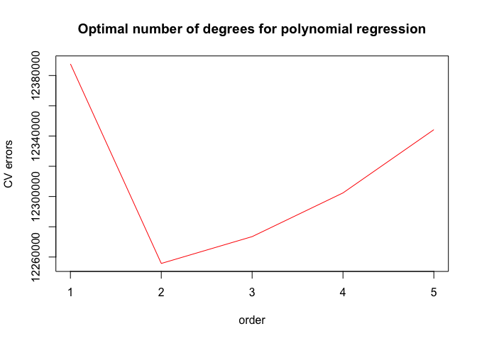
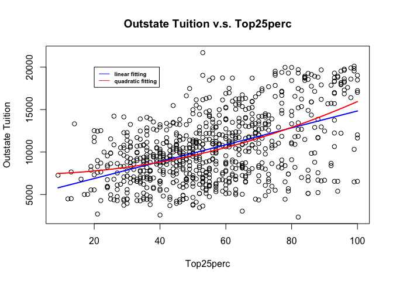
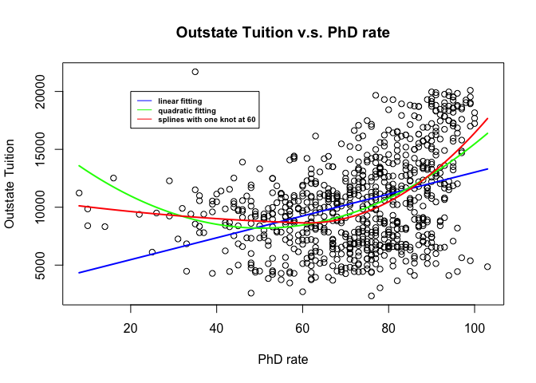
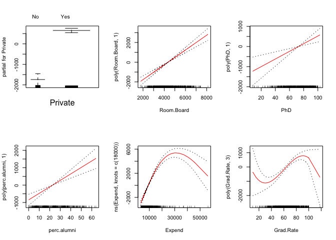

    library(boot)
    # if ISLR not installed uncomment the following line
    #install.packages("ISLR")
    library(ISLR)
    library(splines)
    # if gam not installed uncomment the following line
    #install.packages("gam")
    library(gam)

    ## Loading required package: foreach

    ## Loaded gam 1.14

    bd = read.csv("biden.csv",header=T)

Sexy Joe Biden
==============

1.  Using the whole dataset as the training set, the mean squared error
    for the training set is 395.2702, as shown below.

<!-- -->

    mul = lm(biden~.,data=bd)
    MSE_mul = mean((bd$biden-predict(mul,newdata=bd))^2)
    MSE_mul

    ## [1] 395.2702

1.  Using randomly chosen 70% of the dataset as training set and the
    rest as the test set, the mean square error for the test set is
    466.6841 as shown below, which is bigger than the previous MSE for
    the training data because the previous linear model use the same
    dataset as both the training data and test data.

<!-- -->

    set.seed(1)
    # n is the number of observation
    n = dim(bd)[1]
    train_index = sample(n,n*0.7)
    mul1 = lm(biden~.,data=bd,subset=train_index)
    #[-train_index] is to select out errors in test set
    MSE_mul1 = mean((bd$biden-predict(mul1,newdata=bd))[-train_index]^2)
    MSE_mul1

    ## [1] 466.6841

1.  After repeating the validation set approach 100 times, we can see
    from the histogram below that most of those calculated MSEs are
    around 380~420, but still some MSEs can be as large as above 460 and
    some as small as below 340 for some specific training/test splits,
    so using the validation set approach, the MSE can vary a lot
    depending on different training and test sets.

<!-- -->

    set.seed(1)
    # n is the number of observation
    n  = dim(bd)[1]
    # vector is to store the 100 MSEs
    vector = numeric(length=100)
    for (i in c(1:100)){
      train_index = sample(n,n*0.7)
      mul = lm(biden~.,data=bd,subset=train_index)
      #[-train_index] is to select out errors in test set
      MSE_mul = mean((bd$biden-predict(mul,newdata=bd))[-train_index]^2)
      vector[i] = MSE_mul
    }

    hist(vector)

1.  The MSE using the leave one out cross validation is 397.9555, which
    is less than the MSE using the validation set approach. The reason
    is now the bias decreases due to using larger training set of n-1
    observations compared with the validation set approach only using
    70% observations as the training set. Another difference is the MSE
    using LOOCV is fixed given the dataset while MSEs using validation
    set approach vary depending on different training/test splits.

<!-- -->

    glm.fit = glm(biden~.,data=bd)
    cv.err=cv.glm(bd,glm.fit)
    loocvMSE = cv.err$delta[1]
    loocvMSE

    ## [1] 397.9555

5.Running the code below, the MSE using the 10 fold cross validation is
397.971, which is slightly larger than the MSE using LOOCV due to using
a smaller training set.

    set.seed(1)
    glm.fit = glm(biden~.,data=bd)
    cv.err=cv.glm(bd,glm.fit,K=10)
    tenFoldMSE = cv.err$delta[1]
    tenFoldMSE

    ## [1] 397.971

1.  After repeating the 10-fold cross validation 100 times, we can see
    from the histogram below that all of those calculated MSEs are in
    the range 397~400.5 for all specific training/test splits, therefore
    compared with the validation set approach, the variablility is much
    lower due to the larger training set used in this approach.

<!-- -->

    set.seed(1)
    # vector is to store the 100 MSEs
    vector = numeric(length=100)
    for (i in c(1:100)){
      glm.fit = glm(biden~.,data=bd)
      cv.err=cv.glm(bd,glm.fit,K=10)
      tenFoldMSE = cv.err$delta[1]
      vector[i] = tenFoldMSE
    }
    hist(vector)

1.  Using bootstrap with 1000 resamplings, we can see from the results
    as shown below that compared with the estimated paramters and
    standard errors from the original model in step1, the boostrap
    approach gives the same estimated coefficients as from the original
    model, but the standard errors of these coefficients is larger. The
    reason is that the bootstap approach dosen't rely on some
    assumptions that the original model assumes. For example some
    subsets of the data doesn't follow the linear relationship as
    assumed or sprecified by the original model, therefore when fitting
    these subsets of data into a linear model using the bootstrap, the
    resulting estimated coefficients may vary more than the homogeneous
    error term variance the original model assumes.

<!-- -->

    # first create a function return the estimated coefficient for later call from boot()
    boot.fn = function(data,index)
      return(coef(lm(biden~.,data=data,subset=index)))
    set.seed(1)
    boot(bd,boot.fn,1000)

    ## 
    ## ORDINARY NONPARAMETRIC BOOTSTRAP
    ## 
    ## 
    ## Call:
    ## boot(data = bd, statistic = boot.fn, R = 1000)
    ## 
    ## 
    ## Bootstrap Statistics :
    ##         original        bias    std. error
    ## t1*  58.81125899  0.0123229886  3.06721519
    ## t2*   4.10323009  0.0172845889  0.95943484
    ## t3*   0.04825892 -0.0007487704  0.02907398
    ## t4*  -0.34533479  0.0003029830  0.19734547
    ## t5*  15.42425563 -0.0110274348  1.10377195
    ## t6* -15.84950614 -0.0151718467  1.39910091

    # the result of the original model in step 1
    summary(lm(biden~.,data=bd))$coef

    ##                 Estimate Std. Error    t value     Pr(>|t|)
    ## (Intercept)  58.81125899  3.1244366  18.822996 2.694143e-72
    ## female        4.10323009  0.9482286   4.327258 1.592601e-05
    ## age           0.04825892  0.0282474   1.708438 8.772744e-02
    ## educ         -0.34533479  0.1947796  -1.772952 7.640571e-02
    ## dem          15.42425563  1.0680327  14.441745 8.144928e-45
    ## rep         -15.84950614  1.3113624 -12.086290 2.157309e-32

College(bivariate)
==================

We first consider the bivrariate relationship between variable Outstate
and variable Top10perc. The code below runs polynomial regression from
order 1(linear) to order 5, and calculate the MSEs using 10-fold
cross-validation. We can see that the the optimal order is 2, and the
quadratic fitting is show below as the graph shown below. By running
anova, we can see compared with the linear model, the quadratic model
fits the data better.

    set.seed(1)
    cv.error=rep(0,5)
    for(i in 1:5){
      glm.fit=glm(Outstate~poly(Top10perc,i),data=College)
      cv.error[i] = cv.glm(College,glm.fit,K=10)$delta[1]
    }
    plot(cv.error[1:5],type='l',col='red',xlab='order',ylab='CV errors',main='Optimal number of degrees for polynomial regression')

    Top10perc.lims = range(College$Top10perc)
    Top10perc.grid = seq(from = Top10perc.lims[1],to=Top10perc.lims[2])

    plot(College$Top10perc,College$Outstate,xlab = 'Top10perc',ylab = 'Outstate Tuition',main="Outstate Tuition v.s. Top10perc")
    linear = glm(Outstate~poly(Top10perc,1),data=College)
    fit = lm(Outstate~poly(Top10perc,2),data=College)
    pred = predict(fit,newdata = list(Top10perc=Top10perc.grid),se=T)
    pred.linear = predict(linear,newdata = list(Top10perc=Top10perc.grid),se=T)
    lines(Top10perc.grid,pred.linear$fit,col='blue',lwd=2)
    lines(Top10perc.grid,pred$fit,col='red',lwd=2)
    legend(70,10000,legend = c("linear fitting","quadratic fitting"),col=c('blue','red'),lty=1,cex = 0.6,text.font=2)

    anova(linear,fit,test='F')

    ## Analysis of Deviance Table
    ## 
    ## Model: gaussian, link: identity
    ## 
    ## Response: Outstate
    ## 
    ## Terms added sequentially (first to last)
    ## 
    ## 
    ##                    Df   Deviance Resid. Df Resid. Dev     F    Pr(>F)    
    ## NULL                                   776 1.2559e+10                    
    ## poly(Top10perc, 1)  1 3971446292       775 8.5879e+09 358.4 < 2.2e-16 ***
    ## ---
    ## Signif. codes:  0 '***' 0.001 '**' 0.01 '*' 0.05 '.' 0.1 ' ' 1

Next, we consider the bivrariate relationship between variable Outstate
and variable Top25perc. The code below runs polynomial regression from
order 1(linear) to order 5, and calculate the MSEs using 10-fold
cross-validation. We can see that the optimal order is still 2, and the
quadratic fitting is show below as the graph shown below. By running
anova, we can see compared with the linear model, the quadratic model
fits the data better.

    set.seed(1)
    cv.error=rep(0,5)
    for(i in 1:5){
      glm.fit=glm(Outstate~poly(Top25perc,i),data=College)
      cv.error[i] = cv.glm(College,glm.fit,K=10)$delta[1]
    }
    plot(cv.error[1:5],type='l',col='red',xlab='order',ylab='CV errors',main='Optimal number of degrees for polynomial regression')

    Top25perc.lims = range(College$Top25perc)
    Top25perc.grid = seq(from = Top25perc.lims[1],to=Top25perc.lims[2])

    plot(College$Top25perc,College$Outstate,xlab = 'Top25perc',ylab = 'Outstate Tuition',main="Outstate Tuition v.s. Top25perc")
    linear = glm(Outstate~poly(Top25perc,1),data=College)
    fit = lm(Outstate~poly(Top25perc,2),data=College)
    pred = predict(fit,newdata = list(Top25perc=Top25perc.grid),se=T)
    pred.linear = predict(linear,newdata = list(Top25perc=Top25perc.grid),se=T)
    lines(Top25perc.grid,pred.linear$fit,col='blue',lwd=2)
    lines(Top25perc.grid,pred$fit,col='red',lwd=2)
    legend(20,20000,legend = c("linear fitting","quadratic fitting"),col=c('blue','red'),lty=1,cex = 0.6,text.font=2)

    anova(linear,fit,test='F')

    ## Analysis of Deviance Table
    ## 
    ## Model: gaussian, link: identity
    ## 
    ## Response: Outstate
    ## 
    ## Terms added sequentially (first to last)
    ## 
    ## 
    ##                    Df  Deviance Resid. Df Resid. Dev      F    Pr(>F)    
    ## NULL                                  776 1.2559e+10                     
    ## poly(Top25perc, 1)  1 3.008e+09       775 9.5513e+09 244.07 < 2.2e-16 ***
    ## ---
    ## Signif. codes:  0 '***' 0.001 '**' 0.01 '*' 0.05 '.' 0.1 ' ' 1

Then we consider the bivrariate relationship between variable Outstate
and variable Phd. First by using the linear regression, the CV error is
13836361, and then using the quadratic fittin, the cv error decreases to
12681603, and Finally using piecewise degree 2 polynomial with one knot
spline to fit the data, the cv error further decreases to 12490555. By
running anova, we can see compared with the linear and quadratic model,
the spline model fits the data better, and the spline model shows that
when the percent of faculty with PhD is below 60%, tuition doesn't
change a lot, but in universities where the Phd holding faculty is above
60%, the tuition increases as the Phd holding rate grows.

    set.seed(1)

     linear = glm(Outstate~poly(PhD,1),data=College)
     cv.error.linear=cv.glm(College,linear,K=10)$delta[1]
     #cv.error.linear
     quad = glm(Outstate~poly(PhD,2),data=College)
     cv.error.quad=cv.glm(College,quad,K=10)$delta[1]
     #cv.error.quad
     PhD.lims = range(College$PhD)
     PhD.grid = seq(from = PhD.lims[1],to=PhD.lims[2])
    plot(College$PhD,College$Outstate,xlab='PhD rate',ylab='Outstate Tuition',main="Outstate Tuition v.s. PhD rate")
    fit = glm(Outstate~bs(PhD,knots = c(60),degree=2),data=College)
    pred.spline = predict(fit,newdata = list(PhD=PhD.grid),se=T)
    pred.linear = predict(linear,newdata = list(PhD=PhD.grid),se=T)
    pred.quad = predict(quad,newdata = list(PhD=PhD.grid),se=T)
    lines(PhD.grid,pred.linear$fit,col='blue',lwd=2)
    lines(PhD.grid,pred.quad$fit,col='green',lwd=2)
    lines(PhD.grid,pred.spline$fit,col='red',lwd=2)
    legend(20,20000,legend = c("linear fitting","quadratic fitting",'splines with one knot at 60'),col=c('blue','green','red'),lty=1,cex = 0.6,text.font=2)

    anova(linear,quad,test='F')

    ## Analysis of Deviance Table
    ## 
    ## Model 1: Outstate ~ poly(PhD, 1)
    ## Model 2: Outstate ~ poly(PhD, 2)
    ##   Resid. Df Resid. Dev Df  Deviance      F    Pr(>F)    
    ## 1       775 1.0717e+10                                  
    ## 2       774 9.7579e+09  1 959234300 76.087 < 2.2e-16 ***
    ## ---
    ## Signif. codes:  0 '***' 0.001 '**' 0.01 '*' 0.05 '.' 0.1 ' ' 1

    anova(quad,fit,test='F')

    ## Analysis of Deviance Table
    ## 
    ## Model 1: Outstate ~ poly(PhD, 2)
    ## Model 2: Outstate ~ bs(PhD, knots = c(60), degree = 2)
    ##   Resid. Df Resid. Dev Df  Deviance      F   Pr(>F)   
    ## 1       774 9757921605                                
    ## 2       773 9626847199  1 131074407 10.525 0.001228 **
    ## ---
    ## Signif. codes:  0 '***' 0.001 '**' 0.01 '*' 0.05 '.' 0.1 ' ' 1

College(GAM)
============

1.  I choose 70% observations as the training set and the rest 30%
    observations as the test set.

<!-- -->

    set.seed(1)
    n = dim(College)[1]
    train_index = sample(n,n*0.7)

1.  Running the multivariable linear regression, we can see all six
    predictors are statistically significant and the adjusted R square
    is 0.7332.

<!-- -->

    ols=lm(Outstate~Private+Room.Board+PhD+perc.alumni+Expend+Grad.Rate,data=College,subset=train_index)
    summary(ols)

    ## 
    ## Call:
    ## lm(formula = Outstate ~ Private + Room.Board + PhD + perc.alumni + 
    ##     Expend + Grad.Rate, data = College, subset = train_index)
    ## 
    ## Residuals:
    ##     Min      1Q  Median      3Q     Max 
    ## -7772.3 -1355.6   -53.2  1283.9 10160.6 
    ## 
    ## Coefficients:
    ##               Estimate Std. Error t value Pr(>|t|)    
    ## (Intercept) -3.336e+03  5.359e+02  -6.224 9.80e-10 ***
    ## PrivateYes   2.720e+03  2.503e+02  10.867  < 2e-16 ***
    ## Room.Board   9.774e-01  1.029e-01   9.496  < 2e-16 ***
    ## PhD          3.114e+01  7.065e+00   4.407 1.26e-05 ***
    ## perc.alumni  5.239e+01  9.026e+00   5.804 1.11e-08 ***
    ## Expend       2.264e-01  2.207e-02  10.261  < 2e-16 ***
    ## Grad.Rate    2.953e+01  6.630e+00   4.454 1.03e-05 ***
    ## ---
    ## Signif. codes:  0 '***' 0.001 '**' 0.01 '*' 0.05 '.' 0.1 ' ' 1
    ## 
    ## Residual standard error: 2057 on 536 degrees of freedom
    ## Multiple R-squared:  0.7362, Adjusted R-squared:  0.7332 
    ## F-statistic: 249.3 on 6 and 536 DF,  p-value: < 2.2e-16

1.  After some observations from the scatter plots between variable
    Outstate and each predictor, the generalized additive model is
    specified as:

-   a linear relationship between Outstate and Private
-   a linear relationship between Outstate and Room.Board
-   a linear relationship between Outstate and PhD
-   a linear relationship between Outstate and perc.alumni
-   a natural spline with one knot at Expend = 18000 between Outstate
    and Expend
-   a third order polynomial between Outstate and Grad.Rate.

The adjusted R squared of generalized additive model is 0.7781, higher
than 0.7332 using the OLS. After plotting the graph of relationship
between the repsonse variable Outstate and each predictor, we can see
that keeping other predictor fixed 1) Private universities charge higher
out of state tuition fees than public universities do. 2) Variable
Room.Board, perc.alumni and PhD rate are postively related to out of
state tuition within the whole range of the predictors. 3).
Instructional expenditure per student is positively related to the
tuition when the expenditure is below 18000 but the relationship turns
to negatively related when Expend &gt; 18000. 4) In the intermediate
range of graduation rate, out of state tuition is positively related to
the graduation rate, but the relationship is opposite in the lower and
higher range of graduation rate.

    gam1 = lm(Outstate~Private+poly(Room.Board,1)+poly(PhD,1)+poly(perc.alumni,1)+ns(Expend,knots=c(18000))+poly(Grad.Rate,3),data = College)
    par(mfrow=c(2,3))
    plot.gam(gam1,se=TRUE,col='red')

    summary(gam1)

    ## 
    ## Call:
    ## lm(formula = Outstate ~ Private + poly(Room.Board, 1) + poly(PhD, 
    ##     1) + poly(perc.alumni, 1) + ns(Expend, knots = c(18000)) + 
    ##     poly(Grad.Rate, 3), data = College)
    ## 
    ## Residuals:
    ##     Min      1Q  Median      3Q     Max 
    ## -7171.6 -1190.2    22.7  1275.0  8543.0 
    ## 
    ## Coefficients:
    ##                               Estimate Std. Error t value Pr(>|t|)    
    ## (Intercept)                     5736.5      220.6  26.001  < 2e-16 ***
    ## PrivateYes                      2392.4      196.6  12.168  < 2e-16 ***
    ## poly(Room.Board, 1)            22972.7     2472.0   9.293  < 2e-16 ***
    ## poly(PhD, 1)                    8641.3     2472.4   3.495 0.000501 ***
    ## poly(perc.alumni, 1)           12862.1     2430.7   5.291 1.59e-07 ***
    ## ns(Expend, knots = c(18000))1  14600.9      957.2  15.253  < 2e-16 ***
    ## ns(Expend, knots = c(18000))2    297.8     1236.7   0.241 0.809760    
    ## poly(Grad.Rate, 3)1            15431.7     2384.3   6.472 1.72e-10 ***
    ## poly(Grad.Rate, 3)2            -1104.9     1931.7  -0.572 0.567485    
    ## poly(Grad.Rate, 3)3            -4957.7     1942.0  -2.553 0.010877 *  
    ## ---
    ## Signif. codes:  0 '***' 0.001 '**' 0.01 '*' 0.05 '.' 0.1 ' ' 1
    ## 
    ## Residual standard error: 1895 on 767 degrees of freedom
    ## Multiple R-squared:  0.7807, Adjusted R-squared:  0.7781 
    ## F-statistic: 303.3 on 9 and 767 DF,  p-value: < 2.2e-16

1.  After running the following code, we can see the test set MSE drops
    from 3892989 to 3334775 because by applying non-linear functions to
    some predictors, the generalized add model may be more close to the
    true relationship between the reponse variable Outstate and these
    predictors than the OLS model, and therefore the test set error
    using GAM is smaller than the error using OLS.

<!-- -->

    pred_OLS = predict(ols,newdata=College[-train_index,])
    MSE_OLS = mean((College$Outstate[-train_index]-pred_OLS)^2)
    MSE_OLS

    ## [1] 3892989

    pred_GAM = predict(gam1,newdata=College[-train_index,])
    MSE_GAM = mean((College$Outstate[-train_index]-pred_GAM)^2)
    MSE_GAM

    ## [1] 3334775

1.  To find out which predictors are significantly non-linearly related
    to the response variable, we compare models with predictors before
    and after non-linear transformation using ANOVA F test as blow, and
    we can see predictor Expend and predictor Grad.Rate have a
    non-linear relationship with the reponse variable.

<!-- -->

    gam1 = lm(Outstate~Private+poly(Room.Board,1)+poly(PhD,1)+poly(perc.alumni,1)+ns(Expend,knots=c(18000))+poly(Grad.Rate,3),data = College)

    gam_expend = lm(Outstate~Private+poly(Room.Board,1)+poly(PhD,1)+poly(perc.alumni,1)+poly(Expend,1)+poly(Grad.Rate,3),data = College)
    gam_Grad = lm(Outstate~Private+poly(Room.Board,1)+poly(PhD,1)+poly(perc.alumni,1)+ns(Expend,knots=c(18000))+poly(Grad.Rate,1),data = College)

    #  the following two comparisons are significant
    anova(gam_expend,gam1,test='F')

    ## Analysis of Variance Table
    ## 
    ## Model 1: Outstate ~ Private + poly(Room.Board, 1) + poly(PhD, 1) + poly(perc.alumni, 
    ##     1) + poly(Expend, 1) + poly(Grad.Rate, 3)
    ## Model 2: Outstate ~ Private + poly(Room.Board, 1) + poly(PhD, 1) + poly(perc.alumni, 
    ##     1) + ns(Expend, knots = c(18000)) + poly(Grad.Rate, 3)
    ##   Res.Df        RSS Df Sum of Sq      F    Pr(>F)    
    ## 1    768 3133796255                                  
    ## 2    767 2754836638  1 378959617 105.51 < 2.2e-16 ***
    ## ---
    ## Signif. codes:  0 '***' 0.001 '**' 0.01 '*' 0.05 '.' 0.1 ' ' 1

    anova(gam_Grad,gam1,test='F')

    ## Analysis of Variance Table
    ## 
    ## Model 1: Outstate ~ Private + poly(Room.Board, 1) + poly(PhD, 1) + poly(perc.alumni, 
    ##     1) + ns(Expend, knots = c(18000)) + poly(Grad.Rate, 1)
    ## Model 2: Outstate ~ Private + poly(Room.Board, 1) + poly(PhD, 1) + poly(perc.alumni, 
    ##     1) + ns(Expend, knots = c(18000)) + poly(Grad.Rate, 3)
    ##   Res.Df        RSS Df Sum of Sq      F  Pr(>F)  
    ## 1    769 2779305913                              
    ## 2    767 2754836638  2  24469275 3.4064 0.03366 *
    ## ---
    ## Signif. codes:  0 '***' 0.001 '**' 0.01 '*' 0.05 '.' 0.1 ' ' 1
