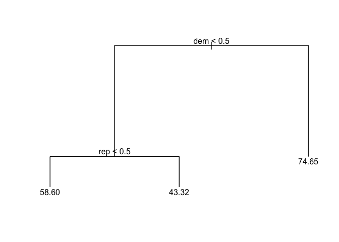
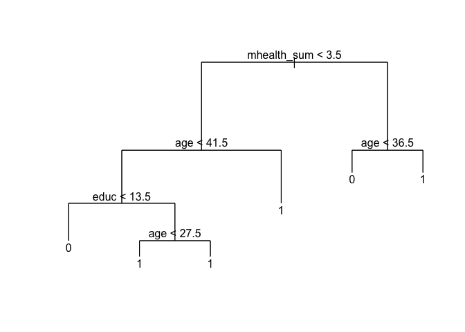
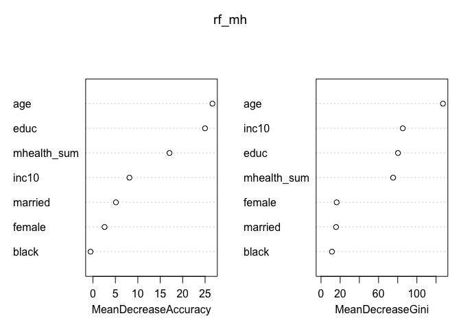
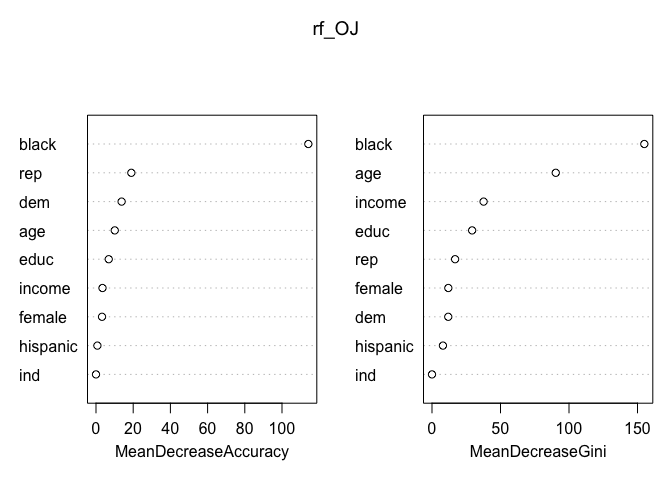

Sexy Joe Biden
==============

1.  

<!-- -->

    set.seed(1)
    n = dim(bd)[1]
    train_index = sample(n,n*0.7)

1.  From the tree as shown below, we can see only two predictors dem and
    rep are used in the tree which implies the party identity is the
    most important determinant of Biden warmth in the tree model with
    default setting, and the average Biden warmth prediction among
    democrats is 74.65, which is higher than the average Biden warmth
    among independents, and the lowest score 43.32 is the average Biden
    warmth among republicans, no surprise. The test MSE is 471.6565.  
    

<!-- -->

    ## [1] 471.6565

1.  Now using the cross validation, we find the best number of leaf
    nodes is 3. Because the tree in 2 has three terminal nodes, the
    optimal pruned tree is the same as the tree shown in 2, and the MSE
    is still 471.6565.

<!-- -->

    ##   [1] 471644.9 471644.9 471644.9 471644.9 471644.9 471644.9 471644.9
    ##   [8] 471644.9 471644.9 471644.9 471644.9 471644.9 471644.9 471644.9
    ##  [15] 471644.9 471644.9 471644.9 471644.9 471644.9 471644.9 471644.9
    ##  [22] 471644.9 471644.9 471644.9 471644.9 471644.9 471644.9 471644.9
    ##  [29] 471644.9 471644.9 471644.9 471644.9 471644.9 471644.9 471644.9
    ##  [36] 471644.9 471644.9 471644.9 471644.9 471644.9 471644.9 471644.9
    ##  [43] 471644.9 471644.9 471644.9 471644.9 471644.9 471644.9 471644.9
    ##  [50] 471644.9 471644.9 471644.9 471644.9 471644.9 471644.9 471644.9
    ##  [57] 471644.9 471644.9 471644.9 471644.9 471644.9 471644.9 471644.9
    ##  [64] 471644.9 471644.9 471644.9 471644.9 471644.9 471644.9 471644.9
    ##  [71] 471644.9 471644.9 471644.9 471644.9 471644.9 471644.9 471644.9
    ##  [78] 471644.9 471644.9 471644.9 471644.9 471644.9 471644.9 471644.9
    ##  [85] 471644.9 471644.9 471644.9 471644.9 471644.9 471644.9 471644.9
    ##  [92] 471644.9 471644.9 471644.9 471644.9 471644.9 471644.9 471644.9
    ##  [99] 471644.9 471644.9 471644.9 471644.9 471644.9 471644.9 471644.9
    ## [106] 471644.9 471644.9 471644.9 471644.9 471644.9 471644.9 471644.9
    ## [113] 471644.9 471644.9 471644.9 471644.9 471644.9 471644.9 509990.3
    ## [120] 655884.2

    ##   [1] 189 188 187 186 184 183 182 181 180 179 178 177 176 175 173 172 171
    ##  [18] 170 169 168 167 166 165 164 162 161 160 159 158 157 156 155 154 153
    ##  [35] 152 150 148 147 146 145 144 143 139 137 136 135 134 133 131 128 127
    ##  [52] 125 124 123 122 121 120 119 118 117 115 114 113 110 109 108 106 105
    ##  [69] 102 101 100  98  97  95  94  93  89  88  87  85  82  80  79  73  71
    ##  [86]  70  68  65  60  55  52  51  50  49  47  46  44  41  37  35  31  30
    ## [103]  29  27  21  20  19  18  16  14  11  10   9   7   6   5   4   3   2
    ## [120]   1

    ## [1] 471.6565

1.  Using the bagging the approach, the test MSE is 533.6648, which is
    bigger than the MSE in question 3 and 2. Here the number of
    variables considered at each split is 5, which is the number of
    all predictors. The variable importance measures show that the two
    most important variables are dem, and rep which is consistent with
    the result in question 2 and 3.

<!-- -->

    set.seed(1)
    bag_bd = randomForest(biden~.,data=bd,subset = train_index,mtry=5,importance=T)
    importance(bag_bd)

    ##          %IncMSE IncNodePurity
    ## female -2.149317      26614.38
    ## age     6.927533     206319.56
    ## educ    1.030202      99546.63
    ## dem    71.910323     142379.63
    ## rep    26.063509      45069.87

    biden_pred2 = predict(bag_bd,newdata = bd[-train_index,])
    biden_test = bd[-train_index,"biden"]
    mean((biden_pred2-biden_test)^2)

    ## [1] 533.6648

1.  Using the random forest approach, the test MSE shrinks to 467.6914.
    Again, from the variable importance measures, we can see the two
    most important predictors are dem and rep. The decrease in MSE is
    due to setting the number of variables considered at each split to
    be 2, compared with all predictors used in the bagging approach. By
    using only 2 predictors at each split, each tree is less likely to
    be correlated with each other, so the average result of all trees is
    more predictive of the test data.

<!-- -->

    set.seed(1)
    bag_bd = randomForest(biden~.,data=bd,subset = train_index,mtry=2,importance=T)
    importance(bag_bd)

    ##          %IncMSE IncNodePurity
    ## female -1.227050      8166.759
    ## age     5.010564     55430.692
    ## educ    2.235145     27345.089
    ## dem    56.913466    106827.422
    ## rep    36.606852     72487.877

    biden_pred2 = predict(bag_bd,newdata = bd[-train_index,])
    biden_test = bd[-train_index,"biden"]
    mean((biden_pred2-biden_test)^2)

    ## [1] 467.6914

1.  Using the boosting approach and setting the shrinkage parameter to
    be 0.004, the MSE is 466.7437, which is lower than all
    previous MSEs. The shrinkage parameter controls the so called
    learning speech, the small shrinkage parameter means a slow learning
    process which tries more different shaped trees for residual
    reduction and hence perform better.

<!-- -->

    set.seed(1)
    boost_bd = gbm(biden~.,data=bd[train_index,],distribution = 'gaussian',shrinkage = 0.004, n.trees = 5000)
    biden_pred3 = predict(boost_bd,newdata = bd[-train_index,],n.trees = 5000)
    biden_test = bd[-train_index,"biden"]
    mean((biden_pred3-biden_test)^2)

    ## [1] 466.7437

Modeling voter turnout
======================

1 First, we fit a decision tree with default setting to the training
data, and we can see from the tree graph that predictor mhealth\_sum,
age and educ are included in the tree. Then using 10-fold cross
validation to change the training/test data splits, we find the average
test error rate is 0.2717857.

    mh$vote96=factor(mh$vote96)

    set.seed(1)
    n = dim(mh)[1]
    train_index = sample(n,n*0.7)
    tree_mh = tree(vote96~.,data=mh,subset=train_index)
    plot(tree_mh)
    text(tree_mh,pretty=0)

    # perform 10 fold cross validation and calculate the average test error rate
    k=10
    n_test = n %/% k
    sum_err = 0
    for (i in c(1:k)){
        test_index = logical(length=n)
        test_index[((i-1)*n_test+1):i*n_test]=TRUE
        train_index = !test_index
        tree_mh = tree(vote96~.,data=mh,subset=train_index)
        mh_pred = predict(tree_mh,newdata=mh[test_index,],type='class')
        tab=table(mh$vote96[test_index],mh_pred)
        err_rate=(tab[1,2]+tab[2,1])/(tab[1,1]+tab[2,2]+tab[1,2]+tab[2,1])
        sum_err=sum_err+err_rate
      }
      mean_err = sum_err/k
      mean_err

    ## [1] 0.2717857

Now use cv.tree() to perform cross validation to determine the optimal
level of tree complexity. From the result of running crossing validation
we can see when the number of terminal nodes is 3, the number of
misclassification is 260 which is the lowest level. So then we use
prune.misclass() function to prune the tree to obtain the 3-node tree,
and the test error rate using the 3-node tree is 0.2879177, which is
slightly higher than the error rate using the tree with default setting

    set.seed(1)
    n = dim(mh)[1]
    train_index = sample(n,n*0.7)
    tree1_mh = tree(vote96~.,data=mh,subset=train_index,
                    control = tree.control(nobs = 0.7*n,mindev=0))
    cv_mh = cv.tree(tree1_mh,FUN=prune.misclass)

    prune_mh = prune.misclass(tree1_mh,best =3)
    summary(prune_mh)

    ## 
    ## Classification tree:
    ## snip.tree(tree = tree1_mh, nodes = c(6L, 7L, 2L))
    ## Variables actually used in tree construction:
    ## [1] "mhealth_sum" "age"        
    ## Number of terminal nodes:  3 
    ## Residual mean deviance:  1.18 = 952.5 / 807 
    ## Misclassification error rate: 0.2864 = 232 / 810

    mh_pred = predict(prune_mh,newdata=mh[-train_index,],type='class')
    tab=table(mh$vote96[-train_index],mh_pred)

    # calculate the test error rate
    err_rate=(tab[1,2]+tab[2,1])/(tab[1,1]+tab[2,2]+tab[1,2]+tab[2,1])
    err_rate

    ## [1] 0.2879177

Then we apply bagging to the voter turnout data, and the average test
error rate using 10 fold cross validation is 0.2366667, which is lower
that the previous two results using tree with default setting and the
pruned tree.

    set.seed(1)
    n = dim(mh)[1]
    train_index = sample(n,n*0.7)
    k=10
    n_test = n %/% k
    sum_err = 0
    for (i in c(1:k)){
        test_index = logical(length=n)
        test_index[((i-1)*n_test+1):i*n_test]=TRUE
        train_index = !test_index
        bag_mh = randomForest(vote96~.,data=mh,subset=train_index,mtry=7,
                               importance=TRUE,na.action = na.omit)
        mh_pred = predict(bag_mh,newdata=mh[test_index,],type='class')
        tab=table(mh$vote96[test_index],mh_pred)
        err_rate=(tab[1,2]+tab[2,1])/(tab[1,1]+tab[2,2]+tab[1,2]+tab[2,1])
        sum_err=sum_err+err_rate
      }
      mean_err = sum_err/k
      mean_err

    ## [1] 0.2366667

Next, we try the random forest and find the average test error rate
using 10 fold cross validation is 0.3033333 when the number of variables
considered at each split is 3.

    set.seed(1)
    n = dim(mh)[1]
    k=10
    n_test = n %/% k
    sum_err = 0
    for (i in c(1:k)){
        test_index = logical(length=n)
        test_index[((i-1)*n_test+1):i*n_test]=TRUE
        train_index = !test_index
        rf_mh = randomForest(vote96~.,data=mh,subset=train_index,mtry=3,
                               importance=TRUE,na.action = na.omit)
        mh_pred = predict(rf_mh,newdata=mh[test_index,],type='class')
        tab=table(mh$vote96[test_index],mh_pred)
        err_rate=(tab[1,2]+tab[2,1])/(tab[1,1]+tab[2,2]+tab[1,2]+tab[2,1])
        sum_err=sum_err+err_rate
      }
      mean_err = sum_err/k
      mean_err

    ## [1] 0.3033333

Finally we use the random forest again but this time set the number of
variables considered at each split to be 2, and find the average test
error rate using 10 fold cross validation is 0.1783333.

    set.seed(1)
    n = dim(mh)[1]
    k=10
    n_test = n %/% k
    sum_err = 0
    for (i in c(1:k)){
        test_index = logical(length=n)
        test_index[((i-1)*n_test+1):i*n_test]=TRUE
        train_index = !test_index
        rf_mh = randomForest(vote96~.,data=mh,subset=train_index,mtry=2,
                               importance=TRUE,na.action = na.omit)
        mh_pred = predict(rf_mh,newdata=mh[test_index,],type='class')
        tab=table(mh$vote96[test_index],mh_pred)
        err_rate=(tab[1,2]+tab[2,1])/(tab[1,1]+tab[2,2]+tab[1,2]+tab[2,1])
        sum_err=sum_err+err_rate
      }
      mean_err = sum_err/k
      mean_err

    ## [1] 0.1783333

Therefore we can see the random forest with the number of variables
considered at each split being 2 is the best tree-base model based on
the average error rate using 10-fold cross-validation. Now use the whole
dataset as the training data, we can see the importance of each variable
as follows by using function importance() and function varImpPlot().
From results of these two functions we find that strong predictors of
voter turnout may be the voter's age, education level, income level and
mental health, and age is the most important predictor.

    set.seed(1)
    rf_mh = randomForest(vote96~.,data=mh,mtry=2,importance=TRUE,na.action = na.omit)
    summary(rf_mh)

    ##                 Length Class  Mode     
    ## call               6   -none- call     
    ## type               1   -none- character
    ## predicted       1165   factor numeric  
    ## err.rate        1500   -none- numeric  
    ## confusion          6   -none- numeric  
    ## votes           2330   matrix numeric  
    ## oob.times       1165   -none- numeric  
    ## classes            2   -none- character
    ## importance        28   -none- numeric  
    ## importanceSD      21   -none- numeric  
    ## localImportance    0   -none- NULL     
    ## proximity          0   -none- NULL     
    ## ntree              1   -none- numeric  
    ## mtry               1   -none- numeric  
    ## forest            14   -none- list     
    ## y               1165   factor numeric  
    ## test               0   -none- NULL     
    ## inbag              0   -none- NULL     
    ## terms              3   terms  call     
    ## na.action       1667   omit   numeric

    importance(rf_mh)

    ##                     0          1 MeanDecreaseAccuracy MeanDecreaseGini
    ## mhealth_sum 15.900343  8.6086235           17.0651851         75.21467
    ## age         20.543853 18.3164484           26.6403008        127.17654
    ## educ        17.534085 18.2986726           24.9884023         80.28048
    ## black       -5.975181  4.4445340           -0.5433341         11.38740
    ## female       3.686354  0.3706616            2.5890350         16.31849
    ## married      8.851704 -0.4721516            5.1243105         15.70403
    ## inc10        4.421165  6.1398829            8.1363082         85.27891

    varImpPlot(rf_mh)

 2. Now we try to
use svm models to predict voter turnout. Using the cross-validation,
first we compare SVMs using linear kernels with a range of values of the
cost parameter which allow different widths of margin. We find that when
cost=5, the error is the smallest, and use this model on the test data,
the test error rate is 0.2690058.

    set.seed(1)
    n = dim(mh)[1]
    # preprocessing mh by removing all rows with NA
    mh = mh[complete.cases(mh),]
    train_index = sample(n,n*0.7)
    tune_mh = tune(svm,vote96~.,data=mh[train_index,],kernel='linear',ranges=list(cost=c(0.001,0.01,0.1,1,5,10,100)))
    summary(tune_mh)

    ## 
    ## Parameter tuning of 'svm':
    ## 
    ## - sampling method: 10-fold cross validation 
    ## 
    ## - best parameters:
    ##  cost
    ##   0.1
    ## 
    ## - best performance: 0.3064273 
    ## 
    ## - Detailed performance results:
    ##    cost     error dispersion
    ## 1 1e-03 0.3213508 0.06608188
    ## 2 1e-02 0.3165746 0.07395800
    ## 3 1e-01 0.3064273 0.06587924
    ## 4 1e+00 0.3068022 0.05805060
    ## 5 5e+00 0.3068022 0.05805060
    ## 6 1e+01 0.3083173 0.05635662
    ## 7 1e+02 0.3083173 0.05635662

    bestmod = tune_mh$best.model
    mh_pred = predict(bestmod,mh[-train_index,])
    tab=table(predict=mh_pred,truth = mh[-train_index,]$vote96)
    err_rate=(tab[1,2]+tab[2,1])/(tab[1,1]+tab[2,2]+tab[1,2]+tab[2,1])
    err_rate

    ## [1] 0.2690058

Next we compare SVMs using quadratic kernels with a range of costs. We
find that when cost=0.001, the error is the smallest, and use this model
on the test data, the test error rate is 0.3245614.

    tune_mh = tune(svm,vote96~.,data=mh[train_index,],kernel='polynomial',degree=2,ranges=list(cost=c(0.001,0.01,0.1,1,5,10,100)))
    bestmod = tune_mh$best.model
    mh_pred = predict(bestmod,mh[-train_index,])
    tab=table(predict=mh_pred,truth = mh[-train_index,]$vote96)
    err_rate=(tab[1,2]+tab[2,1])/(tab[1,1]+tab[2,2]+tab[1,2]+tab[2,1])
    err_rate

    ## [1] 0.3245614

Then we fit the SVM model with cubic kernal and with a range of costs.
Using the cross validataion, we find that when cost = 100, the error is
the smallest, and use this model on the test data, the test error rate
is 0.3128655.

    tune_mh = tune(svm,vote96~.,data=mh[train_index,],kernel='polynomial',degree=3,ranges=list(cost=c(0.001,0.01,0.1,1,5,10,100)))
    summary(tune_mh)

    ## 
    ## Parameter tuning of 'svm':
    ## 
    ## - sampling method: 10-fold cross validation 
    ## 
    ## - best parameters:
    ##  cost
    ##    10
    ## 
    ## - best performance: 0.29226 
    ## 
    ## - Detailed performance results:
    ##    cost     error dispersion
    ## 1 1e-03 0.3241620 0.03575458
    ## 2 1e-02 0.3241620 0.03575458
    ## 3 1e-01 0.3158611 0.03406288
    ## 4 1e+00 0.3006399 0.02944030
    ## 5 5e+00 0.3046618 0.02394593
    ## 6 1e+01 0.2922600 0.02077051
    ## 7 1e+02 0.2989765 0.04146715

    bestmod = tune_mh$best.model
    mh_pred = predict(bestmod,mh[-train_index,])
    tab=table(predict=mh_pred,truth = mh[-train_index,]$vote96)
    err_rate=(tab[1,2]+tab[2,1])/(tab[1,1]+tab[2,2]+tab[1,2]+tab[2,1])
    err_rate

    ## [1] 0.3128655

Next we try the SVM model with quartic kernal and with a range of costs.
Using the cross validataion, we find that when cost = 5, the error is
the smallest, and use this model on the test data, the test error rate
is 0.2982456.

    tune_mh = tune(svm,vote96~.,data=mh[train_index,],kernel='polynomial',degree=4,ranges=list(cost=c(0.01,0.1,1,5,10,100)))
    summary(tune_mh)

    ## 
    ## Parameter tuning of 'svm':
    ## 
    ## - sampling method: 10-fold cross validation 
    ## 
    ## - best parameters:
    ##  cost
    ##     5
    ## 
    ## - best performance: 0.3194188 
    ## 
    ## - Detailed performance results:
    ##    cost     error dispersion
    ## 1 1e-02 0.3244638 0.03144450
    ## 2 1e-01 0.3274997 0.03371766
    ## 3 1e+00 0.3240352 0.04618613
    ## 4 5e+00 0.3194188 0.02949835
    ## 5 1e+01 0.3343483 0.03339240
    ## 6 1e+02 0.3304369 0.03666384

    bestmod = tune_mh$best.model
    mh_pred = predict(bestmod,mh[-train_index,])
    tab=table(predict=mh_pred,truth = mh[-train_index,]$vote96)
    err_rate=(tab[1,2]+tab[2,1])/(tab[1,1]+tab[2,2]+tab[1,2]+tab[2,1])
    err_rate

    ## [1] 0.2982456

Finally we try the SVM model with radial basis kernal with a range of
gamma values and also a range of cost values. Using the cross
validataion, we find that when cost = 1 and gamma =2, the error is the
smallest, and use this model on the test data, the test error rate now
becomes 0.3274854.

    tune_mh = tune(svm,vote96~.,data=mh[train_index,],kernel='radial',
                   ranges=list(cost=c(0.1,1,10,100,1000),gamma=c(0.5,1,2,3,4)))
    summary(tune_mh)

    ## 
    ## Parameter tuning of 'svm':
    ## 
    ## - sampling method: 10-fold cross validation 
    ## 
    ## - best parameters:
    ##  cost gamma
    ##     1     2
    ## 
    ## - best performance: 0.3191318 
    ## 
    ## - Detailed performance results:
    ##     cost gamma     error dispersion
    ## 1  1e-01   0.5 0.3247621 0.04735259
    ## 2  1e+00   0.5 0.3243771 0.04677079
    ## 3  1e+01   0.5 0.3444727 0.05004205
    ## 4  1e+02   0.5 0.3621093 0.03330942
    ## 5  1e+03   0.5 0.3701693 0.02082717
    ## 6  1e-01   1.0 0.3247621 0.04735259
    ## 7  1e+00   1.0 0.3282234 0.04995520
    ## 8  1e+01   1.0 0.3593794 0.03726469
    ## 9  1e+02   1.0 0.3788949 0.02843499
    ## 10 1e+03   1.0 0.3795015 0.03467941
    ## 11 1e-01   2.0 0.3247621 0.04735259
    ## 12 1e+00   2.0 0.3191318 0.04787027
    ## 13 1e+01   2.0 0.3524631 0.04684211
    ## 14 1e+02   2.0 0.3640665 0.04995039
    ## 15 1e+03   2.0 0.3622206 0.05218767
    ## 16 1e-01   3.0 0.3247621 0.04735259
    ## 17 1e+00   3.0 0.3228207 0.03805459
    ## 18 1e+01   3.0 0.3494881 0.04169688
    ## 19 1e+02   3.0 0.3454980 0.04686072
    ## 20 1e+03   3.0 0.3467638 0.04653883
    ## 21 1e-01   4.0 0.3247621 0.04735259
    ## 22 1e+00   4.0 0.3238945 0.03828619
    ## 23 1e+01   4.0 0.3301616 0.03382904
    ## 24 1e+02   4.0 0.3288653 0.03959764
    ## 25 1e+03   4.0 0.3288653 0.03959764

    bestmod = tune_mh$best.model
    mh_pred = predict(bestmod,mh[-train_index,])
    tab=table(predict=mh_pred,truth = mh[-train_index,]$vote96)
    err_rate=(tab[1,2]+tab[2,1])/(tab[1,1]+tab[2,2]+tab[1,2]+tab[2,1])
    err_rate

    ## [1] 0.3274854

Therefore we can see the best model according to the test error rate is
the linear model when cost = 0.1. The test error rate using the given
test data is 0.2914286, and the total number of support vectors is 728.

    svmfit = svm(formula=vote96~.,data=mh,kernel='linear',cost=0.1,scale=FALSE)
    summary(svmfit)

    ## 
    ## Call:
    ## svm(formula = vote96 ~ ., data = mh, kernel = "linear", cost = 0.1, 
    ##     scale = FALSE)
    ## 
    ## 
    ## Parameters:
    ##    SVM-Type:  C-classification 
    ##  SVM-Kernel:  linear 
    ##        cost:  0.1 
    ##       gamma:  0.1428571 
    ## 
    ## Number of Support Vectors:  728
    ## 
    ##  ( 365 363 )
    ## 
    ## 
    ## Number of Classes:  2 
    ## 
    ## Levels: 
    ##  0 1

OJ simpson
==========

1 First we use a simple tree model to explore the relationship between
response variable guilt and predictor black, from the tree graph below,
we can see that black respondents are predicted to think OJ innocent
while the white repondents tend to think OJ simpson guilty.The tree
graph here gives a straighforward illustration of the relationship.
Applying the tree model to the test data gives a test error rate of
0.2180095. This error rate is completely attributed to the exception in
the test data that white respondents think OJ innocent and black
respondents think OJ guilty.

    set.seed(1)
    n = dim(simpson)[1]
    train_index = sample(n,n*0.7)
    tree_OJ = tree(factor(guilt)~black,data=simpson,subset=train_index)
    plot(tree_OJ)
    text(tree_OJ,pretty=0)

    OJ_pred = predict(tree_OJ,newdata=simpson[-train_index,],type='class')
    dim(OJ_pred)

    ## NULL

    tab=table(factor(simpson$guilt[-train_index]),OJ_pred)
    err_rate=(tab[1,2]+tab[2,1])/(tab[1,1]+tab[2,2]+tab[1,2]+tab[2,1])
    err_rate

    ## [1] 0.2180095

1.  I decide to use the tree-based models, random forest in particular,
    for predicting whether indivisuals believe OJ simpson to be either
    probably guilty or not. The relationship between reponse variable
    and mutiple predictors here are not necessarily linear nor GLM nor
    polynomial, and other non-linear models and SVM are less
    straighforward to interpret than tree-based models, and random
    forest models normally can achieve higher test error rates by
    adjusting the mtry value than other tree-based model, which is the
    reason I choose the random forest model here. Using the 10-fold
    cross validation the average test error rate using this random
    forest model with mtry = 3 is 0.2884524.

<!-- -->

    set.seed(1)
    n = dim(simpson)[1]
    simpson$guilt=factor(simpson$guilt)
    k=10
    n_test = n %/% k
    sum_err = 0
    for (i in c(1:k)){
        test_index = logical(length=n)
        test_index[((i-1)*n_test+1):i*n_test]=TRUE
        train_index = !test_index
        rf_OJ = randomForest(guilt~.,data=simpson,subset=train_index,mtry=3,
                               importance=TRUE,na.action = na.omit)
        OJ_pred = predict(rf_OJ,newdata=simpson[test_index,],type='class')
        tab=table(simpson$guilt[test_index],OJ_pred)
        err_rate=(tab[1,2]+tab[2,1])/(tab[1,1]+tab[2,2]+tab[1,2]+tab[2,1])
        sum_err=sum_err+err_rate
      }
      mean_err = sum_err/k
      mean_err

    ## [1] 0.2884524

Now use the whole dataset as the training data, we can see the
importance of each variable as follows after running function
importance() and function varImpPlot(). From results of these two
functions we find that strong predictors of variable guilt are the
respondent's race(black or not), age, income, and race is the most
important predictor, which is no surprise.

    set.seed(1)
    rf_OJ = randomForest(guilt~.,data=simpson,mtry=3,importance=TRUE,na.action = na.omit)
    summary(rf_OJ)

    ##                 Length Class  Mode     
    ## call               6   -none- call     
    ## type               1   -none- character
    ## predicted       1416   factor numeric  
    ## err.rate        1500   -none- numeric  
    ## confusion          6   -none- numeric  
    ## votes           2832   matrix numeric  
    ## oob.times       1416   -none- numeric  
    ## classes            2   -none- character
    ## importance        36   -none- numeric  
    ## importanceSD      27   -none- numeric  
    ## localImportance    0   -none- NULL     
    ## proximity          0   -none- NULL     
    ## ntree              1   -none- numeric  
    ## mtry               1   -none- numeric  
    ## forest            14   -none- list     
    ## y               1416   factor numeric  
    ## test               0   -none- NULL     
    ## inbag              0   -none- NULL     
    ## terms              3   terms  call     
    ## na.action        153   omit   numeric

    importance(rf_OJ)

    ##                     0         1 MeanDecreaseAccuracy MeanDecreaseGini
    ## dem       -0.96644726 15.371420           13.7730521        11.861951
    ## rep        6.60419004 16.146489           18.9977625        16.859537
    ## ind        0.00000000  0.000000            0.0000000         0.000000
    ## age        4.42398869  9.331629           10.0888177        90.337478
    ## educ       6.06256996  3.851750            6.8537066        29.298507
    ## female    -1.32944077  4.976682            3.2423664        11.908176
    ## black    102.48622625 88.681787          114.1477367       154.963935
    ## hispanic  -5.72632508  4.271028            0.7465864         7.980991
    ## income     0.06117412  4.335276            3.4975837        37.659840

    varImpPlot(rf_OJ)

