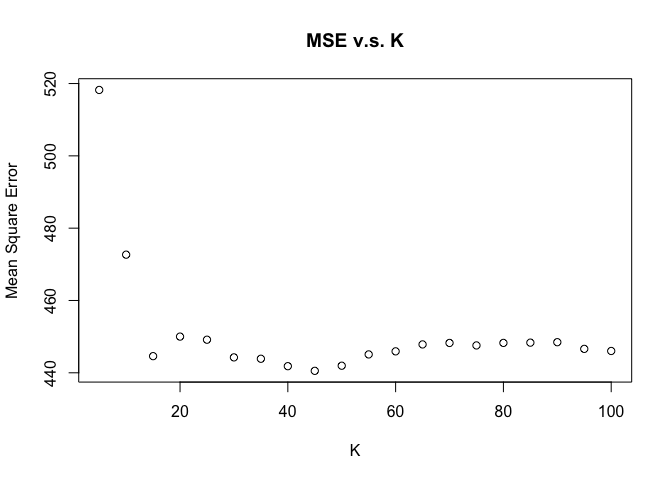
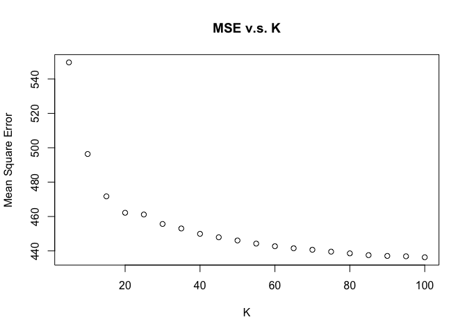
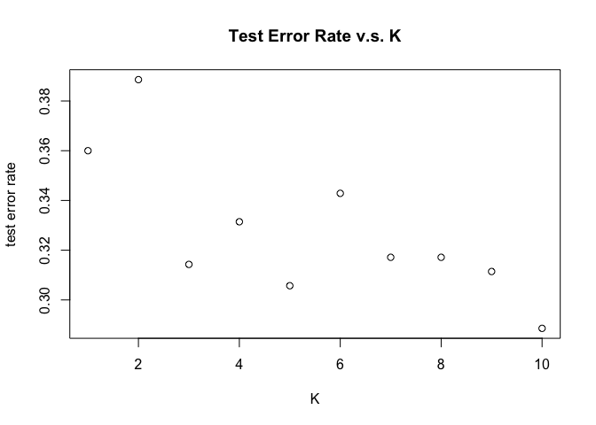
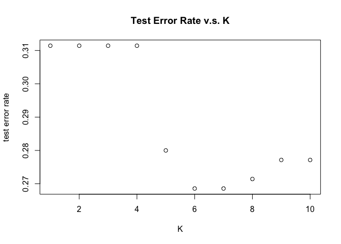
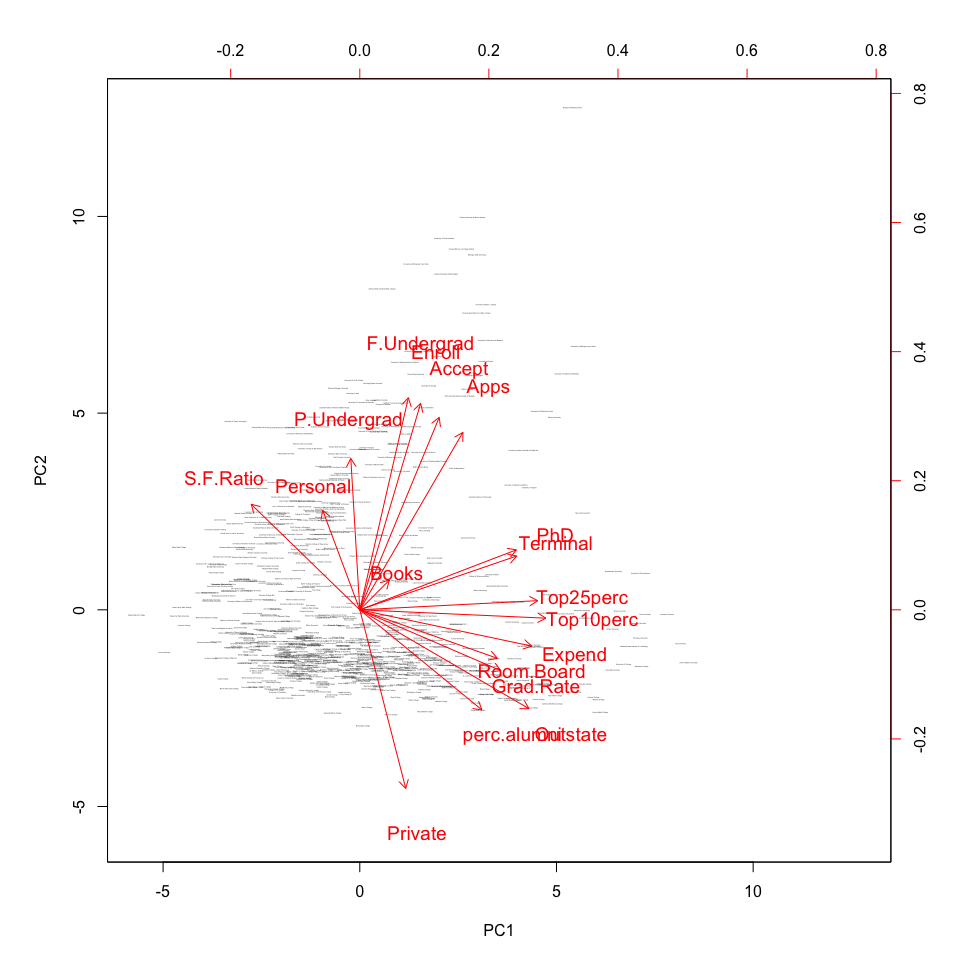
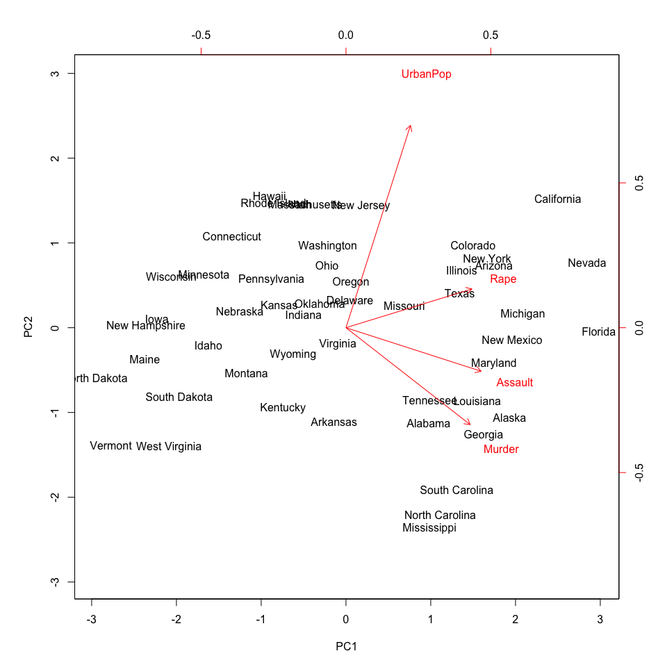
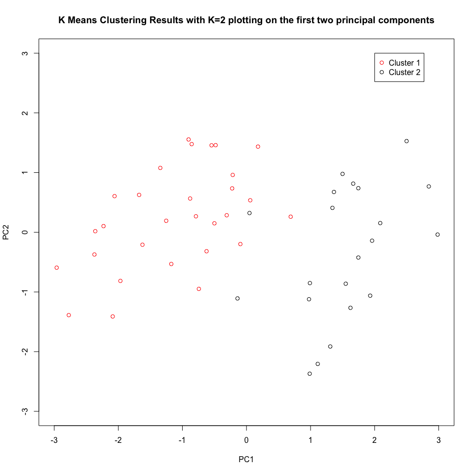
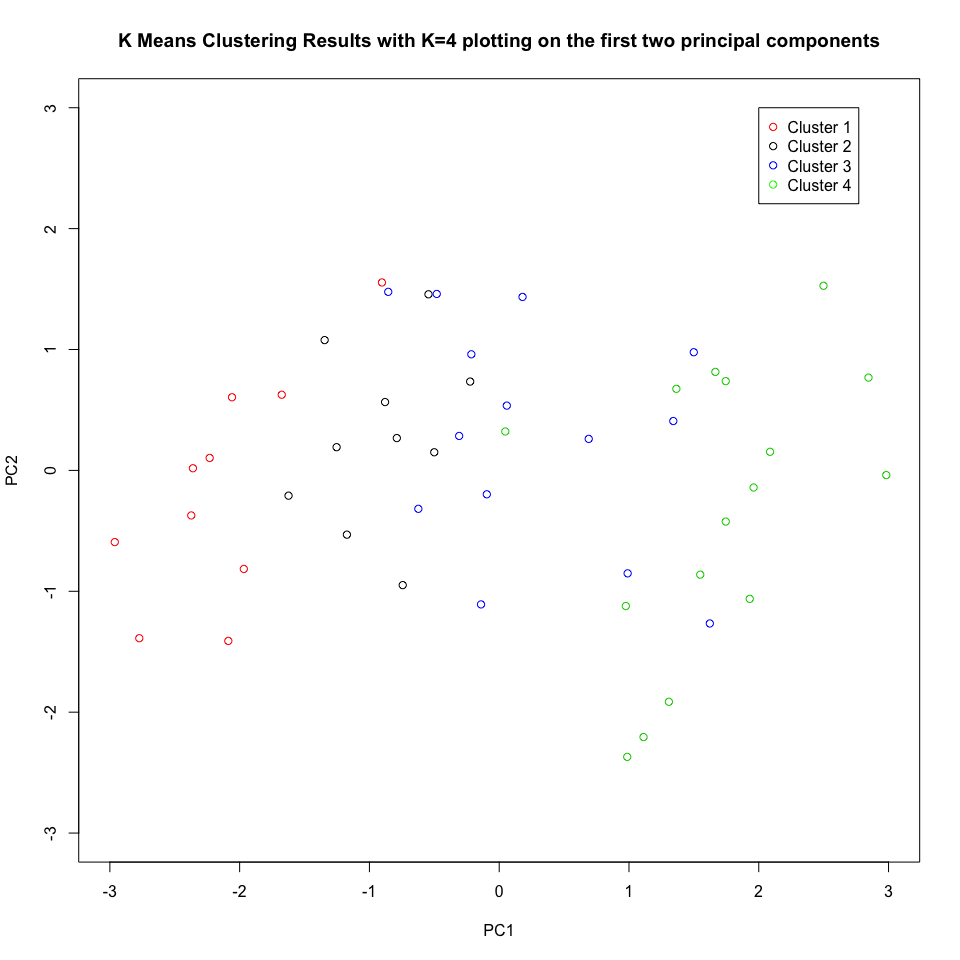
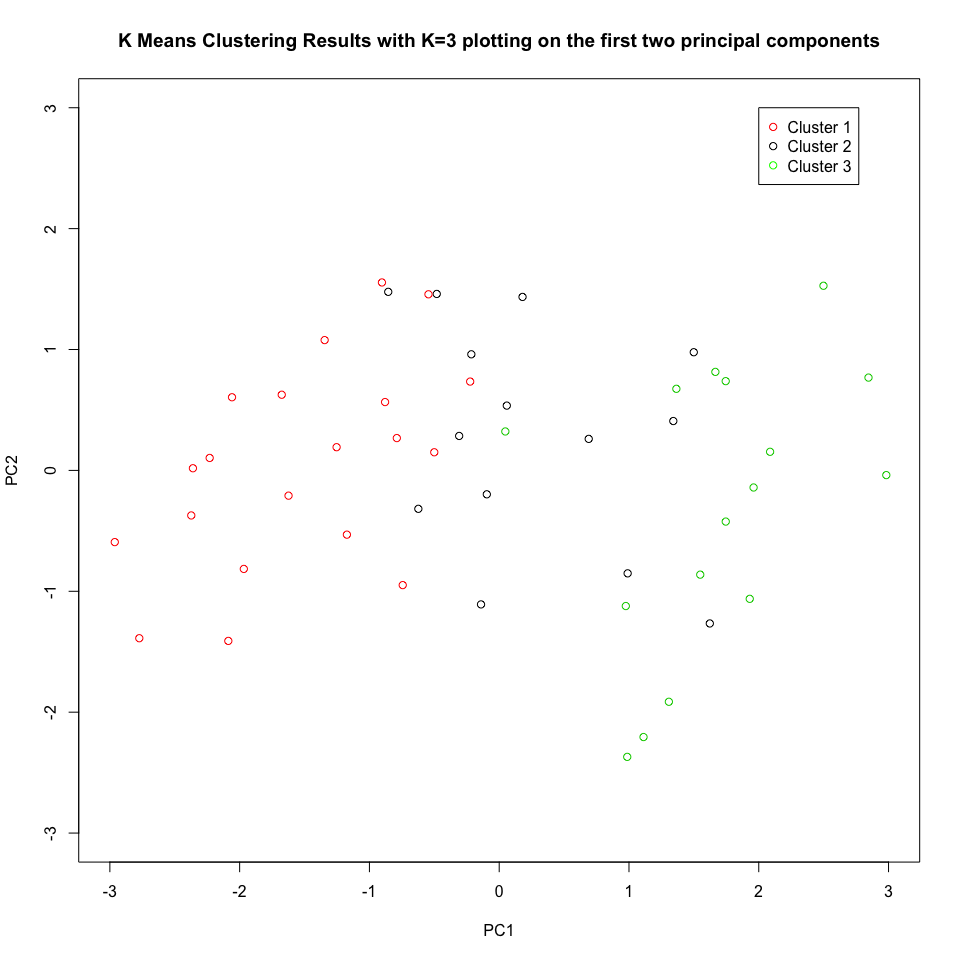
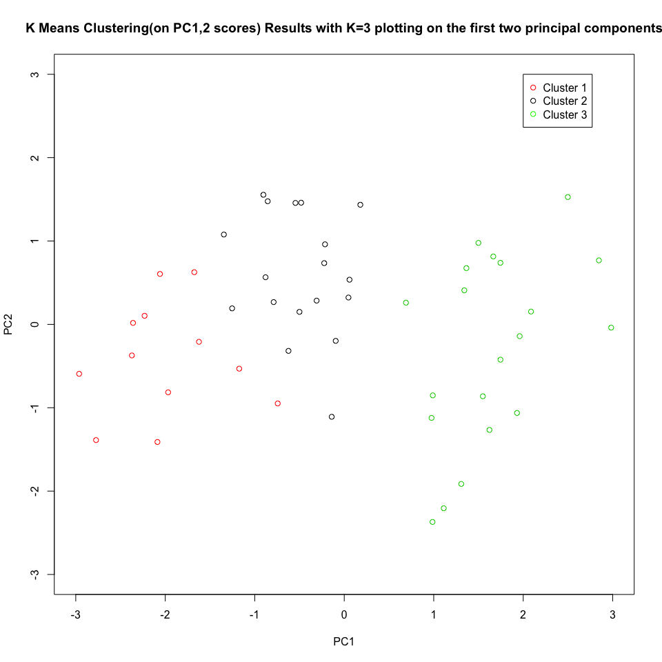

    library(ISLR)
    library(class)
    library(FNN)

    ## 
    ## Attaching package: 'FNN'

    ## The following objects are masked from 'package:class':
    ## 
    ##     knn, knn.cv

    library(kknn)
    library(tree)
    library(randomForest)

    ## randomForest 4.6-12

    ## Type rfNews() to see new features/changes/bug fixes.

    library(gbm)

    ## Loading required package: survival

    ## Loading required package: lattice

    ## Loading required package: splines

    ## Loading required package: parallel

    ## Loaded gbm 2.1.1

    library(boot)

    ## 
    ## Attaching package: 'boot'

    ## The following object is masked from 'package:lattice':
    ## 
    ##     melanoma

    ## The following object is masked from 'package:survival':
    ## 
    ##     aml

    library(e1071)

    fem = read.csv("feminist.csv")
    mh = read.csv("mental_health.csv")
    arrest = read.csv("USArrests.csv")

PS9
===

Attitudes towards feminists
---------------------------

1

    set.seed(1)
    n = dim(fem)[1]
    train_index = sample(n,n*0.7)

2 The five predictors I choose to predict the feminist feeling score are
female, dem, rep, educ and income. From the scatter plot between K and
MSE, we can see that K=45 produces the lowest test MSE 440.5382 using
the KNN method.

    train.X = data.frame(fem$female,fem$educ,fem$income,fem$dem,fem$rep)[train_index,]
    test.X = data.frame(fem$female,fem$educ,fem$income,fem$dem,fem$rep)[-train_index,]
    train.y = fem$feminist[train_index]
    k_range = seq(5,100,5)
    MSEs = rep(0,length(k_range))
    for (k in k_range){
      knn.p= knn.reg(train=train.X,test=test.X,y=train.y,k=k)
      MSE = mean((knn.p$pred-fem$feminist[-train_index])^2)
      MSEs[k/5] = MSE
    }
    plot(k_range,MSEs,xlab = 'K', ylab = 'Mean Square Error',main='MSE v.s. K')

    MSEs[45/5]

    ## [1] 440.5382

3 From the relationship plot between K and MSE, we can see that K=100
produces the lowest test MSE 436.2856 using the weighted KNN method.

    k_range = seq(5,100,5)
    MSEs = rep(0,length(k_range))
    for (k1 in k_range){
      knn.p= kknn(feminist~female+educ+income+dem+rep,train=fem[train_index,],test=fem[-train_index,],k=k1)
      
      MSE = mean((knn.p$fitted.values-fem$feminist[-train_index])^2)
      MSEs[k1/5] = MSE
    }
    plot(k_range,MSEs,xlab = 'K', ylab = 'Mean Square Error',main='MSE v.s. K')

    MSEs[100/5]

    ## [1] 436.2856

4 Runing the linear regression model, decison model, boosting method and
random forest model on the same data, we find their MSEs are 432.0206,
439.6128, 426.4126 and 439.2804. We can see among all methods the
boosting model produces the lowest MSE, which is reasonable. First of
all, the relationship between response variable feminist and the five
predictors may not be as simple as a linear one, but can still be
modelled in a parametric way, therefore using the linear model and
KNN/wKNN method may produce higher MSE, and the tree-based model may
better capture the relationship. Secondly, generally the boosting model
performs better than other tree-based methods, because boosting builds
trees by slowly learning information from previously grown trees to
achieve the optimal performance. Therefore the lowest MSE can be
achieved by using the boosting method.

    # linear regression
    lin=lm(feminist~female+educ+income+dem+rep,data=fem[train_index,])
    prediction=predict(lin,newdata=fem[-train_index,])
    lm_mse = mean((prediction-fem$feminist[-train_index])^2)
    lm_mse

    ## [1] 432.0206

    # decision tree
    tree_fem = tree(feminist~female+educ+income+dem+rep,data=fem,subset = train_index)
    fem_pred = predict(tree_fem,newdata = fem[-train_index,])
    fem_test = fem[-train_index,"feminist"]
    tree_mse=mean((fem_pred-fem_test)^2)
    tree_mse

    ## [1] 439.6128

    # boosting
    set.seed(1)
    boost_fem = gbm(feminist~female+educ+income+dem+rep,data=fem[train_index,],distribution = 'gaussian',shrinkage = 0.004, n.trees = 5000)
    fem_pred = predict(boost_fem,newdata = fem[-train_index,],n.trees = 5000)
    fem_test = fem[-train_index,"feminist"]
    boost_mse=mean((fem_pred-fem_test)^2)
    boost_mse

    ## [1] 426.4126

    # random forest
    set.seed(1)
    rf_fem = randomForest(feminist~female+educ+income+dem+rep,data=fem,subset = train_index,mtry=2,importance=T)
    fem_pred2 = predict(rf_fem,newdata = fem[-train_index,])
    fem_test2 = fem[-train_index,"feminist"]
    rf_mse=mean((fem_pred2-fem_test2)^2)
    rf_mse

    ## [1] 439.2804

Voter turnout and depression
----------------------------

1

    set.seed(1)
    mh = mh[complete.cases(mh),]
    mh$vote96=as.integer(mh$vote96)
    n = dim(mh)[1]
    train_index = sample(n,n*0.7)

2 The five predictors I choose to predict the voter turnout are
mhealth\_sum, educ, age, married and inc10. From the scatter plot
between K and MSE, we can see that K=10 produces the lowest test error
rate 0.2885714 using KNN classification.

    train.X = cbind(mh$mhealth_sum,mh$educ,mh$age,mh$married,mh$inc10)[train_index,]
    test.X = cbind(mh$mhealth_sum,mh$educ,mh$age,mh$married,mh$inc10)[-train_index,]
    train.y = mh$vote96[train_index]
    k_range = seq(1,10)
    errors = rep(0,length(k_range))
    for (k in k_range){
      knn.p= knn(train.X,test.X,train.y,k)
      tab = table(knn.p,mh$vote96[-train_index])
      error = (tab['0','1']+tab['1','0'])/(tab['0','1']+tab['0','0']+tab['1','1']+tab['1','0'])
      errors[k] = error
    }
    plot(k_range,errors,xlab = 'K', ylab = 'test error rate',main='Test Error Rate v.s. K')

    errors[10]

    ## [1] 0.2885714

3 From the relationship plot between K and test error rate, we can see
that K=6 produces the lowest test error rate 0.2685714 using the
weighted KNN classification.

    set.seed(1)
    k_range = seq(1,10)
    errors = rep(0,length(k_range))
    for (k1 in k_range){
      knn.p= kknn(vote96~mhealth_sum+educ+age+married+inc10,train=mh[train_index,],test=mh[-train_index,],k=k1)

      tab = table(knn.p$fitted.values>0.5,mh$vote96[-train_index])
      error = (tab['FALSE','1']+tab['TRUE','0'])/(tab['FALSE','1']+tab['FALSE','0']+tab['TRUE','1']+tab['TRUE','0'])
     
      errors[k1] = error
    }
    plot(k_range,errors,xlab = 'K', ylab = 'test error rate',main='Test Error Rate v.s. K')

4 Runing the linear regression model, decison model, boosting method,
random forest model and SVM method on the same data, we find their test
error rates are 0.2828571, 0.3085714, 0.2657143, 0.2828571 and 0.2914286
respectively. Compared with test error rates of 0.2885714 and 0.2685714
using KNN and wKNN methods, we can see this time using boosting method
still performs slightly better than the wKNN method and strictly better
than other methods. The reason may still be that tree-based model
captures the relationship between the response variable and those chosen
predictors better than other parametric models and the two nonparametric
methods. Among all tree-based models, boosting methods generally
perferms better than other methods and it achieves the lowest test error
rate of 0.2657143 in this case.

    # logistic regression
    logi_mh = glm(vote96~mhealth_sum+educ+age+married+inc10 ,data=mh,family = binomial)
    pred_prob=predict(logi_mh,newdata=mh[-train_index,],type='response')
    tab = table(pred_prob>0.5, mh$vote96[-train_index])
    logi_error = (tab['FALSE','1']+tab['TRUE','0'])/(tab['FALSE','0']+tab['TRUE','1']+tab['FALSE','1']+tab['TRUE','0'])
    logi_error

    ## [1] 0.2828571

    # decision tree
    tree_mh = tree(as.factor(vote96)~mhealth_sum+educ+age+married+inc10,data=mh,subset = train_index)
    mh_pred = predict(tree_mh,newdata=mh[-train_index,],type='class')
    tab=table(mh$vote96[-train_index],mh_pred)
    tree_error=(tab['0','1']+tab['1','0'])/(tab['0','1']+tab['1','0']+tab['0','0']+tab['1','1'])
    tree_error

    ## [1] 0.3085714

    # boosting
    set.seed(1)
    boost_mh = gbm(vote96~mhealth_sum+educ+age+married+inc10,data=mh[train_index,],distribution = 'bernoulli',interaction.depth = 4, n.trees = 5000)
    mh_pred = predict(boost_mh,newdata = mh[-train_index,],n.trees = 5000,type='response')
    tab=table(mh$vote96[-train_index],mh_pred>0.5)
    boost_error=(tab['1','FALSE']+tab['0','TRUE'])/(tab['1','FALSE']+tab['0','TRUE']+tab['1','TRUE']+tab['0','FALSE'])
    boost_error

    ## [1] 0.2657143

    #random forest
    set.seed(1)
    rf_mh = randomForest(as.factor(vote96)~mhealth_sum+educ+age+married+inc10,data=mh,subset = train_index,mtry=2,importance=T)
    mh_pred2 = predict(rf_mh,newdata = mh[-train_index,],type='class')
    tab=table(mh$vote96[-train_index],mh_pred2)
    rf_error=(tab['1','0']+tab['0','1'])/(tab['1','0']+tab['0','1']+tab['1','1']+tab['0','0'])
    rf_error

    ## [1] 0.2828571

    #SVM
    tune_mh = tune(svm,as.factor(vote96)~mhealth_sum+educ+age+married+inc10,data=mh[train_index,],kernel='radial',ranges=list(cost=c(0.1,1,10,100,1000),gamma=c(0.5,1,2,3,4)))
    bestmod = tune_mh$best.model
    mh_pred = predict(bestmod,mh[-train_index,],type='class')
    tab=table(mh_pred,mh[-train_index,]$vote96)
    svm_error=(tab['1','0']+tab['0','1'])/(tab['1','0']+tab['0','1']+tab['1','1']+tab['0','0'])
    svm_error

    ## [1] 0.2914286

Colleges
--------

Applying PCA on the data and plot the graph of the first two principal
components, we can see 1) Among all variables, some of them are more
closely correlated with each other since they are more correlated to one
of the two components. For example, varibles which are strongly
correlated with the first principal component are PhD, Terminal,
Top25perc, Top10perc, Expend, Room.Board, Grad.Rate, Outstate, and these
variables are more closely related with each other, and because the
first principal explained much of the variation of the data, we can say
these variables are more representive of one college. Variables which
are strongly correlated with the second principal component include
Personal, P.Undergrad, F.Undergrad, Enroll, Accept, Apps and Private.
Variable Books, S.F.Ratio and perc.alumni seem equally related to the
first and the second principal components. Generally and roughly
speaking, the first principal component indicates the quality of the
college while the second principal component the size of the college.

    College$Private = as.numeric(College$Private)
    pr.result = prcomp(College,scale=TRUE)
    pr.result$rotation = -pr.result$rotation
    pr.result$x = -pr.result$x
    biplot(pr.result,scale=0,cex = c(0.1,1.2))

 \#\# Clustering
states

1

    pr.result = prcomp(USArrests,scale=TRUE)
    pr.result$rotation = -pr.result$rotation
    pr.result$x = -pr.result$x
    biplot(pr.result,scale=0)

2 From the graph below we can see that the two clusters are separated
clearly based on the first principal compoment score: states with high
PC1 score are in one cluster while states with low PC1 score are in
another cluster.

    set.seed(1)
    pr.result = prcomp(USArrests,scale=TRUE)
    pr.result$rotation = -pr.result$rotation
    pr.result$x = -pr.result$x
    km.out = kmeans(USArrests,2,nstart=20)
    plot(pr.result$x[,1],pr.result$x[,2],xlab='PC1',ylab='PC2',col=km.out$cluster,main="K Means Clustering Results with K=2 plotting on the first two principal components",xlim = c(-3,3),ylim=c(-3,3))
    legend(2,3,c("Cluster 1","Cluster 2"),pch=c(1,1),col=c('red','black'))

3 Similary, we can see from the graph below that the four clusters are
separated roughly based on the first principal compoment score but the
separations are not that clear as the K=2 case: a few outliers permeate
into other clusters according to their x axis values.

    set.seed(1)
    pr.result = prcomp(USArrests,scale=TRUE)
    pr.result$rotation = -pr.result$rotation
    pr.result$x = -pr.result$x
    km.out = kmeans(USArrests,4,nstart=20)
    plot(pr.result$x[,1],pr.result$x[,2],xlab='PC1',ylab='PC2',col=km.out$cluster,main="K Means Clustering Results with K=4 plotting on the first two principal components",xlim = c(-3,3),ylim=c(-3,3))
    legend(2,3,c("Cluster 1","Cluster 2","Cluster 3","Cluster 4"),pch=c(1,1,1,1),col=c('red','black','blue','green'))

4 Again, we can see from the graph below that PS1 score is the main
determinant to the cluster separation, although there are a few outliers
in the intersection region between cluster 2 and cluster 3.

    set.seed(1)
    pr.result = prcomp(USArrests,scale=TRUE)
    pr.result$rotation = -pr.result$rotation
    pr.result$x = -pr.result$x
    km.out = kmeans(USArrests,3,nstart=20)
    plot(pr.result$x[,1],pr.result$x[,2],xlab='PC1',ylab='PC2',col=km.out$cluster,main="K Means Clustering Results with K=3 plotting on the first two principal components",xlim = c(-3,3),ylim=c(-3,3))
    legend(2,3,c("Cluster 1","Cluster 2","Cluster 3"),pch=c(1,1,1),col=c('red','black','green'))

5 From the graph below, we can see the separations beween different
clusters are much more clear than the graph in 4, because now the
clustering eliminates the effects from the other two components PC3, PC4
which are contained in the original data.

    set.seed(1)
    pr.result = prcomp(USArrests,scale=TRUE)
    pr.result$rotation = -pr.result$rotation
    pr.result$x = -pr.result$x
    km.out = kmeans(pr.result$x[,c(1,2)],3,nstart=20)
    plot(pr.result$x[,1],pr.result$x[,2],xlab='PC1',ylab='PC2',col=km.out$cluster,main="K Means Clustering(on PC1,2 scores) Results with K=3 plotting on the first two principal components",xlim = c(-3,3),ylim=c(-3,3))
    legend(2,3,c("Cluster 1","Cluster 2","Cluster 3"),pch=c(1,1,1),col=c('red','black','green'))

6

    hc.complete = hclust(dist(USArrests),method='complete')

7 The results are shown below.

    cluster = cutree(hc.complete, 3)
    states=row.names(USArrests)
    print("states belong to cluster 1:")

    ## [1] "states belong to cluster 1:"

    states[cluster==1]

    ##  [1] "Alabama"        "Alaska"         "Arizona"        "California"    
    ##  [5] "Delaware"       "Florida"        "Illinois"       "Louisiana"     
    ##  [9] "Maryland"       "Michigan"       "Mississippi"    "Nevada"        
    ## [13] "New Mexico"     "New York"       "North Carolina" "South Carolina"

    print("states belong to cluster 2:")

    ## [1] "states belong to cluster 2:"

    states[cluster==2]

    ##  [1] "Arkansas"      "Colorado"      "Georgia"       "Massachusetts"
    ##  [5] "Missouri"      "New Jersey"    "Oklahoma"      "Oregon"       
    ##  [9] "Rhode Island"  "Tennessee"     "Texas"         "Virginia"     
    ## [13] "Washington"    "Wyoming"

    print("states belong to cluster 3:")

    ## [1] "states belong to cluster 3:"

    states[cluster==3]

    ##  [1] "Connecticut"   "Hawaii"        "Idaho"         "Indiana"      
    ##  [5] "Iowa"          "Kansas"        "Kentucky"      "Maine"        
    ##  [9] "Minnesota"     "Montana"       "Nebraska"      "New Hampshire"
    ## [13] "North Dakota"  "Ohio"          "Pennsylvania"  "South Dakota" 
    ## [17] "Utah"          "Vermont"       "West Virginia" "Wisconsin"

8 We can see from the clustering results below that after scaling, more
states are included in cluster 3. The reason why we use scaling is that
because the units of variables in a dataset may be different, and if we
use Euclidean distance to measure the dissimilarities between
observations, variables with large absolute values would dominate the
result even if other variables with smaller absolute values are
essential determinants to measuring the dissimilarities. Therefore I
think variables should be scaled before the inter-observation
dissimilarities are computed.

    scaled = scale(USArrests)
    hc.complete = hclust(dist(scaled),method='complete')
    cluster = cutree(hc.complete, 3)
    print("states belong to cluster 1:")

    ## [1] "states belong to cluster 1:"

    states[cluster==1]

    ## [1] "Alabama"        "Alaska"         "Georgia"        "Louisiana"     
    ## [5] "Mississippi"    "North Carolina" "South Carolina" "Tennessee"

    print("states belong to cluster 2:")

    ## [1] "states belong to cluster 2:"

    states[cluster==2]

    ##  [1] "Arizona"    "California" "Colorado"   "Florida"    "Illinois"  
    ##  [6] "Maryland"   "Michigan"   "Nevada"     "New Mexico" "New York"  
    ## [11] "Texas"

    print("states belong to cluster 3:")

    ## [1] "states belong to cluster 3:"

    states[cluster==3]

    ##  [1] "Arkansas"      "Connecticut"   "Delaware"      "Hawaii"       
    ##  [5] "Idaho"         "Indiana"       "Iowa"          "Kansas"       
    ##  [9] "Kentucky"      "Maine"         "Massachusetts" "Minnesota"    
    ## [13] "Missouri"      "Montana"       "Nebraska"      "New Hampshire"
    ## [17] "New Jersey"    "North Dakota"  "Ohio"          "Oklahoma"     
    ## [21] "Oregon"        "Pennsylvania"  "Rhode Island"  "South Dakota" 
    ## [25] "Utah"          "Vermont"       "Virginia"      "Washington"   
    ## [29] "West Virginia" "Wisconsin"     "Wyoming"
