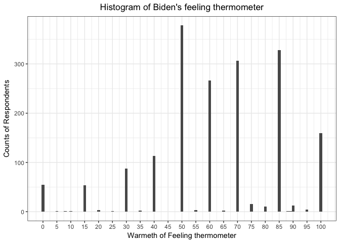
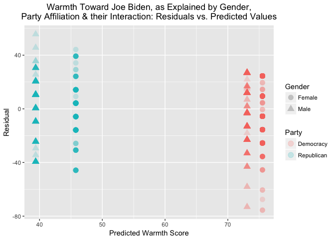

Problem set \#5: linear regression
================
Tong Ju/ ID: 12146007
**2017/2/12**

-   [1) Describe the data](#describe-the-data)
-   [2) Simple linear regression](#simple-linear-regression)
-   [3) Multiple linear regression](#multiple-linear-regression)
-   [4) Multiple linear regression model (with more variables)](#multiple-linear-regression-model-with-more-variables)
-   [5) Interactive linear regression model](#interactive-linear-regression-model)

1) Describe the data
====================

``` r
ggplot(data = df, aes(x = biden)) +
  theme_bw()+
  geom_histogram(binwidth = 1) +
  scale_x_continuous(breaks = round(seq(min(df$biden), max(df$biden), by = 5), 1))+
  labs(title = "Histogram of Biden's feeling thermometer",
       x = "Warmeth of Feeling thermometer",
       y = "Counts of Respondents")+
  theme(plot.title = element_text(hjust = 0.5))
```



The feelings of respondents toward Biden (surveyed in 2008, ranging from 0 to 100) appears to be approximately normally distributed with left skew. The histogram result suggests that more respondnets feel positive than negative toward Mr. Biden. Since almost all the response values fall on the multiple of 5, and it is unlikely that 1,807 respondents would have naturally responded in such a manner, it is highly possible that the feeling thermometer is evaluated by a 0-100 scale with 5-unit brackets. However, we also find there are two responses do not fall on the multiple of 5 (one is between 5 and 10, and the other close to 90). We postulate these two values perhaps are the "outliers"", which might be caused by miscoding.

2) Simple linear regression
===========================

Based on the linear model below, we estimate the relationship of age with feelings of warmth toward Mr. Biden: \[Y = \beta_0 + \beta_{1}X_1\] The statistical data of this simple linear model is summarized as below:

``` r
# Simple Linear Regression Model
lm_1 <- lm(biden ~ age, data = df)
pander(summary(lm_1))
```

<table style="width:86%;">
<colgroup>
<col width="25%" />
<col width="15%" />
<col width="18%" />
<col width="13%" />
<col width="13%" />
</colgroup>
<thead>
<tr class="header">
<th align="center"> </th>
<th align="center">Estimate</th>
<th align="center">Std. Error</th>
<th align="center">t value</th>
<th align="center">Pr(&gt;|t|)</th>
</tr>
</thead>
<tbody>
<tr class="odd">
<td align="center"><strong>age</strong></td>
<td align="center">0.06241</td>
<td align="center">0.03267</td>
<td align="center">1.91</td>
<td align="center">0.05626</td>
</tr>
<tr class="even">
<td align="center"><strong>(Intercept)</strong></td>
<td align="center">59.2</td>
<td align="center">1.648</td>
<td align="center">35.92</td>
<td align="center">1.145e-213</td>
</tr>
</tbody>
</table>

<table style="width:86%;">
<caption>Fitting linear model: biden ~ age</caption>
<colgroup>
<col width="20%" />
<col width="30%" />
<col width="12%" />
<col width="22%" />
</colgroup>
<thead>
<tr class="header">
<th align="center">Observations</th>
<th align="center">Residual Std. Error</th>
<th align="center"><span class="math inline"><em>R</em><sup>2</sup></span></th>
<th align="center">Adjusted <span class="math inline"><em>R</em><sup>2</sup></span></th>
</tr>
</thead>
<tbody>
<tr class="odd">
<td align="center">1807</td>
<td align="center">23.44</td>
<td align="center">0.002018</td>
<td align="center">0.001465</td>
</tr>
</tbody>
</table>

The linear model returns a \(\beta_0\) coefficient of 59.2 (with a standard error of 1.648) and a \(\beta_1\) coefficient of 0.06241(with a standard error of 0.03267). 1. According to the plotting, we find that there would be a linear relationship between the predictor, age, and the response, warmth toward Mr. Biden. However, given that the p-value of this model is 0.05626 (smaller than 0.1), such relationship is not so statistically significant (merely statistically significant at a 90% condifence level).

1.  The relationship between the predictor and the response is rather weak, because coeffecient on the predictor, age is 0.06241, indicating a 10-year increase in age would averagely induce around 0.6 unit (out of 100) increase of the warmth toward biden. Combined with question 1, there is a weak association, with statistically moderate significance, between the predictor and the response.

2.  The relationship between the predictor, age, and the response, warmth toward Mr. Biden, is positive (0.06241), indicating that a one-year increase in age is estimated to be associated with an average increase in warmth of 0.06241 toward Mr. Biden. To sum up (question 1 - 3), there is a weak and positive association, with statistically moderate significance, between the predictor and the response.

3.  The \(R^2\) of this model is 0.002018, implying that this model only explains \(.2\%\) of the variation in warmth score.With such a low percentage of variance explained, it is a poor model.

4.  The predicted warmth associated with an age of 45 is 62.0056. Its associated 95% confidence interval is (60.91248, 63.09872).

``` r
# Prediction for the feeling thermometer when age is 45, and 
# Calculate 95% confidence intervals: 
pred_data <- augment(lm_1, newdata = data_frame(age = 45)) %>%
  mutate(ymin = .fitted - .se.fit * 1.96,
         ymax = .fitted + .se.fit * 1.96)
pander(pred_data)
```

<table style="width:56%;">
<colgroup>
<col width="8%" />
<col width="13%" />
<col width="13%" />
<col width="9%" />
<col width="9%" />
</colgroup>
<thead>
<tr class="header">
<th align="center">age</th>
<th align="center">.fitted</th>
<th align="center">.se.fit</th>
<th align="center">ymin</th>
<th align="center">ymax</th>
</tr>
</thead>
<tbody>
<tr class="odd">
<td align="center">45</td>
<td align="center">62.01</td>
<td align="center">0.5577</td>
<td align="center">60.91</td>
<td align="center">63.1</td>
</tr>
</tbody>
</table>

The plotting is shown as below. Based on this plot and least regression line, there is a positive relation between between the age and the warmth toward biden, although, the relationship is weak.

``` r
#--Plot
#Create prediction values
grid <- df %>% 
  data_grid(age) %>% 
  add_predictions(lm_1)

#Plot
ggplot(df, aes(x = age)) +
  theme_bw()+
  geom_point(aes(y = biden), alpha= 0.2) +
  geom_smooth (aes(y = pred), data = grid, color = "red", size = 1) +
  labs(title = "Age and Biden's feeling thermometer",
       x = "Age",
       y = "Warmth of Feeling thermometer")+
  theme(plot.title = element_text(hjust = 0.5))
```

    ## `geom_smooth()` using method = 'loess'


3) Multiple linear regression
=============================

We construct a more complex model to estimate the effects of age, gender, and years of education on feelings of warmth toward Mr. Biden:

\[Y = \beta_0 + \beta_{1}X_1 + \beta_{2}X_2 + \beta_{3}X_3\]

where \(Y\) is the Biden feeling thermometer, \(X_1\) is age, \(X_2\) is gender, and \(X_3\) is education. The statistical data is summarized in the table below:

``` r
# Multiple Linear Regression Model
lm_2 <- lm(biden ~ age + female + educ, data = df)
pander(summary(lm_2))
```

<table style="width:86%;">
<colgroup>
<col width="25%" />
<col width="15%" />
<col width="18%" />
<col width="13%" />
<col width="13%" />
</colgroup>
<thead>
<tr class="header">
<th align="center"> </th>
<th align="center">Estimate</th>
<th align="center">Std. Error</th>
<th align="center">t value</th>
<th align="center">Pr(&gt;|t|)</th>
</tr>
</thead>
<tbody>
<tr class="odd">
<td align="center"><strong>age</strong></td>
<td align="center">0.04188</td>
<td align="center">0.03249</td>
<td align="center">1.289</td>
<td align="center">0.1975</td>
</tr>
<tr class="even">
<td align="center"><strong>female</strong></td>
<td align="center">6.196</td>
<td align="center">1.097</td>
<td align="center">5.65</td>
<td align="center">1.864e-08</td>
</tr>
<tr class="odd">
<td align="center"><strong>educ</strong></td>
<td align="center">-0.8887</td>
<td align="center">0.2247</td>
<td align="center">-3.955</td>
<td align="center">7.941e-05</td>
</tr>
<tr class="even">
<td align="center"><strong>(Intercept)</strong></td>
<td align="center">68.62</td>
<td align="center">3.596</td>
<td align="center">19.08</td>
<td align="center">4.337e-74</td>
</tr>
</tbody>
</table>

<table style="width:85%;">
<caption>Fitting linear model: biden ~ age + female + educ</caption>
<colgroup>
<col width="20%" />
<col width="30%" />
<col width="11%" />
<col width="22%" />
</colgroup>
<thead>
<tr class="header">
<th align="center">Observations</th>
<th align="center">Residual Std. Error</th>
<th align="center"><span class="math inline"><em>R</em><sup>2</sup></span></th>
<th align="center">Adjusted <span class="math inline"><em>R</em><sup>2</sup></span></th>
</tr>
</thead>
<tbody>
<tr class="odd">
<td align="center">1807</td>
<td align="center">23.16</td>
<td align="center">0.02723</td>
<td align="center">0.02561</td>
</tr>
</tbody>
</table>

1.  Examing the p-values for the co-effecients in this model, except age, both variables female and education have statistically significant relationship with the response (p-value on `female` is 1.864e-08 , on `education` is 7.941e-05, both &lt; 0.001).

2.  The co-effecient (estimate) on female is 6.19607, indicating a positive and strong (compared to variable age) relationship between female and warmth toward biden. It indicates, when controlling age and edu, female respondents have an average 6.19607 higher score in the warmth toward biden than the male respondents.

3.  The \(R^2\) of this model is 0.02723, indicating that the predictors in this model can only explain 2.7% of the variation in the warmth towardbiden. Although the R square value is still low, but compared with the R square of the first (the single variable model), this model is superior to the age-only model.

4.  We plot the residuals vs. predicted values of warth score, and also draw the smooth fitting curve based on different party affliation (fitting method as `lm`). Obviously, one potential problem of the above model is its lack of consideration of the party ID, since, in the below plotting we can see there is a intrinsic difference between the responses from Democrats, Publicans and Independents (The smooth line for Democrat is constantly above 0, while the Republican one is under 0. This indicates that Democrats generally give a higher warmth score than Republicans). In the next step, we will include party affiliation within our model.

``` r
#Create prediction and residual values
df_lm2 <- df %>% 
  add_predictions(lm_2) %>%
  add_residuals(lm_2)

# Residue Plotting 
ggplot(df_lm2, aes(x = pred, y = resid)) +
  theme_bw()+
  geom_point(alpha = .15, size = 1.0) +
  stat_smooth(data = filter(df_lm2, dem == 1), mapping = aes(colour = "Democrat"), size = 1, method = "lm") +
  stat_smooth(data = filter(df_lm2, rep == 1), mapping = aes(colour = "Republican"), size = 1,  method = "lm") +
  stat_smooth(data = filter(df_lm2, rep == 0, dem == 0), mapping = aes(colour = "Independent"), size = 1,  method = "lm") +
  labs(title = "Warth toward Joe Biden (by multiple linear regression ~ age + female + educ):\nResiduals vs. Predicted Values",
       x = "Predicted Warmth Score",
       y = "Model residual") +
  scale_color_manual(name = "Party", values = c("blue", "green", "red"))+
  theme(plot.title = element_text(hjust = 0.5), plot.subtitle = element_text(hjust = 0.5))
```


4) Multiple linear regression model (with more variables)
=========================================================

We construct an even more detailed model to estimate the effects of age, gender, years of education, and political affiliation on feelings of warmth toward Mr. Biden:

\[Y = \beta_0 + \beta_{1}X_1 + \beta_{2}X_2 + \beta_{3}X_3 + \beta_{4}X_4 + \beta_{5}X_5\]

where \(Y\) is the Joe Biden feeling thermometer, \(X_1\) is age, \(X_2\) is gender, \(X_3\) is education, \(X_4\) is Democrat, and \(X_5\) is Republican. The statistical data is summarized in the table below:

``` r
# Multiple Linear Regression Model
lm_3 <- lm(biden ~ age + female + educ + dem + rep, data = df)
pander(summary(lm_3))
```

<table style="width:86%;">
<colgroup>
<col width="25%" />
<col width="15%" />
<col width="18%" />
<col width="13%" />
<col width="13%" />
</colgroup>
<thead>
<tr class="header">
<th align="center"> </th>
<th align="center">Estimate</th>
<th align="center">Std. Error</th>
<th align="center">t value</th>
<th align="center">Pr(&gt;|t|)</th>
</tr>
</thead>
<tbody>
<tr class="odd">
<td align="center"><strong>age</strong></td>
<td align="center">0.04826</td>
<td align="center">0.02825</td>
<td align="center">1.708</td>
<td align="center">0.08773</td>
</tr>
<tr class="even">
<td align="center"><strong>female</strong></td>
<td align="center">4.103</td>
<td align="center">0.9482</td>
<td align="center">4.327</td>
<td align="center">1.593e-05</td>
</tr>
<tr class="odd">
<td align="center"><strong>educ</strong></td>
<td align="center">-0.3453</td>
<td align="center">0.1948</td>
<td align="center">-1.773</td>
<td align="center">0.07641</td>
</tr>
<tr class="even">
<td align="center"><strong>dem</strong></td>
<td align="center">15.42</td>
<td align="center">1.068</td>
<td align="center">14.44</td>
<td align="center">8.145e-45</td>
</tr>
<tr class="odd">
<td align="center"><strong>rep</strong></td>
<td align="center">-15.85</td>
<td align="center">1.311</td>
<td align="center">-12.09</td>
<td align="center">2.157e-32</td>
</tr>
<tr class="even">
<td align="center"><strong>(Intercept)</strong></td>
<td align="center">58.81</td>
<td align="center">3.124</td>
<td align="center">18.82</td>
<td align="center">2.694e-72</td>
</tr>
</tbody>
</table>

<table style="width:85%;">
<caption>Fitting linear model: biden ~ age + female + educ + dem + rep</caption>
<colgroup>
<col width="20%" />
<col width="30%" />
<col width="11%" />
<col width="22%" />
</colgroup>
<thead>
<tr class="header">
<th align="center">Observations</th>
<th align="center">Residual Std. Error</th>
<th align="center"><span class="math inline"><em>R</em><sup>2</sup></span></th>
<th align="center">Adjusted <span class="math inline"><em>R</em><sup>2</sup></span></th>
</tr>
</thead>
<tbody>
<tr class="odd">
<td align="center">1807</td>
<td align="center">19.91</td>
<td align="center">0.2815</td>
<td align="center">0.2795</td>
</tr>
</tbody>
</table>

1.  The relationship between gender and Biden warmth did appear to change. 1) Whereas the co-effecient on female variable is 6.19607, the co-effecient in this model decreases to 4.10323, indicating a weaker positive correlation between gender and warmth toward Mr. Biden, after introduction of avraible of party ID. In addition, we also find that the p-value is a little larger (1.59e-05 compared to 1.86e-08). However, we can still claim the relationship between gender and warmth toward Biden is statitically significant.

2.  The \(R^2\) of this model is 0.2815, indicating the predictors in this model explain 28.2% of the variation in biden. Thus this model explains an order of magnitude more of the variation than the previous model without party ID (the R squre increased from 2.7% to 28.2%). This model has more explanatory power than model 2.

3.  We plot the residuals versus the predicted values and add separate smooth-fit lines by party as below.The problem observed in the last model has been fixed, as we can see the smooth lines of Democrat, Independent, and Republican are at a similar level close to 0, and the residuals are generally normally distributed with mean close to 0, indicating that by introducing party ID variable, in the current model, party ID has no or less effect on the residuals than the model 2.

``` r
#--Plot
#Create prediction and residual values
df_lm3 <- df %>% 
  add_predictions(lm_3) %>%
  add_residuals(lm_3)

# Residue Plotting 
ggplot(df_lm3, aes(x = pred, y = resid)) +
  theme_bw()+
  geom_point(alpha = .15, size = 1.0) +
  geom_smooth(data = filter(df_lm3, dem == 1), aes(color = "Democrat"), size = 1, method = "lm") +
  geom_smooth(data = filter(df_lm3, rep == 1), aes(color = "Republican"), size = 1, method = "lm") +
  stat_smooth(data = filter(df_lm3, rep == 0, dem == 0), mapping = aes(colour = "Independent"), size = 1, method = "lm") +
  labs(title = "Warth toward Joe Biden (by multiple linear regression ~ age + female + \neduc + dem + rep): Residuals vs. Predicted Values",
       x = "Predicted Warmth Score",
       y = "Model residual") +
  scale_color_manual(name = "Party", values = c("blue", "green", "red"))+
  theme(plot.title = element_text(hjust = 0.5), plot.subtitle = element_text(hjust = 0.5))
```


5) Interactive linear regression model
======================================

Removing respondents who are neither Democrats nor Republicans, we construct a model to estimate the effect of gender, political affiliation, and their interaction on warmth toward Mr. Biden:

\(Y = \beta_0 + \beta_{1}X_1 + \beta_{2}X_2 + \beta_{3}X_{1}X_{2}\)

where \(Y\) is the Biden feeling thermometer, \(X_1\) is female, and \(X_2\) is Democrat. The statistical data is summarized in the folling tables:

``` r
#Filter out respondents
df_lm4 <- df %>%
  filter(dem == 1 | rep == 1)

# Interactive Regression Model
lm_4 <- lm(biden ~ female + dem + female * dem, data = df_lm4)
pander(summary(lm_4))
```

<table style="width:86%;">
<colgroup>
<col width="25%" />
<col width="15%" />
<col width="18%" />
<col width="13%" />
<col width="13%" />
</colgroup>
<thead>
<tr class="header">
<th align="center"> </th>
<th align="center">Estimate</th>
<th align="center">Std. Error</th>
<th align="center">t value</th>
<th align="center">Pr(&gt;|t|)</th>
</tr>
</thead>
<tbody>
<tr class="odd">
<td align="center"><strong>female</strong></td>
<td align="center">6.395</td>
<td align="center">2.018</td>
<td align="center">3.169</td>
<td align="center">0.001568</td>
</tr>
<tr class="even">
<td align="center"><strong>dem</strong></td>
<td align="center">33.69</td>
<td align="center">1.835</td>
<td align="center">18.36</td>
<td align="center">3.295e-66</td>
</tr>
<tr class="odd">
<td align="center"><strong>female:dem</strong></td>
<td align="center">-3.946</td>
<td align="center">2.472</td>
<td align="center">-1.597</td>
<td align="center">0.1107</td>
</tr>
<tr class="even">
<td align="center"><strong>(Intercept)</strong></td>
<td align="center">39.38</td>
<td align="center">1.455</td>
<td align="center">27.06</td>
<td align="center">4.046e-125</td>
</tr>
</tbody>
</table>

<table style="width:85%;">
<caption>Fitting linear model: biden ~ female + dem + female * dem</caption>
<colgroup>
<col width="20%" />
<col width="30%" />
<col width="11%" />
<col width="22%" />
</colgroup>
<thead>
<tr class="header">
<th align="center">Observations</th>
<th align="center">Residual Std. Error</th>
<th align="center"><span class="math inline"><em>R</em><sup>2</sup></span></th>
<th align="center">Adjusted <span class="math inline"><em>R</em><sup>2</sup></span></th>
</tr>
</thead>
<tbody>
<tr class="odd">
<td align="center">1151</td>
<td align="center">19.42</td>
<td align="center">0.3756</td>
<td align="center">0.374</td>
</tr>
</tbody>
</table>

``` r
#Prediction
#Create data for prediction
pred_data <- data_frame(female = c(0, 0, 1, 1), dem = c(0, 1, 0, 1))

#Use augment to generate predictions
pred_aug <- augment(lm_4, newdata = pred_data)

#Calculate 95% confidence intervals
pred_ci <- mutate(pred_aug,
                  ymin = .fitted - .se.fit * 1.96,
                  ymax = .fitted + .se.fit * 1.96)
pander(pred_ci)
```

<table style="width:68%;">
<colgroup>
<col width="12%" />
<col width="8%" />
<col width="13%" />
<col width="13%" />
<col width="9%" />
<col width="9%" />
</colgroup>
<thead>
<tr class="header">
<th align="center">female</th>
<th align="center">dem</th>
<th align="center">.fitted</th>
<th align="center">.se.fit</th>
<th align="center">ymin</th>
<th align="center">ymax</th>
</tr>
</thead>
<tbody>
<tr class="odd">
<td align="center">0</td>
<td align="center">0</td>
<td align="center">39.38</td>
<td align="center">1.455</td>
<td align="center">36.53</td>
<td align="center">42.23</td>
</tr>
<tr class="even">
<td align="center">0</td>
<td align="center">1</td>
<td align="center">73.07</td>
<td align="center">1.117</td>
<td align="center">70.88</td>
<td align="center">75.26</td>
</tr>
<tr class="odd">
<td align="center">1</td>
<td align="center">0</td>
<td align="center">45.78</td>
<td align="center">1.398</td>
<td align="center">43.04</td>
<td align="center">48.52</td>
</tr>
<tr class="even">
<td align="center">1</td>
<td align="center">1</td>
<td align="center">75.52</td>
<td align="center">0.8881</td>
<td align="center">73.78</td>
<td align="center">77.26</td>
</tr>
</tbody>
</table>

``` r
# Plotting:

df_lm4 <- df_lm4 %>% 
  mutate (Gender = ifelse(female ==1, 'Female', 'Male') )%>%
  mutate (Party = ifelse(dem ==1, 'Democracy', 'Republican') )%>%
  add_predictions(lm_4) %>%
  add_residuals(lm_4)


ggplot(df_lm4, mapping = aes(pred, resid)) +
       geom_point(alpha = .2, size = 3.5, aes(color = Party, shape = Gender)) +
       labs(title = "Warmth Toward Joe Biden, as Explained by Gender,\nParty Affiliation & their Interaction: Residuals vs. Predicted Values",
            x = "Predicted Warmth Score",
            y = "Residual") +
       theme(plot.title = element_text(hjust = 0.5))
```


