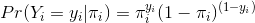
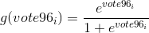
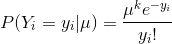
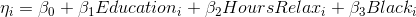
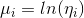

```{r setup, include = FALSE}
# load the data and libraries

library(ggplot2)
library(tidyverse)
library(broom)
library(modelr)
library(pROC)
library(MASS)
library(stargazer)
library(pander)

gss = read_csv('data/gss2006.csv')
mhealth = read_csv('data/mental_health.csv')
```


# 1) Describe the data 
```{r Histogram}

# generate the new counted dataframe, remove the missing value and calculate the percentage of voting and no voting.
m<-mhealth %>%
  count(vote96) %>%
  na.omit %>%
  mutate (vote = ifelse (vote96 == 0, "No","Yes"), percent = 100*n / sum(n)) 


# barchart for tournout   
ggplot(data = m, aes(x=vote, y=n, fill=vote)) +
  geom_bar(stat='identity') + 
  theme_bw()+
  labs(title = 'Voter Turnout in 1996', x = 'Vote Status', y = 'Number of people') +
  theme(plot.title = element_text(hjust = 0.5))


# Remove all the missing data in vote96 and mhealth_sum 
df = mhealth[(!is.na(mhealth$vote96) & !is.na(mhealth$mhealth_sum)), ]
# Plot the linear regression fitting line
ggplot(df, aes(mhealth_sum, vote96)) +
  geom_point(alpha=0.2) +
  geom_smooth(method = "lm") + 
  theme_bw()+
  scale_y_continuous(breaks = c(0, 0.25, 0.5, 0.75, 1)) + 
  labs(title = "Voting in 1996 vs. Mental Health Index \n(with Smoothing Linear Line)",
       y = "Voting: Yes (1) vs. No (0)",
       x = "Mental Health Index (no depression = 0, extreme depression = 9 )")+
  theme(plot.title = element_text(hjust = 0.5))

# make the table for question 1
pander(m)

```

1)As the table shown above, the unconditional probability of a given individual turning out to vote is 68.24%.

2)The scatterplot with the linear smoothing line indicates, in general, people who are more depressive (with higher value of mental health index) will be less likely to vote. Therefore, there is certain association between mental health with the action of voting based on this plotting. However, this graph is very misleading when considering the relationship between voting status (binary variable) and the mental health index (discrete variable): 1) most importantly,the voter turnout follows the binorminal distribution, whose feature cannot be captured by the linear relationship. Since voter turnout is dichotomous, with no possile outcomes in between, the regression line is misleading. 2) Even though we consider the predicted value by the regression line between 0 and 1 as the predicted probability, there are still other problems: because the regression line is linear and continuous, it extends infinitely in both directions of the mental health index. But as we know, the predictions based on the mental health value, lower than 0 or higher than 9, do not make any sense. 3) According to this linear regression, there is no upper and lower bound for the predicted voting probability, the prediction may exceed 1.0 or may be lower than 0, which do not comply with the definition that the probability is between 0 and 1.


# 2) Basic Model 


```{r Basic Model 1}

# basic glm model
basic <- glm(vote96 ~ mhealth_sum, data = df, family = binomial)
# make the table
pander(summary(basic))


# defibe the fundamental functions
logit2prob <- function(x){
  exp(x) / (1 + exp(x))
}

prob2odds <- function(x){
  x / (1 - x)
}

prob2logodds <- function(x){
  log(prob2odds(x))
}


basic_pred<-df %>%
  dplyr::select(vote96, mhealth_sum) %>%
  add_predictions(basic, var = 'logit') %>%
  mutate(prob = logit2prob(logit)) %>%
  mutate(odds = prob2odds(prob))

```

1)We find a statistically significant relationship at the p < .0005 level between depression score and voting behavior. The relationship is negative ,and the co-effecient on `mhealth_sum` is -0.1435, indicating that one-unit increase in depression score could result in the decrease of log-odds of voting by 0.1435. Thus, the association between these two variable is moderately substantive and negative. 


```{r basic model 2}
# log odds plotting
ggplot(basic_pred, aes(mhealth_sum)) + 
  theme_bw()+
  geom_line(aes(y = logit), color = "red") + 
  labs(title = "Log Odds of Voting in 1996 vs. Mental Health Status", 
       x = "Mental Health Index",
       y = "Log odds of Voting")+
   theme(plot.title = element_text(hjust = 0.5))
```

2)The Log-odds graph is shown as above. The interpretation for the estimated parameter for mental health in terms of log-odds: as each one unit increase in mental health score, we expect the log-odds of voting status to decrease by 0.1435.

```{r basic model 3}
# odds plotting
ggplot(basic_pred, aes(mhealth_sum)) + 
  theme_bw()+
  geom_line(aes(y = odds), color = "red") + 
  labs(title = "Odds of Voting in 1996 vs. Mental Health Status", 
       x = "Mental Health Index",
       y = "Log odds of Voting")+
   theme(plot.title = element_text(hjust = 0.5))
```

3)Interpretation of the estimated parameter for mental health in terms of odds: as each one unit increase in mental health score, we expect to see  86.63% (note: it is calculated from exp(-0.1435) ) decrease of the odds of voting. ( note: A one-unit increase in `mhealth_sum` corresponds to a differential decrease in the odds of voter turnout. The amount of the change in the odds of voter turnout depends on the initial value of `mhealth_sum`; In addition, the 86.63% means "decrease to 95.88% of the initial odds")

```{r basic model 4}
# probability plotting
ggplot(basic_pred, aes(mhealth_sum)) + 
  theme_bw()+
  geom_line(aes(y = prob), color = "red") + 
  labs(title = "Probability of Voting in 1996 vs. Mental Health Status", 
       x = "Mental Health Index",
       y = "Log odds of Voting")+
   theme(plot.title = element_text(hjust = 0.5))

# Add the predicted value to 0 to 9
score <- tibble(mhealth_sum = 0:9)  %>%
  add_predictions(basic, var = 'logit') %>%
  mutate(prob = logit2prob(logit))

pander(score, caption ="Predicted Prob. for Mental Health Index")


```

4)Based on the table above, we can caluculate out the predicted probability difference  the mental health index from 1 to 2 is 0.0273154; the difference between the index from 5 to 6 is 0.0347782. In order to interpret parameter in terms of probabilities, we need to specify our initial value for the mental health socre, since the relationship between the probabality of voting and score is not linear. For example, to compare the first difference in the probablity of voting for people with score 1 and those with socre 2, we can say, depression index score increases from 1 to 2, the probability of voting decreases by factor of 0.0273154. 


```{r basic model 5}
pred<-basic_pred %>%
  mutate (pred_vote= ifelse(prob > .5, 1, 0))

acc_rate <- mean(pred$vote96 == pred$pred_vote)
e2 <- 1 - acc_rate
e1 <- 1 - mean(pred$vote96 == 1)

pre <- (e1 - e2) / e1

auc_score = auc(pred$vote96, pred$pred_vote)
```

5)Given a threshhold of .5, the accuracy rate is 67.78% and the proportional reduction in error is 1.62%. The AUC is 0.5401 (the AUC score takes into account all possible threshhold values). 
First, accuracy rate tells us that there is 67.78% of the predictions based on mental health index were correct. But only based on this we cannot conclude this model is good or not. So from the AUC, we know area under the (ROC) curve (AUC) is only 0.5401 (AUC of random guess is 0.5). In addition, this model only reduce 1.62% of the prediction error. I argue this model is not so perfect, which is only a littl bit better than a random guess. We need to include other variable into the model to see whether we can improve it. 


# 3) Multiple Variable Model
1)The random component of the probability distribution: vote96 is distributed as a binomial random variable.  $vote96_i$ (each row of our dataframe)  follows a Bernoulli distribution and thus the sum of all individual $vote96_{i}\ 's$ (i.e. the entire column vote96) is distributed as a binomial random variable. 



In my case, I only choose mental health index, age, education, gender as predictors. The linear predictor is: 
$$vote96_{i} = \beta_{0} + \beta_{1}ageh + \beta_{2}educ + \beta_{3}married + \beta_{4}inc10$$

Link function is: 



```{r multi 1}
# model
logit_m = glm(vote96 ~ age + educ + married + inc10, family = binomial, data=df)

pander(summary(logit_m))
```

2)To establish a model by using the varaibles rather than the mental health index: through examination of the models with variables provided forward and backward,  age, education, married status ,and income are chosen as the predictors estimating the voter turnout, since these four show stronger relationships in the tested models with the voter turnout than others do. The model is estimated and reported as in the table above.

3)Based on the summarized table above, three variables in this model have statistically significant associations (p-value < 0.005) with voting variable: p-value for age, education, and income are 2.125e-20 ,  3.052e-16 , and  0.002008. For variable of married status has only moderately statistical significance with voting rurnout, p-value is around 0.03051. In addition, all four independent variables have positive relation with voter turnout, and the co-effecient on age, education, maritial status and income are  0.04388, 0.3279,  0.08077, separately. 

Interpretation of co-effecients in terms of log odds, odds and probability: (Note:The amount of the change in the odds of voter turnout depends on the initial values. So in this section, when I talk about the odds change, I compare the odds variation before and after one unit change in independent variables)

As each one year increase in age, we expect the log-odds of voting status to increase by 0.04388;and expect to see 104.49% increase in the odds of voting, when holding other variables constant.(Note: the 104.49%  means "increase to 104.49% of the initial odds". All the following percentages have the similar meaning.)
As each one year increase in education year, we expect the log-odds of voting status to increase by 0.2384; and expect to see 126.93% increase in the odds of voting, when holding other variables constant.
As each 10k increase in annual income, we expect the log-odds of voting status to increase by 0.08077; and expect to see 108.41% increase in the odds of voting, when holding other variables constant.
Married people has higher log odds of voting than unmarried ones by factor of 0.3279; or say, Married people have 138.81% fold odds than those unmarried ones, when controlling all the other variables. 


Holding the income and education year as their means, the probability of voting is estimated by age and maritial status. The result is plotted as below, which indicates that as the age increases, the probability of being a viter will increase, and the married people are more likely to vote than those who are unmarried. Taken together, people who are elder and married have higher possibility to vote than those younger and unmarried. For example, At age 20, the turnout rate is 5% higher for married people than unmarried people; at age 80, the difference shrinks to around 2.5%. This result is consistent with the literature's hypothesis.  

```{r multi 2}

# add the predicted values
pred_1<- df %>%
  data_grid(age, married, educ = mean(educ, na.rm = TRUE), inc10 = mean(inc10, na.rm = TRUE)) %>%
  add_predictions(logit_m, var = 'logit') %>%
  mutate(prob = logit2prob(logit)) %>%
  mutate(odds = prob2odds(prob))

ggplot (pred_1 , aes(age, prob, color = ifelse(married == 1, 'Married', 'Unmarried')))+
  theme_bw()+
  geom_line() +
  scale_color_discrete(name = "Marital status ") +
  labs(title = "Probability of voter turnout",
       subtitle = "by age and marital status, controlling education and income",
       x = "Age",
       y = "Probability of voter turnout")

```

Holding the age and income at their average values, the probability of voting is estimated by eudcation year and married status. The result is plotted as below, which indicates that as the education years increases, the probability of being a viter will increase, and the married people are more likely to vote than those who are unmarried. This result is also consistent with the literature's hypothesis.  

```{r multi 3}

# add the predicted values
pred_2<- df %>%
  data_grid(age = mean(age, na.rm = TRUE), married, educ, inc10 =mean(inc10, na.rm = TRUE)) %>%
  add_predictions(logit_m, var = 'logit') %>%
  mutate(prob = logit2prob(logit)) %>%
  mutate(odds = prob2odds(prob))

ggplot (pred_2 , aes(educ, prob, color = ifelse(married == 1, 'Married', 'Unmarried')))+
  theme_bw()+
  geom_line() +
  scale_color_discrete(name = "Marital status ") +
  labs(title = "Probability of voter turnout",
       subtitle = "by education and marital status, controlling age and income",
       x = "Education years",
       y = "Probability of voter turnout")

```

These two plots have shown there are positive relationships between age or education year with the probability to vote. In addition, married people are more likely to vote than those unmarried. 


# 4) Modeling TV Consumption

1)The random component of the probability distribution, tvhours is distributed as a poisson random variable
(Y is the hours of TV watched a day; mu is the predictor):



Linear predictor: The linear preditor is the following log-linear regression model



Link function: The link function for the Poisson distribution is the log function:



2)Estimate the model and report results:


```{r 4-1}
#Fit model
poisson_1 <- glm(tvhours ~ educ + hrsrelax + black, data = gss, family = quasipoisson)
pander(summary(poisson_1))
```

Through examination of the models with variables provided forward and backward,education, relaxed hours,and black (or not) are chosen as the predictors estimating the voter turnout, since these three show stronger relationships in the tested models with the tv hours than others do. The model is estimated and reported as in the table above.

3)As shown in the above table, all of three variables have statistically significant relationship with tv hours, the p-value for education, relaxed hours, and `black` are 3.317e-07, 5.807e-08, and  7.032e-18, respectively.Relaxed hours and `black` have positive relation with tv consumption, while education has a negative relation with it. The coeffeicent on each variable predicted by this model can be interpreted as below:

As each one year increase in education year, we expect the log-counts of tv consumption to decrease by 0.04208 on average, when holding other variables constant;
As each one hour increase in relax time, we expect the log-counts of tv consumption to increase by 0.03702 on average, when holding other variables constant;
As for the coeffecient on `black`: On average, black people have higher log-counts of tv consumption than non-black ones by factor of 0.4463, when holding other variables constant. 

Since the estimated count of tv consumption hours is not in a linear relation with the independent varaibles, we cannot simply interpret the co-effecients in terms of the counts without regarding the initial count in comparison. First, I hold the education as its average value, and then examine how the ethinicity and relaxed hour can effect hours of  tv consumption. According to the graph below, it is obvious that the predicted TV hours will increase as the relaxed hours extend, which indicates there is a strong and positive relationship between TV hours and relaxed hours. Also, the red curve (black people) is above the green curve (non-black people), indicating that there would be higher probability for black people to consume more TV than those non-black people, given the fixed relaxed hours and education background. Further, we can observe the interactive relationships between the independent variables in the model. As relaxed hours increase, the distance between the red and green lines are larger, indicating the larger difference between black and non-black people at higher levels of relaxing hours, regarding the time spending on watching TV.

```{r 4-2}

# Add predicted prob and odds
tv_poisson<- gss %>%
  data_grid(educ= mean(educ, na.rm = TRUE), hrsrelax, black) %>%
  add_predictions(poisson_1) %>%
  mutate(count = exp(pred))


ggplot(tv_poisson, aes(hrsrelax, count, color = ifelse (black == 1, 'Black', 'Non-black'))) +
  theme_bw()+
  geom_line() +
  scale_color_discrete(name = "Ethnicity") +
  labs(title = "Predicted Hours of TV consumption per day",
       subtitle = "by relaxed hours and black (or not),holding years of education fixed at its mean ",
       x = "Relaxed Hours",
       y = "Predicted TV consumption hours")

```

In the second plot (below),given the fixed relaxed hours at its average, there is a strong and negative association between TV consumption hours and education years. It suggests that people with more education would spend less time in TV consumption than those with less education, when holding the other varaibles fixed. It suggests that there is a strong and negative relationship between TV hours and relaxed hours. Also, the red curve (black people) is above the green curve (non-black people), indicating that there would be higher probability for black people to consume more TV than those non-black people, given the fixed relaxed hours and education background. Further, as education years increase, the distance between the red and green lines are smaller, indicating the smaller difference between black and non-black people at higher levels of education years, regarding the time spending on watching TV.  

```{r 4-3}

# Add predicted prob and odds
tv_poisson<- gss %>%
  data_grid(educ, hrsrelax=mean(hrsrelax, na.rm = TRUE), black) %>%
  add_predictions(poisson_1) %>%
  mutate(count = exp(pred))

ggplot(tv_poisson, aes(educ, count, color = ifelse (black == 1, 'Black', 'Non-black'))) +
  theme_bw()+
  geom_line() +
  scale_color_discrete(name = "Ethnicity") +
  labs(title = "Predicted Hours of TV consumption per day",
       subtitle = "by education and black (or not),holding relaxed hours fixed at its mean ",
       x = "Education years",
       y = "Predicted TV consumption hours")

```
