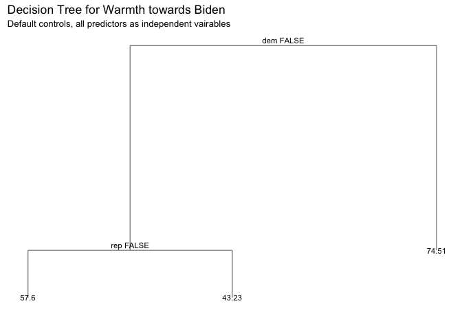

Problem set \#8: tree-based methods and support vector machines
================
Tong Ju
**March 5th 2017**

-   [Part 1: Sexy Joe Biden (redux times two) \[3 points\]](#part-1-sexy-joe-biden-redux-times-two-3-points)
-   [Part 2: Modeling voter turnout \[3 points\]](#part-2-modeling-voter-turnout-3-points)
-   [Part 3: OJ Simpson \[4 points\]](#part-3-oj-simpson-4-points)

Part 1: Sexy Joe Biden (redux times two) \[3 points\]
=====================================================

1.Split the data into a training set (70%) and a validation set (30%). **Be sure to set your seed prior to this part of your code to guarantee reproducibility of results.**

``` r
set.seed(1234)
# Factorize some string variables in the dataset
biden_fact<-biden %>%
  mutate (female = factor(female, levels =0:1, labels = c("male", "female")),
          dem = factor (dem, levels =0:1, labels = c("non-dem","dem")),
          rep = factor (rep, levels =0:1, labels = c("non-rep", "redp")))

#split the data set to training/test set (70%:30%) as required:
biden_split <- resample_partition(biden_fact, c(test = 0.3, train = 0.7))
```

2.Fit a decision tree to the training data, with `biden` as the response variable and the other variables as predictors. Plot the tree and interpret the results. What is the test MSE? \* Leave the control options for `tree()` at their default values

``` r
# define the MSE() function:
mse <- function(model, data) {
  x <- modelr:::residuals(model, data)
  mean(x ^ 2, na.rm = TRUE)
}

# Make the tree model of Biden data (full tree model)
tree_biden <- tree(biden ~ ., data = biden_split$train)

# Plot the tree:
tree_data <- dendro_data(tree_biden)

ggplot(segment(tree_data)) +
  geom_segment(aes(x = x, y = y, xend = xend, yend = yend), 
               alpha = 0.5) +
  geom_text(data = label(tree_data), 
            aes(x = x, y = y, label = label_full), vjust = -0.5, size = 3) +
  geom_text(data = leaf_label(tree_data), 
            aes(x = x, y = y, label = label), vjust = 0.5, size = 3) +
  theme_dendro() +
  labs(title = 'Decision Tree for Warmth towards Biden ', 
       subtitle = 'Default controls, all predictors as independent vairables')
```



``` r
leaf_vals <- leaf_label(tree_data)$yval
test_mse <- mse(tree_biden, biden_split$test)
```

Based on the training data, the full tree model by using the `biden` as the responsive variable, and the other variables as independent variables is established, with the control parameters defaulted.

There are three nodes ((internal and terminal) in this decision tree,in which the braches of the tree are dependent are the political affilication of the respendents (Democratic, Republican, and neither Democratic nor Republican). The result of this tree model could be simply interpreted as below:

If the respondent affiliated with Democratic party, then the model estimates the warmth toward Biden to be 74.513;

If the respondent not affiliated with Democratic party, then we proceed down the left branch to the next internal node:

If he/she is Republican, then the model estimates the warmth toward Biden to be 43.226; Otherwise, if neither Republican nor Democratic, the estimated warmth is predicted to be 57.597.

1.  Now fit another tree to the training data with the following `control` options:

    Use cross-validation to determine the optimal level of tree complexity, plot the optimal tree, and interpret the results. Does pruning the tree improve the test MSE?
2.  Use the bagging approach to analyze this data. What test MSE do you obtain? Obtain variable importance measures and interpret the results.
3.  Use the random forest approach to analyze this data. What test MSE do you obtain? Obtain variable importance measures and interpret the results. Describe the effect of \(m\), the number of variables considered at each split, on the error rate obtained.
4.  Use the boosting approach to analyze the data. What test MSE do you obtain? How does the value of the shrinkage parameter \(\lambda\) influence the test MSE?

Part 2: Modeling voter turnout \[3 points\]
===========================================

1.  Use cross-validation techniques and standard measures of model fit (e.g. test error rate, PRE, ROC curves/AUC) to compare and evaluate at least five tree-based models of voter turnout. Select the best model and interpret the results using whatever methods you see fit (graphs, tables, model fit statistics, predictions for hypothetical observations, etc.)
2.  Use cross-validation techniques and standard measures of model fit (e.g. test error rate, PRE, ROC curves/AUC) to compare and evaluate at least five SVM models of voter turnout. Select the best model and interpret the results using whatever methods you see fit (graphs, tables, model fit statistics, predictions for hypothetical observations, etc.)

Part 3: OJ Simpson \[4 points\]
===============================

You can make full use of any of the statistical learning techniques to complete this part of the assignment:

-   Linear regression
-   Logistic regression
-   Generalized linear models
-   Non-linear linear models
-   Tree-based models
-   Support vector machines
-   Resampling methods

Select methods that are appropriate for each question and **justify the use of these methods**.
