Problem set \#9: nonparametric methods and unsupervised learning
================
Tong Ju
**2017.3.11**

-   [1. Attitudes towards feminists](#attitudes-towards-feminists)
    -   [1) Split the data into a training and test set (70/30%).](#split-the-data-into-a-training-and-test-set-7030.)
    -   [2) Calculate the test MSE for KNN models with \(K = 5, 10, 15, \dots, 100\), using whatever combination of variables you see fit. Which model produces the lowest test MSE?](#calculate-the-test-mse-for-knn-models-with-k-5-10-15-dots-100-using-whatever-combination-of-variables-you-see-fit.-which-model-produces-the-lowest-test-mse)
    -   [3) Calculate the test MSE for weighted KNN models with \(K = 5, 10, 15, \dots, 100\) using the same combination of variables as before. Which model produces the lowest test MSE?](#calculate-the-test-mse-for-weighted-knn-models-with-k-5-10-15-dots-100-using-the-same-combination-of-variables-as-before.-which-model-produces-the-lowest-test-mse)
    -   [4) Compare the test MSE for the best KNN/wKNN model(s) to the test MSE for the equivalent linear regression, decision tree, boosting, and random forest methods using the same combination of variables as before. Which performs the best? Why do you think this method performed the best, given your knowledge of how it works?](#compare-the-test-mse-for-the-best-knnwknn-models-to-the-test-mse-for-the-equivalent-linear-regression-decision-tree-boosting-and-random-forest-methods-using-the-same-combination-of-variables-as-before.-which-performs-the-best-why-do-you-think-this-method-performed-the-best-given-your-knowledge-of-how-it-works)
-   [2. Voter turnout and depression](#voter-turnout-and-depression)
    -   [1) Split the data into a training and test set (70/30).](#split-the-data-into-a-training-and-test-set-7030.-1)
    -   [2) Calculate the test error rate for KNN models with \(K = 1,2,\dots,10\), using whatever combination of variables you see fit. Which model produces the lowest test MSE?](#calculate-the-test-error-rate-for-knn-models-with-k-12dots10-using-whatever-combination-of-variables-you-see-fit.-which-model-produces-the-lowest-test-mse)
    -   [3) Calculate the test error rate for weighted KNN models with \(K = 1,2,\dots,10\) using the same combination of variables as before. Which model produces the lowest test error rate?](#calculate-the-test-error-rate-for-weighted-knn-models-with-k-12dots10-using-the-same-combination-of-variables-as-before.-which-model-produces-the-lowest-test-error-rate)
    -   [4) Compare the test error rate for the best KNN/wKNN model(s) to the test error rate for the equivalent logistic regression, decision tree, boosting, random forest, and SVM methods using the same combination of variables as before. Which performs the best? Why do you think this method performed the best, given your knowledge of how it works?](#compare-the-test-error-rate-for-the-best-knnwknn-models-to-the-test-error-rate-for-the-equivalent-logistic-regression-decision-tree-boosting-random-forest-and-svm-methods-using-the-same-combination-of-variables-as-before.-which-performs-the-best-why-do-you-think-this-method-performed-the-best-given-your-knowledge-of-how-it-works)
-   [3. Colleges](#colleges)
    -   [2) Perform \(K\)-means clustering with \(K=2\). Plot the observations on the first and second principal components and color-code each state based on their cluster membership. Describe your results.](#perform-k-means-clustering-with-k2.-plot-the-observations-on-the-first-and-second-principal-components-and-color-code-each-state-based-on-their-cluster-membership.-describe-your-results.)
    -   [3) Perform \(K\)-means clustering with \(K=4\). Plot the observations on the first and second principal components and color-code each state based on their cluster membership. Describe your results.](#perform-k-means-clustering-with-k4.-plot-the-observations-on-the-first-and-second-principal-components-and-color-code-each-state-based-on-their-cluster-membership.-describe-your-results.)
    -   [4) Perform \(K\)-means clustering with \(K=3\). Plot the observations on the first and second principal components and color-code each state based on their cluster membership. Describe your results.](#perform-k-means-clustering-with-k3.-plot-the-observations-on-the-first-and-second-principal-components-and-color-code-each-state-based-on-their-cluster-membership.-describe-your-results.)
    -   [5) Perform \(K\)-means clustering with \(K=3\) on the first two principal components score vectors, rather than the raw data. Describe your results and compare them to the clustering results with \(K=3\) based on the raw data.](#perform-k-means-clustering-with-k3-on-the-first-two-principal-components-score-vectors-rather-than-the-raw-data.-describe-your-results-and-compare-them-to-the-clustering-results-with-k3-based-on-the-raw-data.)
    -   [6) Using hierarchical clustering with complete linkage and Euclidean distance, cluster the states.](#using-hierarchical-clustering-with-complete-linkage-and-euclidean-distance-cluster-the-states.)
    -   [7) Cut the dendrogram at a height that results in three distinct clusters. Which states belong to which clusters?](#cut-the-dendrogram-at-a-height-that-results-in-three-distinct-clusters.-which-states-belong-to-which-clusters)
    -   [8) Hierarchically cluster the states using complete linkage and Euclidean distance, after scaling the variables to have standard deviation \(1\). What effect does scaling the variables have on the hierarchical clustering obtained? In your opinion, should the variables be scaled before the inter-observation dissimilarities are computed? Provide a justification for your answer.](#hierarchically-cluster-the-states-using-complete-linkage-and-euclidean-distance-after-scaling-the-variables-to-have-standard-deviation-1.-what-effect-does-scaling-the-variables-have-on-the-hierarchical-clustering-obtained-in-your-opinion-should-the-variables-be-scaled-before-the-inter-observation-dissimilarities-are-computed-provide-a-justification-for-your-answer.)

1. Attitudes towards feminists
==============================

### 1) Split the data into a training and test set (70/30%).

``` r
set.seed(1234)
# Factorize some string variables in the dataset
fem1<-fem %>%
  mutate (dem = factor (dem, levels =0:1, labels = c("non-dem","dem")),
          rep = factor (rep, levels =0:1, labels = c("non-rep", "redp")),
          inc = factor (income, levels = 1: 25, labels = c("0","3","5","7.5","10","11","12.5","15","17","20","22","25","30","35","40","45","50","60","75","90","100","110","120","135","150"))) %>%
  mutate (inc=as.numeric(as.character(inc)))%>%
  # romove any missing values
  na.omit()

#split the data set to training/test set (70%:30%) as required:
fem_split <- resample_partition(fem1, c(test = 0.3, train = 0.7))
fem_train <- as_tibble(fem_split$train)
fem_test <- as_tibble(fem_split$test)
```

In this section, I mutate the string variable of income to the continuous variable `inc` (the number of `inc` is viewed as the starting value of `income` range, divided by 1000), and also separate the data set to test and training data set.

### 2) Calculate the test MSE for KNN models with \(K = 5, 10, 15, \dots, 100\), using whatever combination of variables you see fit. Which model produces the lowest test MSE?

First, I choose the `inc`, `educ`,and `female` as my independent variables. (Below is the plot of the conditional feminist attitude score vs. income, indicating there is some relation between the income or age and the feminist score.) In addition, I suppose the gender (`female`) should has some relationship with the feminist score, since this attitude is highly associated with the gender identity.

``` r
# Plot of the conditional feminist attitude vs. the income and education level. 
fem1 %>%
  group_by(inc) %>%
  summarize(mean = mean(feminist),
            sd = sd(feminist)) %>%
  ggplot(aes(inc, mean, ymin = mean - sd, ymax = mean + sd)) +
  geom_errorbar() +
  geom_point() +
  geom_smooth(se=FALSE)+
  labs(title = "Conditional feminist attitude score, by income",
       subtitle = "Plus/minus SD with regression curve",
       x = "Income (in 1000 dolloars)",
       y = "Feminist Score")
```

    ## `geom_smooth()` using method = 'loess' and formula 'y ~ x'

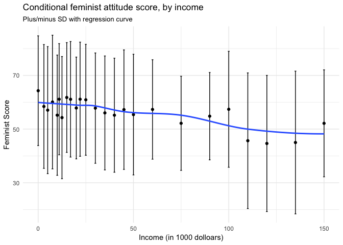

``` r
fem1 %>%
  group_by(educ) %>%
  summarize(mean = mean(feminist),
            sd = sd(feminist)) %>%
  ggplot(aes(educ, mean, ymin = mean - sd, ymax = mean + sd)) +
  geom_errorbar() +
  geom_point() +
  geom_smooth(se=FALSE)+
  labs(title = "Conditional feminist attitude score, by education level",
       subtitle = "Plus/minus SD with regression curve",
       x = "Education years",
       y = "Feminist Score")
```

    ## `geom_smooth()` using method = 'loess' and formula 'y ~ x'

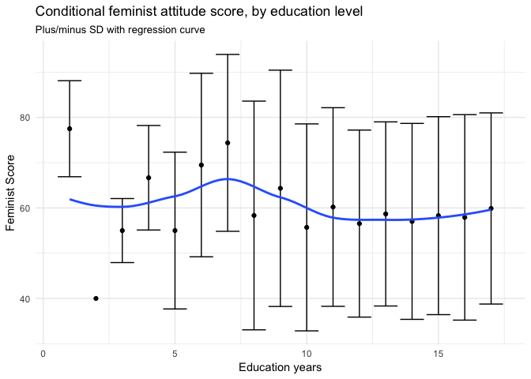

``` r
## estimate the MSE for LM and KNN models:

# define the MSE() function:
mse <- function(model, data) {
  x <- modelr:::residuals(model, data)
  mean(x ^ 2, na.rm = TRUE)
}

# estimate the MSE for LM
mse_lm <- lm(feminist ~ educ + female + inc, data = fem_train) %>%
  mse(.,fem_test)

# estimate the MSE for KNN K=5, 10, 15, 20, 25,..., 100
mse_knn <- data_frame(k = seq(5, 100, by = 5), 
                      knn = map(k, ~ knn.reg(select(fem_train, -age, -income, -dem, -rep), y = fem_train$feminist, test = select(fem_test, -age, -income, -dem, -rep), k = .)), 
                      mse = map_dbl(knn, ~ mean((fem_test$feminist - .$pred)^2))) 

# plot the MSE vs. k value
ggplot(mse_knn, aes(k, mse)) +
  geom_line() +
  geom_point() +
  labs(title = "KNN on Feminist Score data",
       x = "K",
       y = "Test mean squared error") +
  expand_limits(y = 0)
```

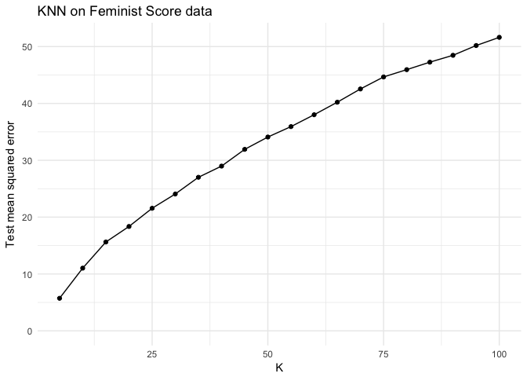

``` r
knn_mse_fem<-min(mse_knn$mse)
```

In the KNN plots, we find as the K increases, the MSE increses, indicating 1) our model is rather non-linear, otherwise the KNN plot will show the converse trends; 2) the larger the K, more likely the generated model overfitting acorss the training data, leading to the higher MSE. In addition, the lowest MSE is 5.727, when k = 5 (This is the best model among all KNN models).

### 3) Calculate the test MSE for weighted KNN models with \(K = 5, 10, 15, \dots, 100\) using the same combination of variables as before. Which model produces the lowest test MSE?

``` r
## estimate the MSE for weighted KNN models (K=5, 10, 15, 20, 25,..., 100): 
mse_knn_w <- data_frame(k = seq(5, 100, by = 5), 
                      wknn = map(k, ~ kknn(feminist ~ educ + female + inc, train = fem_train, test = fem_test, k = .)), 
                      mse_wknn = map_dbl(wknn, ~ mean((fem_test$feminist - .$fitted.values)^2))) %>%
  left_join(mse_knn, by = "k") %>%
  mutate(mse_knn = mse)%>%
  select (k, mse_knn, mse_wknn) %>%
  gather(method,mse, -k) %>%
  mutate(method = str_replace(method, "mse_", ""))%>%
  mutate(method = factor (method, levels = c("knn","wknn"), labels = c("KNN","Weighted KNN"))) 


mse_knn_w %>%
  ggplot(aes(k, mse, color = method)) +
  geom_line() +
  geom_point() +
  geom_hline(yintercept = mse_lm, linetype = 2) +
  labs(title = "Test MSE for linear regression vs. KNN",
       subtitle = "Traditional and weighted KNN",
       x = "K",
       y = "Test mean squared error",
       method = NULL) +
  expand_limits(y = 0) +
  theme(legend.position = "bottom")
```

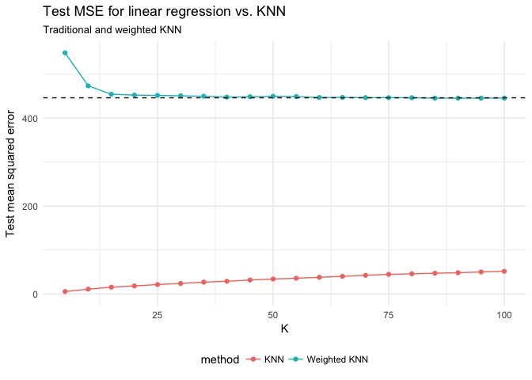

As shown above, the green curve stands for the MSE for the weighted KNN method, the red curve stands fot the KNN method, and the dashed line is for the OLS. It is obvious that traditional KNN has much lower test MSE than the weighted KNN or the OLS. This result indicates that given only 3 independent variables, the traditional KNN method works much better than both of the weighted KNN and OLS. It is perhaps because the weighted KNN would overfit the data, and the OLS cannot reflect the non-linearality of the data. In addition, the lowest MSE for the weighted KNN is 445.32, when k = 100 (This is the best model among all the weighted KNN models).

### 4) Compare the test MSE for the best KNN/wKNN model(s) to the test MSE for the equivalent linear regression, decision tree, boosting, and random forest methods using the same combination of variables as before. Which performs the best? Why do you think this method performed the best, given your knowledge of how it works?

In the above section, I have compared the test MSE for KNN, weighted KNN and simple OLS model.I will test the other methods like decision tree and random forest methods using the same combination of variables, as follows:

``` r
set.seed(1234)
# Single tree model:
tree <- tree(feminist ~ educ + female +inc, data = fem_train)

#Plot tree
tree_data <- dendro_data(tree)

ggplot(segment(tree_data)) +
  geom_segment(aes(x = x, y = y, xend = xend, yend = yend), alpha = 0.5) +
  geom_text(data = label(tree_data), aes(x = x, y = y, label = label_full), vjust = -0.5, size = 3) +
  geom_text(data = leaf_label(tree_data), aes(x = x, y = y, label = label), vjust = 0.5, size = 3) +
  theme_dendro() +
  labs(title = "Feminist Attitude Score Tree",
       subtitle = "Feminist warmth ~ education + gender + income")
```

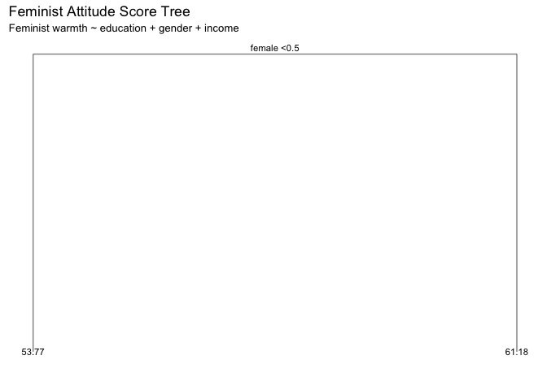

``` r
mse_tree <- mse(tree, fem_test)

# Random Forests:
rf<- randomForest(feminist ~ educ + female +inc, data = fem_train, ntree = 500)

data_frame(var = rownames(importance(rf)),
           MeanDecreaseRSS = importance(rf)[,1]) %>%
  mutate(var = fct_reorder(var, MeanDecreaseRSS, fun = median)) %>%
  ggplot(aes(var, MeanDecreaseRSS)) +
  geom_point() +
  coord_flip() +
  labs(title = "Predicting Feminist Attitude Score",
       subtitle = "Random Forest",
       x = NULL,
       y = "Average decrease in the Gini Index")
```

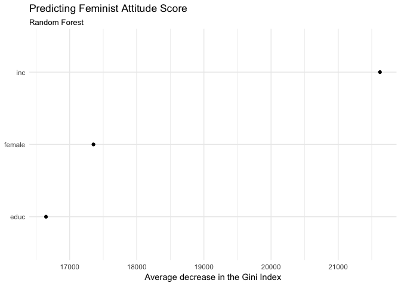

``` r
mse_rf <- mse(rf, fem_test)
```

From the Random Forest model, it is obvious that there is strong correlation between the income wiht the feminist attitude.

For Boosting method, I have set the depth = 1, and optimize the iteration step 1308, and the shrinkage as 0.006, leading to the minimal MSE = 441.

``` r
set.seed(1234)
# Define a function to calculate the MSE for each bossting model
mse_boost <-function(model, test, tree_number) {
  yhat.boost <- predict (model, newdata = test, n.trees=tree_number)
  mse <- mean((yhat.boost - (as_tibble(test))$feminist)^2)
  return (mse)
}

boost <- gbm(feminist ~ educ + female +inc, data = fem_train, n.trees = 5000, interaction.depth = 1)
```

    ## Distribution not specified, assuming gaussian ...

``` r
# Optimize the iteration steps
opt_it = gbm.perf(boost, plot.it = FALSE)
```

    ## Using OOB method...

``` r
# optimize the shrinkage parameter
s <- c(0.00025, 0.0005, 0.001, 0.002, 0.004, 0.006, 0.008, 0.01, 0.02, 0.04, 0.06, 0.08, 0.1, 0.2, 0.4)

MSE<-list()
for (i in s) {
  boost <- gbm(feminist ~ educ + female +inc, data = fem_train,n.trees = 1308, interaction.depth = 1, shrinkage = i)
  MSE <- append(MSE, mse_boost(boost,fem_test, 1308))
}
```

    ## Distribution not specified, assuming gaussian ...
    ## Distribution not specified, assuming gaussian ...
    ## Distribution not specified, assuming gaussian ...
    ## Distribution not specified, assuming gaussian ...
    ## Distribution not specified, assuming gaussian ...
    ## Distribution not specified, assuming gaussian ...
    ## Distribution not specified, assuming gaussian ...
    ## Distribution not specified, assuming gaussian ...
    ## Distribution not specified, assuming gaussian ...
    ## Distribution not specified, assuming gaussian ...
    ## Distribution not specified, assuming gaussian ...
    ## Distribution not specified, assuming gaussian ...
    ## Distribution not specified, assuming gaussian ...
    ## Distribution not specified, assuming gaussian ...
    ## Distribution not specified, assuming gaussian ...

``` r
MSE_lambda<-data_frame (shrinkage = s,
            MSE = unlist(MSE))

ggplot(MSE_lambda, aes(x=shrinkage, y=MSE)) +
  geom_line()+
  labs(x = "Shrinkage parameter",
       y = "test MSE",
       title = "MSE vs. Shrinkage parameter (0.00025 ~ 0.4) for Boosting",
       subtitle ="num. of trees = 1308, interaction depth = 1")
```

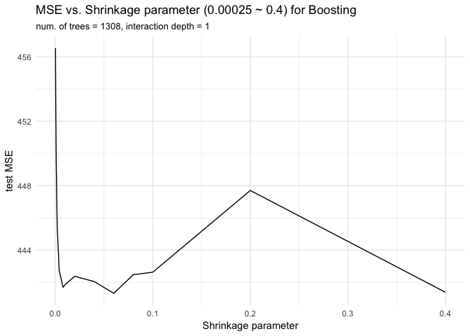

``` r
sum <- data_frame("model" = c("KNN (k=5)", "Weighted KNN (k=100)", "Single Tree", "Random Forest", "Optimized Boosting","OLS"),
                  "test MSE" = c(knn_mse_fem, 445.32, mse_tree, mse_rf, 441, mse_lm))
pander(sum)
```

<table style="width:43%;">
<colgroup>
<col width="29%" />
<col width="13%" />
</colgroup>
<thead>
<tr class="header">
<th align="center">model</th>
<th align="center">test MSE</th>
</tr>
</thead>
<tbody>
<tr class="odd">
<td align="center">KNN (k=5)</td>
<td align="center">5.73</td>
</tr>
<tr class="even">
<td align="center">Weighted KNN (k=100)</td>
<td align="center">445.32</td>
</tr>
<tr class="odd">
<td align="center">Single Tree</td>
<td align="center">451.78</td>
</tr>
<tr class="even">
<td align="center">Random Forest</td>
<td align="center">444.38</td>
</tr>
<tr class="odd">
<td align="center">Optimized Boosting</td>
<td align="center">441.00</td>
</tr>
<tr class="even">
<td align="center">OLS</td>
<td align="center">445.99</td>
</tr>
</tbody>
</table>

According to the table above, it is the traditional KNN that gives the minimal test MSE. On the other hand, all the other five models have very similar test MSE, ranging from 441 to 446. As a non-parametric mehtod, KNN, works much better than the OLS model, this is because the non-parametric mehtod relaxes the linear assumption and thus can better reflect the real structural features of the data.

In our case, it appears the traditional KNN also performs better than all the other non-parametric mehtods. In my opinion, this is because the traditional KNN is able to avoid some overfitting problems, which might influece the test MSE in other 4 mehtods. In addition, in our case, since there are only 3 independent variables, the drawback of traditional KNN in the higher dimension data space is not so obvious. This could be the second reason why traditional KNN overbeats other methods. In the demo sample of Dr Soltoff, we have also observed that in different kinds of data, KNN and weighted KNN can give rather different results. In some data set, like `Biden`, traditional KNN also works much better than the weighted KNN. However, in other cases, it does not. This indicates which non-parametric method can better fit the data is highly dependent on the data set itself, its linearality, the number of parameters, and so on.

2. Voter turnout and depression
===============================

### 1) Split the data into a training and test set (70/30).

``` r
set.seed(1234)

# Define the error rate function for trees
err.rate.tree <- function(model, data) {
  data <- as_tibble(data)
  response <- as.character(model$terms[[2]])

  pred <- predict(model, newdata = data, type = "class") 
  actual <- data[[response]]

  return(mean(pred != actual, na.rm = TRUE))
}

# to see there is any strong association with responsive variable and the independnet variables
# Random Forests:
mh_rf<- randomForest(vote96 ~ ., data = na.omit(mh), ntree = 500)

data_frame(var = rownames(importance(mh_rf)),
           MeanDecreaseRSS = importance(mh_rf)[,1]) %>%
  mutate(var = fct_reorder(var, MeanDecreaseRSS, fun = median)) %>%
  ggplot(aes(var, MeanDecreaseRSS)) +
  geom_point() +
  coord_flip() +
  labs(title = "Predicting Voting Turnout", 
       subtitle = "Random Forest", 
       x = NULL,
       y = "Average decrease in the Gini Index") 
```

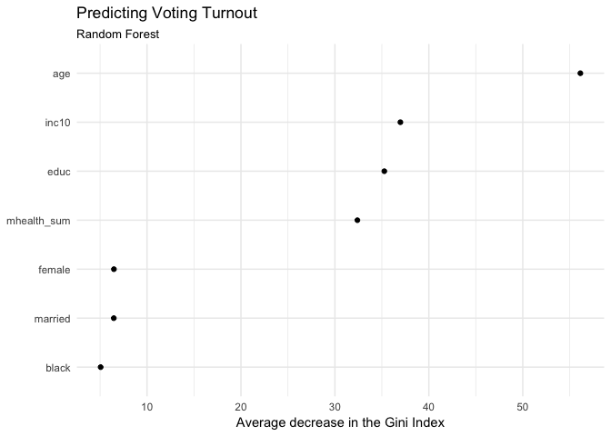

``` r
#split the data set to training/test set (70%:30%) as required:
mh_rm_na <- mh %>%
  select(vote96, age, inc10, educ, mhealth_sum)%>%
  na.omit()


mh_split <- resample_partition(mh_rm_na, c(test = 0.3, train = 0.7))
mh_train <- as_tibble(mh_split$train)
mh_test <- as_tibble(mh_split$test)
```

In order to see which independent variable has strong association with the reponsive variable `vote96`, I run the random forest, finding that `age`, `inc10`, `mhealth_sum`, `educ` have stronger impact on `vote96` than all other variables. Therefore, I determine to use `age`, `inc10`, `mhealth_sum`, `educ` as my independent variables.

### 2) Calculate the test error rate for KNN models with \(K = 1,2,\dots,10\), using whatever combination of variables you see fit. Which model produces the lowest test MSE?

``` r
## estimate the MSE for GLM and KNN models:
# Define logit2prob():
logit2prob <- function(x){
  exp(x) / (1 + exp(x))
}

# estimate the MSE for GLM
mh_glm <- glm(vote96 ~ age + inc10 + mhealth_sum + educ, data = mh_train, family = binomial) 
# estimate the error rate for this model:
x<- mh_test %>%
  add_predictions(mh_glm) %>%
  mutate (pred = logit2prob(pred),
          prob = pred,
          pred = as.numeric(pred > 0.5))
err.rate.glm <-mean(x$vote96 != x$pred)

# estimate the MSE for KNN K=1,2,...,10
mse_knn <- data_frame(k = 1:10,
                      knn_train = map(k, ~ class::knn(select(mh_train, -vote96),
                                                test = select(mh_train, -vote96),
                                                cl = mh_train$vote96, k = .)),
                      knn_test = map(k, ~ class::knn(select(mh_train, -vote96),
                                                test = select(mh_test, -vote96),
                                                cl = mh_train$vote96, k = .)),
                      mse_train = map_dbl(knn_train, ~ mean(mh_test$vote96 != .)),
                      mse_test = map_dbl(knn_test, ~ mean(mh_test$vote96 != .)))

ggplot(mse_knn, aes(k, mse_test)) +
  geom_line() +
  geom_hline(yintercept = err.rate.glm, linetype = 2) +
  labs(x = "K",
       y = "Test error rate",
       title = "KNN on Vote Turnout") +
  expand_limits(y = 0)
```

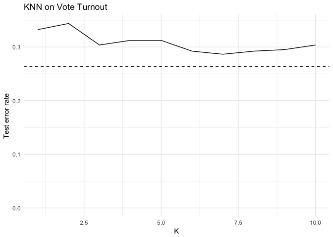

``` r
hm_knn_mse<-min(mse_knn$mse_test)
```

According to the test error rate plot for the GLM (dashed line) and KNN (black line), it is clear that the traditional KNN in this case is not better than the GLM. It appears, as the k increases, the error rate becomes smaller and closer to the error rate in the GLM model.The lowest error rate is 0.287 when k =7 (This is the best model among all 10 KNN models).

### 3) Calculate the test error rate for weighted KNN models with \(K = 1,2,\dots,10\) using the same combination of variables as before. Which model produces the lowest test error rate?

``` r
## estimate the MSE for weighted KNN models:

# estimate the MSE for KNN K=1,2,...,10
# note here we need to convert the fitted.values, probablity to 0 or 1. 
mse_wknn <- data_frame(k = 1:10,
                      wknn = map(k, ~ kknn(vote96 ~., train = mh_train, test = mh_test, k =.)),
                      mse_test_wknn = map_dbl(wknn, ~ mean(mh_test$vote96 != as.numeric(.$fitted.values > 0.5))))

mse_wknn_mh <- min(mse_wknn$ mse_test_wknn)

err<-mse_wknn %>%
  left_join(mse_knn, by = "k") %>%
  select(k, mse_test_wknn, mse_test) %>%
  gather(method,mse, -k) %>%
  mutate(method = factor(method, levels =c("mse_test_wknn","mse_test"), labels = c("Weighted KNN","KNN")))

err %>%
  ggplot(aes(k, mse, color = method)) +
  geom_line() +
  geom_point() +
  geom_hline(yintercept = err.rate.glm, linetype = 2) +
  labs(title = "Test MSE for linear regression vs. KNN, on Vote Turnout",
       subtitle = "Traditional and weighted KNN",
       x = "K",
       y = "Test mean squared error",
       method = NULL) +
  expand_limits(y = 0) +
  theme(legend.position = "bottom")
```

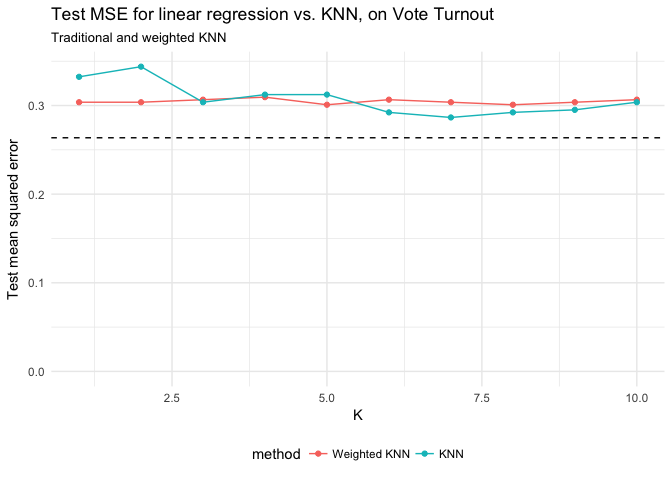

In the above plot, we can see the change of error rate for the weighted KNN does not change lot when the K increases.The best weighted KNN model is the one at k = 4, test error rate = 0.301. In addition, both of the best KNN and weighted KNN model do not give the error rate as low as the GLM model.

### 4) Compare the test error rate for the best KNN/wKNN model(s) to the test error rate for the equivalent logistic regression, decision tree, boosting, random forest, and SVM methods using the same combination of variables as before. Which performs the best? Why do you think this method performed the best, given your knowledge of how it works?

``` r
set.seed(1234)
# Single decision tree model:
mh_rm_na_fac<- mh_rm_na %>%
  mutate (vote96 = factor(vote96, levels = 0:1, label =c("no_vote", "vote")))

mh_split <- resample_partition(mh_rm_na_fac, c(test = 0.3, train = 0.7))
mh_train <- as_tibble(mh_split$train)
mh_test <- as_tibble(mh_split$test)


tree_mh <- tree(vote96 ~ age + inc10 + mhealth_sum + educ, data = mh_train)

#Plot tree
tree_data <- dendro_data(tree_mh)

ggplot(segment(tree_data)) +
  geom_segment(aes(x = x, y = y, xend = xend, yend = yend), alpha = 0.5) +
  geom_text(data = label(tree_data), aes(x = x, y = y, label = label_full), vjust = -0.5, size = 3) +
  geom_text(data = leaf_label(tree_data), aes(x = x, y = y, label = label), vjust = 0.5, size = 3) +
  theme_dendro() +
  labs(title = "Vote Turnout Tree",
       subtitle = "vote ~ age + income + mental health + education")
```

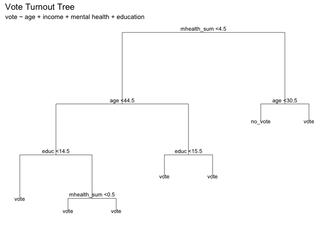

``` r
error_tree <- err.rate.tree(tree_mh, mh_test)
```

In the first model, I tried the classification tree. The plot is shown as above, with the error rate as 0.304.

``` r
set.seed(1234)

# Random Forests:
rf<- randomForest(vote96 ~ age + inc10 + mhealth_sum + educ, data = mh_train, ntree = 500)

data_frame(var = rownames(importance(rf)),
           MeanDecreaseRSS = importance(rf)[,1]) %>%
  mutate(var = fct_reorder(var, MeanDecreaseRSS, fun = median)) %>%
  ggplot(aes(var, MeanDecreaseRSS)) +
  geom_point() +
  coord_flip() +
  labs(title = "Predicting Vote Turnout",
       subtitle = "Random Forest",
       x = NULL,
       y = "Average decrease in the Gini Index")
```

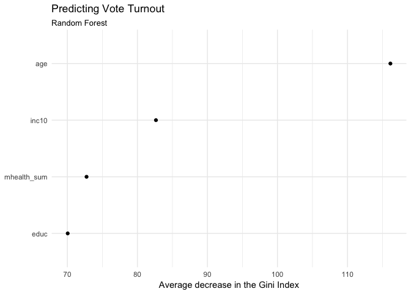

``` r
error_rf <- err.rate.tree(rf, mh_test)
```

Secondly, I tried the random forest. The plot is shown as above, with the error rate as 0.315. In this plot, we find `age` has much higher importance than other variables.

``` r
set.seed(1234)

mh_split <- resample_partition(mh_rm_na, c(test = 0.3, train = 0.7))
mh_train <- as_tibble(mh_split$train)
mh_test <- as_tibble(mh_split$test)

boost_mh = gbm (vote96 ~ age + inc10 + mhealth_sum + educ, data = mh_train, n.trees = 10000, interaction.depth = 4, distribution = "bernoulli")  


error<-list()
for (i in 100:1000) {
  e<- mean(round(predict(boost_mh,newdata = mh_test,n.trees = i)) != mh_test$vote96)
  error<-append(error, e)
}

err_boost<- data_frame("tree" = 100:1000,
                      "error_rate" = unlist(error))

err_boost500 <- min(err_boost$error_rate)

err_boost %>%
  ggplot (aes(tree, error_rate))+
  geom_line()+
  theme_bw()+
  labs(title="Error Rate for the boosting model on Vote Turnout",
      subtitle ="depth = 4, defaulted shrinkage",
      x = "Number of trees",
      y = "Test Error Rate")
```

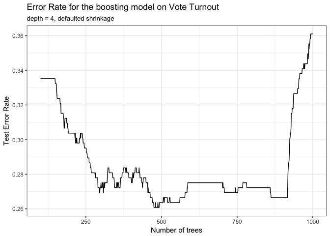

In the above boosting model, I set the \(depth\) as 4, and optimize the iteration steps as 520, using the default shrinkage value. In the optimized setting, the minimal error rate is 0.261.

In the following SVM method, I have tried it with linear kernal, the minimal error rate is 0.255, the best model is summarized as below.

``` r
set.seed(1234)

mh_lin_tune <- tune(svm, vote96 ~ ., data = as_tibble(mh_split$train),
                    kernel = "linear",
                    range = list(cost = c(.001, .01, .1, 1, 5, 10, 100)))
summary(mh_lin_tune)
```

    ## 
    ## Parameter tuning of 'svm':
    ## 
    ## - sampling method: 10-fold cross validation 
    ## 
    ## - best parameters:
    ##  cost
    ##    10
    ## 
    ## - best performance: 0.266 
    ## 
    ## - Detailed performance results:
    ##    cost error dispersion
    ## 1 1e-03 0.287     0.0406
    ## 2 1e-02 0.269     0.0387
    ## 3 1e-01 0.266     0.0382
    ## 4 1e+00 0.266     0.0384
    ## 5 5e+00 0.266     0.0384
    ## 6 1e+01 0.266     0.0384
    ## 7 1e+02 0.266     0.0385

``` r
# Best
mh_lin <- mh_lin_tune$best.model
summary(mh_lin)
```

    ## 
    ## Call:
    ## best.tune(method = svm, train.x = vote96 ~ ., data = as_tibble(mh_split$train), 
    ##     ranges = list(cost = c(0.001, 0.01, 0.1, 1, 5, 10, 100)), 
    ##     kernel = "linear")
    ## 
    ## 
    ## Parameters:
    ##    SVM-Type:  eps-regression 
    ##  SVM-Kernel:  linear 
    ##        cost:  10 
    ##       gamma:  0.25 
    ##     epsilon:  0.1 
    ## 
    ## 
    ## Number of Support Vectors:  551

``` r
sum <- data_frame("model" = c("KNN (k=7)", "Weighted KNN (k=4)", "Single Tree", "Random Forest", "Optimized Boosting","GLM", "SVM"),
                  "test_MSE" = c(hm_knn_mse, mse_wknn_mh,error_tree,error_rf, err_boost500, err.rate.glm , 0.255 ))
pander(sum)
```

<table style="width:40%;">
<colgroup>
<col width="26%" />
<col width="13%" />
</colgroup>
<thead>
<tr class="header">
<th align="center">model</th>
<th align="center">test_MSE</th>
</tr>
</thead>
<tbody>
<tr class="odd">
<td align="center">KNN (k=7)</td>
<td align="center">0.287</td>
</tr>
<tr class="even">
<td align="center">Weighted KNN (k=4)</td>
<td align="center">0.301</td>
</tr>
<tr class="odd">
<td align="center">Single Tree</td>
<td align="center">0.304</td>
</tr>
<tr class="even">
<td align="center">Random Forest</td>
<td align="center">0.315</td>
</tr>
<tr class="odd">
<td align="center">Optimized Boosting</td>
<td align="center">0.261</td>
</tr>
<tr class="even">
<td align="center">GLM</td>
<td align="center">0.264</td>
</tr>
<tr class="odd">
<td align="center">SVM</td>
<td align="center">0.255</td>
</tr>
</tbody>
</table>

``` r
sum%>%
  ggplot(aes(model, test_MSE))+
  geom_bar(stat = "identity", width=.5)+
  theme_bw()+
  labs(title = "Test Error Rate for various models (Vote Turnout)",
       x = "model",
       y = "Test Error Rate")+
  coord_flip()
```

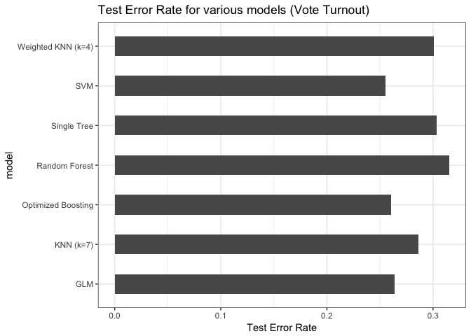

To sum up, according to the comparison of the test error rate, the best model is the SVM with linear kernal (error rate =0.255). In the case of SVMs the decision for classification is based on the test observation’s location relative to the separating hyperplane. By adjusting the cost value, this method may have much more flexibility than the other mehtods, especially the single tree model or random forest model. In all 6 non-parametric approaches, the large error rates are acutally from single tree model and random forest model. For the remaining non-parametric approaches, boosting methods, optimized in terms of iteration steps, however, could be further improved by adjusting the shrinkage parameter and the iteraction depth. In this case, weighted KNN is still a little bit worse than the traditional KNN, indicating that traditional KNN may have some advantage considering only a few variables in the model. KNN method relies on the Bayes decision rule to estimate the conditional distribution of Y given X. It is notable that indeed both of KNN or weighted KNN have very similar error rate in this classification problem (compared to the regression problem above). However, in this case, the GLM, the parametric approach can also give relatively small error rate , suggesting parametric apraoch can work as well as the non-parametric appraoch in some data.

3. Colleges
===========

Perform PCA analysis on the college dataset and plot the first two principal components. Describe the results. What variables appear strongly correlated on the first principal component? What about the second principal component?

``` r
# convert the private to a numeric variable
c <- college %>%
  mutate(Private = ifelse (Private =="Yes",1,0 ) )
# However, it seems the vector of Private does associate any major clusters, I ignore it. 


pr.out <- prcomp(c, scale = TRUE)
biplot(pr.out, scale = 0, cex = .6)
```


Since the `Private` is a string variable, I did not take this variable into the consideration when performing the PCA in the next section. Also, even consdering the `Private`, this variable seems to be unrelated with those major clusters of loading vectors on the plot. According to the above plot, it appears that `Private` gained more emphasis in the second principle component. In the following plot, I perform the PCA without considering the `Private`.

``` r
pr.out <- prcomp(college[,2:18], scale = TRUE)

pr.out$rotation
```

    ##                 PC1     PC2     PC3     PC4      PC5      PC6     PC7
    ## Apps         0.2488 -0.3316  0.0631 -0.2813 -0.00574 -0.01624 -0.0425
    ## Accept       0.2076 -0.3721  0.1012 -0.2678 -0.05579  0.00753 -0.0129
    ## Enroll       0.1763 -0.4037  0.0830 -0.1618  0.05569 -0.04256 -0.0277
    ## Top10perc    0.3543  0.0824 -0.0351  0.0515  0.39543 -0.05269 -0.1613
    ## Top25perc    0.3440  0.0448  0.0241  0.1098  0.42653  0.03309 -0.1185
    ## F.Undergrad  0.1546 -0.4177  0.0614 -0.1004  0.04345 -0.04345 -0.0251
    ## P.Undergrad  0.0264 -0.3151 -0.1397  0.1586 -0.30239 -0.19120  0.0610
    ## Outstate     0.2947  0.2496 -0.0466 -0.1313 -0.22253 -0.03000  0.1085
    ## Room.Board   0.2490  0.1378 -0.1490 -0.1850 -0.56092  0.16276  0.2097
    ## Books        0.0648 -0.0563 -0.6774 -0.0871  0.12729  0.64105 -0.1497
    ## Personal    -0.0425 -0.2199 -0.4997  0.2307  0.22231 -0.33140  0.6338
    ## PhD          0.3183 -0.0583  0.1270  0.5347 -0.14017  0.09126 -0.0011
    ## Terminal     0.3171 -0.0464  0.0660  0.5194 -0.20472  0.15493 -0.0285
    ## S.F.Ratio   -0.1770 -0.2467  0.2898  0.1612  0.07939  0.48705  0.2193
    ## perc.alumni  0.2051  0.2466  0.1470 -0.0173  0.21630 -0.04734  0.2433
    ## Expend       0.3189  0.1317 -0.2267 -0.0793 -0.07596 -0.29812 -0.2266
    ## Grad.Rate    0.2523  0.1692  0.2081 -0.2691  0.10927  0.21616  0.5599
    ##                  PC8      PC9    PC10    PC11    PC12     PC13    PC14
    ## Apps         0.10309 -0.09023 -0.0525  0.0430 -0.0241  0.59583  0.0806
    ## Accept       0.05627 -0.17786 -0.0411 -0.0584  0.1451  0.29264  0.0335
    ## Enroll      -0.05866 -0.12856 -0.0345 -0.0694 -0.0111 -0.44464 -0.0857
    ## Top10perc    0.12268  0.34110 -0.0640 -0.0081 -0.0386  0.00102 -0.1078
    ## Top25perc    0.10249  0.40371 -0.0145 -0.2731  0.0894  0.02188  0.1517
    ## F.Undergrad -0.07889 -0.05944 -0.0208 -0.0812 -0.0562 -0.52362 -0.0564
    ## P.Undergrad -0.57078  0.56067  0.2231  0.1007  0.0635  0.12600  0.0193
    ## Outstate    -0.00985 -0.00457 -0.1867  0.1432  0.8234 -0.14186 -0.0340
    ## Room.Board   0.22145  0.27502 -0.2983 -0.3593 -0.3546 -0.06975 -0.0584
    ## Books       -0.21329 -0.13366  0.0820  0.0319  0.0282  0.01144 -0.0668
    ## Personal     0.23266 -0.09447 -0.1360 -0.0186  0.0393  0.03945  0.0275
    ## PhD          0.07704 -0.18518  0.1235  0.0404 -0.0232  0.12770 -0.6911
    ## Terminal     0.01216 -0.25494  0.0886 -0.0590 -0.0165 -0.05831  0.6710
    ## S.F.Ratio    0.08360  0.27454 -0.4720  0.4450  0.0110 -0.01772  0.0414
    ## perc.alumni -0.67852 -0.25533 -0.4230 -0.1307 -0.1827  0.10409 -0.0272
    ## Expend       0.05416 -0.04914 -0.1323  0.6921 -0.3260 -0.09375  0.0731
    ## Grad.Rate    0.00534  0.04190  0.5903  0.2198 -0.1221 -0.06920  0.0365
    ##                 PC15     PC16      PC17
    ## Apps        -0.13341 -0.45914 -0.358970
    ## Accept       0.14550  0.51857  0.543427
    ## Enroll      -0.02959  0.40432 -0.609651
    ## Top10perc   -0.69772  0.14874  0.144986
    ## Top25perc    0.61727 -0.05187 -0.080348
    ## F.Undergrad -0.00992 -0.56036  0.414705
    ## P.Undergrad -0.02095  0.05273 -0.009018
    ## Outstate    -0.03835 -0.10159 -0.050900
    ## Room.Board  -0.00340  0.02593 -0.001146
    ## Books        0.00944 -0.00288 -0.000773
    ## Personal     0.00309  0.01289  0.001114
    ## PhD          0.11206 -0.02981 -0.013813
    ## Terminal    -0.15891  0.02708 -0.006209
    ## S.F.Ratio    0.02090  0.02125  0.002222
    ## perc.alumni  0.00842 -0.00333  0.019187
    ## Expend       0.22774  0.04388  0.035310
    ## Grad.Rate    0.00339  0.00501  0.013071

``` r
biplot(pr.out, scale = 0, cex = .8, xlabs=rep(".", nrow(college)))
```

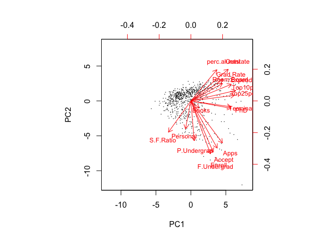

In the above plot, the principal component score vectors have length n=777 and the principal component loading vectors have length p=17 (in this data set, p<n, without considering the `Private`). The biplot visualizes the relationship between the first two principal components for the dataset, including both the scores and the loading vectors.There are almost two major clusters of vectors shown in this plot: one points to the right-upper , the other points towards the right-bottom. The first principal component places approximately equal weight on the following variables: `perc.alumni`, `Outsate`, `Grad.Rate`, `Expend`, `Top10perc`,`Top25perc`,`Room.board`, `Terminal`, `PhD`, because these vectors’ length on the first principal component dimension are roughly the same, wheras the remaining vectors are relatively smaller. On the other hand, the second principal component (the vertical axis) places more emphasis on `P.Undergrad`, `Apps`, `Accept`, `Enroll`, `F.undergrad`. In my opinion, this makes sense, since the first dimension stresses the expenditure of students and the quality of students, and the second dimension stresses the population size of students in various colleges.It is obvious that there are positive correlation between the tuition, room cost, expenditure. Those big colleges may have more undregradat student enrolled and higher acception rate, while small colleges may have less students and lower acception rate or smaller volume of applications.

We can also interpret the plot for individual college based on their positions along the two dimensions. Colleges with large positive values on the first principal component have higher tuition, room cost as well as higher graduation rate. It appears their students are also those ones with high rank in high schools.  
Other colleges with large negative values have low tuition fees. Colleges with large positive values on the second principal component are larger schools with more students, higher volume of application and acception rate, while other with large negative values are smaller schools with less students, lower volume of application and acception rate. 

#4. Clustering states

###1) Perform PCA on the dataset and plot the observations on the first and second principal components.


```r
pr.out <- prcomp(usar[, 2:5], scale = TRUE)

pr.out$rotation
```

```
##             PC1    PC2    PC3    PC4
## Murder   -0.536  0.418 -0.341  0.649
## Assault  -0.583  0.188 -0.268 -0.743
## UrbanPop -0.278 -0.873 -0.378  0.134
## Rape     -0.543 -0.167  0.818  0.089
```

```r
biplot(pr.out, scale = 0, cex = .6,  xlabs= usar$State)
```


I illustrate the use of PCA on the USArrests data set. For each of the 50 states in the United States, the data set contains the number of arrests per 100, 000 residents for each of three crimes: `Assault`, `Murder`, and `Rape`. We also record `UrbanPop` (the percent of the population in each state living in urban areas). The principal component score vectors have length n = 50, and the principal component loading vectors have length p = 4. PCA was performed after standardizing each variable to have mean zero and standard deviation one. The above plot represents both the principal component scores and the loading vectors in a single biplot display.

We see that the first loading vector places approximately equal weight on Assault, Murder, and Rape, with much less weight on `UrbanPop`. Hence this component roughly corresponds to a measure of overall rates of serious crimes. The second loading vector places most of its weight on `UrbanPop` and much less weight on the other three features. Hence, this component roughly corresponds to the level of urbanization of the state. Overall, we see that the crime-related variables (Murder, Assault, and Rape) are located close to each other, and that the `UrbanPop` variable is far from the other three. This indicates that the crime-related variables are corre- lated with each other—states with high murder rates tend to have high assault and rape rates—and that the UrbanPop variable is less correlated with the other three.

We can also examine differences between the states via the two principal com- ponent score vectors shown in the above plot. Our discussion of the loading vectors suggests that states with large positive scores on the first component, such as California, Nevada and Florida, have high crime rates, while states like North Dakota, with negative scores on the first component, have low crime rates. California also has a high score on the second component, indicating a high level of urbanization, while the opposite is true for states like Mississippi. States close to zero on both components, such as Indiana, have approximately average levels of both crime and urbanization.

### 2) Perform \(K\)-means clustering with \(K=2\). Plot the observations on the first and second principal components and color-code each state based on their cluster membership. Describe your results.

``` r
set.seed(1234)

# First, by using kmeans approach to classify the states into two groups, extract the clustering information from the  kmeans(usar[, 2:5], 2, nstart = 1)[[1]], Note: in kmeans, all the columns should have the numeric data. and Soltoff's code "$cluster" appears not to work in this case, instead I use [[1]] to extract the culstering number. 
usa_kmean2<-usar %>%
  mutate(k2 = kmeans(usar[, 2:5], 2, nstart = 1)[[1]])

# But finally I found the autoplot is the much easier way to do this job. 
autoplot(kmeans(usar[, 2:5], 2), data = usar) +
  geom_text(vjust=-1, label=usar$State, size = 1.8) +
  labs(title = 'K-means Clustering over PCA',
       subtitle = 'k=2')
```


As shown in the plot above, states are classified into two distinct groups (k=2). It seems that this partition is according the first principle components. Almost all the green states are on the left, like , Hawaii, Vermont, West Virginia, and so on, while the red states on the right, like Califonia, Florida, North Carolina and so on. According to the PCA, we can know that the red states with positive PC1 values, are those states with higher criminal rate (higher number of cases in Assault, Murder, and Rape), while those green states are those with lower criminal rate.

### 3) Perform \(K\)-means clustering with \(K=4\). Plot the observations on the first and second principal components and color-code each state based on their cluster membership. Describe your results.

``` r
set.seed(1234)


# But finally I found the autoplot is the much easier way to do this job. 
autoplot(kmeans(usar[, 2:5], 4), data = usar) +
  geom_text(vjust=-1, label=usar$State, size = 1.8) +
  labs(title = 'K-means Clustering over PCA',
       subtitle = 'k=4')
```

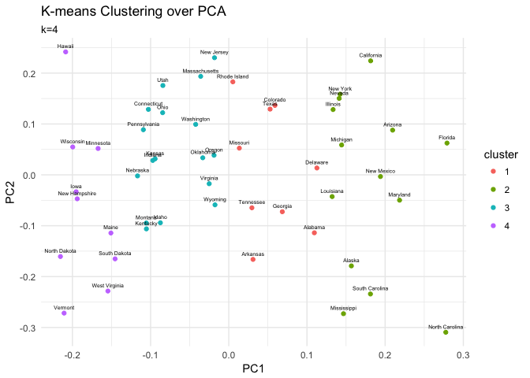

In this case, all 50 states are classified into 4 distinct subgroups. According to the first principle component, which emphasized the overall rates of serious crimes, this classification (from left purplr to the right green) reflects the criminal rate from the lower to higher. In the cluster 4 (purple subgroup), Vermont, North Dakota have the lowest criminal rate across all the 50 states, while in the cluster 2 (yellowish green subgroup), the states like Florida, Califonia have the highest criminal rates. In addition, the states in green subgroup (cluster 3) and red subgroup (cluster 1) have rather similar criminal rates, when only considering the firtst priniciple component.

### 4) Perform \(K\)-means clustering with \(K=3\). Plot the observations on the first and second principal components and color-code each state based on their cluster membership. Describe your results.

``` r
set.seed(1234)


# But finally I found the autoplot is the much easier way to do this job. 
autoplot(kmeans(usar[, 2:5], 3), data = usar) +
  geom_text(vjust=-1, label=usar$State, size = 1.8) +
  labs(title = 'K-means Clustering over PCA',
       subtitle = 'k=3')
```

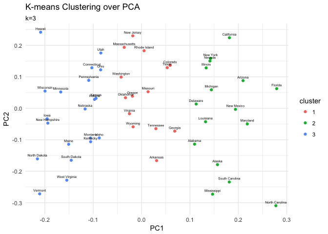

In this case, all 50 states are classified into 3 distinct subgroups. According to the first principle component, which emphasized the overall rates of serious crimes, this classification (from left blue to the right green) reflects the criminal rate from the lower to higher. In the cluster 3 (blue subgroup), Vermont, North Dakota have the lowest criminal rate across all the 50 states, while in the cluster 2 (green subgroup), the states like Florida, Califonia have the highest criminal rates. In addition, the criminal rates of the states in red subgroup (cluster 1), like, New Jersey, Arkansas, and so on, are not so radical as the cluster 2 and 3.

### 5) Perform \(K\)-means clustering with \(K=3\) on the first two principal components score vectors, rather than the raw data. Describe your results and compare them to the clustering results with \(K=3\) based on the raw data.

``` r
set.seed(1234)

# k-means clustering
autoplot(kmeans(usar[, 2:5], 3), data = usar, loadings = TRUE, loadings.colour = 'black') +
  geom_text(vjust=-1, label=usar$State, size = 1.8) +
  labs(title = 'K-means Clustering over PCA',
       subtitle = 'k=3')
```

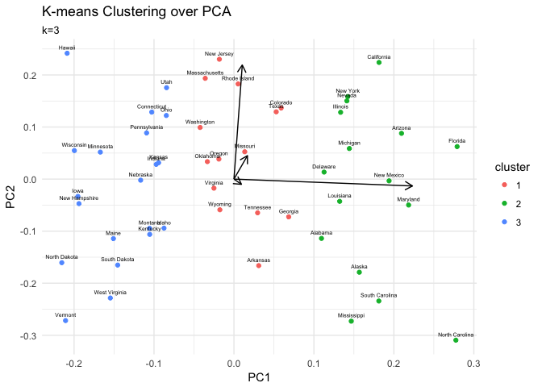

``` r
# k-means clustering over each two variables for raw data:

p1<-data_frame(x1= usar$Murder, x2=usar$Assault)
p2<-data_frame(x1= usar$Murder, x2=usar$UrbanPop) 
p3<-data_frame(x1= usar$Murder, x2=usar$Rape)
p4<-data_frame(x1= usar$Assault, x2=usar$UrbanPop)
p5<-data_frame(x1= usar$Assault, x2=usar$Rape)
p6<-data_frame(x1= usar$UrbanPop, x2=usar$Rape)


p1.out<-p1 %>%
  mutate(k3 = kmeans (p1, 3, nstart = 20)[[1]]) %>%
  mutate(k3 = as.character(k3)) %>%
  ggplot (aes (x1, x2, color = k3))+
  geom_point()+
  theme_bw()+
  labs (x="Murder", y ="Assault")


p2.out<-p2 %>%
  mutate(k3 = kmeans (p2, 3, nstart = 20)[[1]]) %>%
  mutate(k3 = as.character(k3)) %>%
  ggplot (aes (x1, x2, color = k3))+
  geom_point()+
  theme_bw()+
  labs (x="Murder", y ="UrbanPop")


p3.out<-p3 %>%
  mutate(k3 = kmeans (p3, 3, nstart = 20)[[1]]) %>%
  mutate(k3 = as.character(k3)) %>%
  ggplot (aes (x1, x2, color = k3))+
  geom_point()+
  theme_bw()+
  labs (x="Murder", y ="Rape")

p4.out<-p4 %>%
  mutate(k3 = kmeans (p4, 3, nstart = 20)[[1]]) %>%
  mutate(k3 = as.character(k3)) %>%
  ggplot (aes (x1, x2, color = k3))+
  geom_point()+
  theme_bw()+
  labs (x="Assault", y ="UrbanPop")

p5.out<-p5 %>%
  mutate(k3 = kmeans (p5, 3, nstart = 20)[[1]])  %>%
  mutate(k3 = as.character(k3)) %>%
  ggplot (aes (x1, x2, color = k3))+
  geom_point()+
  theme_bw()+
  labs (x="Assault", y ="Rape")

p6.out<-p6 %>%
  mutate(k3 = kmeans (p6, 3, nstart = 20)[[1]])  %>%
  mutate(k3 = as.character(k3)) %>%
  ggplot (aes (x1, x2, color = k3))+
  geom_point()+
  theme_bw()+
  labs (x="UrbanPop", y ="Rape")


grid.arrange(p1.out,p2.out,p3.out,p4.out,p5.out,p6.out, ncol = 3, nrow = 2 )
```

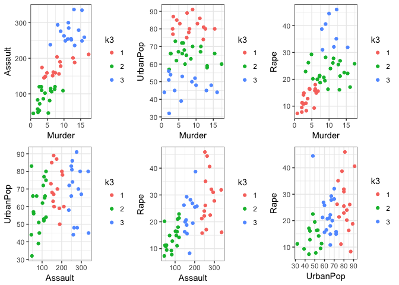

As shown above, if plotting the k-means clustering on the raw data, we need 6 combinations of each two variables from total 4 variables. Compred to the PCA approach, it is rather difficult to interpret the clusterings on 6 sub-plots. In addition, we do not know which combinations are really statistically significant, and therefore we do not know which clustering represents the major feature of this data structure. On the other hand, by performing the PCA, the dimension of the data has been reduced. It is rather easy and convient to interpret the data in the first two principle component vectors. As what we have done in the above analysis, we find the Assualt, Rape and Murder cand be viewd together as in the same component vector, while the UrbanPop as the second principle component, representing the unbarnization. This dimension reduction make our intepretation for the clustering much easier than that on the raw data.

### 6) Using hierarchical clustering with complete linkage and Euclidean distance, cluster the states.

``` r
set.seed(1234)
# estimate hierarchical cluster

dd <- dist(usar[, 2:5], method = "euclidean")
hc <- hclust(dd, method = "complete")
hcdata <- dendro_data (hc)
hclabs <- label(hcdata) %>%
  left_join (data_frame (label = as.factor (seq.int(nrow(usar))),
                         cl = as.factor (usar$State)))
```

    ## Joining, by = "label"

``` r
ggdendrogram(hc, labels =FALSE) +
  geom_text(data = hclabs,
            aes(label = cl, x = x, y = 0),
            hjust = 0.5, vjust=-0.1, angle = 90, size = 2.0) +
  theme(axis.text.x = element_blank(),
        legend.position = "none") +
  labs(title = "Hierarchical clustering",
       subtitle = "With complete linkage and Euclidean distance")
```

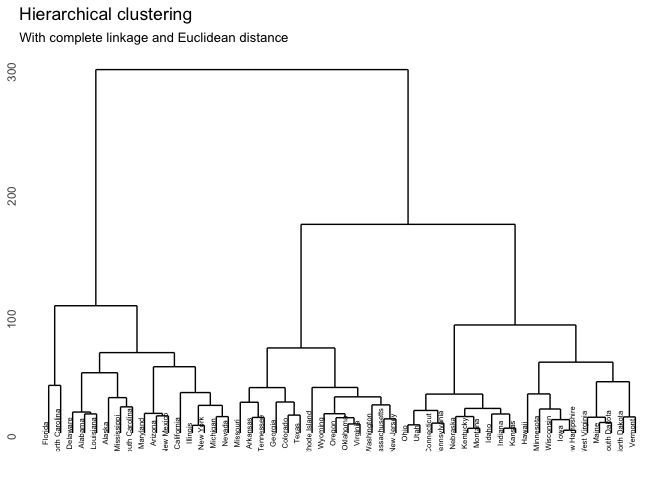

By using hierarchical clustering with complete linkage and Euclidean distance, the 50 states have been clustered as above. Each leaf of the dendrogram represents one of the 50 observations of states. However, as we move up the tree, some leaves begin to fuse into branches. These correspond to observations that are similar to each other. As we move higher up the tree, branches themselves fuse, either with leaves or other branches. The earlier (lower in the tree) fusions occur, the more similar the groups of observations are to each other. On the other hand, observations that fuse later (near the top of the tree) can be quite different. The height of this fusion, as measured on the vertical axis, indicates how different the two observations are. Thus, observations that fuse at the very bottom of the tree are quite similar to each other, whereas observations that fuse close to the top of the tree will tend to be quite different.

### 7) Cut the dendrogram at a height that results in three distinct clusters. Which states belong to which clusters?

``` r
set.seed(1234)
# estimate hierarchical cluster with cutting at height =3


hclabs <- label(hcdata) %>%
  left_join (data_frame (label = as.factor (seq.int(nrow(usar))),
                         state = as.factor (usar$State),
                         cl = as.factor(cutree(hc, h = 150))))
```

    ## Joining, by = "label"

``` r
ggdendrogram(hc, labels =FALSE) +
  geom_text(data = hclabs,
            aes(label = state, x = x, y = 0, color = cl),
            hjust = 0.5, vjust=-0.1, angle = 90, size = 2.0) +
  theme(axis.text.x = element_blank(),
        legend.position = "none") +
  geom_hline(yintercept = 150, linetype = 2) +
  labs(title = "Hierarchical clustering",
       subtitle = "With complete linkage and Euclidean distance")
```

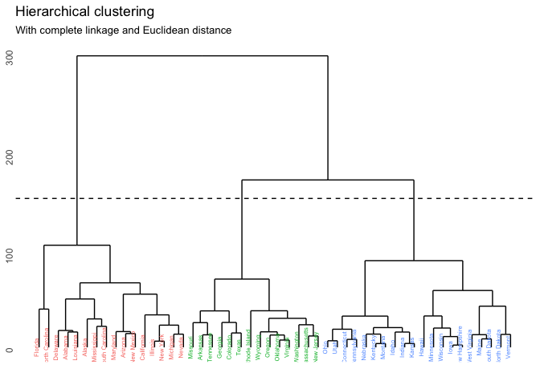

``` r
sum<- data_frame ( "group "= c("red","green","blue"),
            "States" = c(paste ((hclabs %>% select (state, cl) %>% filter (cl == 1))$state, collapse=', '),
                         paste ((hclabs %>% select (state, cl) %>% filter (cl == 2))$state, collapse=', '),
                         paste ((hclabs %>% select (state, cl) %>% filter (cl == 3))$state, collapse=', ')))

pander (sum)
```

<table style="width:53%;">
<colgroup>
<col width="11%" />
<col width="41%" />
</colgroup>
<thead>
<tr class="header">
<th align="center">group</th>
<th align="center">States</th>
</tr>
</thead>
<tbody>
<tr class="odd">
<td align="center">red</td>
<td align="center">Florida, North Carolina, Delaware, Alabama, Louisiana, Alaska, Mississippi, South Carolina, Maryland, Arizona, New Mexico, California, Illinois, New York, Michigan, Nevada</td>
</tr>
<tr class="even">
<td align="center">green</td>
<td align="center">Missouri, Arkansas, Tennessee, Georgia, Colorado, Texas, Rhode Island, Wyoming, Oregon, Oklahoma, Virginia, Washington, Massachusetts, New Jersey</td>
</tr>
<tr class="odd">
<td align="center">blue</td>
<td align="center">Ohio, Utah, Connecticut, Pennsylvania, Nebraska, Kentucky, Montana, Idaho, Indiana, Kansas, Hawaii, Minnesota, Wisconsin, Iowa, New Hampshire, West Virginia, Maine, South Dakota, North Dakota, Vermont</td>
</tr>
</tbody>
</table>

In this section, I found that the cut height at 150 can divide the data into three distinct subforups.Each subgroup is summaried in the above table. Indeed, we can find this classification result is very similar to that of the PCA/k-means clustering approach (k=3).Florida, Carolina, Nevad in the red group are those states with higher criminal rates, while the states, like North Dakota, Vermont, in the blue group are those states with lower criminal rates by the PCA/k-means clustering approah.

### 8) Hierarchically cluster the states using complete linkage and Euclidean distance, after scaling the variables to have standard deviation \(1\). What effect does scaling the variables have on the hierarchical clustering obtained? In your opinion, should the variables be scaled before the inter-observation dissimilarities are computed? Provide a justification for your answer.

``` r
set.seed(1234)
# estimate hierarchical cluster

dd_scale <- dist(scale(usar[, 2:5]), method = "euclidean") 
hc_scale <- hclust(dd_scale, method = "complete")
hcdata2 <- dendro_data (hc_scale)

hclabs2 <- label(hcdata2) %>%
  left_join (data_frame (label = as.factor (seq.int(nrow(usar))),
                         state = as.factor (usar$State),
                         cl = as.factor(cutree(hc_scale , h = 4.41))))
```

    ## Joining, by = "label"

``` r
g2<-ggdendrogram(hc_scale, labels =FALSE) +
  geom_text(data = hclabs2,
            aes(label = state, x = x, y = 0, color = cl),
            hjust = 0.5, vjust=-0.1, angle = 90, size = 2.0) +
  theme(axis.text.x = element_blank(),
        legend.position = "none") +
  geom_hline(yintercept = 4.41, linetype = 2) +
  labs(title = "Hierarchical clustering After Scaling",
       subtitle = "With complete linkage and Euclidean distance")

g1<-ggdendrogram(hc, labels =FALSE) +
  geom_text(data = hclabs,
            aes(label = state, x = x, y = 0, color = cl),
            hjust = 0.5, vjust=-0.1, angle = 90, size = 2.0) +
  theme(axis.text.x = element_blank(),
        legend.position = "none") +
  geom_hline(yintercept = 150, linetype = 2) +
  labs(title = "Hierarchical clustering",
       subtitle = "With complete linkage and Euclidean distance")

grid.arrange(g1,g2, ncol = 2, nrow = 1 )
```

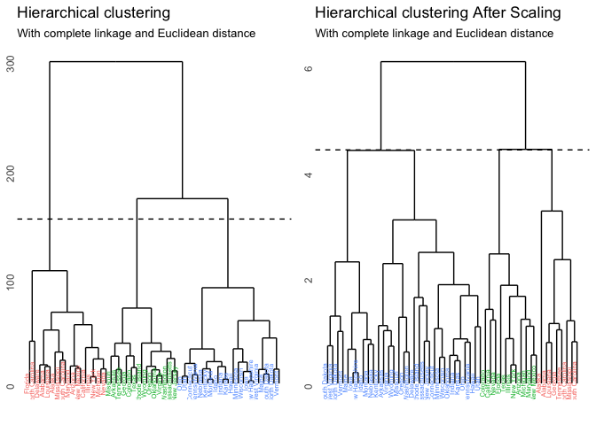

By performing the scaling of the varaibles before the inter-observation dissimilarity computed, we can see how different the plot will be (shown in the above panel, left: without scaling; right: with scaling). Yes, there is very strong effect on the computation of dissimilarity after scaling. In hierarchical clustering after scaling, I also cluster states into 3 distinct subgroups, by the height of cut as 4.41, much smaller than that in the clustering without scaling (cut = 150). There are several key influences on the clustering after scaling: 1) the height of tree is shorteed after scaling; and 2) appearingly, the inner structure of the scaled data is much more complicated (more branches than that without scaling).

Theoretically, if the variables are scaled to have standard deviation one before the inter-observation dissimilarities are computed, then each variable will in effect be given equal importance in the hierarchical clustering performed. In my opinion, it is not very good to do the scaling before the hierarchical clustering in our case.Because through PCA, we have seen the four variables have different importnace: three variables of criminal rate are viewed as the first principle component, while the urbanization variable is viewed as the second principle component. If performing the scaling, we standardize the importance of all four variables, and that is the reason why in the hierarchical clustering with scaling (shown as above) , the inner strucutre is more complated and it is not easier to distinguish out the subgroups than in the hierarchical clustering without scaling. Also, as I have mentioned that the hierarchical clustering without scaling can provide very similar and compatible divided subgroups as in the PCA/k-means clustering method. Nevertheless, hierarchical clustering with scaling give rather different result from the PCA/k-means clustering method, which also indicates in our case, it is not so good to perform the scaling before the computation of dissimilarity.
