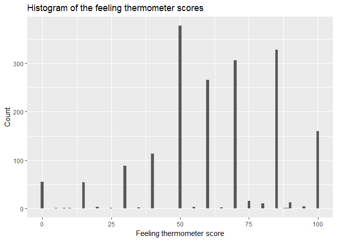

Bobae's PS 5 for MACS 30100 - Perspectives on Computational Modeling
================
Bobae Kang
February 13, 2017

This is an R Markdown document for Perspectives on Computational Modeling course Problem Set 5. In this exercise, I will perform some linear regression analyses of `biden.csv` data, which contains a selection of variables from the [2008 American National Election Studies survey](http://www.electionstudies.org/) that allow you to test competing factors that may influence attitudes towards Joe Biden. The variables are coded as follows:

-   `biden` - feeling thermometer ranging from 0-100
-   `female` - 1 if respondent is female, 0 if respondent is male
-   `age` - age of respondent in years
-   `dem` - 1 if respondent is a Democrat, 0 otherwise
-   `rep` - 1 if respondent is a Republican, 0 otherwise
-   `educ` - number of years of formal education completed by respondent
-   `17` - 17+ years (aka first year of graduate school and up)

Describe the data (1 point)
===========================

The following histogram provides an illustration of the data. First of all, the overall shape of the histogram, which is skewed to the left, suggests that people generally have positive (or warm) feeling toward Biden. However, the thermometer score of 50 has the highest count, indicating that many respondents (more than one sixth of all) still feel neutral toward Biden despite the general positive feeling toward him. Additionally, the histogram, with its `binwidth` set to `1`, shows that most people's answers converged on a small set of numbers (notably the multiples of 5) rather than distributed throughout all the possible scores. 

Simple linear regression
========================

Let's try a simple linear regression, where age(*X*1), the intercept(*β*0), the coefficient for age(*β*1) are the exogenous variables and the feeling thermometer score for Biden(*Y*) is the enogenous variable. *β*0 and *β*1 are parameters of this linear regression. The result suggests that *β*1 is 0.06241, which means that every increase in age by 1 is correlated with an increase in Biden's feeling thermometer score by 0.06241. Therefore, the relationship between `biden` and `age` is positive. However, the relatively hight p-value, 0.0563, suggests that the coefficient is not statistically significant. In addition, the model's *R*2 value is 0.002018, which means that the variable of `age` explains only about 0.2% of the variation of `biden`. Therefore, the model is doing a poor job.

    ## 
    ## Call:
    ## lm(formula = biden ~ age, data = data)
    ## 
    ## Residuals:
    ##     Min      1Q  Median      3Q     Max 
    ## -64.876 -12.318  -1.257  21.684  39.617 
    ## 
    ## Coefficients:
    ##             Estimate Std. Error t value Pr(>|t|)    
    ## (Intercept) 59.19736    1.64792   35.92   <2e-16 ***
    ## age          0.06241    0.03267    1.91   0.0563 .  
    ## ---
    ## Signif. codes:  0 '***' 0.001 '**' 0.01 '*' 0.05 '.' 0.1 ' ' 1
    ## 
    ## Residual standard error: 23.44 on 1805 degrees of freedom
    ## Multiple R-squared:  0.002018,   Adjusted R-squared:  0.001465 
    ## F-statistic: 3.649 on 1 and 1805 DF,  p-value: 0.05626

The following shows the predicted `biden` value for a 45-year-old person, with the 95% confidence interval.

    ##   age .fitted   .se.fit     ymin     ymax
    ## 1  45 62.0056 0.5577123 60.91248 63.09872

The follwoing is a plot of the response and predictor, with the least squares regression line. 

Multiple linear regression 1
============================

The second linear regression uses the same response variable, `biden`, and the following two more predictors in addition to `age`: `female` and `educ`. The result of this new model suggests that the coefficients for `female` and `educ` are statistically significant; the p-values for these three coefficients are all smaller than 0.001. The estimated value of *β*2 is `6.19607`. In other words, controlling for age and education level, being female leads to an increase in Biden's feeling thermometer score by, on average, 6.19607 units. The *R*2 score indicates that the three predictors, together, explains about 2.7% of the variation in `biden`. Also, the adjusted *R*2 score for this model is `0.025`. Therefore, the current model is better than the previous, `age`-only model.

    ## 
    ## Call:
    ## lm(formula = biden ~ age + female + educ, data = data)
    ## 
    ## Residuals:
    ##     Min      1Q  Median      3Q     Max 
    ## -67.084 -14.662   0.703  18.847  45.105 
    ## 
    ## Coefficients:
    ##             Estimate Std. Error t value Pr(>|t|)    
    ## (Intercept) 68.62101    3.59600  19.083  < 2e-16 ***
    ## age          0.04188    0.03249   1.289    0.198    
    ## female       6.19607    1.09670   5.650 1.86e-08 ***
    ## educ        -0.88871    0.22469  -3.955 7.94e-05 ***
    ## ---
    ## Signif. codes:  0 '***' 0.001 '**' 0.01 '*' 0.05 '.' 0.1 ' ' 1
    ## 
    ## Residual standard error: 23.16 on 1803 degrees of freedom
    ## Multiple R-squared:  0.02723,    Adjusted R-squared:  0.02561 
    ## F-statistic: 16.82 on 3 and 1803 DF,  p-value: 8.876e-11

The follwoing plot for the current model also illustrates three different smooth fit lines. Two of the smooth fit lines indicate that being affiliated with the Republican party and the Democratic party are systematically different from 0. This is an indication that party affiliation may have some additional explanatory power with respect to the variation in `biden`.

    ## `geom_smooth()` using method = 'loess'
    ## `geom_smooth()` using method = 'loess'
    ## `geom_smooth()` using method = 'loess'

Multiple linear regression 2
============================

The second linear regression uses the same response variable, `biden`, and the following four more predictors in addition to `age`: `female`, `educ`, `dem` and `rep`. The result of this new model suggests that the coefficients for `female`, `dem`, and `rep` are statistically significant; the p-values for these three coefficients are all smaller than 0.001. The estimated value of *β*2 is now 4.1023, which is less than by the previous estimate, 6.19607. The *R*2 value of the model is 0.2815 and the adjusted *R*2 value is 0.2795. The now exaplains about 28% of the variation in `biden`, which makes it better than the previous model.

    ## 
    ## Call:
    ## lm(formula = biden ~ age + female + educ + dem + rep, data = data)
    ## 
    ## Residuals:
    ##     Min      1Q  Median      3Q     Max 
    ## -75.546 -11.295   1.018  12.776  53.977 
    ## 
    ## Coefficients:
    ##              Estimate Std. Error t value Pr(>|t|)    
    ## (Intercept)  58.81126    3.12444  18.823  < 2e-16 ***
    ## age           0.04826    0.02825   1.708   0.0877 .  
    ## female        4.10323    0.94823   4.327 1.59e-05 ***
    ## educ         -0.34533    0.19478  -1.773   0.0764 .  
    ## dem          15.42426    1.06803  14.442  < 2e-16 ***
    ## rep         -15.84951    1.31136 -12.086  < 2e-16 ***
    ## ---
    ## Signif. codes:  0 '***' 0.001 '**' 0.01 '*' 0.05 '.' 0.1 ' ' 1
    ## 
    ## Residual standard error: 19.91 on 1801 degrees of freedom
    ## Multiple R-squared:  0.2815, Adjusted R-squared:  0.2795 
    ## F-statistic: 141.1 on 5 and 1801 DF,  p-value: < 2.2e-16

The follwoing plot is for the new multiple regression model with five predictors. The plot illustrates that there are three residual clusters, each of which nicely corresponds to each party affiliation (Democrat, Republican and Other). Each smooth fit line shows systematicl difference from 0 to a much less extent. To the same extent, the current model 'fixes' the problem the previous model had.

    ## `geom_smooth()` using method = 'loess'
    ## `geom_smooth()` using method = 'loess'
    ## `geom_smooth()` using method = 'loess'

Interactive linear regression
=============================

In this model, we are only useing the observations that are either Democrats or Republicans. The current interactive linear regression model has four parameters: *X*0 (intercept), *X*1 (coefficient for `female`), *X*2 (coefficient for `dem`), and *X*3 (coefficient for the interaction term). The estimated value of *X*0 is 39.382 and the standard error is 1.455. The estimated value of *X*1 is 6.395 and is statistically significant with the p-value = 0.00157. Its standard error is 2.018. The estimated value of *X*2 is 33.688 and is statistically significant with the p-value &lt; 2e-16. Its standard error is 1.835. The estimated value of *X*3 is -3.946 and is not statistically significant with the p-value = 0.11065. Its standard error is 2.472.

    ## 
    ## Call:
    ## lm(formula = biden ~ female * dem, data = data_int)
    ## 
    ## Residuals:
    ##     Min      1Q  Median      3Q     Max 
    ## -75.519 -13.070   4.223  11.930  55.618 
    ## 
    ## Coefficients:
    ##             Estimate Std. Error t value Pr(>|t|)    
    ## (Intercept)   39.382      1.455  27.060  < 2e-16 ***
    ## female         6.395      2.018   3.169  0.00157 ** 
    ## dem           33.688      1.835  18.360  < 2e-16 ***
    ## female:dem    -3.946      2.472  -1.597  0.11065    
    ## ---
    ## Signif. codes:  0 '***' 0.001 '**' 0.01 '*' 0.05 '.' 0.1 ' ' 1
    ## 
    ## Residual standard error: 19.42 on 1147 degrees of freedom
    ## Multiple R-squared:  0.3756, Adjusted R-squared:  0.374 
    ## F-statistic:   230 on 3 and 1147 DF,  p-value: < 2.2e-16

The following then illustrates how gender and bipartisanship related to each other with respect to the feeling thermometer score, with the 95% confidence intervals. The result shows that the feeling thermometer score is the lowest for male Republicans (39.38202 on average) and the highest for female Democrats (75.51883 on average). For both Democrats Republicans, on average, being female leads to a small increase in feeling thermometer score. However, in case of Democrats, the difference is within the 95% confidence interval and therefore not statistically significant. For both females and males, on average, being Democrats lead to a noticable increase in feeling thermometer score.

    ##   female dem  .fitted   .se.fit     ymin     ymax
    ## 1      0   0 39.38202 1.4553632 36.52951 42.23453
    ## 2      0   1 73.06954 1.1173209 70.87959 75.25949
    ## 3      1   0 45.77720 1.3976638 43.03778 48.51662
    ## 4      1   1 75.51883 0.8881114 73.77813 77.25953
