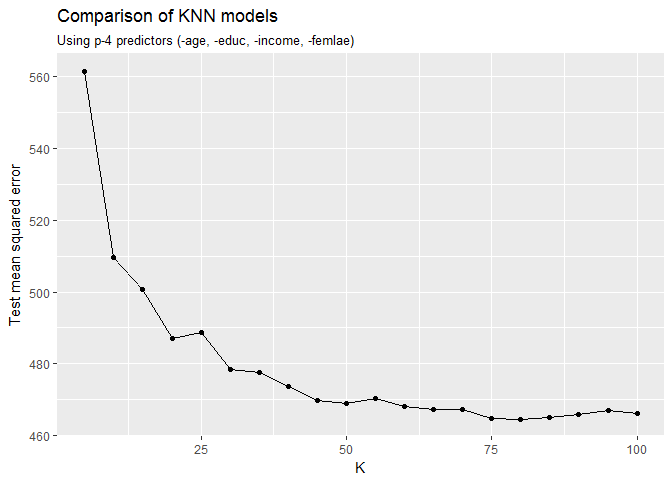

Problem set \#9: Nonparametric methods and unsupervised learning
================
Bobae Kang
March 13, 2017

-   [Part 1. Attitudes towards feminists](#part-1.-attitudes-towards-feminists)
    -   [Test MSE for KNN models](#test-mse-for-knn-models)
    -   [Test MSE for weighted KNN model](#test-mse-for-weighted-knn-model)
    -   [Comparison of KNN/weighted KNN to other models](#comparison-of-knnweighted-knn-to-other-models)
-   [Part 2. Voter turnout and depression](#part-2.-voter-turnout-and-depression)
    -   [Test error rate for KNN models](#test-error-rate-for-knn-models)
    -   [Test error rate for weighted KNN models](#test-error-rate-for-weighted-knn-models)
    -   [Comparison of KNN/weighted KNN to other models](#comparison-of-knnweighted-knn-to-other-models-1)
-   [Part 3. Colleges](#part-3.-colleges)
    -   [Principal component analysis](#principal-component-analysis)
    -   [Plot](#plot)
-   [Part 4. Clustering states](#part-4.-clustering-states)
    -   [Principal component analysis](#principal-component-analysis-1)
    -   [K-means clustering (k=2)](#k-means-clustering-k2)
    -   [K-means clustering (k=4)](#k-means-clustering-k4)
    -   [K-means clustering (k=3)](#k-means-clustering-k3)
    -   [K-means clustering (k=3, on principal component score vectors)](#k-means-clustering-k3-on-principal-component-score-vectors)
    -   [Hierarchical clustering](#hierarchical-clustering)
    -   [Hierarchical clustering, after scaling](#hierarchical-clustering-after-scaling)

Part 1. Attitudes towards feminists
===================================

Test MSE for KNN models
-----------------------

In this section, I try different sets of predictors to find a KNN model with the least score for test mean squared error (MSE).

First, I use all *p* predictors with *k* = 5, 10, 15, ..., 100. I find that the model with *k* = 85 has the lowest test MSE (503.87). The following plot shows the MSE scores of models with different *k* values. Also, the table below shows the three of the KNN models sorted by test MSE scores:

|    k|     mse|
|----:|-------:|
|   85|  503.87|
|  100|  504.58|
|   70|  504.77|

------------------------------------------------------------------------

Then I fit KNN models with *p* − 1 predictors. Among different sets of *p* − 1 predictors,the model using all predictors but `age` with *k* = 45, gives the least test MSE score. The following plot compares the MSE scores of all-but-`age` models with different *k* values. Also, the table below shows the three of the KNN models sorted by test MSE scores:

|    k|     mse|
|----:|-------:|
|   45|  488.02|
|   70|  488.15|
|   30|  488.94|

------------------------------------------------------------------------

KNN models with *p* − 2 predictors. After trying many different sets of *p* − 2 predictors, I find that and the model using all predictors but `age` and `educ`, with *k* = 35, gives the least test MSE score. The following plot shows the MSE scores of models with different *k* values. Also, the table below shows the three of the KNN models sorted by test MSE scores:

|    k|     mse|
|----:|-------:|
|   35|  464.57|
|   25|  464.95|
|   30|  465.25|

------------------------------------------------------------------------

KNN models with *p* − 3 predictors. After trying many different sets of *p* − 2 predictors, I find that the model excluding `age`, `educ` and `income` variables, with *k* = 35, gives the least test MSE score (464.54). The following plot shows the MSE scores of models with different *k* values. Also, the table below shows the three of the KNN models sorted by test MSE scores:

|    k|     mse|
|----:|-------:|
|   80|  464.54|
|   75|  464.80|
|   85|  465.07|

------------------------------------------------------------------------

KNN models with *p* − 4 predictors. After trying many different sets of *p* − 4 predictors, I find that the model excluding `age`, `educ`, `income` and `female` variables, with *k* = 25, gives the least test MSE score (476.55). The following plot shows the MSE scores of models with different *k* values. Also, the table below shows the three of the KNN models sorted by test MSE scores:

|    k|     mse|
|----:|-------:|
|   25|  467.55|
|   30|  468.49|
|   20|  474.90|

However, the least test MSE score with *p* − 4 KNN models is still greater than the least test MSE score with *p* − 3 KNN models. Therefore, I will use all predictors except `age`, `educ` and `income` for modeling for the rest of the Part 1.

Test MSE for weighted KNN model
-------------------------------

Then, I fit a weighted KNN model using the same combination of predictors as the previous KNN model with the least test MSE.

The weighted KNN model with *k* = 45 gives the least test MSE (475.24). The following plot shows the MSE scores of models with different *k* values. Also, the table belowe three the five of the KNN models sorted by test MSE scores:

|    k|     mse|
|----:|-------:|
|   45|  475.24|
|   30|  476.77|
|   35|  477.36|

Comparison of KNN/weighted KNN to other models
----------------------------------------------

Let's compare the KNN and weighted KNN models with other models. Using the same set of predictors, I fit the following models:

-   Linear regression
-   Decision tree
-   Boosting (with 5000 trees)
-   Random forest (with 5000 trees)

The following table summarizes the MSE scores of all fitted models:

| Models            |     MSE|
|:------------------|-------:|
| KNN               |  464.54|
| Boosting          |  466.83|
| Linear regression |  466.92|
| Random Forest     |  468.36|
| Decision tree     |  469.88|
| Weighted KNN      |  475.24|

The table shows that the KNN model has the lowest MSE of all (464.54).

Part 2. Voter turnout and depression
====================================

Test error rate for KNN models
------------------------------

In this section, I try different sets of predictors to find a KNN model with the least score for test error rate.

First, I use all *p* predictors with *k* = 1, 2, 3, ..., 10. The model with *k* = 9 gives the least test error rate (0.327). The following plot shows the error rates of models with different *k* values. Also, the table belowe three the five of the KNN models sorted by test error rates:

|    k|  err.rate|
|----:|---------:|
|    9|   0.32665|
|    3|   0.33524|
|    8|   0.33811|

------------------------------------------------------------------------

KNN models with *p* − 1 predictors. After trying different sets of *p* − 1 predictors, I find that the model using all predictors but `mhealth_sum`, with *k* = 1, gives the least test error rate (0.120). The following plot shows the error rates of models with different *k* values. Also, the table belowe three the five of the KNN models sorted by test error rates:

|    k|  err.rate|
|----:|---------:|
|    1|   0.12034|
|    6|   0.12607|
|    3|   0.12894|

------------------------------------------------------------------------

KNN models with *p* − 2 predictors. After trying different sets of *p* − 2 predictors, I find that the model using all predictors but `mhealth_sum` and `inc10`, with *k* = 9, gives the least test error rate (0.258). The following plot shows the error rates of models with different *k* values. Also, the table belowe three the five of the KNN models sorted by test error rates:

|    k|  err.rate|
|----:|---------:|
|    9|   0.25788|
|    8|   0.26074|
|    7|   0.26361|

We observe that the least possible test error rate with *p* − 2 KNN models is still greater than the least test MSE score with *p* − 1 KNN models. Therefore, I will use all predictors except `mhealth_sum` for modeling for the rest of the Part 2.

Test error rate for weighted KNN models
---------------------------------------

Then, I fit a weighted KNN model using the same combination of predictors as the previous KNN model with the least test error rate.

The weighted KNN model with *k* = 9 gives the least test error rate (0.309). The following plot shows the error rates of models with different *k* values. Also, the table belowe three the five of the KNN models sorted by test error rates:

|    k|  err.rate|
|----:|---------:|
|    9|   0.30946|
|    7|   0.31232|
|    5|   0.31519|

Comparison of KNN/weighted KNN to other models
----------------------------------------------

Let's compare the KNN and weighted KNN models with other models. Using the same set of predictors, I fit the following models:

-   Logistic regression
-   Decision tree
-   Boosting (with 5000 trees)
-   Random forest (with 5000 trees)

The following table summarizes the error rates of all fitted models sorted by test error rates:

| Models              |  Err.rate|
|:--------------------|---------:|
| KNN                 |   0.12034|
| SVM                 |   0.26648|
| Boosting            |   0.26934|
| Logistic regression |   0.27819|
| Decision tree       |   0.30372|
| Weighted KNN        |   0.30946|
| Random Forest       |   1.00000|

The table shows that the KNN model has the lowest test error rate of all (0.120).

Part 3. Colleges
================

Principal component analysis
----------------------------

In this Part, I perform principal component analysis of `college` dataset. The maximum possible number of principal components for the current dataset is 18, which is to the number of total variables. The below shows the first five principal components and how they relate to the original variables.

|             |       PC1|       PC2|       PC3|       PC4|       PC5|
|-------------|---------:|---------:|---------:|---------:|---------:|
| Private     |  -0.08901|   0.34588|  -0.15139|  -0.23113|   0.04429|
| Apps        |  -0.19963|  -0.34362|  -0.00482|  -0.30501|  -0.02297|
| Accept      |  -0.15380|  -0.37256|   0.02535|  -0.31749|   0.03144|
| Enroll      |  -0.11780|  -0.39970|   0.02758|  -0.20484|  -0.06567|
| Top10perc   |  -0.36035|   0.01624|  -0.00468|   0.10752|  -0.38823|
| Top25perc   |  -0.34475|  -0.01773|   0.05895|   0.14626|  -0.40981|
| F.Undergrad |  -0.09409|  -0.41073|   0.01681|  -0.14303|  -0.04659|
| P.Undergrad |   0.01748|  -0.29306|  -0.14937|   0.09777|   0.32797|
| Outstate    |  -0.32766|   0.19152|  -0.06636|  -0.12880|   0.20325|
| Room.Board  |  -0.26653|   0.09398|  -0.18211|  -0.18243|   0.52626|
| Books       |  -0.05719|  -0.05734|  -0.66231|   0.08930|  -0.15856|
| Personal    |   0.07190|  -0.19276|  -0.46956|   0.29064|  -0.18799|
| PhD         |  -0.30325|  -0.11619|   0.20849|   0.46459|   0.20595|
| Terminal    |  -0.30387|  -0.10419|   0.14672|   0.46040|   0.26556|
| S.F.Ratio   |   0.21026|  -0.20440|   0.29225|   0.07490|  -0.05154|
| perc.alumni |  -0.23666|   0.19406|   0.15944|  -0.01000|  -0.21514|
| Expend      |  -0.33301|   0.07029|  -0.21732|  -0.00720|   0.05709|
| Grad.Rate   |  -0.27309|   0.11783|   0.17262|  -0.26820|  -0.14119|

Plot
----

Now I plot the observations in `college` data on the first and second principal components. The red arrows illustrate the loadings of both principal components. As shown in the table above as well as the plot below, the following predictors are strongly correlated with the first principal component (horizontal axis): `Top10perc`, `Top25perc`, `Expend`, `Terminal`, `PhD`, and `Outstate`. On the other hand, the following perdictors are strongly correlated with the second principal component: `F.Undergrad`, `Enroll`, `Accept`, `Apps`, and `Private`.

Part 4. Clustering states
=========================

Principal component analysis
----------------------------

In this Part, I perform principal component analysis of `USArrests` dataset. The maximum possible number of principal components for the current dataset is four, which is to the number of total variables. The table below shows the all four principal components and how they relate to the original variables.

|          |       PC1|       PC2|       PC3|       PC4|
|----------|---------:|---------:|---------:|---------:|
| Murder   |  -0.53590|   0.41818|  -0.34123|   0.64923|
| Assault  |  -0.58318|   0.18799|  -0.26815|  -0.74341|
| UrbanPop |  -0.27819|  -0.87281|  -0.37802|   0.13388|
| Rape     |  -0.54343|  -0.16732|   0.81778|   0.08902|

The following figure plots the observations on the first and second principal components. The red arrows illustrate the loadings of both principal components. It is noticeable that the first principal component (horisontal axis) is largely related to the violent crime variables, namely `Murder`, `Assault` and `Rape`, while the second principal component (vertical axis) has much to do with `UrbanPop` variable. Roughly speaking, observations in the first quadrant are states with low violent crime rates observations and small urban population. The second quadrant contains states with high violent crime rates and small urban population. The thrid quadrant has states with high violent crime rates and large urban population. Lastly, states in the fourth quadrant have low violent crime rates and small urban population.

K-means clustering (k=2)
------------------------

Now I use K-means clustering with *k* = 2 and divide states into two clusters. The following plot shows that the K-means clustering divides the states into two groups approximately by their first principal component scores. In other words, overall, states that have negative scores on the first principal component are in one cluster and states that have positive scores on the first principal component are in the other cluster.

K-means clustering (k=4)
------------------------

How about four clusters? The following plot shows that the first principal component is still the most critical aspect with respect to dividing the observations into clusters. That is, the clusters are divided alongside the horisontal axis that is the first principal component.

K-means clustering (k=3)
------------------------

Now I try K-means clustering with *k* = 3. The following plot shows that, again, the first principal component is the most critical aspect with respect to clustering the observations.

K-means clustering (k=3, on principal component score vectors)
--------------------------------------------------------------

I try another K-means clustering with *k* = 3--this time, however, on the first two principal components score vectors, rather than the raw data. I observe that the new clusters are more clearly separated from one another. That is, some of the states that were near the border between two different clusters in the previous clustering now belong to the other side of the border. Examples of such states are: Georgia, Tennessee, Texas, Colorado Missouri, Ohio, Penssylvania, Connecticut, Hawaii, Indiana, Nebraska, Kansas, and Utah.

Hierarchical clustering
-----------------------

Now I apply hierarchical clustering to the current dataset with complete linkage and Euclidean distance. Observations that have smalle the pairwise differences are merged into a single cluster early in the process. At the end of the process, all observations are merged into a single cluster. As the plot shows, it is possible to choose different number of clusters based on the cutoff point.

For example, with the cutoff point at height = 150, we get three different clusters of states. In the following plot, the vertical dashed line marks the cutoff height. At the bottom of the dendrogram, state names are colored according to their membership in one of the three clusters.

Hierarchical clustering, after scaling
--------------------------------------

In the previous hierarchical clustering attempt, I have disregarded the fact that different variables are on different scales. This may result in disproportionately weighing the importance of each variable when the algorithm calcuates the pairwise dissimilarities between observations. More specifically, variables with larger range can outweight others with smaller range. The use of unscaled data, therefore, may misrepresent the actual contribution of each variable to the clustering of observations. To control for this, in this second attempt of hiearchical clustering, I first standardize the variables so that all variable have standard deviation of 1. The following dendrogram shows that the clustering of observations has changed significantly due to the scaling.

It is my view that standardizing variables to have the common scale is generally an improvement with respect to clustering based on pairwise dissimilarities. This is because, as I have stated above, scaling prevents certain variables that have singificantly larger variability than others merely due to the unit from distroting the clustering outcome.
