Problem set \#8: tree-based methods and support vector machines
================
Zhuo Leng

-   [Part 1: Sexy Joe Biden (redux times two) \[3 points\]](#part-1-sexy-joe-biden-redux-times-two-3-points)
-   [Question 1](#question-1)
-   [Question 2](#question-2)
-   [Question 3](#question-3)
-   [Question 4](#question-4)
-   [Question 5](#question-5)
-   [Question 6](#question-6)
-   [Part 2: Modeling voter turnout](#part-2-modeling-voter-turnout)
-   [Question 1](#question-1-1)
-   [Question 2](#question-2-1)
-   [model 1: linear model with all predictors](#model-1-linear-model-with-all-predictors)
-   [model3: raidal kernel](#model3-raidal-kernel)
-   [model4: linear kernel with importance varibales](#model4-linear-kernel-with-importance-varibales)
-   [model5: polynomial kernel SVM](#model5-polynomial-kernel-svm)
    -   [Part 3: OJ Simpson \[4 points\]](#part-3-oj-simpson-4-points)
-   [question1](#question1)
    -   [single tree](#single-tree)
    -   [question 2](#question-2-2)
    -   [Random forest](#random-forest)

Part 1: Sexy Joe Biden (redux times two) \[3 points\]
-----------------------------------------------------

Question 1
----------

Split the data into a training set (70%) and a validation set (30%). Be sure to set your seed prior to this part of your code to guarantee reproducibility of results.

Question 2
----------

Fit a decision tree to the training data, with biden as the response variable and the other variables as predictors. Plot the tree and interpret the results. What is the test MSE? Leave the control options for tree() at their default values

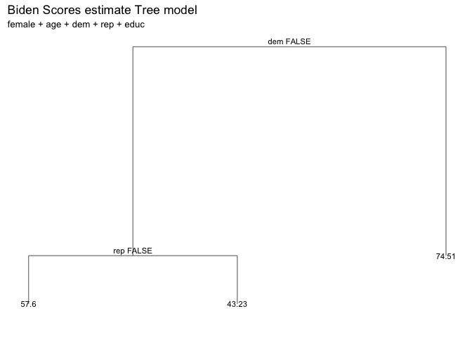

    ## [1] 406

By using the default tree controls, we use all variables for estimate tree model.

If the a person is democrat, the average biden scores is 74.51. If the 'dem' = (person is not democrat, the tree will go down to left node) Then, if the person is republican, the average biden scores is 43.23. If not, the tree will go to left node and the predicted value for biden score is 57.6

The test MSE is 406

Question 3
----------

3.Now fit another tree to the training data with the following control options: Use cross-validation to determine the optimal level of tree complexity, plot the optimal tree, and interpret the results. Does pruning the tree improve the test MSE? 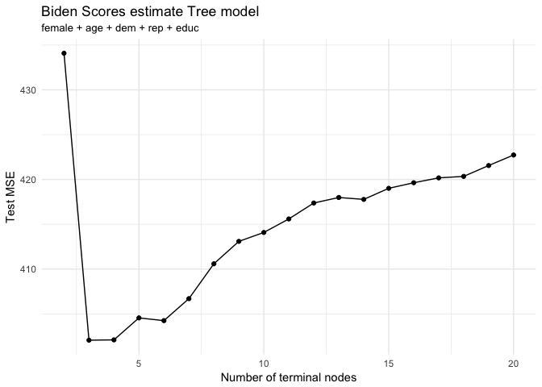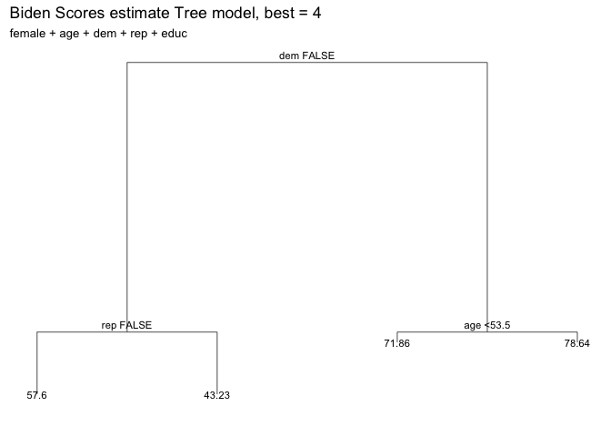

    ## [1] 407

Now, with the new control options, we fit a new tree model of biden data. By using 10-fold cross validation, we could notice when node = 3 or node = 4 could generate lowest MSE level. I use best = 4 in order to make the result more readable.

From the graph, we could know that among people are democrate, the predicted biden score for age &lt; 53.5 group is 71.86, and that for age &gt; 53.5 is 78.64

Among people are not democrate. if they are republicans, the predicted biden score is 43.23. Otherwise the biden average biden score is 57.6.

The rest MSE = 407, compare to MSE in first question, it has been improced. So the full model can be overfitting. However, the improvement is not that much, we still need to find out better model to fit the data.

Question 4
----------

Use the bagging approach to analyze this data. What test MSE do you obtain? Obtain variable importance measures and interpret the results.

    ## [1] 485

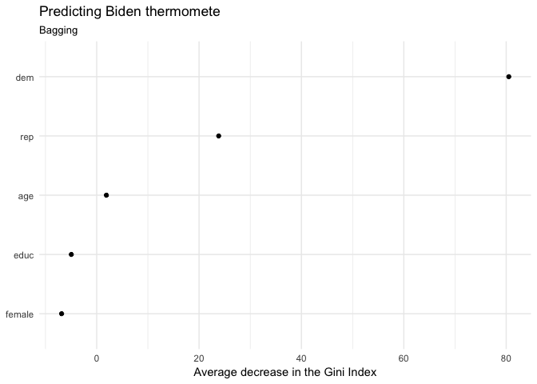 The mse of bagging model is 485, which is higher the the MSE in last part. So this model is not that fit the data. Also, we could know from the variable importance measures that de, and rep are teo most important predictors in this model.educ and gender are less importance

Question 5
----------

Use the random forest approach to analyze this data. What test MSE do you obtain? Obtain variable importance measures and interpret the results. Describe the effect of \(m\), the number of variables considered at each split, on the error rate obtained.

    ## [1] 408

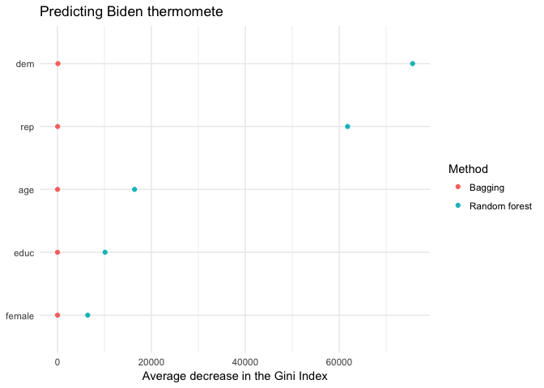

The mse for random forest decrease for this model. And also the variable importance plot indicates that dem and rep are two importance variables. and age, gender and educ are relatively unimportance.

Question 6
----------

Use the boosting approach to analyze the data. What test MSE do you obtain? How does the value of the shrinkage parameter \(\lambda\) influence the test MSE?

Part 2: Modeling voter turnout
------------------------------

Question 1
----------

Use cross-validation techniques and standard measures of model fit to compare and evaluate at least five tree-based models of voter turnout. Select the best model and interpret the results using whatever methods you see fit.

The first model I use is the default tree model with all variables.

    ## # A tibble: 1,165 <U+00D7> 8
    ##    vote96 mhealth_sum   age  educ  black female married inc10
    ##    <fctr>       <dbl> <dbl> <dbl> <fctr> <fctr>  <fctr> <dbl>
    ## 1       1           0    60    12      0      0       0  4.81
    ## 2       1           1    36    12      0      0       1  8.83
    ## 3       0           7    21    13      0      0       0  1.74
    ## 4       0           6    29    13      0      0       0 10.70
    ## 5       1           1    41    15      1      1       1  8.83
    ## 6       1           2    48    20      0      0       1  8.83
    ## 7       0           9    20    12      0      1       0  7.22
    ## 8       0          12    27    11      0      1       0  1.20
    ## 9       1           2    28    16      0      0       1  7.22
    ## 10      1           0    72    14      0      0       1  4.01
    ## # ... with 1,155 more rows

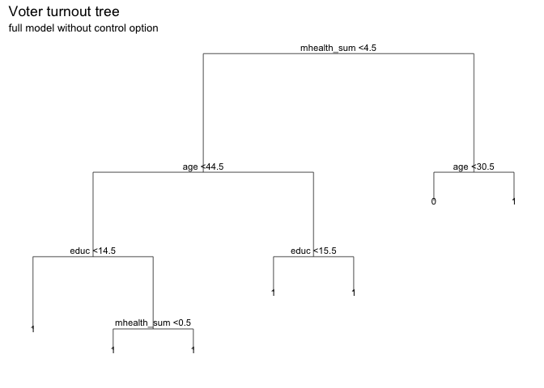

    ## [1] 0.304

    ## Area under the curve: 0.56

    ## [1] 0.094

First model I use is the default full model with 8 nodes. The tree map is as above. The error test rate is 0.304, the Area under the curve: 0.56 and the PRE is 0.094.Then I will try a model with control option.

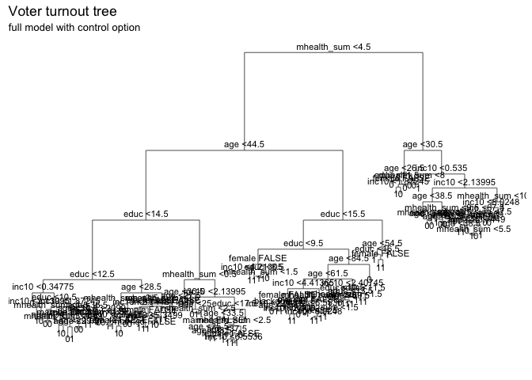

    ## [1] 0.335

    ## Area under the curve: 0.629

    ## [1] 0

Second model I use is the model with comtrol option. The test error rate is 0.298, the Area under the curve: 0.622 and the PRE is -0.0172. Compare with the first model, the error rate increase and the AUC decrease. PRE become negative, which means the the model increse the error rate by 0.0172. Obviously, this model is overfitting.

Then we generate bagging model and check the importance variables.

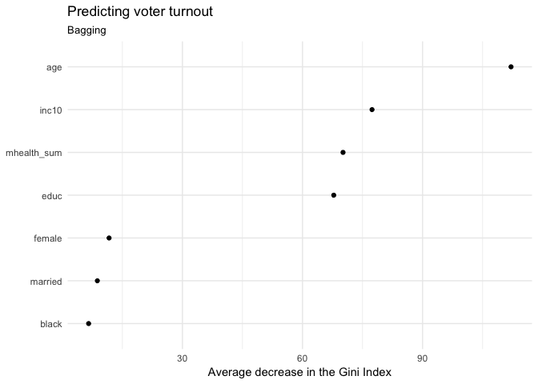

    ## [1] 0.315

    ## Area under the curve: 0.621

    ## [1] 0.0598

With the new bagging model, the test error rate is 0.315, Area under the curve: 0.621 and PRE = 0.0598. Also, by doing variables importance measures, we could know that age, inc10, educ and mhealth\_sun are the tree variables with the most importance.

Next we will only include these four varibales in our model.

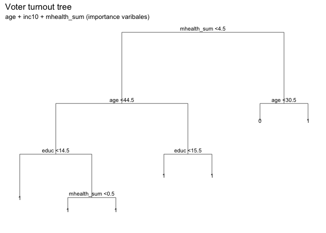

    ## [1] 0.304

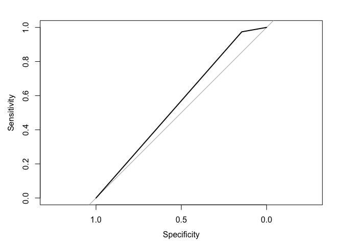

    ## Area under the curve: 0.56

    ## [1] 0.094

This model only include the importance varibales: age, inc10, educ and mhealth\_sum. The test error rate is 0.304, the Area under the curve: 0.56 and PRE = 0.094. Compare with the first model(full model), The level of model fit doesn't seems change a lot. Then the last model, we will try random forest model.

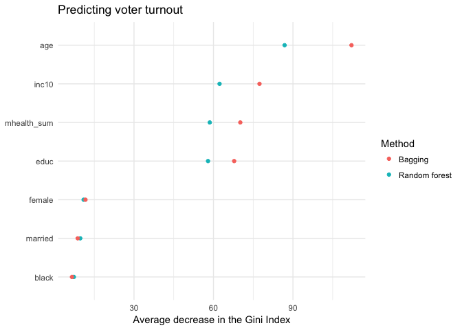

    ## [1] 0.315

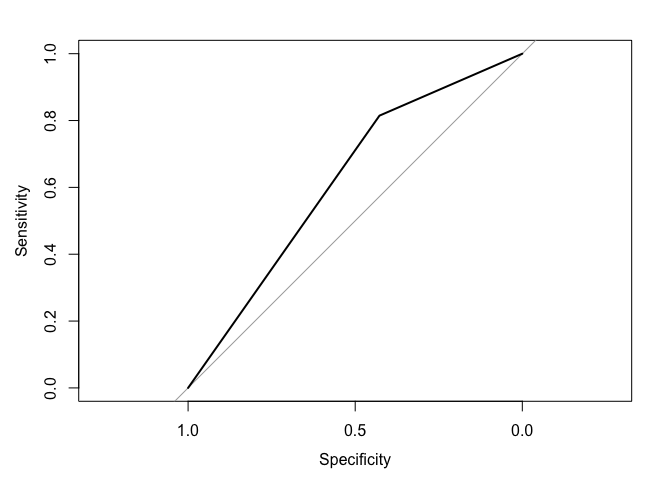

    ## Area under the curve: 0.621

    ## [1] 0.0598

By looking at random forest model, the average decrease in the Gini index is decrease in random forest model. The varibales of importance are the same: age, inc10, mhealth\_sun and educ. The test error rate is 0.315, Area under the curve: 0.621 and PRE is 0.0598. In conclusion,from standard measures of model fit, the first full model and the model with four importance varibles are the best model. I will choose the model with less predictors because it's more interpretable. Look at the tree model of age + inc10 + mhealth\_sum (importance varibales), we could know that among people mhealth\_sum &gt; 4.5, if their age &gt; 30.5, they are predicted as vote. Otherwise, they are predicted as not vote. Among people mhealth\_sum &lt; 4.5, they will all be predicted vote.

Question 2
----------

Use cross-validation techniques and standard measures of model fit (e.g. test error rate, PRE, ROC curves/AUC) to compare and evaluate at least five SVM models of voter turnout. Select the best model and interpret the results using whatever methods you see fit (graphs, tables, model fit statistics, predictions for hypothetical observations, etc.)

model 1: linear model with all predictors
=========================================

    ## # A tibble: 1,165 <U+00D7> 8
    ##    vote96 mhealth_sum   age  educ  black female married inc10
    ##    <fctr>       <dbl> <dbl> <dbl> <fctr> <fctr>  <fctr> <dbl>
    ## 1       1           0    60    12      0      0       0  4.81
    ## 2       1           1    36    12      0      0       1  8.83
    ## 3       0           7    21    13      0      0       0  1.74
    ## 4       0           6    29    13      0      0       0 10.70
    ## 5       1           1    41    15      1      1       1  8.83
    ## 6       1           2    48    20      0      0       1  8.83
    ## 7       0           9    20    12      0      1       0  7.22
    ## 8       0          12    27    11      0      1       0  1.20
    ## 9       1           2    28    16      0      0       1  7.22
    ## 10      1           0    72    14      0      0       1  4.01
    ## # ... with 1,155 more rows

    ## 
    ## Call:
    ## best.tune(method = svm, train.x = vote96 ~ ., data = as_tibble(mh_split$train), 
    ##     ranges = list(cost = c(0.001, 0.01, 0.1, 1, 5, 10, 100)), 
    ##     kernel = "linear")
    ## 
    ## 
    ## Parameters:
    ##    SVM-Type:  C-classification 
    ##  SVM-Kernel:  linear 
    ##        cost:  0.1 
    ##       gamma:  0.125 
    ## 
    ## Number of Support Vectors:  524
    ## 
    ##  ( 263 261 )
    ## 
    ## 
    ## Number of Classes:  2 
    ## 
    ## Levels: 
    ##  0 1

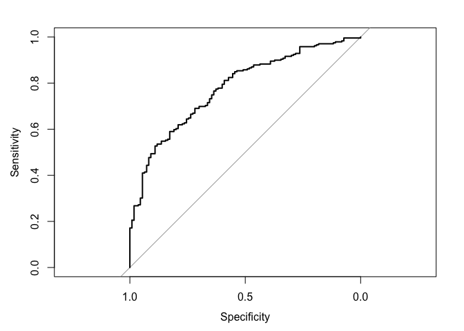

    ## Area under the curve: 0.779

The first model I use for svm is the full model. The auc is 0.779 for this model. Then I will see polynomial kernel SVM model. \#model2: polynomial kernel SVM

    ## 
    ## Call:
    ## best.tune(method = svm, train.x = vote96 ~ ., data = as_tibble(mh_split$train), 
    ##     ranges = list(cost = c(0.001, 0.01, 0.1, 1, 5, 10, 100)), 
    ##     kernel = "polynomial")
    ## 
    ## 
    ## Parameters:
    ##    SVM-Type:  C-classification 
    ##  SVM-Kernel:  polynomial 
    ##        cost:  10 
    ##      degree:  3 
    ##       gamma:  0.125 
    ##      coef.0:  0 
    ## 
    ## Number of Support Vectors:  501
    ## 
    ##  ( 261 240 )
    ## 
    ## 
    ## Number of Classes:  2 
    ## 
    ## Levels: 
    ##  0 1

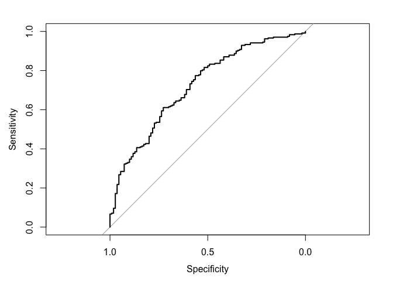

    ## Area under the curve: 0.723

The second model I use for svm is polynomial kernel SVM modell. The auc is also 0.723 for this model.The roc decrease. This model is still not that good. Then next step, I will take a look at the radial kernel.

model3: raidal kernel
=====================

    ## 
    ## Call:
    ## best.tune(method = svm, train.x = vote96 ~ ., data = as_tibble(mh_split$train), 
    ##     ranges = list(cost = c(0.001, 0.01, 0.1, 1, 5, 10, 100)), 
    ##     kernel = "radial")
    ## 
    ## 
    ## Parameters:
    ##    SVM-Type:  C-classification 
    ##  SVM-Kernel:  radial 
    ##        cost:  1 
    ##       gamma:  0.125 
    ## 
    ## Number of Support Vectors:  524
    ## 
    ##  ( 276 248 )
    ## 
    ## 
    ## Number of Classes:  2 
    ## 
    ## Levels: 
    ##  0 1

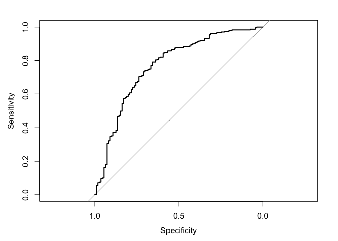

    ## Area under the curve: 0.769

The radial kernel's roc is 0.769. still hard to compare with that of polynomial and linear SVMs.

It???s easier to compare if we plot the ROC curves on the same plotting window:

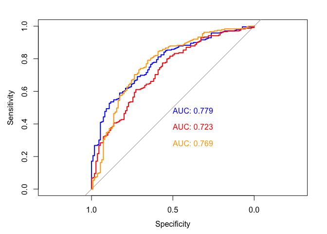 From the plot, we could know the linear and poly kernels has larger auc, which means they have higher accuracy. The next model I will use only mhealth\_sum, aga,educ and inc10 importance variables I got from the last part.

model4: linear kernel with importance varibales
===============================================

    ## 
    ## Call:
    ## best.tune(method = svm, train.x = vote96 ~ mhealth_sum + educ + 
    ##     inc10 + age, data = as_tibble(mh_split$train), ranges = list(cost = c(0.001, 
    ##     0.01, 0.1, 1, 5, 10, 100)), kernel = "linear")
    ## 
    ## 
    ## Parameters:
    ##    SVM-Type:  C-classification 
    ##  SVM-Kernel:  linear 
    ##        cost:  5 
    ##       gamma:  0.25 
    ## 
    ## Number of Support Vectors:  522
    ## 
    ##  ( 262 260 )
    ## 
    ## 
    ## Number of Classes:  2 
    ## 
    ## Levels: 
    ##  0 1

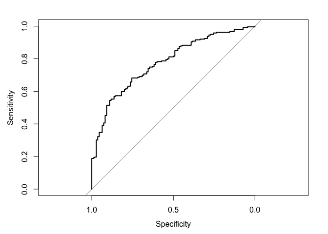

    ## Area under the curve: 0.777

Compare with auc of the first full model 0.779, the auc of this model is 0.777 decrease. Then try poly kernel again just using importance varibales.

model5: polynomial kernel SVM
=============================

    ## 
    ## Call:
    ## best.tune(method = svm, train.x = vote96 ~ mhealth_sum + educ + 
    ##     inc10 + age, data = as_tibble(mh_split$train), ranges = list(cost = c(0.001, 
    ##     0.01, 0.1, 1, 5, 10, 100)), kernel = "polynomial")
    ## 
    ## 
    ## Parameters:
    ##    SVM-Type:  C-classification 
    ##  SVM-Kernel:  polynomial 
    ##        cost:  1 
    ##      degree:  3 
    ##       gamma:  0.25 
    ##      coef.0:  0 
    ## 
    ## Number of Support Vectors:  508
    ## 
    ##  ( 257 251 )
    ## 
    ## 
    ## Number of Classes:  2 
    ## 
    ## Levels: 
    ##  0 1

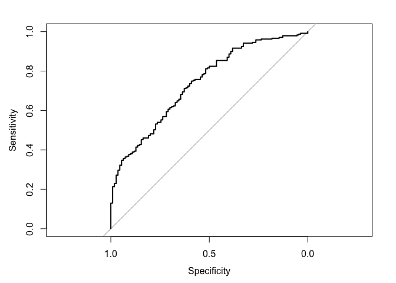

    ## Area under the curve: 0.738

Foe this model, the auc = 0.738. Compared with full model poly kernel's auc:0.723. It increase. In conclusion. by compareing the auc in five models, the linear kernel full model is the best model.

### Part 3: OJ Simpson \[4 points\]

question1
=========

Because the race and belief are both binary variables, so in order to learn the statistics between race and belief of OJ Simpson's guilt, I decide to fit the data with logistics regression model and random forest model with two race varibales:black and hispanic. \#\#logistic model: guilt ~ black + hispanic \#\#

    ## # A tibble: 1,416 <U+00D7> 10
    ##     guilt    dem    rep    ind   age                            educ
    ##    <fctr> <fctr> <fctr> <fctr> <dbl>                           <chr>
    ## 1       1      0      1      0    29         COLLEGE GRAD AND BEYOND
    ## 2       1      0      1      0    29                HIGH SCHOOL GRAD
    ## 3       1      1      0      0    21 SOME COLLEGE(TRADE OR BUSINESS)
    ## 4       1      0      1      0    36 SOME COLLEGE(TRADE OR BUSINESS)
    ## 5       1      0      1      0    33 SOME COLLEGE(TRADE OR BUSINESS)
    ## 6       0      0      1      0    27                HIGH SCHOOL GRAD
    ## 7       1      0      1      0    43                HIGH SCHOOL GRAD
    ## 8       1      1      0      0    33         COLLEGE GRAD AND BEYOND
    ## 9       0      0      0      0    58 SOME COLLEGE(TRADE OR BUSINESS)
    ## 10      0      1      0      0    49                HIGH SCHOOL GRAD
    ## # ... with 1,406 more rows, and 4 more variables: female <fctr>,
    ## #   black <fctr>, hispanic <fctr>, income <chr>

    ## 
    ## Call:
    ## glm(formula = guilt ~ black + hispanic, family = binomial, data = simpson_split$train)
    ## 
    ## Deviance Residuals: 
    ##    Min      1Q  Median      3Q     Max  
    ## -1.835  -0.607   0.641   0.641   2.018  
    ## 
    ## Coefficients:
    ##             Estimate Std. Error z value Pr(>|z|)    
    ## (Intercept)   1.4789     0.0934   15.84   <2e-16 ***
    ## black1       -3.0789     0.2165  -14.22   <2e-16 ***
    ## hispanic1    -0.2966     0.3167   -0.94     0.35    
    ## ---
    ## Signif. codes:  0 '***' 0.001 '**' 0.01 '*' 0.05 '.' 0.1 ' ' 1
    ## 
    ## (Dispersion parameter for binomial family taken to be 1)
    ## 
    ##     Null deviance: 1229.06  on 991  degrees of freedom
    ## Residual deviance:  947.18  on 989  degrees of freedom
    ## AIC: 953.2
    ## 
    ## Number of Fisher Scoring iterations: 4

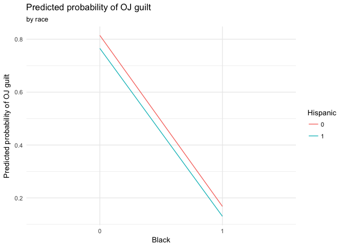

    ## [1] 0.816

    ## Area under the curve: 0.733

    ## [1] 0.406

First, from the summary table, we could see the black variable is statistical significant. If the person is black, the probability that he/she think OJ Simpson was "probably guilty" will decrease 3.0789. The hispanic variable is not statistical significant. It coefficient indicate that if the person is hispanic, the probability that he/she think OJ Simpson was "probably guilty" will decrease 0.2966. To get a plot, we set black as x-aes and make it group by hispanic. From the plot, we could see, non-Hispanic and non-black could have larger probability to think OJ Simpson 'guilt'.

The accuracy of this model is 81.6%, which means 81.6% of the predictions based on this model were correct.

The Area under the curve: 0.731, and PRE is 0.406.

Then try to fit the data with random forest model. \#\#randam forest model\#\# 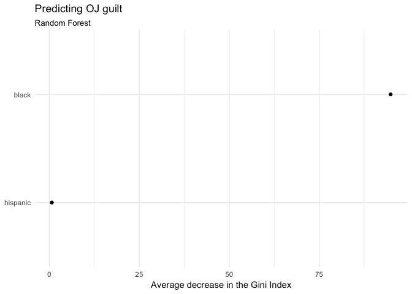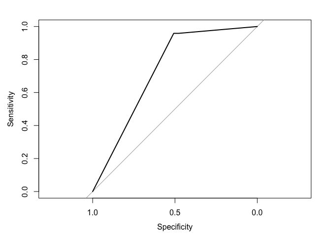

    ## Area under the curve: 0.732

From the graph, we could see the black predictor has larger decrease in the Gini index, and it's a more important variables in the model. In random forest model, the Area under the curve: 0.732, compare to the first logistic model, the ROC is not change a lot. Both model are quite good because the variables are only two. So we could take a look at single tree model, which is most interpretable.

single tree
-----------

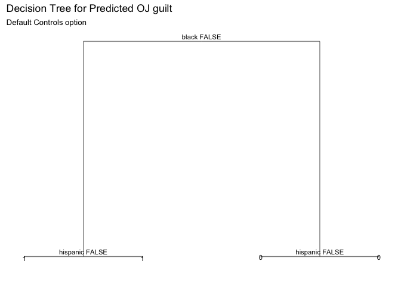 From the tree graph, it seems hispanic do not have much impact on the guilt. If the person is black, he/she may be predicted to think OJ simpson 'probably not guilt', if the person is not black, he/she may be predicted to think OJ Simpson 'probably guilt.

question 2
----------

How can you predict whether individuals believe OJ Simpson to be guilty of these murders? Develop a robust statistical learning model to predict whether individuals believe OJ Simpson to be either probably guilty or probably not guilty and demonstrate the effectiveness of this model using methods we have discussed in class.

For this model, I decide to use single tree first and then use cross-validation trying to pick best tree nodes that can minimize MSE. \#\#single tree 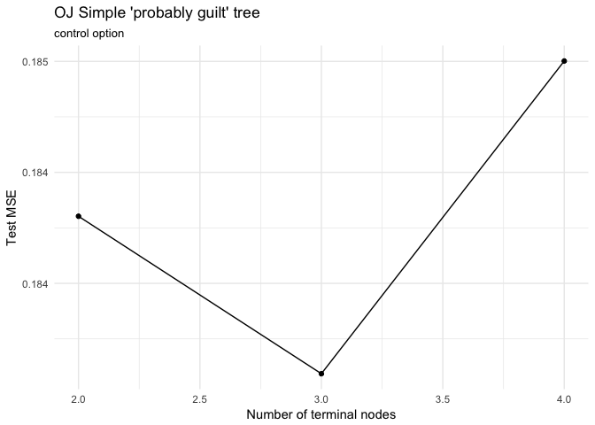 Here I select 3 as the optimal number of nodes.

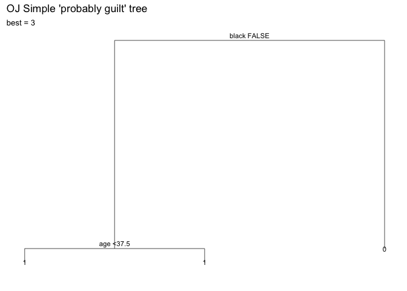 From the tree graph, we could know that black is the most important variables which can impact guilt result. If person is black, then he/she is predicted to think OJ 'probably not guilty', otherwise, he/she is predicted to think OJ 'probably guilty'. Age is the second importance variables which can impact guilt result.

Random forest
-------------

By using random forest, we could know the error rate: 18.4%, and Area under the curve: 0.732. This model is quite good. Also, by looking at variable importance graph, we could confirm the single tree model above that black is the most important variables.
