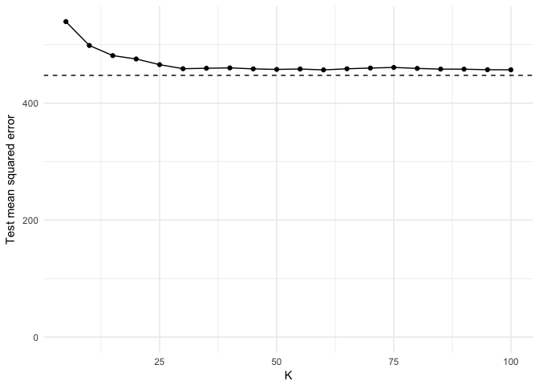
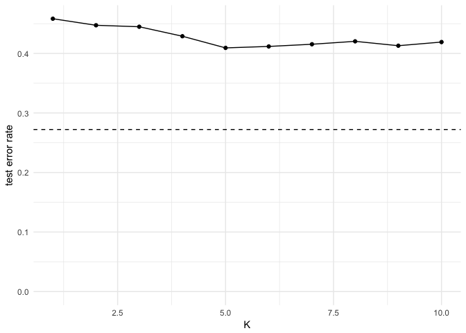
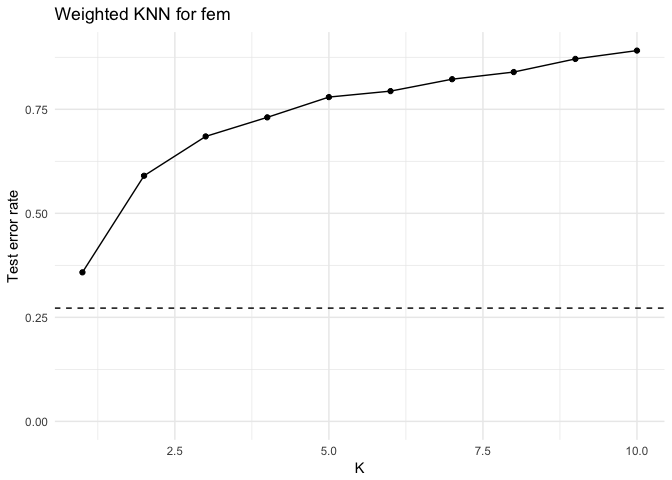
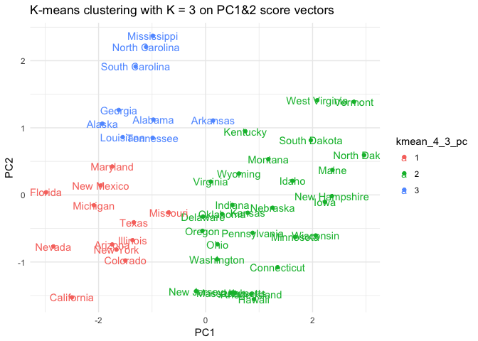
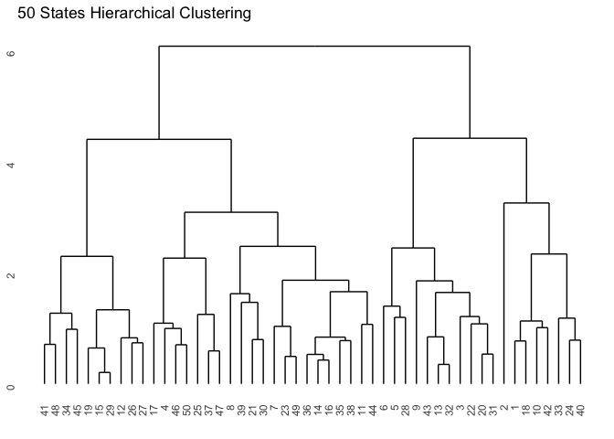

Problem set \#9: nonparametric methods and unsupervised learning
================
Zhuo Leng

``` r
library(tidyverse)
library(forcats)
library(broom)
library(modelr)
library(stringr)
library(ISLR)
library(rcfss)
library(pROC)
library(grid)
library(gridExtra)
library(FNN)
library(kknn)
library(ggdendro)
library(tidytext)
library(tree)
library(e1071)
library(ggdendro)
library(randomForest)
library(gbm)


options(digits = 3)
set.seed(1234)
theme_set(theme_minimal())
```

Part 1: Attitudes towards feminists \[3 points\]
------------------------------------------------

Question 1
==========

Split the data into a training and test set (70/30%).

Question 2
==========

Calculate the test MSE for KNN models with \(K = 5, 10, 15, \dots, 100\), using whatever combination of variables you see fit. Which model produces the lowest test MSE?

``` r
set.seed(1234)

# MSE() function
mse <- function(model, data) {
  x <- modelr:::residuals(model, data)
  mean(x ^ 2, na.rm = TRUE)
}

# estimate test MSE for LM and KNN models
mse_lm <- lm(feminist ~ educ + income + female + age, data = fem_train) %>%
  mse(.,fem_test)

mse_knn <- data_frame(k = seq(5, 100, 5), 
                      knn = map(k, ~ knn.reg(select(fem_train, educ, income, female, age), y = fem_train$feminist, test = select(fem_test, educ,income, female, age), k = .)), 
                      mse = map_dbl(knn, ~ mean((fem_test$feminist - .$pred)^2))) 

mse_knn$mse
```

    ##  [1] 539 499 481 476 466 459 460 460 459 458 458 457 459 460 461 459 458
    ## [18] 458 457 457

``` r
ggplot(mse_knn, aes(k, mse)) +
  geom_line() +
  geom_point() +
  geom_hline(yintercept = mse_lm, linetype = 2) +
  labs(x = "K",
       y = "Test mean squared error") +
  expand_limits(y = 0)
```

 For KNN model, I use educ, income, female, age as my predictors in the model. From the test mean squared error plot, we could know with the increase of K, the MSE decreases. When k = 100, the MSE = 457 is the lowest.

Question 3
==========

Calculate the test MSE for weighted KNN models with \(K = 5, 10, 15, \dots, 100\) using the same combination of variables as before. Which model produces the lowest test MSE?

``` r
# estimate test MSE for LM and WKNN models

mse_wknn <- data_frame(k = seq(5, 100, 5), 
                      knn = map(k, ~ kknn(feminist ~ educ + income + female + age,
                                          train = fem_train,test = fem_test, k = .)), 
                      mse = map_dbl(knn, ~ mean((fem_test$feminist - .$fitted.values)^2))) 

mse_wknn$mse
```

    ##  [1] 563 504 486 477 470 467 465 463 461 459 458 457 455 454 453 452 451
    ## [18] 451 450 450

``` r
ggplot(mse_wknn, aes(k, mse)) +
  geom_line() +
  geom_point() +
  geom_hline(yintercept = mse_lm, linetype = 2) +
  labs(title = "Weighted KNN for fem",
       x = "K",
       y = "Test mean squared error") +
  expand_limits(y = 0)
```

 For weighted KNN model, I also use educ, income, female, age as my predictors in the model. From the test mean squared error plot, we could know with the increase of K, the MSE decreases. When k = 100, the MSE = 450 is the lowest.

Question 4
==========

Compare the test MSE for the best KNN/wKNN model(s) to the test MSE for the equivalent linear regression, decision tree, boosting, and random forest methods using the same combination of variables as before. Which performs the best? Why do you think this method performed the best, given your knowledge of how it works?

``` r
set.seed(1234)

tree_fit <- tree(feminist ~ educ + income + female + age, data = fem_train, control = tree.control(nobs = nrow(fem_train), mindev = 0))
rf_fit <- randomForest(feminist ~ educ + income + female + age, data = fem_train, ntree = 500)
boosting <- gbm(feminist ~ educ + income + female + age, data = fem_train, n.trees = 10000, interaction.depth = 1)
```

    ## Distribution not specified, assuming gaussian ...

``` r
mse_lm
```

    ## [1] 448

``` r
mse(tree_fit, fem_test)
```

    ## [1] 551

``` r
mse(rf_fit, fem_test)
```

    ## [1] 445

``` r
mse_boost <-function(model, test, tree_number) {
  yhat.boost <- predict (model, newdata = test, n.trees=tree_number)
  mse <- mean((yhat.boost - (as_tibble(test))$feminist)^2)
  return (mse)
}

mse_boost(boosting, fem_test, 10000)
```

    ## [1] 444

So by comapre the test MSE for the best KNN/WKNN model, which equal to 457, 450 respectively, to the MSE for the quicalent linear regression(mse = 448), decision tree(mse = 551), random forest (mse = 551), boosting(mse = 445), the boosting method can generate the lowest MSE, so it performs the best.

Actually, all non-parametric methods could release really low MSE because they do not assume a global structure to the data and it could relaxing the non-linearity assumption in linear regression.

Now, I only use partial predictors. Maybe in further when I add more predictors in the model, I could see certain pattern of MSE more clearly.

Part 2: Voter turnout and depression \[2 points\]
-------------------------------------------------

Question 1
==========

Split the data into a training and test set (70/30%).

Question 2
==========

Calculate the test error rate for KNN models with \(K = 1,2,\dots,10\), using whatever combination of variables you see fit. Which model produces the lowest test MSE?

``` r
set.seed(1234)

logit2prob <- function(x){
  exp(x) / (1 + exp(x))
}

# estimate test err for LM and KNN models
glm <- glm(vote96 ~ ., data = mh_train, family = binomial)

x<- mh_test %>%
  add_predictions(glm) %>%
  mutate (pred = logit2prob(pred),
          prob = pred,
          pred = as.numeric(pred > 0.5))

err_glm <-mean(x$vote96 != x$pred)


err_knn <- data_frame(k = 1:10,
                      knn= map(k, ~ class::knn(select(mh_train, -vote96),
                                                test = select(mh_train, -vote96),
                                                cl = mh_train$vote96, k = .)),
                      err = map_dbl(knn, ~ mean(mh_test$vote96 != .))) 
err_knn$err
```

    ##  [1] 0.458 0.447 0.445 0.429 0.409 0.412 0.415 0.420 0.413 0.419

``` r
ggplot(err_knn, aes(k, err_knn$err)) +
  geom_line() +
  geom_point() +
  geom_hline(yintercept = err_glm, linetype = 2) +
  labs(x = "K",
       y = "test error rate") +
  expand_limits(y = 0)
```

 For KNN model, I all variables as my predictors in the model. From the test error rate plot, we could know with the increase of K, the test error rate does not have clear pattern. When k = 5, the test error rate = 0.409 is the lowest.

Question 3
==========

Calculate the test error rate for weighted KNN models with \(K = 1,2,\dots,10\) using the same combination of variables as before. Which model produces the lowest test error rate?

``` r
# estimate test MSE for LM and WKNN models
err_wknn <- data_frame(k = 1:10,
                      knn= map(k, ~ kknn(vote96 ~., train = mh_train, test = mh_test, k =.)),
                      err = map_dbl(knn, ~ mean(mh_test$vote96 != .$fitted.values))) 
err_wknn$err
```

    ##  [1] 0.358 0.590 0.685 0.731 0.779 0.794 0.822 0.840 0.871 0.891

``` r
ggplot(err_wknn, aes(k, err)) +
  geom_line() +
  geom_point() +
  geom_hline(yintercept = err_glm, linetype = 2) +
  labs(title = "Weighted KNN for fem",
       x = "K",
       y = "Test error rate") +
  expand_limits(y = 0)
```

 For weighted KNN model, I also all possible variables as my predictors in the model. From the test error rate plot, we could know with the increase of K, the test error rate will increase. When k = 1, the err = 0.358 is the lowest.

Question 4
==========

Compare the test error rate for the best KNN/wKNN model(s) to the test error rate for the equivalent logistic regression, decision tree, boosting, random forest, and SVM methods using the same combination of variables as before. Which performs the best? Why do you think this method performed the best, given your knowledge of how it works?

``` r
set.seed(1234)

# Define the error rate function for trees
err.rate.tree <- function(model, data) {
  data <- as_tibble(data)
  response <- as.character(model$terms[[2]])
  
  pred <- predict(model, newdata = data, type = "class")
  actual <- data[[response]]
  
  return(mean(pred != actual, na.rm = TRUE))
}

##decision tree
tree_mh <- tree(vote96 ~ ., data = mh_train, control = tree.control(nobs = nrow(mh_train), mindev = .001))

#err.rate.tree(tree_mh, mh_test)


#random forest

err.rate.rf <- function(model, data) {
  data <- as_tibble(data)
  response <- as.character(model$terms[[2]])
  
  pred <- predict(model, newdata = data, type = "response")
  actual <- data[[response]]
  
  return(mean(pred != actual, na.rm = TRUE))
}


rf_mh<- randomForest(vote96 ~ ., data = mh_train, ntree = 500)
err.rate.rf(rf_mh, mh_test)
```

    ## [1] 1

``` r
#boosting
boost_mh = gbm (vote96 ~ ., data = mh_train, n.trees = 5000, interaction.depth = 2, distribution = 'gaussian')  

err_boost <-function(model, test, tree_number) {
  yhat.boost <- predict (model, newdata = test, n.trees=tree_number)
  err <- mean(round(yhat.boost)!= mh_test$vote96)
  return (err)
}

err_boost(boost_mh, mh_test, 5000)
```

    ## [1] 0.272

``` r
#logit
err_glm
```

    ## [1] 0.272

``` r
##SVM
mh_lin_tune <- tune(svm, vote96 ~ ., data = mh_train,
                    kernel = "linear",
                    range = list(cost = c(.001, .01, .1, 1, 5, 10, 100)))
summary(mh_lin_tune)
```

    ## 
    ## Parameter tuning of 'svm':
    ## 
    ## - sampling method: 10-fold cross validation 
    ## 
    ## - best parameters:
    ##  cost
    ##     5
    ## 
    ## - best performance: 0.264 
    ## 
    ## - Detailed performance results:
    ##    cost error dispersion
    ## 1 1e-03 0.285     0.0507
    ## 2 1e-02 0.267     0.0500
    ## 3 1e-01 0.264     0.0503
    ## 4 1e+00 0.264     0.0503
    ## 5 5e+00 0.264     0.0503
    ## 6 1e+01 0.264     0.0503
    ## 7 1e+02 0.264     0.0503

``` r
mh_lin <- mh_lin_tune$best.model
summary(mh_lin)
```

    ## 
    ## Call:
    ## best.tune(method = svm, train.x = vote96 ~ ., data = mh_train, 
    ##     ranges = list(cost = c(0.001, 0.01, 0.1, 1, 5, 10, 100)), 
    ##     kernel = "linear")
    ## 
    ## 
    ## Parameters:
    ##    SVM-Type:  eps-regression 
    ##  SVM-Kernel:  linear 
    ##        cost:  5 
    ##       gamma:  0.143 
    ##     epsilon:  0.1 
    ## 
    ## 
    ## Number of Support Vectors:  556

So by comapre the test error rate for the best KNN/WKNN model, which equal to 0.409, 0.358 respectively, to the test error rate for the quicalent logistic regression(err = 0.272), for best svm linear kernal model is 0.264.

From the comparision above, the SVM with linear kernal is the best performance model.This is because SVM has a regularisation parameter, which could acoid over-fitting, also SVM use efficient methods(not local minima) approximation to a bound on the test error rate.

part 3:Colleges \[2 points\]
----------------------------

Question 1
==========

Perform PCA analysis on the college dataset and plot the first two principal components. Describe the results. What variables appear strongly correlated on the first principal component? What about the second principal component?

``` r
col_df <- read_csv('College.csv') %>%
  mutate(Private = ifelse (Private =="Yes",1,0))
```

    ## Parsed with column specification:
    ## cols(
    ##   Private = col_character(),
    ##   Apps = col_double(),
    ##   Accept = col_double(),
    ##   Enroll = col_double(),
    ##   Top10perc = col_double(),
    ##   Top25perc = col_double(),
    ##   F.Undergrad = col_double(),
    ##   P.Undergrad = col_double(),
    ##   Outstate = col_double(),
    ##   Room.Board = col_double(),
    ##   Books = col_double(),
    ##   Personal = col_double(),
    ##   PhD = col_double(),
    ##   Terminal = col_double(),
    ##   S.F.Ratio = col_double(),
    ##   perc.alumni = col_double(),
    ##   Expend = col_double(),
    ##   Grad.Rate = col_double()
    ## )

``` r
pr_out <- prcomp(col_df, scale = TRUE)
biplot(pr_out, scale = 0, cex = .6)
```

 The biplot visualizes the relationship between the first two principal components for the dataset, however, we could not know the first two principal components clearly because there are lots of variables. We need to take further step by loadings of the first and second principal components.

``` r
pr_out$rotation[, 1]
```

    ##     Private        Apps      Accept      Enroll   Top10perc   Top25perc 
    ##     -0.0890     -0.1996     -0.1538     -0.1178     -0.3603     -0.3448 
    ## F.Undergrad P.Undergrad    Outstate  Room.Board       Books    Personal 
    ##     -0.0941      0.0175     -0.3277     -0.2665     -0.0572      0.0719 
    ##         PhD    Terminal   S.F.Ratio perc.alumni      Expend   Grad.Rate 
    ##     -0.3033     -0.3039      0.2103     -0.2367     -0.3330     -0.2731

``` r
pr_out$rotation[, 2]
```

    ##     Private        Apps      Accept      Enroll   Top10perc   Top25perc 
    ##      0.3459     -0.3436     -0.3726     -0.3997      0.0162     -0.0177 
    ## F.Undergrad P.Undergrad    Outstate  Room.Board       Books    Personal 
    ##     -0.4107     -0.2931      0.1915      0.0940     -0.0573     -0.1928 
    ##         PhD    Terminal   S.F.Ratio perc.alumni      Expend   Grad.Rate 
    ##     -0.1162     -0.1042     -0.2044      0.1941      0.0703      0.1178

From the table of first principal components, the highest magnitude variables are perc.alumni, Outsate, Grad.Rate, Expend, Top10perc,Top25perc,Room.board, Terminal, PhD. We can tell this because these vectors??? length on the first principal component dimension are roughly the same. Other variables seems not that important.

From the table of second principal components, the second principal component (the vertical axis) places more emphasis on F.undergrad,P.Undergrad, Apps, Accept, Enroll, F.undergrad.Intuitively this makes sense because first components seems all about student quality and it makes sense that they should be correlated with one another.

We can also interpret the plot for individual states based on their positions along the two dimensions. University with large positive values on the first principal component have higher graduation rate, tuition and room cost; University with large positive values on the second principal component have more student size and acception rate.

part 4:Clustering states \[3 points\]
-------------------------------------

Question 1
==========

Perform PCA on the dataset and plot the observations on the first and second principal components.

``` r
crime <- read_csv("USArrests.csv") %>%
  na.omit
```

    ## Parsed with column specification:
    ## cols(
    ##   State = col_character(),
    ##   Murder = col_double(),
    ##   Assault = col_integer(),
    ##   UrbanPop = col_integer(),
    ##   Rape = col_double()
    ## )

``` r
# perform PCA
pr.out <- prcomp(x = select(crime, -State), scale = TRUE)
# plot PC1 v PC2
biplot(pr.out, scale = 0, cex = .6, xlabs = crime$State)
```

 So from the plot of first and second principal components, we could make conclusion that first principal components put more emphsis on Assault, Murder, and Rape, while the second roughly put weight on Urban Population.

Question 2
==========

Perform \(K\)-means clustering with \(K=2\). Plot the observations on the first and second principal components and color-code each state based on their cluster membership. Describe your results.

``` r
set.seed(1234)

kmean_4_2 <- factor(kmeans(select(crime, -State), 2)$cluster)
PC1 = as.data.frame(pr.out$x)$PC1
PC2 = as.data.frame(pr.out$x)$PC2
PC1
```

    ##  [1] -0.9757 -1.9305 -1.7454  0.1400 -2.4986 -1.4993  1.3450 -0.0472
    ##  [9] -2.9828 -1.6228  0.9035  1.6233 -1.3651  0.5004  2.2310  0.7889
    ## [17]  0.7433 -1.5491  2.3727 -1.7456  0.4813 -2.0873  1.6757 -0.9865
    ## [25] -0.6898  1.1735  1.2529 -2.8455  2.3600 -0.1797 -1.9601 -1.6657
    ## [33] -1.1121  2.9622  0.2237  0.3086 -0.0585  0.8795  0.8551 -1.3074
    ## [41]  1.9678 -0.9897 -1.3415  0.5450  2.7733  0.0954  0.2147  2.0874
    ## [49]  2.0588  0.6231

``` r
PC2
```

    ##  [1]  1.1220  1.0624 -0.7385  1.1085 -1.5274 -0.9776 -1.0780 -0.3221
    ##  [9]  0.0388  1.2661 -1.5547  0.2089 -0.6750 -0.1500 -0.1030 -0.2674
    ## [17]  0.9488  0.8623  0.3726  0.4234 -1.4597 -0.1538 -0.6259  2.3697
    ## [25] -0.2607  0.5315 -0.1920 -0.7678 -0.0179 -1.4349  0.1414 -0.8149
    ## [33]  2.2056  0.5931 -0.7348 -0.2850 -0.5360 -0.5654 -1.4770  1.9140
    ## [41]  0.8151  0.8516 -0.4083 -1.4567  1.3882  0.1977 -0.9604  1.4105
    ## [49] -0.6051  0.3178

``` r
ggplot(mapping=(aes(PC1, PC2, label=crime$State, color=kmean_4_2)))+
  geom_point() +
  geom_text() + 
  labs(title = "K-means clustering with K = 2 on Original Data")
```

 The two cluster are mainly different from their PC1 magnitude. The left cluster has lower PC1, which are mainly North East States. Another cluster at the right with higher PC1, with lower rate of crime.

Question 3
==========

Perform \(K\)-means clustering with \(K=4\). Plot the observations on the first and second principal components and color-code each state based on their cluster membership. Describe your results.

``` r
set.seed(1234)

kmean_4_4 <- factor(kmeans(select(crime, -State), 4)$cluster)
PC1 = as.data.frame(pr.out$x)$PC1
PC2 = as.data.frame(pr.out$x)$PC2
PC1
```

    ##  [1] -0.9757 -1.9305 -1.7454  0.1400 -2.4986 -1.4993  1.3450 -0.0472
    ##  [9] -2.9828 -1.6228  0.9035  1.6233 -1.3651  0.5004  2.2310  0.7889
    ## [17]  0.7433 -1.5491  2.3727 -1.7456  0.4813 -2.0873  1.6757 -0.9865
    ## [25] -0.6898  1.1735  1.2529 -2.8455  2.3600 -0.1797 -1.9601 -1.6657
    ## [33] -1.1121  2.9622  0.2237  0.3086 -0.0585  0.8795  0.8551 -1.3074
    ## [41]  1.9678 -0.9897 -1.3415  0.5450  2.7733  0.0954  0.2147  2.0874
    ## [49]  2.0588  0.6231

``` r
PC2
```

    ##  [1]  1.1220  1.0624 -0.7385  1.1085 -1.5274 -0.9776 -1.0780 -0.3221
    ##  [9]  0.0388  1.2661 -1.5547  0.2089 -0.6750 -0.1500 -0.1030 -0.2674
    ## [17]  0.9488  0.8623  0.3726  0.4234 -1.4597 -0.1538 -0.6259  2.3697
    ## [25] -0.2607  0.5315 -0.1920 -0.7678 -0.0179 -1.4349  0.1414 -0.8149
    ## [33]  2.2056  0.5931 -0.7348 -0.2850 -0.5360 -0.5654 -1.4770  1.9140
    ## [41]  0.8151  0.8516 -0.4083 -1.4567  1.3882  0.1977 -0.9604  1.4105
    ## [49] -0.6051  0.3178

``` r
ggplot(mapping=(aes(PC1, PC2, label=crime$State, color=kmean_4_4)))+
  geom_point() +
  geom_text() + 
  labs(title = "K-means clustering with K = 4 on Original Data")
```


This graph shows 4 roughly distinct clusters. The differences among cluster mainly on their PC1 score. The groups are have similar y value. \# Question 4 \#

Perform \(K\)-means clustering with \(K=3\). Plot the observations on the first and second principal components and color-code each state based on their cluster membership. Describe your results.

``` r
set.seed(1234)
kmean_4_3 <- factor(kmeans(select(crime, -State), 3)$cluster)
PC1 = as.data.frame(pr.out$x)$PC1
PC2 = as.data.frame(pr.out$x)$PC2
PC1
```

    ##  [1] -0.9757 -1.9305 -1.7454  0.1400 -2.4986 -1.4993  1.3450 -0.0472
    ##  [9] -2.9828 -1.6228  0.9035  1.6233 -1.3651  0.5004  2.2310  0.7889
    ## [17]  0.7433 -1.5491  2.3727 -1.7456  0.4813 -2.0873  1.6757 -0.9865
    ## [25] -0.6898  1.1735  1.2529 -2.8455  2.3600 -0.1797 -1.9601 -1.6657
    ## [33] -1.1121  2.9622  0.2237  0.3086 -0.0585  0.8795  0.8551 -1.3074
    ## [41]  1.9678 -0.9897 -1.3415  0.5450  2.7733  0.0954  0.2147  2.0874
    ## [49]  2.0588  0.6231

``` r
PC2
```

    ##  [1]  1.1220  1.0624 -0.7385  1.1085 -1.5274 -0.9776 -1.0780 -0.3221
    ##  [9]  0.0388  1.2661 -1.5547  0.2089 -0.6750 -0.1500 -0.1030 -0.2674
    ## [17]  0.9488  0.8623  0.3726  0.4234 -1.4597 -0.1538 -0.6259  2.3697
    ## [25] -0.2607  0.5315 -0.1920 -0.7678 -0.0179 -1.4349  0.1414 -0.8149
    ## [33]  2.2056  0.5931 -0.7348 -0.2850 -0.5360 -0.5654 -1.4770  1.9140
    ## [41]  0.8151  0.8516 -0.4083 -1.4567  1.3882  0.1977 -0.9604  1.4105
    ## [49] -0.6051  0.3178

``` r
ggplot(mapping=(aes(PC1, PC2, label=crime$State, color=kmean_4_3)))+
  geom_point() +
  geom_text() + 
  labs(title = "K-means clustering with K = 3 on Original Data")
```

 From the graph, the 3 distinct clusters are mainly different by their PC1 values.

Question 5
==========

Perform \(K\)-means clustering with \(K=3\) on the first two principal components score vectors, rather than the raw data. Describe your results and compare them to the clustering results with \(K=3\) based on the raw data.

``` r
kmean_4_3_pc <- factor(kmeans(pr.out$x[,1:2], 3)$cluster)
       
PC1 = as.data.frame(pr.out$x)$PC1
PC2 = as.data.frame(pr.out$x)$PC2

ggplot(mapping=(aes(PC1, PC2, label=crime$State, color=kmean_4_3_pc)))+
  geom_point() +
  geom_text() + 
  labs(title = "K-means clustering with K = 3 on PC1&2 score vectors")
```



This graph is really different from the last graph although it still show 3 sidtict clusters. The three cluster different on PC1 values and PC2 values. This graph use PC1&2 values instead of raw data seems could explain mroe.

Question 6
==========

Using hierarchical clustering with complete linkage and Euclidean distance, cluster the states.

``` r
set.seed(1234)

hc_dat <- as.matrix(select(crime, -State))
rownames(hc_dat) <- crime$State

hc_cpt <- hclust(dist(hc_dat), method="complete")

ggdendrogram(hc_cpt, labels = TRUE) + 
  labs(title = '50 States Hierarchical Clustering',
       y = 'Euclidean Distance')
```


Question 7
==========

Cut the dendrogram at a height that results in three distinct clusters. Which states belong to which clusters?

``` r
# cluster = 3
cut <- cutree(hc_cpt, k = 3) %>% 
  data_frame(State = names(.), Cluster = .)

arrange(cut, Cluster)
```

    ## # A tibble: 50 <U+00D7> 2
    ##         State Cluster
    ##         <chr>   <int>
    ## 1     Alabama       1
    ## 2      Alaska       1
    ## 3     Arizona       1
    ## 4  California       1
    ## 5    Delaware       1
    ## 6     Florida       1
    ## 7    Illinois       1
    ## 8   Louisiana       1
    ## 9    Maryland       1
    ## 10   Michigan       1
    ## # ... with 40 more rows

``` r
cut$State[cut$Cluster==1]
```

    ##  [1] "Alabama"        "Alaska"         "Arizona"        "California"    
    ##  [5] "Delaware"       "Florida"        "Illinois"       "Louisiana"     
    ##  [9] "Maryland"       "Michigan"       "Mississippi"    "Nevada"        
    ## [13] "New Mexico"     "New York"       "North Carolina" "South Carolina"

``` r
cut$State[cut$Cluster==2]
```

    ##  [1] "Arkansas"      "Colorado"      "Georgia"       "Massachusetts"
    ##  [5] "Missouri"      "New Jersey"    "Oklahoma"      "Oregon"       
    ##  [9] "Rhode Island"  "Tennessee"     "Texas"         "Virginia"     
    ## [13] "Washington"    "Wyoming"

``` r
cut$State[cut$Cluster==3]
```

    ##  [1] "Connecticut"   "Hawaii"        "Idaho"         "Indiana"      
    ##  [5] "Iowa"          "Kansas"        "Kentucky"      "Maine"        
    ##  [9] "Minnesota"     "Montana"       "Nebraska"      "New Hampshire"
    ## [13] "North Dakota"  "Ohio"          "Pennsylvania"  "South Dakota" 
    ## [17] "Utah"          "Vermont"       "West Virginia" "Wisconsin"

From the table, we could know how states and cluster are aranged.

Question 8
==========

Hierarchically cluster the states using complete linkage and Euclidean distance, after scaling the variables to have standard deviation \(1\). What effect does scaling the variables have on the hierarchical clustering obtained? In your opinion, should the variables be scaled before the inter-observation dissimilarities are computed? Provide a justification for your answer.

``` r
# Scaling
hc_dat_new <- scale(as.matrix(select(crime, -State)))
hc_new_cpt <- hclust(dist(hc_dat_new), method = 'complete')

ggdendrogram(data = hc_new_cpt, labels = TRUE) + 
  geom_text() + 
  labs(title = '50 States Hierarchical Clustering',
       y = 'Euclidean Distance')
```



After we scaling all the variables to have standard deviation of 1, the states in these three group not change a lot. However, when scaled some cluseter seems merge with each other, this means the weight of variables has been changed. I think the varibales should be scaled before creating the cluster. After scaling, the weight of variables can be distributed much evenly and they will not increase or decrease their own effect during clustering.
