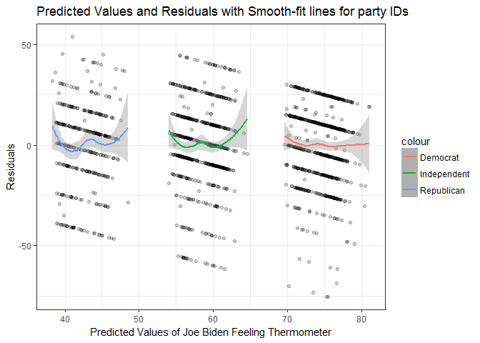

PS5: Linear Regression
================
Cheng Yee Lim
12th February 2017

1. Describe the data (1 point)
==============================

Plot a histogram of `biden` with a binwidth of `1`. Make sure to give the graph a title and proper *x* and *y*-axis labels. In a few sentences, describe any interesting features of the graph.

2. Simple linear regression (2 points)
======================================

Estimate the following linear regression:

*Y* = *β*0 + *β*1*X*1

where *Y* is the Joe Biden feeling thermometer and *X*1 is age. Report the parameters and standard errors.

| term        |    estimate|  std.error|  statistic|    p.value|
|:------------|-----------:|----------:|----------:|----------:|
| (Intercept) |  59.1973601|  1.6479189|  35.922496|  0.0000000|
| age         |   0.0624054|  0.0326682|   1.910281|  0.0562553|

a. Is there a relationship between the predictor and the response?
------------------------------------------------------------------

Yes, there is a relationship between age and the Joe Biden feeling thermometer at 10% significance level.

b. How strong is the relationship between the predictor and the response?
-------------------------------------------------------------------------

The relationship between age and the Joe Biden feeling thermometer is not very strong as the probability of finding the observed results when there is no relationship between age and the Joe Biden feeling thermometer is 5.63%. This means that at 5% and 1% significance level, there is no relationship between age and the Joe Biden feeling thermometer.

c. Is the relationship between the predictor and the response positive or negative?
-----------------------------------------------------------------------------------

The relationship betweeen age and Joe Biden feeling thermometer is positive. A year increase in age will result in an increase of 0.0624 in the Joe Biden feeling thermometer.

d. Report the *R*2 of the model. What percentage of the variation in biden does age alone explain? Is this a good or bad model?
------------------------------------------------------------------------------------------------------------------------------------------

|  r.squared|  adj.r.squared|     sigma|  statistic|    p.value|   df|     logLik|       AIC|       BIC|  deviance|  df.residual|
|----------:|--------------:|---------:|----------:|----------:|----:|----------:|---------:|---------:|---------:|------------:|
|  0.0020176|      0.0014647|  23.44485|   3.649174|  0.0562553|    2|  -8263.475|  16532.95|  16549.45|  992137.7|         1805|

The *R*2 of the model is 0.00202. This is a very bad model as `age` alone only explains 0.2% of the variation in `biden`. A good model should be able to capture almost all the variation in `biden` and the *R*2 would be close to 1.

e. What is the predicted biden associated with an age of 45? What are the associated 95% confidence intervals?
--------------------------------------------------------------------------------------------------------------

|      fit|       lwr|       upr|
|--------:|---------:|---------:|
|  62.0056|  60.91177|  63.09943|

The predicted Biden warmth score associated with an age of 45 is 62.0 with a 95% confidence interval of \[60.9, 63.1\].

f. Plot the response and predictor. Draw the least squares regression line.
---------------------------------------------------------------------------

3. Multiple linear regression (2 points)
========================================

It is unlikely `age` alone shapes attitudes towards Joe Biden. Estimate the following linear regression:

*Y* = *β*0 + *β*1*X*1 + *β*2*X*2 + *β*3*X*3

where *Y* is the Joe Biden feeling thermometer, *X*1 is age, *X*2 is gender, and *X*3 is education. Report the parameters and standard errors.

| term        |    estimate|  std.error|  statistic|    p.value|
|:------------|-----------:|----------:|----------:|----------:|
| (Intercept) |  68.6210140|  3.5960047|  19.082571|  0.0000000|
| age         |   0.0418792|  0.0324858|   1.289154|  0.1975099|
| female      |   6.1960695|  1.0966970|   5.649755|  0.0000000|
| educ        |  -0.8887126|  0.2246918|  -3.955251|  0.0000794|

a. Is there a statistically significant relationship between the predictors and response?
-----------------------------------------------------------------------------------------

    ## 
    ## Call:
    ## lm(formula = biden ~ age + female + educ, data = joe)
    ## 
    ## Residuals:
    ##     Min      1Q  Median      3Q     Max 
    ## -67.084 -14.662   0.703  18.847  45.105 
    ## 
    ## Coefficients:
    ##             Estimate Std. Error t value Pr(>|t|)    
    ## (Intercept) 68.62101    3.59600  19.083  < 2e-16 ***
    ## age          0.04188    0.03249   1.289    0.198    
    ## female       6.19607    1.09670   5.650 1.86e-08 ***
    ## educ        -0.88871    0.22469  -3.955 7.94e-05 ***
    ## ---
    ## Signif. codes:  0 '***' 0.001 '**' 0.01 '*' 0.05 '.' 0.1 ' ' 1
    ## 
    ## Residual standard error: 23.16 on 1803 degrees of freedom
    ## Multiple R-squared:  0.02723,    Adjusted R-squared:  0.02561 
    ## F-statistic: 16.82 on 3 and 1803 DF,  p-value: 8.876e-11

There is a statistically significant relationship between the predictors and the Joe Biden feeling thermometer. The joint null hypothesis where age, gender and education all have no relationship between the Joe Biden feeling thermometer is rejected at 1% significance level, as the p-value of the model is 8.86 \* 10−11.

Individually, female and education have statistically significant relationship with the Joe Biden feeling thermometer at 1% significance level. The p-value of female and education is 0.00 and 7.94 \* 10−5. However, age is not statiscally significant at 1%, 5% and 10% significance level. The p-value for age is 0.1975.

b. What does the parameter for female suggest?
----------------------------------------------

The estimated coefficient for `female` suggests that an average female has a higher feeling thermometer score towards Joe Biden by 6.197 than an average male.

c. Report the *R*2 of the model. What percentage of the variation in biden does age, gender, and education explain? Is this a better or worse model than the age-only model?
---------------------------------------------------------------------------------------------------------------------------------------------------------------------------------------

|  r.squared|  adj.r.squared|     sigma|  statistic|  p.value|   df|     logLik|       AIC|       BIC|  deviance|  df.residual|
|----------:|--------------:|---------:|----------:|--------:|----:|----------:|---------:|---------:|---------:|------------:|
|  0.0272273|      0.0256087|  23.15967|   16.82159|        0|    4|  -8240.359|  16490.72|  16518.22|  967075.7|         1803|

The *R*2 of the model is 0.0272. `age`, `gender` and `education` explains 2.72% of the variation in `biden`. It is a better model than the age-only model, as it explains for more variation in `biden`.

d. Generate a plot comparing the predicted values and residuals, drawing separate smooth fit lines for each party ID type. Is there a problem with this model? If so, what?
---------------------------------------------------------------------------------------------------------------------------------------------------------------------------

There is a problem with this model. The plot shows that there are different effects on the residual values for each party affliation. This suggests that party affliation should be included in the model, as democrats-affliated, republican-affliated and politically independent individuals should be differentiated in the model.

4. Multiple linear regression model (with even more variables!) (3 points)
==========================================================================

Estimate the following linear regression:

*Y* = *β*0 + *β*1*X*1 + *β*2*X*2 + *β*3*X*3 + *β*4*X*4 + *β*5*X*5

where *Y* is the Joe Biden feeling thermometer, *X*1 is age, *X*2 is gender, *X*3 is education, *X*4 is Democrat, and *X*5 is Republican. Report the parameters and standard errors.

| term        |     estimate|  std.error|   statistic|    p.value|
|:------------|------------:|----------:|-----------:|----------:|
| (Intercept) |   58.8112590|  3.1244366|   18.822996|  0.0000000|
| age         |    0.0482589|  0.0282474|    1.708438|  0.0877274|
| female      |    4.1032301|  0.9482286|    4.327258|  0.0000159|
| educ        |   -0.3453348|  0.1947796|   -1.772952|  0.0764057|
| dem         |   15.4242556|  1.0680327|   14.441745|  0.0000000|
| rep         |  -15.8495061|  1.3113624|  -12.086290|  0.0000000|

a. Did the relationship between gender and Biden warmth change?
---------------------------------------------------------------

Yes, the relationship between gender and Biden warmth became less positive, changing from 6.197 to 4.103.

b. Report the *R*2 of the model. What percentage of the variation in biden does age, gender, education, and party identification explain? Is this a better or worse model than the age + gender + education model?
-----------------------------------------------------------------------------------------------------------------------------------------------------------------------------------------------------------------------------

|  r.squared|  adj.r.squared|     sigma|  statistic|  p.value|   df|     logLik|       AIC|       BIC|  deviance|  df.residual|
|----------:|--------------:|---------:|----------:|--------:|----:|----------:|---------:|---------:|---------:|------------:|
|  0.2815391|      0.2795445|  19.91449|   141.1495|        0|    6|  -7966.563|  15947.13|  15985.62|  714253.2|         1801|

The *R*2 of the model is 0.2815. Age, gender, education and party identification explains 28.15% of the variation in `biden`. This is a much better model than the age, gender and education, as more variation is explained. However, this model still does not capture most of the variation in `biden`, a good model will have a *R*2 close to 1.

c. Generate a plot comparing the predicted values and residuals, drawing separate smooth fit lines for each party ID type. By adding variables for party ID to the regression model, did we fix the previous problem?
---------------------------------------------------------------------------------------------------------------------------------------------------------------------------------------------------------------------

Yes, we fixed the previous problem by including dummy variables representing party affliation in the model. Previously, the three smooth fit lines had different intercepts and gradient. Upon correcting for party affliation, the three smooth fit lines have similar slope and and intercept values, suggesting that party affliation no longer has an effect on the residual values.

5. Interactive linear regression model (2 points)
=================================================

*Y* = *β*0 + *β*1*X*1 + *β*2*X*2 + *β*3*X*1*X*2

where *Y* is the Joe Biden feeling thermometer, *X*1 is gender, and *X*2 is Democrat. Report the parameters and standard errors.

    ##          term  estimate std.error statistic       p.value
    ## 1 (Intercept) 39.382022  1.455363 27.059928 4.045546e-125
    ## 2      female  6.395180  2.017807  3.169371  1.568102e-03
    ## 3         dem 33.687514  1.834799 18.360328  3.295008e-66
    ## 4  female:dem -3.945888  2.471577 -1.596506  1.106513e-01

a. Estimate predicted Biden warmth feeling thermometer ratings and 95% confidence intervals for female Democrats, female Republicans, male Democrats, and male Republicans. Does the relationship between party ID and Biden warmth differ for males/females? Does the relationship between gender and Biden warmth differ for Democrats/Republicans?
-----------------------------------------------------------------------------------------------------------------------------------------------------------------------------------------------------------------------------------------------------------------------------------------------------------------------------------------------------

    ##        fit      lwr      upr
    ## 1 75.51883 73.77632 77.26133
    ## 2 45.77720 43.03494 48.51947
    ## 3 73.06954 70.87731 75.26176
    ## 4 39.38202 36.52655 42.23750

Individual 1, female Democrat, has a predicted Biden warmth feeling thermometer rating of 75.5 and a 95% confidence interval from 73.8 to 77.3.
Individual 2, female Republican, has a predicted Biden warmth feeling thermometer rating of 45.8 and a 95% confidence interval from 43.0 to 48.5.
Individual 3, male Democrat, has a predicted Biden warmth feeling thermometer rating of 73.1 and a 95% confidence interval from 70.9 to 75.3.
Individual 4, male Republican, has a predicted Biden warmth feeling thermometer rating of 39.4 and a 95% confidence interval from 36.5 to 42.2.

The relationship between party ID and Biden warmth appear to be different for males and females. This is especially so for Republican affliated individuals. The 95% confidence interval for Republican males and females do not overlap, suggesting a significant difference in their Biden warmth scores. The upper bound of the confidence interval of Republican males is 42.2 whereas the lower bound of the confidence interval for Republican females is 43.0. The difference between male and female Democrats are less stark, with overlapping 95% confidence intervals.
