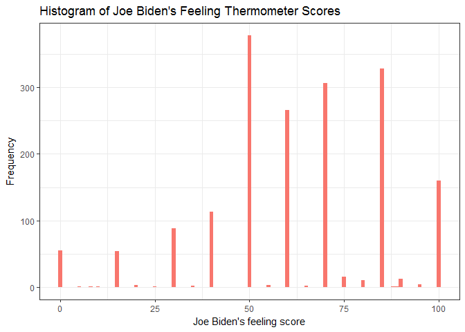
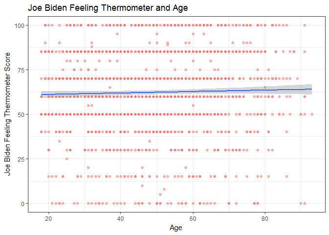
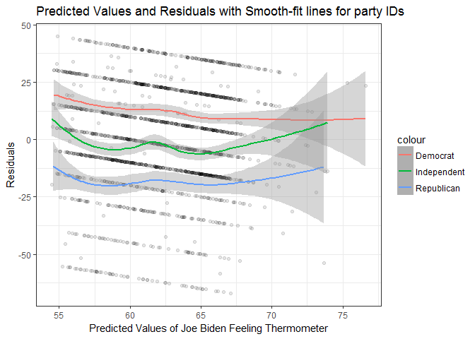

Problem set \#5: linear regression
================
MACS 30100 - Perspectives on Computational Modeling
**Due Monday February 13th at 11:30am**

-   [1. Describe the data (1 point)](#describe-the-data-1-point)
-   [2. Simple linear regression (2 points)](#simple-linear-regression-2-points)
    -   [a. Is there a relationship between the predictor and the response?](#a.-is-there-a-relationship-between-the-predictor-and-the-response)
    -   [b. How strong is the relationship between the predictor and the response?](#b.-how-strong-is-the-relationship-between-the-predictor-and-the-response)
    -   [c. Is the relationship between the predictor and the response positive or negative?](#c.-is-the-relationship-between-the-predictor-and-the-response-positive-or-negative)
    -   [d. Report the *R*<sup>2</sup> of the model. What percentage of the variation in biden does age alone explain? Is this a good or bad model?](#d.-report-the-r2-of-the-model.-what-percentage-of-the-variation-in-biden-does-age-alone-explain-is-this-a-good-or-bad-model)
    -   [e. What is the predicted biden associated with an age of 45? What are the associated 95% confidence intervals?](#e.-what-is-the-predicted-biden-associated-with-an-age-of-45-what-are-the-associated-95-confidence-intervals)
    -   [f. Plot the response and predictor. Draw the least squares regression line.](#f.-plot-the-response-and-predictor.-draw-the-least-squares-regression-line.)
-   [3. Multiple linear regression (2 points)](#multiple-linear-regression-2-points)
    -   [a. Is there a statistically significant relationship between the predictors and response?](#a.-is-there-a-statistically-significant-relationship-between-the-predictors-and-response)
    -   [b. What does the parameter for female suggest?](#b.-what-does-the-parameter-for-female-suggest)
    -   [c. Report the *R*<sup>2</sup> of the model. What percentage of the variation in biden does age, gender, and education explain? Is this a better or worse model than the age-only model?](#c.-report-the-r2-of-the-model.-what-percentage-of-the-variation-in-biden-does-age-gender-and-education-explain-is-this-a-better-or-worse-model-than-the-age-only-model)
    -   [d. Generate a plot comparing the predicted values and residuals, drawing separate smooth fit lines for each party ID type. Is there a problem with this model? If so, what?](#d.-generate-a-plot-comparing-the-predicted-values-and-residuals-drawing-separate-smooth-fit-lines-for-each-party-id-type.-is-there-a-problem-with-this-model-if-so-what)
-   [Multiple linear regression model (with even more variables!) (3 points)](#multiple-linear-regression-model-with-even-more-variables-3-points)
    -   [b. Report the *R*<sup>2</sup> of the model. What percentage of the variation in biden does age, gender, education, and party identification explain? Is this a better or worse model than the age + gender + education model?](#b.-report-the-r2-of-the-model.-what-percentage-of-the-variation-in-biden-does-age-gender-education-and-party-identification-explain-is-this-a-better-or-worse-model-than-the-age-gender-education-model)
-   [Interactive linear regression model (2 points)](#interactive-linear-regression-model-2-points)

[Joe Biden](https://en.wikipedia.org/wiki/Joe_Biden) was the 47th Vice President of the United States. He was the subject of [many memes](http://distractify.com/trending/2016/11/16/best-of-joe-and-obama-memes), [attracted the attention of Leslie Knope](https://www.youtube.com/watch?v=NvbMB_GGR6s), and [experienced a brief surge in attention due to photos from his youth](http://www.huffingtonpost.com/entry/joe-young-hot_us_58262f53e4b0c4b63b0c9e11).

`biden.csv` contains a selection of variables from the [2008 American National Election Studies survey](http://www.electionstudies.org/) that allow you to test competing factors that may influence attitudes towards Joe Biden. The variables are coded as follows:

-   `biden` - feeling thermometer ranging from 0-100[1]
-   `female` - 1 if respondent is female, 0 if respondent is male
-   `age` - age of respondent in years
-   `dem` - 1 if respondent is a Democrat, 0 otherwise
-   `rep` - 1 if respondent is a Republican, 0 otherwise
-   `educ` - number of years of formal education completed by respondent
    -   `17` - 17+ years (aka first year of graduate school and up)

``` r
joe <- read.csv("./data/biden.csv")
```

1. Describe the data (1 point)
==============================

Plot a histogram of `biden` with a binwidth of `1`. Make sure to give the graph a title and proper *x* and *y*-axis labels. In a few sentences, describe any interesting features of the graph.

``` r
joe %>%
  ggplot() + 
  geom_histogram(aes(x = biden), binwidth = 1) + 
  labs(title = "Histogram of Joe Biden's Feeling Thermometer Scores", 
       x = "Joe Biden's feeling score",
       y = "Frequency")
```



2. Simple linear regression (2 points)
======================================

Estimate the following linear regression:

*Y* = *β*<sub>0</sub> + *β*<sub>1</sub>*X*<sub>1</sub>

where *Y* is the Joe Biden feeling thermometer and *X*<sub>1</sub> is age. Report the parameters and standard errors.

``` r
#part (a), (b), (c)
joe_mod <- lm(biden ~ age, data = joe)
tidy(joe_mod) %>% 
  kable()
```

| term        |    estimate|  std.error|  statistic|    p.value|
|:------------|-----------:|----------:|----------:|----------:|
| (Intercept) |  59.1973601|  1.6479189|  35.922496|  0.0000000|
| age         |   0.0624054|  0.0326682|   1.910281|  0.0562553|

a. Is there a relationship between the predictor and the response?
------------------------------------------------------------------

Yes, there is a relationship between age and the Joe Biden feeling thermometer at 10% significance level.

b. How strong is the relationship between the predictor and the response?
-------------------------------------------------------------------------

The relationship between age and the Joe Biden feeling thermometer is rather strong as the probability of finding the observed results when there is no relationship between age and the Joe Biden feeling thermometer is 5.63%.

c. Is the relationship between the predictor and the response positive or negative?
-----------------------------------------------------------------------------------

The relationship betweeen age and Joe Biden feeling thermometer is positive. A year increase in age results in an increase of 0.0624 in the Joe Biden feeling thermometer.

d. Report the *R*<sup>2</sup> of the model. What percentage of the variation in biden does age alone explain? Is this a good or bad model?
------------------------------------------------------------------------------------------------------------------------------------------

``` r
#part (d)
glance(joe_mod) %>%
  kable()
```

|  r.squared|  adj.r.squared|     sigma|  statistic|    p.value|   df|     logLik|       AIC|       BIC|  deviance|  df.residual|
|----------:|--------------:|---------:|----------:|----------:|----:|----------:|---------:|---------:|---------:|------------:|
|  0.0020176|      0.0014647|  23.44485|   3.649174|  0.0562553|    2|  -8263.475|  16532.95|  16549.45|  992137.7|         1805|

The *R*<sup>2</sup> of the model is 0.00202. `age` alone explains 0.2% of the variation in `biden`. This is a bad model as a good model should be able to capture almost all the variation in `biden` and the *R*<sup>2</sup> would be close to 1.

e. What is the predicted biden associated with an age of 45? What are the associated 95% confidence intervals?
--------------------------------------------------------------------------------------------------------------

``` r
#part(e)
newdata <- data.frame(age = 45)

predict(joe_mod, newdata, interval = "confidence") %>%
  kable(colnames(c("Predicted", "5% CI", "95% CI")))
```

|      fit|       lwr|       upr|
|--------:|---------:|---------:|
|  62.0056|  60.91177|  63.09943|

f. Plot the response and predictor. Draw the least squares regression line.
---------------------------------------------------------------------------

``` r
joe %>%
  ggplot() + 
  geom_point(aes(x=age, y=biden)) + 
  geom_smooth(aes(x = age, y = biden)) + 
  labs(title = "Joe Biden Feeling Thermometer and Age",
       y = "Joe Biden Feeling Thermometer Score", 
       x = "Age")
```

    ## `geom_smooth()` using method = 'gam'



3. Multiple linear regression (2 points)
========================================

It is unlikely `age` alone shapes attitudes towards Joe Biden. Estimate the following linear regression:

*Y* = *β*<sub>0</sub> + *β*<sub>1</sub>*X*<sub>1</sub> + *β*<sub>2</sub>*X*<sub>2</sub> + *β*<sub>3</sub>*X*<sub>3</sub>

where *Y* is the Joe Biden feeling thermometer, *X*<sub>1</sub> is age, *X*<sub>2</sub> is gender, and *X*<sub>3</sub> is education. Report the parameters and standard errors.

``` r
joe_mod2 <- lm(biden ~ age + female + educ, data = joe) 
tidy(joe_mod2) %>%
  kable()
```

| term        |    estimate|  std.error|  statistic|    p.value|
|:------------|-----------:|----------:|----------:|----------:|
| (Intercept) |  68.6210140|  3.5960047|  19.082571|  0.0000000|
| age         |   0.0418792|  0.0324858|   1.289154|  0.1975099|
| female      |   6.1960695|  1.0966970|   5.649755|  0.0000000|
| educ        |  -0.8887126|  0.2246918|  -3.955251|  0.0000794|

``` r
summary(joe_mod2)
```

    ## 
    ## Call:
    ## lm(formula = biden ~ age + female + educ, data = joe)
    ## 
    ## Residuals:
    ##     Min      1Q  Median      3Q     Max 
    ## -67.084 -14.662   0.703  18.847  45.105 
    ## 
    ## Coefficients:
    ##             Estimate Std. Error t value Pr(>|t|)    
    ## (Intercept) 68.62101    3.59600  19.083  < 2e-16 ***
    ## age          0.04188    0.03249   1.289    0.198    
    ## female       6.19607    1.09670   5.650 1.86e-08 ***
    ## educ        -0.88871    0.22469  -3.955 7.94e-05 ***
    ## ---
    ## Signif. codes:  0 '***' 0.001 '**' 0.01 '*' 0.05 '.' 0.1 ' ' 1
    ## 
    ## Residual standard error: 23.16 on 1803 degrees of freedom
    ## Multiple R-squared:  0.02723,    Adjusted R-squared:  0.02561 
    ## F-statistic: 16.82 on 3 and 1803 DF,  p-value: 8.876e-11

a. Is there a statistically significant relationship between the predictors and response?
-----------------------------------------------------------------------------------------

There is a statistically significant relationship between the predictors and the Joe Biden feeling thermometer. The joint null hypothesis where age, gender and education all have no relationship between the Joe Biden feeling thermometer is rejected at 1% significance level, as the p-value of the model is 8.86 \* 10<sup>−</sup>11.

Individually, female and education have statistically significant relationship with the Joe Biden feeling thermometer at 1% significance level. The p-value of female and education is 0.00 and 7.94 \* 10<sup>−</sup>5. However, age does not have a statiscally significant at 1%, 5% and 10% significance level. The p-value for age is 0.1975.

b. What does the parameter for female suggest?
----------------------------------------------

The estimated coefficient for `female` suggests that an average female has a higher feeling thermometer score towards Joe Biden by 6.197 than an average male.

c. Report the *R*<sup>2</sup> of the model. What percentage of the variation in biden does age, gender, and education explain? Is this a better or worse model than the age-only model?
---------------------------------------------------------------------------------------------------------------------------------------------------------------------------------------

``` r
glance(joe_mod2) %>%
  kable()
```

|  r.squared|  adj.r.squared|     sigma|  statistic|  p.value|   df|     logLik|       AIC|       BIC|  deviance|  df.residual|
|----------:|--------------:|---------:|----------:|--------:|----:|----------:|---------:|---------:|---------:|------------:|
|  0.0272273|      0.0256087|  23.15967|   16.82159|        0|    4|  -8240.359|  16490.72|  16518.22|  967075.7|         1803|

The *R*<sup>2</sup> of the model is 0.0272. `age`, `gender` and `education` explains 2.72% of the variation in `biden`. It is a better model than the age-only model, as it explains for more variation in `biden`.

d. Generate a plot comparing the predicted values and residuals, drawing separate smooth fit lines for each party ID type. Is there a problem with this model? If so, what?
---------------------------------------------------------------------------------------------------------------------------------------------------------------------------

There is a problem with this model. The plot shows that there are different effects on the residual values for each party affliation. This suggests that party affliation should be included in the model, as democrats-affliated, republican-affliated and politically independent individuals should be differentiated in the model.

``` r
joe3d <- joe %>%
  add_predictions(joe_mod2) %>%
  add_residuals(joe_mod2) 

demo <- joe3d %>%
  subset(dem == 1)

repu <- joe3d %>%
  subset(rep == 1)

ind <- joe3d %>% 
  subset(dem == 0 & rep == 0)

ggplot() + 
  geom_point(data = joe3d, aes(x = pred, y = resid)) + 
  geom_smooth(data = demo, aes(x = pred, y = resid, color = "Democrat")) + 
  geom_smooth(data = repu, aes(x = pred, y = resid, color = "Republican")) + 
  geom_smooth(data = ind, aes(x = pred, y = resid, color = "Independent")) + 
  labs(title = "Predicted Values and Residuals with Smooth-fit lines for party IDs", 
       x = "Predicted Values of Joe Biden Feeling Thermometer",
       y = "Residuals") +
  theme_bw()
```

    ## `geom_smooth()` using method = 'loess'
    ## `geom_smooth()` using method = 'loess'
    ## `geom_smooth()` using method = 'loess'



Multiple linear regression model (with even more variables!) (3 points)
=======================================================================

Estimate the following linear regression:

*Y* = *β*<sub>0</sub> + *β*<sub>1</sub>*X*<sub>1</sub> + *β*<sub>2</sub>*X*<sub>2</sub> + *β*<sub>3</sub>*X*<sub>3</sub> + *β*<sub>4</sub>*X*<sub>4</sub> + *β*<sub>5</sub>*X*<sub>5</sub>

where *Y* is the Joe Biden feeling thermometer, *X*<sub>1</sub> is age, *X*<sub>2</sub> is gender, *X*<sub>3</sub> is education, *X*<sub>4</sub> is Democrat, and *X*<sub>5</sub> is Republican.[2] Report the parameters and standard errors.

``` r
joe_mod3 <- lm(biden ~ age + female + educ + dem + rep, data = joe) 
tidy(joe_mod3) %>%
  kable()
```

| term             |        estimate|     std.error|     statistic|                                              p.value|
|:-----------------|---------------:|-------------:|-------------:|----------------------------------------------------:|
| (Intercept)      |      58.8112590|     3.1244366|     18.822996|                                            0.0000000|
| age              |       0.0482589|     0.0282474|      1.708438|                                            0.0877274|
| female           |       4.1032301|     0.9482286|      4.327258|                                            0.0000159|
| educ             |      -0.3453348|     0.1947796|     -1.772952|                                            0.0764057|
| dem              |      15.4242556|     1.0680327|     14.441745|                                            0.0000000|
| rep              |     -15.8495061|     1.3113624|    -12.086290|                                            0.0000000|
| \#\#a. Did the r |  elationship be|  tween gender|  and Biden wa|                                         rmth change?|
| Yes, the relat   |  ionship betwee|  n gender and|  Biden warmth|  became less positive, changing from 6.197 to 4.103.|

b. Report the *R*<sup>2</sup> of the model. What percentage of the variation in biden does age, gender, education, and party identification explain? Is this a better or worse model than the age + gender + education model?
-----------------------------------------------------------------------------------------------------------------------------------------------------------------------------------------------------------------------------

``` r
summary(joe_mod3)
```

    ## 
    ## Call:
    ## lm(formula = biden ~ age + female + educ + dem + rep, data = joe)
    ## 
    ## Residuals:
    ##     Min      1Q  Median      3Q     Max 
    ## -75.546 -11.295   1.018  12.776  53.977 
    ## 
    ## Coefficients:
    ##              Estimate Std. Error t value Pr(>|t|)    
    ## (Intercept)  58.81126    3.12444  18.823  < 2e-16 ***
    ## age           0.04826    0.02825   1.708   0.0877 .  
    ## female        4.10323    0.94823   4.327 1.59e-05 ***
    ## educ         -0.34533    0.19478  -1.773   0.0764 .  
    ## dem          15.42426    1.06803  14.442  < 2e-16 ***
    ## rep         -15.84951    1.31136 -12.086  < 2e-16 ***
    ## ---
    ## Signif. codes:  0 '***' 0.001 '**' 0.01 '*' 0.05 '.' 0.1 ' ' 1
    ## 
    ## Residual standard error: 19.91 on 1801 degrees of freedom
    ## Multiple R-squared:  0.2815, Adjusted R-squared:  0.2795 
    ## F-statistic: 141.1 on 5 and 1801 DF,  p-value: < 2.2e-16

1.  Generate a plot comparing the predicted values and residuals, drawing separate smooth fit lines for each party ID type. By adding variables for party ID to the regression model, did we fix the previous problem?

Interactive linear regression model (2 points)
==============================================

Let's explore this relationship between gender and Biden warmth more closely. Perhaps the effect of gender on Biden warmth differs between partisan affiliation. That is, not only do we need to account for the effect of party ID in our linear regression model, but that gender has a different effect for Democrats and Republicans. Democrats are already predisposed to favor Joe Biden and have warm thoughts about him, whereas Republicans are predisposed to dislike him. But because Biden is so charming, he can woo female Republicans better than male Republicans. This suggests an **interactive** relationship between gender and party ID.

Filter your dataset to remove any independent respondents (keeping only those who identify as Democrats or Republicans), and estimate the following linear regression:

*Y* = *β*<sub>0</sub> + *β*<sub>1</sub>*X*<sub>1</sub> + *β*<sub>2</sub>*X*<sub>2</sub> + *β*<sub>3</sub>*X*<sub>1</sub>*X*<sub>2</sub>

where *Y* is the Joe Biden feeling thermometer, *X*<sub>1</sub> is gender, and *X*<sub>2</sub> is Democrat. Report the parameters and standard errors.

1.  Estimate predicted Biden warmth feeling thermometer ratings and 95% confidence intervals for female Democrats, female Republicans, male Democrats, and male Republicans. Does the relationship between party ID and Biden warmth differ for males/females? Does the relationship between gender and Biden warmth differ for Democrats/Republicans?

[1] Feeling thermometers are a common metric in survey research used to gauge attitudes or feelings of warmth towards individuals and institutions. They range from 0-100, with 0 indicating extreme coldness and 100 indicating extreme warmth.

[2] Independents must be left out to serve as the baseline category, otherwise we would encounter perfect multicollinearity.
