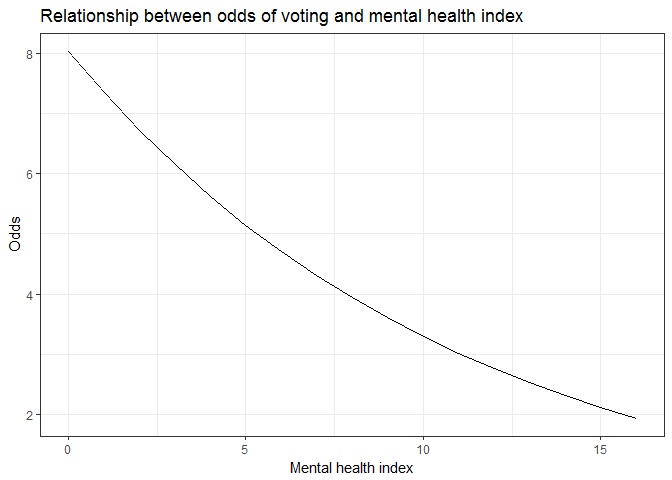
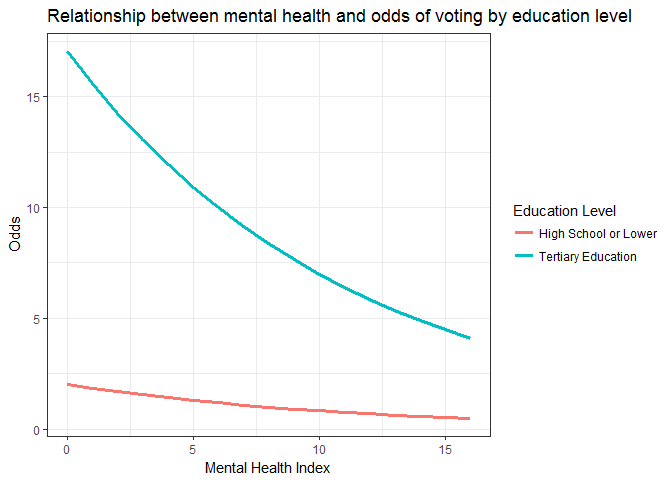
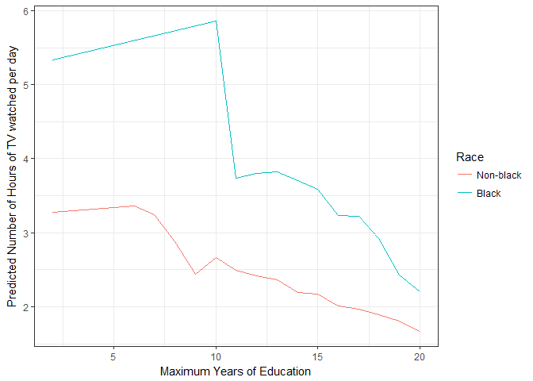
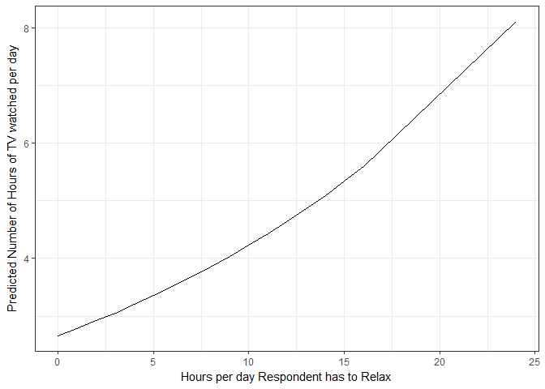

PS6
================
Cheng Yee Lim
17th February 2017

Part 1: Modeling Voter Turnout
------------------------------

### Describe the data (1 point)

#### Plot a histogram of voter turnout. Make sure to give the graph a title and proper *x* and *y*-axis labels. What is the unconditional probability of a given individual turning out to vote?

``` r
health %>% 
  filter(!is.na(vote96)) %>%
  ggplot() + 
  geom_bar(aes(x = factor(vote96)), fill = "deepskyblue1") + 
  labs(x = "Voter Turnout", 
       y = "Count") + 
  scale_x_discrete(breaks = c(0,1), 
                   labels = c("Did not vote", "Voted"))
```

 The unconditional probability of a given respondent voting in the election is 0.6755365.

#### Generate a scatterplot of the relationship between mental health and observed voter turnout and overlay a linear smoothing line. What information does this tell us? What is problematic about this linear smoothing line?

``` r
health %>%
  filter(!is.na(mhealth_sum) & !is.na(vote96)) %>%
  ggplot(aes(x = mhealth_sum, y = vote96)) + 
  geom_point() + 
  geom_smooth(method = "lm", color = "deepskyblue1") + 
  labs(x = "Mental Health Index", 
       y = "Voter Turnout")
```


### Basic model (3 points)

#### Estimate a logistic regression model of the relationship between mental health and voter turnout.

*v**o**t**e*<sub>*i*</sub> = *β*<sub>0</sub> + *β*<sub>1</sub>*h**e**a**l**t**h*<sub>*i*</sub>

``` r
m_voter <- glm(vote96 ~ mhealth_sum, data = health, family = binomial)
summary(m_voter)
```

    ## 
    ## Call:
    ## glm(formula = vote96 ~ mhealth_sum, family = binomial, data = health)
    ## 
    ## Deviance Residuals: 
    ##     Min       1Q   Median       3Q      Max  
    ## -1.6834  -1.2977   0.7452   0.8428   1.6911  
    ## 
    ## Coefficients:
    ##             Estimate Std. Error z value Pr(>|z|)    
    ## (Intercept)  1.13921    0.08444  13.491  < 2e-16 ***
    ## mhealth_sum -0.14348    0.01969  -7.289 3.13e-13 ***
    ## ---
    ## Signif. codes:  0 '***' 0.001 '**' 0.01 '*' 0.05 '.' 0.1 ' ' 1
    ## 
    ## (Dispersion parameter for binomial family taken to be 1)
    ## 
    ##     Null deviance: 1672.1  on 1321  degrees of freedom
    ## Residual deviance: 1616.7  on 1320  degrees of freedom
    ##   (1510 observations deleted due to missingness)
    ## AIC: 1620.7
    ## 
    ## Number of Fisher Scoring iterations: 4

#### Is the relationship between mental health and voter turnout statistically significant?

The relationship between mental health and voter turnout has a p-value of 3.13 \* 10<sup>−13</sup> is statistically significant at 1% significance level.

#### Interpret the estimated parameter for mental health in terms of log-odds.

For every one-unit increase in an individual's mental health (where 0 is an individual with no depressed feelings, and 9 is an individual with the most severe depressed mood), we expect the log-odds of voting to decrease by 0.143.

#### Generate a graph of the relationship between mental health and the log-odds of voter turnout.

``` r
#defining some functions 
logit2prob <- function(x){
  exp(x) / (1 + exp(x))
}

prob2odds <- function(x){
  x / (1 - x)
}

prob2logodds <- function(x){
  log(prob2odds(x))
}

health_vals <- health %>%
  filter(!is.na(mhealth_sum) & mhealth_sum > 0) %>%
  add_predictions(m_voter) %>% 
  mutate(prob = logit2prob(pred), 
         logodds = prob2logodds(prob), 
         odds = prob2odds(prob)) 

health_vals %>% 
  ggplot(aes(x = mhealth_sum, y = logodds)) + 
  geom_line() + 
  labs(x = "Mental Health Index", 
       y = "Log-odds") 
```


#### Interpret the estimated parameter for mental health in terms of odds. Generate a graph of the relationship between mental health and the odds of voter turnout.

The relationship between mental health and the odds of turning up to vote is 0.892.

``` r
exp(-0.114)
```

    ## [1] 0.892258

``` r
health_vals %>% 
  ggplot(aes(x = mhealth_sum, y = odds)) + 
  geom_line() + 
  labs(x = "Mental Health Index", 
       y = "Odds") 
```


#### Interpret the estimated parameter for mental health in terms of probabilities. Generate a graph of the relationship between mental health and the probability of voter turnout. What is the first difference for an increase in the mental health index from 1 to 2? What about for 5 to 6?

The expected change in probability given an unit increase in the mental health index is -0.0273.
The first difference for an increase in the mental health index from 1 to 2 is -0.0292.
The first difference for an increase in the mental health index from 5 to 6 is -0.0348.

``` r
health_vals %>% 
  ggplot(aes(x = mhealth_sum, y = pred)) + 
  geom_line() + 
  labs(x = "Mental Health Index", 
       y = "Predicted Probabilities") 
```


``` r
probability <- function(x, y){ 
  exp(1.13921 - 0.14348*y)/(1 + exp(1.13921 - 0.14348*y)) - exp(1.13921 - 0.14348*x)/(1+exp(1.13921 - 0.14348*x))
}
cat("First Difference from an increase in mental health index = ", probability(1,2))
```

    ## First Difference from an increase in mental health index =  -0.0291793

``` r
cat("First Difference from an increase in mental health index = ", probability(5,6))
```

    ## First Difference from an increase in mental health index =  -0.03477953

#### Estimate the accuracy rate, proportional reduction in error (PRE), and the AUC for this model. Do you consider it to be a good model?

It is a decent model, it results in an improvement of 16.1% from the baseline model. The accuracy rate in predicting voter turnout is 66.8%. The proportional reduction in error is 16.1% and the AUC of the model is 0.668. The confusion matrix can be found below.

``` r
logit2prob <- function(x){
  exp(x) / (1 + exp(x))
} #logit2prob function

getmode <- function(v) {
   uniqv <- unique(v)
   uniqv[which.max(tabulate(match(v, uniqv)))]
} # determining best model 

mh_accuracy <- health %>%
  filter(!is.na(mhealth_sum & !is.na(vote96))) %>%
  add_predictions(m_voter) %>%
  mutate(pred2 = logit2prob(pred),
         pred2 = as.numeric(pred > .5))

mean(mh_accuracy$vote96 == mh_accuracy$pred2, na.rm = TRUE) #accuracy rate
```

    ## [1] 0.6680203

``` r
# function to calculate PRE for a logistic regression model
PRE <- function(model){
  # get the actual values for y from the data
  y <- model$y
  
  # get the predicted values for y from the model
  y.hat <- round(model$fitted.values)
  
  # calculate the errors for the null model and your model
  E1 <- sum(y != median(y))
  E2 <- sum(y != y.hat)
  
  # calculate the proportional reduction in error
  PRE <- (E1 - E2) / E1
  return(PRE)
}

PRE(m_voter)
```

    ## [1] 0.01616628

``` r
confusionMatrix(mh_accuracy$pred2, mh_accuracy$vote96)
```

    ## Confusion Matrix and Statistics
    ## 
    ##           Reference
    ## Prediction   0   1
    ##          0 149 129
    ##          1 198 509
    ##                                           
    ##                Accuracy : 0.668           
    ##                  95% CI : (0.6376, 0.6974)
    ##     No Information Rate : 0.6477          
    ##     P-Value [Acc > NIR] : 0.0962707       
    ##                                           
    ##                   Kappa : 0.238           
    ##  Mcnemar's Test P-Value : 0.0001696       
    ##                                           
    ##             Sensitivity : 0.4294          
    ##             Specificity : 0.7978          
    ##          Pos Pred Value : 0.5360          
    ##          Neg Pred Value : 0.7199          
    ##              Prevalence : 0.3523          
    ##          Detection Rate : 0.1513          
    ##    Detection Prevalence : 0.2822          
    ##       Balanced Accuracy : 0.6136          
    ##                                           
    ##        'Positive' Class : 0               
    ## 

### Multiple variable model (3 points)

Firstly, we assume our outcome variable, voter turnout, is drawn from the binomial distribution with probability *π*, given the values of the predicator variables in the model. In our model, *Y*<sub>*i*</sub> takes on the expected value of 1 with probability *π* and 0 with probability 1 − *π*, so *π*<sub>*i*</sub> is the conditional probability of sampling a 1 in this group.

Pr(*Y*<sub>*i*</sub> = *y*<sub>*i*</sub>|*π*) = *π*<sub>*i*</sub><sup>*y*<sub>*i*</sub></sup> (1 − *π*<sub>*i*</sub>)<sup>1 − *y*<sub>*i*</sub></sup>

Secondly, since the probability of voter turnout may systematically vary to given known predictors, we incorporate that into the model with a linear predictor. The linear predictor is:
*g*(*π*<sub>*i*</sub>)≡*ρ*<sub>*i*</sub> = *β*<sub>0</sub> + *β*<sub>1</sub>*h**e**a**l**t**h*<sub>*i*</sub> + *β*<sub>2</sub>*a**g**e*<sub>*i*</sub> + *β*<sub>3</sub>*e**d**u**c*<sub>*i*</sub> + *β*<sub>4</sub>*b**l**a**c**k*<sub>*i*</sub> + *β*<sub>5</sub>*m**a**r**r**i**e**d*<sub>*i*</sub> + *β*<sub>6</sub>*i**n**c**o**m**e*<sub>*i*</sub>

Thirdly, we use a logit link function to constrain the linear predictor to the \[0,1\] range. A link function, *g*(*π*<sub>*i*</sub>) = *e*<sup>*ρ*<sub>*i*</sub></sup> / (1 + *e*<sup>*ρ*<sub>*i*</sub></sup>), transforms the expectation of the vector turnout to the linear predictor.

The results of the estimated multivariate logistic regression can be found below:

``` r
health <- health %>% 
  na.omit()

voter <- glm(vote96 ~ mhealth_sum + age + educ + black + married + inc10, data = health, family = binomial)

summary(voter)
```

    ## 
    ## Call:
    ## glm(formula = vote96 ~ mhealth_sum + age + educ + black + married + 
    ##     inc10, family = binomial, data = health)
    ## 
    ## Deviance Residuals: 
    ##     Min       1Q   Median       3Q      Max  
    ## -2.4874  -1.0223   0.5169   0.8401   2.0791  
    ## 
    ## Coefficients:
    ##              Estimate Std. Error z value Pr(>|z|)    
    ## (Intercept) -4.310342   0.505521  -8.527  < 2e-16 ***
    ## mhealth_sum -0.089026   0.023635  -3.767 0.000165 ***
    ## age          0.042493   0.004802   8.849  < 2e-16 ***
    ## educ         0.228503   0.029492   7.748 9.33e-15 ***
    ## black        0.272160   0.202472   1.344 0.178890    
    ## married      0.297030   0.153152   1.939 0.052447 .  
    ## inc10        0.069892   0.026438   2.644 0.008203 ** 
    ## ---
    ## Signif. codes:  0 '***' 0.001 '**' 0.01 '*' 0.05 '.' 0.1 ' ' 1
    ## 
    ## (Dispersion parameter for binomial family taken to be 1)
    ## 
    ##     Null deviance: 1468.3  on 1164  degrees of freedom
    ## Residual deviance: 1241.8  on 1158  degrees of freedom
    ## AIC: 1255.8
    ## 
    ## Number of Fisher Scoring iterations: 4

From the regression results, we can identify that the mental health, age, education level and income are statistically significant in affecting voter turnout at a 1% significance level. For the ease of interpreting the coefficients, we exponentiate the estimated coefficients to interpret them as odd ratios.

``` r
coeff_1 <- exp(coef(voter))
coeff_1[3]
```

    ##      age 
    ## 1.043409

For a one unit increase in the mental health index (more depressed), the odds of voting (versus not voting) changes by a factor of 0.9148215, given that the rest of the variables remain unchanged.

``` r
#add predictions and create factor variables 
health1 <- health %>%
  data_grid(mhealth_sum, age, educ, black, married, inc10) %>%
  add_predictions(voter) %>%
  mutate(prob = logit2prob(pred), 
         odds = prob2odds(prob)) %>%
  mutate(inc_lvl = cut(inc10, 
                       breaks = 4, 
                       labels = c("Low income", "Low-middle income", "Middle-high income", "High income"))) %>% 
  mutate(educ_lvl = cut(educ, breaks = c(-0.99, 12, 20.1),
                        labels = c("High School or Lower", "Tertiary Education"))) 

health1 %>% 
  group_by(mhealth_sum) %>% 
  summarize(mean_odds = mean(odds)) %>% 
  ggplot() + 
  geom_line(aes(x = mhealth_sum, y = mean_odds)) + 
  labs(x = "Mental health index", 
       y = "Odds") + 
  ggtitle("Relationship between odds of voting and mental health index")
```



For a year increase in age, the odds of voting (versus not voting) changes by a factor of 1.0434091, given that the rest of the variables remain unchanged. The graph below evidences the increase in odds of voting as individuals become older, given the rest of the variables remain unchanged.

``` r
health1 %>% 
  group_by(age) %>% 
  summarize(mean_odds = mean(odds)) %>% 
  ggplot() + 
  geom_line(aes(x = age, y = mean_odds)) + 
  labs(x = "Age", 
       y = "Odds") + 
  ggtitle("Relationship between odds of voting and age")
```


For a year increase in maximum years of education, the odds of voting (versus not voting) changes by a factor of 1.256717, given that the rest of the variables remain unchanged. We differentiate individuals who have attained tertiary education from individuals who did not, and showed that the odds of voting are much higher for individuals who have attended tertiary education, when compared with individuals who have not.

``` r
health1 %>%
  group_by(educ_lvl, mhealth_sum) %>%
  mutate(mean_odds  = mean(odds)) %>%
  ggplot(aes(x = mhealth_sum, y = mean_odds)) +
  geom_line(aes(color = factor(educ_lvl)), size = 1.3) + 
  labs(x = "Mental Health Index", 
       y = "Odds") + 
  scale_color_discrete(name = "Education Level") + 
  ggtitle("Relationship between mental health and odds of voting by education level")
```



For a unit ($10,000) increase in family income, the odds of voting (versus not voting) changes by a factor of 1.0723923, given that the rest of the variables remain unchanged. We categorized family income by the quantile ranges, where bottom 25%, 25-50%, 50-75%, 75-100% percentile are low-income, low-middle income, high-middle income, and high income respectively. The graph shows the increase in odds to vote as family income increases.

``` r
health1 %>%
  group_by(inc_lvl, mhealth_sum) %>%
  mutate(mean_odds  = mean(odds)) %>%
  ggplot(aes(x = mhealth_sum, y = mean_odds)) +
  geom_line(aes(color = factor(inc_lvl)), size = 1.3) + 
  labs(x = "Mental Health Index", 
       y = "Odds") + 
  scale_color_discrete(name = "Family Income") +
  ggtitle("Relationship between mental health and odds of voting by family income level")
```


``` r
health_acc <- health %>% 
  add_predictions(voter) %>% 
  mutate(pred = logit2prob(pred), 
         pred = as.numeric(pred > .5))

mean(health_acc$vote96 == health_acc$pred)
```

    ## [1] 0.7236052

Part 2: Modelling TV Consumption
--------------------------------

``` r
gss <- read.csv("./data/gss2006.csv") %>% 
  na.omit()
```

### Describe the data

`health` contains a subset of the 2006 General Social Survey of 4510 American individuals in 2006. The response variable `tvhours` contains a count of TV hours watched per day for each individual in 2006.

``` r
gss %>% 
  ggplot() + 
  geom_histogram(aes(x = tvhours), fill = "deepskyblue1", binwidth=2) + 
  labs(x = "Number of hours of TV watched per day", 
       y = "Count", 
       title = "Histogram of TV hours watched per day") 
```


### Multivariate Poisson Regression Model of Hours of TV Watched

Firstly, we assume our outcome variable, number of hours of TV watched, is drawn from a poisson distribution, where Pr(*T**V**h**o**u**r**s*<sub>*i*</sub> = *k*|*μ*) = (*μ*<sup>*k*</sup>*e*<sup>−*μ*</sup>) / *k*! .

In our model of predicting number of hours of TV watched per day, we include the following additional variables:
1. `age` - Age (in years)
2. `childs` - Number of children
3. `educ` - Highest year of formal schooling completed
4. `female` - 1 if female, 0 if male
5. `hrsrelax` - Hours per day respondent has to relax
6. `black` - 1 if respondent is black, 0 otherwise
7. `social_connect` - Ordinal scale of social connectedness, with values low-moderate-high (0-1-2)
8. `voted04` - 1 if respondent voted in the 2004 presidential election, 0 otherwise
9. `xmovie` - 1 if respondent saw an X-rated movie in the last year, 0 otherwise

Thus, the linear predictor of our model is:

*η*<sub>*i*</sub> = *β*<sub>0</sub> + *β*<sub>1</sub>*a**g**e* + *β*<sub>2</sub>*c**h**i**l**d**r**e**n* + *β*<sub>3</sub>*e**d**u**c* + *β*<sub>4</sub>*f**e**m**a**l**e* + *β*<sub>5</sub>*h**r**s**r**e**l**a**x* + *β*<sub>6</sub>*b**l**a**c**k*
+*β*<sub>7</sub>*s**o**c**i**a**l*<sub>*c*</sub>*o**n**n**e**c**t* + *β*<sub>8</sub>*v**o**t**e**d*04 + *β*<sub>9</sub>*x**m**o**v**i**e*

The link function for the poisson distribution is:
*μ*<sub>*i*</sub> = log(*η*<sub>*i*</sub>)

The results of the estimated multivariate poisson model is as follows:

``` r
tv_hours <- glm(tvhours ~ age + childs + educ + female + hrsrelax + black + social_connect + voted04 + xmovie, data = gss, family = "poisson")
summary(tv_hours)
```

    ## 
    ## Call:
    ## glm(formula = tvhours ~ age + childs + educ + female + hrsrelax + 
    ##     black + social_connect + voted04 + xmovie, family = "poisson", 
    ##     data = gss)
    ## 
    ## Deviance Residuals: 
    ##     Min       1Q   Median       3Q      Max  
    ## -2.9524  -0.7159  -0.0933   0.4483   5.2854  
    ## 
    ## Coefficients:
    ##                 Estimate Std. Error z value Pr(>|z|)    
    ## (Intercept)     1.009725   0.211292   4.779 1.76e-06 ***
    ## age             0.001446   0.002803   0.516  0.60591    
    ## childs         -0.004569   0.023648  -0.193  0.84680    
    ## educ           -0.031671   0.012192  -2.598  0.00938 ** 
    ## female          0.025798   0.064436   0.400  0.68888    
    ## hrsrelax        0.046429   0.009889   4.695 2.66e-06 ***
    ## black           0.435420   0.075115   5.797 6.76e-09 ***
    ## social_connect  0.044182   0.039929   1.107  0.26850    
    ## voted04        -0.101066   0.076072  -1.329  0.18399    
    ## xmovie          0.090070   0.072260   1.246  0.21259    
    ## ---
    ## Signif. codes:  0 '***' 0.001 '**' 0.01 '*' 0.05 '.' 0.1 ' ' 1
    ## 
    ## (Dispersion parameter for poisson family taken to be 1)
    ## 
    ##     Null deviance: 527.72  on 440  degrees of freedom
    ## Residual deviance: 440.64  on 431  degrees of freedom
    ## AIC: 1581.6
    ## 
    ## Number of Fisher Scoring iterations: 5

From the regression results, we can identify that only `educ`, `hrsrelax`, and `black` are statistically significant at a 5% significance level. Since we used a multivariate poisson regression, the effects of variables will be calculated as exponential of the estimated parameters.

``` r
exp(coef(tv_hours))
```

    ##    (Intercept)            age         childs           educ         female 
    ##      2.7448471      1.0014471      0.9954415      0.9688250      1.0261341 
    ##       hrsrelax          black social_connect        voted04         xmovie 
    ##      1.0475241      1.5456117      1.0451722      0.9038732      1.0942512

#### Education and Ethnicity

For a one year increase in maximum years of schooling, the number of TV hours watched per day is expected to decrease by a factor of 0.973, given the rest of the variables in the model are held constant. The decline in hours of TV watched per day as maximum education years increase can also be shown in by the overall decreasing trend in the line graphs below. This trend is also valid across black and non-black ethnicities

Furthermore, a black individual is, on average, expected to change by a factor of 1.54 more hours of TV per day than a non-black individual, given that the rest of the variables in the model are held constant. The differential between hours of TV watched by an average black and non-black individual can be visualized with the disparity between the blue and red lines.

``` r
gss %>%
  add_predictions(tv_hours) %>%
  group_by(educ, black) %>% 
  summarize(pred = mean(exp(pred))) %>%
  ggplot(aes(x = educ, y = pred)) +
  geom_line(aes(color = factor(black))) +
  labs(y = "Predicted Number of Hours of TV watched per day", 
       x = "Maximum Years of Education") + 
  scale_color_discrete(name = "Race", 
                     breaks = c(0,1), 
                     labels = c("Non-black", "Black"))
```



#### Taste and Preferences

Unsurprisingly, according to the regression results, individuals who devote more time to relaxation per day are more likely to watch more hours of television. For an hour increase in hours the respondent has to relax, the number of TV hours watched per day is expected to increase by a factor of 1.048, given the rest of the variables in the model are held constant.

``` r
gss %>%
  data_grid(age, childs, educ, female, hrsrelax, black, social_connect, voted04, xmovie) %>%
  add_predictions(tv_hours) %>%
  mutate(pred = exp(pred)) %>%
  #group_by(hrsrelax) %>% 
  #summarize(pred = mean(exp(pred))) %>%
  ggplot(aes(x = hrsrelax, y = pred)) +
  geom_point() +
  labs(y = "Predicted Number of Hours of TV watched per day", 
       x = "Hours per day Respondent has to Relax")
```



#### Over or under-dispersion

The dispersion parameter is 1.116. While the dispersion parameter is larger than 1, it is rather close to 1 so over-dispersion does not appear to be a significant problem.

``` r
tv_disp <- glm(tvhours ~ age + childs + educ + female + hrsrelax + black + social_connect + voted04 + xmovie, data = gss, family = "quasipoisson")
summary(tv_disp)
```

    ## 
    ## Call:
    ## glm(formula = tvhours ~ age + childs + educ + female + hrsrelax + 
    ##     black + social_connect + voted04 + xmovie, family = "quasipoisson", 
    ##     data = gss)
    ## 
    ## Deviance Residuals: 
    ##     Min       1Q   Median       3Q      Max  
    ## -2.9524  -0.7159  -0.0933   0.4483   5.2854  
    ## 
    ## Coefficients:
    ##                 Estimate Std. Error t value Pr(>|t|)    
    ## (Intercept)     1.009725   0.223230   4.523 7.88e-06 ***
    ## age             0.001446   0.002961   0.488   0.6256    
    ## childs         -0.004569   0.024984  -0.183   0.8550    
    ## educ           -0.031671   0.012880  -2.459   0.0143 *  
    ## female          0.025798   0.068077   0.379   0.7049    
    ## hrsrelax        0.046429   0.010447   4.444 1.12e-05 ***
    ## black           0.435420   0.079359   5.487 7.00e-08 ***
    ## social_connect  0.044182   0.042185   1.047   0.2955    
    ## voted04        -0.101066   0.080370  -1.258   0.2092    
    ## xmovie          0.090070   0.076343   1.180   0.2387    
    ## ---
    ## Signif. codes:  0 '***' 0.001 '**' 0.01 '*' 0.05 '.' 0.1 ' ' 1
    ## 
    ## (Dispersion parameter for quasipoisson family taken to be 1.116193)
    ## 
    ##     Null deviance: 527.72  on 440  degrees of freedom
    ## Residual deviance: 440.64  on 431  degrees of freedom
    ## AIC: NA
    ## 
    ## Number of Fisher Scoring iterations: 5
