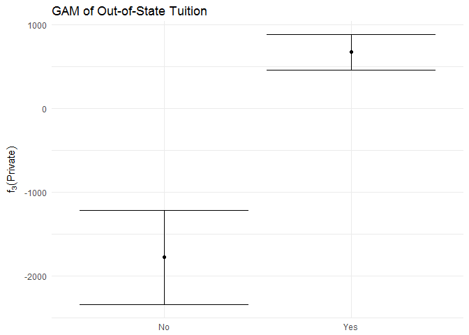
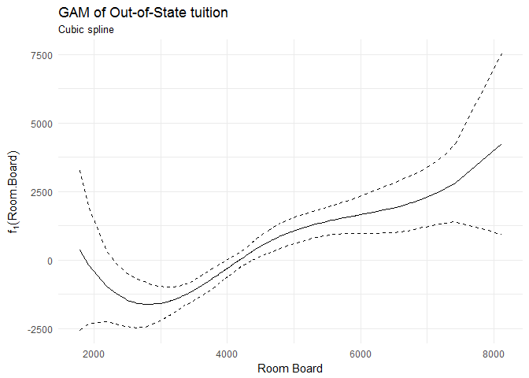
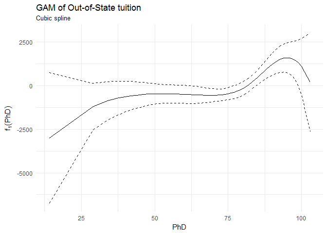
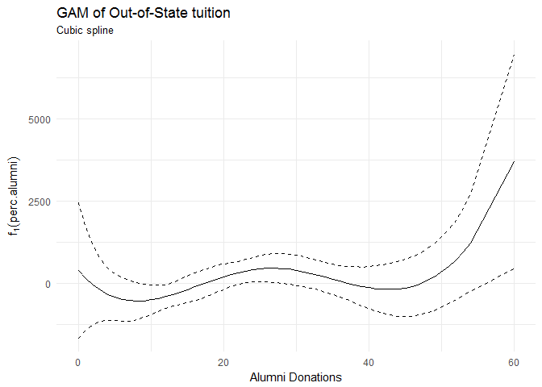
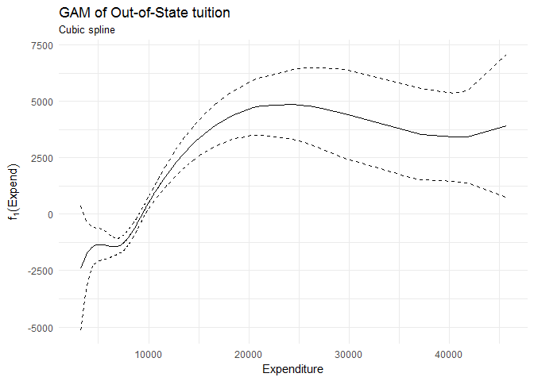

Problem set \#7: Resampling and non-linearity
================
ChengYee Lim
02/25/2017

-   [Part 1: Sexy Joe Biden \[4 points\]](#part-1-sexy-joe-biden-4-points)
-   [Part 2: College (Bivariate) \[3 points\]](#part-2-college-bivariate-3-points)
-   [Part 3: College (GAM) \[3 points\]](#part-3-college-gam-3-points)
    -   [Model Fit](#model-fit)
    -   [Non-linear relationship](#non-linear-relationship)

``` r
knitr::opts_chunk$set(
  cache = TRUE, 
  message = FALSE, 
  warning = FALSE
  )

library(tidyverse)
library(modelr)
library(broom)
library(knitr)
library(pander)
library(purrr)
library(gam)

theme_set(theme_minimal())
set.seed(1234)
```

Part 1: Sexy Joe Biden \[4 points\]
===================================

For this exercise we consider the following functional form:

*Y* = *β*<sub>0</sub> + *β*<sub>1</sub>*X*<sub>1</sub> + *β*<sub>2</sub>*X*<sub>2</sub> + *β*<sub>3</sub>*X*<sub>3</sub> + *β*<sub>4</sub>*X*<sub>4</sub> + *β*<sub>5</sub>*X*<sub>5</sub> + *ϵ*

where *Y* is the Joe Biden feeling thermometer, *X*<sub>1</sub> is age, *X*<sub>2</sub> is gender, *X*<sub>3</sub> is education, *X*<sub>4</sub> is Democrat, and *X*<sub>5</sub> is Republican.

``` r
# import
joe <- read.csv("./data/biden.csv") %>%
  na.omit() %>%
  mutate(female = factor(female, levels = c(0,1), labels = c("Male", "Female"))) %>%
  mutate(dem = factor(dem, levels = c(0,1), labels = c("Non-Democrat", "Democrat"))) %>%
  mutate(rep = factor(rep, levels = c(0,1), labels = c("Non-Republican", "Republican"))) 

# functions 
#  MSE calculation
mse <- function(model, data) {
  x <- modelr:::residuals(model, data)
  mean(x ^ 2, na.rm = TRUE)
} 

#  linear model estimation
joe_lm <- function(df){
  lm <- lm(biden ~ age + female + educ + dem + rep , data = df)
} 
```

**Estimate the training MSE of the model using the traditional approach.**

``` r
pander(summary(joe_lm(joe)))
```

<table style="width:89%;">
<colgroup>
<col width="27%" />
<col width="15%" />
<col width="18%" />
<col width="13%" />
<col width="13%" />
</colgroup>
<thead>
<tr class="header">
<th align="center"> </th>
<th align="center">Estimate</th>
<th align="center">Std. Error</th>
<th align="center">t value</th>
<th align="center">Pr(&gt;|t|)</th>
</tr>
</thead>
<tbody>
<tr class="odd">
<td align="center"><strong>age</strong></td>
<td align="center">0.04826</td>
<td align="center">0.02825</td>
<td align="center">1.708</td>
<td align="center">0.08773</td>
</tr>
<tr class="even">
<td align="center"><strong>femaleFemale</strong></td>
<td align="center">4.103</td>
<td align="center">0.9482</td>
<td align="center">4.327</td>
<td align="center">1.593e-05</td>
</tr>
<tr class="odd">
<td align="center"><strong>educ</strong></td>
<td align="center">-0.3453</td>
<td align="center">0.1948</td>
<td align="center">-1.773</td>
<td align="center">0.07641</td>
</tr>
<tr class="even">
<td align="center"><strong>demDemocrat</strong></td>
<td align="center">15.42</td>
<td align="center">1.068</td>
<td align="center">14.44</td>
<td align="center">8.145e-45</td>
</tr>
<tr class="odd">
<td align="center"><strong>repRepublican</strong></td>
<td align="center">-15.85</td>
<td align="center">1.311</td>
<td align="center">-12.09</td>
<td align="center">2.157e-32</td>
</tr>
<tr class="even">
<td align="center"><strong>(Intercept)</strong></td>
<td align="center">58.81</td>
<td align="center">3.124</td>
<td align="center">18.82</td>
<td align="center">2.694e-72</td>
</tr>
</tbody>
</table>

<table style="width:85%;">
<caption>Fitting linear model: biden ~ age + female + educ + dem + rep</caption>
<colgroup>
<col width="20%" />
<col width="30%" />
<col width="11%" />
<col width="22%" />
</colgroup>
<thead>
<tr class="header">
<th align="center">Observations</th>
<th align="center">Residual Std. Error</th>
<th align="center"><span class="math inline"><em>R</em><sup>2</sup></span></th>
<th align="center">Adjusted <span class="math inline"><em>R</em><sup>2</sup></span></th>
</tr>
</thead>
<tbody>
<tr class="odd">
<td align="center">1807</td>
<td align="center">19.91</td>
<td align="center">0.2815</td>
<td align="center">0.2795</td>
</tr>
</tbody>
</table>

``` r
mse(joe_lm(joe), joe)
```

    ## [1] 395.2702

**Estimate the test MSE of the model using the validation set approach. How does this value compare to the training MSE from step 1?**

``` r
#training-test data split 
joe_split <- resample_partition(joe, c(test = 0.7, train = 0.3))
joe_train <- joe_split$train %>%
  tbl_df()
joe_test <- joe_split$test %>%
  tbl_df()

pander(summary(joe_lm(joe_train))) #results of 70/30 training/test split
```

<table style="width:89%;">
<colgroup>
<col width="27%" />
<col width="15%" />
<col width="18%" />
<col width="13%" />
<col width="13%" />
</colgroup>
<thead>
<tr class="header">
<th align="center"> </th>
<th align="center">Estimate</th>
<th align="center">Std. Error</th>
<th align="center">t value</th>
<th align="center">Pr(&gt;|t|)</th>
</tr>
</thead>
<tbody>
<tr class="odd">
<td align="center"><strong>age</strong></td>
<td align="center">0.1066</td>
<td align="center">0.04913</td>
<td align="center">2.17</td>
<td align="center">0.03045</td>
</tr>
<tr class="even">
<td align="center"><strong>femaleFemale</strong></td>
<td align="center">3.538</td>
<td align="center">1.69</td>
<td align="center">2.094</td>
<td align="center">0.03674</td>
</tr>
<tr class="odd">
<td align="center"><strong>educ</strong></td>
<td align="center">-0.3449</td>
<td align="center">0.3531</td>
<td align="center">-0.9767</td>
<td align="center">0.3292</td>
</tr>
<tr class="even">
<td align="center"><strong>demDemocrat</strong></td>
<td align="center">15.25</td>
<td align="center">1.913</td>
<td align="center">7.972</td>
<td align="center">9.429e-15</td>
</tr>
<tr class="odd">
<td align="center"><strong>repRepublican</strong></td>
<td align="center">-18.3</td>
<td align="center">2.301</td>
<td align="center">-7.951</td>
<td align="center">1.103e-14</td>
</tr>
<tr class="even">
<td align="center"><strong>(Intercept)</strong></td>
<td align="center">57.44</td>
<td align="center">5.568</td>
<td align="center">10.32</td>
<td align="center">6.953e-23</td>
</tr>
</tbody>
</table>

<table style="width:85%;">
<caption>Fitting linear model: biden ~ age + female + educ + dem + rep</caption>
<colgroup>
<col width="20%" />
<col width="30%" />
<col width="11%" />
<col width="22%" />
</colgroup>
<thead>
<tr class="header">
<th align="center">Observations</th>
<th align="center">Residual Std. Error</th>
<th align="center"><span class="math inline"><em>R</em><sup>2</sup></span></th>
<th align="center">Adjusted <span class="math inline"><em>R</em><sup>2</sup></span></th>
</tr>
</thead>
<tbody>
<tr class="odd">
<td align="center">543</td>
<td align="center">19.42</td>
<td align="center">0.3285</td>
<td align="center">0.3223</td>
</tr>
</tbody>
</table>

``` r
mse(joe_lm(joe_train), joe_test)
```

    ## [1] 407.7772

The test MSE, 407.7772353, is larger than the training MSE from step 1, `mse(joe_lm(joe), joe)`. This is because the model trained with 100% of the observations so MSE at all points is minimized. On the other hand, second model trained with 70% of the observations, thus MSE on the test set is likely to be higher than the training MSE.

| Model               |     MSE     |
|---------------------|:-----------:|
| 100% train          | 395.2701693 |
| 70% train, 30% test | 407.7772353 |

**Repeat the validation set approach 100 times, using 100 different splits of the observations into a training set and a validation set. Comment on the results obtained.**

``` r
for(i in 1:100){
  if(i == 1){
    joe_split <- resample_partition(joe, c(test = 0.7, train = 0.3))
    joe_train <- joe_split$train %>%
      tbl_df()
    joe_test <- joe_split$test %>%
      tbl_df()
    mse_list <- c(mse(joe_lm(joe_train), joe_test))
  }
  if(i!=1){
    joe_split <- resample_partition(joe, c(test = 0.7, train = 0.3))
    joe_train <- joe_split$train %>%
      tbl_df()
    joe_test <- joe_split$test %>%
      tbl_df()
    mse_list <- c(mse(joe_lm(joe_train), joe_test), mse_list)
  }
}

mean(mse_list)
```

    ## [1] 401.4357

When the validation set approach is repeated 100 times, the average MSE is 401.4357125. Expectedly, the average MSE is still larger than the training MSE as explained in part (b). The average MSE is also slightly smaller than test MSE, this shows that a different split to form the test and training sets will result in different MSE. Repeating the validation approach will result in a more robust MSE.

| Model                          |     MSE     |
|--------------------------------|:-----------:|
| 100% train                     | 395.2701693 |
| 70% train, 30% test            | 397.3651852 |
| 70% train, 30% test, 100 times | 401.4357125 |

**Estimate the test MSE of the model using the leave-one-out cross-validation (LOOCV) approach. Comment on the results obtained.**

``` r
LOOCV <- function(df, n){
  #create loocv data
  loocv_data <- crossv_kfold(df, n)
  #regress every loocv datapoint
  loocv_mods <- map(loocv_data$train, ~ lm(biden ~ . , data = .))
  #calculate mse for every loocv datapoint
  loocv_mse <- map2_dbl(loocv_mods, loocv_data$test, mse)
  #mse of loocv is the average of every mse calculated
  mean(loocv_mse, na.rm = TRUE)
} #function to calculate mse for k-fold loocv approach, where max k = nrow(df)

LOOCV(joe, nrow(joe))
```

    ## [1] 397.9555

The test MSE of the model using LOOCV is 397.9555046. Since LOOCV trains with 99% of the observations, we expect the test MSE to be larger than the training MSE, and smaller than the MSE of the 70-30 validation set approach.

| Model               |     MSE     |
|---------------------|:-----------:|
| 100% train          | 395.2701693 |
| 70% train, 30% test | 397.3651852 |
| LOOCV               | 397.9555046 |

**Estimate the test MSE of the model using the 10-fold cross-validation approach. Comment on the results obtained.**

``` r
LOOCV(joe, 10)
```

    ## [1] 398.0729

The test MSE using the 10-fold cross-validation approach is 397.718387. Since 10-fold cross-validation approach uses 90% of the observations for training, the test MSE will be larger than the training MSE and the LOOCV MSE but smaller than the 70-30 validation set approach MSE. There is, however, no significant difference between LOOCV MSE and 10-fold CV MSE.

| Model               |     MSE     |
|---------------------|:-----------:|
| 100% train          | 395.2701693 |
| 70% train, 30% test | 397.3651852 |
| LOOCV               | 397.9555046 |
| 10-fold CV          | 397.6861377 |

**Repeat the 10-fold cross-validation approach 100 times, using 100 different splits of the observations into 10-folds. Comment on the results obtained.**

``` r
for(i in 1:100){
  if(i == 1){
    cv_list <- c(LOOCV(joe, 10))
  }
  if(i!=1){
    cv_list <- c(LOOCV(joe, 10), cv_list)
  }
}
mean(cv_list)
```

    ## [1] 397.9661

The average MSE for 10-fold CV approach is almost identical as the LOOCV approach, thus the accuracy of both approaches are similar. Since LOOCV approach is much more time-inefficient, we would choose the 10-fold CV approach over LOOCV approach in this case.

| Model                 |     MSE     |
|-----------------------|:-----------:|
| 100% train            | 395.2701693 |
| 70% train, 30% test   | 397.3651852 |
| LOOCV                 | 397.9555046 |
| 10-fold CV            | 399.8721821 |
| 10-fold CV, 100 times | 397.9660989 |

**Compare the estimated parameters and standard errors from the original model in step 1 (the model estimated using all of the available data) to parameters and standard errors estimated using the bootstrap (*n* = 1000).**

``` r
#basic model 
pander(summary(joe_lm(joe)))
```

<table style="width:89%;">
<colgroup>
<col width="27%" />
<col width="15%" />
<col width="18%" />
<col width="13%" />
<col width="13%" />
</colgroup>
<thead>
<tr class="header">
<th align="center"> </th>
<th align="center">Estimate</th>
<th align="center">Std. Error</th>
<th align="center">t value</th>
<th align="center">Pr(&gt;|t|)</th>
</tr>
</thead>
<tbody>
<tr class="odd">
<td align="center"><strong>age</strong></td>
<td align="center">0.04826</td>
<td align="center">0.02825</td>
<td align="center">1.708</td>
<td align="center">0.08773</td>
</tr>
<tr class="even">
<td align="center"><strong>femaleFemale</strong></td>
<td align="center">4.103</td>
<td align="center">0.9482</td>
<td align="center">4.327</td>
<td align="center">1.593e-05</td>
</tr>
<tr class="odd">
<td align="center"><strong>educ</strong></td>
<td align="center">-0.3453</td>
<td align="center">0.1948</td>
<td align="center">-1.773</td>
<td align="center">0.07641</td>
</tr>
<tr class="even">
<td align="center"><strong>demDemocrat</strong></td>
<td align="center">15.42</td>
<td align="center">1.068</td>
<td align="center">14.44</td>
<td align="center">8.145e-45</td>
</tr>
<tr class="odd">
<td align="center"><strong>repRepublican</strong></td>
<td align="center">-15.85</td>
<td align="center">1.311</td>
<td align="center">-12.09</td>
<td align="center">2.157e-32</td>
</tr>
<tr class="even">
<td align="center"><strong>(Intercept)</strong></td>
<td align="center">58.81</td>
<td align="center">3.124</td>
<td align="center">18.82</td>
<td align="center">2.694e-72</td>
</tr>
</tbody>
</table>

<table style="width:85%;">
<caption>Fitting linear model: biden ~ age + female + educ + dem + rep</caption>
<colgroup>
<col width="20%" />
<col width="30%" />
<col width="11%" />
<col width="22%" />
</colgroup>
<thead>
<tr class="header">
<th align="center">Observations</th>
<th align="center">Residual Std. Error</th>
<th align="center"><span class="math inline"><em>R</em><sup>2</sup></span></th>
<th align="center">Adjusted <span class="math inline"><em>R</em><sup>2</sup></span></th>
</tr>
</thead>
<tbody>
<tr class="odd">
<td align="center">1807</td>
<td align="center">19.91</td>
<td align="center">0.2815</td>
<td align="center">0.2795</td>
</tr>
</tbody>
</table>

``` r
#bootstrap
joe %>%
  modelr::bootstrap(1000) %>%
  mutate(model = map(strap, ~ lm(biden ~ age + female + educ + dem + rep , data = .)),
         coef = map(model, tidy)) %>%
  unnest(coef) %>%
  group_by(term) %>%
  summarize(est.boot = mean(estimate),
            se.boot = sd(estimate, na.rm = TRUE)) %>%
  kable()
```

| term          |     est.boot|    se.boot|
|:--------------|------------:|----------:|
| (Intercept)   |   58.9133725|  2.9781425|
| age           |    0.0477097|  0.0288348|
| demDemocrat   |   15.4302064|  1.1072481|
| educ          |   -0.3495053|  0.1921440|
| femaleFemale  |    4.0880055|  0.9487960|
| repRepublican |  -15.8743184|  1.4443321|

The estimated parameters using the bootstrap is almost identical as the estimated parameters from the original model. However, the estimated standard errors from the bootstrap are consistently larger than the standard errors from the original model.

Part 2: College (Bivariate) \[3 points\]
========================================

The `College` dataset in the `ISLR` library (also available as a `.csv` or [`.feather`](https://github.com/wesm/feather) file in the `data` folder) contains statistics for a large number of U.S. colleges from the 1995 issue of U.S. News and World Report.

-   `Private` - A factor with levels `No` and `Yes` indicating private or public university.
-   `Apps` - Number of applications received.
-   `Accept` - Number of applications accepted.
-   `Enroll` - Number of new students enrolled.
-   `Top10perc` - Percent of new students from top 10% of H.S. class.
-   `Top25perc` - Percent of new students from top 25% of H.S. class.
-   `F.Undergrad` - Number of fulltime undergraduates.
-   `P.Undergrad` - Number of parttime undergraduates.
-   `Outstate` - Out-of-state tuition.
-   `Room.Board` - Room and board costs.
-   `Books` - Estimated book costs.
-   `Personal` - Estimated personal spending.
-   `PhD` - Percent of faculty with Ph.D.'s.
-   `Terminal` - Percent of faculty with terminal degrees.
-   `S.F.Ratio` - Student/faculty ratio.
-   `perc.alumni` - Percent of alumni who donate.
-   `Expend` - Instructional expenditure per student.
-   `Grad.Rate` - Graduation rate.

Explore the bivariate relationships between some of the available predictors and `Outstate`. You should estimate at least 3 **simple** linear regression models (i.e. only one predictor per model). Use non-linear fitting techniques in order to fit a flexible model to the data, **as appropriate**. You could consider any of the following techniques:

-   No transformation
-   Monotonic transformation
-   Polynomial regression
-   Step functions
-   Splines
-   Local regression

Justify your use of linear or non-linear techniques using cross-validation methods. Create plots of the results obtained, and write a summary of your findings.

``` r
college <- read.csv("./data/college.csv")
```

Part 3: College (GAM) \[3 points\]
==================================

We now fit a GAM to predict out-of-state tuition using spline functions of `Room.Board`, `PhD`, `perc.alumni`, `Expend`, `Grad.Rate` and treating `Private` as a qualitative predictor.

-   `Outstate` - Out-of-state tuition.
-   `Private` - A factor with levels `No` and `Yes` indicating private or public university.
-   `Room.Board` - Room and board costs.
-   `PhD` - Percent of faculty with Ph.D.'s.
-   `perc.alumni` - Percent of alumni who donate.
-   `Expend` - Instructional expenditure per student.
-   `Grad.Rate` - Graduation rate.

We do so by extending the following multiple linear regression model

*y*<sub>*i*</sub> = *β*<sub>0</sub> + *β*<sub>1</sub>*X*<sub>*i*1</sub> + *β*<sub>2</sub>*X*<sub>*i*2</sub> + *β*<sub>3</sub>*X*<sub>*i*3</sub> + *β*<sub>4</sub>*X*<sub>*i*4</sub> + *β*<sub>5</sub>*X*<sub>*i*5</sub> + *β*<sub>6</sub>*X*<sub>*i*6</sub> + *ϵ*<sub>*i*</sub>

where *X*<sub>*i*1</sub> is `Private`, *X*<sub>*i*2</sub> is `Room.Board`, *X*<sub>*i*3</sub> is `PhD`, *X*<sub>*i*4</sub> is `perc.alumni`, *X*<sub>*i*5</sub> is `Expend`, and *X*<sub>*i*6</sub> is `Grad.Rate`

and allowing for non-linear relationships between each predictor and the response variable. Each linear component *β*<sub>*j*</sub>*x*<sub>*i**j*</sub> is replaced with a smooth, non-linear function *f*<sub>*j*</sub>(*x*<sub>*i**j*</sub>):

$$y\_i = \\beta\_0 + \\sum\_{j = 1}^6 f\_j(x\_{ij}) + \\epsilon\_i$$

Thus, our ultimate GAM for the college dataset is as follows:

Outstate = *β*<sub>0</sub> + *f*<sub>1</sub>(Private)+*f*<sub>2</sub>(Room.Board)+*f*<sub>3</sub>(PhD)+*f*<sub>4</sub>(perc.alumni)+*f*<sub>5</sub>(Expend)+*f*<sub>6</sub>(Grad.Rate)+*ϵ*

Where *f*<sub>2</sub>, *f*<sub>3</sub>, *f*<sub>4</sub>, *f*<sub>5</sub>, *f*<sub>6</sub> are cubic splines with 2 knots and *f*<sub>1</sub> generates a separate constant for non-private and private universities using traditional dummy variables.

``` r
# training-test set split
college_split <- resample_partition(college, c(test = 0.7, train = 0.3))
college_train <- college_split$train %>%
  tbl_df()
college_test <- college_split$test %>%
  tbl_df()

# OLS estimation
college_mod <- lm(Outstate ~ Private + Room.Board + PhD + perc.alumni +  Expend + Grad.Rate, data = college_train)
pander(summary(college_mod))
```

<table style="width:86%;">
<colgroup>
<col width="25%" />
<col width="15%" />
<col width="18%" />
<col width="13%" />
<col width="13%" />
</colgroup>
<thead>
<tr class="header">
<th align="center"> </th>
<th align="center">Estimate</th>
<th align="center">Std. Error</th>
<th align="center">t value</th>
<th align="center">Pr(&gt;|t|)</th>
</tr>
</thead>
<tbody>
<tr class="odd">
<td align="center"><strong>PrivateYes</strong></td>
<td align="center">2548</td>
<td align="center">395.6</td>
<td align="center">6.441</td>
<td align="center">7.018e-10</td>
</tr>
<tr class="even">
<td align="center"><strong>Room.Board</strong></td>
<td align="center">1.06</td>
<td align="center">0.1562</td>
<td align="center">6.79</td>
<td align="center">9.687e-11</td>
</tr>
<tr class="odd">
<td align="center"><strong>PhD</strong></td>
<td align="center">38.5</td>
<td align="center">10.55</td>
<td align="center">3.649</td>
<td align="center">0.0003268</td>
</tr>
<tr class="even">
<td align="center"><strong>perc.alumni</strong></td>
<td align="center">44.13</td>
<td align="center">14.98</td>
<td align="center">2.947</td>
<td align="center">0.003549</td>
</tr>
<tr class="odd">
<td align="center"><strong>Expend</strong></td>
<td align="center">0.1508</td>
<td align="center">0.03044</td>
<td align="center">4.955</td>
<td align="center">1.411e-06</td>
</tr>
<tr class="even">
<td align="center"><strong>Grad.Rate</strong></td>
<td align="center">53.91</td>
<td align="center">10.43</td>
<td align="center">5.166</td>
<td align="center">5.222e-07</td>
</tr>
<tr class="odd">
<td align="center"><strong>(Intercept)</strong></td>
<td align="center">-4875</td>
<td align="center">874.3</td>
<td align="center">-5.575</td>
<td align="center">6.988e-08</td>
</tr>
</tbody>
</table>

<table style="width:85%;">
<caption>Fitting linear model: Outstate ~ Private + Room.Board + PhD + perc.alumni + Expend + Grad.Rate</caption>
<colgroup>
<col width="20%" />
<col width="30%" />
<col width="11%" />
<col width="22%" />
</colgroup>
<thead>
<tr class="header">
<th align="center">Observations</th>
<th align="center">Residual Std. Error</th>
<th align="center"><span class="math inline"><em>R</em><sup>2</sup></span></th>
<th align="center">Adjusted <span class="math inline"><em>R</em><sup>2</sup></span></th>
</tr>
</thead>
<tbody>
<tr class="odd">
<td align="center">234</td>
<td align="center">2082</td>
<td align="center">0.7547</td>
<td align="center">0.7482</td>
</tr>
</tbody>
</table>

Out-of-state tuition is expected to be $2548 higher for private colleges than public colleges, holding all other independent variables constant. This is unsurprising as public colleges receive additional funding from the government, thus they do not need to charge college tuition as high as private colleges.

An additional dollar increase in room and boarding costs corresponds to an $1.06 increase in out-of-state tuition. Similarly, one percent increase in the percentage of the PhDs in the faculty corresponds with a $38.5 increase in out-of-state tuition. One percent increase in the percentage of alumni who donates also corresponds to a $44.13 increase in out-of-state tuition. A dollar increase in instructional expenditure per student corresponds with a $0.1508 increase in out-of-state tuition. A unit increase in graduation rate of the college also corresponds with $53.91 increase in out-of-state tuition.

``` r
# estimate model for splines on private, room boarding, PhD, alumni, expenditure, graduation rate 
college_gam <- gam(Outstate ~ Private + bs(Room.Board, df = 5) + bs(PhD, df = 5) + bs(perc.alumni, df = 5) + bs(Expend, df = 5) + bs(Grad.Rate, df = 5), data = college_train)
summary(college_gam)
```

    ## 
    ## Call: gam(formula = Outstate ~ Private + bs(Room.Board, df = 5) + bs(PhD, 
    ##     df = 5) + bs(perc.alumni, df = 5) + bs(Expend, df = 5) + 
    ##     bs(Grad.Rate, df = 5), data = college_train)
    ## Deviance Residuals:
    ##     Min      1Q  Median      3Q     Max 
    ## -7733.8  -958.7   105.1  1059.4  4186.0 
    ## 
    ## (Dispersion Parameter for gaussian family taken to be 3467470)
    ## 
    ##     Null Deviance: 4009571567 on 233 degrees of freedom
    ## Residual Deviance: 717766225 on 207 degrees of freedom
    ## AIC: 4215.165 
    ## 
    ## Number of Local Scoring Iterations: 2 
    ## 
    ## Anova for Parametric Effects
    ##                          Df     Sum Sq    Mean Sq  F value    Pr(>F)    
    ## Private                   1 1182327234 1182327234 340.9769 < 2.2e-16 ***
    ## bs(Room.Board, df = 5)    5 1032659950  206531990  59.5627 < 2.2e-16 ***
    ## bs(PhD, df = 5)           5  509434650  101886930  29.3837 < 2.2e-16 ***
    ## bs(perc.alumni, df = 5)   5  166605576   33321115   9.6096 2.906e-08 ***
    ## bs(Expend, df = 5)        5  279551572   55910314  16.1242 2.037e-13 ***
    ## bs(Grad.Rate, df = 5)     5  121226358   24245272   6.9922 4.656e-06 ***
    ## Residuals               207  717766225    3467470                       
    ## ---
    ## Signif. codes:  0 '***' 0.001 '**' 0.01 '*' 0.05 '.' 0.1 ' ' 1

``` r
#get graphs of each term
college_gam_terms <- preplot(college_gam, se = TRUE, rug = FALSE)

## private
data_frame(x = college_gam_terms$Private$x,
           y = college_gam_terms$Private$y,
           se.fit = college_gam_terms$Private$se.y) %>%
  unique %>%
  mutate(y_low = y - 1.96 * se.fit,
         y_high = y + 1.96 * se.fit,
         x = factor(x)) %>%
  ggplot(aes(x, y, ymin = y_low, ymax = y_high)) +
  geom_errorbar() +
  geom_point() +
  labs(title = "GAM of Out-of-State Tuition",
       x = NULL,
       y = expression(f[3](Private)))
```



For `private`, the difference between non-private and private is substantial and statistically distinguishable from 0. Private colleges are predicted to have high out-of-state tuition than non-private colleges.

``` r
## Room Board
data_frame(x = college_gam_terms$`bs(Room.Board, df = 5)`$x,
           y = college_gam_terms$`bs(Room.Board, df = 5)`$y,
           se.fit = college_gam_terms$`bs(Room.Board, df = 5)`$se.y) %>%
  mutate(y_low = y - 1.96 * se.fit,
         y_high = y + 1.96 * se.fit) %>%
  ggplot(aes(x, y)) +
  geom_line() +
  geom_line(aes(y = y_low), linetype = 2) +
  geom_line(aes(y = y_high), linetype = 2) +
  labs(title = "GAM of Out-of-State tuition",
       subtitle = "Cubic spline",
       x = "Room Board",
       y = expression(f[1](Room.Board)))
```



For room and boarding costs, the effect appears to be substantial and statistically significant; as room and boarding costs increase, predicted out-of-state tuition increases. The downward trend after $6500 room and boarding costs might not be statistically significant due to the wide confidence intervals.

``` r
## PhD
data_frame(x = college_gam_terms$`bs(PhD, df = 5)`$x,
           y = college_gam_terms$`bs(PhD, df = 5)`$y,
           se.fit = college_gam_terms$`bs(PhD, df = 5)`$se.y) %>%
  mutate(y_low = y - 1.96 * se.fit,
         y_high = y + 1.96 * se.fit) %>%
  ggplot(aes(x, y)) +
  geom_line() +
  geom_line(aes(y = y_low), linetype = 2) +
  geom_line(aes(y = y_high), linetype = 2) +
  labs(title = "GAM of Out-of-State tuition",
       subtitle = "Cubic spline",
       x = "PhD",
       y = expression(f[1](PhD)))
```



For percentage of PhDs in the faculty, there does not appear to be a substantial or significant relationship with out-of-state tuition after controlling for other university characteristics. The cubic spline is relatively flat and the 95% confidence interval is relatively wide at extreme values.

``` r
## perc.alumni
data_frame(x = college_gam_terms$`bs(perc.alumni, df = 5)`$x,
           y = college_gam_terms$`bs(perc.alumni, df = 5)`$y,
           se.fit = college_gam_terms$`bs(perc.alumni, df = 5)`$se.y) %>%
  mutate(y_low = y - 1.96 * se.fit,
         y_high = y + 1.96 * se.fit) %>%
  ggplot(aes(x, y)) +
  geom_line() +
  geom_line(aes(y = y_low), linetype = 2) +
  geom_line(aes(y = y_high), linetype = 2) +
  labs(title = "GAM of Out-of-State tuition",
       subtitle = "Cubic spline",
       x = "Alumni Donations",
       y = expression(f[1](perc.alumni)))
```



For percentage of alumni who donates, there does not appear to be a substantial or significant relationship with out-of-state tuition after controlling for other university characteristics. The cubic spline is relatively flat and the 95% confidence interval is wide.

``` r
## Expenditure per student
data_frame(x = college_gam_terms$`bs(Expend, df = 5)`$x,
           y = college_gam_terms$`bs(Expend, df = 5)`$y,
           se.fit = college_gam_terms$`bs(Expend, df = 5)`$se.y) %>%
  mutate(y_low = y - 1.96 * se.fit,
         y_high = y + 1.96 * se.fit) %>%
  ggplot(aes(x, y)) +
  geom_line() +
  geom_line(aes(y = y_low), linetype = 2) +
  geom_line(aes(y = y_high), linetype = 2) +
  labs(title = "GAM of Out-of-State tuition",
       subtitle = "Cubic spline",
       x = "Expenditure",
       y = expression(f[1](Expend)))
```



For instructional expenditure per student, the effect appears to be substantial and statistically significant; as instructional expenditure increases, predicted out-of-state tuition increases until $25000 per student, and plateaus after that.

``` grad
## Graduation Rate
data_frame(x = college_gam_terms$`bs(Grad.Rate, df = 5)`$x,
           y = college_gam_terms$`bs(Grad.Rate, df = 5)`$y,
           se.fit = college_gam_terms$`bs(Grad.Rate, df = 5)`$se.y) %>%
  mutate(y_low = y - 1.96 * se.fit,
         y_high = y + 1.96 * se.fit) %>%
  ggplot(aes(x, y)) +
  geom_line() +
  geom_line(aes(y = y_low), linetype = 2) +
  geom_line(aes(y = y_high), linetype = 2) +
  labs(title = "GAM of Out-of-State tuition",
       subtitle = "Cubic spline",
       x = "Graduation Rate",
       y = expression(f[1](Grad.Rate)))
```

For graduation rate, the effect appears to be substantial and statistically significant; as graduation increases, predicted out-of-state tuition increases. Out-of-state tuition decreases when graduation rate goes past 100%. This effect is likely to be due to an outlier or a wrongly documented statistic, as colleges cannot have graduation rates above 100% and the 95% confidence interval widens after graduation rate goes past 100%.

#### Model Fit

``` r
# Test set 
mse(college_mod, college_test)
```

    ## [1] 4312245

``` r
#  GAM MSE calculation
mse_gam <- function(model, data) {
  x <- mgcv:::residuals.gam(model, data, type = "deviance")
  mean(x ^ 2, na.rm = TRUE)
} 

mse_gam(college_gam)
```

    ## [1] 3067377

``` r
#mgcv::summary.gam(college_gam, college_test)
```

#### Non-linear relationship

To determine if the predictors have a non-linear relationship with the response variable, we perform an ANOVA test between two models. The first model uses a spline function of the predictor variable and allows for a non-linear relationship between the response variable and the predictor variable. The second model assumes a linear relationship between the response variable and the predictor variable. If the F test shows that the second model (linear model) is significantly different from the first model, i.e. with a p-value smaller than 1%, we reject the null hypothesis that both models are the same.

``` r
college_base <- gam(Outstate ~ Private + bs(Room.Board, df = 5) + bs(PhD, df = 5) + bs(perc.alumni, df = 5) + bs(Expend, df = 5) + bs(Grad.Rate, df = 5), data = college_train)

college_base <- lm(Outstate ~ Private + Room.Board + PhD + perc.alumni + Expend + Grad.Rate, data = college_train)
college_roomS <- gam(Outstate ~ Private + Room.Board + bs(PhD, df = 5) + bs(perc.alumni, df = 5) + bs(Expend, df = 5) + bs(Grad.Rate, df = 5), data = college_train)
college_phdS <- gam(Outstate ~ Private + bs(Room.Board, df = 5) + PhD + bs(perc.alumni, df = 5) + bs(Expend, df = 5) + bs(Grad.Rate, df = 5), data = college_train)
college_alumS <- gam(Outstate ~ Private + bs(Room.Board, df = 5) + bs(PhD, df = 5) + perc.alumni + bs(Expend, df = 5) + bs(Grad.Rate, df = 5), data = college_train)
college_expS <- gam(Outstate ~ Private + bs(Room.Board, df = 5) + bs(PhD, df = 5) + bs(perc.alumni, df = 5) + Expend + bs(Grad.Rate, df = 5), data = college_train)
college_gradS <- gam(Outstate ~ Private + bs(Room.Board, df = 5) + bs(PhD, df = 5) + bs(perc.alumni, df = 5) + bs(Expend, df = 5) + Grad.Rate, data = college_train)


anova(college_base, college_roomS, test  = "F")
```

    ## Analysis of Variance Table
    ## 
    ## Model 1: Outstate ~ Private + Room.Board + PhD + perc.alumni + Expend + 
    ##     Grad.Rate
    ## Model 2: Outstate ~ Private + Room.Board + bs(PhD, df = 5) + bs(perc.alumni, 
    ##     df = 5) + bs(Expend, df = 5) + bs(Grad.Rate, df = 5)
    ##   Res.Df       RSS Df Sum of Sq      F    Pr(>F)    
    ## 1    227 983664878                                  
    ## 2    211 744518824 16 239146054 4.2359 4.043e-07 ***
    ## ---
    ## Signif. codes:  0 '***' 0.001 '**' 0.01 '*' 0.05 '.' 0.1 ' ' 1

``` r
anova(college_base, college_phdS, test  = "F")
```

    ## Analysis of Variance Table
    ## 
    ## Model 1: Outstate ~ Private + Room.Board + PhD + perc.alumni + Expend + 
    ##     Grad.Rate
    ## Model 2: Outstate ~ Private + bs(Room.Board, df = 5) + PhD + bs(perc.alumni, 
    ##     df = 5) + bs(Expend, df = 5) + bs(Grad.Rate, df = 5)
    ##   Res.Df       RSS Df Sum of Sq      F    Pr(>F)    
    ## 1    227 983664878                                  
    ## 2    211 725544052 16 258120826 4.6916 4.426e-08 ***
    ## ---
    ## Signif. codes:  0 '***' 0.001 '**' 0.01 '*' 0.05 '.' 0.1 ' ' 1

``` r
anova(college_base, college_alumS, test = "F")
```

    ## Analysis of Variance Table
    ## 
    ## Model 1: Outstate ~ Private + Room.Board + PhD + perc.alumni + Expend + 
    ##     Grad.Rate
    ## Model 2: Outstate ~ Private + bs(Room.Board, df = 5) + bs(PhD, df = 5) + 
    ##     perc.alumni + bs(Expend, df = 5) + bs(Grad.Rate, df = 5)
    ##   Res.Df       RSS Df Sum of Sq      F   Pr(>F)    
    ## 1    227 983664878                                 
    ## 2    211 735242772 16 248422105 4.4558 1.39e-07 ***
    ## ---
    ## Signif. codes:  0 '***' 0.001 '**' 0.01 '*' 0.05 '.' 0.1 ' ' 1

``` r
anova(college_base, college_expS, test = "F")
```

    ## Analysis of Variance Table
    ## 
    ## Model 1: Outstate ~ Private + Room.Board + PhD + perc.alumni + Expend + 
    ##     Grad.Rate
    ## Model 2: Outstate ~ Private + bs(Room.Board, df = 5) + bs(PhD, df = 5) + 
    ##     bs(perc.alumni, df = 5) + Expend + bs(Grad.Rate, df = 5)
    ##   Res.Df       RSS Df Sum of Sq      F Pr(>F)
    ## 1    227 983664878                           
    ## 2    211 885416706 16  98248172 1.4633 0.1157

``` r
anova(college_base, college_gradS, test = "F")
```

    ## Analysis of Variance Table
    ## 
    ## Model 1: Outstate ~ Private + Room.Board + PhD + perc.alumni + Expend + 
    ##     Grad.Rate
    ## Model 2: Outstate ~ Private + bs(Room.Board, df = 5) + bs(PhD, df = 5) + 
    ##     bs(perc.alumni, df = 5) + bs(Expend, df = 5) + Grad.Rate
    ##   Res.Df       RSS Df Sum of Sq      F    Pr(>F)    
    ## 1    227 983664878                                  
    ## 2    211 730313557 16 253351321 4.5748 7.797e-08 ***
    ## ---
    ## Signif. codes:  0 '***' 0.001 '**' 0.01 '*' 0.05 '.' 0.1 ' ' 1

Thus, the results of our ANOVA test shows that `Room.Board`, `PhD`, `perc.alumni` and `Grad.Rate` have a non-linear relationship with `Outstate`. Only `Expend` has a linear relationship with `Outstate`.
