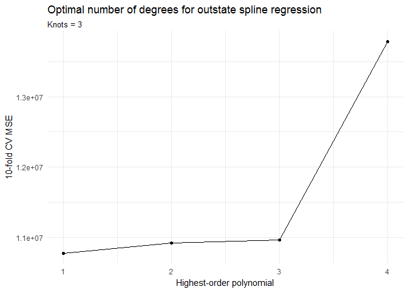
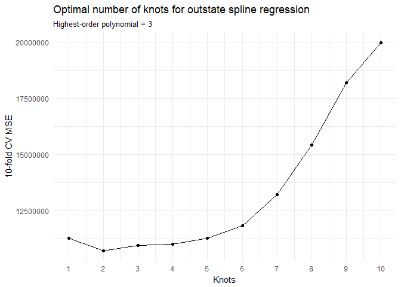
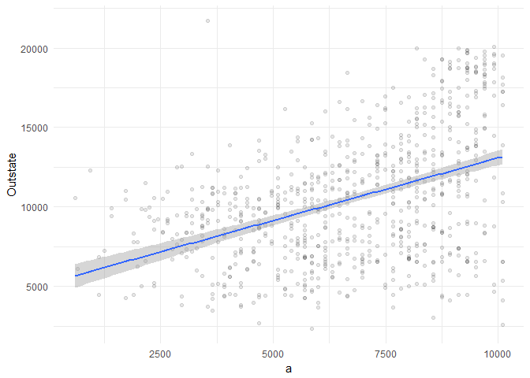
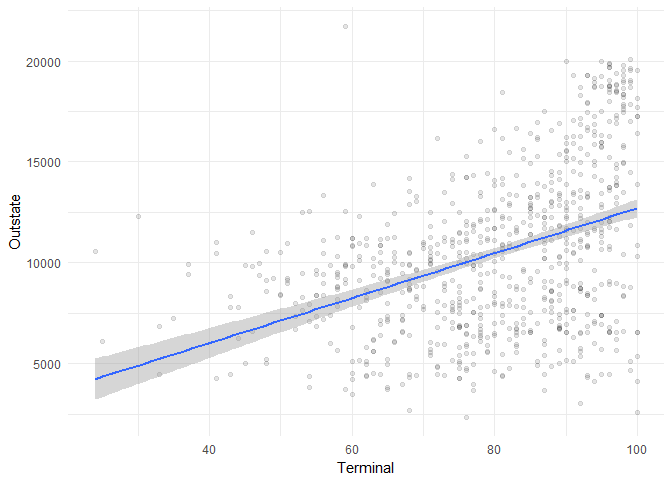
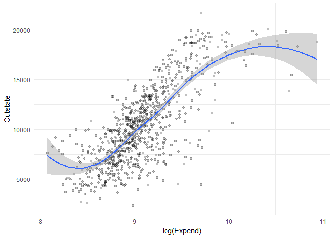
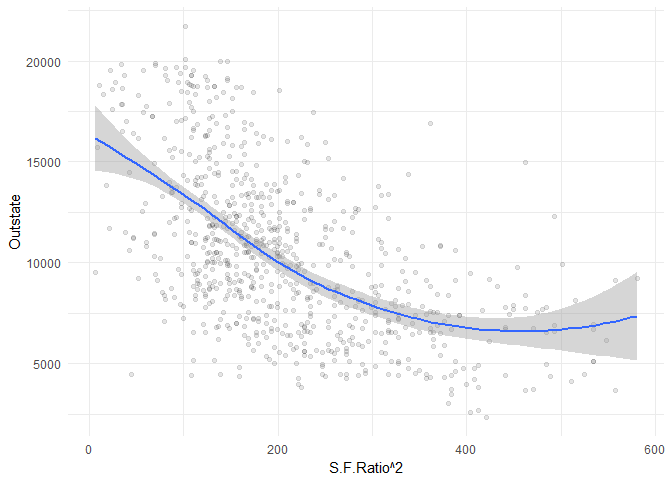

Problem set \#7: Resampling and non-linearity
================
ChengYee Lim
02/25/2017

-   [Part 1: Sexy Joe Biden (redux) \[4 points\]](#part-1-sexy-joe-biden-redux-4-points)
-   [Part 2: College (bivariate) \[3 points\]](#part-2-college-bivariate-3-points)
-   [Part 3: College (GAM) \[3 points\]](#part-3-college-gam-3-points)

``` r
knitr::opts_chunk$set(
  cache = TRUE, 
  message = FALSE, 
  warning = FALSE
  )

library(tidyverse)
library(modelr)
library(broom)
library(knitr)
library(pander)
library(purrr)

theme_set(theme_minimal())
```

Part 1: Sexy Joe Biden (redux) \[4 points\]
===========================================

`biden.csv` contains a selection of variables from the [2008 American National Election Studies survey](http://www.electionstudies.org/) that allow you to test competing factors that may influence attitudes towards Joe Biden. The variables are coded as follows:

-   `biden` - feeling thermometer ranging from 0-100[1]
-   `female` - 1 if respondent is female, 0 if respondent is male
-   `age` - age of respondent in years
-   `dem` - 1 if respondent is a Democrat, 0 otherwise
-   `rep` - 1 if respondent is a Republican, 0 otherwise
-   `educ` - number of years of formal education completed by respondent
    -   `17` - 17+ years (aka first year of graduate school and up)

For this exercise we consider the following functional form:

*Y* = *β*<sub>0</sub> + *β*<sub>1</sub>*X*<sub>1</sub> + *β*<sub>2</sub>*X*<sub>2</sub> + *β*<sub>3</sub>*X*<sub>3</sub> + *β*<sub>4</sub>*X*<sub>4</sub> + *β*<sub>5</sub>*X*<sub>5</sub> + *ϵ*

where *Y* is the Joe Biden feeling thermometer, *X*<sub>1</sub> is age, *X*<sub>2</sub> is gender, *X*<sub>3</sub> is education, *X*<sub>4</sub> is Democrat, and *X*<sub>5</sub> is Republican.[2] Report the parameters and standard errors.

``` r
# import
joe <- read.csv("./data/biden.csv") %>%
  na.omit() %>%
  mutate(female = factor(female, levels = c(0,1), labels = c("Male", "Female"))) %>%
  mutate(dem = factor(dem, levels = c(0,1), labels = c("Non-Democrat", "Democrat"))) %>%
  mutate(rep = factor(rep, levels = c(0,1), labels = c("Non-Republican", "Republican"))) 

# functions 
#  MSE calculation
mse <- function(model, data) {
  x <- modelr:::residuals(model, data)
  mean(x ^ 2, na.rm = TRUE)
} 

#  linear model estimation
joe_lm <- function(df){
  lm <- lm(biden ~ age + female + educ + dem + rep , data = df)
} 
```

1.  Estimate the training MSE of the model using the traditional approach.
    -   Fit the linear regression model using the entire dataset and calculate the mean squared error for the training set.

``` r
pander(summary(joe_lm(joe)))
```

<table style="width:89%;">
<colgroup>
<col width="27%" />
<col width="15%" />
<col width="18%" />
<col width="13%" />
<col width="13%" />
</colgroup>
<thead>
<tr class="header">
<th align="center"> </th>
<th align="center">Estimate</th>
<th align="center">Std. Error</th>
<th align="center">t value</th>
<th align="center">Pr(&gt;|t|)</th>
</tr>
</thead>
<tbody>
<tr class="odd">
<td align="center"><strong>age</strong></td>
<td align="center">0.04826</td>
<td align="center">0.02825</td>
<td align="center">1.708</td>
<td align="center">0.08773</td>
</tr>
<tr class="even">
<td align="center"><strong>femaleFemale</strong></td>
<td align="center">4.103</td>
<td align="center">0.9482</td>
<td align="center">4.327</td>
<td align="center">1.593e-05</td>
</tr>
<tr class="odd">
<td align="center"><strong>educ</strong></td>
<td align="center">-0.3453</td>
<td align="center">0.1948</td>
<td align="center">-1.773</td>
<td align="center">0.07641</td>
</tr>
<tr class="even">
<td align="center"><strong>demDemocrat</strong></td>
<td align="center">15.42</td>
<td align="center">1.068</td>
<td align="center">14.44</td>
<td align="center">8.145e-45</td>
</tr>
<tr class="odd">
<td align="center"><strong>repRepublican</strong></td>
<td align="center">-15.85</td>
<td align="center">1.311</td>
<td align="center">-12.09</td>
<td align="center">2.157e-32</td>
</tr>
<tr class="even">
<td align="center"><strong>(Intercept)</strong></td>
<td align="center">58.81</td>
<td align="center">3.124</td>
<td align="center">18.82</td>
<td align="center">2.694e-72</td>
</tr>
</tbody>
</table>

<table style="width:85%;">
<caption>Fitting linear model: biden ~ age + female + educ + dem + rep</caption>
<colgroup>
<col width="20%" />
<col width="30%" />
<col width="11%" />
<col width="22%" />
</colgroup>
<thead>
<tr class="header">
<th align="center">Observations</th>
<th align="center">Residual Std. Error</th>
<th align="center"><span class="math inline"><em>R</em><sup>2</sup></span></th>
<th align="center">Adjusted <span class="math inline"><em>R</em><sup>2</sup></span></th>
</tr>
</thead>
<tbody>
<tr class="odd">
<td align="center">1807</td>
<td align="center">19.91</td>
<td align="center">0.2815</td>
<td align="center">0.2795</td>
</tr>
</tbody>
</table>

``` r
mse(joe_lm(joe), joe)
```

    ## [1] 395.2702

1.  Estimate the test MSE of the model using the validation set approach.
    -   Split the sample set into a training set (70%) and a validation set (30%).
    -   Fit the linear regression model using only the training observations.
    -   Calculate the MSE using only the test set observations.
    -   How does this value compare to the training MSE from step 1?

``` r
set.seed(1234)

#training-test data split 
joe_split <- resample_partition(joe, c(test = 0.7, train = 0.3))
joe_train <- joe_split$train %>%
  tbl_df()
joe_test <- joe_split$test %>%
  tbl_df()

pander(summary(joe_lm(joe_train))) #results of 70/30 training/test split
```

<table style="width:89%;">
<colgroup>
<col width="27%" />
<col width="15%" />
<col width="18%" />
<col width="13%" />
<col width="13%" />
</colgroup>
<thead>
<tr class="header">
<th align="center"> </th>
<th align="center">Estimate</th>
<th align="center">Std. Error</th>
<th align="center">t value</th>
<th align="center">Pr(&gt;|t|)</th>
</tr>
</thead>
<tbody>
<tr class="odd">
<td align="center"><strong>age</strong></td>
<td align="center">0.05506</td>
<td align="center">0.05417</td>
<td align="center">1.016</td>
<td align="center">0.3099</td>
</tr>
<tr class="even">
<td align="center"><strong>femaleFemale</strong></td>
<td align="center">4.874</td>
<td align="center">1.768</td>
<td align="center">2.757</td>
<td align="center">0.006034</td>
</tr>
<tr class="odd">
<td align="center"><strong>educ</strong></td>
<td align="center">0.03847</td>
<td align="center">0.3884</td>
<td align="center">0.09906</td>
<td align="center">0.9211</td>
</tr>
<tr class="even">
<td align="center"><strong>demDemocrat</strong></td>
<td align="center">15.02</td>
<td align="center">2.047</td>
<td align="center">7.34</td>
<td align="center">7.955e-13</td>
</tr>
<tr class="odd">
<td align="center"><strong>repRepublican</strong></td>
<td align="center">-15.67</td>
<td align="center">2.444</td>
<td align="center">-6.413</td>
<td align="center">3.138e-10</td>
</tr>
<tr class="even">
<td align="center"><strong>(Intercept)</strong></td>
<td align="center">53.01</td>
<td align="center">6.049</td>
<td align="center">8.763</td>
<td align="center">2.5e-17</td>
</tr>
</tbody>
</table>

<table style="width:85%;">
<caption>Fitting linear model: biden ~ age + female + educ + dem + rep</caption>
<colgroup>
<col width="20%" />
<col width="30%" />
<col width="11%" />
<col width="22%" />
</colgroup>
<thead>
<tr class="header">
<th align="center">Observations</th>
<th align="center">Residual Std. Error</th>
<th align="center"><span class="math inline"><em>R</em><sup>2</sup></span></th>
<th align="center">Adjusted <span class="math inline"><em>R</em><sup>2</sup></span></th>
</tr>
</thead>
<tbody>
<tr class="odd">
<td align="center">543</td>
<td align="center">20.39</td>
<td align="center">0.2759</td>
<td align="center">0.2691</td>
</tr>
</tbody>
</table>

``` r
signif(mse(joe_lm(joe_train), joe_test), digits = 6)
```

    ## [1] 389.999

1.  Repeat the validation set approach 100 times, using 100 different splits of the observations into a training set and a validation set. Comment on the results obtained.

``` r
for(i in 1:100){
  if(i == 1){
    joe_split <- resample_partition(joe, c(test = 0.7, train = 0.3))
    joe_train <- joe_split$train %>%
      tbl_df()
    joe_test <- joe_split$test %>%
      tbl_df()
    mse_list <- c(mse(joe_lm(joe_train), joe_test))
  }
  if(i!=1){
    joe_split <- resample_partition(joe, c(test = 0.7, train = 0.3))
    joe_train <- joe_split$train %>%
      tbl_df()
    joe_test <- joe_split$test %>%
      tbl_df()
    mse_list <- c(mse(joe_lm(joe_train), joe_test), mse_list)
  }
}

mean(mse_list)
```

    ## [1] 401.4357

1.  Estimate the test MSE of the model using the leave-one-out cross-validation (LOOCV) approach. Comment on the results obtained.

``` r
LOOCV <- function(df, n){
  #create loocv data
  loocv_data <- crossv_kfold(df, n)
  #regress every loocv datapoint
  loocv_mods <- map(loocv_data$train, ~ lm(biden ~ . , data = .))
  #calculate mse for every loocv datapoint
  loocv_mse <- map2_dbl(loocv_mods, loocv_data$test, mse)
  #mse of loocv is the average of every mse calculated
  mean(loocv_mse, na.rm = TRUE)
} #function to calculate mse for k-fold loocv approach, where max k = nrow(df)

loocv_joe <- LOOCV(joe, nrow(joe))
```

1.  Estimate the test MSE of the model using the 10-fold cross-validation approach. Comment on the results obtained.

``` r
LOOCV(joe, 10)
```

    ## [1] 398.0729

1.  Repeat the 10-fold cross-validation approach 100 times, using 100 different splits of the observations into 10-folds. Comment on the results obtained.

``` r
for(i in 1:100){
  if(i == 1){
    cv_list <- c(LOOCV(joe, 10))
  }
  if(i!=1){
    cv_list <- c(LOOCV(joe, 10), cv_list)
  }
}
mean(cv_list)
```

    ## [1] 397.9661

1.  Compare the estimated parameters and standard errors from the original model in step 1 (the model estimated using all of the available data) to parameters and standard errors estimated using the bootstrap (*n* = 1000).

``` r
#basic model 
pander(summary(joe_lm(joe)))
```

<table style="width:89%;">
<colgroup>
<col width="27%" />
<col width="15%" />
<col width="18%" />
<col width="13%" />
<col width="13%" />
</colgroup>
<thead>
<tr class="header">
<th align="center"> </th>
<th align="center">Estimate</th>
<th align="center">Std. Error</th>
<th align="center">t value</th>
<th align="center">Pr(&gt;|t|)</th>
</tr>
</thead>
<tbody>
<tr class="odd">
<td align="center"><strong>age</strong></td>
<td align="center">0.04826</td>
<td align="center">0.02825</td>
<td align="center">1.708</td>
<td align="center">0.08773</td>
</tr>
<tr class="even">
<td align="center"><strong>femaleFemale</strong></td>
<td align="center">4.103</td>
<td align="center">0.9482</td>
<td align="center">4.327</td>
<td align="center">1.593e-05</td>
</tr>
<tr class="odd">
<td align="center"><strong>educ</strong></td>
<td align="center">-0.3453</td>
<td align="center">0.1948</td>
<td align="center">-1.773</td>
<td align="center">0.07641</td>
</tr>
<tr class="even">
<td align="center"><strong>demDemocrat</strong></td>
<td align="center">15.42</td>
<td align="center">1.068</td>
<td align="center">14.44</td>
<td align="center">8.145e-45</td>
</tr>
<tr class="odd">
<td align="center"><strong>repRepublican</strong></td>
<td align="center">-15.85</td>
<td align="center">1.311</td>
<td align="center">-12.09</td>
<td align="center">2.157e-32</td>
</tr>
<tr class="even">
<td align="center"><strong>(Intercept)</strong></td>
<td align="center">58.81</td>
<td align="center">3.124</td>
<td align="center">18.82</td>
<td align="center">2.694e-72</td>
</tr>
</tbody>
</table>

<table style="width:85%;">
<caption>Fitting linear model: biden ~ age + female + educ + dem + rep</caption>
<colgroup>
<col width="20%" />
<col width="30%" />
<col width="11%" />
<col width="22%" />
</colgroup>
<thead>
<tr class="header">
<th align="center">Observations</th>
<th align="center">Residual Std. Error</th>
<th align="center"><span class="math inline"><em>R</em><sup>2</sup></span></th>
<th align="center">Adjusted <span class="math inline"><em>R</em><sup>2</sup></span></th>
</tr>
</thead>
<tbody>
<tr class="odd">
<td align="center">1807</td>
<td align="center">19.91</td>
<td align="center">0.2815</td>
<td align="center">0.2795</td>
</tr>
</tbody>
</table>

``` r
#bootstrap
joe %>%
  modelr::bootstrap(1000) %>%
  mutate(model = map(strap, ~ lm(biden ~ age + female + educ + dem + rep , data = .)),
         coef = map(model, tidy)) %>%
  unnest(coef) %>%
  group_by(term) %>%
  summarize(est.boot = mean(estimate),
            se.boot = sd(estimate, na.rm = TRUE)) %>%
  kable()
```

| term          |     est.boot|    se.boot|
|:--------------|------------:|----------:|
| (Intercept)   |   58.9133725|  2.9781425|
| age           |    0.0477097|  0.0288348|
| demDemocrat   |   15.4302064|  1.1072481|
| educ          |   -0.3495053|  0.1921440|
| femaleFemale  |    4.0880055|  0.9487960|
| repRepublican |  -15.8743184|  1.4443321|

Part 2: College (bivariate) \[3 points\]
========================================

The `College` dataset in the `ISLR` library (also available as a `.csv` or [`.feather`](https://github.com/wesm/feather) file in the `data` folder) contains statistics for a large number of U.S. colleges from the 1995 issue of U.S. News and World Report.

-   `Private` - A factor with levels `No` and `Yes` indicating private or public university.
-   `Apps` - Number of applications received.
-   `Accept` - Number of applications accepted.
-   `Enroll` - Number of new students enrolled.
-   `Top10perc` - Percent of new students from top 10% of H.S. class.
-   `Top25perc` - Percent of new students from top 25% of H.S. class.
-   `F.Undergrad` - Number of fulltime undergraduates.
-   `P.Undergrad` - Number of parttime undergraduates.
-   `Outstate` - Out-of-state tuition.
-   `Room.Board` - Room and board costs.
-   `Books` - Estimated book costs.
-   `Personal` - Estimated personal spending.
-   `PhD` - Percent of faculty with Ph.D.'s.
-   `Terminal` - Percent of faculty with terminal degrees.
-   `S.F.Ratio` - Student/faculty ratio.
-   `perc.alumni` - Percent of alumni who donate.
-   `Expend` - Instructional expenditure per student.
-   `Grad.Rate` - Graduation rate.

Explore the bivariate relationships between some of the available predictors and `Outstate`. You should estimate at least 3 **simple** linear regression models (i.e. only one predictor per model). Use non-linear fitting techniques in order to fit a flexible model to the data, **as appropriate**. You could consider any of the following techniques:

-   No transformation
-   Monotonic transformation
-   Polynomial regression
-   Step functions
-   Splines
-   Local regression

Justify your use of linear or non-linear techniques using cross-validation methods. Create plots of the results obtained, and write a summary of your findings.

``` r
college <- read.csv("./data/college.csv")
```

Part 3: College (GAM) \[3 points\]
==================================

The `College` dataset in the `ISLR` library (also available as a `.csv` or [`.feather`](https://github.com/wesm/feather) file in the `data` folder) contains statistics for a large number of U.S. colleges from the 1995 issue of U.S. News and World Report. The variables we are most concerned with are:

-   `Outstate` - Out-of-state tuition.
-   `Private` - A factor with levels `No` and `Yes` indicating private or public university.
-   `Room.Board` - Room and board costs.
-   `PhD` - Percent of faculty with Ph.D.'s.
-   `perc.alumni` - Percent of alumni who donate.
-   `Expend` - Instructional expenditure per student.
-   `Grad.Rate` - Graduation rate.

1.  Split the data into a training set and a test set.
2.  Estimate an OLS model on the training data, using out-of-state tuition (`Outstate`) as the response variable and the other six variables as the predictors. Interpret the results and explain your findings, using appropriate techniques (tables, graphs, statistical tests, etc.).

``` r
college_split <- resample_partition(college, c(test = 0.7, train = 0.3))
college_train <- college_split$train %>%
  tbl_df()
college_test <- college_split$test %>%
  tbl_df()

# OLS 

college_mod <- lm(Outstate ~ Private + Room.Board + PhD + perc.alumni +  Expend + Grad.Rate, data = college_train)
pander(summary(college_mod))
```

<table style="width:86%;">
<colgroup>
<col width="25%" />
<col width="15%" />
<col width="18%" />
<col width="13%" />
<col width="13%" />
</colgroup>
<thead>
<tr class="header">
<th align="center"> </th>
<th align="center">Estimate</th>
<th align="center">Std. Error</th>
<th align="center">t value</th>
<th align="center">Pr(&gt;|t|)</th>
</tr>
</thead>
<tbody>
<tr class="odd">
<td align="center"><strong>PrivateYes</strong></td>
<td align="center">2548</td>
<td align="center">395.6</td>
<td align="center">6.441</td>
<td align="center">7.018e-10</td>
</tr>
<tr class="even">
<td align="center"><strong>Room.Board</strong></td>
<td align="center">1.06</td>
<td align="center">0.1562</td>
<td align="center">6.79</td>
<td align="center">9.687e-11</td>
</tr>
<tr class="odd">
<td align="center"><strong>PhD</strong></td>
<td align="center">38.5</td>
<td align="center">10.55</td>
<td align="center">3.649</td>
<td align="center">0.0003268</td>
</tr>
<tr class="even">
<td align="center"><strong>perc.alumni</strong></td>
<td align="center">44.13</td>
<td align="center">14.98</td>
<td align="center">2.947</td>
<td align="center">0.003549</td>
</tr>
<tr class="odd">
<td align="center"><strong>Expend</strong></td>
<td align="center">0.1508</td>
<td align="center">0.03044</td>
<td align="center">4.955</td>
<td align="center">1.411e-06</td>
</tr>
<tr class="even">
<td align="center"><strong>Grad.Rate</strong></td>
<td align="center">53.91</td>
<td align="center">10.43</td>
<td align="center">5.166</td>
<td align="center">5.222e-07</td>
</tr>
<tr class="odd">
<td align="center"><strong>(Intercept)</strong></td>
<td align="center">-4875</td>
<td align="center">874.3</td>
<td align="center">-5.575</td>
<td align="center">6.988e-08</td>
</tr>
</tbody>
</table>

<table style="width:85%;">
<caption>Fitting linear model: Outstate ~ Private + Room.Board + PhD + perc.alumni + Expend + Grad.Rate</caption>
<colgroup>
<col width="20%" />
<col width="30%" />
<col width="11%" />
<col width="22%" />
</colgroup>
<thead>
<tr class="header">
<th align="center">Observations</th>
<th align="center">Residual Std. Error</th>
<th align="center"><span class="math inline"><em>R</em><sup>2</sup></span></th>
<th align="center">Adjusted <span class="math inline"><em>R</em><sup>2</sup></span></th>
</tr>
</thead>
<tbody>
<tr class="odd">
<td align="center">234</td>
<td align="center">2082</td>
<td align="center">0.7547</td>
<td align="center">0.7482</td>
</tr>
</tbody>
</table>

``` r
library(gam)
# estimate model for splines on private, room boarding, PhD, alumni, expenditure, graduation rate 
college_gam <- gam(Outstate ~ Private + bs(Room.Board, df = 5) + bs(PhD, df = 5) + bs(perc.alumni, df = 5) + bs(Expend, df = 5) + bs(Grad.Rate, df = 5), data = college_train)
summary(college_gam)
```

    ## 
    ## Call: gam(formula = Outstate ~ Private + bs(Room.Board, df = 5) + bs(PhD, 
    ##     df = 5) + bs(perc.alumni, df = 5) + bs(Expend, df = 5) + 
    ##     bs(Grad.Rate, df = 5), data = college_train)
    ## Deviance Residuals:
    ##     Min      1Q  Median      3Q     Max 
    ## -7733.8  -958.7   105.1  1059.4  4186.0 
    ## 
    ## (Dispersion Parameter for gaussian family taken to be 3467470)
    ## 
    ##     Null Deviance: 4009571567 on 233 degrees of freedom
    ## Residual Deviance: 717766225 on 207 degrees of freedom
    ## AIC: 4215.165 
    ## 
    ## Number of Local Scoring Iterations: 2 
    ## 
    ## Anova for Parametric Effects
    ##                          Df     Sum Sq    Mean Sq  F value    Pr(>F)    
    ## Private                   1 1182327234 1182327234 340.9769 < 2.2e-16 ***
    ## bs(Room.Board, df = 5)    5 1032659950  206531990  59.5627 < 2.2e-16 ***
    ## bs(PhD, df = 5)           5  509434650  101886930  29.3837 < 2.2e-16 ***
    ## bs(perc.alumni, df = 5)   5  166605576   33321115   9.6096 2.906e-08 ***
    ## bs(Expend, df = 5)        5  279551572   55910314  16.1242 2.037e-13 ***
    ## bs(Grad.Rate, df = 5)     5  121226358   24245272   6.9922 4.656e-06 ***
    ## Residuals               207  717766225    3467470                       
    ## ---
    ## Signif. codes:  0 '***' 0.001 '**' 0.01 '*' 0.05 '.' 0.1 ' ' 1

``` r
#get graphs of each term
college_gam_terms <- preplot(college_gam, se = TRUE, rug = FALSE)

## Room Board
data_frame(x = college_gam_terms$`bs(Room.Board, df = 5)`$x,
           y = college_gam_terms$`bs(Room.Board, df = 5)`$y,
           se.fit = college_gam_terms$`bs(Room.Board, df = 5)`$se.y) %>%
  mutate(y_low = y - 1.96 * se.fit,
         y_high = y + 1.96 * se.fit) %>%
  ggplot(aes(x, y)) +
  geom_line() +
  geom_line(aes(y = y_low), linetype = 2) +
  geom_line(aes(y = y_high), linetype = 2) +
  labs(title = "GAM of Out-of-State tuition",
       subtitle = "Cubic spline",
       x = "Room Board",
       y = expression(f[1](Room.Board)))
```



``` r
## PhD
data_frame(x = college_gam_terms$`bs(PhD, df = 5)`$x,
           y = college_gam_terms$`bs(PhD, df = 5)`$y,
           se.fit = college_gam_terms$`bs(PhD, df = 5)`$se.y) %>%
  mutate(y_low = y - 1.96 * se.fit,
         y_high = y + 1.96 * se.fit) %>%
  ggplot(aes(x, y)) +
  geom_line() +
  geom_line(aes(y = y_low), linetype = 2) +
  geom_line(aes(y = y_high), linetype = 2) +
  labs(title = "GAM of Out-of-State tuition",
       subtitle = "Cubic spline",
       x = "PhD",
       y = expression(f[1](PhD)))
```



``` r
## perc.alumni
data_frame(x = college_gam_terms$`bs(perc.alumni, df = 5)`$x,
           y = college_gam_terms$`bs(perc.alumni, df = 5)`$y,
           se.fit = college_gam_terms$`bs(perc.alumni, df = 5)`$se.y) %>%
  mutate(y_low = y - 1.96 * se.fit,
         y_high = y + 1.96 * se.fit) %>%
  ggplot(aes(x, y)) +
  geom_line() +
  geom_line(aes(y = y_low), linetype = 2) +
  geom_line(aes(y = y_high), linetype = 2) +
  labs(title = "GAM of Out-of-State tuition",
       subtitle = "Cubic spline",
       x = "Alumni Donations",
       y = expression(f[1](perc.alumni)))
```



``` r
## Expenditure per student
data_frame(x = college_gam_terms$`bs(Expend, df = 5)`$x,
           y = college_gam_terms$`bs(Expend, df = 5)`$y,
           se.fit = college_gam_terms$`bs(Expend, df = 5)`$se.y) %>%
  mutate(y_low = y - 1.96 * se.fit,
         y_high = y + 1.96 * se.fit) %>%
  ggplot(aes(x, y)) +
  geom_line() +
  geom_line(aes(y = y_low), linetype = 2) +
  geom_line(aes(y = y_high), linetype = 2) +
  labs(title = "GAM of Out-of-State tuition",
       subtitle = "Cubic spline",
       x = "Expenditure",
       y = expression(f[1](Expend)))
```



``` r
## Graduation Rate
data_frame(x = college_gam_terms$`bs(Grad.Rate, df = 5)`$x,
           y = college_gam_terms$`bs(Grad.Rate, df = 5)`$y,
           se.fit = college_gam_terms$`bs(Grad.Rate, df = 5)`$se.y) %>%
  mutate(y_low = y - 1.96 * se.fit,
         y_high = y + 1.96 * se.fit) %>%
  ggplot(aes(x, y)) +
  geom_line() +
  geom_line(aes(y = y_low), linetype = 2) +
  geom_line(aes(y = y_high), linetype = 2) +
  labs(title = "GAM of Out-of-State tuition",
       subtitle = "Cubic spline",
       x = "Graduation Rate",
       y = expression(f[1](Grad.Rate)))
```



``` r
## gender
data_frame(x = college_gam_terms$Private$x,
           y = college_gam_terms$Private$y,
           se.fit = college_gam_terms$Private$se.y) %>%
  unique %>%
  mutate(y_low = y - 1.96 * se.fit,
         y_high = y + 1.96 * se.fit,
         x = factor(x)) %>%
  ggplot(aes(x, y, ymin = y_low, ymax = y_high)) +
  geom_errorbar() +
  geom_point() +
  labs(title = "GAM of Out-of-State Tuition",
       x = NULL,
       y = expression(f[3](Private)))
```



``` r
# Test set 
mse(college_mod, college_test)
```

    ## [1] 4312245

``` r
#  GAM MSE calculation
mse_gam <- function(model, data) {
  x <- mgcv:::residuals.gam(model, data, type = "deviance")
  mean(x ^ 2, na.rm = TRUE)
} 

mse_gam(college_gam)
```

    ## [1] 3067377

``` r
#mgcv::summary.gam(college_gam, college_test)
```

1.  Estimate a GAM on the training data, using out-of-state tuition (`Outstate`) as the response variable and the other six variables as the predictors. You can select any non-linear method (or linear) presented in the readings or in-class to fit each variable. Plot the results, and explain your findings. Interpret the results and explain your findings, using appropriate techniques (tables, graphs, statistical tests, etc.).
2.  Use the test set to evaluate the model fit of the estimated OLS and GAM models, and explain the results obtained.
3.  For which variables, if any, is there evidence of a non-linear relationship with the response?[3]

``` r
college_base <- gam(Outstate ~ Private + bs(Room.Board, df = 5) + bs(PhD, df = 5) + bs(perc.alumni, df = 5) + bs(Expend, df = 5) + bs(Grad.Rate, df = 5), data = college_train)

college_roomS <- gam(Outstate ~ Private + s(Room.Board, df = 5) + bs(PhD, df = 5) + bs(perc.alumni, df = 5) + bs(Expend, df = 5) + bs(Grad.Rate, df = 5), data = college_train)

college_phdS <- gam(Outstate ~ Private + bs(Room.Board, df = 5) + s(PhD, df = 5) + bs(perc.alumni, df = 5) + bs(Expend, df = 5) + bs(Grad.Rate, df = 5), data = college_train)

college_alumS <- gam(Outstate ~ Private + bs(Room.Board, df = 5) + bs(PhD, df = 5) + s(perc.alumni, df = 5) + bs(Expend, df = 5) + bs(Grad.Rate, df = 5), data = college_train)

college_expS <- gam(Outstate ~ Private + bs(Room.Board, df = 5) + bs(PhD, df = 5) + bs(perc.alumni, df = 5) + s(Expend, df = 5) + bs(Grad.Rate, df = 5), data = college_train)

college_gradS <- gam(Outstate ~ Private + bs(Room.Board, df = 5) + bs(PhD, df = 5) + bs(perc.alumni, df = 5) + bs(Expend, df = 5) + s(Grad.Rate, df = 5), data = college_train)


anova(college_base, college_roomS, test  = "F")
```

    ## Analysis of Deviance Table
    ## 
    ## Model 1: Outstate ~ Private + bs(Room.Board, df = 5) + bs(PhD, df = 5) + 
    ##     bs(perc.alumni, df = 5) + bs(Expend, df = 5) + bs(Grad.Rate, 
    ##     df = 5)
    ## Model 2: Outstate ~ Private + s(Room.Board, df = 5) + bs(PhD, df = 5) + 
    ##     bs(perc.alumni, df = 5) + bs(Expend, df = 5) + bs(Grad.Rate, 
    ##     df = 5)
    ##   Resid. Df Resid. Dev        Df Deviance      F    Pr(>F)    
    ## 1       207  717766225                                        
    ## 2       207  717671263 8.049e-06    94962 3402.9 1.502e-05 ***
    ## ---
    ## Signif. codes:  0 '***' 0.001 '**' 0.01 '*' 0.05 '.' 0.1 ' ' 1

``` r
anova(college_base, college_phdS, test  = "F")
```

    ## Analysis of Deviance Table
    ## 
    ## Model 1: Outstate ~ Private + bs(Room.Board, df = 5) + bs(PhD, df = 5) + 
    ##     bs(perc.alumni, df = 5) + bs(Expend, df = 5) + bs(Grad.Rate, 
    ##     df = 5)
    ## Model 2: Outstate ~ Private + bs(Room.Board, df = 5) + s(PhD, df = 5) + 
    ##     bs(perc.alumni, df = 5) + bs(Expend, df = 5) + bs(Grad.Rate, 
    ##     df = 5)
    ##   Resid. Df Resid. Dev         Df Deviance F Pr(>F)
    ## 1       207  717766225                             
    ## 2       207  719095057 0.00012398 -1328832

``` r
anova(college_base, college_alumS, test = "F")
```

    ## Analysis of Deviance Table
    ## 
    ## Model 1: Outstate ~ Private + bs(Room.Board, df = 5) + bs(PhD, df = 5) + 
    ##     bs(perc.alumni, df = 5) + bs(Expend, df = 5) + bs(Grad.Rate, 
    ##     df = 5)
    ## Model 2: Outstate ~ Private + bs(Room.Board, df = 5) + bs(PhD, df = 5) + 
    ##     s(perc.alumni, df = 5) + bs(Expend, df = 5) + bs(Grad.Rate, 
    ##     df = 5)
    ##   Resid. Df Resid. Dev          Df Deviance      F  Pr(>F)    
    ## 1       207  717766225                                        
    ## 2       207  717778624 -0.00025721   -12398 13.902 0.00074 ***
    ## ---
    ## Signif. codes:  0 '***' 0.001 '**' 0.01 '*' 0.05 '.' 0.1 ' ' 1

``` r
anova(college_base, college_expS, test = "F")
```

    ## Analysis of Deviance Table
    ## 
    ## Model 1: Outstate ~ Private + bs(Room.Board, df = 5) + bs(PhD, df = 5) + 
    ##     bs(perc.alumni, df = 5) + bs(Expend, df = 5) + bs(Grad.Rate, 
    ##     df = 5)
    ## Model 2: Outstate ~ Private + bs(Room.Board, df = 5) + bs(PhD, df = 5) + 
    ##     bs(perc.alumni, df = 5) + s(Expend, df = 5) + bs(Grad.Rate, 
    ##     df = 5)
    ##   Resid. Df Resid. Dev         Df Deviance      F    Pr(>F)    
    ## 1       207  717766225                                         
    ## 2       207  713835872 0.00025251  3930353 4513.6 6.154e-05 ***
    ## ---
    ## Signif. codes:  0 '***' 0.001 '**' 0.01 '*' 0.05 '.' 0.1 ' ' 1

``` r
anova(college_base, college_gradS, test = "F")
```

    ## Analysis of Deviance Table
    ## 
    ## Model 1: Outstate ~ Private + bs(Room.Board, df = 5) + bs(PhD, df = 5) + 
    ##     bs(perc.alumni, df = 5) + bs(Expend, df = 5) + bs(Grad.Rate, 
    ##     df = 5)
    ## Model 2: Outstate ~ Private + bs(Room.Board, df = 5) + bs(PhD, df = 5) + 
    ##     bs(perc.alumni, df = 5) + bs(Expend, df = 5) + s(Grad.Rate, 
    ##     df = 5)
    ##   Resid. Df Resid. Dev          Df Deviance F Pr(>F)
    ## 1       207  717766225                              
    ## 2       207  715444311 -1.4558e-05  2321915

[1] Feeling thermometers are a common metric in survey research used to gauge attitudes or feelings of warmth towards individuals and institutions. They range from 0-100, with 0 indicating extreme coldness and 100 indicating extreme warmth.

[2] Independents must be left out to serve as the baseline category, otherwise we would encounter perfect multicollinearity.

[3] Hint: Review Ch. 7.8.3 from ISL on how you can use ANOVA tests to determine if a non-linear relationship is appropriate for a given variable.
