Problem set \#8: tree-based methods and support vector machines
================
Cheng Yee Lim
March 6, 2017

-   [Part 1: Sexy Joe Biden (redux times two) \[3 points\]](#part-1-sexy-joe-biden-redux-times-two-3-points)
-   [Part 2: Modeling voter turnout \[3 points\]](#part-2-modeling-voter-turnout-3-points)
-   [Part 3: OJ Simpson \[4 points\]](#part-3-oj-simpson-4-points)

Part 1: Sexy Joe Biden (redux times two) \[3 points\]
=====================================================

**1. Split the data into a training set (70%) and a validation set (30%). Be sure to set your seed prior to this part of your code to guarantee reproducibility of results.**

We split the data into 70-30% training-test sets.

``` r
joe <- read.csv("./data/biden.csv") %>%
  na.omit() %>%
  mutate(female = factor(female, levels = c(0,1), labels = c("Male", "Female"))) %>%
  mutate(dem = factor(dem, levels = c(0,1), labels = c("Non-Democrat", "Democrat"))) %>%
  mutate(rep = factor(rep, levels = c(0,1), labels = c("Non-Republican", "Republican"))) 

joe_split <- resample_partition(joe, c(test = 0.7, train = 0.3))
joe_train <- joe_split$train %>%
  tbl_df()
joe_test <- joe_split$test %>%
  tbl_df()
```

**2. Fit a decision tree to the training data, with biden as the response variable and the other variables as predictors. Plot the tree and interpret the results. What is the test MSE?**

``` r
prune_plot <- function(model, node){
  mod <- prune.tree(model, best = node)

  # plot tree
  tree_data <- dendro_data(mod)
  ggplot(segment(tree_data)) +
    geom_segment(aes(x = x, y = y, xend = xend, yend = yend), 
                 alpha = 0.5) +
    geom_text(data = label(tree_data), 
              aes(x = x, y = y, label = label_full), vjust = -0.5, size = 3) +
    geom_text(data = leaf_label(tree_data), 
              aes(x = x, y = y, label = label), vjust = 0.5, size = 3) +
    theme_dendro()
}

nodes <- function(model, node) {
  mod <- prune.tree(model, best = node)
}

mse <- function(model, data) {
  x = modelr:::residuals(model, data)
  mean(x ^ 2, na.rm = TRUE)
}

biden_tree_def <- tree(biden ~ ., data = joe_train)
tree_data <- dendro_data(biden_tree_def)
ggplot(segment(tree_data)) +
  geom_segment(aes(x = x, y = y, xend = xend, yend = yend), 
               alpha = 0.5) +
  geom_text(data = label(tree_data), 
            aes(x = x, y = y, label = label_full), vjust = -0.5, size = 3) +
  geom_text(data = leaf_label(tree_data), 
            aes(x = x, y = y, label = label), vjust = 0.5, size = 3) +
  theme_dendro()
```

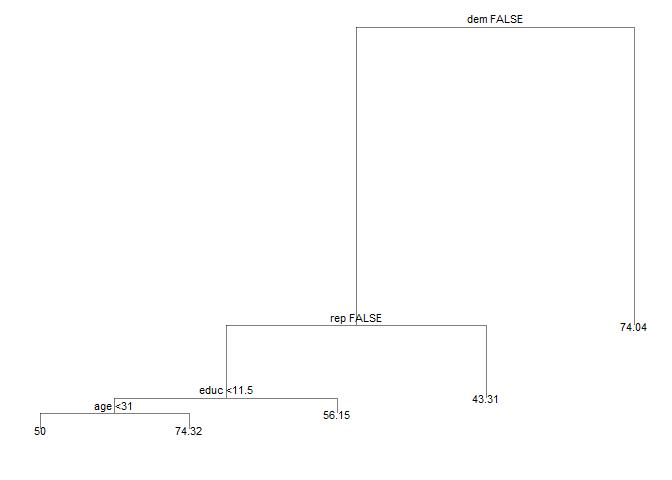

``` r
mse(biden_tree_def, joe_test)
```

    ## [1] 402

The graph shows that party affliation is the most important predictor of this Biden feeling thermometer scores. According to the regression tree, the model estimates a Biden feeling score of 74.04 if you identify as a Democrat. If you identify as a Republican, the model estimates a Biden feeling score of 43.31. If you are not affliated with either parties, the second most important predicator is education. The model estimates a Biden feeling score of 56.15 for independent individuals with more than 11.5 years of education. For independent individuals with education less than 11.5 years and are less than 31 years old, the model estimates a Biden feeling score of 50. Lastly, the model estimates a Biden feeling score of 74.32 for independent individuals with less than 11.5 years of education and are older than 31.

The MSE of the model is 402.381.

**3.Now fit another tree to the training data with the following `control` options. Use cross-validation to determine the optimal level of tree complexity, plot the optimal tree, and interpret the results. Does pruning the tree improve the test MSE? **

``` r
biden_tree_control <- tree(biden ~ ., data = joe_train, 
     control = tree.control(nobs = nrow(joe_train),
                            mindev = 0))
a <- 2:50
mse_leaf <- vector("double", length(2:50))
for(i in seq_along(a)) {
  mod <- prune.tree(biden_tree_control, best = a[i]) 
  mse_leaf[i] <- mse(mod, joe_test)
}

mse_list <- data.frame(x = 1:49, mse = mse_leaf)

mse_list %>% 
  ggplot() + 
  geom_line(aes(x = x, y = mse), size = 1.5, color = "cadetblue2") + 
  labs(title = "Regression Trees for Joe Biden Feeling Thermometer Scores",
       subtitle = "With terminal nodes from 2 to 50",
       y = "Mean Squared Errors", 
       x = "Number of Terminal Nodes")
```

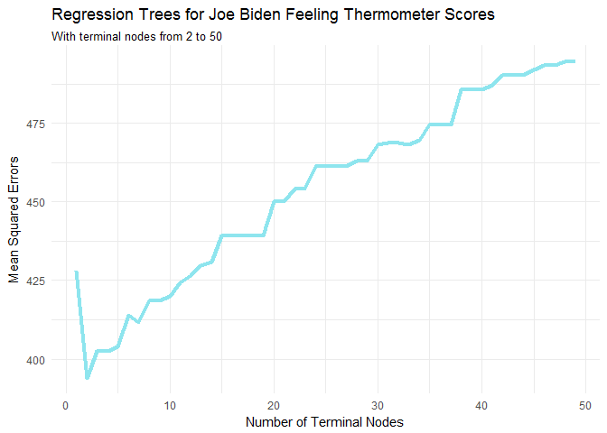

``` r
opt_nodes <- which.min(mse_leaf) + 1 #index is one smaller than actual terminal nodes
mse_leaf[2] #MSE of optimal tree 
```

    ## [1] 394

Using cross validation, we identify that MSE is minimized at 3 terminal nodes in the tree. Pruning the tree definitely improves the test MSE as MSE is reduced from 402.381 to 393.943.

``` r
prune_plot(biden_tree_control, opt_nodes) #plot optimal regression tree 
```

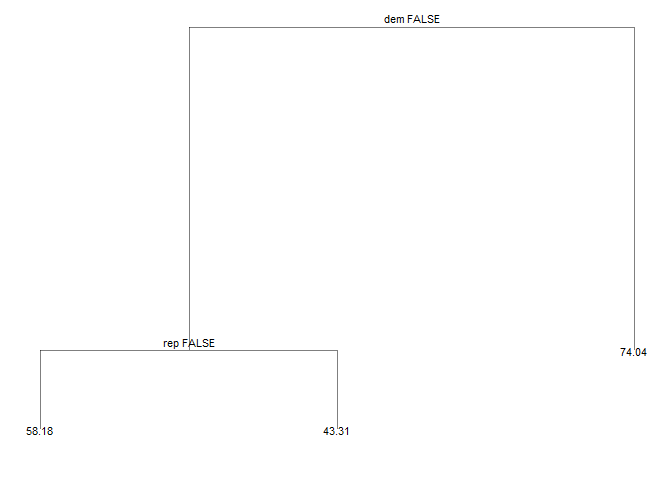 The optimal regression tree estimates:
\* a score of 74.04 for the Biden feeling thermometer if one is democrat. \* a score of 43.31 for the Biden feeling thermometer if one is republican. \* a score of 58.18 for the Biden feeling thermometer if one is not politically affliated.

**4. Use the bagging approach to analyze this data. What test MSE do you obtain? Obtain variable importance measures and interpret the results.** We compute 500 bootstrapped trees using the training data and testing the model with the validation set.

``` r
(joe_bag <- randomForest(biden ~ ., data = joe_train, mtry = 5, ntree = 500))
```

    ## 
    ## Call:
    ##  randomForest(formula = biden ~ ., data = joe_train, mtry = 5,      ntree = 500) 
    ##                Type of random forest: regression
    ##                      Number of trees: 500
    ## No. of variables tried at each split: 5
    ## 
    ##           Mean of squared residuals: 509
    ##                     % Var explained: 10.4

``` r
mse(joe_bag, joe_test)
```

    ## [1] 463

``` r
data_frame(var = rownames(importance(joe_bag)),
           MeanDecreaseGini = importance(joe_bag)[,1]) %>%
  mutate(var = fct_reorder(var, MeanDecreaseGini, fun = median)) %>%
  ggplot(aes(var, MeanDecreaseGini)) +
  geom_point() +
  coord_flip() +
  labs(title = "Predicting survival on the Biden feeling thermometer",
       subtitle = "Bagging",
       x = NULL,
       y = "Average decrease in the Gini Index")
```

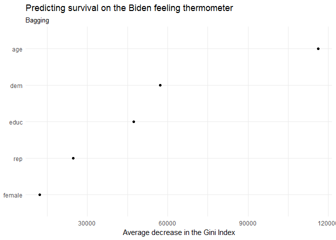

``` r
seq.int(joe_bag$ntree) %>%
  map_df(~ getTree(joe_bag, k = ., labelVar = TRUE)[1,]) %>%
  count(`split var`) %>%
  knitr::kable(caption = "Variable used to generate the first split in each tree",
               col.names = c("Variable used to split", "Number of training observations"))
```

| Variable used to split |  Number of training observations|
|:-----------------------|--------------------------------:|
| dem                    |                              400|
| rep                    |                              100|

For classification trees, larger values are better. For the Biden bagged model, age, political affliations (i.e. `dem`, `rep`) and education are the most important predictors, whereas gender is relatively unimportant. The test MSE for the bagging approach is 462.755.

**5. Use the random forest approach to analyze this data. What test MSE do you obtain? Obtain variable importance measures and interpret the results. Describe the effect of *m*, the number of variables considered at each split, on the error rate obtained.**

``` r
err.rate.rf <- function(model, data) {
  data <- as_tibble(data)
  response <- as.character(model$terms[[2]])
  
  pred <- predict(model, newdata = data, type = "response")
  actual <- data[[response]]
  
  return(mean(pred != actual, na.rm = TRUE))
}


(joe_rf <- randomForest(biden ~ ., data = joe_train, ntree = 500))
```

    ## 
    ## Call:
    ##  randomForest(formula = biden ~ ., data = joe_train, ntree = 500) 
    ##                Type of random forest: regression
    ##                      Number of trees: 500
    ## No. of variables tried at each split: 1
    ## 
    ##           Mean of squared residuals: 429
    ##                     % Var explained: 24.5

``` r
mse(joe_rf, joe_test)
```

    ## [1] 400

``` r
seq.int(joe_rf$ntree) %>%
  map_df(~ getTree(joe_rf, k = ., labelVar = TRUE)[1,]) %>%
  count(`split var`) %>%
  knitr::kable(caption = "Variable used to generate the first split in each tree",
               col.names = c("Variable used to split", "Number of training observations"))
```

    ## Warning in bind_rows_(x, .id): Unequal factor levels: coercing to character

| Variable used to split |  Number of training observations|
|:-----------------------|--------------------------------:|
| age                    |                               89|
| dem                    |                              106|
| educ                   |                               98|
| female                 |                              103|
| rep                    |                              104|

``` r
data_frame(var = rownames(importance(joe_rf)),
           `Random forest` = importance(joe_rf)[,1]) %>%
  left_join(data_frame(var = rownames(importance(joe_rf)),
           Bagging = importance(joe_bag)[,1])) %>%
  mutate(var = fct_reorder(var, Bagging, fun = median)) %>%
  gather(model, gini, -var) %>%
  ggplot(aes(var, gini, color = model)) +
  geom_point() +
  coord_flip() +
  labs(title = "Predicting survival on the Biden's feeling thermometer",
       x = NULL,
       y = "Average decrease in the Gini Index",
       color = "Method")
```

    ## Joining, by = "var"

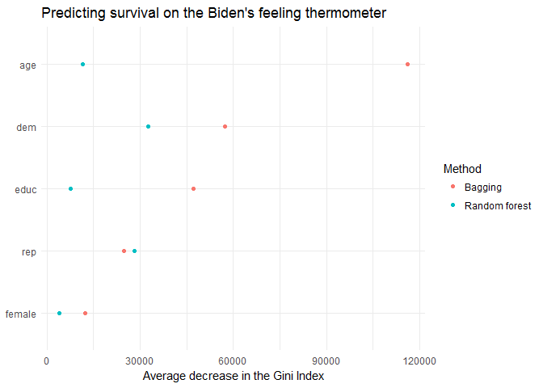

The random forest approach returns a test MSE of 400.3 whereas the bagging approach returns a test MSE of 462.755. The random forest model also explains 24.5% of the variation, as compared to 10.4% in the bagging approach.

In the random forest model, political affliations `dem` and `rep` are no longer exclusively used to generate the first split for each tree. In fact, each variable has been used as the first split of the tree equally (i.e. there were 5 predictors and each predicator were the first split for approximately 20% of the trees). We can also observe that the average decrease in the Gini index associated with each variable is generally smaller using the random forest method compared to bagging. This is because the random forests approach intentionally ignores a random set of variables every time a new split is considered. Rather than considering all n predictors, it considers a subset of predictors, where $m = \\sqrt(n)$, at every new split. The variable restriction imposed by m allows us to decorrelate the regression trees and explain greater variation in the data, rather than overfitting to a predominant predictor in the data.

**6. Use the boosting approach to analyze the data. What test MSE do you obtain? How does the value of the shrinkage parameter *λ* influence the test MSE?**

``` r
joe_split <- resample_partition(joe, p = c("test" = .3,
                                           "train" = .7))

joe_models <- list("bagging" = randomForest(biden ~ ., data = joe_split$train,
                                                mtry = 5, ntree = 10000),
                       "rf_mtry2" = randomForest(biden ~ ., data = joe_split$train,
                                                 mtry = 2, ntree = 10000),
                       "rf_mtry4" = randomForest(biden ~ ., data = joe_split$train,
                                                 mtry = 4, ntree = 10000),
                       "boosting_depth1" = gbm(as.numeric(biden) - 1 ~ .,
                                               data = joe_split$train,
                                               n.trees = 10000, interaction.depth = 1),
                       "boosting_depth2" = gbm(as.numeric(biden) - 1 ~ .,
                                               data = joe_split$train,
                                               n.trees = 10000, interaction.depth = 2),
                       "boosting_depth4" = gbm(as.numeric(biden) - 1 ~ .,
                                               data = joe_split$train,
                                               n.trees = 10000, interaction.depth = 4))
```

    ## Distribution not specified, assuming gaussian ...
    ## Distribution not specified, assuming gaussian ...
    ## Distribution not specified, assuming gaussian ...

Part 2: Modeling voter turnout \[3 points\]
===========================================

**Use cross-validation techniques and standard measures of model fit (e.g. test error rate, PRE, ROC curves/AUC) to compare and evaluate at least five tree-based models of voter turnout. Select the best model and interpret the results using whatever methods you see fit (graphs, tables, model fit statistics, predictions for hypothetical observations, etc.)**

To investigate the relationship between mental health and voter turnout, we designed five tree-based models of voter turnout. In our first model, we included all possible predictors in our dataset. We then proceed to conduct bagging of model 1 in our second model. Then we improve on bagging by decorrelating individual trees with random forests in our third model. In the fourth model, we include the top 4 predictors from the variable importance table in bagging. In the fifth model, we include `mhealth_sum` as the only predictor of the model.

``` r
vote <- read.csv("./data/mental_health.csv") %>%
  as_tibble() %>%
  na.omit(mhealth_sum) %>%
  mutate(vote96 = factor(vote96, levels = 0:1, labels = c("Did not vote", "Voted")),
         female = factor(female, levels = 0:1, labels = c("Male", "Female")),
         black = factor(black, levels = 0:1, labels = c("Non-black", "Black")),
         married = factor(married, levels = 0:1, labels = c("Not married", "Married")))


vote_split <- resample_partition(vote, p = c("test" = .3, "train" = .7))

#model 1 : all vars 
vote_tree <- tree(vote96 ~ ., data = as_tibble(vote_split$train))
summary(vote_tree)
```

    ## 
    ## Classification tree:
    ## tree(formula = vote96 ~ ., data = as_tibble(vote_split$train))
    ## Variables actually used in tree construction:
    ## [1] "age"         "mhealth_sum" "educ"        "inc10"      
    ## Number of terminal nodes:  9 
    ## Residual mean deviance:  1.03 = 834 / 807 
    ## Misclassification error rate: 0.275 = 224 / 816

``` r
plot(vote_tree)
text(vote_tree, pretty = 0)
```


``` r
fitted <- predict(vote_tree, as_tibble(vote_split$test), type = "class")
tree_err <- mean(as_tibble(vote_split$test)$vote96 != fitted)
tree_err
```

    ## [1] 0.318

``` r
roc_tree1 <- roc(as.numeric(as_tibble(vote_split$test)$vote96), as.numeric(fitted))
plot(roc_tree1)
```


``` r
auc(roc_tree1)
```

    ## Area under the curve: 0.536

``` r
#model2 : bagging 

(vote_bag <- randomForest(vote96 ~ ., data = vote_split$train,
                             mtry = 6, ntree = 500))
```

    ## 
    ## Call:
    ##  randomForest(formula = vote96 ~ ., data = vote_split$train, mtry = 6,      ntree = 500) 
    ##                Type of random forest: classification
    ##                      Number of trees: 500
    ## No. of variables tried at each split: 6
    ## 
    ##         OOB estimate of  error rate: 29.7%
    ## Confusion matrix:
    ##              Did not vote Voted class.error
    ## Did not vote          130   139       0.517
    ## Voted                 103   444       0.188

``` r
data_frame(var = rownames(importance(vote_bag)),
           MeanDecreaseRSS = importance(vote_bag)[,1]) %>%
  mutate(var = fct_reorder(var, MeanDecreaseRSS, fun = median)) %>%
  ggplot(aes(var, MeanDecreaseRSS)) +
  geom_point() +
  coord_flip() +
  labs(title = "Predicting voter turnout",
       subtitle = "Bagging",
       x = NULL,
       y = "Average decrease in the Gini Index")
```

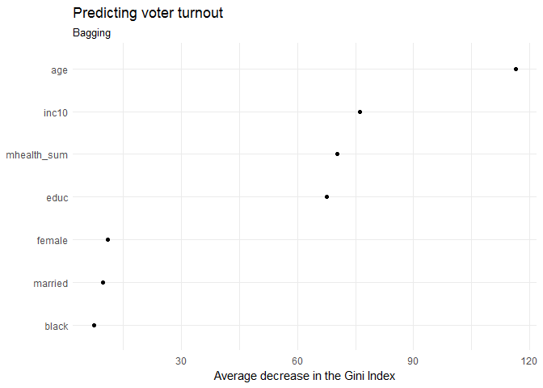

``` r
fitted <- predict(vote_bag, as_tibble(vote_split$test), type = "class")
tree_err <- mean(as_tibble(vote_split$test)$vote96 != fitted)
tree_err
```

    ## [1] 0.324

``` r
roc_tree2 <- roc(as.numeric(as_tibble(vote_split$test)$vote96), as.numeric(fitted))
plot(roc_tree2)
```


``` r
auc(roc_tree2)
```

    ## Area under the curve: 0.609

``` r
#model3: random forests 
(vote_rf <- randomForest(vote96 ~ ., data = vote_split$train,
                             mtry = floor(sqrt(6)), ntree = 500))
```

    ## 
    ## Call:
    ##  randomForest(formula = vote96 ~ ., data = vote_split$train, mtry = floor(sqrt(6)),      ntree = 500) 
    ##                Type of random forest: classification
    ##                      Number of trees: 500
    ## No. of variables tried at each split: 2
    ## 
    ##         OOB estimate of  error rate: 27.6%
    ## Confusion matrix:
    ##              Did not vote Voted class.error
    ## Did not vote          126   143       0.532
    ## Voted                  82   465       0.150

``` r
data_frame(var = rownames(importance(vote_rf)),
           MeanDecreaseRSS = importance(vote_rf)[,1]) %>%
  mutate(var = fct_reorder(var, MeanDecreaseRSS, fun = median)) %>%
  ggplot(aes(var, MeanDecreaseRSS)) +
  geom_point() +
  coord_flip() +
  labs(title = "Predicting voter turnout",
       subtitle = "Random Forests",
       x = NULL,
       y = "Average decrease in the Gini Index")
```

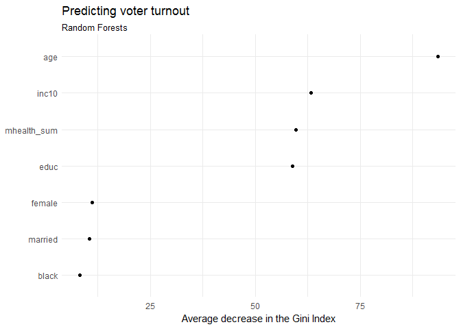

``` r
fitted <- predict(vote_rf, as_tibble(vote_split$test), type = "class")
tree_err <- mean(as_tibble(vote_split$test)$vote96 != fitted)
tree_err
```

    ## [1] 0.315

``` r
roc_tree3 <- roc(as.numeric(as_tibble(vote_split$test)$vote96), as.numeric(fitted))
plot(roc_tree3)
```

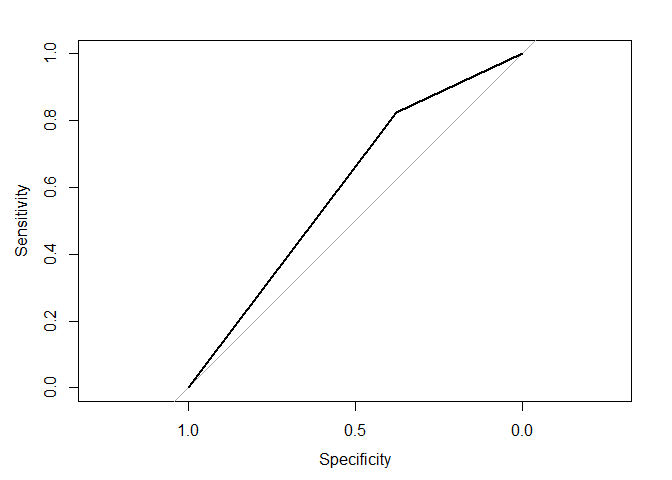

``` r
auc(roc_tree3)
```

    ## Area under the curve: 0.601

``` r
#model4: based on variable importance in bagging 
vote_tree <- tree(vote96 ~ age + inc10 + educ + mhealth_sum, data = as_tibble(vote_split$train))
summary(vote_tree)
```

    ## 
    ## Classification tree:
    ## tree(formula = vote96 ~ age + inc10 + educ + mhealth_sum, data = as_tibble(vote_split$train))
    ## Number of terminal nodes:  9 
    ## Residual mean deviance:  1.03 = 834 / 807 
    ## Misclassification error rate: 0.275 = 224 / 816

``` r
plot(vote_tree)
text(vote_tree, pretty = 0)
```

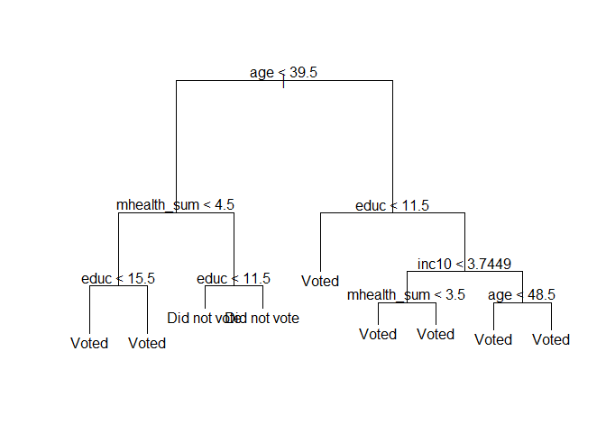

``` r
fitted <- predict(vote_tree, as_tibble(vote_split$test), type = "class")
tree_err <- mean(as_tibble(vote_split$test)$vote96 != fitted)
tree_err
```

    ## [1] 0.318

``` r
roc_tree4 <- roc(as.numeric(as_tibble(vote_split$test)$vote96), as.numeric(fitted))
plot(roc_tree4)
```

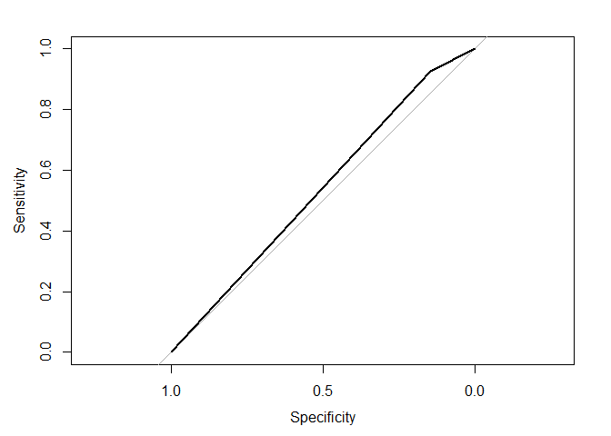

``` r
auc(roc_tree4)
```

    ## Area under the curve: 0.536

``` r
#model5 : only mental health 
vote_tree <- tree(vote96 ~ mhealth_sum, data = as_tibble(vote_split$train))
summary(vote_tree)
```

    ## 
    ## Classification tree:
    ## tree(formula = vote96 ~ mhealth_sum, data = as_tibble(vote_split$train))
    ## Number of terminal nodes:  2 
    ## Residual mean deviance:  1.19 = 971 / 814 
    ## Misclassification error rate: 0.315 = 257 / 816

``` r
plot(vote_tree)
text(vote_tree, pretty = 0)
```

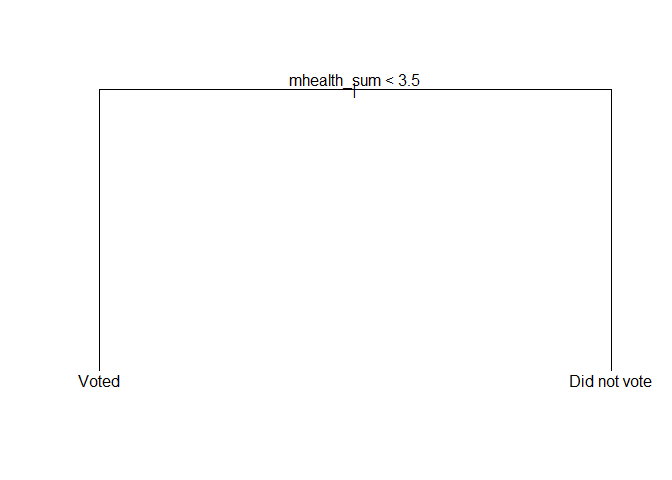

``` r
fitted <- predict(vote_tree, as_tibble(vote_split$test), type = "class")
tree_err <- mean(as_tibble(vote_split$test)$vote96 != fitted)
tree_err
```

    ## [1] 0.341

``` r
roc_tree5 <- roc(as.numeric(as_tibble(vote_split$test)$vote96), as.numeric(fitted))
plot(roc_tree5)
```

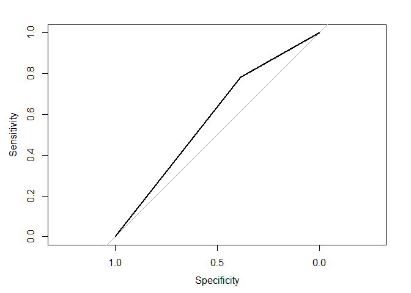

``` r
auc(roc_tree5)
```

    ## Area under the curve: 0.584

``` r
#plot all ROCs 
plot(roc_tree1, print.auc = TRUE, col = "blue", print.auc.x = .2)
plot(roc_tree2, print.auc = TRUE, col = "red", print.auc.x = .2, print.auc.y = .4, add = TRUE)
plot(roc_tree3, print.auc = TRUE, col = "orange", print.auc.x = .2, print.auc.y = .3, add = TRUE)
plot(roc_tree4, print.auc = TRUE, col = "green", print.auc.x = .2, print.auc.y = .2, add = TRUE)
plot(roc_tree5, print.auc = TRUE, col = "purple", print.auc.x = .2, print.auc.y = .1, add = TRUE)
```

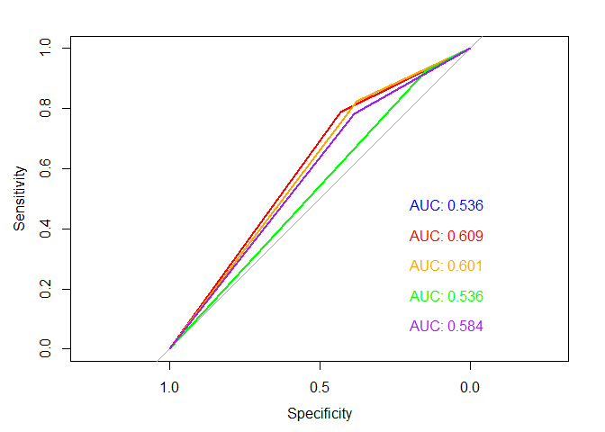

From the ROC curves plotted, we can identify that the best performing model is the bagging with a highest AUC of 0.609 and one of the highest OOB error rates of 29.7%. The variable importance plot highlights age, income, mental health indicator, education as the most important predictors of voter turnout, whereas female, marriage status and ethinicity (i.e. black) are unimportant.

From the ROC curves and error rates, we can also observe the trade off between specificity and sensitivity. When we compare model 4 (top 4 important predictors) and model 5 (only mental health), model 5 has a higher AUC of 0.584 than model 4, 0.536. However, the error rate of model 5 is 31.5%, which is higher than 27.5% in model 4. This shows that while including more predictors in the model will reduce error rate in this dataset, it might also increase error rate in test sets.

**Use cross-validation techniques and standard measures of model fit (e.g. test error rate, PRE, ROC curves/AUC) to compare and evaluate at least five SVM models of voter turnout. Select the best model and interpret the results using whatever methods you see fit (graphs, tables, model fit statistics, predictions for hypothetical observations, etc.)**

``` r
vote <- read.csv("./data/mental_health.csv") %>%
  as_tibble() %>%
  na.omit(mhealth_sum) %>%
  mutate(vote96 = factor(vote96, levels = 0:1, labels = c("Did not vote", "Voted")),
         female = factor(female, levels = 0:1, labels = c("Male", "Female")),
         black = factor(black, levels = 0:1, labels = c("Non-black", "Black")),
         married = factor(married, levels = 0:1, labels = c("Not married", "Married")))

vote_split <- resample_partition(vote, p = c("test" = .3, "train" = .7))

svm_all <- function(kerneltype){
  vote_tune <- tune(svm, vote96 ~ . , data = as_tibble(vote_split$train),
                    kernel = kerneltype,
                    range = list(cost = c(.001, .01, .1, 1, 5, 10, 100)))
  summary(vote_tune)
  
  vote_best <- vote_tune$best.model
  summary(vote_best)
  
  fitted <- predict(vote_best, as_tibble(vote_split$test), decision.values = TRUE) %>%
    attributes
  
  if(kerneltype == "linear"){
    roc_line <- roc(as_tibble(vote_split$test)$vote96, fitted$decision.values)
    plot(roc_line)
    auc(roc_line)
    return(roc_line)
  }
  if(kerneltype == "polynomial"){
    roc_poly <- roc(as_tibble(vote_split$test)$vote96, fitted$decision.values)
    plot(roc_poly)
    auc(roc_poly)
    return(roc_poly)
  }
  if(kerneltype == "radial"){
    roc_rad <- roc(as_tibble(vote_split$test)$vote96, fitted$decision.values)
    plot(roc_rad)
    auc(roc_rad)
    return(roc_rad)
  }
}

vote <- read.csv("./data/mental_health.csv") %>%
  as_tibble() %>%
  na.omit(mhealth_sum) %>%
  mutate(vote96 = factor(vote96, levels = 0:1, labels = c("Did not vote", "Voted")),
         female = factor(female, levels = 0:1, labels = c("Male", "Female")),
         black = factor(black, levels = 0:1, labels = c("Non-black", "Black")),
         married = factor(married, levels = 0:1, labels = c("Not married", "Married")))

vote_split <- resample_partition(vote, p = c("test" = .3, "train" = .7))

svm_some <- function(kerneltype){
  vote_tune <- tune(svm, vote96 ~ mhealth_sum + age + inc10 + educ, data = as_tibble(vote_split$train),
                    kernel = kerneltype,
                    range = list(cost = c(.001, .01, .1, 1, 5, 10, 100)))
  summary(vote_tune)
  
  vote_best <- vote_tune$best.model
  summary(vote_best)
  
  fitted <- predict(vote_best, as_tibble(vote_split$test), decision.values = TRUE) %>%
    attributes
  
  if(kerneltype == "linear"){
    roc_line <- roc(as_tibble(vote_split$test)$vote96, fitted$decision.values)
    plot(roc_line)
    auc(roc_line)
    return(roc_line)
    return(summary(vote_tune))
  }
  if(kerneltype == "polynomial"){
    roc_poly <- roc(as_tibble(vote_split$test)$vote96, fitted$decision.values)
    plot(roc_poly)
    auc(roc_poly)
    return(roc_poly)
    return(summary(vote_tune))
  }
  if(kerneltype == "radial"){
    roc_rad <- roc(as_tibble(vote_split$test)$vote96, fitted$decision.values)
    plot(roc_rad)
    auc(roc_rad)
    return(roc_rad)
    return(summary(vote_tune))
  }
}

roc_line <- svm_all("linear")
```

    ## Warning in roc.default(as_tibble(vote_split$test)$vote96, fitted
    ## $decision.values): Deprecated use a matrix as predictor. Unexpected results
    ## may be produced, please pass a numeric vector.


``` r
roc_poly <- svm_all("polynomial")
```

    ## Warning in roc.default(as_tibble(vote_split$test)$vote96, fitted
    ## $decision.values): Deprecated use a matrix as predictor. Unexpected results
    ## may be produced, please pass a numeric vector.


``` r
roc_rad <- svm_all("radial")
```

    ## Warning in roc.default(as_tibble(vote_split$test)$vote96, fitted
    ## $decision.values): Deprecated use a matrix as predictor. Unexpected results
    ## may be produced, please pass a numeric vector.


``` r
roc_some_line <- svm_some("linear")
```

    ## Warning in roc.default(as_tibble(vote_split$test)$vote96, fitted
    ## $decision.values): Deprecated use a matrix as predictor. Unexpected results
    ## may be produced, please pass a numeric vector.


``` r
roc_some_poly <- svm_some("polynomial")
```

    ## Warning in roc.default(as_tibble(vote_split$test)$vote96, fitted
    ## $decision.values): Deprecated use a matrix as predictor. Unexpected results
    ## may be produced, please pass a numeric vector.


``` r
roc_some_rad <- svm_some("radial")
```

    ## Warning in roc.default(as_tibble(vote_split$test)$vote96, fitted
    ## $decision.values): Deprecated use a matrix as predictor. Unexpected results
    ## may be produced, please pass a numeric vector.


``` r
plot(roc_line, print.auc = TRUE, col = "blue")
plot(roc_poly, print.auc = TRUE, col = "red", print.auc.y = .4, add = TRUE)
plot(roc_rad, print.auc = TRUE, col = "orange", print.auc.y = .3, add = TRUE)
plot(roc_some_line, print.auc = TRUE, col = "green", print.auc.y = .2, add = TRUE)
plot(roc_some_poly, print.auc = TRUE, col = "purple", print.auc.y = .1, add = TRUE)
plot(roc_some_rad, print.auc = TRUE, col = "brown", print.auc.y = .025, add = TRUE)
```


From the ROC plots of the five SVM models, the best models are model 1 and model 4. Both of which used the linear kernel with differing sets of predictors. Model 1 used all the predictors in the dataset, whereas model 2 used the top 4 important variables from the bagging approach in the earlier section of part 2 of the assignment. Model 1 had a AUC of 0.774 and model 2 had a AUC of 0.773. From the results of ROC curves, we deduce that polynomial kernels fits the model least and linear kernels fit the model best.

Part 3: OJ Simpson \[4 points\]
===============================

In October 1995 in what was termed "the trial of the century", O.J. Simpson was acquitted by a jury of murdering his wife Nicole Brown Simpson and her friend Ronald Goldman. The topic of Simpson's guilt or innocence divided Americans along racial lines, as Simpson is black and his wife was white. Especially in the aftermath of the 1992 Los Angeles riots sparked by the videotaped beating of Rodney King and subsequent acquittal of officers charged with police brutality, the Simpson trial illustrated many of the racial divides in the United States.

The CBS News/New York Times monthly poll conducted in September 1995 asked respondents several questions about the closing arguments and verdict in the case. All the relevant variables are contained in `simpson.csv`.

-   `guilt` - 1 if the respondent thinks OJ Simpson was "probably guilty", 0 if the respondent thinks OJ Simpson was "probably not guilty"
-   `dem` - Democrat
-   `rep` - Republican
-   `ind` - Independent
-   `age` - Age of respondent
-   `educ` - Highest education level of the respondent
-   `female` - Respondent is female
-   `black` - Respondent is black
-   `hispanic` - Respondent is hispanic
-   `income` - Self-reported income

**What is the relationship between race and belief of OJ Simpson's guilt? Develop a robust statistical learning model and use this model to explain the impact of an individual's race on their beliefs about OJ Simpson's guilt.**

You can make full use of any of the statistical learning techniques to complete this part of the assignment: \* Linear regression \* Logistic regression \* Generalized linear models \* Non-linear linear models \* Tree-based models \* Support vector machines \* Resampling methods

Select methods that are appropriate for each question and **justify the use of these methods**.

We begin to identify the relationship between race and belief of OF Simpson's guilt with a logistic regression. We chose a logistic regression as our response variable is a binary variable: 0 - probably not guilty, 1 - probably guilty.

``` r
logit2prob <- function(x){
  exp(x) / (1 + exp(x))
}

#import 
simpson <- read.csv("./data/simpson.csv") %>%
  as_tibble() %>%
  mutate(guilt = factor(guilt, levels = 0:1),
         dem = factor(dem, levels = 0:1, labels = c("Non-democrat", "Democrat")),
         rep = factor(rep, levels = 0:1, labels = c("Non-republican", "Republican")),
         ind = factor(ind, levels = 0:1, labels = c("Affliated", "Not affliated")),
         female = factor(female, levels = 0:1, labels = c("Male", "Female")),
         black = factor(black, levels = 0:1, labels = c("Non-black", "Black")),
         hispanic = factor(hispanic, levels = 0:1, labels = c("Non-hispanic", "Hispanic")))

#split training-test set
simpson_split <- resample_partition(simpson, c(test = 0.3, train = 0.7))
simpson_test <- simpson_split$test %>%
  as_tibble() 

#logistic model estimation 
race_log <- glm(guilt ~ age + educ + female + income + black + hispanic, data = simpson_split$train, family = binomial)
pander(summary(race_log))
```

<table>
<colgroup>
<col width="42%" />
<col width="14%" />
<col width="16%" />
<col width="12%" />
<col width="12%" />
</colgroup>
<thead>
<tr class="header">
<th align="center"> </th>
<th align="center">Estimate</th>
<th align="center">Std. Error</th>
<th align="center">z value</th>
<th align="center">Pr(&gt;|z|)</th>
</tr>
</thead>
<tbody>
<tr class="odd">
<td align="center"><strong>age</strong></td>
<td align="center">0.01639</td>
<td align="center">0.005139</td>
<td align="center">3.189</td>
<td align="center">0.001426</td>
</tr>
<tr class="even">
<td align="center"><strong>educHIGH SCHOOL GRAD</strong></td>
<td align="center">-0.4685</td>
<td align="center">0.2294</td>
<td align="center">-2.042</td>
<td align="center">0.04117</td>
</tr>
<tr class="odd">
<td align="center"><strong>educNOT A HIGH SCHOOL GRAD</strong></td>
<td align="center">-1.173</td>
<td align="center">0.3305</td>
<td align="center">-3.549</td>
<td align="center">0.0003871</td>
</tr>
<tr class="even">
<td align="center"><strong>educREFUSED</strong></td>
<td align="center">11.47</td>
<td align="center">378.3</td>
<td align="center">0.03032</td>
<td align="center">0.9758</td>
</tr>
<tr class="odd">
<td align="center"><strong>educSOME COLLEGE(TRADE OR BUSINESS)</strong></td>
<td align="center">-0.3918</td>
<td align="center">0.2361</td>
<td align="center">-1.659</td>
<td align="center">0.09706</td>
</tr>
<tr class="even">
<td align="center"><strong>femaleFemale</strong></td>
<td align="center">-0.4318</td>
<td align="center">0.1784</td>
<td align="center">-2.42</td>
<td align="center">0.01551</td>
</tr>
<tr class="odd">
<td align="center"><strong>income$30,000-$50,000</strong></td>
<td align="center">-0.03969</td>
<td align="center">0.2234</td>
<td align="center">-0.1777</td>
<td align="center">0.859</td>
</tr>
<tr class="even">
<td align="center"><strong>income$50,000-$75,000</strong></td>
<td align="center">0.3681</td>
<td align="center">0.3049</td>
<td align="center">1.207</td>
<td align="center">0.2274</td>
</tr>
<tr class="odd">
<td align="center"><strong>incomeOVER $75,000</strong></td>
<td align="center">0.3814</td>
<td align="center">0.3549</td>
<td align="center">1.075</td>
<td align="center">0.2825</td>
</tr>
<tr class="even">
<td align="center"><strong>incomeREFUSED/NO ANSWER</strong></td>
<td align="center">-0.9043</td>
<td align="center">0.3644</td>
<td align="center">-2.482</td>
<td align="center">0.01308</td>
</tr>
<tr class="odd">
<td align="center"><strong>incomeUNDER $15,000</strong></td>
<td align="center">-0.4444</td>
<td align="center">0.2749</td>
<td align="center">-1.617</td>
<td align="center">0.1059</td>
</tr>
<tr class="even">
<td align="center"><strong>blackBlack</strong></td>
<td align="center">-2.941</td>
<td align="center">0.2196</td>
<td align="center">-13.39</td>
<td align="center">6.523e-41</td>
</tr>
<tr class="odd">
<td align="center"><strong>hispanicHispanic</strong></td>
<td align="center">-0.3015</td>
<td align="center">0.3154</td>
<td align="center">-0.9562</td>
<td align="center">0.339</td>
</tr>
<tr class="even">
<td align="center"><strong>(Intercept)</strong></td>
<td align="center">1.42</td>
<td align="center">0.3461</td>
<td align="center">4.102</td>
<td align="center">4.099e-05</td>
</tr>
</tbody>
</table>

(Dispersion parameter for binomial family taken to be 1 )

<table style="width:62%;">
<colgroup>
<col width="26%" />
<col width="36%" />
</colgroup>
<tbody>
<tr class="odd">
<td align="center">Null deviance:</td>
<td>1237.7 on 992 degrees of freedom</td>
</tr>
<tr class="even">
<td align="center">Residual deviance:</td>
<td>912.6 on 979 degrees of freedom</td>
</tr>
</tbody>
</table>

``` r
#accuracy rate
acc_log <- simpson_test %>%
  add_predictions(race_log) %>%
  mutate(pred = logit2prob(pred),
         pred = as.numeric(pred > .5))

accuracy_log <- mean(acc_log$guilt == acc_log$pred, na.rm = TRUE)
accuracy_log 
```

    ## [1] 0.837

``` r
#ROC
auc_log <- auc(acc_log$guilt, acc_log$pred)
auc_log
```

    ## Area under the curve: 0.756

Even after controlling for other variables, race, `black`, remains highly statistically significant in the logistic regression. The log-odds of an individual believing that OJ Simpson is probably guilty decreases by 3.12 if the individual is black, compared to a non-black individual, considering all other factors constant.

**How can you predict whether individuals believe OJ Simpson to be guilty of these murders? Develop a robust statistical learning model to predict whether individuals believe OJ Simpson to be either probably guilty or probably not guilty and demonstrate the effectiveness of this model using methods we have discussed in class.**

This model performs rather well, with an test set accuracy of 0.837 and an area under curve for the ROC curve of 0.756.

We then proceed to use decision trees for a predictive model.

``` r
err.rate.tree <- function(model, data) {
  data <- as_tibble(data)
  response <- as.character(model$terms[[2]])
  
  pred <- predict(model, newdata = data, type = "class")
  actual <- data[[response]]
  
  return(mean(pred != actual, na.rm = TRUE))
}

# label guilt 
simpson <- simpson %>%
  mutate(guilt = factor(guilt, levels = 0:1, labels = c("Probably innocent", "Probably guilty")))

# generate 10-fold CV trees
simpson_cv <- simpson %>%
  na.omit() %>%
  crossv_kfold(k = 10) %>%
  mutate(tree = map(train, ~ tree(guilt ~ age + educ + female + income + black + hispanic, data = .,
     control = tree.control(nobs = nrow(simpson),
                            mindev = .001))))

# calculate each possible prune result for each fold
simpson_cv <- expand.grid(simpson_cv$.id,
                          seq(from = 2, to = ceiling(length(mod$frame$yval) / 2))) %>%
  as_tibble() %>%
  mutate(Var2 = as.numeric(Var2)) %>%
  rename(.id = Var1,
         k = Var2) %>%
  left_join(simpson_cv) %>%
  mutate(prune = map2(tree, k, ~ prune.misclass(.x, best = .y)),
         mse = map2_dbl(prune, test, err.rate.tree))
```

    ## Joining, by = ".id"

    ## Warning in left_join_impl(x, y, by$x, by$y, suffix$x, suffix$y): joining
    ## character vector and factor, coercing into character vector

``` r
simpson_cv %>%
  group_by(k) %>%
  summarize(test_mse = mean(mse),
            sd = sd(mse, na.rm = TRUE)) %>%
  ggplot(aes(k, test_mse)) +
  geom_point() +
  geom_line() +
  labs(title = "simpson survival tree",
       subtitle = "Age + Gender",
       x = "Number of terminal nodes",
       y = "Test error rate")
```

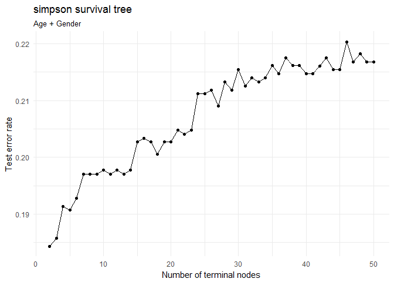

``` r
# estimate model
oj_tree <- tree(guilt ~ age + educ + female + income + black + hispanic, data = simpson)

# plot optimal tree
mod <- prune.tree(oj_tree, best = 2)
summary(mod)
```

    ## 
    ## Classification tree:
    ## snip.tree(tree = oj_tree, nodes = 2L)
    ## Variables actually used in tree construction:
    ## [1] "black"
    ## Number of terminal nodes:  2 
    ## Residual mean deviance:  0.956 = 1350 / 1410 
    ## Misclassification error rate: 0.184 = 261 / 1416

``` r
tree_data <- dendro_data(mod)
ggplot(segment(tree_data)) +
  geom_segment(aes(x = x, y = y, xend = xend, yend = yend), 
               alpha = 0.5) +
  geom_text(data = label(tree_data), 
            aes(x = x, y = y, label = label_full), vjust = -0.5, size = 3) +
  geom_text(data = leaf_label(tree_data), 
            aes(x = x, y = y, label = label), vjust = 0.5, size = 3) +
  theme_dendro() +
  labs(title = "OJ Simpson's Verdict Response tree",
       subtitle = "age + educ + female + income + black + hispanic")
```

 Firstly, we used 10-fold CV to determine the number of terminal nodes in our decision tree. In our model, the error rate is minimized at 2 terminal nodes. Then we proceed to plot our optimal decision tree. From our plot, we can see that `black` remains the most important predictor in the model, corroborating with our findings earlier in the logistic regression.

The misclassification error in the decision tree is 18.7%.

Lastly, we attempt to reduce variance with the random forests approach.

``` r
simpson <- simpson %>% 
  na.omit()

(simpson_rf <- randomForest(guilt ~ age + educ + female + income + black + hispanic, data = simpson,
                            ntree = 500))
```

    ## 
    ## Call:
    ##  randomForest(formula = guilt ~ age + educ + female + income +      black + hispanic, data = simpson, ntree = 500) 
    ##                Type of random forest: classification
    ##                      Number of trees: 500
    ## No. of variables tried at each split: 2
    ## 
    ##         OOB estimate of  error rate: 18.8%
    ## Confusion matrix:
    ##                   Probably innocent Probably guilty class.error
    ## Probably innocent               229             213      0.4819
    ## Probably guilty                  53             921      0.0544

``` r
seq.int(simpson_rf$ntree) %>%
  map_df(~ getTree(simpson_rf, k = ., labelVar = TRUE)[1,]) %>%
  count(`split var`) %>%
  knitr::kable(caption = "Variable used to generate the first split in each tree",
               col.names = c("Variable used to split", "Number of training observations"))
```

| Variable used to split |  Number of training observations|
|:-----------------------|--------------------------------:|
| age                    |                               97|
| black                  |                              170|
| educ                   |                               91|
| female                 |                               32|
| hispanic               |                                3|
| income                 |                              107|

``` r
data_frame(var = rownames(importance(simpson_rf)),
           MeanDecreaseGini = importance(simpson_rf)[,1]) %>%
  mutate(var = fct_reorder(var, MeanDecreaseGini, fun = median)) %>%
  ggplot(aes(var, MeanDecreaseGini)) +
  geom_point() +
  coord_flip() +
  labs(title = "Predicting response to OJ Simpson's verdict",
       subtitle = "Random Forests",
       x = NULL,
       y = "Average decrease in the Gini Index")
```

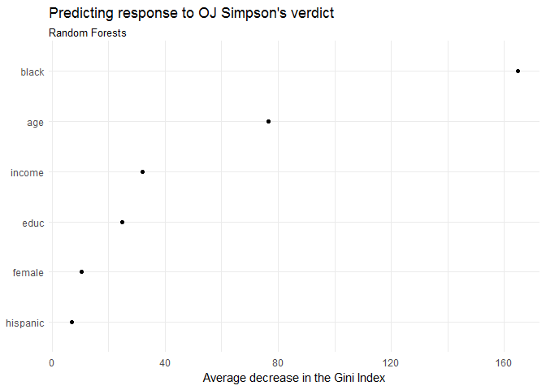

The misclassification error in the random forest approach is 18.8%, similar to the single decision tree. Furthermore, `black` remains as the most important predictor of the model, despite variable restrictions imposed in random forests. This shows that `black` is indeed a very strong predictor of the individual's response OJ Simpson's verdict.
