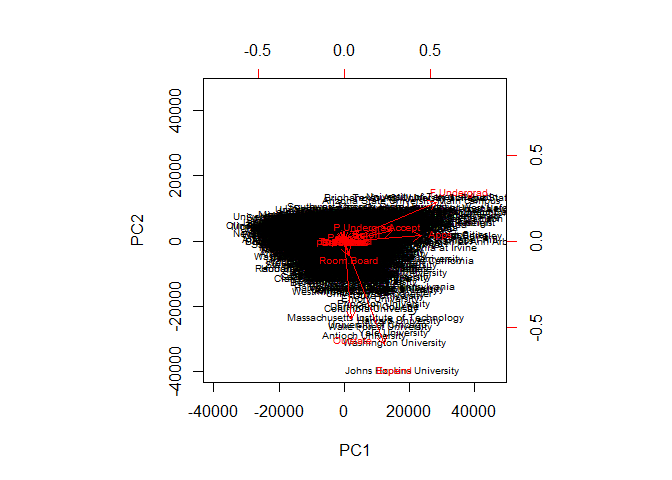
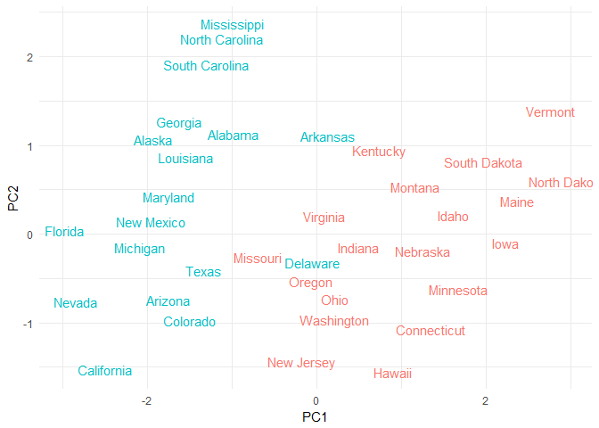
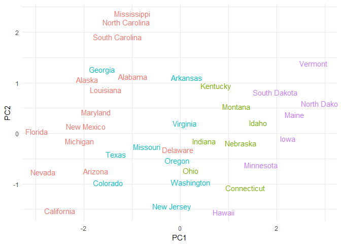
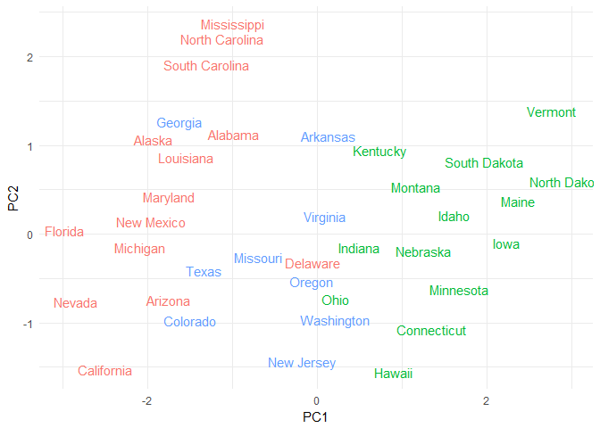
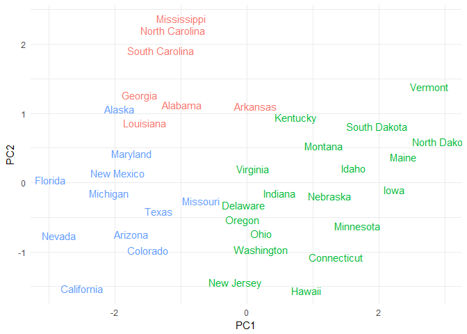
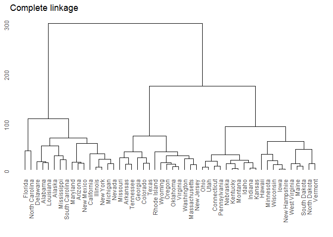
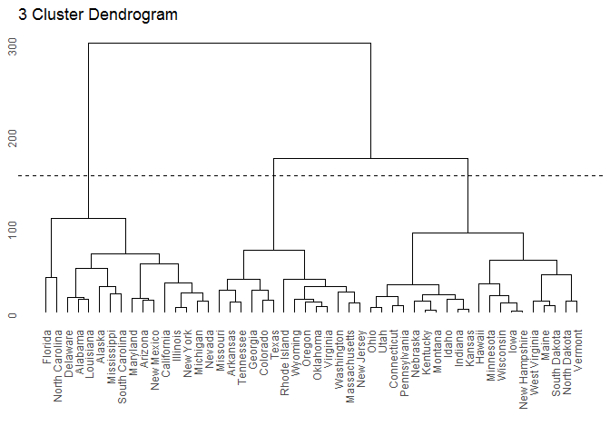
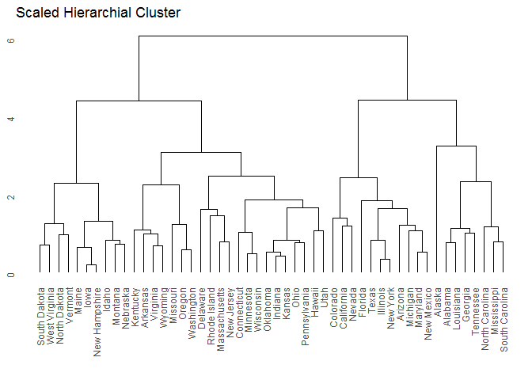

Problem set \#9: nonparametric methods and unsupervised learning
================
Cheng Yee Lim
March 14, 2017

-   [Attitudes towards feminists \[3 points\]](#attitudes-towards-feminists-3-points)
-   [Voter turnout and depression \[2 points\]](#voter-turnout-and-depression-2-points)
-   [Colleges \[2 points\]](#colleges-2-points)
-   [Clustering states \[3 points\]](#clustering-states-3-points)

Attitudes towards feminists \[3 points\]
========================================

Estimate a series of models explaining/predicting attitudes towards feminists.

1.  Split the data into a training and test set (70/30%).

``` r
feminist <- read.csv("./data/feminist.csv") %>%
  na.omit()

feminist_split <- resample_partition(feminist, p = c("test" = .7, "train" = .3))
feminist_train <- as_tibble(feminist_split$train)
feminist_test <- as_tibble(feminist_split$test)
```

1.  Calculate the test MSE for KNN models with *K* = 5, 10, 15, …, 100, using whatever combination of variables you see fit. Which model produces the lowest test MSE?

``` r
mse_knn <- data_frame(k = seq(5, 100, by = 5),
                      knn = map(k, ~ knn.reg(select(feminist_train, -feminist), y = feminist_train$feminist,
                         test = select(feminist_test, -feminist), k = .)),
                      mse = map_dbl(knn, ~ mean((feminist_test$feminist - .$pred)^2)))

mse_knn %>% 
  select(-knn) %>%
  kable()
```

|    k|  mse|
|----:|----:|
|    5|  550|
|   10|  496|
|   15|  490|
|   20|  488|
|   25|  482|
|   30|  482|
|   35|  481|
|   40|  479|
|   45|  480|
|   50|  479|
|   55|  478|
|   60|  477|
|   65|  476|
|   70|  477|
|   75|  478|
|   80|  476|
|   85|  476|
|   90|  477|
|   95|  478|
|  100|  478|

The KNN model with *K* = 60 produces the lowest test MSE. The test MSE is 476.

1.  Calculate the test MSE for weighted KNN models with *K* = 5, 10, 15, …, 100 using the same combination of variables as before. Which model produces the lowest test MSE?

``` r
mse_kknn <- data_frame(k = seq(5, 100, by = 5),
                      knn = map(k, ~ kknn(feminist ~ .,
                                          train = feminist_train, test = feminist_test, k = .)),
                      mse = map_dbl(knn, ~ mean((feminist_test$feminist - .$fitted.values)^2)))

ggplot(mse_kknn, aes(k, mse)) +
  geom_line() +
  geom_point() + 
  labs(title = "Weighted KNN on feminist data",
       x = "K",
       y = "Test mean squared error")  
```

 The KNN model with *K* = 85, 90, 95, 100 produces the lowest test MSE. The test MSE is 439.

1.  Compare the test MSE for the best KNN/wKNN model(s) to the test MSE for the equivalent linear regression, decision tree, boosting, and random forest methods using the same combination of variables as before. Which performs the best? Why do you think this method performed the best, given your knowledge of how it works?

``` r
mse <- function(model, data) {
  x <- model - data
  mean(x ^ 2, na.rm = TRUE)
}

kknn_best <- mse_kknn %>% 
  filter(k == 85)

feminist_lm <- lm(feminist ~., data = feminist_train)
feminist_tree <- tree(feminist ~ ., data = feminist_train,
     control = tree.control(nobs = nrow(feminist),
                            mindev = 0))
feminist_rf <- randomForest(feminist ~., data = feminist_train, ntree = 500)
feminist_boost <- gbm(feminist_train$feminist ~ ., data=feminist_train, n.trees = 10000, interaction.depth = 2)
```

    ## Distribution not specified, assuming gaussian ...

``` r
actual_vals <- feminist_test$feminist
mse_kknn <- kknn_best$mse
mse_lm <- mse(predict(feminist_lm, feminist_test), actual_vals)
mse_tree <- mse(predict(feminist_tree, feminist_test), actual_vals)
mse_rf <- mse(predict(feminist_rf, feminist_test), actual_vals)
mse_boost <- mse(predict(feminist_boost, feminist_test, n.trees=10000), actual_vals)

Methods <- c("Weighted KNN", "Linear model", "Decision Tree", "Random Forests", "Boosting")
MSE <- c(mse_kknn, mse_lm, mse_tree, mse_rf, mse_boost)

kable(data.frame(Methods, MSE))
```

| Methods        |  MSE|
|:---------------|----:|
| Weighted KNN   |  439|
| Linear model   |  446|
| Decision Tree  |  571|
| Random Forests |  450|
| Boosting       |  450|

The Weighted KNN model had the lowest test MSE, it suggests that the use of similar data points (nearest neighbors) is good enough to predict the attitude towards feminists. Decision trees are better for classification tasks, thus it is the worst performing model to predict attitudes towards feminists. As expected, random forests and boosting performs better than decision trees as it makes use of resampling to increase prediction accuracy. Linear model is the second best performing model, suggesting that the model is well-captured with a linear relationship, thus test MSE is minimized.

Voter turnout and depression \[2 points\]
=========================================

The 1998 General Social Survey included several questions about the respondent's mental health. `mental_health.csv` reports several important variables from this survey.

-   `vote96` - 1 if the respondent voted in the 1996 presidential election, 0 otherwise
-   `mhealth_sum` - index variable which assesses the respondent's mental health, ranging from 0 (an individual with no depressed mood) to 9 (an individual with the most severe depressed mood)[1]
-   `age` - age of the respondent
-   `educ` - Number of years of formal education completed by the respondent
-   `black` - 1 if the respondent is black, 0 otherwise
-   `female` - 1 if the respondent is female, 0 if male
-   `married` - 1 if the respondent is currently married, 0 otherwise
-   `inc10` - Family income, in $10,000s

Estimate a series of models explaining/predicting voter turnout.

1.  Split the data into a training and test set (70/30).

``` r
mhealth <- read.csv("./data/mental_health.csv") %>%
  na.omit() 
mhealth_split <- resample_partition(mhealth, p = c("test" = .7, "train" = .3))
mhealth_train <- as_tibble(mhealth_split$train)
mhealth_test <- as_tibble(mhealth_split$test)
```

1.  Calculate the test error rate for KNN models with *K* = 1, 2, …, 10, using whatever combination of variables you see fit. Which model produces the lowest test MSE?

``` r
mse_knn <- data_frame(k = 1:10,
                      knn_test = map(k, ~ class::knn(select(mhealth_train, -vote96),
                                                test = select(mhealth_test, -vote96),
                                                cl = mhealth_train$vote96, k = .)),
                      mse_test = map_dbl(knn_test, ~ mean(mhealth_test$vote96 != .)))
mse_knn %>%
  select(-knn_test) %>%
  kable()
```

|    k|  mse\_test|
|----:|----------:|
|    1|      0.357|
|    2|      0.347|
|    3|      0.351|
|    4|      0.361|
|    5|      0.346|
|    6|      0.348|
|    7|      0.333|
|    8|      0.339|
|    9|      0.320|
|   10|      0.320|

The model that produced the lowest test error rate is *K* = 10. The test MSE is 0.320.

1.  Calculate the test error rate for weighted KNN models with *K* = 1, 2, …, 10 using the same combination of variables as before. Which model produces the lowest test error rate?

``` r
mse_kknn <- data_frame(k = seq(1, 10, by = 1),
                      knn = map(k, ~ kknn(vote96 ~ .,
                                          train = mhealth_train, test = mhealth_test, k = .)),
                      mse = map_dbl(knn, ~ mean((mhealth_test$vote96 - .$fitted.values)^2)))
mse_kknn %>%
  select(-knn) %>%
  kable()
```

|    k|    mse|
|----:|------:|
|    1|  0.360|
|    2|  0.305|
|    3|  0.269|
|    4|  0.248|
|    5|  0.235|
|    6|  0.225|
|    7|  0.219|
|    8|  0.215|
|    9|  0.212|
|   10|  0.209|

The weighted KNN model that produced the lowest test error rate is also *K* = 10. The test MSE is 0.209.

1.  Compare the test error rate for the best KNN/wKNN model(s) to the test error rate for the equivalent logistic regression, decision tree, boosting, random forest, and SVM methods using the same combination of variables as before. Which performs the best? Why do you think this method performed the best, given your knowledge of how it works?

``` r
mhealth_glm <- glm(vote96 ~ ., family = binomial, data = mhealth_train)
mhealth_tree <- tree(vote96 ~ ., data = mhealth_train,
     control = tree.control(nobs = nrow(mhealth),
                            mindev = 0))
mhealth_rf <- randomForest(vote96 ~., data = mhealth_train, ntree = 500)
mhealth_boost <- gbm(mhealth_train$vote96 ~ ., data=mhealth_train, n.trees = 10000, interaction.depth = 2)
```

    ## Distribution not specified, assuming bernoulli ...

``` r
mse_glm <- mse(predict(mhealth_glm, mhealth_train), mhealth_test$vote96)
mse_tree <- mse(predict(mhealth_tree, mhealth_train), mhealth_test$vote96)
mse_rf <- mse(predict(mhealth_rf, mhealth_train), mhealth_test$vote96)
mse_boost <- mse(predict(mhealth_boost, mhealth_train, n.trees=10000), mhealth_test$vote96)

mhealth_poly_tune <- tune(svm, vote96 ~ ., data = mhealth_train,
                     kernel = "polynomial",
                     range = list(cost = c(.001, .01, .1, 1, 5, 10, 100)))
mhealth_best <- mhealth_poly_tune$best.model
mhealth_tune <- tune(svm, vote96 ~., data = mhealth_train, 
                          kernel = "linear", 
                          range = list(cost = c(.001, 0.01, .1, 1, 5, 10, 100)))
mhealth_lm_best <- mhealth_tune$best.model
mse_lmsvm <- mse(predict(mhealth_best, mhealth_test, decision.values = TRUE), mhealth_test$vote96)

mse_polysvm <- mse(predict(mhealth_best, mhealth_test, decision.values = TRUE), mhealth_test$vote96)

Methods <- c("Logistic model", "Decision Tree", "Random Forests", "Boosting", "Support Vector Machine (Poly)", "Support vector Machine (linear)")
MSE <- c(mse_glm, mse_tree, mse_rf, mse_boost, mse_polysvm, mse_lmsvm)
kable(data.frame(Methods, MSE))
```

| Methods                         |    MSE|
|:--------------------------------|------:|
| Logistic model                  |  2.161|
| Decision Tree                   |  0.332|
| Random Forests                  |  0.296|
| Boosting                        |  2.482|
| Support Vector Machine (Poly)   |  0.264|
| Support vector Machine (linear) |  0.264|

Weighted KNN model has the lowest test MSE, followed by support vector machine model, and then random forests, and then the decision trees. It seems that weighted KNN model is classification/regression agnostic, and does well in predicting as it does not impose a functional form on the predictor.

Colleges \[2 points\]
=====================

The `College` dataset in the `ISLR` library contains statistics for a large number of U.S. colleges from the 1995 issue of U.S. News and World Report.

-   `Private` - A factor with levels `No` and `Yes` indicating private or public university.
-   `Apps` - Number of applications received.
-   `Accept` - Number of applications accepted.
-   `Enroll` - Number of new students enrolled.
-   `Top10perc` - Percent of new students from top 10% of H.S. class.
-   `Top25perc` - Percent of new students from top 25% of H.S. class.
-   `F.Undergrad` - Number of fulltime undergraduates.
-   `P.Undergrad` - Number of parttime undergraduates.
-   `Outstate` - Out-of-state tuition.
-   `Room.Board` - Room and board costs.
-   `Books` - Estimated book costs.
-   `Personal` - Estimated personal spending.
-   `PhD` - Percent of faculty with Ph.D.'s.
-   `Terminal` - Percent of faculty with terminal degrees.
-   `S.F.Ratio` - Student/faculty ratio.
-   `perc.alumni` - Percent of alumni who donate.
-   `Expend` - Instructional expenditure per student.
-   `Grad.Rate` - Graduation rate.

Perform PCA analysis on the college dataset and plot the first two principal components. Describe the results. What variables appear strongly correlated on the first principal component? What about the second principal component?

``` r
df<-College
college.pca<-prcomp(df[,2:18])
college.rotations<-college.pca$rotation
biplot(college.pca, scale = 0 , cex = 0.6)
```



``` r
college.pca$rotation %>%
  kable()
```

|             |    PC1|     PC2|     PC3|     PC4|     PC5|     PC6|     PC7|     PC8|     PC9|    PC10|    PC11|    PC12|    PC13|    PC14|    PC15|    PC16|    PC17|
|-------------|------:|-------:|-------:|-------:|-------:|-------:|-------:|-------:|-------:|-------:|-------:|-------:|-------:|-------:|-------:|-------:|-------:|
| Apps        |  0.557|   0.039|   0.167|  -0.664|   0.165|   0.058|   0.134|  -0.412|   0.027|  -0.004|   0.004|  -0.003|   0.001|   0.000|  -0.001|  -0.001|   0.000|
| Accept      |  0.348|   0.077|   0.162|  -0.233|   0.006|   0.060|  -0.240|   0.842|  -0.150|   0.006|  -0.008|   0.005|  -0.002|  -0.001|   0.001|   0.002|   0.000|
| Enroll      |  0.130|   0.045|   0.010|   0.059|  -0.064|   0.021|  -0.041|   0.118|   0.978|  -0.008|   0.007|  -0.007|  -0.001|   0.003|  -0.003|  -0.003|   0.000|
| Top10perc   |  0.001|  -0.002|   0.000|   0.000|  -0.002|   0.001|   0.002|  -0.007|   0.009|   0.004|  -0.437|   0.263|  -0.288|   0.053|   0.336|   0.736|   0.014|
| Top25perc   |  0.001|  -0.001|   0.001|   0.000|  -0.002|   0.001|   0.001|  -0.006|   0.004|   0.006|  -0.622|   0.342|  -0.383|   0.049|  -0.278|  -0.519|   0.001|
| F.Undergrad |  0.671|   0.284|  -0.025|   0.585|  -0.281|  -0.085|   0.013|  -0.149|  -0.135|  -0.001|   0.002|   0.001|   0.001|   0.000|   0.000|   0.000|   0.000|
| P.Undergrad |  0.111|   0.080|  -0.066|   0.303|   0.924|   0.146|  -0.103|   0.000|   0.017|   0.001|  -0.002|   0.002|   0.001|   0.000|   0.000|   0.000|   0.000|
| Outstate    |  0.055|  -0.569|   0.759|   0.254|  -0.007|   0.168|   0.050|  -0.044|   0.000|   0.002|   0.004|  -0.001|  -0.001|   0.001|   0.000|   0.000|   0.000|
| Room.Board  |  0.029|  -0.106|   0.137|  -0.010|   0.178|  -0.963|   0.065|   0.060|   0.028|  -0.026|   0.000|   0.002|  -0.002|  -0.002|   0.001|   0.000|   0.000|
| Books       |  0.004|  -0.001|  -0.003|   0.001|   0.007|  -0.021|   0.050|   0.010|   0.009|   0.998|   0.002|  -0.005|   0.006|  -0.001|   0.005|  -0.002|   0.000|
| Personal    |  0.023|   0.030|  -0.060|   0.050|   0.066|   0.083|   0.949|   0.278|   0.001|  -0.049|  -0.002|   0.001|   0.002|  -0.001|   0.000|   0.000|   0.000|
| PhD         |  0.001|  -0.001|   0.001|   0.001|   0.000|  -0.001|   0.000|  -0.001|   0.000|  -0.006|  -0.450|  -0.571|   0.168|   0.077|   0.599|  -0.276|  -0.035|
| Terminal    |  0.001|  -0.001|   0.001|   0.001|   0.000|  -0.001|   0.000|   0.000|  -0.002|   0.001|  -0.369|  -0.532|   0.148|  -0.034|  -0.667|   0.336|   0.006|
| S.F.Ratio   |  0.000|   0.000|   0.000|   0.000|   0.000|   0.000|   0.000|   0.000|   0.000|   0.000|  -0.003|  -0.023|   0.005|   0.029|   0.019|  -0.021|   0.999|
| perc.alumni |  0.000|  -0.001|   0.001|   0.001|  -0.001|   0.002|  -0.001|  -0.002|   0.006|  -0.002|  -0.148|   0.124|   0.201|  -0.957|   0.068|  -0.017|   0.028|
| Expend      |  0.292|  -0.753|  -0.585|   0.009|  -0.019|   0.006|  -0.036|   0.052|  -0.008|  -0.002|   0.001|   0.000|   0.001|   0.000|   0.000|   0.000|   0.000|
| Grad.Rate   |  0.000|  -0.001|   0.002|  -0.001|  -0.002|  -0.001|  -0.001|  -0.003|   0.005|  -0.002|  -0.248|   0.433|   0.824|   0.265|  -0.031|   0.016|  -0.002|

Clustering states \[3 points\]
==============================

The `USArrests` dataset contains 50 observations (one for each state) from 1973 with variables on crime statistics:

-   `Murder` - Murder arrests (per 100,000)
-   `Assault` - Assault arrests (per 100,000)
-   `Rape` - Rape arrests (per 100,000)
-   `UrbanPop` - Percent urban population

1.  Perform PCA on the dataset and plot the observations on the first and second principal components.

``` r
pr.out <- prcomp(USArrests, scale = TRUE)
pr.out$rotation
```

    ##             PC1    PC2    PC3    PC4
    ## Murder   -0.536  0.418 -0.341  0.649
    ## Assault  -0.583  0.188 -0.268 -0.743
    ## UrbanPop -0.278 -0.873 -0.378  0.134
    ## Rape     -0.543 -0.167  0.818  0.089

``` r
biplot(pr.out, scale = 0, cex = .6)
```


1.  Perform *K*-means clustering with *K* = 2. Plot the observations on the first and second principal components and color-code each state based on their cluster membership. Describe your results.

``` r
PC1 <- as.data.frame(pr.out$x)$PC1
PC2 <- as.data.frame(pr.out$x)$PC2
names = c("Alabama", "Alaska", "Arizona", "Arkansas", "California", "Colorado", "Connecticut", "Delaware", "Florida", "Georgia", "Hawaii", "Idaho", "Illinois", "Indiana", "Iowa", "Kansas", "Kentucky", "Louisiana", "Maine", "Maryland", "Massachusetts", "Michigan", "Minnesota", "Mississippi", "Missouri", "Montana", "Nebraska", "Nevada", "New Hampshire", "New Jersey", "New Mexico", "New York", "North Carolina", "North Dakota", "Ohio", "Oklahoma", "Oregon", "Pennsylvania", "Rhode Island", "South Carolina", "South Dakota", "Tennessee", 
"Texas", "Utah", "Vermont", "Virginia", "Washington", "West Virginia", "Wisconsin", "Wyoming")
PCA <- data.frame(names, PC1, PC2)

kmean.out <- kmeans(USArrests, 2, nstart = 1)

cluster <- kmean.out$cluster %>%
  as_tibble()

PCA %>% 
  bind_cols(cluster) %>%
  ggplot(aes(PC1, PC2, color = as.factor(value))) +
  theme(legend.position = "none") + 
  geom_text(aes(label = names), check_overlap = TRUE)
```



1.  Perform *K*-means clustering with *K* = 4. Plot the observations on the first and second principal components and color-code each state based on their cluster membership. Describe your results.

``` r
kmean.out <- kmeans(USArrests, 4, nstart = 1)

cluster <- kmean.out$cluster %>%
  as_tibble()

PCA %>% 
  bind_cols(cluster) %>%
  ggplot(aes(PC1, PC2, color = as.factor(value))) +
  theme(legend.position = "none") + 
  geom_text(aes(label = names), check_overlap = TRUE)
```



1.  Perform *K*-means clustering with *K* = 3. Plot the observations on the first and second principal components and color-code each state based on their cluster membership. Describe your results.

``` r
kmean.out <- kmeans(USArrests, 3, nstart = 1)

cluster <- kmean.out$cluster %>%
  as_tibble()

PCA %>% 
  bind_cols(cluster) %>%
  ggplot(aes(PC1, PC2, color = as.factor(value))) +
  theme(legend.position = "none") + 
  geom_text(aes(label = names), check_overlap = TRUE)
```



1.  Perform *K*-means clustering with *K* = 3 on the first two principal components score vectors, rather than the raw data. Describe your results and compare them to the clustering results with *K* = 3 based on the raw data.

``` r
kmean.out <- kmeans(pr.out$x, 3, nstart = 1)

cluster <- kmean.out$cluster %>%
  as_tibble()

PCA %>% 
  bind_cols(cluster) %>%
  ggplot(aes(PC1, PC2, color = as.factor(value))) +
  theme(legend.position = "none") + 
  geom_text(aes(label = names), check_overlap = TRUE)
```



1.  Using hierarchical clustering with complete linkage and Euclidean distance, cluster the states.

``` r
hc.complete <- hclust(dist(USArrests), method = "complete")
ggdendrogram(hc.complete) + 
  labs(title = "Complete linkage")
```



1.  Cut the dendrogram at a height that results in three distinct clusters. Which states belong to which clusters?

``` r
h <- 150

# extract dendro data
hcdata <- dendro_data(hc.complete)
hclabs <- label(hcdata) %>%
  left_join(data_frame(label = as.factor(seq.int(nrow(USArrests))),
                       cl = as.factor(cutree(hc.complete, h = h))))

# plot dendrogram
ggdendrogram(hc.complete) +
  geom_hline(yintercept = h, linetype = 2) + 
  labs(title = "3 Cluster Dendrogram")
```



1.  Hierarchically cluster the states using complete linkage and Euclidean distance, after scaling the variables to have standard deviation 1. What effect does scaling the variables have on the hierarchical clustering obtained? In your opinion, should the variables be scaled before the inter-observation dissimilarities are computed? Provide a justification for your answer.

``` r
USA_st <- scale(USArrests)
hc.complete <- hclust(dist(USA_st), method = "complete")
ggdendrogram(hc.complete)
```



[1] The variable is an index which combines responses to four different questions: "In the past 30 days, how often did you feel: 1) so sad nothing could cheer you up, 2) hopeless, 3) that everything was an effort, and 4) worthless?" Valid responses are none of the time, a little of the time, some of the time, most of the time, and all of the time.
