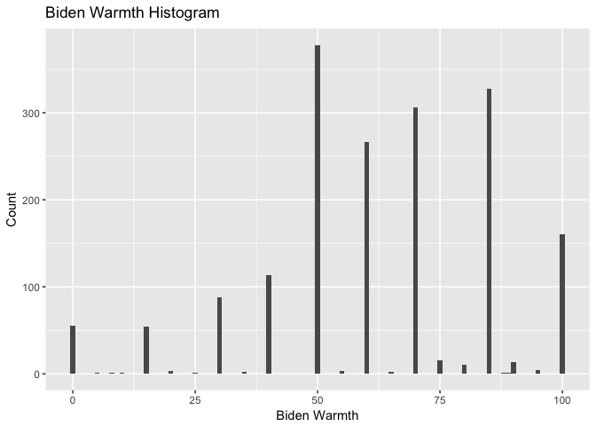
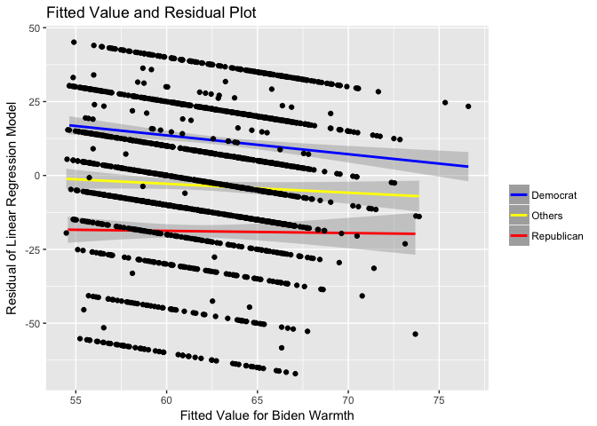
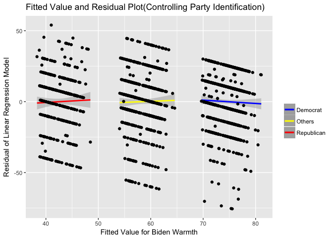

# Pset5
MACS 30100 - Perspectives on Computational Modeling<br> Luxi Han 10449918  


## Problem 1

The following is the graph for the histogram of the variable `biden`:


<!-- -->

  In general people feels positively towards Biden since most of the ratings are above 50 points. But the biggest cohort is the people having 50 points of Biden warmth.
  
  Another insteresting fact is that even though the feeling thermometer is ranging from 1 to 100, most people choose a rounding number, most likely mutiples of 10.
  
## Problem 2
  

```
## 
## Call:
## lm(formula = biden ~ age, data = biden_table)
## 
## Residuals:
##     Min      1Q  Median      3Q     Max 
## -64.876 -12.318  -1.257  21.684  39.617 
## 
## Coefficients:
##             Estimate Std. Error t value Pr(>|t|)    
## (Intercept) 59.19736    1.64792   35.92   <2e-16 ***
## age          0.06241    0.03267    1.91   0.0563 .  
## ---
## Signif. codes:  0 '***' 0.001 '**' 0.01 '*' 0.05 '.' 0.1 ' ' 1
## 
## Residual standard error: 23.44 on 1805 degrees of freedom
## Multiple R-squared:  0.002018,	Adjusted R-squared:  0.001465 
## F-statistic: 3.649 on 1 and 1805 DF,  p-value: 0.05626
```

```
##   age .fitted   .se.fit     ymin     ymax
## 1  45 62.0056 0.5577123 60.91248 63.09872
```
According to above results, the following is my answers:

1. There is a relationship between age and the feeling thermometer towards Biden.

2. Although the p-value is close to 0 meaning the null hypothesis that the effect of age on feeling thermometer is 0 can be rejected, the relationship between these two variables are not strong considering the scale of the feeling thermometer. The estimator of the age variable is 0.06240535. This is saying that one year increase in age will increase 0.06240535 point of the feeling thermometer of Biden. This is relatively very small compared to the 1 - 100 rating scale.

3. The relationship between age and the feeling thermometer is positive, meaning the older is the interviewee the more positive his or her attitude towards Biden.

4. The $R_2$ of model is about 0.002018. Approximately 0.2 percent of the variation of the feeling thermometer of Biden can be explained by the age of the interviewee. In general, this is a bad model.

5. The predicted value of the variable `biden` is 62.0056. The 95% confidence interval is $[60.91248, 63.09872]$

6. Below is the graph:

<!-- -->


## Problem 3


```
## 
## Call:
## lm(formula = biden ~ age + female + educ, data = biden_table)
## 
## Residuals:
##     Min      1Q  Median      3Q     Max 
## -67.084 -14.662   0.703  18.847  45.105 
## 
## Coefficients:
##             Estimate Std. Error t value Pr(>|t|)    
## (Intercept) 68.62101    3.59600  19.083  < 2e-16 ***
## age          0.04188    0.03249   1.289    0.198    
## female       6.19607    1.09670   5.650 1.86e-08 ***
## educ        -0.88871    0.22469  -3.955 7.94e-05 ***
## ---
## Signif. codes:  0 '***' 0.001 '**' 0.01 '*' 0.05 '.' 0.1 ' ' 1
## 
## Residual standard error: 23.16 on 1803 degrees of freedom
## Multiple R-squared:  0.02723,	Adjusted R-squared:  0.02561 
## F-statistic: 16.82 on 3 and 1803 DF,  p-value: 8.876e-11
```

1. According to the regression result, we can see that gender and education do have relationships with the response variable. But we can't reject the null hypothesis that age and the response variable have no linear relationships.

2. The parameter for females suggests that when education and age are the same, female on average has a 6.19607 point higher feeling thermometer towards Biden compared to their male counterparts.

3. The $R_2$ of this model is about 0.0273. This suggests that this model expalins about 2.73 percent of the variation of the response variable. This model is slightly better than the previous model(even when using adjusted R square).

4. The plot is as following.
The plot demonstrates a potential problem that the residual value is systematically different for different types of party identification types. Specifically, for democrats, the regression model systematically underestiamtes their Biden warmth (meaning positive residuals). For republicans, the regression model systematically overestiamtes their Biden warmth (meaning negative residual). This suggests that for people with different party affiliations, their average Biden warmth is different.

<!-- -->

## Problem 4

```
## 
## Call:
## lm(formula = biden ~ age + female + educ + dem + rep, data = biden_table)
## 
## Residuals:
##     Min      1Q  Median      3Q     Max 
## -75.546 -11.295   1.018  12.776  53.977 
## 
## Coefficients:
##              Estimate Std. Error t value Pr(>|t|)    
## (Intercept)  58.81126    3.12444  18.823  < 2e-16 ***
## age           0.04826    0.02825   1.708   0.0877 .  
## female        4.10323    0.94823   4.327 1.59e-05 ***
## educ         -0.34533    0.19478  -1.773   0.0764 .  
## dem          15.42426    1.06803  14.442  < 2e-16 ***
## rep         -15.84951    1.31136 -12.086  < 2e-16 ***
## ---
## Signif. codes:  0 '***' 0.001 '**' 0.01 '*' 0.05 '.' 0.1 ' ' 1
## 
## Residual standard error: 19.91 on 1801 degrees of freedom
## Multiple R-squared:  0.2815,	Adjusted R-squared:  0.2795 
## F-statistic: 141.1 on 5 and 1801 DF,  p-value: < 2.2e-16
```

1. The relationship between Biden warmth and gender changes. The magnitude does decrease but the sign of the relationship doesn't change. The estimator dcreseases from 6.19607 to 4.10323.

2. The $R_2$ of the model is 0.2815 and the adjusted R square is 0.2795. Thus, age, gender, education, and party identification jointly exlain 28.15 percent of the variation of Biden warmth.

3. This model does fix the problem in the previous problem. Now the residual values for people with different party affiliation all center around 0.

<!-- -->

## Problem 5

Refer the below regression results for details.

1. The effect of party identification on Biden warmth does differ for male and female. For male, democrats have on 33.688 higher Biden warmth than Republicans. But for female, this number shrink: female democrats on average has 29.742 points higher Biden warmth than female republicans.

2. The relationship between gender and Biden warmth does differ on party identification. For democrats, the difference between different genders is smaller than that of republicans. On average, female democrats have 6.395 - 3.946 = 2.449 points higher Biden warmth than male democrats. But for republicans, female has 6.395 points higher Biden warmth than Republican males. 

```
## 
## Call:
## lm(formula = biden ~ female * dem, data = biden_filter)
## 
## Residuals:
##     Min      1Q  Median      3Q     Max 
## -75.519 -13.070   4.223  11.930  55.618 
## 
## Coefficients:
##             Estimate Std. Error t value Pr(>|t|)    
## (Intercept)   39.382      1.455  27.060  < 2e-16 ***
## female         6.395      2.018   3.169  0.00157 ** 
## dem           33.688      1.835  18.360  < 2e-16 ***
## female:dem    -3.946      2.472  -1.597  0.11065    
## ---
## Signif. codes:  0 '***' 0.001 '**' 0.01 '*' 0.05 '.' 0.1 ' ' 1
## 
## Residual standard error: 19.42 on 1147 degrees of freedom
## Multiple R-squared:  0.3756,	Adjusted R-squared:  0.374 
## F-statistic:   230 on 3 and 1147 DF,  p-value: < 2.2e-16
```


```
##   female dem  .fitted   .se.fit     ymin     ymax
## 1      1   1 75.51883 0.8881114 73.77813 77.25953
## 2      0   1 73.06954 1.1173209 70.87959 75.25949
## 3      1   0 45.77720 1.3976638 43.03778 48.51662
## 4      0   0 39.38202 1.4553632 36.52951 42.23453
```

