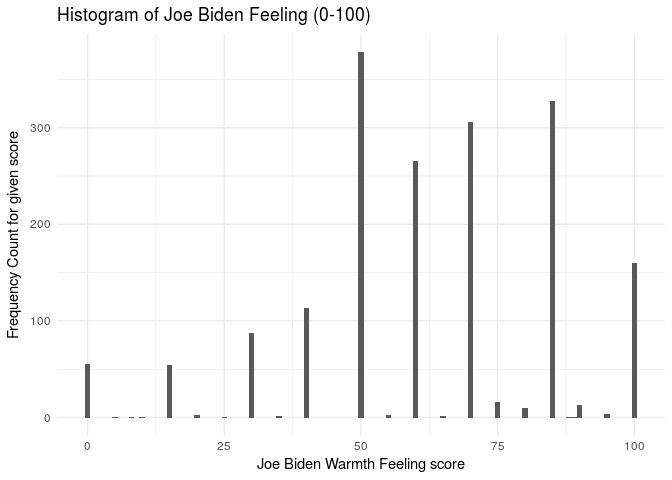
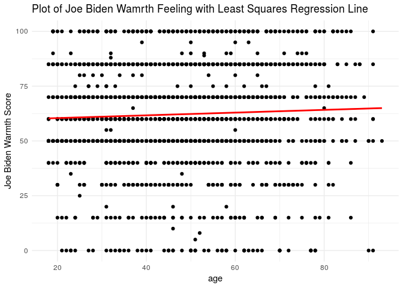
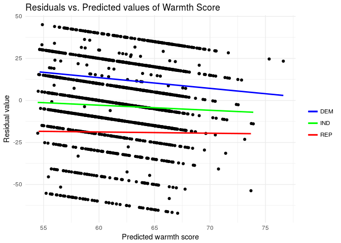
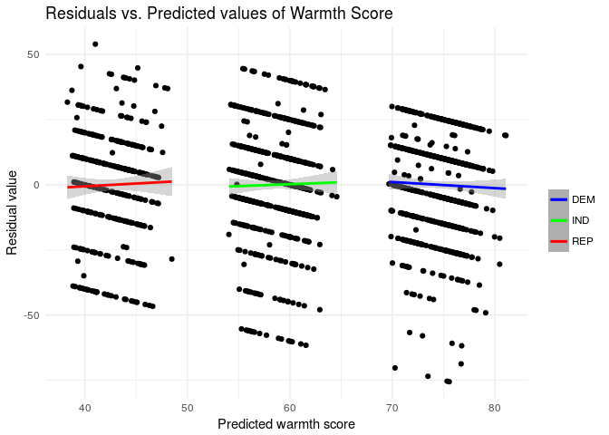

Problem Set 5 | MACS 301
================
Julian McClellan

-   [Describe the data](#describe-the-data)
-   [Simple Linear Regression](#simple-linear-regression)
    -   [1.](#section)
    -   [2.](#section-1)
    -   [3.](#section-2)
    -   [4.](#section-3)
    -   [5.](#section-4)
    -   [6.](#section-5)
-   [Multiple Linear Regression](#multiple-linear-regression)
    -   [1.](#section-6)
    -   [2.](#section-7)
    -   [3.](#section-8)
    -   [4.](#section-9)
-   [Multiple Linear Regression Model (More Variable)](#multiple-linear-regression-model-more-variable)
    -   [1.](#section-10)
    -   [2.](#section-11)
    -   [3.](#section-12)
-   [Interactive Linear Regression Model](#interactive-linear-regression-model)
    -   [1.](#section-13)

Describe the data
=================

``` r
ggplot(biden, aes(biden)) + 
  geom_histogram(binwidth = 1) + 
  labs(title = 'Histogram of Joe Biden Feeling (0-100)',
       x = 'Joe Biden Warmth Feeling score',
       y = 'Frequency Count for given score'
       )
```



As one can see from the histogram above, although there are 101 possible scores, the Joe Biden Warmth Feeling scores fall into only 23 unique values, which are for the most part multiples of 5 or 10. This makese sense. It is not unreasonble to think that most people, when asked to rate their warmness to Joe Biden, would have a nuanced enough attitude to warrant scores that fall between multiples of 5 or 10.

Simple Linear Regression
========================

``` r
# Make model
biden_mod <- lm(biden ~ age, data = biden)

# Make grid of data
grid <- biden %>%
  data_grid(age) %>%
  add_predictions(biden_mod)

tidy(biden_mod)
```

    ##          term    estimate  std.error statistic       p.value
    ## 1 (Intercept) 59.19736008 1.64791889 35.922496 1.145056e-213
    ## 2         age  0.06240535 0.03266815  1.910281  5.625534e-02

1.
--

There does appear to be a relationship between the predictor (age) and the response (warmth score). Indeed, we see that the estimate for the age coefficient is 0.0624054. Additionally, the p-value for the age coefficient is .0563, so it appears to be significant (at least at a 90% confidence level).

2.
--

The relationship between the predictor (age) and the response (warmth score) does not appear to be that strong. Indeed, the coefficient is only .06421, so the difference in score between a 30 and 60 year old would only be ~2 points.

3.
--

The relationship between the predictor (age) and the response (warmth score) is positive, since the coefficient for age is positive 0.0624054

4.
--

The *R*<sup>2</sup> of the model is 0.0020176. Thus, age only explains .2% of the variation in warmth score This is a pretty bad model, it is hardly able to explain any of the variation in warmth score. It would not be useful for prediciton.

5.
--

``` r
(pred_ci <- augment(biden_mod, newdata = data_frame(age = c(45))) %>%
  mutate(ymin = .fitted - .se.fit * 1.96,
         ymax = .fitted + .se.fit * 1.96))
```

    ##   age .fitted   .se.fit     ymin     ymax
    ## 1  45 62.0056 0.5577123 60.91248 63.09872

The predicted `biden` associated with an `age` of 45 is: 62.005601. The lower bound of the 95% confidence interval is 60.9124849 and the upper bound of the 95% confidence interval is 63.0987172.

6.
--

See the plot of the response and predictor with the least squares regression line below.

``` r
# Plot Data
ggplot(biden, aes(age)) +
  geom_point(aes(y = biden)) +
  geom_line(aes(y = pred), data = grid, color = "red", size = 1) +
  labs(title = 'Plot of Joe Biden Wamrth Feeling with Least Squares Regression Line',
       y = 'Joe Biden Warmth Score')
```



Multiple Linear Regression
==========================

``` r
biden_mmod <- lm(biden ~ age + female + educ, data = biden)
tidy(biden_mmod)
```

    ##          term    estimate  std.error statistic      p.value
    ## 1 (Intercept) 68.62101396 3.59600465 19.082571 4.337464e-74
    ## 2         age  0.04187919 0.03248579  1.289154 1.975099e-01
    ## 3      female  6.19606946 1.09669702  5.649755 1.863612e-08
    ## 4        educ -0.88871263 0.22469183 -3.955251 7.941295e-05

1.
--

There do indeed seem to be statistically significant relationships between the predictors and the response `biden`. The predictirs `female` and `educ` are both statistically significant (even at the .001 level!) with very low p-values. The predictor `age`, while it was statistically significant when it was the sole predictor, is now no longer statistically significant even at the .1 level, with a p-value of `.198`.

2.
--

The coefficient for `female` suggests that, with the age and years of education of the respondent held constant, the predicted warmth score for Joe Biden (`biden`) is ~`6.20` points higher if the respondent is female.

3.
--

The *R*<sup>2</sup> of the model is 0.0272273. Thus, the percentage of variation in `biden` explained by `age`, gender (`female`), and education (`educ`) is only ~2.7%. While this is not much, it explains an order of magnitude more of the variation in `biden` than `age` did on its own.

4.
--



There is indeed a problem in the model. By plotting 3 smooth fit regression lines and corresponding 95% confidence intervals for the residuals on the predicted values of warmth score for each of the three possible affiliations (Democrat, Republican, and Independent), we see that being a Democrat, Independent, or Republican have distinct effects on the residual values! This suggests that we should include party affiliation within our model, as we want to integrate these separate party effects into our model.

Multiple Linear Regression Model (More Variable)
================================================

``` r
biden_mmmod = lm(biden ~ age + female + educ + dem + rep, data = biden)
tidy(biden_mmmod)
```

    ##          term     estimate std.error  statistic      p.value
    ## 1 (Intercept)  58.81125899 3.1244366  18.822996 2.694143e-72
    ## 2         age   0.04825892 0.0282474   1.708438 8.772744e-02
    ## 3      female   4.10323009 0.9482286   4.327258 1.592601e-05
    ## 4        educ  -0.34533479 0.1947796  -1.772952 7.640571e-02
    ## 5         dem  15.42425563 1.0680327  14.441745 8.144928e-45
    ## 6         rep -15.84950614 1.3113624 -12.086290 2.157309e-32

1.
--

The relationship between gender (`female`) and Biden warmth did indeed seem to change. Whereas before the coefficient for `female` was: 6.1960695, now the coefficient for `female`, when including the `dem` and `reb` factors is: 4.1032301. In words, when we hold constant Democratic and Republican party membership, in addition to age, years of education and gender, the increase in predicted Biden warmth is lower than when we do not hold party membership constant.

2.
--

The *R*<sup>2</sup> of the model is 0.2815391. Thus, the percentage of variation in `biden` explained by `age`, gender (`female`), and education (`educ`) is ~28.15%. While this is not a majority, it explains an order of magnitude more of the variation in `biden` than `age`, `female`, and `educ` did, and it explains two orders of magnitude more variation in `biden` than `age` did on its own.

3.
--



We did indeed fix the previous problem. Before the, the smooth fit regression lines and corresponding confidence intervals for each of the three possible party affiliations was distinct, with slightly differing slopes and very different (visually) intercepts. Now, however, after we have included party affiliation into our model, we see that all three smooth fit lines for Democrats, Republicans, and Independents have a slope of approximately 0 as well as a 0 intercept. They are all quite similar now, suggesting that in our current model that party affiliation, or lack thereof, has no effect on our residuals.

Note however, that there is still a distinct pattern to the residuals. While this is not ideal, it is because `age`, and years of education (`educ`) are only measured as integers in our data, and since we did not include them as factors (which would be cumbersome, to be honest) in our model, they are treated as if they exist in the real numbers.

Interactive Linear Regression Model
===================================

``` r
# Make the linear model
biden_po_mod <- biden %>% 
  filter(dem == 1 | rep == 1)  %>%
  lm(biden ~ female * dem, data = .)

# Estimate predicted thermometer ratings and 95% Confidence intervals
biden_po_mod$model %>%
    data_grid(female, dem) %>%
    augment(biden_po_mod, newdata = .) %>%
    mutate(ymin = .fitted - .se.fit * 1.96,
         ymax = .fitted + .se.fit * 1.96) %>%
    rename(c('female' = 'gender', 'dem' = 'party', '.fitted' = 'warmth rating', 'ymin' = 'CI_lower_bound', 'ymax' = 'CI_upper_bound')) %>%
    mutate(gender = ifelse(gender == 0, "Male", "Female"),
         party = ifelse(party == 0, "Republican", "Democrat")) %>%
    {.} -> pred_ci_gender_party
pred_ci_gender_party
```

    ##   gender      party warmth rating   .se.fit CI_lower_bound CI_upper_bound
    ## 1   Male Republican      39.38202 1.4553632       36.52951       42.23453
    ## 2   Male   Democrat      73.06954 1.1173209       70.87959       75.25949
    ## 3 Female Republican      45.77720 1.3976638       43.03778       48.51662
    ## 4 Female   Democrat      75.51883 0.8881114       73.77813       77.25953

1.
--

The relationship between party ID and Biden warmth does appear to differ for males/females. This is most pronounced for the Republican party, we see that female Republicans have a predicted warmth rating over 6 points higher than their male Republican counterparts. ( vs ) This difference also appears to be significant at the 95% level, as the 95% confidence intervals of warmth score for male and memale Republicans do not overlap at all! (The 95% CI lower bound for for female Republicans, 43.037781 is greater than the 95% CI upper bound for male Republicans 48.5166232)

There is much less of a difference for the Democratic party. The predicted warmth rating for female Democrats is just over 2 points higher than male Democrats. ( vs ). This difference also appears insignificant at the 95% level, as the 95% confidence intervals of warmth score for male and female Democrats do overlap. (The 95% CI lower bound for for female Democrats, 73.7781302 is lower than the 95% CI upper bound for male Democrats, 75.2594853)
