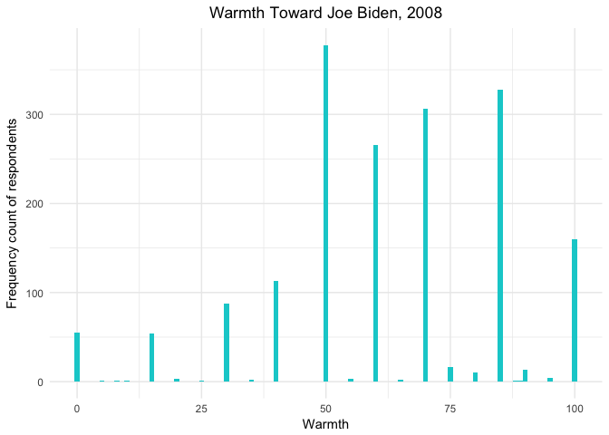
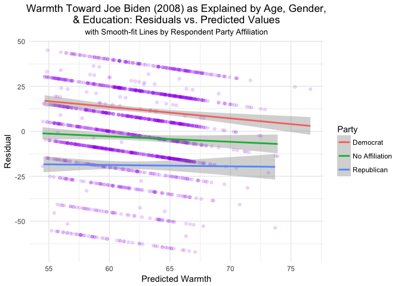
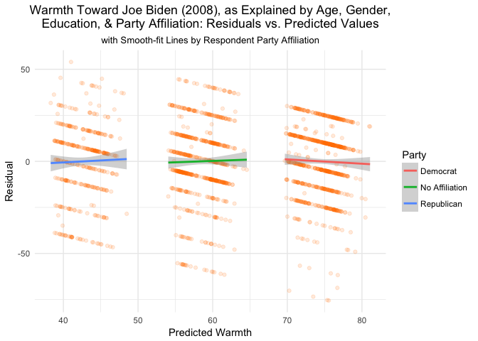
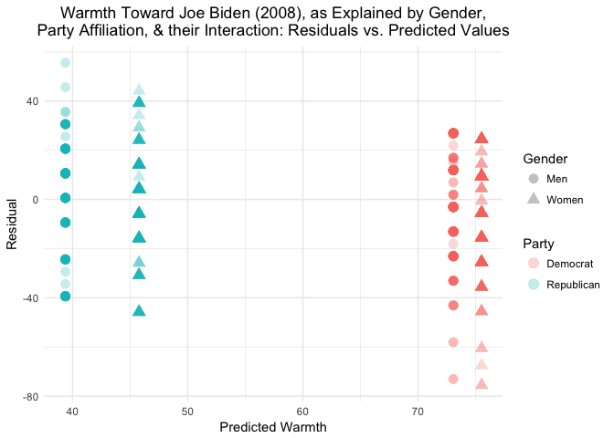

MACS 30100 PS5
================
Erin M. Ochoa
2017 February 13

-   [Describing the data](#describing-the-data)
-   [Simple linear regression](#simple-linear-regression)
-   [Multiple linear regression](#multiple-linear-regression)
-   [Multiple linear regression model (with even more variables!)](#multiple-linear-regression-model-with-even-more-variables)
-   [Interactive linear regression model](#interactive-linear-regression-model)

``` r
df = read.csv('data/biden.csv')
```

Describing the data
===================



Feelings of warmth (as surveyed in 2008) toward Mr. Biden range from 0 to 100 and appear to be approximately normally distributed with left skew. The histogram indicates that most respondents felt warmly toward Mr. Biden. Despite the wide range of data, responses seem to have been given only in 5-point increments; it seems unlikely (though not impossible) that all 1,807 respondents would have naturally responded in such a fashion, so we assume that the feeling thermometer was presented or described to respondents in 5-point increments.

Simple linear regression
========================

``` r
lm_warmth_age = lm(biden ~ age, data = df)

pred_ci = augment(lm_warmth_age, newdata = data_frame(age = c(45))) %>%
          mutate(ymin = .fitted - .se.fit * 1.96,
          ymax = .fitted + .se.fit * 1.96)
```

We construct a linear model to estimate the relationship of age with feelings of warmth toward Mr. Biden:

*Y* = *β*<sub>0</sub> + *β*<sub>1</sub>*X*<sub>1</sub>

where *Y* is the Biden feeling thermometer and *X*<sub>1</sub> is age.

The linear model returns a *β*<sub>0</sub> coefficient of 59.1973601 (with a standard error of 1.6479189) and a *β*<sub>1</sub> coefficient of 0.0624054 (with a standard error of 0.0326682).

1.  The model shows that there is a linear relationship between the predictor, age, and the response, warmth toward Mr. Biden, although the relationship is not statistically significant.
2.  The relationship between age and feelings of warmth is weak; this is evident because the coefficient *β*<sub>1</sub> has a small absolute value (0.0624054). A one-point average increase in warmth requires a 16-point increase in age using this relationship.
3.  The relationship between the predictor, age, and the response, warmth toward Mr. Biden, is positive (because 0.0624054 &gt; 0). This means that a one-year increase in age is estimated to be associated with an average increase in warmth of 0.0624054.
4.  The model has an *R*<sup>2</sup> value of 0.0020176. Age alone explains 0.2017624% of the variation in feelings of warmth toward Mr. Biden. With such a low percentage of variance explained, this is a poor model.
5.  The predicted warmth associated with an age of 45 is 62.005601. The 95% confidence interval ranges from a lower bound of 0.5577123 to an upper bound of 60.9124849.
6.  We plot the response, warmth of feelings toward Mr. Biden, and the predictor, age, including the least-squares regression line:


Multiple linear regression
==========================

``` r
lm_warmth_age_gndr_edu = lm(biden ~ age + female + educ, data = df)
```

We construct a more complex model to estimate the effects of age, gender, and years of education on feelings of warmth toward Mr. Biden:

*Y* = *β*<sub>0</sub> + *β*<sub>1</sub>*X*<sub>1</sub> + *β*<sub>2</sub>*X*<sub>2</sub> + *β*<sub>3</sub>*X*<sub>3</sub>

where *Y* is the Biden feeling thermometer, *X*<sub>1</sub> is age, *X*<sub>2</sub> is gender, and *X*<sub>3</sub> is education.

The linear model returns a *β*<sub>0</sub> (y-intercept) coefficient of 68.621014 (with a standard error of 3.5960047), a *β*<sub>1</sub> (age) coefficient of 0.0418792 (with a standard error of 0.0324858), a *β*<sub>2</sub> (gender=female) coefficient of 6.1960695 (with a standard error of 1.096697), and a *β*<sub>3</sub> (years of education) coefficient of -0.8887126 (with a standard error of 0.2246918).

1.  Considering age, gender, and education jointly, we find that there are statistically significant relationships between the response and two of the predictors, gender and education: both are significant at the p&lt;.001 level while age is not significant at the = .05 level.
2.  The value of the coefficient for female (6.1960695) suggests that female respondents' feelings of warmth toward Mr. Biden are approximately 6.2 points, on average, higher than male respondents' feelings.
3.  The model has an *R*<sup>2</sup> value of 0.0272273. Together, age, gender, and education explain 2.7227269% of the variation in feelings of warmth toward Mr. Biden. This is a better model than the age-only model because its *R*<sup>2</sup> value is larger.
4.  We generate a plot comparing predicted values and residuals by respondent political party:



With the partywise smooth-fit lines, we can see that respondents who are Democrats have actual values higher, on average, than their predicted values. For unaffiliated respondents, residuals are slightly negative but actualy values are generally close to the predicted values. For respondents who are Republicans, however, actual values are lower, on average, than predicted values. Together, these differences suggest that political affiliation has an effect on feelings of warmth toward Mr. Biden. This implies that there is a problem with the model in that it fails to take into account a respondent's political affiliation.

Multiple linear regression model (with even more variables!)
============================================================

``` r
lm_warmth_age_gndr_edu_prt = lm(biden ~ age + female + educ + dem + rep, data = df)
```

We construct an even more detailed model to estimate the effects of age, gender, years of education, and political affiliation on feelings of warmth toward Mr. Biden:

*Y* = *β*<sub>0</sub> + *β*<sub>1</sub>*X*<sub>1</sub> + *β*<sub>2</sub>*X*<sub>2</sub> + *β*<sub>3</sub>*X*<sub>3</sub> + *β*<sub>4</sub>*X*<sub>4</sub> + *β*<sub>5</sub>*X*<sub>5</sub>

where *Y* is the Joe Biden feeling thermometer, *X*<sub>1</sub> is age, *X*<sub>2</sub> is gender, *X*<sub>3</sub> is education, *X*<sub>4</sub> is Democrat, and *X*<sub>5</sub> is Republican.

The linear model returns a *β*<sub>0</sub> (y-intercept) coefficient of 58.811259 (with a standard error of 3.1244366), a *β*<sub>1</sub> (age) coefficient of 0.0482589 (with a standard error of 0.0282474), a *β*<sub>2</sub> (gender=female) coefficient of 4.1032301 (with a standard error of 0.9482286), a *β*<sub>3</sub> (years of education) coefficient of -0.3453348 (with a standard error of 0.1947796), a *β*<sub>4</sub> (Democrat) coefficient of 15.4242556 (with a standard error of 1.0680327), and a *β*<sub>5</sub> (Republican) coefficient of -15.8495061 (with a standard error of 1.3113624).

1.  With the new linear model, the relationship between gender and warmth toward Mr. Biden remains statistically significant (p&lt;.001) but decreases to 4.1032301, meaning that women have, on average, warmer feelings toward Mr. Biden than men do.
2.  The model has an *R*<sup>2</sup> value of 0.2815391. Together, age, gender, education, and party affiliation explain \`28.1539147% of the variation in feelings of warmth toward Mr. Biden. This is a better model than the previous one, which did not consider political affiliation.
3.  We plot the residuals versus the predicted values and add separate smooth-fit lines by party:



By taking into account political affiliation, we have solved the main problem in the earlier model, in which residuals were stratified by party. Because of the inclusion of political affiliation in this model, the residuals for each party are now close to zero, on average, and we can clearly see the model's predictions that Democratic affiliation results in an average of 15 points of warmth more than no affiliation, which in turn results in an average of approximately 16 points of warmth more than Republican affiliation.

Interactive linear regression model
===================================

``` r
df2 = df[(df$Party != 'No Affiliation'), ]

lm_warmth_gndr_prt_gndr.prt = lm(biden ~ female + dem + female * dem, data = df2)
```

Discarding respondents who are neither Democrats nor Republicans, we construct a model to estimate the effect of gender, political affiliation, and their interaction on warmth toward Mr. Biden:

*Y* = *β*<sub>0</sub> + *β*<sub>1</sub>*X*<sub>1</sub> + *β*<sub>2</sub>*X*<sub>2</sub> + *β*<sub>3</sub>*X*<sub>1</sub>*X*<sub>2</sub>

where *Y* is the Biden feeling thermometer, *X*<sub>1</sub> is female, and *X*<sub>2</sub> is Democrat.

The linear model returns a *β*<sub>0</sub> (y-intercept) coefficient of 39.3820225 (with a standard error of 1.4553632), a *β*<sub>1</sub> (gender=female) coefficient of 6.3951796 (with a standard error of 2.0178072), a *β*<sub>2</sub> (party=Democrat) coefficient of 33.687514 (with a standard error of 1.8347991), and a *β*<sub>3</sub> (female \* Democrat) coefficient of -3.9458876 (with a standard error of 2.4715772).

``` r
punnett = data_frame(female = c(1,1,0,0), dem = c(1,0,1,0))

pred_ci_int = augment(lm_warmth_gndr_prt_gndr.prt, newdata = punnett) %>%
              mutate(ymin = .fitted - .se.fit * 1.96,
              ymax = .fitted + .se.fit * 1.96)
```

Women Democrats have the highest average warmth rating, 75.5188285; the 95% confidence interval for this group has a lower bound of 73.7781302 and an upper bound of 77.2595267.

Republican women have an average warmth rating of 45.7772021; the 95% confidence interval for this group has a lower bound of 43.037781 and an upper bound of 48.5166232.

Men who are Democrats have an average warmth rating of 73.0695364; the 95% confidence interval for this group has a lower bound of 70.8795875 and an upper bound of 75.2594853.

Republican men have the lowest average warmth rating, 39.3820225; the 95% confidence interval for this group has a lower bound of 36.5295107 and an upper bound of 42.2345343.

To assess these differences visually, we plot the model's residuals versus its predicted values, colored by party and shaped by gender:



The effect of political affiliation on warmth toward Mr. Biden is similar for men and women: the party effect is strong (with a coefficient of 33.687514) and highly statistically significant (p&lt;.001). This means that for both men and women, being a Democrat has a significant positive effect on warmth, as shown by the wide gap between party groups in the plot above.

Note that while the gender effect is much weaker (with a coefficient of 6.3951796) it is also statistically significant, but to a lesser degree (p&lt;.01).

The effect of being a woman on warmth toward Mr. Biden for Democrats is not as strong as it is for Republicans: we can see this in the above plot by noting how close together the Democrat gender groups are compared to the greater distance between the points for the Republican gender groups. We can verify this by confirming that the coefficient of the female \* party (-3.9458876) is negative: once we have added the female (6.3951796) and Democrat (33.687514) points to the y-intercept (39.3820225which is the estimated average of the base case, male Republicans), we must add the value of the interaction term (-3.9458876, which is negative: we are subtracting warmth points) to attain the average warmth score for women Democrats (75.5188285).

Note that the interaction term is not statistically significant (p=0.1106513: this is because the means for Democrat men and women (73.0695364 and 75.5188285, respectively) are not statistically significantly different from one another. We can verify this by noting that their 95% confidence intervals overlap: 73.7781302–77.2595267 for women Democrats compared to 70.8795875–75.2594853 for men who are Democrats.
