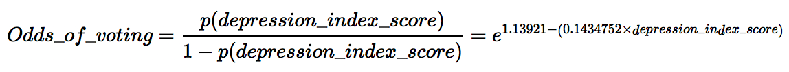
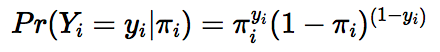
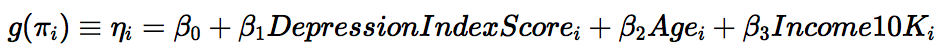
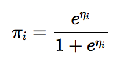
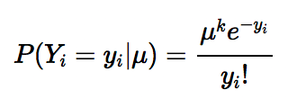
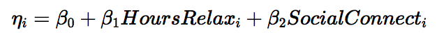
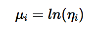

```{r setup, include = FALSE}
knitr::opts_chunk$set(cache = TRUE)

library(ggplot2)
library(dplyr)
library(tidyr)
library(tidyverse)
library(modelr)
library(broom)
library(forcats)
library(caret)
library(pROC)

options(na.action = na.warn)
set.seed(1234)

theme_set(theme_minimal())

options(warn=-1)
```

# Part 1: Modeling voter turnout


The 1998 General Social Survey included several questions about the respondent's mental health. `mental_health.csv` reports several important variables from this survey.

* `vote96` - 1 if the respondent voted in the 1996 presidential election, 0 otherwise
* `mhealth_sum` - index variable which assesses the respondent's mental health, ranging from 0 (an individual with no depressed mood) to 9 (an individual with the most severe depressed mood)^[The variable is an index which combines responses to four different questions: "In the past 30
days, how often did you feel: 1) so sad nothing could cheer you up, 2) hopeless, 3) that everything was an effort, and 4) worthless?" Valid responses are none of the time, a little of the time, some of the time, most of the time, and all of the time.]
* `age` - age of the respondent
* `educ` - Number of years of formal education completed by the respondent
* `black` - 1 if the respondent is black, 0 otherwise
* `female` - 1 if the respondent is female, 0 if male
* `married` - 1 if the respondent is currently married, 0 otherwise
* `inc10` - Family income, in \$10,000s


We begin by reading in the data.  Because it does not make sense to consider respondents for whom either voting behavior or depression index score is missing, we subset the data to include only those respondents with valid responses in both variables.  We also add a factor-type variable to describe voting; this will decrease the time necessary to construct plots.

```{r read_data}
df = read.csv('data/mental_health.csv')
df = df[(!is.na(df$vote96) & !is.na(df$mhealth_sum)), ]
df$Turnout = factor(df$vote96, labels = c("Did not vote", "Voted"))
```

## Describing the data

We plot a histogram of voter turnout:

```{r vote_histogram, echo=FALSE}
ggplot(df, aes(x=Turnout, fill=Turnout)) + geom_bar() +
       ylab("Frequency count of respondents") +
       xlab("Whether the respondent voted") +
       ggtitle("Voter Turnout, 1996 Presidential Election") +
       theme(plot.title = element_text(hjust = 0.5, face="bold"),
       panel.grid.major.x = element_blank(), panel.grid.minor.x = element_blank(),
       panel.border = element_rect(linetype = "solid", color = "grey70", fill=NA, size=1.1)) +
       scale_y_continuous(breaks = c(0,300,600,900))
```

The unconditional probability of a given respondent voting in the election is `r mean(df$vote96)`.  The data are distributed bimodally, with about twice as many respondents voting as not voting.

We generate a scatterplot of voter turnout versus depression index score, with points colored by whether the respondent voted.  Because mental health scores are integers ranging from [0,16] and turnout is categorical, there can be a maximum of 34 points on the plot.  This would not be terribly informative, so we jitter the points, increase their transparency, and add a horizontal line between the distributions of voters and non-voters; however, we must remember that the jittered position is not the true position: we must imagine the same number of points, with all the blue ones at 1 and all the red ones at 0.  (That is:  any within-group variability in the y direction is false.)  These additions are somewhat helpful, but because voter turnout is dichotomous, it is not well suited to a scatterplot.  (We will address this soon.)

```{r scatterplot_turnout_vs_mentalhealth, echo=FALSE}

ggplot(df, aes(x=mhealth_sum, y=vote96)) + 
       geom_point(aes(color=Turnout), size=.75, alpha=.4, position="jitter") + 
       geom_hline(aes(yintercept=.5), size=1.25, color = "grey50") + 
       geom_smooth(method = "lm", color = "yellow") + 
       xlab("Depression index score") + ylab("Whether respondent voted") + 
       ggtitle("Voter Turnout, 1996 Presidential\nElection, by Depression Index Score") +
       theme(plot.title = element_text(hjust = 0.5, face="bold"),
       panel.grid.major.y = element_blank(), panel.grid.minor.y = element_blank(),
       panel.border = element_rect(linetype = "solid", color = "grey70", fill=NA, size=1.1)) + 
       scale_x_continuous(breaks = c(0,4,8,12,16)) +
       scale_y_continuous(breaks=0:1, labels = c("Did not vote    0","Voted    1"))
```

The regression line shows that respondents with higher depression scores trend toward not voting.  We note again, however, that because voter turnout is dichotomous—a respondent either votes (1) or doesn't (0), with no possile outcomes in between—the regression line is misleading.  It suggests, for example, that potential respondents with scores so high that they are off the index could have a negative chance of voting, which makes no sense; similarly, respondents with scores well below zero could have greater than a 1.0 chance of voting.  Additionally, because the depression index score ranges from [0,16], it does not have support over the entire domain of real numbers; the regression line, however, suggests that such scores are possible and points to probabilites for them—and some of those probabilites fall outside of the realm of possible probabilities (which range from [0,1]).  These problems imply that linear regression is the wrong type of analysis for the type of data with which we are dealing.

We now return to the matter of visualizing the distribution of depression scores by voter turnout.  Because the outcome is dichotomous and the predictor is continuous but over a short interval, the scatterplot does a poor job of clearly showing the correlation between depression score and turnout.  We therefore turn to a density plot:

```{r density_plot, echo=FALSE}

ggplot(df, aes(mhealth_sum, fill = Turnout)) + geom_density(alpha = 0.2) + 
       xlab("Depression index score") + ylab("Proportion of respondents") + 
       ggtitle("Density Plot for Depression Index,\n1996 Presidential Election, by Voter Turnout") +
       theme(plot.title = element_text(hjust = 0.5, face="bold"),
             panel.border = element_rect(linetype = "solid", color = "grey70", fill=NA, size=1.1)) +
       scale_x_continuous(breaks = c(0,4,8,12,16))
```

Now we can clearly see that voters and non-voters had very different distributions of depression scores: most voters scored between [0,5] on the depression index, but only about half of non-voters did.  While there were voters and non-voters over nearly the entire range of possible depression scores, non-voters tended to have higher scores (but the only respondents to score 16 on the depression index were actually voters).

## Estimating a basic logistic model

First, we define the functions necessary in this section:

```{r functions_and_coeffs}
logit2prob = function(x){
  exp(x) / (1 + exp(x))
}

prob2odds = function(x){
  x / (1 - x)
}

prob2logodds = function(x){
  log(prob2odds(x))
}

calcodds = function(x){
  exp(int + coeff * x)
}

oddsratio = function(x,y){
  exp(coeff * (x - y))
}

calcprob = function(x){
  exp(int + coeff * x) / (1 + exp(int + coeff * x))
}

firstdifference = function(x,y){
  calcprob(y) - calcprob(x)
}

threshold_compare = function(thresh, dataframe, model){
  pred <- dataframe %>%
          add_predictions(model) %>%
          mutate(pred = logit2prob(pred),
          pred = as.numeric(pred > thresh))
  
  cm = confusionMatrix(pred$pred, pred$vote96, dnn = c("Prediction", "Actual"), positive = '1')

  data_frame(threshold = thresh,
             sensitivity = cm$byClass[["Sensitivity"]],
             specificity = cm$byClass[["Specificity"]],
             accuracy = cm$overall[["Accuracy"]])
}
```

We estimate a logistic regression model of the relationship between mental health and voter turnout:

```{r basic_logistic_regression}

logit_voted_depression = glm(vote96 ~ mhealth_sum, family = binomial, data=df)
summary(logit_voted_depression)
```

We generate the additional dataframes and variables necessary to continue:
```{r bv_gen_dfs_and_vars}

int = tidy(logit_voted_depression)[1,2]
coeff = tidy(logit_voted_depression)[2,2]

voted_depression_pred = df %>%
                        add_predictions(logit_voted_depression) %>%
                        mutate(prob = logit2prob(pred)) %>%
                        mutate(odds = prob2odds(prob))

voted_depression_accuracy = df %>%
                            add_predictions(logit_voted_depression) %>%
                            mutate(pred = logit2prob(pred),
                            pred = as.numeric(pred > .5))
```

We find a statistically significant relationship at the p < .001 level between depression score and voting behavior.  The relationship is negative and the coefficient is `r coeff`.  Because the model is not linear, we cannot simply say that a change in depression index score results in a corresponding change in voter turnout.  Instead, we must interpret the coefficient in terms of log-odds, odds, and probability. We will interpret the coefficient thus in the following responses.

Log-odds:  For every one-unit increase in depression score, we expect the log-odds of voting to decrease by `r coeff`.  Note that this is the mhealth_sum coefficient from the logistic model summarized above.  This is because the logistic model describes the linear change in log-odds as a function of the intercept (`r int`) and of depression index score (as multiplied by the corresponding coefficient, `r coeff`).

We graph the relationship between mental health and the log-odds of voter turnout:

```{r log_odds_plot, echo=FALSE}

ggplot(voted_depression_pred, aes(mhealth_sum, pred)) +
       geom_line(color="orangered1", size=1.5) +
       labs(title = "Log-odds of Voting in 1996 Presidential Election\nbased on Depression Index Score",
            x = "Depression index score",
            y = "Log-Odds of Voting") + 
       theme(plot.title = element_text(hjust = 0.5, face="bold"),
             panel.border = element_rect(linetype = "solid", color = "grey70", fill=NA, size=1.1)) +
       scale_x_continuous(breaks = c(0,4,8,12,16))
```

Odds: The coefficient for depression index score cannot be interpreted in terms of odds without being evaluated at a certain depression score.  This is because the relationship between depression score and odds is logistic, not linear:

```{r eq1, echo=FALSE, results="hide"}
#$$
#Odds\_of\_voting = \frac{p(depression\_index\_score)}{1 - p(depression\_index\_score)} = e^{1.13921 - (0.1434752 \times depression\_index\_score)}
#$$
```

For example, for a respondent with a depression index score of 12 would have odds of voting equal to `r calcodds(12)`.  This means the respondent is `r calcodds(12)` times more likely to vote than not vote; because this is less than one, such a respondent would be unlikely to vote.  In contrast, a respondent with a depression index score of 3 would be `r calcodds(3)` times more likely to vote than not vote.  A respondent with a depression score of 8 would be approximately just as likely to vote as not vote because the odds for that score equal `r calcodds(8)`.

We graph the relationship between depression index score and the odds of voting:

```{r voted_depression_odds_plot, echo=FALSE}
ggplot(voted_depression_pred, aes(mhealth_sum, odds)) +
       geom_line(color = "springgreen3", size = 1.5) +
       labs(title = "Odds of Voting Based on Depression Index Score",
            x = "Depression index score",
            y = "Odds of voting rather than not voting") +
       theme(plot.title = element_text(hjust = 0.5, face="bold"),
             panel.border = element_rect(linetype = "solid", color = "grey70", fill=NA, size=1.1)) +
       scale_x_continuous(breaks = c(0,4,8,12,16))
```

Probability: The relationship between depression index score and voting is not linear; like with odds, we must use a specific depression index score in order to calculate the probability of such a respondent voting.  For example, a respondent with a depression index score of 3 would have a probability of voting equal to `r calcprob(3)` and a respondent who scored 12 would have a probability of `r calcprob(12)`.  As we noted earlier, a respondent with a score of 8 would be about equally likely to vote as not vote, with a probability of `r calcprob(8)`.

The first difference for an increase in the depression index score from 1 to 2 is `r firstdifference(1,2)`; for 5 to 6, it is `r firstdifference(5,6)`.  This means that as depression index score increases from 1 to 2, the probability of voting decreases by `r -firstdifference(1,2)`; for an increase from 5 to 6, the probability of voting decreases by `r -firstdifference(5,6)`

We plot the probabilty of voting against depression score, including the actual responses as points (this time, without jitter):

```{r logit_voted_depression_prob_plot, echo=FALSE}

ggplot(voted_depression_pred, aes(x=mhealth_sum, y=vote96)) + 
       geom_point(aes(color=Turnout), size=1.75, alpha=.15) + 
       geom_line(aes(y = prob), color = "magenta", size = 1.5) +
       labs(title = "Probability of Voting in the 1996 Presidential Election,\nbased on Depression Index Score",
            subtitle = "with Observations",
            x = "Depression index score",
            y = "Probability of voting") +
       theme(plot.title = element_text(hjust = 0.5, face="bold"),
             plot.subtitle = element_text(hjust = 0.5),
             panel.border = element_rect(linetype = "solid", color = "grey70", fill=NA, size=1.1)) +
       scale_x_continuous(breaks = c(0,4,8,12,16))
```

We define the variables necessary to answer the next question:

``` {r, ar_pre_auc}

ar = mean(voted_depression_accuracy$vote96 == voted_depression_accuracy$pred, na.rm = TRUE)

uc = median(df$vote96)

e1 = sum(df$vote96 != uc)
e2 = sum(voted_depression_accuracy$pred != uc, na.rm = TRUE)

pre = (e1 - e2) / e1

cm.5_voted_depression <- confusionMatrix(voted_depression_accuracy$pred, voted_depression_accuracy$vote96,
                         dnn = c("Prediction", "Actual"), positive = '1')

cm.5_table = cm.5_voted_depression$table

actlpos = cm.5_table[1,2] + cm.5_table[2,2]
predposcrrct = cm.5_table[2,2]

actlneg = cm.5_table[1,1] + cm.5_table[2,1]
prednegcrrct = cm.5_table[1,1]

tpr.notes =  predposcrrct / actlpos
tnr.notes =  prednegcrrct / actlneg

tpr.cm.5 = sum(cm.5_voted_depression$byClass[1])
tnr.cm.5 = sum(cm.5_voted_depression$byClass[2])

threshold_x = seq(0, 1, by = .001) %>%
              map_df(threshold_compare, df, logit_voted_depression)

auc_x_voted_depression <- auc(df$vote96, voted_depression_pred$prob)
```

Using a threshold value of .5, we estimate the accuracy rate of the logistic model at `r ar`.

We find that the useless classifier for this data predicts that all voters will vote; because the voter variable is dichotomous, we find this by simply taking the median of the distribution:  `r uc`.

With the useless classifier (which predicts all respondents will vote), we find that the proportional reduction in error is `r pre`.  This means that the model based only on depression index scores provides an improvement in the proportional reduction in error of `r 100 * pre`% over the useless-classifier model.

The AUC score for this model is `r auc_x_voted_depression[1]`.

This model's performance is mediocre, but we temper that by considerin that it uses only one predictor. With a moderately high proportional reduction in error based on the 50% threshold as well as moderate accuracy rate and AUC, the model performs surprisingly well given the single predictor, depression index score, on which it is based.  We expect to improve the model by including additional predictors.

For good measure we plot the accuracy, sensitivity, and specificy rates for thresholds between 0 and 1:

```{r ar_vs_threshold_plot, echo=FALSE}

threshold_x %>% gather(measure, value, -threshold) %>%
            mutate(measure = factor(measure, labels = c("Accuracy", "Sensitivity (TPR)",
            "Specificity (TNR)"))) %>%
            ggplot(aes(threshold, value, color = measure, linetype = measure)) +
            geom_line() +
            labs(x = "Threshold", y = "Rate", color = "Measure", linetype = "Measure",
                 title =  "Accuracy, Sensitivity, & Specificity\nRates at Varying Thresholds") +
            theme(plot.title = element_text(hjust = 0.5, face="bold"),
            plot.subtitle = element_text(hjust = 0.5),
            panel.border = element_rect(linetype = "solid", color = "grey70", fill=NA, size=1.1))
```

This plot suggests that using a threshold of approximately .7 would strike a good balance between sensitivity and specificity, but at the slight expense of accuracy.  Interestingly, the accuracy curve is roughly flat below thresholds below approximately .67 and then drops steeply before leveling out at a threshold of approximately .75.  The accuracy curve shows that regardless of the threshold, this model can never achieve accuracy much greater than `r ar`.

We also plot the ROC curve:

```{r roc_plot, echo=FALSE}

ggplot(threshold_x, aes(1 - specificity, sensitivity)) +
       geom_line(color="darkturquoise", size=1.5) +
       geom_abline(slope = 1, linetype = 5, color = "deeppink", size=1.5) +
       labs(title =  "ROC Curve:  Voting Behavior, 1996,\nas predicted by Depression Index Score",
            x = "False Positive Rate (1 - Specificity)",
            y = "True Positive Rate (Sensitivity)") +
            theme(plot.title = element_text(hjust = 0.5, face="bold"),
            plot.subtitle = element_text(hjust = 0.5),
            panel.border = element_rect(linetype = "solid", color = "grey70", fill=NA, size=1.1))
```

We can see that the ROC curve falls above the graph's diagonal, which means that the model performs better than simply guessing.  The area under the curve is `r auc_x_voted_depression`, implying that model performance is weak.

## Multiple variable model

Using depression index score, age, and income, we now estimate a multivariate logistic regression.  We have chosen to use the depression index score because it alone yielded somewhat reasonable results, so we suppose that it will form a good basis for a more robust model.  Age is important because it is common knowledge that voting participation increases with age; the same can be said for income.  With these three variables, we hope to achieve higher rates of sensitivity and sprecificy as well as a higher AUC compared to the bivariate model.

Here we define the three components of the GLM for the model to be constructed:

—Probability distribution (random component): Because we are using logistic regression, we assume that the outcome (y: voted or did not vote) is drawn from the Bernoulli distribution, with probability $\pi$:
    


```{r eq2, echo=FALSE, results="hide"}
#$$
#Pr(Y_i = y_i|\pi_i) = \pi_i^{y_i}(1-\pi_i)^{(1-y_i)}
#$$
```
—Linear predictor: The linear predictor is the following multivariate linear model:
    


```{r eq3, echo=FALSE, results="hide"}
#$$
#g(\pi_i) \equiv \eta_i = \beta_0 + \beta_1DepressionIndexScore_i + \beta_2Age_i + \beta_3Income10K_i
#$$
```
—Link function:  The link function is the logit function:



```{r eq4, echo=FALSE, results="hide"}
#$$
#\pi_i = \frac{e^{\eta_i}}{1 + e^{\eta_i}}
#$$
```

We estimate the model:

```{r multivariate_logistic_regression}

logit_voted_mv = glm(vote96 ~ mhealth_sum + age + inc10, family = binomial, data=df)
summary(logit_voted_mv)
```

We generate the additional dataframes and variables necessary to answer the question:

```{r mv_gen_df_and_vars}

b0_mv = tidy(logit_voted_mv)[1,2]
b1_mv = tidy(logit_voted_mv)[2,2]
b2_mv = tidy(logit_voted_mv)[3,2]
b3_mv = tidy(logit_voted_mv)[4,2]

voted_mv_pred = df[(!is.na(df$age) & !is.na(df$inc10)), ] %>%
                data_grid(mhealth_sum, age = c(25,65), inc10 = c(5,10,15)) %>%
                add_predictions(logit_voted_mv) %>%
                mutate(prob = logit2prob(pred)) %>%
                mutate(odds = prob2odds(prob)) %>%
                mutate(age = factor(age, levels = c(25, 65), labels = c("Younger", "Older")),
                       inc10 = factor(inc10, levels = c(5, 10, 15),
                                       labels = c("Low income", "Medium income", "High income")))# %>%
                #mutate(age_inc = interaction(factor(age), factor(inc10)))
  
voted_mv_accuracy <- df[(!is.na(df$age) & !is.na(df$inc10)), ] %>%
                     add_predictions(logit_voted_mv) %>%
                     mutate(pred = logit2prob(pred),
                     pred = as.numeric(pred > .5))
```

We also define some helpful functions:

```{r mv_functions}

calcodds_mv = function(mhealth,age,income10K){
  exp(b0_mv + b1_mv * mhealth + b2_mv * age + b3_mv * income10K)
  }

oddsratio_mv = function(x,y,n){
  if (n == 1){
    exp(b1_mv * (x - y))
  }
  else if (n == 2){
    exp(b2_mv * (x - y))
  }
  else if (n == 3){
    exp(b3_mv * (x - y))
  }
}

calcprob_mv = function(mhealth,age,income10K){
  power = b0_mv + b1_mv * mhealth + b2_mv * age + b3_mv * income10K
  exp(power) / (1 + exp(power))
}


firstdifference_mv = function(x,y,n){
  mh_med = median(df$mhealth_sum, na.rm = TRUE)
  age_med = median(df$age, na.rm = TRUE)
  inc_med = median(df$inc10, na.rm = TRUE)
  if(n == 3){
      calcprob_mv(mh_med,age_med,y) - calcprob_mv(mh_med,age_med,x)
  }
  else if (n == 1){
      calcprob_mv(y,age_med,inc_med) - calcprob_mv(x,age_med,inc_med)
  }
  else if(n == 2)
      calcprob_mv(mh_med,y,inc_med) - calcprob_mv(mh_med,x,inc_med)
  }
```


```{r mv_log_odds_plot, echo=FALSE}

ggplot(voted_mv_pred, aes(mhealth_sum, pred)) +
       geom_line(size=1.5, aes(linetype=age, color=inc10)) +
       labs(title = "Predicted Log-odds of Voting in 1996 Presidential Election\nbased on Depression Index Score, Age, & Income",
            x = "Depression index score",
            y = "Predicted Log-Odds of Voting") + scale_color_discrete(name="Income") + scale_linetype(name="Age")+ 
       theme(plot.title = element_text(hjust = 0.5, face="bold"),
             panel.border = element_rect(linetype = "solid", color = "grey70", fill=NA, size=1.1)) +
       scale_x_continuous(breaks = c(0,4,8,12,16))
```

We can see that the log-odds lines are parallel to each other.  Log-odds of voting compared to not voting decrease linearly as depression index scores increase; it is important to note, however, that the predicted log-odds of voting for older respondents will always be higher than those for younger respondents with similar income and depression index score.  Additionally, respondents with higher incomes will always have higher log-odds of voting than similar respondents (in terms of age and depression index score) with lower incomes.  For example, a 40-year-old respondent with a depression score of 8 and an income of \$40,000 would have log-odds of voting of `r b0_mv + b1_mv * 8 + b2_mv * 40 + b3_mv * 4`, while a 40-year-old respondent with a depression score of 8 and an income of \$20,000 would have log-odds of voting of `r b0_mv + b1_mv * 8 + b2_mv * 40 + b3_mv * 2`.

```{r voted_mv_odds_plot, echo=FALSE}
ggplot(voted_mv_pred, aes(mhealth_sum, odds, color =inc10)) +
       geom_line(size = 1.5, aes(linetype=age)) +
       labs(title = "Predicted Odds of Voting in 1996 Presidential Election\nbased on Depression Index Score, Age, & Income",
            x = "Depression index score",
            y = "Predicted odds of voting rather than not voting") + scale_color_discrete(name="Income") + scale_linetype(name="Age") + 
       theme(plot.title = element_text(hjust = 0.5, face="bold"),
             panel.border = element_rect(linetype = "solid", color = "grey70", fill=NA, size=1.1)) +
       scale_x_continuous(breaks = c(0,4,8,12,16)) + scale_y_continuous(breaks = c(0,4,8,12,16, 20, 24, 28))
```

This plot is much more informative than the last one.  Here, we can clearly see the logistic relationships by group between depression index score and odds of voting.  Note that for younger respondents with low incomes, odds are always low and though they are negatively impacted by increasing depression index scores, the difference between the odds at a score of zero and at a score of 16 are minor (from approximately .4 to 2).  Compare this with the odds curve for older high-income respondents:  those with low depression index scores have very high odds of voting—approximately 27 for a depression index score of zero—but for those with a scores of 16, the odds decrease to approximately 5.  Because the odds start off so much higher for this group, the odds decrease much more swiftly than those of respondents in other groups.  Even for a depression index score of 16, though, older high-income respondents maintain higher odds of voting than respondents in any other category.  In fact, an older high-income respondent with a depression index score of 16 has only slightly lower odds of voting than an older medium-income respondent with a score of 8.  This difference is remarkable and indicates that age and income together have a substantive impact on the odds of voting.

The odds ratio for a respondent with depression score of 0 compared to 16 is `r oddsratio_mv(0,16,1)`.


```{r logit_mv_prob_plot, echo=FALSE}

ggplot(voted_mv_pred, aes(x=mhealth_sum, y=prob, color = inc10)) + 
       geom_line(size = 1.5, aes(linetype=age)) +
       labs(title = "Probability of Voting in 1996 Presidential Election\nbased on Depression Index Score, Age, & Income",
            x = "Depression index score",
            y = "Probability of voting") + scale_color_discrete(name="Income") + scale_linetype(name="Age") + 
       theme(plot.title = element_text(hjust = 0.5, face="bold"),
             panel.border = element_rect(linetype = "solid", color = "grey70", fill=NA, size=1.1)) + ylim(0,1) +
       scale_x_continuous(breaks = c(0,4,8,12,16))
```

Of the three plots thus far, we find this one to paint the clearest picture of what is predicted to happen to voting behavior by group as depression index scores increase.  Of all the curves, the one for older high-income respondents appears the most stable over the domain of depression index:  as scores increase from 0 to 16, the probability of voting decreases by only approximately .13.  Compare this to younger low-income voters, whose probabilty of voting decreases by .4 as scores increase from 0 to 16.

We can calculate the first difference for changes in one category by imputing the median values for the other two categories.  For example, the first difference for a change in age from 30 to 55 is an increase of `r firstdifference_mv(30,55,2)` in the probability of voting.


``` {r, mv_ar_pre_auc}

ar_mv = mean(voted_mv_accuracy$vote96 == voted_mv_accuracy$pred, na.rm = TRUE)

uc_mv = median(voted_mv_accuracy$vote96)

e1_mv = sum(voted_mv_accuracy$vote96 != uc_mv)
e2_mv = sum(voted_mv_accuracy$pred != uc_mv, na.rm = TRUE)

pre_mv = (e1_mv - e2_mv) / e1_mv

cm.5_mv = confusionMatrix(voted_mv_accuracy$pred, voted_mv_accuracy$vote96,
                         dnn = c("Prediction", "Actual"), positive = '1')

cm.5_mv_table = cm.5_mv$table

actlpos_mv = cm.5_mv_table[1,2] + cm.5_mv_table[2,2]
predposcrrct_mv = cm.5_mv_table[2,2]

actlneg_mv = cm.5_mv_table[1,1] + cm.5_mv_table[2,1]
prednegcrrct_mv = cm.5_mv_table[1,1]

tpr.notes_mv =  predposcrrct_mv / actlpos_mv
tnr.notes_mv =  prednegcrrct_mv / actlneg_mv

tpr.cm.5_mv = sum(cm.5_mv$byClass[1])
tnr.cm.5_mv = sum(cm.5_mv$byClass[2])

threshold_x_mv = seq(0, 1, by = .001) %>%
                 map_df(threshold_compare, df, logit_voted_mv)


auc_x_voted_mv = auc(voted_mv_accuracy$vote96, voted_mv_accuracy$pred)
```

The multivariate model has a proportional error reduction of `r pre_mv * 100`% over the useless-classifier model.  This is not as high an improvement as we saw with the bivariate model.

```{r amv_r_vs_threshold_plot, echo=FALSE}

threshold_x_mv %>% gather(measure, value, -threshold) %>%
                   mutate(measure = factor(measure, labels = c("Accuracy", "Sensitivity (TPR)",
                   "Specificity (TNR)"))) %>%
                   ggplot(aes(threshold, value, color = measure, linetype = measure)) +
                   geom_line() +
                   labs(x = "Threshold", y = "Rate", color = "Measure", linetype = "Measure",
                   title =  "Accuracy, Sensitivity, & Specificity\nRates at Varying Thresholds") +
                   theme(plot.title = element_text(hjust = 0.5, face="bold"),
                   plot.subtitle = element_text(hjust = 0.5),
                   panel.border = element_rect(linetype = "solid", color = "grey70", fill=NA, size=1.1))
```

By plotting the accuracy, sensitivity, and specificity rates, we see that while the curves are smoother than they were for the model based solely on depression index, the multivariate model does not improve upon the bivariate model.


```{r mv_roc_plot, echo=FALSE}

ggplot(threshold_x_mv, aes(1 - specificity, sensitivity)) +
       geom_line(color="darkturquoise", size=1.5) +
       geom_abline(slope = 1, linetype = 5, color = "deeppink", size=1.5) +
       labs(title =  "ROC Curve:  Voting Behavior, 1996, as predicted by\nDepression Index Score, Age, and Income",
            x = "False Positive Rate (1 - Specificity)",
            y = "True Positive Rate (Sensitivity)") +
            theme(plot.title = element_text(hjust = 0.5, face="bold"),
            plot.subtitle = element_text(hjust = 0.5),
            panel.border = element_rect(linetype = "solid", color = "grey70", fill=NA, size=1.1))
```

This ROC curve does not appear to improve upon the earlier one. In fact, with AUC of `r sum(auc_x_voted_mv)` (compared to `r sum(auc_x_voted_depression)`), it offers slightly worse performance.  This is despite the fact that depression index score (with a coefficient of `r b1_mv`), age (with a coefficient of `r b2_mv`), and income (with a coefficient of `r b3_mv`) are all statistically significant at the p<.001 level.

Given the uninspiring performance of the multivariate model, we conclude that together, depression index score, age, and income significantly predict voter turnout, but not substantively so.

# Part 2: Modeling television consumption

We begin by reading in the data.  Having chosen the variables of interest, we subset the dataframe such that all cases contain valid responses for all such variables.  We also convert social_connect to a factor variable and label the levels.

```{r read_data_3}
df2 = read.csv('data/gss2006.csv')
df2 = df2[(!is.na(df2$tvhours) & !is.na(df2$hrsrelax) & !is.na(df2$social_connect)), ]
df2$social_connect = factor(df2$social_connect, labels = c("Low", "Medium", "High"))
```

We have chosen to investigate the effect of relaxation hours and social connectedness on television consumption.  We expect that relaxation hours will have a positive effect on television consumption, while social connectedness will have a negative effect.

## Estimate a regression model

Using the other variables in the dataset, derive and estimate a multiple variable Poisson regression model of hours of TV watched.

1. We define the three components of the GLM for the model of interest:

—Probability distribution (random component):  Because we are creating a model of the number of hours of television that respondents watch, we use a Poisson distribution:



```{r eq5, echo=FALSE, results="hide"}
#$$
#P(Y_i = y_i|\mu) = \frac{\mu^ke^{-y_i}}{y_i!}
#$$
```

—Linear predictor:  The linear preditor is the following log-linear regression model:



```{r eq6, echo=FALSE, results="hide"}
#$$
#\eta_i = \beta_0 + \beta_1HoursRelax_i + \beta_2SocialConnect_i
#$$
```
—Link function:  The link function for the Poisson distribution is the log function:


    
```{r eq7, echo=FALSE, results="hide"}
#$$
#\mu_i = ln(\eta_i)
#$$
```

We estimate a Poisson model to explain television consumption with leisure time and social connectedness:

```{r poisson_model}

poisson_tv <- glm(tvhours ~ hrsrelax + social_connect, family = "quasipoisson", data = df2)
summary(poisson_tv)

```

1. Interpret the results in paragraph format. This should include a discussion of your results as if you were reviewing them with fellow computational social scientists. Discuss the results using any or all of log-counts, predicted event counts, and first differences - choose what makes sense to you and provides the most value to the reader. Is the model over or under-dispersed? Use graphs and tables as necessary to support your conclusions.

```{r poisson_log_count_plot}
df2 %>%
  data_grid(hrsrelax, social_connect) %>%
  add_predictions(poisson_tv) %>%
  ggplot(aes(hrsrelax, pred, color=social_connect)) +
  geom_line(size = 1.5) +
  labs(x = "Hours of Relaxation",
       y = "Predicted log-count of television hours")
```


```{r poisson_tv_predicted_count_plot}
df2 %>%
  data_grid(hrsrelax, social_connect) %>%
  add_predictions(poisson_tv) %>%
  mutate(pred = exp(pred)) %>%
  ggplot(aes(hrsrelax, pred, color=social_connect)) +
  geom_line(size=1.5) +
  labs(x = "Hours of Relaxation",
       y = "Predicted count of television hours")
```


