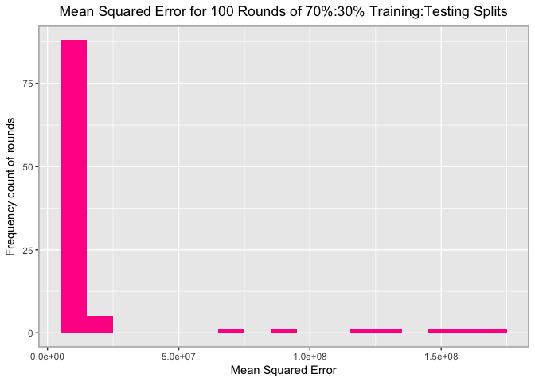

MACS 30100 PS6
================
Erin M. Ochoa
2017 February 27

-   [Part 1: Joe Biden (redux)](#part-1-joe-biden-redux)
-   [Part 2: College (bivariate) \[3 points\]](#part-2-college-bivariate-3-points)
-   [Part 3: College (GAM) \[3 points\]](#part-3-college-gam-3-points)
-   [Submission instructions](#submission-instructions)
    -   [If you use R](#if-you-use-r)

``` r
mse = function(model, data) {
  x = modelr:::residuals(model, data)
  mean(x ^ 2, na.rm = TRUE)
}
```

Part 1: Joe Biden (redux)
=========================

[Joe Biden](https://en.wikipedia.org/wiki/Joe_Biden) was the 47th Vice President of the United States. He was the subject of [many memes](http://distractify.com/trending/2016/11/16/best-of-joe-and-obama-memes), [attracted the attention of Leslie Knope](https://www.youtube.com/watch?v=NvbMB_GGR6s), and [experienced a brief surge in attention due to photos from his youth](http://www.huffingtonpost.com/entry/joe-young-hot_us_58262f53e4b0c4b63b0c9e11).

This sounds like a repeat, because it is. You previously estimated a series of linear regression models based on the Biden dataset. Now we will revisit that approach and implement resampling methods to validate our original findings.

`biden.csv` contains a selection of variables from the [2008 American National Election Studies survey](http://www.electionstudies.org/) that allow you to test competing factors that may influence attitudes towards Joe Biden. The variables are coded as follows:

-   `biden` - feeling thermometer ranging from 0-100[1]
-   `female` - 1 if respondent is female, 0 if respondent is male
-   `age` - age of respondent in years
-   `dem` - 1 if respondent is a Democrat, 0 otherwise
-   `rep` - 1 if respondent is a Republican, 0 otherwise
-   `educ` - number of years of formal education completed by respondent
    -   `17` - 17+ years (aka first year of graduate school and up)

For this exercise we consider the following functional form:

*Y* = *β*<sub>0</sub> + *β*<sub>1</sub>*X*<sub>1</sub> + *β*<sub>2</sub>*X*<sub>2</sub> + *β*<sub>3</sub>*X*<sub>3</sub> + *β*<sub>4</sub>*X*<sub>4</sub> + *β*<sub>5</sub>*X*<sub>5</sub> + *ϵ*

where *Y* is the Joe Biden feeling thermometer, *X*<sub>1</sub> is age, *X*<sub>2</sub> is gender, *X*<sub>3</sub> is education, *X*<sub>4</sub> is Democrat, and *X*<sub>5</sub> is Republican.[2] Report the parameters and standard errors.

1.  Estimate the training MSE of the model using the traditional approach.
    -   Fit the linear regression model using the entire dataset and calculate the mean squared error for the training set.

``` r
df = read.csv('data/biden.csv')
df$Party[df$dem == 1] = 'Democrat'
df$Party[df$dem == 0 & df$rep == 0] = 'No Affiliation'
df$Party[df$rep == 1] = 'Republican'
```

``` r
lm_full_dataset = lm(biden ~ age + female + educ + dem + rep, data = df)

mse_full_dataset = mse(lm_full_dataset,df)
summary(lm_full_dataset)
```

    ## 
    ## Call:
    ## lm(formula = biden ~ age + female + educ + dem + rep, data = df)
    ## 
    ## Residuals:
    ##     Min      1Q  Median      3Q     Max 
    ## -75.546 -11.295   1.018  12.776  53.977 
    ## 
    ## Coefficients:
    ##              Estimate Std. Error t value Pr(>|t|)    
    ## (Intercept)  58.81126    3.12444  18.823  < 2e-16 ***
    ## age           0.04826    0.02825   1.708   0.0877 .  
    ## female        4.10323    0.94823   4.327 1.59e-05 ***
    ## educ         -0.34533    0.19478  -1.773   0.0764 .  
    ## dem          15.42426    1.06803  14.442  < 2e-16 ***
    ## rep         -15.84951    1.31136 -12.086  < 2e-16 ***
    ## ---
    ## Signif. codes:  0 '***' 0.001 '**' 0.01 '*' 0.05 '.' 0.1 ' ' 1
    ## 
    ## Residual standard error: 19.91 on 1801 degrees of freedom
    ## Multiple R-squared:  0.2815, Adjusted R-squared:  0.2795 
    ## F-statistic: 141.1 on 5 and 1801 DF,  p-value: < 2.2e-16


1.  Estimate the test MSE of the model using the validation set approach.
    -   Split the sample set into a training set (70%) and a validation set (30%). **Be sure to set your seed prior to this part of your code to guarantee reproducibility of results.**
    -   Fit the linear regression model using only the training observations.
    -   Calculate the MSE using only the test set observations.
    -   How does this value compare to the training MSE from step 1?

``` r
biden_split7030 = resample_partition(df, c(test = 0.3, train = 0.7))
biden_train70 = biden_split7030$train %>%
                tbl_df()
biden_test30 = biden_split7030$test %>%
               tbl_df()

lm_train70 = lm(biden ~ age + female + educ + dem + rep, data = biden_train70)
summary(lm_train70)
```

    ## 
    ## Call:
    ## lm(formula = biden ~ age + female + educ + dem + rep, data = biden_train70)
    ## 
    ## Residuals:
    ##     Min      1Q  Median      3Q     Max 
    ## -75.759 -10.736   0.903  12.930  53.675 
    ## 
    ## Coefficients:
    ##              Estimate Std. Error t value Pr(>|t|)    
    ## (Intercept)  57.33735    3.69768  15.506  < 2e-16 ***
    ## age           0.03728    0.03362   1.109 0.267701    
    ## female        4.17215    1.12671   3.703 0.000222 ***
    ## educ         -0.26017    0.23221  -1.120 0.262750    
    ## dem          16.32775    1.27664  12.790  < 2e-16 ***
    ## rep         -14.60704    1.55800  -9.375  < 2e-16 ***
    ## ---
    ## Signif. codes:  0 '***' 0.001 '**' 0.01 '*' 0.05 '.' 0.1 ' ' 1
    ## 
    ## Residual standard error: 19.89 on 1259 degrees of freedom
    ## Multiple R-squared:  0.2787, Adjusted R-squared:  0.2758 
    ## F-statistic: 97.28 on 5 and 1259 DF,  p-value: < 2.2e-16

``` r
mse_test30 = mse(lm_train70,biden_test30)
```


1.  Repeat the validation set approach 100 times, using 100 different splits of the observations into a training set and a validation set. Comment on the results obtained.

``` r
rounds = 100

mse_list_100 = vector("numeric", rounds)

for(i in 1:rounds) {
  split7030 = resample_partition(df, c(test = 0.3, train = 0.7))
  train70 = split7030$train %>%
            tbl_df()
  test30 = split7030$test %>%
           tbl_df()

  lm_100_train70 = lm(biden ~ age + female + educ + dem + rep, data = train70)

  mse_100_test30 = mse(lm_100_train70,test30)
  mse_list_100[[i]] = mse_100_test30
}

mse_df_100 = as.data.frame(mse_list_100)
```


1.  Estimate the test MSE of the model using the leave-one-out cross-validation (LOOCV) approach. Comment on the results obtained.

``` r
loocv_biden_data <- crossv_kfold(df, k = nrow(df))
loocv_biden_models <- map(loocv_biden_data$train, ~ lm(biden ~ age + female + educ + dem + rep, data = .))

loocv_biden_mse_list <- map2_dbl(loocv_biden_models, loocv_biden_data$test, mse)
loocv_biden_mean_mse = (loocv_biden_mse_list)

loocv_biden_mse = as.data.frame(loocv_biden_mse_list)
```


1.  Estimate the test MSE of the model using the 10-fold cross-validation approach. Comment on the results obtained.

``` r
biden_cv10_data = crossv_kfold(df, k = 10)

biden_cv10_model = map(biden_cv10_data$train, ~ lm(biden ~ age + female + educ + dem + rep, data = .))
biden_cv10_mse = map2_dbl(biden_cv10_model, biden_cv10_data$test, mse)
biden_cv_error_10fold = mean(biden_cv10_mse)

biden_cv_error_10fold
```

    ## [1] 398.0729

``` r
biden_cv_mse = as.data.frame(biden_cv10_mse)
```


1.  Repeat the 10-fold cross-validation approach 100 times, using 100 different splits of the observations into 10-folds. Comment on the results obtained.

``` r
mse_list_10fold_100 = vector("list", rounds)

for(i in 1:rounds) {
  
  
  biden100_cv10_data = crossv_kfold(df, k = 10)

  biden100_cv10_model = map(biden100_cv10_data$train, ~ lm(biden ~ age + female + educ + dem + rep, data = .))

  biden100_cv10_mse = map2_dbl(biden100_cv10_model, biden100_cv10_data$test, mse)
  biden100_cv_error_10fold = mean(biden100_cv10_mse)

  biden100_cv_mse = as.data.frame(biden_cv10_mse)
  
  
  mse_list_10fold_100[[i]] = biden100_cv10_mse
}

k = 0
mse_list_10fold_100_all = vector("numeric", rounds * 10)

for(i in 1:100){
  for(j in 1:10){
    mse_list_10fold_100_all[[j + k]] = mse_list_10fold_100[[i]][[j]]
  }
  k = k + 10
}

mse_list_100_means = vector("numeric", rounds)

for(i in 1:100){
  avg = mean(mse_list_10fold_100[[i]])
  mse_list_100_means[[i]] = avg
}


biden_100_10fold_mse_all = as.data.frame(mse_list_10fold_100_all)
biden_100_10fold_mse_means = as.data.frame(mse_list_100_means)
```


1.  Compare the estimated parameters and standard errors from the original model in step 1 (the model estimated using all of the available data) to parameters and standard errors estimated using the bootstrap (*n* = 1000).

``` r
biden_bstrap = df %>%
               modelr::bootstrap(1000) %>%
               mutate(model = map(strap, ~ lm(biden ~ age + female + educ + dem + rep, data = .)),
                      coef = map(model, tidy))

biden_bstrap %>%
             unnest(coef) %>%
             group_by(term) %>%
             summarize(est.boot = mean(estimate),
                       se.boot = sd(estimate, na.rm = TRUE))
```

    ## # A tibble: 6 × 3
    ##          term     est.boot    se.boot
    ##         <chr>        <dbl>      <dbl>
    ## 1 (Intercept)  58.91337251 2.97814255
    ## 2         age   0.04770968 0.02883481
    ## 3         dem  15.43020645 1.10724812
    ## 4        educ  -0.34950530 0.19214401
    ## 5      female   4.08800549 0.94879605
    ## 6         rep -15.87431840 1.44433208

Part 2: College (bivariate) \[3 points\]
========================================

``` r
df2 = read.csv('data/College.csv')
```

``` r
lm_outstate_expend = lm(Outstate ~ Expend, data = df2)
lm_outstate_terminal = lm(Outstate ~ Terminal, data = df2)
lm_outstate_pers = lm(Outstate ~ Personal, data = df2)

mse_outstate_expend = mse(lm_outstate_expend,df2)
summary(lm_outstate_expend)
```

    ## 
    ## Call:
    ## lm(formula = Outstate ~ Expend, data = df2)
    ## 
    ## Residuals:
    ##      Min       1Q   Median       3Q      Max 
    ## -15780.8  -2088.7     57.6   2010.8   7784.5 
    ## 
    ## Coefficients:
    ##              Estimate Std. Error t value Pr(>|t|)    
    ## (Intercept) 5.434e+03  2.248e+02   24.17   <2e-16 ***
    ## Expend      5.183e-01  2.047e-02   25.32   <2e-16 ***
    ## ---
    ## Signif. codes:  0 '***' 0.001 '**' 0.01 '*' 0.05 '.' 0.1 ' ' 1
    ## 
    ## Residual standard error: 2978 on 775 degrees of freedom
    ## Multiple R-squared:  0.4526, Adjusted R-squared:  0.4519 
    ## F-statistic: 640.9 on 1 and 775 DF,  p-value: < 2.2e-16

``` r
mse_outstate_terminal = mse(lm_outstate_terminal,df2)
summary(lm_outstate_terminal)
```

    ## 
    ## Call:
    ## lm(formula = Outstate ~ Terminal, data = df2)
    ## 
    ## Residuals:
    ##      Min       1Q   Median       3Q      Max 
    ## -10123.5  -2988.6    253.2   2330.9  13567.4 
    ## 
    ## Coefficients:
    ##             Estimate Std. Error t value Pr(>|t|)    
    ## (Intercept) 1555.008    726.338   2.141   0.0326 *  
    ## Terminal     111.485      8.962  12.440   <2e-16 ***
    ## ---
    ## Signif. codes:  0 '***' 0.001 '**' 0.01 '*' 0.05 '.' 0.1 ' ' 1
    ## 
    ## Residual standard error: 3675 on 775 degrees of freedom
    ## Multiple R-squared:  0.1665, Adjusted R-squared:  0.1654 
    ## F-statistic: 154.8 on 1 and 775 DF,  p-value: < 2.2e-16

``` r
mse_outstate_pers = mse(lm_outstate_pers,df2)
summary(lm_outstate_pers)
```

    ## 
    ## Call:
    ## lm(formula = Outstate ~ Personal, data = df2)
    ## 
    ## Residuals:
    ##     Min      1Q  Median      3Q     Max 
    ## -8643.7 -2673.7  -437.7  2446.8 10951.2 
    ## 
    ## Coefficients:
    ##               Estimate Std. Error t value Pr(>|t|)    
    ## (Intercept) 12823.1401   305.8483  41.926   <2e-16 ***
    ## Personal       -1.7771     0.2037  -8.726   <2e-16 ***
    ## ---
    ## Signif. codes:  0 '***' 0.001 '**' 0.01 '*' 0.05 '.' 0.1 ' ' 1
    ## 
    ## Residual standard error: 3841 on 775 degrees of freedom
    ## Multiple R-squared:  0.08945,    Adjusted R-squared:  0.08828 
    ## F-statistic: 76.14 on 1 and 775 DF,  p-value: < 2.2e-16


``` r
pred_expend = add_predictions(df2, lm_outstate_expend, var = "predExpend")
df2$predExpend = pred_expend$predExpend
df2$residExpend = df2$Outstate - df2$predExpend

ggplot(df2, mapping = aes(predExpend, residExpend)) +
       geom_point(alpha = .15, color = 'deeppink', size = 1.5) +
       geom_smooth(color = 'grey30', method = 'loess') +
       labs(title = "Out-of-state Tuition based on Instructional Expenditure per Student:\nResiduals vs. Predicted Values",
            x = "Predicted Out-of-state tuition",
            y = "Residual") +
       theme(plot.title = element_text(hjust = 0.5),
             panel.border = element_rect(linetype = "solid", color = "grey70", fill=NA, size=1.1))
```

 Plot shows heteroscedasticity of residuals vs. predicted values

``` r
glm_outstate_expend = glm(Outstate ~ I(Expend) + I(Expend ** 2) + I(Expend ** 3) + I(Expend ** 4) + I(Expend ** 5), data = df2)

summary(glm_outstate_expend)
```

    ## 
    ## Call:
    ## glm(formula = Outstate ~ I(Expend) + I(Expend^2) + I(Expend^3) + 
    ##     I(Expend^4) + I(Expend^5), data = df2)
    ## 
    ## Deviance Residuals: 
    ##      Min        1Q    Median        3Q       Max  
    ## -11742.4   -1536.5     220.9    1770.4    6048.0  
    ## 
    ## Coefficients:
    ##               Estimate Std. Error t value Pr(>|t|)  
    ## (Intercept)  1.848e+03  1.633e+03   1.132   0.2581  
    ## I(Expend)    6.622e-01  5.342e-01   1.239   0.2155  
    ## I(Expend^2)  6.983e-05  6.083e-05   1.148   0.2514  
    ## I(Expend^3) -5.049e-09  2.984e-09  -1.692   0.0910 .
    ## I(Expend^4)  1.094e-13  6.352e-14   1.722   0.0855 .
    ## I(Expend^5) -7.778e-19  4.792e-19  -1.623   0.1050  
    ## ---
    ## Signif. codes:  0 '***' 0.001 '**' 0.01 '*' 0.05 '.' 0.1 ' ' 1
    ## 
    ## (Dispersion parameter for gaussian family taken to be 6432958)
    ## 
    ##     Null deviance: 1.2559e+10  on 776  degrees of freedom
    ## Residual deviance: 4.9598e+09  on 771  degrees of freedom
    ## AIC: 14394
    ## 
    ## Number of Fisher Scoring iterations: 2

``` r
outstate_expend_pred = augment(glm_outstate_expend, newdata = data_grid(df2, Expend)) %>%
  mutate(pred_low = .fitted - 1.96 * .se.fit,
         pred_high = .fitted + 1.96 * .se.fit)
```


``` r
expend_mse_list_100 = vector("numeric", rounds)

for(i in 1:rounds) {
  split7030 = resample_partition(df2, c(test = 0.3, train = 0.7))
  train70 = split7030$train %>%
            tbl_df()
  test30 = split7030$test %>%
           tbl_df()

  glm_100_train70 = glm(Outstate ~ I(Expend) + I(Expend ** 2) + I(Expend ** 3) + I(Expend ** 4) + I(Expend ** 5), data = train70)

  expend_mse_100_test30 = mse(glm_100_train70,test30)
  expend_mse_list_100[[i]] = expend_mse_100_test30
}

expend_mse_df_100 = as.data.frame(expend_mse_list_100)
```




``` r
pred_terminal = add_predictions(df2, lm_outstate_terminal, var = "predTerminal")
df2$predTerminal = pred_terminal$predTerminal
df2$residTerminal = df2$Outstate - df2$predTerminal

ggplot(df2, mapping = aes(predTerminal, residTerminal)) +
       geom_point(alpha = .15, color = 'purple1', size = 1.5) +
       geom_smooth(color = 'grey30', method = 'loess') +
     labs(title = "Out-of-state Tuition based on Percent of Faculty with Terminal Degrees:\nResiduals vs. Predicted Values",
            x = "Predicted Out-of-state tuition",
            y = "Residual") +
       theme(plot.title = element_text(hjust = 0.5),
             panel.border = element_rect(linetype = "solid", color = "grey70", fill=NA, size=1.1))
```


``` r
glm_outstate_terminal = glm(Outstate ~ I(Terminal) + I(Terminal ** 2) + I(Terminal ** 3) + I(Terminal ** 4), data = df2)

#glm_outstate_terminal = glm(Outstate ~ I(Terminal ** 4), data = df2)

summary(glm_outstate_terminal)
```

    ## 
    ## Call:
    ## glm(formula = Outstate ~ I(Terminal) + I(Terminal^2) + I(Terminal^3) + 
    ##     I(Terminal^4), data = df2)
    ## 
    ## Deviance Residuals: 
    ##      Min        1Q    Median        3Q       Max  
    ## -12320.5   -2613.4     206.8    2473.7   13233.9  
    ## 
    ## Coefficients:
    ##                 Estimate Std. Error t value Pr(>|t|)
    ## (Intercept)    6.998e+03  1.784e+04   0.392    0.695
    ## I(Terminal)    3.139e+01  1.208e+03   0.026    0.979
    ## I(Terminal^2)  1.706e+00  2.928e+01   0.058    0.954
    ## I(Terminal^3) -5.739e-02  3.027e-01  -0.190    0.850
    ## I(Terminal^4)  4.509e-04  1.133e-03   0.398    0.691
    ## 
    ## (Dispersion parameter for gaussian family taken to be 12667743)
    ## 
    ##     Null deviance: 1.2559e+10  on 776  degrees of freedom
    ## Residual deviance: 9.7795e+09  on 772  degrees of freedom
    ## AIC: 14920
    ## 
    ## Number of Fisher Scoring iterations: 2

``` r
outstate_terminal_pred = augment(glm_outstate_terminal, newdata = data_grid(df2, Terminal)) %>%
  mutate(pred_low = .fitted - 1.96 * .se.fit,
         pred_high = .fitted + 1.96 * .se.fit)
```


``` r
terminal_mse_list_100 = vector("numeric", rounds)

for(i in 1:rounds) {
  split7030 = resample_partition(df2, c(test = 0.3, train = 0.7))
  train70 = split7030$train %>%
            tbl_df()
  test30 = split7030$test %>%
           tbl_df()

  glm_100_train70 = glm(Outstate ~ I(Terminal) + I(Terminal ** 2) + I(Terminal ** 3) + I(Terminal ** 4), data = train70)

  terminal_mse_100_test30 = mse(glm_100_train70,test30)
  terminal_mse_list_100[[i]] = terminal_mse_100_test30
}

terminal_mse_df_100 = as.data.frame(terminal_mse_list_100)
```


``` r
pred_pers = add_predictions(df2, lm_outstate_pers, var = "predPers")
df2$predPers = pred_pers$predPers
df2$residPers = df2$Outstate - df2$predPers

ggplot(df2, mapping = aes(predPers, residPers)) +
       geom_point(alpha = .15, color = 'orangered', size = 1.5) +
       geom_smooth(color = 'grey30', method = 'loess') +
       labs(title = "Out-of-state Tuition based on Personal Spending:\nResiduals vs. Predicted Values",
            x = "Predicted Out-of-state tuition",
            y = "Residual") +
       theme(plot.title = element_text(hjust = 0.5),
             panel.border = element_rect(linetype = "solid", color = "grey70", fill=NA, size=1.1))
```


``` r
glm_outstate_pers = glm(Outstate ~ I(Personal) + I(Personal ** 2) + I(Personal ** 3) , data = df2)

outstate_pers_pred = augment(glm_outstate_pers, newdata = data_grid(df2, Personal)) %>%
  mutate(pred_low = .fitted - 1.96 * .se.fit,
         pred_high = .fitted + 1.96 * .se.fit)
```


``` r
pers_mse_list_100 = vector("numeric", rounds)

for(i in 1:rounds) {
  split7030 = resample_partition(df2, c(test = 0.3, train = 0.7))
  train70 = split7030$train %>%
            tbl_df()
  test30 = split7030$test %>%
           tbl_df()

  glm_100_train70 = glm(Outstate ~ I(Personal) + I(Personal ** 2) + I(Personal ** 3), data = train70)

  pers_mse_100_test30 = mse(glm_100_train70,test30)
  pers_mse_list_100[[i]] = pers_mse_100_test30
}

pers_mse_df_100 = as.data.frame(pers_mse_list_100)
```


The `College` dataset in the `ISLR` library (also available as a `.csv` or [`.feather`](https://github.com/wesm/feather) file in the `data` folder) contains statistics for a large number of U.S. colleges from the 1995 issue of U.S. News and World Report.

-   `Private` - A factor with levels `No` and `Yes` indicating private or public university.
-   `Apps` - Number of applications received.
-   `Accept` - Number of applications accepted.
-   `Enroll` - Number of new students enrolled.
-   `Top10perc` - Percent of new students from top 10% of H.S. class.
-   `Top25perc` - Percent of new students from top 25% of H.S. class.
-   `F.Undergrad` - Number of fulltime undergraduates.
-   `P.Undergrad` - Number of parttime undergraduates.
-   `Outstate` - Out-of-state tuition.
-   `Room.Board` - Room and board costs.
-   `Books` - Estimated book costs.
-   `Personal` - Estimated personal spending.
-   `PhD` - Percent of faculty with Ph.D.'s.
-   `Terminal` - Percent of faculty with terminal degrees.
-   `S.F.Ratio` - Student/faculty ratio.
-   `perc.alumni` - Percent of alumni who donate.
-   `Expend` - Instructional expenditure per student.
-   `Grad.Rate` - Graduation rate.

Explore the bivariate relationships between some of the available predictors and `Outstate`. You should estimate at least 3 **simple** linear regression models (i.e. only one predictor per model). Use non-linear fitting techniques in order to fit a flexible model to the data, **as appropriate**. You could consider any of the following techniques:

-   No transformation
-   Monotonic transformation
-   Polynomial regression
-   Step functions
-   Splines
-   Local regression

Justify your use of linear or non-linear techniques using cross-validation methods. Create plots of the results obtained, and write a summary of your findings.

Part 3: College (GAM) \[3 points\]
==================================

The `College` dataset in the `ISLR` library (also available as a `.csv` or [`.feather`](https://github.com/wesm/feather) file in the `data` folder) contains statistics for a large number of U.S. colleges from the 1995 issue of U.S. News and World Report. The variables we are most concerned with are:

-   `Outstate` - Out-of-state tuition.
-   `Private` - A factor with levels `No` and `Yes` indicating private or public university.
-   `Room.Board` - Room and board costs.
-   `PhD` - Percent of faculty with Ph.D.'s.
-   `perc.alumni` - Percent of alumni who donate.
-   `Expend` - Instructional expenditure per student.
-   `Grad.Rate` - Graduation rate.

``` r
df2$PrivateRC[df2$Private == 'Yes'] = 1
df2$PrivateRC[df2$Private == 'No'] = 0

college_split7030 = resample_partition(df2, c(test = 0.3, train = 0.7))
college_train70 = college_split7030$train %>%
                  tbl_df()
college_test30 = college_split7030$test %>%
                 tbl_df()
```

``` r
lm_college_train70 = lm(Outstate ~ PrivateRC + Room.Board + PhD + perc.alumni + Expend + Grad.Rate, data = college_train70)
summary(lm_college_train70)
```

    ## 
    ## Call:
    ## lm(formula = Outstate ~ PrivateRC + Room.Board + PhD + perc.alumni + 
    ##     Expend + Grad.Rate, data = college_train70)
    ## 
    ## Residuals:
    ##     Min      1Q  Median      3Q     Max 
    ## -7331.5 -1333.1   -50.1  1252.3 10049.2 
    ## 
    ## Coefficients:
    ##               Estimate Std. Error t value Pr(>|t|)    
    ## (Intercept) -3.362e+03  5.074e+02  -6.625 8.43e-11 ***
    ## PrivateRC    2.942e+03  2.388e+02  12.319  < 2e-16 ***
    ## Room.Board   9.608e-01  9.976e-02   9.631  < 2e-16 ***
    ## PhD          3.266e+01  6.482e+00   5.039 6.41e-07 ***
    ## perc.alumni  4.572e+01  8.925e+00   5.123 4.20e-07 ***
    ## Expend       2.454e-01  2.244e-02  10.937  < 2e-16 ***
    ## Grad.Rate    2.660e+01  6.278e+00   4.238 2.66e-05 ***
    ## ---
    ## Signif. codes:  0 '***' 0.001 '**' 0.01 '*' 0.05 '.' 0.1 ' ' 1
    ## 
    ## Residual standard error: 1987 on 537 degrees of freedom
    ## Multiple R-squared:  0.759,  Adjusted R-squared:  0.7563 
    ## F-statistic: 281.9 on 6 and 537 DF,  p-value: < 2.2e-16


1.  Split the data into a training set and a test set.
2.  Estimate an OLS model on the training data, using out-of-state tuition (`Outstate`) as the response variable and the other six variables as the predictors. Interpret the results and explain your findings, using appropriate techniques (tables, graphs, statistical tests, etc.).
3.  Estimate a GAM on the training data, using out-of-state tuition (`Outstate`) as the response variable and the other six variables as the predictors. You can select any non-linear method (or linear) presented in the readings or in-class to fit each variable. Plot the results, and explain your findings. Interpret the results and explain your findings, using appropriate techniques (tables, graphs, statistical tests, etc.).
4.  Use the test set to evaluate the model fit of the estimated OLS and GAM models, and explain the results obtained.
5.  For which variables, if any, is there evidence of a non-linear relationship with the response?[3]

``` r
college_gam = gam(Outstate ~ PrivateRC + bs(Room.Board, df = 5) + bs(PhD, df=5) + bs(perc.alumni,df=5) + I(Expend) + I(Expend ** 2) + I(Expend ** 3) + I(Expend **4) + I(Expend ** 5) + bs(Grad.Rate,df=5), data = college_train70)#df2)
summary(college_gam)
```

    ## 
    ## Call: gam(formula = Outstate ~ PrivateRC + bs(Room.Board, df = 5) + 
    ##     bs(PhD, df = 5) + bs(perc.alumni, df = 5) + I(Expend) + I(Expend^2) + 
    ##     I(Expend^3) + I(Expend^4) + I(Expend^5) + bs(Grad.Rate, df = 5), 
    ##     data = college_train70)
    ## Deviance Residuals:
    ##      Min       1Q   Median       3Q      Max 
    ## -7416.11 -1045.57    64.17  1234.08  7166.31 
    ## 
    ## (Dispersion Parameter for gaussian family taken to be 3370606)
    ## 
    ##     Null Deviance: 8794017055 on 543 degrees of freedom
    ## Residual Deviance: 1742603523 on 517 degrees of freedom
    ## AIC: 9748.76 
    ## 
    ## Number of Local Scoring Iterations: 2 
    ## 
    ## Anova for Parametric Effects
    ##                          Df     Sum Sq    Mean Sq  F value    Pr(>F)    
    ## PrivateRC                 1 2848042770 2848042770 844.9645 < 2.2e-16 ***
    ## bs(Room.Board, df = 5)    5 2258209893  451641979 133.9943 < 2.2e-16 ***
    ## bs(PhD, df = 5)           5  928626841  185725368  55.1015 < 2.2e-16 ***
    ## bs(perc.alumni, df = 5)   5  353392147   70678429  20.9691 < 2.2e-16 ***
    ## I(Expend)                 1  329160993  329160993  97.6563 < 2.2e-16 ***
    ## I(Expend^2)               1  197353066  197353066  58.5512 9.767e-14 ***
    ## I(Expend^3)               1    3898162    3898162   1.1565  0.282691    
    ## I(Expend^4)               1   27347465   27347465   8.1135  0.004569 ** 
    ## I(Expend^5)               1   16418054   16418054   4.8709  0.027751 *  
    ## bs(Grad.Rate, df = 5)     5   88964142   17792828   5.2788 9.684e-05 ***
    ## Residuals               517 1742603523    3370606                       
    ## ---
    ## Signif. codes:  0 '***' 0.001 '**' 0.01 '*' 0.05 '.' 0.1 ' ' 1

``` r
college_gam_terms <- preplot(college_gam, se = TRUE, rug = FALSE)
```

``` r
data_frame(x = college_gam_terms$PrivateRC$x,
           y = college_gam_terms$PrivateRC$y,
           se.fit = college_gam_terms$PrivateRC$se.y) %>%
  unique %>%
  mutate(y_low = y - 1.96 * se.fit,
         y_high = y + 1.96 * se.fit,
         x = factor(x, levels = 0:1, labels = c("Public", "Private"))) %>%
  ggplot(aes(x, y, ymin = y_low, ymax = y_high)) +
  geom_errorbar(aes(color=x)) +
  geom_point(aes(color=x)) +
  labs(title = "GAM of Out-of-state Tuition",
       x = NULL,
       y = expression(f[1](Private))) + 
       theme(plot.title = element_text(hjust = 0.5), plot.subtitle = element_text(hjust = 0.5), panel.border = element_rect(linetype = "solid", color = "grey70", fill=NA, size=1.1), legend.position = 'none')
```


``` r
data_frame(x = college_gam_terms$`bs(Room.Board, df = 5)`$x,
           y = college_gam_terms$`bs(Room.Board, df = 5)`$y,
           se.fit = college_gam_terms$`bs(Room.Board, df = 5)`$se.y) %>%
  mutate(y_low = y - 1.96 * se.fit,
         y_high = y + 1.96 * se.fit) %>%
  ggplot(aes(x, y)) +
  geom_line(color = 'deeppink', size = 1) +
  geom_line(aes(y = y_low), linetype = 2) +
  geom_line(aes(y = y_high), linetype = 2) + geom_point(alpha = .03) +
  labs(title = "GAM of Out-of-state Tuition",
       subtitle = "Cubic spline",
       x = 'Room & Board',
       y = expression(f[2](RoomAndBoard))) + 
       theme(plot.title = element_text(hjust = 0.5), plot.subtitle = element_text(hjust = 0.5), panel.border = element_rect(linetype = "solid", color = "grey70", fill=NA, size=1.1), legend.position = 'none')
```


``` r
data_frame(x = college_gam_terms$`bs(PhD, df = 5)`$x,
           y = college_gam_terms$`bs(PhD, df = 5)`$y,
           se.fit = college_gam_terms$`bs(PhD, df = 5)`$se.y) %>%
  mutate(y_low = y - 1.96 * se.fit,
         y_high = y + 1.96 * se.fit) %>%
  ggplot(aes(x, y)) +
  geom_line(color = 'darkturquoise', size = 1) +
  geom_line(aes(y = y_low), linetype = 2) +
  geom_line(aes(y = y_high), linetype = 2) + geom_point(alpha = .03) +
  labs(title = "GAM of Out-of-state Tuition",
       subtitle = "Cubic spline",
       x = 'Percentage of Professors with PhDs',
       y = expression(f[3](PhD))) + 
       theme(plot.title = element_text(hjust = 0.5), plot.subtitle = element_text(hjust = 0.5), panel.border = element_rect(linetype = "solid", color = "grey70", fill=NA, size=1.1), legend.position = 'none')
```


``` r
data_frame(x = college_gam_terms$`bs(perc.alumni, df = 5)`$x,
           y = college_gam_terms$`bs(perc.alumni, df = 5)`$y,
           se.fit = college_gam_terms$`bs(perc.alumni, df = 5)`$se.y) %>%
  mutate(y_low = y - 1.96 * se.fit,
         y_high = y + 1.96 * se.fit) %>%
  ggplot(aes(x, y)) +
  geom_line(color = 'purple1', size = 1) +
  geom_line(aes(y = y_low), linetype = 2) +
  geom_line(aes(y = y_high), linetype = 2) + geom_point(alpha = .03) +
  labs(title = "GAM of Out-of-state Tuition",
       subtitle = "Cubic spline",
       x = 'Percentage Alumni who Donate',
       y = expression(f[4](PercentageAlumni))) + 
       theme(plot.title = element_text(hjust = 0.5), plot.subtitle = element_text(hjust = 0.5), panel.border = element_rect(linetype = "solid", color = "grey70", fill=NA, size=1.1), legend.position = 'none')
```


``` r
data_frame(x = college_gam_terms$`I(Expend^5)`$x,
           y = college_gam_terms$`I(Expend^5)`$y,
           se.fit = college_gam_terms$`I(Expend^5)`$se.y) %>%
  mutate(y_low = y - 1.96 * se.fit,
         y_high = y + 1.96 * se.fit) %>%
  ggplot(aes(x, y)) +
  geom_line(color = 'orangered', size = 1) +
  geom_line(aes(y = y_low), linetype = 2) +
  geom_line(aes(y = y_high), linetype = 2) + geom_point(alpha = .03) +
  labs(title = "GAM of Out-of-state Tuition",
       subtitle = "Cubic spline",
       x = 'Instructional Expenditures per Student',
       y = expression(f[5](PerStudentInstructionalExpenditures))) + 
       theme(plot.title = element_text(hjust = 0.5), plot.subtitle = element_text(hjust = 0.5), panel.border = element_rect(linetype = "solid", color = "grey70", fill=NA, size=1.1), legend.position = 'none')
```


``` r
data_frame(x = college_gam_terms$`bs(Grad.Rate, df = 5)`$x,
           y = college_gam_terms$`bs(Grad.Rate, df = 5)`$y,
           se.fit = college_gam_terms$`bs(Grad.Rate, df = 5)`$se.y) %>%
  mutate(y_low = y - 1.96 * se.fit,
         y_high = y + 1.96 * se.fit) %>%
  ggplot(aes(x, y)) +
  geom_line(color = 'springgreen1', size = 1) +
  geom_line(aes(y = y_low), linetype = 2) +
  geom_line(aes(y = y_high), linetype = 2) + geom_point(alpha = .03) +
  labs(title = "GAM of Out-of-state Tuition",
       subtitle = "Cubic spline",
       x = 'Graduation Rate',
       y = expression(f[6](GraduationRate))) + 
       theme(plot.title = element_text(hjust = 0.5), plot.subtitle = element_text(hjust = 0.5), panel.border = element_rect(linetype = "solid", color = "grey70", fill=NA, size=1.1), legend.position = 'none')
```


``` r
college_mse_test30 = mse(lm_college_train70,college_test30)
```

``` r
gam_college_ex_rmbd = gam(Outstate ~ PrivateRC + bs(PhD, df=5) + bs(perc.alumni,df=5) + I(Expend) + I(Expend ** 2) + I(Expend ** 3) + I(Expend **4) + I(Expend ** 5) + bs(Grad.Rate,df=5), data = college_train70)
gam_college_lin_rmbd = gam(Outstate ~ PrivateRC + Room.Board + bs(PhD, df=5) + bs(perc.alumni,df=5) + I(Expend) + I(Expend ** 2) + I(Expend ** 3) + I(Expend **4) + I(Expend ** 5) + bs(Grad.Rate,df=5), data = college_train70)
anova_rmbd = anova(gam_college_ex_rmbd, gam_college_lin_rmbd, college_gam, test="F")
anova_rmbd
```

    ## Analysis of Deviance Table
    ## 
    ## Model 1: Outstate ~ PrivateRC + bs(PhD, df = 5) + bs(perc.alumni, df = 5) + 
    ##     I(Expend) + I(Expend^2) + I(Expend^3) + I(Expend^4) + I(Expend^5) + 
    ##     bs(Grad.Rate, df = 5)
    ## Model 2: Outstate ~ PrivateRC + Room.Board + bs(PhD, df = 5) + bs(perc.alumni, 
    ##     df = 5) + I(Expend) + I(Expend^2) + I(Expend^3) + I(Expend^4) + 
    ##     I(Expend^5) + bs(Grad.Rate, df = 5)
    ## Model 3: Outstate ~ PrivateRC + bs(Room.Board, df = 5) + bs(PhD, df = 5) + 
    ##     bs(perc.alumni, df = 5) + I(Expend) + I(Expend^2) + I(Expend^3) + 
    ##     I(Expend^4) + I(Expend^5) + bs(Grad.Rate, df = 5)
    ##   Resid. Df Resid. Dev Df  Deviance      F    Pr(>F)    
    ## 1       522 1960169128                                  
    ## 2       521 1774017507  1 186151621 55.228 4.476e-13 ***
    ## 3       517 1742603523  4  31413985  2.330   0.05504 .  
    ## ---
    ## Signif. codes:  0 '***' 0.001 '**' 0.01 '*' 0.05 '.' 0.1 ' ' 1

The results of the ANOVA indicate that while both the GAM with the linear term for room & board and the GAM with the cubic spline term for room & board are both statistically significant (at the p&lt;.001 and p&lt;.01 levels, respectively), the former has a much higher F-statistic (55.2279315) compared to sum(2.329995) and therefore has a higher ratio of explained to unexplained variance compared to the latter. This is evidence that the relationship between room & board and out-of-state tuition is linear.

``` r
gam_college_ex_phd = gam(Outstate ~ PrivateRC + bs(Room.Board, df = 5) + bs(perc.alumni,df=5) + I(Expend) + I(Expend ** 2) + I(Expend ** 3) + I(Expend **4) + I(Expend ** 5) + bs(Grad.Rate,df=5), data = college_train70)
gam_college_lin_phd = gam(Outstate ~ PrivateRC + bs(Room.Board, df=5) + PhD + bs(perc.alumni,df=5) + I(Expend) + I(Expend ** 2) + I(Expend ** 3) + I(Expend **4) + I(Expend ** 5) + bs(Grad.Rate,df=5), data = college_train70)
anova_phd = anova(gam_college_ex_phd, gam_college_lin_phd, college_gam, test="F")
anova_phd
```

    ## Analysis of Deviance Table
    ## 
    ## Model 1: Outstate ~ PrivateRC + bs(Room.Board, df = 5) + bs(perc.alumni, 
    ##     df = 5) + I(Expend) + I(Expend^2) + I(Expend^3) + I(Expend^4) + 
    ##     I(Expend^5) + bs(Grad.Rate, df = 5)
    ## Model 2: Outstate ~ PrivateRC + bs(Room.Board, df = 5) + PhD + bs(perc.alumni, 
    ##     df = 5) + I(Expend) + I(Expend^2) + I(Expend^3) + I(Expend^4) + 
    ##     I(Expend^5) + bs(Grad.Rate, df = 5)
    ## Model 3: Outstate ~ PrivateRC + bs(Room.Board, df = 5) + bs(PhD, df = 5) + 
    ##     bs(perc.alumni, df = 5) + I(Expend) + I(Expend^2) + I(Expend^3) + 
    ##     I(Expend^4) + I(Expend^5) + bs(Grad.Rate, df = 5)
    ##   Resid. Df Resid. Dev Df Deviance      F  Pr(>F)  
    ## 1       522 1775797038                             
    ## 2       521 1758505161  1 17291877 5.1302 0.02393 *
    ## 3       517 1742603523  4 15901638 1.1794 0.31888  
    ## ---
    ## Signif. codes:  0 '***' 0.001 '**' 0.01 '*' 0.05 '.' 0.1 ' ' 1

Here, the ANOVA results indicate that the linear model differs significantly from the others (p&lt;.05). The F-statistics are low, though that of the GAM model with the linear term for PhD is higher (1.1794345) compared to 5.1301975). The test indicates that the relationship between PhD and out-of-state tuition is linear.

``` r
gam_college_ex_alumni = gam(Outstate ~ PrivateRC + bs(Room.Board, df = 5) + bs(PhD, df=5) + I(Expend) + I(Expend ** 2) + I(Expend ** 3) + I(Expend **4) + I(Expend ** 5) + bs(Grad.Rate,df=5), data = college_train70)
gam_college_lin_alumni = gam(Outstate ~ PrivateRC + bs(Room.Board, df = 5) + bs(PhD, df=5) + perc.alumni + I(Expend) + I(Expend ** 2) + I(Expend ** 3) + I(Expend **4) + I(Expend ** 5) + bs(Grad.Rate,df=5), data = college_train70)
anova_alumni = anova(gam_college_ex_alumni, gam_college_lin_alumni, college_gam, test="F")
anova_alumni
```

    ## Analysis of Deviance Table
    ## 
    ## Model 1: Outstate ~ PrivateRC + bs(Room.Board, df = 5) + bs(PhD, df = 5) + 
    ##     I(Expend) + I(Expend^2) + I(Expend^3) + I(Expend^4) + I(Expend^5) + 
    ##     bs(Grad.Rate, df = 5)
    ## Model 2: Outstate ~ PrivateRC + bs(Room.Board, df = 5) + bs(PhD, df = 5) + 
    ##     perc.alumni + I(Expend) + I(Expend^2) + I(Expend^3) + I(Expend^4) + 
    ##     I(Expend^5) + bs(Grad.Rate, df = 5)
    ## Model 3: Outstate ~ PrivateRC + bs(Room.Board, df = 5) + bs(PhD, df = 5) + 
    ##     bs(perc.alumni, df = 5) + I(Expend) + I(Expend^2) + I(Expend^3) + 
    ##     I(Expend^4) + I(Expend^5) + bs(Grad.Rate, df = 5)
    ##   Resid. Df Resid. Dev Df Deviance       F    Pr(>F)    
    ## 1       522 1804826283                                  
    ## 2       521 1748816299  1 56009984 16.6172 5.294e-05 ***
    ## 3       517 1742603523  4  6212776  0.4608    0.7645    
    ## ---
    ## Signif. codes:  0 '***' 0.001 '**' 0.01 '*' 0.05 '.' 0.1 ' ' 1

The GAM model with the linear term for percentage alumni who donate is statistically significantly different (p&lt;.001) from the model that excludes the term and the model that uses a spline term. Additionally, that model's F-statistic is higher than the model including the spline term (16.617183 compared to 0.4608055), which indicates that the relationship between percentage of alumni who donate and out-of-state tuition is linear.

``` r
gam_college_ex_expend = gam(Outstate ~ PrivateRC + bs(Room.Board, df = 5) + bs(PhD, df=5) + bs(perc.alumni,df=5) +  bs(Grad.Rate,df=5), data = college_train70)
gam_college_lin_expend = gam(Outstate ~ PrivateRC + bs(Room.Board, df=5) + bs(PhD, df=5) + bs(perc.alumni,df=5) + Expend + bs(Grad.Rate,df=5), data = college_train70)
anova_expend = anova(gam_college_ex_expend, gam_college_lin_expend, college_gam, test="F")
anova_expend
```

    ## Analysis of Deviance Table
    ## 
    ## Model 1: Outstate ~ PrivateRC + bs(Room.Board, df = 5) + bs(PhD, df = 5) + 
    ##     bs(perc.alumni, df = 5) + bs(Grad.Rate, df = 5)
    ## Model 2: Outstate ~ PrivateRC + bs(Room.Board, df = 5) + bs(PhD, df = 5) + 
    ##     bs(perc.alumni, df = 5) + Expend + bs(Grad.Rate, df = 5)
    ## Model 3: Outstate ~ PrivateRC + bs(Room.Board, df = 5) + bs(PhD, df = 5) + 
    ##     bs(perc.alumni, df = 5) + I(Expend) + I(Expend^2) + I(Expend^3) + 
    ##     I(Expend^4) + I(Expend^5) + bs(Grad.Rate, df = 5)
    ##   Resid. Df Resid. Dev Df  Deviance      F    Pr(>F)    
    ## 1       522 2315490474                                  
    ## 2       521 1979753599  1 335736875 99.607 < 2.2e-16 ***
    ## 3       517 1742603523  4 237150076 17.590 1.515e-13 ***
    ## ---
    ## Signif. codes:  0 '***' 0.001 '**' 0.01 '*' 0.05 '.' 0.1 ' ' 1

``` r
gam_college_ex_grad = gam(Outstate ~ PrivateRC + bs(Room.Board, df = 5) + bs(PhD, df=5) + bs(perc.alumni,df=5) + I(Expend) + I(Expend ** 2) + I(Expend ** 3) + I(Expend **4) + I(Expend ** 5), data = college_train70)
gam_college_lin_grad = gam(Outstate ~ PrivateRC + bs(Room.Board, df=5) + bs(PhD, df=5) + bs(perc.alumni,df=5) + I(Expend) + I(Expend ** 2) + I(Expend ** 3) + I(Expend **4) + I(Expend ** 5) + Grad.Rate, data = college_train70)
anova_gradrate = anova(gam_college_ex_grad, gam_college_lin_grad, college_gam, test="F")
anova_gradrate
```

    ## Analysis of Deviance Table
    ## 
    ## Model 1: Outstate ~ PrivateRC + bs(Room.Board, df = 5) + bs(PhD, df = 5) + 
    ##     bs(perc.alumni, df = 5) + I(Expend) + I(Expend^2) + I(Expend^3) + 
    ##     I(Expend^4) + I(Expend^5)
    ## Model 2: Outstate ~ PrivateRC + bs(Room.Board, df = 5) + bs(PhD, df = 5) + 
    ##     bs(perc.alumni, df = 5) + I(Expend) + I(Expend^2) + I(Expend^3) + 
    ##     I(Expend^4) + I(Expend^5) + Grad.Rate
    ## Model 3: Outstate ~ PrivateRC + bs(Room.Board, df = 5) + bs(PhD, df = 5) + 
    ##     bs(perc.alumni, df = 5) + I(Expend) + I(Expend^2) + I(Expend^3) + 
    ##     I(Expend^4) + I(Expend^5) + bs(Grad.Rate, df = 5)
    ##   Resid. Df Resid. Dev Df Deviance      F   Pr(>F)    
    ## 1       522 1831567664                                
    ## 2       521 1758782002  1 72785663 21.594 4.28e-06 ***
    ## 3       517 1742603523  4 16178479  1.200   0.3099    
    ## ---
    ## Signif. codes:  0 '***' 0.001 '**' 0.01 '*' 0.05 '.' 0.1 ' ' 1

The ANOVA results indicate that the relationship between graduation rate and out-of-state tuition is linear; this is because the GAM model with the linear term is statistically signifcantly different from the others and has a much higher F-statistic ()

Submission instructions
=======================

Assignment submission will work the same as earlier assignments. Submit your work as a pull request before the start of class on Monday. Store it in the same locations as you've been using. However the format of your submission should follow the procedures outlined below.

If you use R
------------

Submit your assignment as a single [R Markdown document](http://rmarkdown.rstudio.com/). R Markdown is similar to Juptyer Notebooks and compiles all your code, output, and written analysis in a single reproducible file.

[1] Feeling thermometers are a common metric in survey research used to gauge attitudes or feelings of warmth towards individuals and institutions. They range from 0-100, with 0 indicating extreme coldness and 100 indicating extreme warmth.

[2] Independents must be left out to serve as the baseline category, otherwise we would encounter perfect multicollinearity.

[3] Hint: Review Ch. 7.8.3 from ISL on how you can use ANOVA tests to determine if a non-linear relationship is appropriate for a given variable.
