MACS 30100 PS8
================
Erin M. Ochoa
2017 March 6

-   [Part 1: Joe Biden (redux times two)](#part-1-joe-biden-redux-times-two)
-   [Part 2: Modeling voter turnout](#part-2-modeling-voter-turnout)
-   [Part 3: OJ Simpson](#part-3-oj-simpson)

``` r
mse = function(model, data) {
  x = modelr:::residuals(model, data)
  mean(x ^ 2, na.rm = TRUE)
}


# There seems to be a bug in the gbm function.
# Work-around method found here: http://www.samuelbosch.com/2015/09/workaround-ntrees-is-missing-in-r.html

predict.gbm = function (object, newdata, n.trees, type = "link", single.tree = FALSE, ...) {
  if (missing(n.trees)) {
    if (object$train.fraction < 1) {
      n.trees = gbm.perf(object, method = "test", plot.it = FALSE)
    }
    else if (!is.null(object$cv.error)) {
      n.trees = gbm.perf(object, method = "cv", plot.it = FALSE)
    }
    else {
      n.trees = length(object$train.error)
    }
    cat(paste("Using", n.trees, "trees...\n"))
    gbm::predict.gbm(object, newdata, n.trees, type, single.tree, ...)
  }
}

logit2prob = function(x){
  exp(x) / (1 + exp(x))
}

prob2odds = function(x){
  x / (1 - x)
}

threshold_compare = function(thresh, dataframe, model){
  pred = dataframe %>%
         add_predictions(model) %>%
         mutate(pred = logit2prob(pred),
         pred = as.numeric(pred > thresh))
}
```

Part 1: Joe Biden (redux times two)
===================================

We read in the data:

``` r
df = read.csv('data/biden.csv')
```

Next, we split the dataset into training and validation sets in a ratio of 7:3, then estimate a regression tree:

``` r
set.seed(1234)

biden_split7030 = resample_partition(df, c(test = 0.3, train = 0.7))
biden_train70 = biden_split7030$train %>%
                tbl_df()
biden_test30 = biden_split7030$test %>%
               tbl_df()

# estimate model
biden_tree1 = tree(biden ~ female + age + educ + dem + rep, data = biden_train70)
mse_test30 = mse(biden_tree1,biden_test30)
```

We evaluate the model with the testing data and find that the mean squared error is 406.417. Next, we plot the tree:

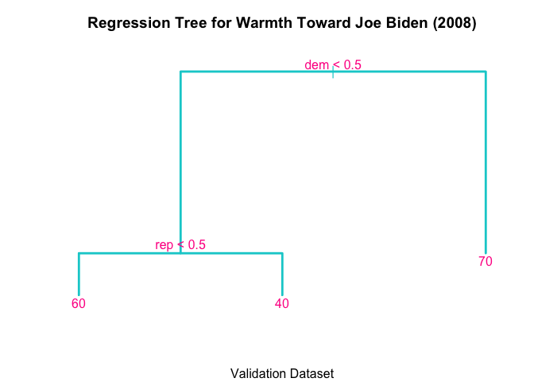

The model shows that identifying as a Democrat is the strongest predictor of feelings of warmth toward Vice President Biden, and identifying as a Republican is the second-strongest predictor. Together, these splits indicate that party affiliation (whether Democratic, Republican, or neither) is the most important factor when it comes to predicting an individual subject's feelings of warmth toward Mr. Biden.

We now fit another, more complex tree model:

``` r
biden_tree2 = tree(biden ~ female + age + educ + dem + rep, data = biden_train70,
                   control = tree.control(nobs = nrow(biden_train70), mindev = .0000001))
```

We prune the tree 49 different times, increasing the number of leaves from 2 to 50 and storing the MSE for each pruned tree:

``` r
rounds = 50

mse_list_biden_50 = vector("numeric", rounds - 1)
leaf_list_biden_50 = vector("numeric", rounds - 1)

set.seed(1234)

for(i in 2:rounds) {
    biden_mod = prune.tree(biden_tree2, best=i)

    mse_val = mse(biden_mod,biden_test30)
    mse_list_biden_50[[i-1]] = mse_val
    leaf_list_biden_50[[i-1]] = i
}

mse_df_biden_50 = as.data.frame(mse_list_biden_50)
mse_df_biden_50$branches = leaf_list_biden_50
```

We plot the MSE for each tree vs. the number of leaves:


We can clearly see that the lowest MSE is 401.075 for a tree with 11 leaves. We plot that tree:

``` r
biden_pruned11 <- prune.tree(biden_tree2, best=11)
mse_test30_2 = mse(biden_pruned11,biden_test30)

plot(biden_pruned11, col='darkturquoise', lwd=2.5)
title("Regression Tree (Best 11) for Warmth Toward Joe Biden (2008)\n", sub = "Validation Dataset")
text(biden_pruned11, col='deeppink')
```

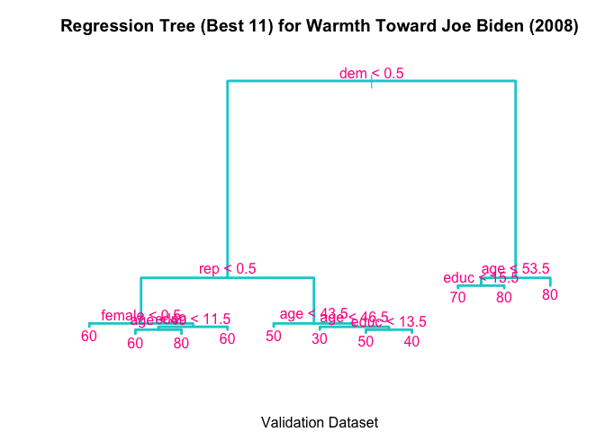

The tree indicates that for Democrats, age is the next most important variable and education after that, but that gender is not important. For unaffiliated voters, gender is important; for women, education and age are both important, but not so for men. Among Republican voters, age is important within the whole group and education is important, but only for voters between ages 44 and 47; gender is not an important predictor of feelings of warmth toward Joe Biden among Republican voters.

Pruning the tree reduces the MSE from 406.417 to 401.075.

We use the bagging approach to analyze this data, computing 500 bootstrapped trees using the training data and testing the resulting model with the validation set:

``` r
set.seed(1234)

biden_bag_data_train = biden_train70 %>%
                       rename() %>%
                       mutate_each(funs(as.factor(.)), dem, rep) %>%
                       na.omit

biden_bag_data_test = biden_test30 %>%
                      rename() %>%
                      mutate_each(funs(as.factor(.)), dem, rep) %>%
                      na.omit

(bag_biden <- randomForest(biden ~ ., data = biden_bag_data_train, mtry = 5, ntree = 500, importance=TRUE))
```

    ## 
    ## Call:
    ##  randomForest(formula = biden ~ ., data = biden_bag_data_train,      mtry = 5, ntree = 500, importance = TRUE) 
    ##                Type of random forest: regression
    ##                      Number of trees: 500
    ## No. of variables tried at each split: 5
    ## 
    ##           Mean of squared residuals: 494
    ##                     % Var explained: 9.49

``` r
mse_bag_biden = mse(bag_biden, biden_bag_data_test)

bag_biden_importance = as.data.frame(importance(bag_biden))
```

Using the validation data, the model returns a test MSE of 484.358, which is considerably higher than the MSE found when pruning the tree earlier (401.075).

Next, we review variable importance measures:

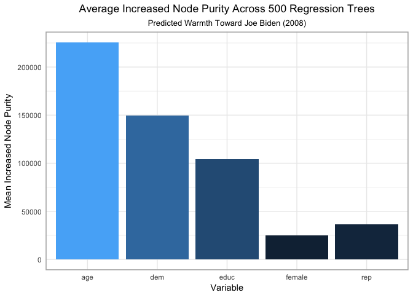

The variable importance plot shows that age and Democrat are the two most important variables as these yield the greatest average decreases (of approximately 225,000 and 150,000, respectively) in node impurity across 500 bagged regression trees. Despite the higher test MSE, the bagged tree model is likely a better model than the pruned tree above because the bagged model uses bootstrapping to create 500 different training sets, whereas the pruned tree above uses only a single training set. The bagged model averages the variance across the bootstrapped trees, which, together, suggest that age and Democrat are the most important variables while gender is the least important. It is worth noting, however, that the bagged model only accounts for 9.49% of the variance in feelings of warmth toward Joe Biden.

Next, we estimate a random forest model with 500 trees:

``` r
set.seed(1234)

m = floor(sqrt(5))

(rf_biden = randomForest(biden ~ ., data = biden_bag_data_train, mtry = m, ntree = 500))
```

    ## 
    ## Call:
    ##  randomForest(formula = biden ~ ., data = biden_bag_data_train,      mtry = m, ntree = 500) 
    ##                Type of random forest: regression
    ##                      Number of trees: 500
    ## No. of variables tried at each split: 2
    ## 
    ##           Mean of squared residuals: 404
    ##                     % Var explained: 25.9

``` r
mse_rf_biden = mse(rf_biden, biden_bag_data_test)
```

The random forest model returns a test MSE of 403.306, which is much lower than the one returned by bagging (484.358). Furthermore, the random forest model explains a greater proportion of variance (25.9%) than the bagged model does (9.49%). Still, with the variane explained at only a quarter, this suggests that there are likely unobserved and unknown variables that have a notable effect on feelings of warmth for Joe Biden.

The notable decrease in MSE is attributable to the effect of limiting the variables available every split to only *m* (2) randomly-selected predictors. This means that the trees in the random forest model will be uncorrelated to each other, the variance for the final model will be lower, and the test MSE will be lower.

We plot the importance of the predictors:

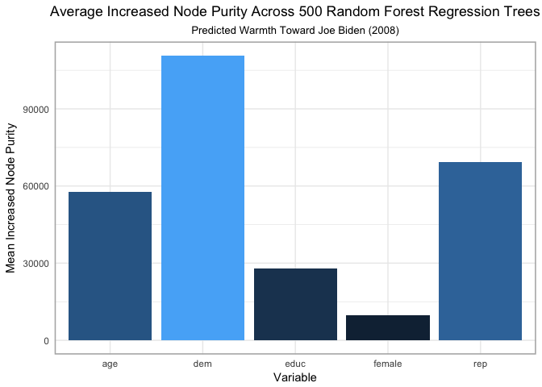

The random forest model estimates that Democrat is the sinlge most important predictor of feelings toward Joe Biden and that Republican is next in line; these have mean increased node purity of approximately 110,000 and 70,000, respectively. As was the case with the bagging model, gender is the least important predictor.

Finally, we estimate three boosting models, each of different depths and with 10,000 trees:

``` r
set.seed(1234)
biden_models = list("boosting_depth1" = gbm(as.numeric(biden) - 1 ~ ., data = biden_bag_data_train,
                                            n.trees = 10000, interaction.depth = 1),
                    "boosting_depth2" = gbm(as.numeric(biden) - 1 ~ ., data = biden_bag_data_train,
                                            n.trees = 10000, interaction.depth = 2),
                    "boosting_depth4" = gbm(as.numeric(biden) - 1 ~ ., data = biden_bag_data_train,
                                            n.trees = 10000, interaction.depth = 4))
```

    ## Distribution not specified, assuming gaussian ...
    ## Distribution not specified, assuming gaussian ...
    ## Distribution not specified, assuming gaussian ...

For each depth, we find the optimal number of iterations:

``` r
set.seed(1234)
data_frame(depth = c(1, 2, 4),
           model = biden_models[c("boosting_depth1", "boosting_depth2", "boosting_depth4")],
           optimal = map_dbl(model, gbm.perf, plot.it = FALSE)) %>%
           select(-model) %>%
           knitr::kable(caption = "Optimal number of boosting iterations",
                        col.names = c("Depth", "Optimal number of iterations"))
```

    ## Using OOB method...

    ## Warning in .f(.x[[i]], ...): OOB generally underestimates the optimal
    ## number of iterations although predictive performance is reasonably
    ## competitive. Using cv.folds>0 when calling gbm usually results in improved
    ## predictive performance.

    ## Using OOB method...

    ## Warning in .f(.x[[i]], ...): OOB generally underestimates the optimal
    ## number of iterations although predictive performance is reasonably
    ## competitive. Using cv.folds>0 when calling gbm usually results in improved
    ## predictive performance.

    ## Using OOB method...

    ## Warning in .f(.x[[i]], ...): OOB generally underestimates the optimal
    ## number of iterations although predictive performance is reasonably
    ## competitive. Using cv.folds>0 when calling gbm usually results in improved
    ## predictive performance.

|  Depth|  Optimal number of iterations|
|------:|-----------------------------:|
|      1|                          3302|
|      2|                          2700|
|      4|                          2094|

Now we estimate the boosting models with the optimal number of treesh for each depth:

``` r
set.seed(1234)

biden_boost1 = gbm(as.numeric(biden) - 1 ~ ., data = biden_bag_data_train, n.trees = 3302, interaction.depth = 1)
```

    ## Distribution not specified, assuming gaussian ...

``` r
biden_boost2 = gbm(as.numeric(biden) - 1 ~ ., data = biden_bag_data_train, n.trees = 2700, interaction.depth = 2)
```

    ## Distribution not specified, assuming gaussian ...

``` r
biden_boost4 = gbm(as.numeric(biden) - 1 ~ ., data = biden_bag_data_train, n.trees = 2094, interaction.depth = 4)
```

    ## Distribution not specified, assuming gaussian ...

``` r
mse_boost1_biden = mse(biden_boost1,biden_bag_data_test)
```

    ## Using 3302 trees...

``` r
mse_boost2_biden = mse(biden_boost2,biden_bag_data_test)
```

    ## Using 2700 trees...

``` r
mse_boost4_biden = mse(biden_boost4,biden_bag_data_test)
```

    ## Using 2094 trees...

The boosting model with a depth of 1 has a test MSE of 405.424; for the model with a depth of 2, it is 402.541 and for the model with a depth of 4 it is 404.544. This indicates that the boosting approach yields the lowest MSE for trees with a single split compared to those with two or four splits.

Next, we increase the value of the *λ* from the default of .001 to .1:

``` r
set.seed(1234)

boost1_biden_lambda = gbm(as.numeric(biden) - 1 ~ ., data = biden_bag_data_train,
                          n.trees = 3302, interaction.depth = 1, shrinkage=0.1)
```

    ## Distribution not specified, assuming gaussian ...

``` r
boost2_biden_lambda = gbm(as.numeric(biden) - 1 ~ ., data = biden_bag_data_train,
                          n.trees = 2700, interaction.depth = 2, shrinkage=0.1)
```

    ## Distribution not specified, assuming gaussian ...

``` r
boost4_biden_lambda = gbm(as.numeric(biden) - 1 ~ ., data = biden_bag_data_train,
                          n.trees = 2094, interaction.depth = 4, shrinkage=0.1)
```

    ## Distribution not specified, assuming gaussian ...

``` r
mse_boost1_biden_lambda = mse(boost1_biden_lambda,biden_bag_data_test)
```

    ## Using 3302 trees...

``` r
mse_boost2_biden_lambda = mse(boost2_biden_lambda,biden_bag_data_test)
```

    ## Using 2700 trees...

``` r
mse_boost4_biden_lambda = mse(boost4_biden_lambda,biden_bag_data_test)
```

    ## Using 2094 trees...

The test MSE for single-split trees has increased from 405.424 to 414.067; for trees with a depth of two, it has increased from 402.541 to 431.52 and for trees of depth 4, it has increased from 404.544 to 463.908. This suggests that increasing the step size leads to the model learning faster but not as well. Ideally, the next step would be to try different values of *λ* and determine which yields the lowest MSE for each depth.

Part 2: Modeling voter turnout
==============================

We begin by reading in the data and dropping cases with missing values

``` r
mh = read_csv("data/mental_health.csv") %>%
     mutate_each(funs(as.factor(.)), vote96, black, female, married) %>%
     na.omit
```

We split the data into training and validation sets:

``` r
set.seed(1234)

mh_split7030 = resample_partition(mh, c(test = 0.3, train = 0.7))
mh_train70 = mh_split7030$train %>%
             tbl_df()
mh_test30 = mh_split7030$test %>%
            tbl_df()
```

We estimate five tree models to classify voters and non-voters using the training data and test them with the validation data:

``` r
mh_tree1 = tree(vote96 ~ educ, data = mh_train70)

fitted1 = predict(mh_tree1, mh_test30, type = "class")
tree_err1 = mean(mh_test30$vote96 != fitted1)

roc_tree1 = roc(as.numeric(mh_test30$vote96), as.numeric(fitted1))

auc_roc1 = sum(auc(roc_tree1))
```

``` r
mh_tree2 = tree(vote96 ~ educ + mhealth_sum, data = mh_train70)

fitted2 = predict(mh_tree2, mh_test30, type = "class")
tree_err2 = mean(mh_test30$vote96 != fitted2)

roc_tree2 <- roc(as.numeric(mh_test30$vote96), as.numeric(fitted2))

auc_roc2 = sum(auc(roc_tree2))
```

``` r
mh_tree3 = tree(vote96 ~ educ + mhealth_sum + age, data = mh_train70)

fitted3 = predict(mh_tree3, mh_test30, type = "class")
tree_err3 = mean(mh_test30$vote96 != fitted3)

roc_tree3 = roc(as.numeric(mh_test30$vote96), as.numeric(fitted3))

auc_roc3 = sum(auc(roc_tree3))
```

``` r
mh_tree4 = tree(vote96 ~ educ + mhealth_sum + age + inc10, data = mh_train70)

fitted4 = predict(mh_tree4, mh_test30, type = "class")
tree_err4 = mean(mh_test30$vote96 != fitted4)

roc_tree4 = roc(as.numeric(mh_test30$vote96), as.numeric(fitted4))

auc_roc4 = sum(auc(roc_tree4))
```

``` r
mh_tree5 = tree(vote96 ~ ., data = mh_train70)

fitted5 = predict(mh_tree5, mh_test30, type = "class")
tree_err5 = mean(mh_test30$vote96 != fitted5)

roc_tree5 = roc(as.numeric(mh_test30$vote96), as.numeric(fitted5))

auc_roc5 = sum(auc(roc_tree5))
```

We plot all the ROC curves on one graph to visually assess the performance of all five models:

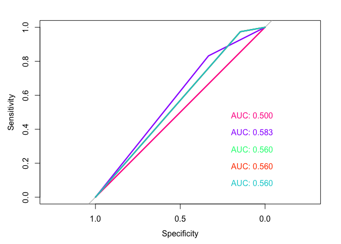

The second model, which is based on depression index score and education, performs the best and has an AUC of 0.583.

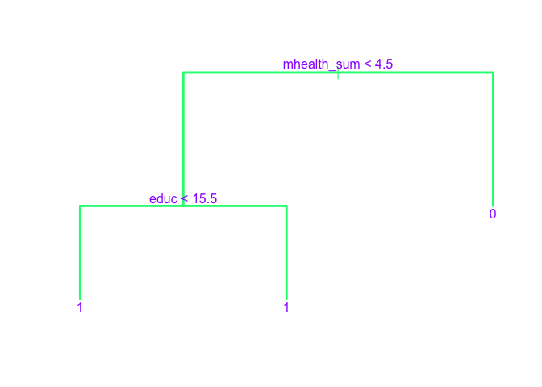

We estimate five SVM models to classify voters and non-voters using the training data and test them with the validation data:

``` r
mh_svm1 = tune(svm, vote96 ~ educ + age + mhealth_sum, data = mh_train70,
          kernel = "linear",
          range = list(cost = c(.001, .01, .1, 1, 5, 10, 100)))

mh_lin1 = mh_svm1$best.model
summary(mh_lin1)
```

    ## 
    ## Call:
    ## best.tune(method = svm, train.x = vote96 ~ educ + age + mhealth_sum, 
    ##     data = mh_train70, ranges = list(cost = c(0.001, 0.01, 0.1, 
    ##         1, 5, 10, 100)), kernel = "linear")
    ## 
    ## 
    ## Parameters:
    ##    SVM-Type:  C-classification 
    ##  SVM-Kernel:  linear 
    ##        cost:  1 
    ##       gamma:  0.333 
    ## 
    ## Number of Support Vectors:  511
    ## 
    ##  ( 255 256 )
    ## 
    ## 
    ## Number of Classes:  2 
    ## 
    ## Levels: 
    ##  0 1

``` r
fitted1 = predict(mh_lin1, mh_test30, decision.values = TRUE) %>%
          attributes


roc_svm1 = roc(mh_test30$vote96, fitted1$decision.values)

auc_svm1 = sum(auc(roc_svm1))
```

``` r
mh_svm2 = tune(svm, vote96 ~ ., data = mh_train70,
          kernel = "linear",
          range = list(cost = c(.001, .01, .1, 1, 5, 10, 100)))

mh_lin2 = mh_svm2$best.model
summary(mh_lin2)
```

    ## 
    ## Call:
    ## best.tune(method = svm, train.x = vote96 ~ ., data = mh_train70, 
    ##     ranges = list(cost = c(0.001, 0.01, 0.1, 1, 5, 10, 100)), 
    ##     kernel = "linear")
    ## 
    ## 
    ## Parameters:
    ##    SVM-Type:  C-classification 
    ##  SVM-Kernel:  linear 
    ##        cost:  10 
    ##       gamma:  0.125 
    ## 
    ## Number of Support Vectors:  507
    ## 
    ##  ( 255 252 )
    ## 
    ## 
    ## Number of Classes:  2 
    ## 
    ## Levels: 
    ##  0 1

``` r
fitted2 = predict(mh_lin2, mh_test30, decision.values = TRUE) %>%
          attributes


roc_svm2 = roc(mh_test30$vote96, fitted2$decision.values)

auc_svm2 = sum(auc(roc_svm2))
```

``` r
mh_svm3 = tune(svm, vote96 ~ age + educ + mhealth_sum, data = mh_train70,
               kernel = "polynomial",
               range = list(cost = c(.001, .01, .1, 1, 5, 10, 100)))

mh_poly1 = mh_svm3$best.model
summary(mh_poly1)
```

    ## 
    ## Call:
    ## best.tune(method = svm, train.x = vote96 ~ age + educ + mhealth_sum, 
    ##     data = mh_train70, ranges = list(cost = c(0.001, 0.01, 0.1, 
    ##         1, 5, 10, 100)), kernel = "polynomial")
    ## 
    ## 
    ## Parameters:
    ##    SVM-Type:  C-classification 
    ##  SVM-Kernel:  polynomial 
    ##        cost:  10 
    ##      degree:  3 
    ##       gamma:  0.333 
    ##      coef.0:  0 
    ## 
    ## Number of Support Vectors:  494
    ## 
    ##  ( 248 246 )
    ## 
    ## 
    ## Number of Classes:  2 
    ## 
    ## Levels: 
    ##  0 1

``` r
fitted3 = predict(mh_poly1, mh_test30, decision.values = TRUE) %>%
          attributes

roc_svm3 = roc(mh_test30$vote96, fitted3$decision.values)

auc_svm3 = sum(auc(roc_svm3))
```

``` r
mh_svm4 = tune(svm, vote96 ~ ., data = mh_train70,
               kernel = "polynomial",
               range = list(cost = c(.001, .01, .1, 1, 5, 10, 100)))

mh_poly2 = mh_svm4$best.model
summary(mh_poly2)
```

    ## 
    ## Call:
    ## best.tune(method = svm, train.x = vote96 ~ ., data = mh_train70, 
    ##     ranges = list(cost = c(0.001, 0.01, 0.1, 1, 5, 10, 100)), 
    ##     kernel = "polynomial")
    ## 
    ## 
    ## Parameters:
    ##    SVM-Type:  C-classification 
    ##  SVM-Kernel:  polynomial 
    ##        cost:  5 
    ##      degree:  3 
    ##       gamma:  0.125 
    ##      coef.0:  0 
    ## 
    ## Number of Support Vectors:  495
    ## 
    ##  ( 258 237 )
    ## 
    ## 
    ## Number of Classes:  2 
    ## 
    ## Levels: 
    ##  0 1

``` r
fitted4 = predict(mh_poly2, mh_test30, decision.values = TRUE) %>%
          attributes

roc_svm4 = roc(mh_test30$vote96, fitted4$decision.values)

auc_svm4 = sum(auc(roc_svm4))
```

``` r
mh_svm5 = tune(svm, vote96 ~ ., data = mh_train70,
               kernel = "radial",
               range = list(cost = c(.001, .01, .1, 1, 5, 10, 100)))

mh_rad = mh_svm5$best.model
summary(mh_rad)
```

    ## 
    ## Call:
    ## best.tune(method = svm, train.x = vote96 ~ ., data = mh_train70, 
    ##     ranges = list(cost = c(0.001, 0.01, 0.1, 1, 5, 10, 100)), 
    ##     kernel = "radial")
    ## 
    ## 
    ## Parameters:
    ##    SVM-Type:  C-classification 
    ##  SVM-Kernel:  radial 
    ##        cost:  5 
    ##       gamma:  0.125 
    ## 
    ## Number of Support Vectors:  494
    ## 
    ##  ( 258 236 )
    ## 
    ## 
    ## Number of Classes:  2 
    ## 
    ## Levels: 
    ##  0 1

``` r
fitted5 = predict(mh_rad, mh_test30, decision.values = TRUE) %>%
          attributes

roc_svm5 = roc(mh_test30$vote96, fitted5$decision.values)

auc_svm5 = sum(auc(roc_svm5))
```

We plot all the ROC curves on one graph to visually assess the effectiveness of the models:

``` r
plot(roc_svm1, print.auc = TRUE, col = "deeppink", print.auc.x = .2)
plot(roc_svm2, print.auc = TRUE, col = "purple1", print.auc.x = .2, print.auc.y = .4, add = TRUE)
plot(roc_svm3, print.auc = TRUE, col = "springgreen1", print.auc.x = .2, print.auc.y = .3, add = TRUE)
plot(roc_svm4, print.auc = TRUE, col = "orangered", print.auc.x = .2, print.auc.y = .2, add = TRUE)
plot(roc_svm5, print.auc = TRUE, col = "darkturquoise", print.auc.x = .2, print.auc.y = .1, add = TRUE)
```

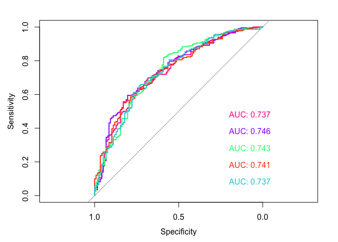

We find that the second model, which is based on a linear kernel using all the predictors in the dataset, has the largest AUC value (0.746) and therefore performs the best:

``` r
plot(mh_svm2)
```

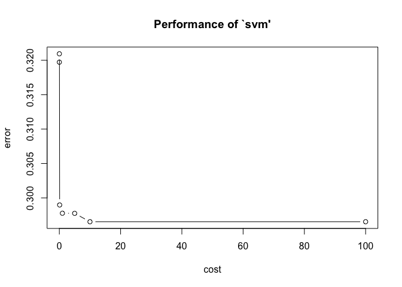

Part 3: OJ Simpson
==================

We begin by reading in the data and dropping those observations that are missing data in the response variable, guilt (for which we also make into a factor and assign labels):

``` r
oj = read.csv('data/simpson.csv')
oj = oj[(!is.na(oj$guilt)), ]
oj$Opinion = factor(oj$guilt, levels = c(0,1), labels = c("Probably not guilty", "Probably guilty"))
```

Next, we plot a bar chart of opinions by whether the respondent is Black:

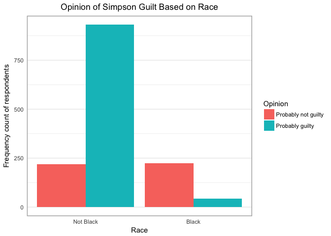

We can clearly see that for Black respondents, the most common opinion by far was that Simpson was probably not guilty; the opposite was true for non-Black respondents.

Using race alone, we develop a logistic regression model to explain the impact of respondent race on opinion of Simpson guilt:

``` r
logit_oj_black = glm(guilt ~ black, family = binomial, data=oj)
summary(logit_oj_black)
```

    ## 
    ## Call:
    ## glm(formula = guilt ~ black, family = binomial, data = oj)
    ## 
    ## Deviance Residuals: 
    ##    Min      1Q  Median      3Q     Max  
    ## -1.823  -0.593   0.649   0.649   1.911  
    ## 
    ## Coefficients:
    ##             Estimate Std. Error z value Pr(>|z|)    
    ## (Intercept)   1.4518     0.0752    19.3   <2e-16 ***
    ## black        -3.1022     0.1827   -17.0   <2e-16 ***
    ## ---
    ## Signif. codes:  0 '***' 0.001 '**' 0.01 '*' 0.05 '.' 0.1 ' ' 1
    ## 
    ## (Dispersion parameter for binomial family taken to be 1)
    ## 
    ##     Null deviance: 1758.1  on 1415  degrees of freedom
    ## Residual deviance: 1352.2  on 1414  degrees of freedom
    ## AIC: 1356
    ## 
    ## Number of Fisher Scoring iterations: 4

``` r
mse_logit_oj_black = mse(logit_oj_black, oj)
```

The coefficient for Black (-3.102) is statistically significant at the p&lt;.001 level, which means that being Black reduces the log-likelihood of holding the opinion that Simpson is probably guilty by 3.102. This indicates that Black respondents are much more likely to opine that Simpson is probably not guilty compared to non-Black respondents.

We generate dataframes for predictions and accuracy:

``` r
int = tidy(logit_oj_black)[1,2]
coeff = tidy(logit_oj_black)[2,2]

oj_black_pred = oj %>%
                add_predictions(logit_oj_black) %>%
                mutate(prob = logit2prob(pred)) %>%
                mutate(odds = prob2odds(prob))

oj_black_accuracy = oj %>%
                    add_predictions(logit_oj_black) %>%
                    mutate(pred = logit2prob(pred),
                    pred = as.numeric(pred > .5))
```

We calculate the accuracy rate of the logistic regression model:

``` r
ar = mean(oj_black_accuracy$guilt == oj_black_accuracy$pred, na.rm = TRUE)

uc = median(oj$guilt)

cm.5_oj_black = confusionMatrix(oj_black_accuracy$pred, oj_black_accuracy$guilt,
                                dnn = c("Prediction", "Actual"), positive = '1')

cm.5_table = cm.5_oj_black$table

tpr.cm.5 = sum(cm.5_oj_black$byClass[1])
tnr.cm.5 = sum(cm.5_oj_black$byClass[2])

roc_oj = roc(as.numeric(oj$guilt), as.numeric(oj_black_pred$pred))

auc_roc_oj = sum(auc(roc_oj))
```

The logistic regression model has an accuracy rate of 0.816, which indicates that the model is robust. The useless classifier (1) predicts an opinion of "probably not guilty" (but that is based on the entire sample, which was mostly composed of non-Black respondents), so our model improves considerably upon the useless-classifier model. The logistic regression model has a true positive rate of 95.585%, which is notably high; the true negative rate (50.679%), however, is disappointingly low. This indicates that the model has high sensitivity but only moderate specificity: it is good at capturing opinions of guilt, but mediocre at capturing opinions of innoncence.

We plot the ROC curve:

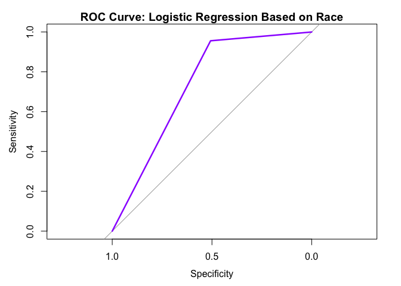

With an AUC of 0.731, we find that the model performs well, especially considering that it uses only one predictor variable.

Next, we develop a model to predict a given respondent's opinion of Simpson's guilt given the predictors in the dataset. We estimate a random forest model with 500 trees:

``` r
oj_data = oj %>%
          select(-guilt) %>%
          mutate_each(funs(as.factor(.)), black, hispanic, female, dem, rep, ind, educ) %>%
          na.omit

m_oj = floor(sqrt(9))

(rf_oj = randomForest(Opinion ~ ., data = oj_data, mtry = m_oj, ntree = 500))
```

    ## 
    ## Call:
    ##  randomForest(formula = Opinion ~ ., data = oj_data, mtry = m_oj,      ntree = 500) 
    ##                Type of random forest: classification
    ##                      Number of trees: 500
    ## No. of variables tried at each split: 3
    ## 
    ##         OOB estimate of  error rate: 18.9%
    ## Confusion matrix:
    ##                     Probably not guilty Probably guilty class.error
    ## Probably not guilty                 228             214      0.4842
    ## Probably guilty                      54             920      0.0554

We plot variable importance for the predictors:

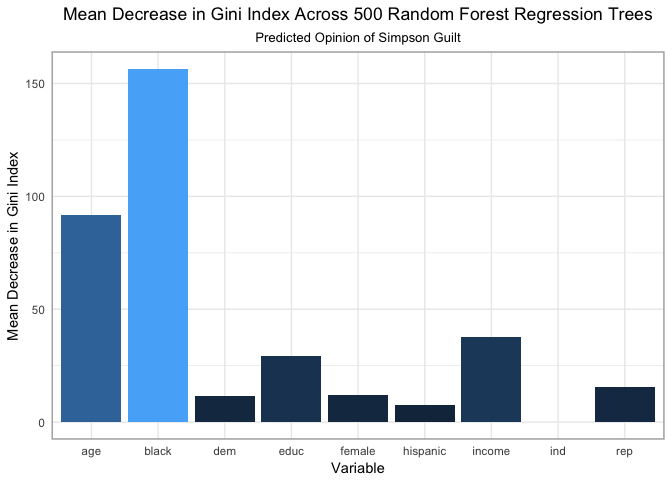

The plot indicates that Black and age produce the largest mean decrease in the Gini index across the 500 random forest trees (each limited to 3 predictors per split); income is a distant third. Independent is the least important variable (unsurprisingly, because there are no respondents in this category).

The model's error rate is 19.1%, which is acceptable for this purpose. This breaks down to a classification error rate of 5.9% (which is quite low) for detecting opinions of guilt and 48.2% (which is quite high) for detecting opinions of innocence.

Given a person's race, ethnicity, gender, income, education, and political affiliation, we can predict their opinion of Simpson's guilt with an accuracy rate of 80.9%. We find that given the relative importance of the outcome variable, this is a robust model that performs well and is not unduly complex.

However, when we compare this to the 81.6% error rate given the simple logistic model, which only includes race, we find that the inclusion of additional predictors does not result in an improvement in predictive power.
