MACS 30100 PS9
================
Erin M. Ochoa
2017 March 15

-   [Setup](#setup)
-   [Attitudes towards feminists](#attitudes-towards-feminists)
    -   [Split the data into a training and test set (70/30%)](#split-the-data-into-a-training-and-test-set-7030)
    -   [Calculate the test MSE for KNN models with *K* = 5, 10, 15, …, 100, using whatever combination of variables you see fit. Which model produces the lowest test MSE?](#calculate-the-test-mse-for-knn-models-with-k-5-10-15-dots-100-using-whatever-combination-of-variables-you-see-fit.-which-model-produces-the-lowest-test-mse)
    -   [Compare the test MSE for the best KNN/wKNN model(s) to the test MSE for the equivalent linear regression, decision tree, boosting, and random forest methods using the same combination of variables as before. Which performs the best? Why do you think this method performed the best, given your knowledge of how it works?](#compare-the-test-mse-for-the-best-knnwknn-models-to-the-test-mse-for-the-equivalent-linear-regression-decision-tree-boosting-and-random-forest-methods-using-the-same-combination-of-variables-as-before.-which-performs-the-best-why-do-you-think-this-method-performed-the-best-given-your-knowledge-of-how-it-works)
-   [Voter turnout and depression](#voter-turnout-and-depression)
    -   [Split the data into a training and test set (70/30).](#split-the-data-into-a-training-and-test-set-7030.)
    -   [Calculate the test error rate for KNN models with *K* = 1, 2, …, 10, using whatever combination of variables you see fit. Which model produces the lowest test MSE?](#calculate-the-test-error-rate-for-knn-models-with-k-12dots10-using-whatever-combination-of-variables-you-see-fit.-which-model-produces-the-lowest-test-mse)
    -   [Calculate the test error rate for weighted KNN models with *K* = 1, 2, …, 10 using the same combination of variables as before. Which model produces the lowest test error rate?](#calculate-the-test-error-rate-for-weighted-knn-models-with-k-12dots10-using-the-same-combination-of-variables-as-before.-which-model-produces-the-lowest-test-error-rate)
    -   [Compare the test error rate for the best KNN/wKNN model(s) to the test error rate for the equivalent logistic regression, decision tree, boosting, random forest, and SVM methods using the same combination of variables as before. Which performs the best? Why do you think this method performed the best, given your knowledge of how it works?](#compare-the-test-error-rate-for-the-best-knnwknn-models-to-the-test-error-rate-for-the-equivalent-logistic-regression-decision-tree-boosting-random-forest-and-svm-methods-using-the-same-combination-of-variables-as-before.-which-performs-the-best-why-do-you-think-this-method-performed-the-best-given-your-knowledge-of-how-it-works)
-   [Colleges](#colleges)
    -   [Perform PCA analysis on the college dataset and plot the first two principal components. Describe the results. What variables appear strongly correlated on the first principal component? What about the second principal component?](#perform-pca-analysis-on-the-college-dataset-and-plot-the-first-two-principal-components.-describe-the-results.-what-variables-appear-strongly-correlated-on-the-first-principal-component-what-about-the-second-principal-component)
-   [Clustering states](#clustering-states)
    -   [Perform PCA on the dataset and plot the observations on the first and second principal components.](#perform-pca-on-the-dataset-and-plot-the-observations-on-the-first-and-second-principal-components.)
    -   [Perform *K*-means clustering with *K* = 2. Plot the observations on the first and second principal components and color-code each state based on their cluster membership. Describe your results.](#perform-k-means-clustering-with-k2.-plot-the-observations-on-the-first-and-second-principal-components-and-color-code-each-state-based-on-their-cluster-membership.-describe-your-results.)
    -   [Perform *K*-means clustering with *K* = 4. Plot the observations on the first and second principal components and color-code each state based on their cluster membership. Describe your results.](#perform-k-means-clustering-with-k4.-plot-the-observations-on-the-first-and-second-principal-components-and-color-code-each-state-based-on-their-cluster-membership.-describe-your-results.)
    -   [Perform *K*-means clustering with *K* = 3. Plot the observations on the first and second principal components and color-code each state based on their cluster membership. Describe your results.](#perform-k-means-clustering-with-k3.-plot-the-observations-on-the-first-and-second-principal-components-and-color-code-each-state-based-on-their-cluster-membership.-describe-your-results.)
    -   [Perform *K*-means clustering with *K* = 3 on the first two principal components score vectors, rather than the raw data. Describe your results and compare them to the clustering results with *K* = 3 based on the raw data.](#perform-k-means-clustering-with-k3-on-the-first-two-principal-components-score-vectors-rather-than-the-raw-data.-describe-your-results-and-compare-them-to-the-clustering-results-with-k3-based-on-the-raw-data.)
    -   [Using hierarchical clustering with complete linkage and Euclidean distance, cluster the states.](#using-hierarchical-clustering-with-complete-linkage-and-euclidean-distance-cluster-the-states.)
    -   [Cut the dendrogram at a height that results in three distinct clusters. Which states belong to which clusters?](#cut-the-dendrogram-at-a-height-that-results-in-three-distinct-clusters.-which-states-belong-to-which-clusters)
    -   [Hierarchically cluster the states using complete linkage and Euclidean distance, after scaling the variables to have standard deviation 1. What effect does scaling the variables have on the hierarchical clustering obtained? In your opinion, should the variables be scaled before the inter-observation dissimilarities are computed? Provide a justification for your answer.](#hierarchically-cluster-the-states-using-complete-linkage-and-euclidean-distance-after-scaling-the-variables-to-have-standard-deviation-1.-what-effect-does-scaling-the-variables-have-on-the-hierarchical-clustering-obtained-in-your-opinion-should-the-variables-be-scaled-before-the-inter-observation-dissimilarities-are-computed-provide-a-justification-for-your-answer.)

Setup
=====

``` r
knitr::opts_chunk$set(
    message = FALSE,
    warning = FALSE,
    cache = TRUE
)
library(ggdendro)
library(randomForest)
```

    ## randomForest 4.6-12

    ## Type rfNews() to see new features/changes/bug fixes.

``` r
library(tidyverse)
```

    ## Loading tidyverse: ggplot2
    ## Loading tidyverse: tibble
    ## Loading tidyverse: tidyr
    ## Loading tidyverse: readr
    ## Loading tidyverse: purrr
    ## Loading tidyverse: dplyr

    ## Conflicts with tidy packages ----------------------------------------------

    ## combine(): dplyr, randomForest
    ## filter():  dplyr, stats
    ## lag():     dplyr, stats
    ## margin():  ggplot2, randomForest

``` r
library(forcats)
library(broom)
library(modelr)
```

    ## 
    ## Attaching package: 'modelr'

    ## The following object is masked from 'package:broom':
    ## 
    ##     bootstrap

``` r
library(stringr)
library(grid)
library(gridExtra)
```

    ## 
    ## Attaching package: 'gridExtra'

    ## The following object is masked from 'package:dplyr':
    ## 
    ##     combine

    ## The following object is masked from 'package:randomForest':
    ## 
    ##     combine

``` r
#library(rcfss)   #not available for this version of R
library(tree)
library(e1071)
library(gbm)
```

    ## Loading required package: survival

    ## Loading required package: lattice

    ## Loading required package: splines

    ## Loading required package: parallel

    ## Loaded gbm 2.1.1

``` r
library(pander)
library(knitr)
library(FNN)
library(kknn)
library(pROC)
```

    ## Type 'citation("pROC")' for a citation.

    ## 
    ## Attaching package: 'pROC'

    ## The following objects are masked from 'package:stats':
    ## 
    ##     cov, smooth, var

``` r
library(ISLR)

options(digits = 3)
set.seed(1234)
theme_set(theme_minimal())
```

``` r
mse = function(model, data) {
  x = modelr:::residuals(model, data)
  mean(x ^ 2, na.rm = TRUE)
}

# There seems to be a bug in the gbm function.
# Work-around method found here: http://www.samuelbosch.com/2015/09/workaround-ntrees-is-missing-in-r.html

predict.gbm = function (object, newdata, n.trees, type = "link", single.tree = FALSE, ...) {
  if (missing(n.trees)) {
    if (object$train.fraction < 1) {
      n.trees = gbm.perf(object, method = "test", plot.it = FALSE)
    }
    else if (!is.null(object$cv.error)) {
      n.trees = gbm.perf(object, method = "cv", plot.it = FALSE)
    }
    else {
      n.trees = length(object$train.error)
    }
    cat(paste("Using", n.trees, "trees...\n"))
    gbm::predict.gbm(object, newdata, n.trees, type, single.tree, ...)
  }
}

logit2prob = function(x){
  exp(x) / (1 + exp(x))
}
```

Attitudes towards feminists
===========================

#### Split the data into a training and test set (70/30%)

We read in the data:

``` r
fem = read.csv('data/feminist.csv')
```

Next, we split the dataset into training and validation sets in a ratio of 7:3:

``` r
set.seed(1234)

fem_split7030 = resample_partition(fem, c(test = 0.3, train = 0.7))
fem_train70 = fem_split7030$train %>%
              tbl_df()
fem_test30 = fem_split7030$test %>%
             tbl_df()
```

#### Calculate the test MSE for KNN models with *K* = 5, 10, 15, …, 100, using whatever combination of variables you see fit. Which model produces the lowest test MSE?

Using female, education, income, Democrat, and Republican, we calculate the test MSE for KNN models with K ranging from \[5,100\] in 5-point increments:

``` r
fem_knn = data_frame(k = seq(5, 100, by = 5), 
                     knn = map(k, ~ knn.reg(select(fem_train70, -feminist, -age),
                                            y = fem_train70$feminist,
                                            test = select(fem_test30, -feminist, -age), k = .)), 
                     mse = map_dbl(knn, ~ mean((fem_test30$feminist - .$pred)^2))) 
```

The models with K=35, K=40, and K=50 produce the lowest MSE (440.547). Next, we plot the MSE for each model:

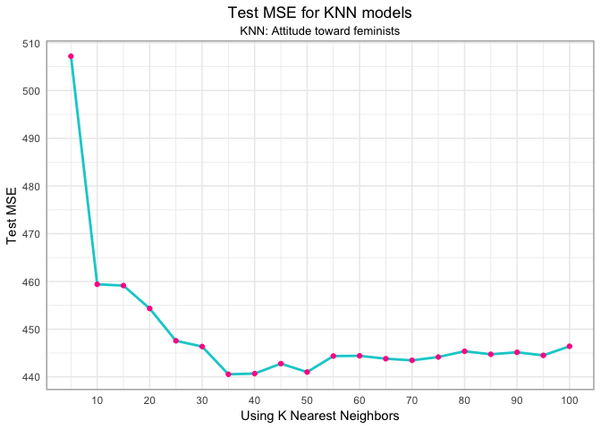 \#\#\#\# Calculate the test MSE for weighted KNN models with K = 5, 10, 15, , 100 using the same combination of variables as before. Which model produces the lowest test MSE?

``` r
fem_w_knn = data_frame(k = seq(5, 100, by = 5), 
                       wknn = map(k, ~ kknn(feminist ~ female + educ + income + dem + rep,
                                            train = fem_train70, test = fem_test30, k = .)), 
                       mse_wknn = map_dbl(wknn, ~ mean((fem_test30$feminist - .$fitted.values)^2))) %>%
            left_join(fem_knn, by = "k") %>%
            mutate(fem_knn = mse)%>%
            select(k, fem_knn, mse_wknn) %>%
            gather(method, mse, -k) %>%
            mutate(method = str_replace(method, "mse_", ""))%>%
            mutate(Method = factor(method, levels = c("fem_knn","wknn"), labels = c("KNN","Weighted KNN")))
```

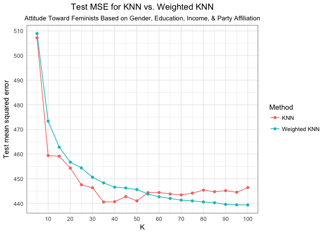

Weighted KNN produces the lowest MSE, just below 440 for 90 &lt; K &lt;= 100.

#### Compare the test MSE for the best KNN/wKNN model(s) to the test MSE for the equivalent linear regression, decision tree, boosting, and random forest methods using the same combination of variables as before. Which performs the best? Why do you think this method performed the best, given your knowledge of how it works?

``` r
lm_fem = lm(feminist ~ female + educ + income + dem + rep, data=fem_train70)
mse_lm_fem = mse(lm_fem, fem_test30)
```

``` r
fem_tree = tree(feminist ~ female + educ + income + dem + rep, data = fem_train70)
mse_fem_tree = mse(fem_tree,fem_test30)
```

``` r
set.seed(1234)
fem_boost_mdls = list("boosting_depth1" = gbm(as.numeric(feminist) - 1 ~ female + educ + income + dem + rep,
                                              data = fem_train70,
                                              n.trees = 10000, interaction.depth = 1),
                      "boosting_depth2" = gbm(as.numeric(feminist) - 1 ~ female + educ + income + dem + rep,
                                              data = fem_train70,
                                              n.trees = 10000, interaction.depth = 2),
                      "boosting_depth4" = gbm(as.numeric(feminist) - 1 ~ female + educ + income + dem + rep,
                                              data = fem_train70,
                                              n.trees = 10000, interaction.depth = 4))
```

    ## Distribution not specified, assuming gaussian ...
    ## Distribution not specified, assuming gaussian ...
    ## Distribution not specified, assuming gaussian ...

``` r
set.seed(1234)
data_frame(depth = c(1, 2, 4),
           model = fem_boost_mdls[c("boosting_depth1", "boosting_depth2", "boosting_depth4")],
           optimal = map_dbl(model, gbm.perf, plot.it = FALSE)) %>%
           select(-model) %>%
           knitr::kable(caption = "Optimal number of boosting iterations",
                        col.names = c("Depth", "Optimal number of iterations"))
```

    ## Using OOB method...
    ## Using OOB method...
    ## Using OOB method...

|  Depth|  Optimal number of iterations|
|------:|-----------------------------:|
|      1|                          2558|
|      2|                          1850|
|      4|                          1400|

``` r
set.seed(1234)

fem_boost1 = gbm(as.numeric(feminist) - 1 ~ female + educ + income + dem + rep, data = fem_train70,
                 n.trees = 2558, interaction.depth = 1)
```

    ## Distribution not specified, assuming gaussian ...

``` r
fem_boost2 = gbm(as.numeric(feminist) - 1 ~ female + educ + income + dem + rep, data = fem_train70,
                 n.trees = 1850, interaction.depth = 2)
```

    ## Distribution not specified, assuming gaussian ...

``` r
fem_boost4 = gbm(as.numeric(feminist) - 1 ~ female + educ + income + dem + rep, data = fem_train70,
                 n.trees = 1400, interaction.depth = 4)
```

    ## Distribution not specified, assuming gaussian ...

``` r
mse_fem_boost1 = mse(fem_boost1,fem_test30)
```

    ## Using 2558 trees...

``` r
mse_fem_boost2 = mse(fem_boost2,fem_test30)
```

    ## Using 1850 trees...

``` r
mse_fem_boost4 = mse(fem_boost4,fem_test30)
```

    ## Using 1400 trees...

``` r
set.seed(1234)

m = floor(sqrt(5))

(fem_rf = randomForest(feminist ~ female + educ + income + dem + rep, data = fem_train70, mtry = m,
                        ntree = 500))
```

    ## 
    ## Call:
    ##  randomForest(formula = feminist ~ female + educ + income + dem +      rep, data = fem_train70, mtry = m, ntree = 500) 
    ##                Type of random forest: regression
    ##                      Number of trees: 500
    ## No. of variables tried at each split: 2
    ## 
    ##           Mean of squared residuals: 434
    ##                     % Var explained: 6.22

``` r
mse_fem_rf = mse(fem_rf, fem_test30)
```

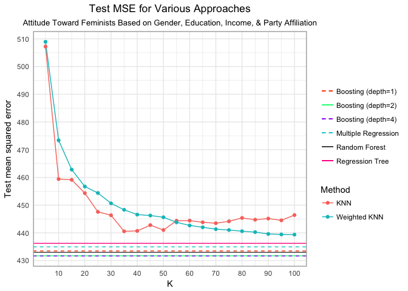

Boosting with a depth of 4 produces the lowest MSE (431.643). This is because this boosted model relies on trees with four splits, representing the complex relationship between the predictor variables and the outcome.

Voter turnout and depression
============================

#### Split the data into a training and test set (70/30).

``` r
mh = read_csv('data/mental_health.csv')

mh = mh %>%
     select(vote96, age, inc10, educ, mhealth_sum)%>%
     na.omit()

set.seed(1234)
mh_split7030 = resample_partition(mh, c(test = 0.3, train = 0.7))
mh_train70 = as_tibble(mh_split7030$train)
mh_test30 = as_tibble(mh_split7030$test)
```

#### Calculate the test error rate for KNN models with *K* = 1, 2, …, 10, using whatever combination of variables you see fit. Which model produces the lowest test MSE?

``` r
mh_knn = data_frame(k = 1:10,
                    knn_train = map(k, ~ class::knn(select(mh_train70, -vote96),
                                                test = select(mh_train70, -vote96),
                                                cl = mh_train70$vote96, k = .)),
                    knn_test = map(k, ~ class::knn(select(mh_test30, -vote96),
                                               test = select(mh_test30, -vote96),
                                               cl = mh_test30$vote96, k = .)),
                    mse_train = map_dbl(knn_train, ~ mean(mh_test30$vote96 != .)),
                    mse_test = map_dbl(knn_test, ~ mean(mh_test30$vote96 != .)))

ggplot(mh_knn, aes(k, mse_test)) + 
  geom_line(color='deeppink',size=1.5) +
  geom_point(color='darkturquoise', size=2) +
  labs(x = "K Nearest Neighbors",
       y = "MSE",
       title = "MSE for K Nearest Neigbors",
       subtitle = "Voting Behavior (1996) Based on Age, Income, Education, & Depression Index Score") +
       theme(plot.title = element_text(hjust = 0.5), plot.subtitle = element_text(hjust = 0.5),
             panel.border = element_rect(linetype = "solid", color = "grey70", fill=NA, size=1.1)) +
       scale_x_continuous(breaks = seq(0,10,by=2)) +
       scale_y_continuous(breaks = seq(0,.3,by=.05))
```

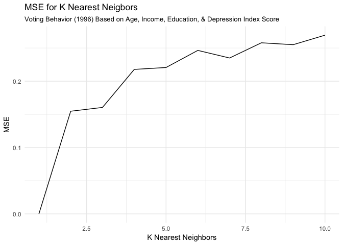

The K=1 model produces the lowest MSE (0). This is because, of course, for each observation, its nearest neighbor is itself. The next lowest MSE is 0.166, for K=3.

#### Calculate the test error rate for weighted KNN models with *K* = 1, 2, …, 10 using the same combination of variables as before. Which model produces the lowest test error rate?

``` r
set.seed(1234)
mh_wknn = data_frame(k = 1:10,
                     wknn = map(k, ~ kknn(vote96 ~., train = mh_train70, test = mh_test30, k =.)),
                     mse_test_wknn = map_dbl(wknn, ~ mean(mh_test30$vote96 != as.numeric(.$fitted.values > 0.5))))

mse_wknn_mh = min(mh_wknn$mse_test_wknn)

mh_wknn_error = mh_wknn %>%
                left_join(mh_knn, by = as.factor("k")) %>%
                select(k, mse_test_wknn, mse_test) %>%
                gather(method, mse, -k) %>%
                mutate(Method = factor(method, levels =c("mse_test_wknn","mse_test"), labels = c("Weighted KNN","KNN")))

ggplot(mh_wknn_error,aes(k, mse, color = Method)) +
       geom_line() +
       geom_point() +
       labs(title = "MSE for KNN and Weighted KNN",
       subtitle = "Voting Behavior (1996) Based on Age, Income, Education, & Depression Index Score",
       x = "K",
       y = "MSE") +
       theme(plot.title = element_text(hjust = 0.5), plot.subtitle = element_text(hjust = 0.5),
             panel.border = element_rect(linetype = "solid", color = "grey70", fill=NA, size=1.1)) +
       scale_x_continuous(breaks = seq(0,10,by=2)) +
       scale_y_continuous(breaks = seq(0,.3,by=.05))
```

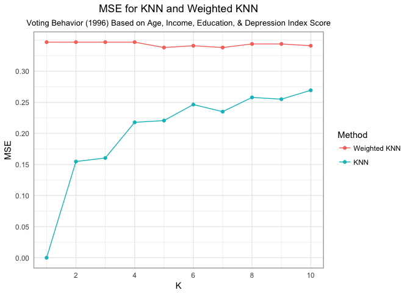

Again, the model with the lowest MSE is the K=1 model with an MSE of 0.0, but this is the trivial case. The useful model with the lowest MSE is the KNN model with K=3, with an MSE of 0.166

#### Compare the test error rate for the best KNN/wKNN model(s) to the test error rate for the equivalent logistic regression, decision tree, boosting, random forest, and SVM methods using the same combination of variables as before. Which performs the best? Why do you think this method performed the best, given your knowledge of how it works?

``` r
logit_voted_all = glm(vote96 ~ age + inc10 + educ + mhealth_sum, data = mh_train70, family = binomial) 


voted_all_accuracy = mh_test30 %>%
                     add_predictions(logit_voted_all) %>%
                     mutate(pred = logit2prob(pred),
                            pred = as.numeric(pred > .5))

logit_mh_error = mean(voted_all_accuracy$vote96 != voted_all_accuracy$pred)
```

``` r
mh_tree = tree(vote96 ~ age + inc10 + educ + mhealth_sum, data = mh_train70)
tree_data = dendro_data(mh_tree)

mse_mh_tree = mse(mh_tree,mh_test30)
```

``` r
mh_rf = randomForest(vote96 ~ age + inc10 + educ + mhealth_sum , data = mh_train70, ntree = 500)

mse_mh_rf = mse(mh_rf, mh_test30)
```

``` r
mh_svm2 = tune(svm, vote96 ~ ., data = mh_train70,
          kernel = "linear",
          range = list(cost = c(.001, .01, .1, 1, 5, 10, 100)))

mh_lin2 = mh_svm2$best.model

mse_mh_svm = mse(mh_lin2,mh_test30)
```

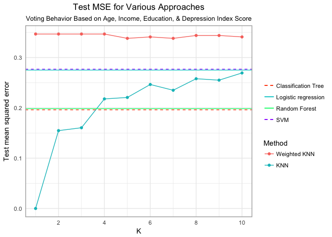

Again, the model with the lowest MSE is the trivial KNN model with K=1 (and an MSE of 0). This is because in the model, each observation is its own closest neighbor. The second-best model is the KNN model with K=3 and an MSE of 0.166.

Colleges
========

#### Perform PCA analysis on the college dataset and plot the first two principal components. Describe the results. What variables appear strongly correlated on the first principal component? What about the second principal component?

We assign the dataframe (imported via the ISLR library) to a new object and recode the Private variable to be numeric:

``` r
college = College
college$Private = as.numeric(college$Private)
```

Next, we perform principal component analysis and view the loadings for the first two components:

``` r
college_pca = prcomp(college, scale = TRUE)
college_pca_1_2 = as.data.frame(college_pca$rotation)[1:2]
college_pca_1_2
```

    ##                 PC1     PC2
    ## Private     -0.0890  0.3459
    ## Apps        -0.1996 -0.3436
    ## Accept      -0.1538 -0.3726
    ## Enroll      -0.1178 -0.3997
    ## Top10perc   -0.3603  0.0162
    ## Top25perc   -0.3448 -0.0177
    ## F.Undergrad -0.0941 -0.4107
    ## P.Undergrad  0.0175 -0.2931
    ## Outstate    -0.3277  0.1915
    ## Room.Board  -0.2665  0.0940
    ## Books       -0.0572 -0.0573
    ## Personal     0.0719 -0.1928
    ## PhD         -0.3033 -0.1162
    ## Terminal    -0.3039 -0.1042
    ## S.F.Ratio    0.2103 -0.2044
    ## perc.alumni -0.2367  0.1941
    ## Expend      -0.3330  0.0703
    ## Grad.Rate   -0.2731  0.1178

For the first component, Top10perc and Top25perc load very negatively, suggesting that schools with high scores for PC1 will have low proportions of students in the top 10% or top 25% of their high-school classes. Similarly, Outstate, Expend, PhD, and Terminal also load very negatively, indicating that schools with high scores for PC1 will have high proportions of in-state students, low per-student expenditure, and low proportions of faculty with PhDs or terminal degrees.

For the second component, F.Undergrad loads highly negatively, suggesting that schools with high scores for PC2 will have low enrollment of full-time undergraduates. Private loads positively, suggesting that schools with high scores for this component will tend to be private. Enroll, Accept, and Apps load very negatively; schools with high scores for PC2 should enroll few new students, accept few applications, and receive few applications.

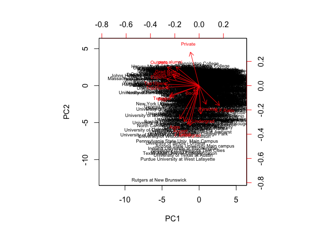

Clustering states
=================

The `USArrests` dataset contains 50 observations (one for each state) from 1973 with variables on crime statistics:

-   `Murder` - Murder arrests (per 100,000)
-   `Assault` - Assault arrests (per 100,000)
-   `Rape` - Rape arrests (per 100,000)
-   `UrbanPop` - Percent urban population

#### Perform PCA on the dataset and plot the observations on the first and second principal components.

``` r
arrests = read_csv("data/USArrests.csv")
```

We perform PCA on the dataset and review the loadings for the first two components:

``` r
state_name = arrests$State
arrests_df = arrests[c("Murder", "Assault", "UrbanPop", "Rape")]
arrests_pca = prcomp(arrests_df, scale = TRUE)
arrests_pca_1_2 = as.data.frame(arrests_pca$rotation)[1:2]
arrests_pca_1_2
```

    ##             PC1    PC2
    ## Murder   -0.536  0.418
    ## Assault  -0.583  0.188
    ## UrbanPop -0.278 -0.873
    ## Rape     -0.543 -0.167

Next, we review the biplot for the first two components: 

#### Perform *K*-means clustering with *K* = 2. Plot the observations on the first and second principal components and color-code each state based on their cluster membership. Describe your results.

``` r
set.seed(1234)
arrests_kmeans_2 = kmeans(arrests_df, 2, nstart = 20)

arrests_PC1 = as.data.frame(arrests_pca$x)$PC1
arrests_PC2 = as.data.frame(arrests_pca$x)$PC2

Cluster = as.factor(arrests_kmeans_2$cluster)
arrests_pca_name = data.frame(x=arrests_PC1, y=arrests_PC2, name=state_name)
ggplot(arrests_pca_name, aes(x, y, label=name, color=Cluster)) +
       geom_text() + labs(x="PC1", y="PC2",title = "States in 2 Clusters, plotted by PC2 vs. PC1 score") +
       theme(plot.title = element_text(hjust = 0.5), plot.subtitle = element_text(hjust = 0.5),
             panel.border = element_rect(linetype = "solid", color = "grey70", fill=NA, size=1.1))
```

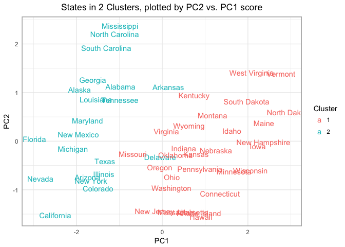

The clusters seem reasonable, with the exceptions of Missouri and Delaware, and perhaps Arkansas.

#### Perform *K*-means clustering with *K* = 4. Plot the observations on the first and second principal components and color-code each state based on their cluster membership. Describe your results.

``` r
set.seed(1234)
arrests_kmeans_4 = kmeans(arrests_df, 4, nstart = 20)

Cluster = as.factor(arrests_kmeans_4$cluster)

ggplot(arrests_pca_name, aes(x, y, label=name, color=Cluster)) +
       geom_text() + labs(x="PC1", y="PC2",title = "States in 4 Clusters, plotted by PC2 vs. PC1 score") +
       theme(plot.title = element_text(hjust = 0.5), plot.subtitle = element_text(hjust = 0.5),
             panel.border = element_rect(linetype = "solid", color = "grey70", fill=NA, size=1.1))
```

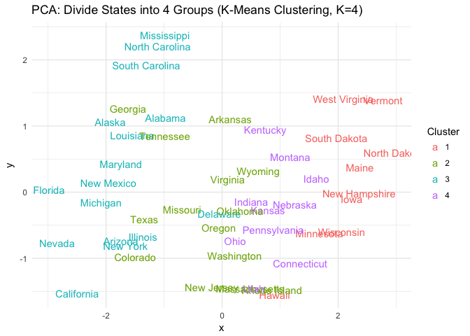

These clusters are not intuititive; there is a lot of overlap between clusters 2 & 3 and clusters 2 & 4. Delaware seems misclassified, as do Georgia, Tennessee, Colorado, Texas, Hawaii, and others.

#### Perform *K*-means clustering with *K* = 3. Plot the observations on the first and second principal components and color-code each state based on their cluster membership. Describe your results.

``` r
set.seed(1234)
arrests_kmeans_3 = kmeans(arrests_df, 3, nstart = 20)

Cluster = as.factor(arrests_kmeans_3$cluster)

ggplot(arrests_pca_name, aes(x, y, label=name, color=Cluster)) +
       geom_text() + labs(x="PC1", y="PC2",title = "States in 3 Clusters, plotted by PC2 vs. PC1 score") +
       theme(plot.title = element_text(hjust = 0.5), plot.subtitle = element_text(hjust = 0.5),
             panel.border = element_rect(linetype = "solid", color = "grey70", fill=NA, size=1.1))
```

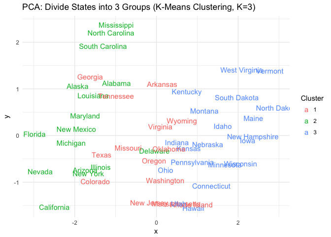

These clusters are not much better than the K=4 clusters; there is a lot of overlap and the divisions are not clear.

#### Perform *K*-means clustering with *K* = 3 on the first two principal components score vectors, rather than the raw data. Describe your results and compare them to the clustering results with *K* = 3 based on the raw data.

``` r
set.seed(1234)
arrests_pca_1_2 = data.frame(v1 = arrests_PC1, v2 = arrests_PC2)
arrests_kmeans_pca3 = kmeans(arrests_pca_1_2, 3, nstart = 20)
Cluster = as.factor(arrests_kmeans_pca3$cluster)

ggplot(arrests_pca_name, aes(x, y, label=name, color=Cluster)) + geom_point(aes(color=Cluster, alpha=.5)) +
       geom_text() + labs(x="PC1", y="PC2",title = "States in 3 Clusters based on PC1 & PC2, plotted by PC2 vs. PC1 score") +
       theme(plot.title = element_text(hjust = 0.5), plot.subtitle = element_text(hjust = 0.5),
             panel.border = element_rect(linetype = "solid", color = "grey70", fill=NA, size=1.1))
```

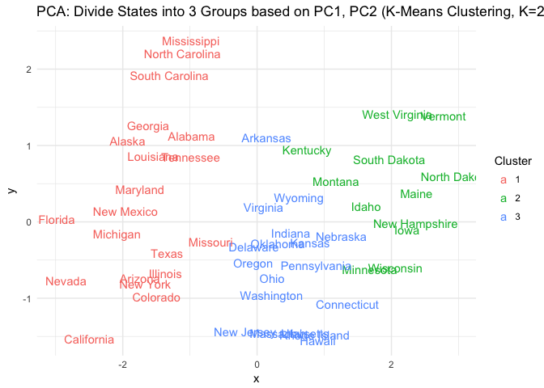

These clusters are very clear compared to the K=3 and K=4 plots shown earlier. The boundaries seemed a little fuzzy until we added points, which make the state names less readable, but the boundaries between clusters clearer. These are the best clusters we've seen so far.

#### Using hierarchical clustering with complete linkage and Euclidean distance, cluster the states.

``` r
arrests_hierarchical = hclust(dist(arrests_df), method = 'complete')

ggdendrogram(arrests_hierarchical) + labs(title = "Arrests:  Hierarchical Clustering")
```

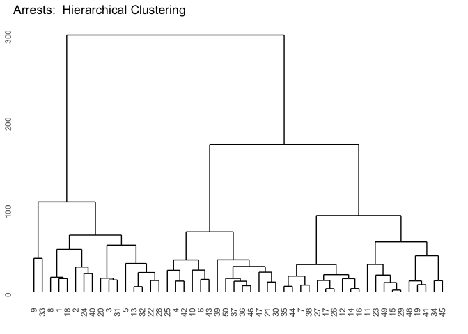

#### Cut the dendrogram at a height that results in three distinct clusters. Which states belong to which clusters?

``` r
hcdata = dendro_data(arrests_hierarchical)
hclabs = label(hcdata) %>%
         left_join(data_frame(label = as.factor(seq.int(nrow(arrests_df))),
                   cluster = as.factor(cutree(arrests_hierarchical, h = 150))))

ggdendrogram(arrests_hierarchical) +
             geom_text(data = hclabs,
             aes(label = state_name, x = x, y = 0, color = cluster),
                 vjust = .5, hjust = 0, angle = 90) +
             geom_hline(yintercept = 150, linetype = 4, color = 'deeppink', size=2) +
             theme(axis.text.x = element_blank(),
             legend.position = "none")
```

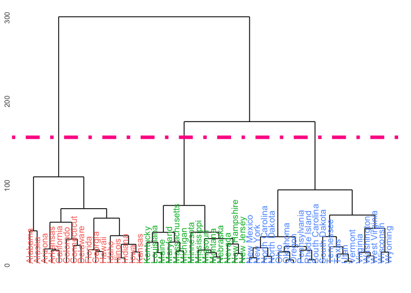

The plot shows which states are in which clusters.

#### Hierarchically cluster the states using complete linkage and Euclidean distance, after scaling the variables to have standard deviation 1. What effect does scaling the variables have on the hierarchical clustering obtained? In your opinion, should the variables be scaled before the inter-observation dissimilarities are computed? Provide a justification for your answer.

``` r
scaled_arrests = scale(arrests_df)
arrests_hierarchical_scaled = hclust(dist(scaled_arrests), method = "complete")

ggdendrogram(arrests_hierarchical_scaled) + geom_text(data = hclabs,color='deeppink',
             aes(label = state_name, x = x, y = 0),
                 vjust = .5, hjust = 0, angle = 90) +
            labs(title = 'Arrests:  Hierarchical Clustering, Standardized')
```

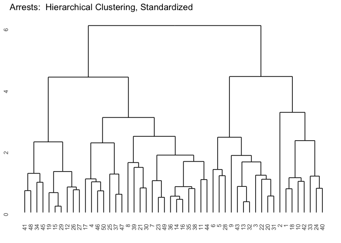

We can't cut this tree into three clusters; we can cut it into two or four clusters, but not three. This changes the distribution of states across clusters.

Based on K-means clustering using PC1 & PC2, we found that the states clustered very well into three groups. Given that result, it seems like the better approach here is to not scale the data before applying hierarchical clustering. However, we do not wish to proclaim that one should never take such an approach.
