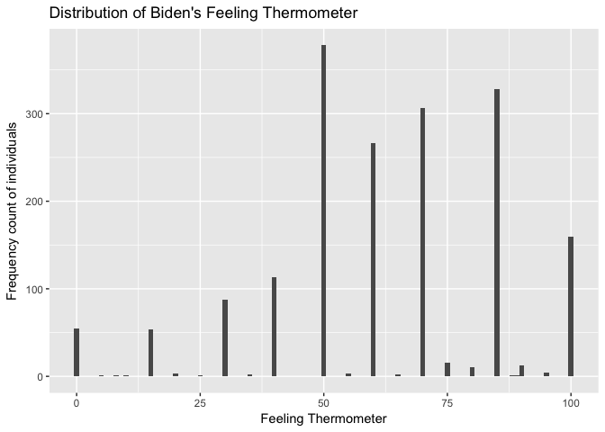
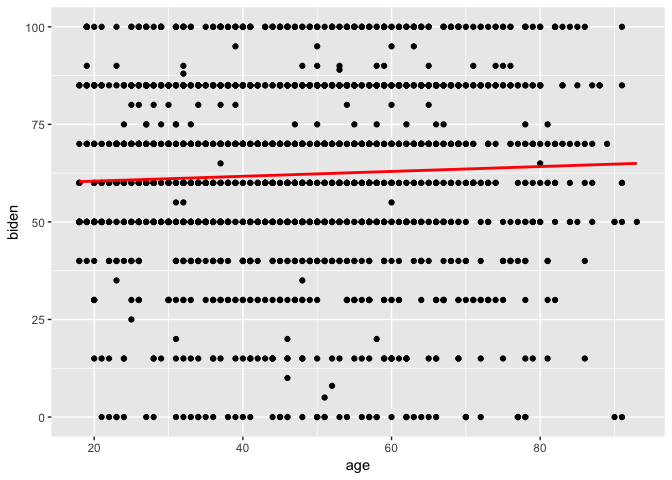
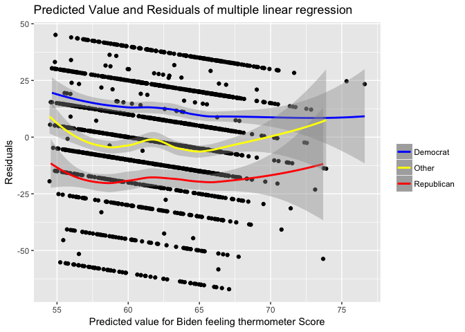
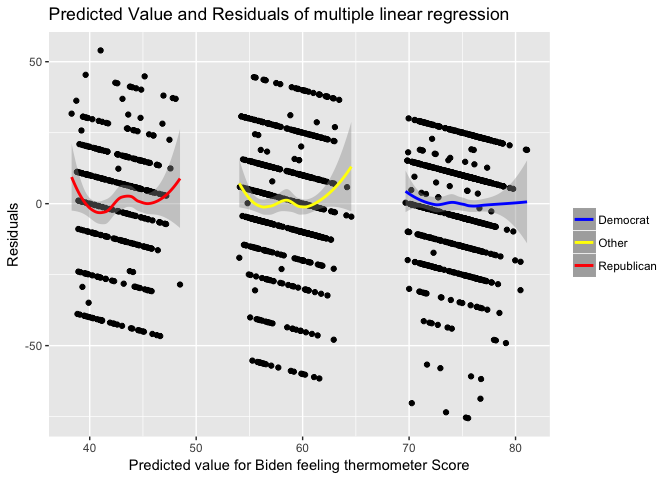

Problem set 5\#Xuancheng Qian
================
Xuancheng Qian
2/12/2017

-   [Describe the data (1 point)](#describe-the-data-1-point)
-   [Simple linear regression (2 points)](#simple-linear-regression-2-points)
-   [Multiple linear regression (2 points)](#multiple-linear-regression-2-points)
-   [Multiple linear regression model (with even more variables!) (3 points)](#multiple-linear-regression-model-with-even-more-variables-3-points)
-   [Interactive linear regression model (2 points)](#interactive-linear-regression-model-2-points)

``` r
library(dplyr)
library(ggplot2)
library(tidyr)
library(modelr)
library(broom)
options(na.action = na.warn)
set.seed(1234)
```

``` r
#import data set
df = read.csv('data/biden.csv')
str(df)
```

    ## 'data.frame':    1807 obs. of  6 variables:
    ##  $ biden : int  90 70 60 50 60 85 60 50 50 70 ...
    ##  $ female: int  0 1 0 1 1 1 1 0 1 0 ...
    ##  $ age   : int  19 51 27 43 38 27 28 31 32 51 ...
    ##  $ educ  : int  12 14 14 14 14 16 12 15 13 14 ...
    ##  $ dem   : int  1 1 0 1 0 1 0 1 0 1 ...
    ##  $ rep   : int  0 0 0 0 1 0 0 0 0 0 ...

Describe the data (1 point)
===========================

Plot a histogram of `biden` with a binwidth of `1`. Make sure to give the graph a title and proper *x* and *y*-axis labels. In a few sentences, describe any interesting features of the graph.



-   From the plot, we can see that the majority of our survey respondents would have higher feeling thermometer scores (greater than 50) towards Joe Biden. And the highest frequency count appears in the score of 50, which indicates that the largest group of respondents feel neutral towards Joe Biden. What's more, we can see that there are nearly 55 people have zero scores in feeling thermometer toward Joe Biden.

Simple linear regression (2 points)
===================================

Estimate the following linear regression:

*Y* = *β*<sub>0</sub> + *β*<sub>1</sub>*X*<sub>1</sub>

where *Y* is the Joe Biden feeling thermometer and *X*<sub>1</sub> is age. Report the parameters and standard errors.

    ## 
    ## Call:
    ## lm(formula = biden ~ age, data = df)
    ## 
    ## Residuals:
    ##     Min      1Q  Median      3Q     Max 
    ## -64.876 -12.318  -1.257  21.684  39.617 
    ## 
    ## Coefficients:
    ##             Estimate Std. Error t value Pr(>|t|)    
    ## (Intercept) 59.19736    1.64792   35.92   <2e-16 ***
    ## age          0.06241    0.03267    1.91   0.0563 .  
    ## ---
    ## Signif. codes:  0 '***' 0.001 '**' 0.01 '*' 0.05 '.' 0.1 ' ' 1
    ## 
    ## Residual standard error: 23.44 on 1805 degrees of freedom
    ## Multiple R-squared:  0.002018,   Adjusted R-squared:  0.001465 
    ## F-statistic: 3.649 on 1 and 1805 DF,  p-value: 0.05626

    ## 'data.frame':    2 obs. of  5 variables:
    ##  $ term     : chr  "(Intercept)" "age"
    ##  $ estimate : num  59.1974 0.0624
    ##  $ std.error: num  1.6479 0.0327
    ##  $ statistic: num  35.92 1.91
    ##  $ p.value  : num  1.15e-213 5.63e-02

-   (1). We can say that there is a relationship between age (predictor) and Joe Biden feeling thermometer (response) as the coefficient is statistically significant under significance level is 0.1. The smaller p-value 0.0563 indicates that null hypothesis (no relationship) is unlikely to be true.
-   (2). Generally speaking, we define our significance level to be 0.05. Thus this p-value 0.0563 actually shows that this relationship is not very strong or statistically significant under *α* = 0.05.
-   (3). The relationship between age and feeling thermometer is positive as the coefficient is 0.06241, which indicates one increase in age would lead to average increase of 0.06241 in feeling thermometer.
-   (4). The R-squared value is 0.002018, and the adjusted R-squared value is 0.001465. This means only 0.2% of variation is explained in this model. With this value and together with plot, we can say that this simple linear regression model with age alone is not a good model and does not fit the data well.

<!-- -->

    ##   age .fitted   .se.fit     ymin     ymax
    ## 1  45 62.0056 0.5577123 60.91248 63.09872

-   (5). In this model, the predicted `biden` associated with an age of 45 is 62.0056. And the associated 95% confidence interval is (60.91248, 63.09872).



-   (6). Plot the response and predictor. Draw the least squares regression line.

Multiple linear regression (2 points)
=====================================

It is unlikely `age` alone shapes attitudes towards Joe Biden. Estimate the following linear regression:

*Y* = *β*<sub>0</sub> + *β*<sub>1</sub>*X*<sub>1</sub> + *β*<sub>2</sub>*X*<sub>2</sub> + *β*<sub>3</sub>*X*<sub>3</sub>

where *Y* is the Joe Biden feeling thermometer, *X*<sub>1</sub> is age, *X*<sub>2</sub> is gender, and *X*<sub>3</sub> is education. Report the parameters and standard errors.

    ##          term    estimate  std.error statistic      p.value
    ## 1 (Intercept) 68.62101396 3.59600465 19.082571 4.337464e-74
    ## 2         age  0.04187919 0.03248579  1.289154 1.975099e-01
    ## 3      female  6.19606946 1.09669702  5.649755 1.863612e-08
    ## 4        educ -0.88871263 0.22469183 -3.955251 7.941295e-05

-   (1). In this model, we can say that both gender and education level have a statistically significant relationship with the response, feeling thermometer due to the p-values are both smaller than 0.001. However, the age does not have a statistically significant relationship with the response since its p-value is 0.198.
-   (2). Controlling for age and education level, being female respondent leads to an average increase in feeling thermometer towards Joe Biden by 6.19607.

<!-- -->

    ## [1] 0.02722727

    ## [1] 0.02560868

-   (3). The *R*<sup>2</sup> of this model is 0.0272, which indicates that age, gender, education level explain 2.72% of the variation in `biden`. And the adjusted *R*<sup>2</sup> is 0.0256. So this model is better than age-only model.



-   (4). Yes, there exists problems in this model. The residuals for different types of party ID are systematically different. For democrats, the residuals are greater than 0, which indicates this model underestimates their feeling thermometer. However the residuals for republicans are almost less than 0, which indicates this model overestimates their feeling thermometer. This suggests that there may exist a relationship between party ID and Biden feeling thermometer score, which we can add to explain better.

Multiple linear regression model (with even more variables!) (3 points)
=======================================================================

Estimate the following linear regression:

*Y* = *β*<sub>0</sub> + *β*<sub>1</sub>*X*<sub>1</sub> + *β*<sub>2</sub>*X*<sub>2</sub> + *β*<sub>3</sub>*X*<sub>3</sub> + *β*<sub>4</sub>*X*<sub>4</sub> + *β*<sub>5</sub>*X*<sub>5</sub>

where *Y* is the Joe Biden feeling thermometer, *X*<sub>1</sub> is age, *X*<sub>2</sub> is gender, *X*<sub>3</sub> is education, *X*<sub>4</sub> is Democrat, and *X*<sub>5</sub> is Republican.[1] Report the parameters and standard errors.

    ##          term     estimate std.error  statistic      p.value
    ## 1 (Intercept)  58.81125899 3.1244366  18.822996 2.694143e-72
    ## 2         age   0.04825892 0.0282474   1.708438 8.772744e-02
    ## 3      female   4.10323009 0.9482286   4.327258 1.592601e-05
    ## 4        educ  -0.34533479 0.1947796  -1.772952 7.640571e-02
    ## 5         dem  15.42425563 1.0680327  14.441745 8.144928e-45
    ## 6         rep -15.84950614 1.3113624 -12.086290 2.157309e-32

-   1.  The relationship between gender and Biden warmth changes. The coefficient of gender changed from 6,1961 to 4.1032.

<!-- -->

    ## [1] 0.2815391

    ## [1] 0.2795445

-   (2). The *R*<sup>2</sup> of this model is 0.2815 and the adjusted *R*<sup>2</sup> is 0.2795. So age, gender, education, and party identification explain the 28.15% of variation in Biden warmth. So this model is better than the age + gender + education model.



-   (3). This model has fixed the previous problem. The residuals for three fitted lines with different party IDs all fluctuate around 0.

Interactive linear regression model (2 points)
==============================================

Let's explore this relationship between gender and Biden warmth more closely. Perhaps the effect of gender on Biden warmth differs between partisan affiliation. That is, not only do we need to account for the effect of party ID in our linear regression model, but that gender has a different effect for Democrats and Republicans. Democrats are already predisposed to favor Joe Biden and have warm thoughts about him, whereas Republicans are predisposed to dislike him. But because Biden is so charming, he can woo female Republicans better than male Republicans. This suggests an **interactive** relationship between gender and party ID.

Filter your dataset to remove any independent respondents (keeping only those who identify as Democrats or Republicans), and estimate the following linear regression:

*Y* = *β*<sub>0</sub> + *β*<sub>1</sub>*X*<sub>1</sub> + *β*<sub>2</sub>*X*<sub>2</sub> + *β*<sub>3</sub>*X*<sub>1</sub>*X*<sub>2</sub>

where *Y* is the Joe Biden feeling thermometer, *X*<sub>1</sub> is gender, and *X*<sub>2</sub> is Democrat. Report the parameters and standard errors.

    ##          term  estimate std.error statistic       p.value
    ## 1 (Intercept) 39.382022  1.455363 27.059928 4.045546e-125
    ## 2      female  6.395180  2.017807  3.169371  1.568102e-03
    ## 3         dem 33.687514  1.834799 18.360328  3.295008e-66
    ## 4  female:dem -3.945888  2.471577 -1.596506  1.106513e-01

-   The relationship between party ID and Biden warmth differs for males and females. For males, democrats have an average 33.687 higher Biden warmth than republicans. For females, democrats have an average 29.742 higher Biden warmth than republicans.

-   The relationship between gender and Biden warmth differs for democrats and republicans. For republicans, female has 6.395 higher Biden warmth than males. For democrats, males have 2.449 higher Biden warmth than females

<!-- -->

    ##   female dem  .fitted   .se.fit     ymin     ymax
    ## 1      1   1 75.51883 0.8881114 73.77813 77.25953
    ## 2      0   1 73.06954 1.1173209 70.87959 75.25949
    ## 3      1   0 45.77720 1.3976638 43.03778 48.51662
    ## 4      0   0 39.38202 1.4553632 36.52951 42.23453

[1] Independents must be left out to serve as the baseline category, otherwise we would encounter perfect multidisciplinary.
