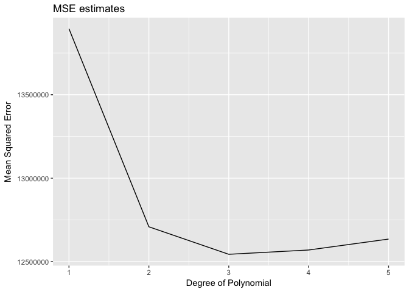
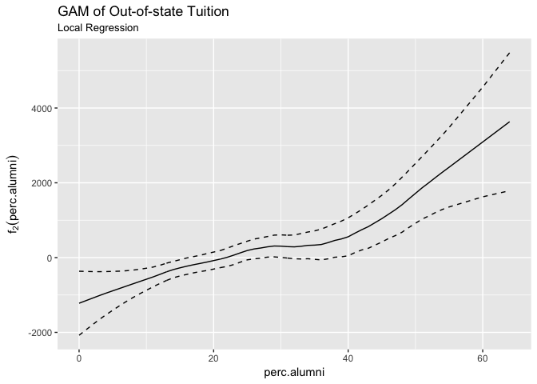
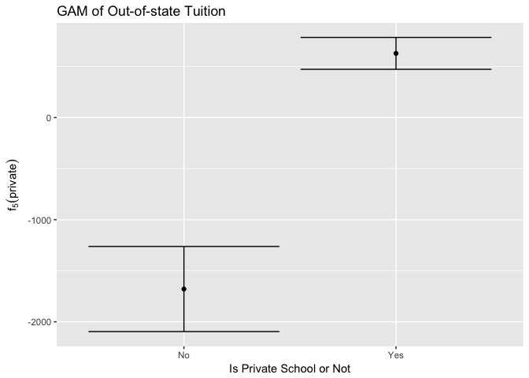
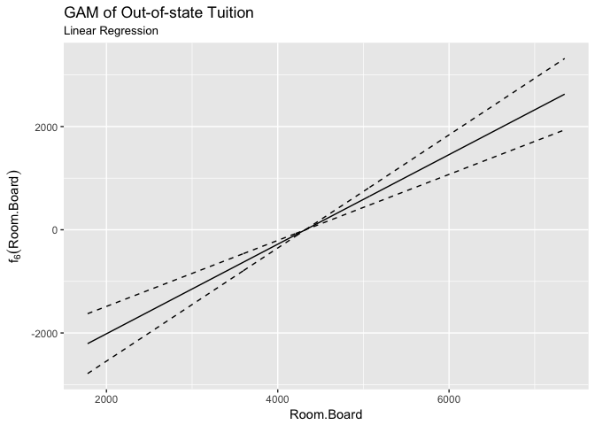

Problem set 7\#Xuancheng Qian
================
Xuancheng Qian
2/27/2017

-   [Part 1: Sexy Joe Biden (redux) \[4 points\]](#part-1-sexy-joe-biden-redux-4-points)
-   [Part 2: College (bivariate) \[3 points\]](#part-2-college-bivariate-3-points)
    -   [model 1. PhD with Outstate](#model-1.-phd-with-outstate)
    -   [model 2. Graduation rate with Outstate](#model-2.-graduation-rate-with-outstate)
    -   [model 3. Expend with Outstate](#model-3.-expend-with-outstate)
-   [Part 3: College (GAM) \[3 points\]](#part-3-college-gam-3-points)

``` r
library(dplyr)
library(ggplot2)
library(tidyr)
library(modelr)
library(broom)
library(purrr)
library(boot)
library(gam)
options(na.action = na.warn)
set.seed(1234)

# options(digits = 3)
# theme_set(theme_minimal())
```

``` r
#import data set
df_biden = read.csv('data/biden.csv')
# str(df)
```

Part 1: Sexy Joe Biden (redux) \[4 points\]
===========================================

1.  Estimate the training MSE of the model using the traditional approach.
    -   Fit the linear regression model using the entire dataset and calculate the mean squared error for the training set.

<!-- -->

    ##          term     estimate std.error  statistic      p.value
    ## 1 (Intercept)  58.81125899 3.1244366  18.822996 2.694143e-72
    ## 2         age   0.04825892 0.0282474   1.708438 8.772744e-02
    ## 3      female   4.10323009 0.9482286   4.327258 1.592601e-05
    ## 4        educ  -0.34533479 0.1947796  -1.772952 7.640571e-02
    ## 5         dem  15.42425563 1.0680327  14.441745 8.144928e-45
    ## 6         rep -15.84950614 1.3113624 -12.086290 2.157309e-32

``` r
mse <- function(model, data) {
  x <- modelr:::residuals(model, data)
  mean(x ^ 2, na.rm = TRUE)
}
```

``` r
biden_mse1 = mse(biden_multi_lm, df_biden)    # multiple linear model
biden_mse1 
```

    ## [1] 395.2702

-   For the traditional approach, we can calculate that the mean squared error is 395.27.

1.  Estimate the test MSE of the model using the validation set approach.
    -   Split the sample set into a training set (70%) and a validation set (30%). **Be sure to set your seed prior to this part of your code to guarantee reproducibility of results.**
    -   Fit the linear regression model using only the training observations.
    -   Calculate the MSE using only the test set observations.
    -   How does this value compare to the training MSE from step 1?

``` r
set.seed(1234)
biden_split <- resample_partition(df_biden, c(test = 0.3, train = 0.7))

train_model <- lm(biden~ age+ female + educ + dem + rep, data = biden_split$train)
summary(train_model)
```

    ## 
    ## Call:
    ## lm(formula = biden ~ age + female + educ + dem + rep, data = biden_split$train)
    ## 
    ## Residuals:
    ##     Min      1Q  Median      3Q     Max 
    ## -75.759 -10.736   0.903  12.930  53.675 
    ## 
    ## Coefficients:
    ##              Estimate Std. Error t value Pr(>|t|)    
    ## (Intercept)  57.33735    3.69768  15.506  < 2e-16 ***
    ## age           0.03728    0.03362   1.109 0.267701    
    ## female        4.17215    1.12671   3.703 0.000222 ***
    ## educ         -0.26017    0.23221  -1.120 0.262750    
    ## dem          16.32775    1.27664  12.790  < 2e-16 ***
    ## rep         -14.60704    1.55800  -9.375  < 2e-16 ***
    ## ---
    ## Signif. codes:  0 '***' 0.001 '**' 0.01 '*' 0.05 '.' 0.1 ' ' 1
    ## 
    ## Residual standard error: 19.89 on 1259 degrees of freedom
    ## Multiple R-squared:  0.2787, Adjusted R-squared:  0.2758 
    ## F-statistic: 97.28 on 5 and 1259 DF,  p-value: < 2.2e-16

``` r
tidy(train_model)
```

    ##          term     estimate  std.error statistic      p.value
    ## 1 (Intercept)  57.33735418 3.69768457 15.506286 9.235344e-50
    ## 2         age   0.03728388 0.03362353  1.108863 2.677012e-01
    ## 3      female   4.17214945 1.12671186  3.702943 2.223339e-04
    ## 4        educ  -0.26017049 0.23220880 -1.120416 2.627501e-01
    ## 5         dem  16.32774600 1.27663938 12.789631 2.656760e-35
    ## 6         rep -14.60703626 1.55800499 -9.375475 3.086057e-20

``` r
biden_mse2 = mse(train_model, biden_split$test) 
biden_mse2
```

    ## [1] 399.8303

-   When we split sample set into a training set and validation set, we fit the linear regression and the MSE is 399.83, which is larger compared with the training MSE from step 1 due to the split of sample as it could not generalize outside the training set.

1.  Repeat the validation set approach 100 times, using 100 different splits of the observations into a training set and a validation set. Comment on the results obtained.

``` r
set.seed(1234)
mse_variable<- replicate(100, {
  auto_split <- resample_partition(df_biden, c(test = 0.3, train = 0.7))
  model <- lm(biden ~ age + female + educ + dem + rep, data = auto_split$train)
  mse(model, biden_split$test)
})
mse_100<- mean(mse_variable,na.rm = TRUE)
mse_100
```

    ## [1] 398.4537

``` r
# 
# split_seq <- seq(0.05,0.4,length =100)
# mse_variable <- function(df_biden,split_seq){
#   result={}
#   for (i in seq(1,100,length=100)){
#     auto_split <- resample_partition(df_biden, c(test = split_seq[i], train = 1- split_seq[i]))
#     auto_train <- auto_split$train %>%
#       tbl_df()
#     auto_test <- auto_split$test %>%
#       tbl_df()
#     train_model = glm(biden~ age+ female + educ + dem + rep,data = auto_train)
#     result[i]= mse(train_model, auto_test)}
#   return(result)
# }
# result_100=rerun(100, mse_variable(df_biden,split_seq)) 
# result_100 =as.data.frame(result_100)
# mse_100 = mean(sapply(result_100, mean))
```

-   For this problem, we repeat the validation set approach 100 times, using 100 different splits of the observations into a training set and a validation set. And the MSE is 398.45, which is a little smaller compared with one time split above, but it should be more stable. And it is also very close to the MSE of entire set.

1.  Estimate the test MSE of the model using the leave-one-out cross-validation (LOOCV) approach. Comment on the results obtained.

``` r
names(df_biden) <- stringr::str_to_lower(names(df_biden))
loocv_data <- crossv_kfold(df_biden, k = nrow(df_biden))
loocv_models <- map(loocv_data$train, ~ lm(biden ~ age + female + educ + dem + rep,data = .))
loocv_mse <- map2_dbl(loocv_models, loocv_data$test, mse)
mean(loocv_mse)
```

    ## [1] 397.9555

-   The mean MSE value is 397.96, which is a little smaller compared with the value from 100-time validation approach. Since LOOCV would only leave one out, this result would be more steady compared with splitting process but the standard deviation is larger due to the increase of training set.

1.  Estimate the test MSE of the model using the 10-fold cross-validation approach. Comment on the results obtained.

``` r
set.seed(1234)
cv10_biden<- crossv_kfold(df_biden, k = 10)
cv10_models <- map(cv10_biden$train, ~ lm(biden ~ age + female + educ + dem + rep, data = .))
cv10_mse <- map2_dbl(cv10_models, cv10_biden$test, mse)
biden_mse10fold <-mean(cv10_mse)
biden_mse10fold 
```

    ## [1] 397.8837

-   Under 10-fold cross-validation approach, the mean MSE value is 397.88, which is a little smaller compared with the value from leave-one-out approach. Compared with losing the advantage of the training size, the computation time decreases instead.

1.  Repeat the 10-fold cross-validation approach 100 times, using 100 different splits of the observations into 10-folds. Comment on the results obtained.

``` r
set.seed(1234)
mse_variable_10fold <- replicate(100,{
  cv10_biden<- crossv_kfold(df_biden, k = 10)
  cv10_models <- map(cv10_biden$train, ~ lm(biden ~ age + female + educ + dem + rep, data = .))
  cv10_mse <- map2_dbl(cv10_models, cv10_biden$test, mse)
  biden_mse10fold <-mean(cv10_mse)
  
})
biden_mse10fold_100 <- mean(mse_variable_10fold)
biden_mse10fold_100 
```

    ## [1] 398.0642

-   The mean MSE value is 398.06, which is very close to the 100-times validation set.

1.  Compare the estimated parameters and standard errors from the original model in step 1 (the model estimated using all of the available data) to parameters and standard errors estimated using the bootstrap (*n* = 1000).

``` r
biden_boot <- df_biden %>%
  modelr::bootstrap(1000) %>%
  mutate(model = map(strap, ~lm(biden ~ age + female + educ + dem + rep, data =.)),
  coef = map(model, tidy))

biden_boot %>%
  unnest(coef) %>%
  group_by(term) %>%
  summarize(est.boot = mean(estimate),
            se.boot = sd(estimate, na.rm = TRUE))
```

    ## # A tibble: 6 × 3
    ##          term     est.boot    se.boot
    ##         <chr>        <dbl>      <dbl>
    ## 1 (Intercept)  58.93717341 2.97807947
    ## 2         age   0.04795027 0.02882476
    ## 3         dem  15.43772131 1.11290931
    ## 4        educ  -0.35252796 0.19123181
    ## 5      female   4.10299336 0.95436252
    ## 6         rep -15.86801610 1.44517224

-   Compared with the step one model, we can see that the coefficients are very close while the standard errors differ. However, bootstrap could work very well under the small set or when it is difficult to split into training and testing set. But this process could change original distribution which could cause bias. So when the sample size is large, we would better consider cross-validation approach or holdout approach.

Part 2: College (bivariate) \[3 points\]
========================================

Explore the bivariate relationships between some of the available predictors and Outstate. You should estimate at least 3 simple linear regression models (i.e. only one predictor per model). Use non-linear fitting techniques in order to fit a flexible model to the data, as appropriate. You could consider any of the following techniques:

Justify your use of linear or non-linear techniques using cross-validation methods. Create plots of the results obtained, and write a summary of your findings.

Explore the bivariate relationships between some of the available predictors and `Outstate`. You should estimate at least 3 **simple** linear regression models (i.e. only one predictor per model). Use non-linear fitting techniques in order to fit a flexible model to the data, **as appropriate**. You could consider any of the following techniques:

-   No transformation
-   Monotonic transformation
-   Polynomial regression
-   Step functions
-   Splines
-   Local regression

Justify your use of linear or non-linear techniques using cross-validation methods. Create plots of the results obtained, and write a summary of your findings.

model 1. PhD with Outstate
--------------------------

``` r
library(ISLR)
attach(College)
ggplot(aes(PhD, Outstate),data=College) +
  geom_point()
```


In the first model, we explore the relationship between PhD (Percent of faculty with Ph.D.'s.) and outstate and estimate this model with linear regression. We can see that PhD is statistically significant under *α* = 0.001, and one increase in the percent of faculty with Ph.D.'s would lead to 94.361 increase in out-state-tuition by average.

``` r
phd_lm <- lm(Outstate ~ PhD, data = College)
summary(phd_lm)
```

    ## 
    ## Call:
    ## lm(formula = Outstate ~ PhD, data = College)
    ## 
    ## Residuals:
    ##     Min      1Q  Median      3Q     Max 
    ## -8443.6 -3191.9   179.3  2554.0 14813.0 
    ## 
    ## Coefficients:
    ##             Estimate Std. Error t value Pr(>|t|)    
    ## (Intercept) 3584.361    608.838   5.887 5.85e-09 ***
    ## PhD           94.361      8.176  11.542  < 2e-16 ***
    ## ---
    ## Signif. codes:  0 '***' 0.001 '**' 0.01 '*' 0.05 '.' 0.1 ' ' 1
    ## 
    ## Residual standard error: 3719 on 775 degrees of freedom
    ## Multiple R-squared:  0.1467, Adjusted R-squared:  0.1456 
    ## F-statistic: 133.2 on 1 and 775 DF,  p-value: < 2.2e-16

``` r
tidy(phd_lm)
```

    ##          term   estimate  std.error statistic      p.value
    ## 1 (Intercept) 3584.36142 608.838448  5.887213 5.847276e-09
    ## 2         PhD   94.36122   8.175625 11.541774 1.504980e-28

``` r
# Add predictions and residuals
College %>%
  add_predictions(phd_lm) %>%
  add_residuals(phd_lm) %>%
  {.} -> grid1


mod1_lm <- ggplot(aes(PhD, Outstate), data = College) +
  geom_point() + 
  geom_line(aes(y=pred), data = grid1, color = 'red', size = 1) +
  labs(title = "Model 1, Figure 1: Percent of faculty with Ph.D.'s. vs. Out-of-State Tuition",
       subtitle = "Linear regression model",
       x = "Percent of faculty with Ph.D.'s",
       y = "Out-of-state Tuition($)")

mod1_lm_resd <- College %>%
  add_predictions(phd_lm) %>%
  add_residuals(phd_lm) %>%
  ggplot(aes(pred, resid)) +
  geom_point() + 
  geom_hline(yintercept = 0, color = 'red', size = 1, linetype = 'dashed') +
  labs(title = "Model 1, Figure 2: Percent of faculty with Ph.D.'s. vs. Out-of-State Tuition",
       subtitle = "Linear regression model",
       x = 'Predicted Out of State Tuition', 
       y = 'Residuals')

mod1_lm
```


``` r
mod1_lm_resd
```

 \* Then based on our linear model, we consider *x*<sup>3</sup> transformation of x. From the residuals plot, we could see that this model fits the data better compared with the previous model. Then we need to verify our model by 10-fold cross validation.

``` r
phd_lm2 <- lm(Outstate ~ poly(PhD,3), data = College)

mod1_phd_lm2 <- College %>%
  ggplot(aes(PhD, Outstate)) +
  geom_point() +
  geom_smooth(method = 'lm', formula = y ~ poly(x, 3)) + 
  labs(title = "Model 2, Figure 3: Percent of faculty with Ph.D.'s. vs. Out-of-State Tuition",
       subtitle = " 3rd degree Linear regression model",
       x = "Percent of faculty with Ph.D.'s",
       y = "Out-of-state Tuition($)")

mod1_phd_lm2_resd <- College %>%
  add_predictions(phd_lm2) %>%
  add_residuals(phd_lm2) %>%
  ggplot(aes(pred, resid)) +
  geom_point() + 
  geom_hline(yintercept = 0, color = 'red', size = 1, linetype = 'dashed') +
  labs(title = "Model 2, Figure 4: Percent of faculty with Ph.D.'s. vs. Out-of-State Tuition",
       subtitle = " 3rd degree Linear regression model",
       x = 'Predicted Out of State Tuition', 
       y = 'Residuals')


mod1_phd_lm2
```


``` r
mod1_phd_lm2_resd
```


``` r
set.seed(1234)
phd10_data <- crossv_kfold(College, k = 10)
phd_error_fold10 <- vector("numeric", 5)
terms <- 1:5

for(i in terms){
  phd10_models <- map(phd10_data$train, ~ lm(Outstate ~ poly(PhD, i), data = .))
  phd10_mse <- map2_dbl(phd10_models, phd10_data$test, mse)
  phd_error_fold10[[i]] <- mean(phd10_mse)
}

data_frame(terms = terms,
           fold10 = phd_error_fold10) %>%
  ggplot(aes(x=terms, y=fold10)) +
  geom_line() +
  labs(title = "MSE estimates",
       x = "Degree of Polynomial",
       y = "Mean Squared Error")
```

 \* With 10-fold cross validation, it shows that including the PhD cubic term would fit the data better. From the first degree to third degree, the MSE decreases -9.72%.

model 2. Graduation rate with Outstate
--------------------------------------

``` r
library(ISLR)
ggplot(aes(Grad.Rate, Outstate),data=College) +
  geom_point()
```


-   In the second model, we explore the relationship between Grad.Rate (Graduation rate) and outstate and estimate this model with linear regression. We can see that Grad.Rate is statistically significant under *α* = 0.001, and one increase in the percent of graduation rate would lead to 135.676 increase in out-state-tuition by average.

``` r
df_College <- filter(College, Grad.Rate <= 100)

grad_lm <- lm(Outstate ~ Grad.Rate, data = df_College)
summary(grad_lm)
```

    ## 
    ## Call:
    ## lm(formula = Outstate ~ Grad.Rate, data = df_College)
    ## 
    ## Residuals:
    ##      Min       1Q   Median       3Q      Max 
    ## -11297.0  -2243.2   -164.8   2123.0  12668.4 
    ## 
    ## Coefficients:
    ##             Estimate Std. Error t value Pr(>|t|)    
    ## (Intercept) 1569.395    467.976   3.354 0.000837 ***
    ## Grad.Rate    135.676      6.924  19.595  < 2e-16 ***
    ## ---
    ## Signif. codes:  0 '***' 0.001 '**' 0.01 '*' 0.05 '.' 0.1 ' ' 1
    ## 
    ## Residual standard error: 3293 on 774 degrees of freedom
    ## Multiple R-squared:  0.3316, Adjusted R-squared:  0.3307 
    ## F-statistic:   384 on 1 and 774 DF,  p-value: < 2.2e-16

``` r
tidy(grad_lm)
```

    ##          term  estimate  std.error statistic      p.value
    ## 1 (Intercept) 1569.3949 467.975544  3.353583 8.365237e-04
    ## 2   Grad.Rate  135.6763   6.923973 19.595151 9.725418e-70

``` r
# Add predictions and residuals
df_College %>%
  add_predictions(grad_lm) %>%
  add_residuals(grad_lm) %>%
  {.} -> grid1


mod2_lm <- ggplot(aes(Grad.Rate, Outstate), data = df_College) +
  geom_point() + 
  geom_line(aes(y=pred), data = grid1, color = 'red', size = 1) +
  labs(title = "Model 2, Figure 1: Graduation Rate vs. Out-of-State Tuition",
       subtitle = "Linear regression model",
       x = "Graduation Rate",
       y = "Out-of-state Tuition($)")

mod2_lm_resd <- df_College %>%
  add_predictions(grad_lm) %>%
  add_residuals(grad_lm) %>%
  ggplot(aes(pred, resid)) +
  geom_point() + 
   geom_hline(yintercept = 0, color = 'red', size = 1, linetype = 'dashed') +
  labs(title = "Model 2, Figure 2: Graduation Rate vs. Out-of-State Tuition",
       subtitle = "Linear regression model",
       x = 'Predicted Out-of-state tuition', 
       y = 'Residuals')

mod2_lm
```


``` r
mod2_lm_resd
```

 \* Then based on our linear model, we consider splines here. From the plot below, we could see that 2 degrees of polynomial and 1 knot would be a better choice.

``` r
# function to simplify things
grad_spline_cv <- function(data, degree=3, df = NULL){
  # estimate the model on each fold
  models <- map(data$train, ~ glm(Outstate ~ bs(Grad.Rate, df = df, degree = degree),
                                  data = .))
  
  # calculate mse for each test fold
  models_mse <- map2_dbl(models, data$test, mse)
  
  return(mean(models_mse, na.rm = TRUE))
}

# fold the data
grad_kfold <- crossv_kfold(df_College, k = 10)

# estimate mse for polynomial degrees in 1:10
grad_degree_mse <- data_frame(degrees = 1:10,
                              mse = map_dbl(degrees, ~ grad_spline_cv(grad_kfold, degree = .,
                                                                      df = 3 + .)))
```

    ## Warning in bs(Grad.Rate, degree = 1L, knots = structure(c(53, 65,
    ## 78), .Names = c("25%", : some 'x' values beyond boundary knots may cause
    ## ill-conditioned bases

    ## Warning in bs(Grad.Rate, degree = 2L, knots = structure(c(53, 65,
    ## 78), .Names = c("25%", : some 'x' values beyond boundary knots may cause
    ## ill-conditioned bases

    ## Warning in bs(Grad.Rate, degree = 3L, knots = structure(c(53, 65,
    ## 78), .Names = c("25%", : some 'x' values beyond boundary knots may cause
    ## ill-conditioned bases

    ## Warning in bs(Grad.Rate, degree = 4L, knots = structure(c(53, 65,
    ## 78), .Names = c("25%", : some 'x' values beyond boundary knots may cause
    ## ill-conditioned bases

    ## Warning in bs(Grad.Rate, degree = 5L, knots = structure(c(53, 65,
    ## 78), .Names = c("25%", : some 'x' values beyond boundary knots may cause
    ## ill-conditioned bases

    ## Warning in bs(Grad.Rate, degree = 6L, knots = structure(c(53, 65,
    ## 78), .Names = c("25%", : some 'x' values beyond boundary knots may cause
    ## ill-conditioned bases

    ## Warning in bs(Grad.Rate, degree = 7L, knots = structure(c(53, 65,
    ## 78), .Names = c("25%", : some 'x' values beyond boundary knots may cause
    ## ill-conditioned bases

    ## Warning in bs(Grad.Rate, degree = 8L, knots = structure(c(53, 65,
    ## 78), .Names = c("25%", : some 'x' values beyond boundary knots may cause
    ## ill-conditioned bases

    ## Warning in bs(Grad.Rate, degree = 9L, knots = structure(c(53, 65,
    ## 78), .Names = c("25%", : some 'x' values beyond boundary knots may cause
    ## ill-conditioned bases

    ## Warning in bs(Grad.Rate, degree = 10L, knots = structure(c(53, 65,
    ## 78), .Names = c("25%", : some 'x' values beyond boundary knots may cause
    ## ill-conditioned bases

``` r
# estimate mse for degrees of freedom (aka knots)
grad_df_mse <- data_frame(df = 1:10,
                          mse = map_dbl(df, ~ grad_spline_cv(grad_kfold, df = 3 + .)))
```

    ## Warning in bs(Grad.Rate, degree = 3L, knots = structure(65, .Names =
    ## "50%"), : some 'x' values beyond boundary knots may cause ill-conditioned
    ## bases

    ## Warning in bs(Grad.Rate, degree = 3L, knots = structure(c(58, 73), .Names
    ## = c("33.33333%", : some 'x' values beyond boundary knots may cause ill-
    ## conditioned bases

    ## Warning in bs(Grad.Rate, degree = 3L, knots = structure(c(53, 65,
    ## 78), .Names = c("25%", : some 'x' values beyond boundary knots may cause
    ## ill-conditioned bases

    ## Warning in bs(Grad.Rate, degree = 3L, knots = structure(c(51, 61, 69, 81:
    ## some 'x' values beyond boundary knots may cause ill-conditioned bases

    ## Warning in bs(Grad.Rate, degree = 3L, knots = structure(c(49, 58, 65, 73, :
    ## some 'x' values beyond boundary knots may cause ill-conditioned bases

    ## Warning in bs(Grad.Rate, degree = 3L, knots =
    ## structure(c(47.5714285714286, : some 'x' values beyond boundary knots may
    ## cause ill-conditioned bases

    ## Warning in bs(Grad.Rate, degree = 3L, knots = structure(c(46, 53, 60, 65, :
    ## some 'x' values beyond boundary knots may cause ill-conditioned bases

    ## Warning in bs(Grad.Rate, degree = 3L, knots = structure(c(45, 52, 58, 63, :
    ## some 'x' values beyond boundary knots may cause ill-conditioned bases

    ## Warning in bs(Grad.Rate, degree = 3L, knots = structure(c(44.7, 51, 56, :
    ## some 'x' values beyond boundary knots may cause ill-conditioned bases

    ## Warning in bs(Grad.Rate, degree = 3L, knots =
    ## structure(c(43.3636363636364, : some 'x' values beyond boundary knots may
    ## cause ill-conditioned bases

``` r
# graph the results
ggplot(grad_degree_mse, aes(degrees, mse)) +
  geom_point() +
  geom_line() +
  scale_x_continuous(breaks = 1:10) +
  labs(title = "Optimal number of degrees for out-state-tuition spline regression",
       subtitle = "Knots = 3",
       x = "Highest-order polynomial",
       y = "10-fold CV MSE")
```


``` r
ggplot(grad_df_mse, aes(df, mse)) +
  geom_point() +
  geom_line() +
  scale_x_continuous(breaks = 1:10) +
  labs(title = "Optimal number of knots for out-state-tuition spline regression",
       subtitle = "Highest-order polynomial = 3",
       x = "Knots",
       y = "10-fold CV MSE")
```


``` r
grad_lm2 <- Outstate_gr_bs <- glm(Outstate ~ bs(Grad.Rate, degree = 2, df = 3), data = df_College)

df_College %>%
  add_predictions(grad_lm2) %>%
  add_residuals(grad_lm2) %>%
  {.} -> grid2


mod1_grad_lm2 <- df_College %>%
  ggplot(aes(Grad.Rate, Outstate)) +
  geom_point() +
  geom_line(aes(y=pred), data = grid2, color = 'red', size = 1)  + 
  labs(title = "Model 2, Figure 3 Graduation Rate vs. Out-of-state tuition",
       subtitle = "Spline regression",
        x = "Graduation Rate",
        y = "Out-of-state tuition")
  
mod1_grad_lm2_resd <- df_College %>%
  add_predictions(grad_lm2) %>%
  add_residuals(grad_lm2) %>%
  ggplot(aes(pred, resid)) +
  geom_point() + 
  geom_hline(yintercept = 0, color = 'blue', size = 1, linetype = 'dashed')+
  labs(title = "Model 2, Figure 4 Graduation Rate vs. Out-of-state tuition",
       subtitle = "Spline regression",
       x = 'Predicted Out-of-state tuition', 
       y = 'Residuals')

  
mod1_grad_lm2
```


``` r
mod1_grad_lm2_resd
```

 \* From the plot above, we could see that this model fits the data well. And residuals are randomly located around 0.

model 3. Expend with Outstate
-----------------------------

``` r
library(ISLR)
ggplot(aes(Expend, Outstate),data=College) +
  geom_point()
```

 \* In the third model, we explore the relationship between Instructional expenditure per student and outstate and estimate this model with linear regression. We can see that Expend is statistically significant under *α* = 0.001, and one increase in the percent of Instructional Expenditures would lead to 0.518 increase in out-state-tuition by average.

``` r
expend_lm <- lm(Outstate ~ Expend, data = College)
summary(expend_lm)
```

    ## 
    ## Call:
    ## lm(formula = Outstate ~ Expend, data = College)
    ## 
    ## Residuals:
    ##      Min       1Q   Median       3Q      Max 
    ## -15780.8  -2088.7     57.6   2010.8   7784.5 
    ## 
    ## Coefficients:
    ##              Estimate Std. Error t value Pr(>|t|)    
    ## (Intercept) 5.434e+03  2.248e+02   24.17   <2e-16 ***
    ## Expend      5.183e-01  2.047e-02   25.32   <2e-16 ***
    ## ---
    ## Signif. codes:  0 '***' 0.001 '**' 0.01 '*' 0.05 '.' 0.1 ' ' 1
    ## 
    ## Residual standard error: 2978 on 775 degrees of freedom
    ## Multiple R-squared:  0.4526, Adjusted R-squared:  0.4519 
    ## F-statistic: 640.9 on 1 and 775 DF,  p-value: < 2.2e-16

``` r
tidy(expend_lm)
```

    ##          term   estimate    std.error statistic       p.value
    ## 1 (Intercept) 5433.51228 224.80618488  24.16976  1.257978e-96
    ## 2      Expend    0.51833   0.02047498  25.31529 1.629891e-103

``` r
# Add predictions and residuals
College %>%
  add_predictions(expend_lm) %>%
  add_residuals(expend_lm) %>%
  {.} -> grid1


mod3_lm <- ggplot(aes(Expend, Outstate), data = College) +
  geom_point() + 
  geom_line(aes(y=pred), data = grid1, color = 'red', size = 1) +
  labs(title = "Model 3, Figure 1: Instructional Expenditures vs. Out-of-State Tuition",
       subtitle = "Linear regression model",
       x = "Instructional Expenditures",
       y = "Out-of-state Tuition($)")

mod3_lm_resd <- College %>%
  add_predictions(expend_lm) %>%
  add_residuals(expend_lm) %>%
  ggplot(aes(pred, resid)) +
  geom_point() + 
  geom_smooth(se = FALSE) +
  labs(title = "Model 3, Figure 2: Instructional Expenditures vs. Out-of-State Tuition",
       subtitle = "Linear regression model",
       x = 'Predicted Out-of-state tuition', 
       y = 'Residuals')

mod3_lm
```


``` r
mod3_lm_resd
```

    ## `geom_smooth()` using method = 'loess'


-   Then based on our linear model, we consider *l**o**g*(*x*) transformation of x. From the residuals plot, we could see that this model fits the data better compared with the previous model. Then we need to verify our model by 10-fold cross validation.

``` r
expend_lm2 <- lm(Outstate ~ log(Expend), data = College)

mod1_expend_lm2 <- College %>%
  ggplot(aes(log(Expend), Outstate)) +
  geom_point() +
  geom_smooth(method = 'lm', formula = y ~ log(x)) + 
  labs(title = "Model 3, Figure 3 Log(Instructional expenditures) vs. Out-of-state tuition",
        x = "Log(Instructional expenditures)",
        y = "Out-of-state tuition")
  
mod1_expend_lm2_resd <- College %>%
  add_predictions(expend_lm2) %>%
  add_residuals(expend_lm2) %>%
  ggplot(aes(pred, resid)) +
  geom_point() + 
  geom_hline(yintercept = 0, color = 'blue', size = 1, linetype = 'dashed')+
  labs(title = "Model 3, Figure 4: Instructional Expenditures vs. Out-of-State Tuition",
       subtitle = "Log-transformation Linear regression model",
       x = 'Predicted Out-of-state tuition', 
       y = 'Residuals')

  
mod1_expend_lm2
```


``` r
mod1_expend_lm2_resd
```


``` r
set.seed(1234)
exlog_cv10 <- crossv_kfold(College, k = 10)
exlog_cv10_models <- map(exlog_cv10$train, ~ lm(Outstate ~ log(Expend), data = .))


exlog_cv10_mse <- map2_dbl(exlog_cv10_models, exlog_cv10$test, mse)
exlog_MSE <- mean(exlog_cv10_mse, na.rm = TRUE)

exloglm_MSE <- mse(expend_lm, data = College)

exlog_MSE
```

    ## [1] 6870202

``` r
exloglm_MSE
```

    ## [1] 8847579

With 10-fold cross validation, it shows that including the log transformation would fit the data better. The 10-fold CV test MSE for our monotonic transformation linear regression model is 6.870201610^{6}, compared to MSE for our standard linear regression model of 8847579.

Part 3: College (GAM) \[3 points\]
==================================

1.  Split the data into a training set and a test set.
2.  Estimate an OLS model on the training data, using out-of-state tuition (`Outstate`) as the response variable and the other six variables as the predictors. Interpret the results and explain your findings, using appropriate techniques (tables, graphs, statistical tests, etc.).
3.  Estimate a GAM on the training data, using out-of-state tuition (`Outstate`) as the response variable and the other six variables as the predictors. You can select any non-linear method (or linear) presented in the readings or in-class to fit each variable. Plot the results, and explain your findings. Interpret the results and explain your findings, using appropriate techniques (tables, graphs, statistical tests, etc.).
4.  Use the test set to evaluate the model fit of the estimated OLS and GAM models, and explain the results obtained.
5.  For which variables, if any, is there evidence of a non-linear relationship with the response?

``` r
library(ISLR)

set.seed(1234)
college_split <- resample_partition(College, c(test = 0.5, train = 0.5))
college_trainlm <- lm(Outstate ~ Private + Room.Board + PhD + perc.alumni + Expend + Grad.Rate, data = college_split$train)
summary(college_trainlm)
```

    ## 
    ## Call:
    ## lm(formula = Outstate ~ Private + Room.Board + PhD + perc.alumni + 
    ##     Expend + Grad.Rate, data = college_split$train)
    ## 
    ## Residuals:
    ##     Min      1Q  Median      3Q     Max 
    ## -7837.9 -1294.5    17.8  1238.1  5943.1 
    ## 
    ## Coefficients:
    ##               Estimate Std. Error t value Pr(>|t|)    
    ## (Intercept) -3.886e+03  6.225e+02  -6.243 1.14e-09 ***
    ## PrivateYes   2.762e+03  2.934e+02   9.414  < 2e-16 ***
    ## Room.Board   1.033e+00  1.205e-01   8.574 2.52e-16 ***
    ## PhD          3.763e+01  8.240e+00   4.567 6.68e-06 ***
    ## perc.alumni  5.655e+01  1.046e+01   5.405 1.14e-07 ***
    ## Expend       1.765e-01  2.398e-02   7.359 1.14e-12 ***
    ## Grad.Rate    3.290e+01  7.834e+00   4.199 3.34e-05 ***
    ## ---
    ## Signif. codes:  0 '***' 0.001 '**' 0.01 '*' 0.05 '.' 0.1 ' ' 1
    ## 
    ## Residual standard error: 2032 on 382 degrees of freedom
    ## Multiple R-squared:  0.7521, Adjusted R-squared:  0.7482 
    ## F-statistic: 193.1 on 6 and 382 DF,  p-value: < 2.2e-16

-   In this model, we split the sample set into training set (0.5) and testing set (0.5). Then we apply linear regression to this dataset.From the summary, we can see that this model's R-square is 0.7521, indicating it could explain about 75.2% of the variance in the training data. Without baseline, we could see that this model fits the data. And all the coefficients are statistically significant under *α* = 0.001. Being a private university would increse the tuition by 2762 dollars on average. On dollar increase in room-board costs would lead to 1.033 increase in the out-of-state tuition by average. With one increase in percent of faculty with Ph.D.'s would make tuition higher by 37.63 dollar. And with the percent of alumni who donate increase by 1 percent, the tuition would be 56.55 dollars more. The instructional expenditure per student would promote the tuition by 0.1765 with one unit increase.Furthermore, one unit increase in graduation rate would increase 32.90 dollars more by average.

``` r
clg_gam <- gam(Outstate ~ poly(PhD,3) + lo(perc.alumni) + log(Expend) + bs(Grad.Rate, degree = 2, df = 3) + Private + Room.Board, data = college_split$train, na.action = na.fail)


clg_gam_terms <- preplot(clg_gam, se = TRUE, rug = FALSE)

# perc.alumni
data_frame(x = clg_gam_terms$`lo(perc.alumni)`$x,
           y = clg_gam_terms$`lo(perc.alumni)`$y,
           se.fit = clg_gam_terms$`lo(perc.alumni)`$se.y) %>%
  mutate(y_low = y - 1.96 * se.fit,
         y_high = y + 1.96 * se.fit) %>%
  ggplot(aes(x, y)) +
  geom_line() +
  geom_line(aes(y = y_low), linetype = 2) +
  geom_line(aes(y = y_high), linetype = 2) +
  labs(title = "GAM of Out-of-state Tuition",
       subtitle = "Local Regression",
       x = "perc.alumni",
       y = expression(f[2](perc.alumni)))
```



``` r
# Private
data_frame(x = clg_gam_terms$Private$x,
           y = clg_gam_terms$Private$y,
           se.fit = clg_gam_terms$Private$se.y) %>%
  unique %>%
  mutate(y_low = y - 1.96 * se.fit,
         y_high = y + 1.96 * se.fit) %>%
  ggplot(aes(x, y, ymin = y_low, ymax = y_high)) +
  geom_errorbar() +
  geom_point() +
  labs(title = "GAM of Out-of-state Tuition",
       x = "Is Private School or Not",
       y = expression(f[5](private)))
```



``` r
# Room.Board
data_frame(x = clg_gam_terms$Room.Board$x,
           y = clg_gam_terms$Room.Board$y,
           se.fit = clg_gam_terms$Room.Board$se.y) %>%
  mutate(y_low = y - 1.96 * se.fit,
         y_high = y + 1.96 * se.fit) %>%
  ggplot(aes(x, y)) +
  geom_line() +
  geom_line(aes(y = y_low), linetype = 2) +
  geom_line(aes(y = y_high), linetype = 2) +
  labs(title = "GAM of Out-of-state Tuition",
       subtitle = "Linear Regression",
       x = "Room.Board",
       y = expression(f[6](Room.Board)))   
```



``` r
mse_ols <- mse(college_trainlm , college_split$test)
mse_gam <- mse(clg_gam, college_split$test)
```

    ## Warning in bs(Grad.Rate, degree = 2L, knots = structure(65, .Names =
    ## "50%"), : some 'x' values beyond boundary knots may cause ill-conditioned
    ## bases

    ## Warning in bs(Grad.Rate, degree = 2L, knots = structure(65, .Names =
    ## "50%"), : some 'x' values beyond boundary knots may cause ill-conditioned
    ## bases

``` r
mse_ols
```

    ## [1] 4195761

``` r
mse_gam
```

    ## [1] 3870865

``` r
summary(clg_gam)
```

    ## 
    ## Call: gam(formula = Outstate ~ poly(PhD, 3) + lo(perc.alumni) + log(Expend) + 
    ##     bs(Grad.Rate, degree = 2, df = 3) + Private + Room.Board, 
    ##     data = college_split$train, na.action = na.fail)
    ## Deviance Residuals:
    ##      Min       1Q   Median       3Q      Max 
    ## -7305.80 -1100.27   -64.82  1208.09  5360.34 
    ## 
    ## (Dispersion Parameter for gaussian family taken to be 3681714)
    ## 
    ##     Null Deviance: 6362233950 on 388 degrees of freedom
    ## Residual Deviance: 1382243092 on 375.4347 degrees of freedom
    ## AIC: 7000.505 
    ## 
    ## Number of Local Scoring Iterations: 2 
    ## 
    ## Anova for Parametric Effects
    ##                                       Df     Sum Sq    Mean Sq F value
    ## poly(PhD, 3)                        3.00 1577914262  525971421 142.861
    ## lo(perc.alumni)                     1.00 1323134233 1323134233 359.380
    ## log(Expend)                         1.00 1184983356 1184983356 321.856
    ## bs(Grad.Rate, degree = 2, df = 3)   3.00  289770218   96590073  26.235
    ## Private                             1.00  373117640  373117640 101.344
    ## Room.Board                          1.00  204299218  204299218  55.490
    ## Residuals                         375.43 1382243092    3681714        
    ##                                      Pr(>F)    
    ## poly(PhD, 3)                      < 2.2e-16 ***
    ## lo(perc.alumni)                   < 2.2e-16 ***
    ## log(Expend)                       < 2.2e-16 ***
    ## bs(Grad.Rate, degree = 2, df = 3) 1.991e-15 ***
    ## Private                           < 2.2e-16 ***
    ## Room.Board                        6.515e-13 ***
    ## Residuals                                      
    ## ---
    ## Signif. codes:  0 '***' 0.001 '**' 0.01 '*' 0.05 '.' 0.1 ' ' 1
    ## 
    ## Anova for Nonparametric Effects
    ##                                   Npar Df Npar F Pr(F)
    ## (Intercept)                                           
    ## poly(PhD, 3)                                          
    ## lo(perc.alumni)                       2.6 1.8779 0.142
    ## log(Expend)                                           
    ## bs(Grad.Rate, degree = 2, df = 3)                     
    ## Private                                               
    ## Room.Board

-   Based on analysis above, I considered cubic term of PhD, log transformation of Expend, and spline with 3 degrees of freedom and 2 degrees polynomial on Grad.Rate. For the other predictors, I considered local regression of perc.alumni. From the summary, we can see all the coefficients are statistically significant. Then we plot the relationship between perc.alumni and outofstate, Private and outofstate, Room.Board and outofstate.

-   These three plots show that these variables have significant relationships with out-of-state tuition. There is a great gap between private and public school on out-of-state intuition. For room and board costs, the relationship is also positive. The out-of-state tuition would increase with higher room and board costs. For percent of alumnis who denote, the graph indicates that this predictor has a steady increasing influence on tuition. For room and board costs, the relationship is positive. The tuition would increase with higher room and board costs.
-   We can see that GAM's MSE is much smaller (3870865), indicating GAM model fits the data better. Since we have added non-linear relationship to the GAM model, we could see that this makes GAM's prediction more accurate.
-   From the ANOVA, we could see that this shows a strong evidence of non-linear relationship between Outstate and Expend, which we actually consider log transformation and a moderately strong non-linear relationship (considering p-value of 0.05) between Outstate and Grad.Rate (splines) or PhD (cubic term).
