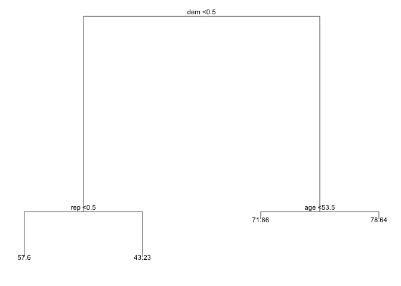
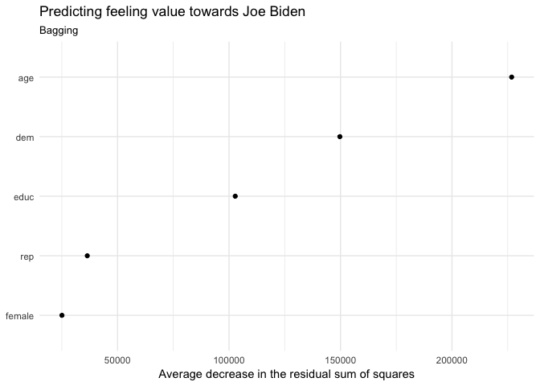
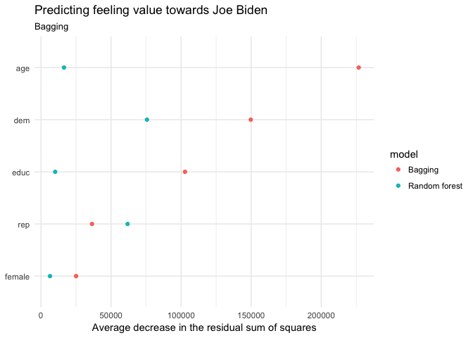
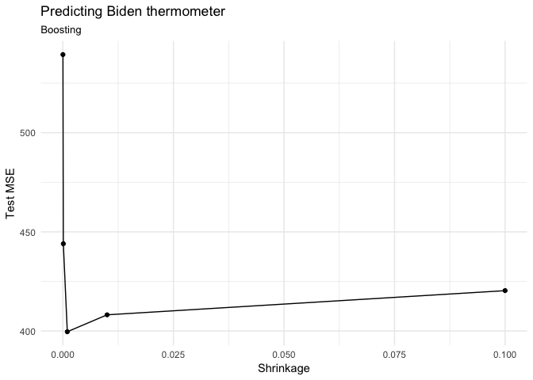
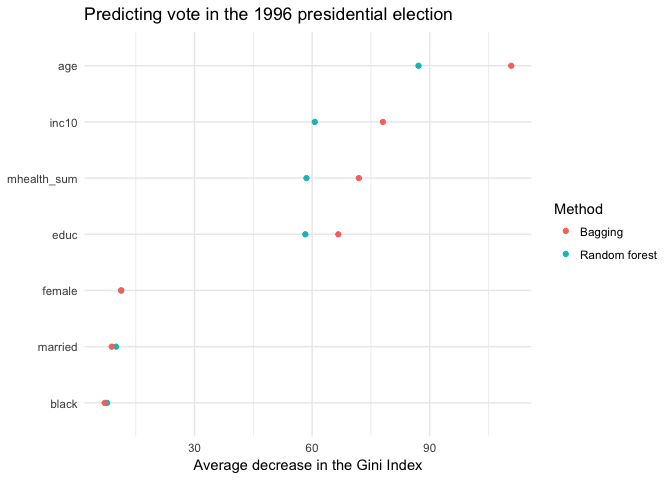
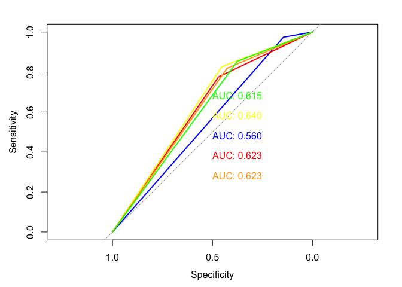
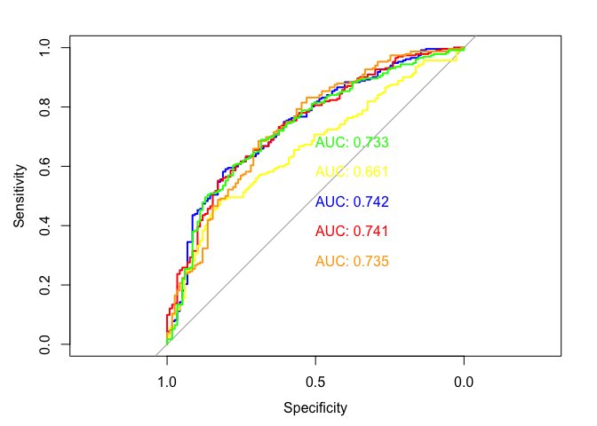

Problem set 8\#Xuancheng Qian
================
Xuancheng Qian
3/6/2017

-   [Part 1: Sexy Joe Biden (redux times two) \[3 points\]](#part-1-sexy-joe-biden-redux-times-two-3-points)
-   [Part 2: Modeling voter turnout \[3 points\]](#part-2-modeling-voter-turnout-3-points)
-   [Part 3: OJ Simpson \[4 points\]](#part-3-oj-simpson-4-points)

``` r
library(tidyverse)
library(forcats)
library(broom)
library(modelr)
library(tree)
library(randomForest)
library(stringr)
library(ISLR)
library(gridExtra)
library(grid)
library(titanic)
library(rcfss)
library(pROC)
library(gbm)
# to get the tree graphs with the labels and values, use the forked
# version of ggdendro
# devtools::install_github("bensoltoff/ggdendro")
library(ggdendro)
library(e1071)
library(grid)
library(gridExtra)

options(digits = 3)
set.seed(1234)
theme_set(theme_minimal())
```

``` r
err.rate.rf <- function(model, data) {
  data <- as_tibble(data)
  response <- as.character(model$terms[[2]])
  
  pred <- predict(model, newdata = data, type = "response")
  actual <- data[[response]]
  
  return(mean(pred != actual, na.rm = TRUE))
}
```

Part 1: Sexy Joe Biden (redux times two) \[3 points\]
=====================================================

``` r
#import data set
df_biden = read.csv('data/biden.csv')
# str(df)
# 
df_biden<- df_biden %>%
    mutate_each(funs(as.factor(.)), dem, rep,female)
```

1.  Split the data into a training set (70%) and a validation set (30%). **Be sure to set your seed prior to this part of your code to guarantee reproducibility of results.**
2.  Fit a decision tree to the training data, with `biden` as the response variable and the other variables as predictors. Plot the tree and interpret the results. What is the test MSE?
    -   Leave the control options for `tree()` at their default values

``` r
mse <- function(model, data) {
  x <- modelr:::residuals(model, data)
  mean(x ^ 2, na.rm = TRUE)
}
```

``` r
set.seed(1234)
biden_split <- resample_partition(df_biden, c(test = 0.3, train = 0.7))
biden_tree <- tree(biden~ age+ female + educ + dem + rep, data = biden_split$train)
tree_data <- dendro_data(biden_tree)
ptree <- ggplot(segment(tree_data)) +
  geom_segment(aes(x = x, y = y, xend = xend, yend = yend), 
               alpha = 0.5) +
  geom_text(data = label(tree_data), 
            aes(x = x, y = y, label = label_full), vjust = -0.5, size = 3) +
  geom_text(data = leaf_label(tree_data), 
            aes(x = x, y = y, label = label), vjust = 0.5, size = 3) +
  theme_dendro()
ptree
```


``` r
# summary(train_model)
# tidy(train_model)
biden_mse = mse(biden_tree, biden_split$test) 
# biden_mse
```

-   From the tree above, we can see that if *d**e**m* = *T**R**U**E*, which indicates that respondent is a Democrat, the respondent would have feeling thermometer towards Joe Biden is 74.51 by average. And when the *d**e**m* = *F**A**L**S**E* and *r**e**p* = *T**R**U**E*, which indicates that respondent is a Republican, the respondent would have feeling thermometer towards Joe Biden is 43.23 by average. And if the respondent is neither a Democrat nor a Republican, the respondent would have feeling thermometer towards Joe Biden is 57.6 by average. The Democratic respondents would have strong positive feeling towards Joe Biden compared with other respondents.
-   When the control options for tree() at their default values, the test MSE is 406.4167.

1.  Now fit another tree to the training data with the following `control` options:

    ``` r
    tree(control = tree.control(nobs = # number of rows in the training set,
                                  mindev = 0))
    ```

    Use cross-validation to determine the optimal level of tree complexity, plot the optimal tree, and interpret the results. Does pruning the tree improve the test MSE?

``` r
biden_tree <- tree(biden~ age+ female + educ + dem + rep, data = biden_split$train, control = tree.control(nobs = nrow(biden_split$train),
                            mindev = 0))
# mod <- biden_tree
# generate 10-fold CV trees
biden_cv <- crossv_kfold(as_tibble(biden_split$train), k = 10) %>%
  mutate(tree = map(train, ~ tree(biden~ age+ female + educ + dem + rep, data = .,
     control = tree.control(nobs = nrow(biden_split$train),
                            mindev = 0))))
# calculate each possible prune result for each fold
biden_cv <- expand.grid(biden_cv$.id, 2:10) %>%
  as_tibble() %>%
  mutate(Var2 = as.numeric(Var2)) %>%
  rename(.id = Var1,
         k = Var2) %>%
  left_join(biden_cv) %>%
  mutate(prune = map2(tree, k, ~ prune.tree(.x, best = .y)),
         mse = map2_dbl(prune, test, mse))
```

    ## Joining, by = ".id"

    ## Warning in left_join_impl(x, y, by$x, by$y, suffix$x, suffix$y): joining
    ## character vector and factor, coercing into character vector

``` r
biden_cv %>%
  select(k, mse) %>%
  group_by(k) %>%
  summarize(test_mse = mean(mse),
            sd = sd(mse, na.rm = TRUE)) %>%
  ggplot(aes(k, test_mse)) +
  geom_point() +
  geom_line() +
  labs(x = "Number of terminal nodes",
       y = "Test MSE")
```


``` r
mod <- prune.tree(biden_tree, best = 4)
tree_data <- dendro_data(mod)
ptree <- ggplot(segment(tree_data)) +
  geom_segment(aes(x = x, y = y, xend = xend, yend = yend),
               alpha = 0.5) +
  geom_text(data = label(tree_data),
            aes(x = x, y = y, label = label_full), vjust = -0.5, size = 3) +
  geom_text(data = leaf_label(tree_data),
            aes(x = x, y = y, label = label), vjust = 0.5, size = 3) +
  theme_dendro()
ptree
```



``` r
biden_mse = mse(mod, biden_split$test)
biden_mse
```

    ## [1] 407

``` r
biden_mse_full = mse(biden_tree, biden_split$test)
biden_mse_full
```

    ## [1] 481

-   Use 10-fold cross validation, we can see that the optimal level is 4, then we prune and get the following tree.
-   From the tree above, we can see that if *d**e**m* = *T**R**U**E*, which indicates that respondent is a Democrat, and the respondent's age is 53.5 or more, the respondent would have feeling thermometer towards Joe Biden is 78.64 by average. And when the respondent is a Democrat with 53.5 years old or younger,the respondent would have feeling thermometer towards Joe Biden is 71.86 by average. When the *d**e**m* = *F**A**L**S**E* and *r**e**p* = *T**R**U**E*, which indicates that respondent is a Republican, the respondent would have feeling thermometer towards Joe Biden is 43.23 by average. And if the respondent is neither a Democrat nor a Republican, the respondent would have feeling thermometer towards Joe Biden is 57.6 by average. The older Democratic respondents would have strong positive feeling towards Joe Biden compared with other respondents.
-   When the control options based on the requirement, the test MSE after pruning the tree is 407.1560. Pruning the tree actually improved the test MSE compared with the test MSE of full tree which is 481.4899. However, the test MSE did not change a lot compared with the test MSE (406.4167) of default tree in the problem above.

1.  Use the bagging approach to analyze this data. What test MSE do you obtain? Obtain variable importance measures and interpret the results.

``` r
(biden_bag <- randomForest(biden ~ ., data = biden_split$train,
                             mtry = 5, ntree = 500))
```

    ## 
    ## Call:
    ##  randomForest(formula = biden ~ ., data = biden_split$train, mtry = 5,      ntree = 500) 
    ##                Type of random forest: regression
    ##                      Number of trees: 500
    ## No. of variables tried at each split: 5
    ## 
    ##           Mean of squared residuals: 494
    ##                     % Var explained: 9.5

``` r
biden_mse = mse(biden_bag, biden_split$test)
biden_mse
```

    ## [1] 485

``` r
data_frame(var = rownames(importance(biden_bag)),
           MeanDecreaseRSS = importance(biden_bag)[,1]) %>%
  mutate(var = fct_reorder(var, MeanDecreaseRSS, fun = median)) %>%
  ggplot(aes(var, MeanDecreaseRSS)) +
  geom_point() +
  coord_flip() +
  labs(title = "Predicting feeling value towards Joe Biden ",
       subtitle = "Bagging",
       x = NULL,
       y = "Average decrease in the residual sum of squares")
```



-   The test MSE of the bagging approach is 485.2877, which is higher than the pruned tree. When we consider that the number of variables tried at each split is 5, in terms of variable importance measures, the regression tree use the average decrease in residual sum of squares measure. The importance ranking of variables in the biden data set is as following: age &gt; dem &gt; educ &gt; rep &gt; female. The variables like age, dem, educ, rep is more important in the predicting feeling towards Joe Biden in terms of reducing RSS compared with the variable like female.

1.  Use the random forest approach to analyze this data. What test MSE do you obtain? Obtain variable importance measures and interpret the results. Describe the effect of *m*, the number of variables considered at each split, on the error rate obtained.

``` r
set.seed(1234)
(biden_rf <- randomForest(biden ~ ., data = biden_split$train,
                            ntree = 500))
```

    ## 
    ## Call:
    ##  randomForest(formula = biden ~ ., data = biden_split$train, ntree = 500) 
    ##                Type of random forest: regression
    ##                      Number of trees: 500
    ## No. of variables tried at each split: 1
    ## 
    ##           Mean of squared residuals: 405
    ##                     % Var explained: 25.8

``` r
seq.int(biden_rf$ntree) %>%
  map_df(~ getTree(biden_rf, k = ., labelVar = TRUE)[1,]) %>%
  count(`split var`) %>%
  knitr::kable(caption = "Variable used to generate the first split in each tree",
               col.names = c("Variable used to split", "Number of training observations"))
```

    ## Warning in bind_rows_(x, .id): Unequal factor levels: coercing to character

| Variable used to split |  Number of training observations|
|:-----------------------|--------------------------------:|
| age                    |                               94|
| dem                    |                               99|
| educ                   |                               92|
| female                 |                               95|
| rep                    |                              120|

``` r
data_frame(var = rownames(importance(biden_rf)),
           `Random forest` = importance(biden_rf)[,1]) %>%
  left_join(data_frame(var = rownames(importance(biden_rf)),
           Bagging = importance(biden_bag)[,1])) %>%
  mutate(var = fct_reorder(var, Bagging, fun = median)) %>%
  gather(model, rss, -var) %>%
  ggplot(aes(var, rss, color = model)) +
  geom_point() +
  coord_flip() +
  labs(title = "Predicting feeling value towards Joe Biden ",
       subtitle = "Bagging",
       x = NULL,
       y = "Average decrease in the residual sum of squares")
```

    ## Joining, by = "var"



``` r
biden_mse = mse(biden_rf, biden_split$test)
biden_mse
```

    ## [1] 408

``` r
set.seed(1234)
biden_rf_m =data.frame()
biden_mse_m=data.frame()
library(foreach)
biden_rf_m <- foreach(i = 1:5) %do% (randomForest(biden ~ ., data = biden_split$train,mtry =i, ntree = 500))
biden_mse_m <- foreach(i = 1:5) %do% {
  (imp <-randomForest(biden ~ ., data = biden_split$train,mtry =i, ntree = 500))
   result = mse(imp,biden_split$test)
}
biden_mse_m 
```

    ## [[1]]
    ## [1] 411
    ## 
    ## [[2]]
    ## [1] 404
    ## 
    ## [[3]]
    ## [1] 429
    ## 
    ## [[4]]
    ## [1] 472
    ## 
    ## [[5]]
    ## [1] 482

``` r
# (biden_rf <- randomForest(biden ~ ., data = biden_split$train,
#                             mtry=2,ntree = 500))
# 
# seq.int(biden_rf$ntree) %>%
#   map_df(~ getTree(biden_rf, k = ., labelVar = TRUE)[1,]) %>%
#   count(`split var`) %>%
#   knitr::kable(caption = "Variable used to generate the first split in each tree",
#                col.names = c("Variable used to split", "Number of training observations"))
# 
# data_frame(var = rownames(importance(biden_rf)),
#            `Random forest` = importance(biden_rf)[,1]) %>%
#   left_join(data_frame(var = rownames(importance(biden_rf)),
#            Bagging = importance(biden_bag)[,1])) %>%
#   mutate(var = fct_reorder(var, Bagging, fun = median)) %>%
#   gather(model, rss, -var) %>%
#   ggplot(aes(var, rss, color = model)) +
#   geom_point() +
#   coord_flip() +
#   labs(title = "Predicting feeling value towards Joe Biden ",
#        subtitle = "Bagging",
#        x = NULL,
#        y = "Average decrease in the residual sum of squares")
```

-   The test MSE of the random forest approach is 408.0484. In terms of variable importance measures, the regression tree still uses the average decrease in residual sum of squares measure. The importance ranking of variables in the biden data set is as following: dem &gt; rep &gt; age &gt; educ &gt; female. The variables like dem, rep, age is more important in the predicting feeling towards Joe Biden in terms of reducing RSS compared with the variable like educ, female. The test MSE achieves the minimum when the number is 2, and gradually increases with the increase of m. And it achieves the maximum when the number of splitting is 5.

1.  Use the boosting approach to analyze the data. What test MSE do you obtain? How does the value of the shrinkage parameter *λ* influence the test MSE?

``` r
set.seed(1234)

biden_boost <- gbm(biden ~ ., data = biden_split$train, n.trees = 10000, interaction.depth = 1)
```

    ## Distribution not specified, assuming gaussian ...

``` r
pred_boost = predict(biden_boost, newdata = biden_split$test, n.trees = 10000)

mse_boost <- mean((pred_boost - df_biden[biden_split$test[2]$idx, ]$biden)^2)
mse_boost_m <- numeric(5)
shrinkages <- numeric(5)
trees_m <- numeric(5)
for (t in 1:5){
  shrinkages[t] <- 10^(-t)
  trees_m[t]<-10^(5)*2*t
  biden_boost <- gbm(biden ~ ., data = biden_split$train, n.trees = trees_m[t], interaction.depth = 1, shrinkage = shrinkages[t])
  pred_boost = predict(biden_boost, newdata = biden_split$test, n.trees = 10000)
  mse_boost_m[t] <- mean((pred_boost - df_biden[biden_split$test[2]$idx, ]$biden)^2)
}
```

    ## Distribution not specified, assuming gaussian ...
    ## Distribution not specified, assuming gaussian ...
    ## Distribution not specified, assuming gaussian ...
    ## Distribution not specified, assuming gaussian ...
    ## Distribution not specified, assuming gaussian ...

``` r
data_frame(mse = mse_boost_m, shrinkage = shrinkages) %>% 
  ggplot(aes(shrinkage, mse)) +
  geom_point() +
  geom_line() +
  labs(title = "Predicting Biden thermometer",
       subtitle = "Boosting",
       x = "Shrinkage",
       y = "Test MSE")
```

 \* The test MSE of boosting approach is 399.5437, which performs better compared with the previous random forest approach (test MSE 408.0484). Generally, as the shrinkage parameter gets smaller, then the number of trees must increase. As testing different shrinkage level (1e-5,0.0001, 0.001, 0.01, 0.1), and the number of trees (2e+05,4e+05,6e+05,8e+05, 1e+06), the test MSE goes down first from 1e-5 to 0.001, and goes up from 0.001 to 0.1. The best shrinkage level in this case would be 0.001, which has a better test MSE around 400.

Part 2: Modeling voter turnout \[3 points\]
===========================================

1.  Use cross-validation techniques and standard measures of model fit (e.g. test error rate, PRE, ROC curves/AUC) to compare and evaluate at least five tree-based models of voter turnout. Select the best model and interpret the results using whatever methods you see fit (graphs, tables, model fit statistics, predictions for hypothetical observations, etc.)

``` r
set.seed(1234)
(mh <- read_csv("data/mental_health.csv") %>%
  mutate_each(funs(as.factor(.)), vote96, black, female, married) %>%
  na.omit)
```

    ## Parsed with column specification:
    ## cols(
    ##   vote96 = col_double(),
    ##   mhealth_sum = col_double(),
    ##   age = col_double(),
    ##   educ = col_double(),
    ##   black = col_double(),
    ##   female = col_double(),
    ##   married = col_double(),
    ##   inc10 = col_double()
    ## )

    ## # A tibble: 1,165 × 8
    ##    vote96 mhealth_sum   age  educ  black female married inc10
    ##    <fctr>       <dbl> <dbl> <dbl> <fctr> <fctr>  <fctr> <dbl>
    ## 1       1           0    60    12      0      0       0  4.81
    ## 2       1           1    36    12      0      0       1  8.83
    ## 3       0           7    21    13      0      0       0  1.74
    ## 4       0           6    29    13      0      0       0 10.70
    ## 5       1           1    41    15      1      1       1  8.83
    ## 6       1           2    48    20      0      0       1  8.83
    ## 7       0           9    20    12      0      1       0  7.22
    ## 8       0          12    27    11      0      1       0  1.20
    ## 9       1           2    28    16      0      0       1  7.22
    ## 10      1           0    72    14      0      0       1  4.01
    ## # ... with 1,155 more rows

``` r
mh_split <- resample_partition(mh, p = c("test" = .3, "train" = .7))

# tree 0
voter_tree0 <- tree(vote96~., data = mh_split$train)
err_rate0 = err.rate.tree(voter_tree0,mh_split$test)

fitted <- predict(voter_tree0, as_tibble(mh_split$test), type = "class")

roc_0 <- roc(as.numeric(as_tibble(mh_split$test)$vote96), as.numeric(fitted))
auc_0 <- auc(roc_0)


# tree 1
voter_tree <- tree(vote96~., data = mh_split$train, control = tree.control(nobs = nrow(mh_split$train),
                            mindev = 0))

mod <- voter_tree

err_rate1 = err.rate.tree(voter_tree,mh_split$test)

fitted <- predict(voter_tree, as_tibble(mh_split$test), type = "class")

roc_1 <- roc(as.numeric(as_tibble(mh_split$test)$vote96), as.numeric(fitted))
auc_1 <- auc(roc_1)

# tree 2
err.rate.tree <- function(model, data) {
  data <- as_tibble(data)
  response <- as.character(model$terms[[2]])
  
  pred <- predict(model, newdata = data, type = "class")
  actual <- data[[response]]
  
  return(mean(pred != actual, na.rm = TRUE))
}

mh_cv <- as_tibble(mh_split$train) %>%
  na.omit() %>%
  crossv_kfold(k = 10) %>%
  mutate(tree = map(train, ~ tree(vote96~., data = .,
     control = tree.control(nobs = nrow(mh_split$train),
                            mindev = .001))))
# calculate each possible prune result for each fold
mh_cv <- expand.grid(mh_cv$.id,2:15) %>%
  as_tibble() %>%
  mutate(Var2 = as.numeric(Var2)) %>%
  rename(.id = Var1,
         k = Var2) %>%
  left_join(mh_cv) %>%
  mutate(prune = map2(tree, k, ~ prune.misclass(.x, best = .y)),
         mse = map2_dbl(prune, test, err.rate.tree))
```

    ## Joining, by = ".id"

    ## Warning in left_join_impl(x, y, by$x, by$y, suffix$x, suffix$y): joining
    ## character vector and factor, coercing into character vector

``` r
mh_cv %>%
  group_by(k) %>%
  summarize(test_mse = mean(mse),
            sd = sd(mse, na.rm = TRUE)) %>%
  ggplot(aes(k, test_mse)) +
  geom_point() +
  geom_line() +
  labs(title = "Voter tree",
       subtitle = "classfication tree",
       x = "Number of terminal nodes",
       y = "Test error rate")
```


``` r
mod <- prune.tree(voter_tree, best = 13)

err_rate2 = err.rate.tree(mod, mh_split$test)

fitted <- predict(mod, as_tibble(mh_split$test), type = "class")

roc_2 <- roc(as.numeric(as_tibble(mh_split$test)$vote96), as.numeric(fitted))
auc_2 <- auc(roc_2)

# bagging tree
(voter_bag <- randomForest(vote96 ~ ., data = mh_split$train,
                             mtry = 7, ntree = 500))
```

    ## 
    ## Call:
    ##  randomForest(formula = vote96 ~ ., data = mh_split$train, mtry = 7,      ntree = 500) 
    ##                Type of random forest: classification
    ##                      Number of trees: 500
    ## No. of variables tried at each split: 7
    ## 
    ##         OOB estimate of  error rate: 33.2%
    ## Confusion matrix:
    ##     0   1 class.error
    ## 0 111 150       0.575
    ## 1 121 434       0.218

``` r
err_rate3 = err.rate.tree(voter_bag,mh_split$test)
fitted <- predict(voter_bag, as_tibble(mh_split$test), type = "class")

roc_3 <- roc(as.numeric(as_tibble(mh_split$test)$vote96), as.numeric(fitted))
auc_3 <- auc(roc_3)


# random forest
(voter_rf <- randomForest(vote96 ~ ., data = mh_split$train,
                            ntree = 500))
```

    ## 
    ## Call:
    ##  randomForest(formula = vote96 ~ ., data = mh_split$train, ntree = 500) 
    ##                Type of random forest: classification
    ##                      Number of trees: 500
    ## No. of variables tried at each split: 2
    ## 
    ##         OOB estimate of  error rate: 29.5%
    ## Confusion matrix:
    ##    0   1 class.error
    ## 0 99 162       0.621
    ## 1 79 476       0.142

``` r
fitted <- predict(voter_rf, as_tibble(mh_split$test), type = "class")

err_rate4 = err.rate.tree(voter_rf,mh_split$test)

roc_4 <- roc(as.numeric(as_tibble(mh_split$test)$vote96), as.numeric(fitted))
auc_4 <- auc(roc_4)


data_frame(var = rownames(importance(voter_rf)),
           `Random forest` = importance(voter_rf)[,1]) %>%
  left_join(data_frame(var = rownames(importance(voter_rf)),
           Bagging = importance(voter_bag)[,1])) %>%
  mutate(var = fct_reorder(var, Bagging, fun = median)) %>%
  gather(model, gini, -var) %>%
  ggplot(aes(var, gini, color = model)) +
  geom_point() +
  coord_flip() +
  labs(title = "Predicting vote in the 1996 presidential election",
       x = NULL,
       y = "Average decrease in the Gini Index",
       color = "Method")
```

    ## Joining, by = "var"



``` r
err_rate <- data.frame(err_rate0,err_rate1,err_rate2,err_rate3,err_rate4)
auc_m <-data.frame(auc_0,auc_1,auc_2,auc_3,auc_4)
err_rate
```

    ##   err_rate0 err_rate1 err_rate2 err_rate3 err_rate4
    ## 1     0.304     0.335     0.298     0.312     0.307

``` r
auc_m
```

    ##   auc_0 auc_1 auc_2 auc_3 auc_4
    ## 1  0.56 0.623  0.64 0.623 0.615

``` r
plot(roc_0, print.auc = TRUE, col = "blue")
plot(roc_1, print.auc = TRUE, col = "red", print.auc.y = .4, add = TRUE)
plot(roc_2, print.auc = TRUE, col = "yellow", print.auc.y = .6, add = TRUE)
plot(roc_3, print.auc = TRUE, col = "orange", print.auc.y = .3, add = TRUE)
plot(roc_4, print.auc = TRUE, col = "green", print.auc.y = .7, add = TRUE)
```

 \* In this part, we split the dataset into 70% training set and 30% testing set.We apply five tree models. The first tree is decision tree with default setting. The error rate for this model is 0.304. And the area under the curve is 0.56 (Blue line). The second tree model is full tree model with all predictors and control option including age, inc10 (family income), mhealth\_sum (respondent's mental health), educ (Number of years of formal education), whether the respondent is black or not, whether the respondent is female or not, whether the respondent is married or not.The error rate of this tree model is 0.335. The area under the curve is 0.623 (red line). Next, we use 10-fold cross validation to determine the optimal level of tree complexity and prune the tree. The error rate of this model is 0.298, and the area under the curve is 0.64 (yellow line). Then we apply bagging approach, the error rate is 0.312, and the area under the curve is 0.623 (orange line). Finally we apply the random forest approach, the error rate is 0.307 and the area under the curve is 0.615 (green line). \* For classification trees, in terms of variable importance measure, larger values are better. So for the voter bagging model and random forest model, age, inc10, mhelth\_sum are the most important predictors, whereas educ, female, married, black are relatively unimportant. \* From the classification error rate and area under the curve, we can see that the pruned tree has a better performance compared with other tree models. The bagging approach performs a little better than random forest approach in this dataset in terms of error rate and AUC.

``` r
set.seed(1234)
(mh <- read_csv("data/mental_health.csv") %>%
  mutate_each(funs(as.factor(.)), vote96, black, female, married) %>%
  na.omit)
```

    ## Parsed with column specification:
    ## cols(
    ##   vote96 = col_double(),
    ##   mhealth_sum = col_double(),
    ##   age = col_double(),
    ##   educ = col_double(),
    ##   black = col_double(),
    ##   female = col_double(),
    ##   married = col_double(),
    ##   inc10 = col_double()
    ## )

    ## # A tibble: 1,165 × 8
    ##    vote96 mhealth_sum   age  educ  black female married inc10
    ##    <fctr>       <dbl> <dbl> <dbl> <fctr> <fctr>  <fctr> <dbl>
    ## 1       1           0    60    12      0      0       0  4.81
    ## 2       1           1    36    12      0      0       1  8.83
    ## 3       0           7    21    13      0      0       0  1.74
    ## 4       0           6    29    13      0      0       0 10.70
    ## 5       1           1    41    15      1      1       1  8.83
    ## 6       1           2    48    20      0      0       1  8.83
    ## 7       0           9    20    12      0      1       0  7.22
    ## 8       0          12    27    11      0      1       0  1.20
    ## 9       1           2    28    16      0      0       1  7.22
    ## 10      1           0    72    14      0      0       1  4.01
    ## # ... with 1,155 more rows

``` r
mh_split <- resample_partition(mh, p = c("test" = .3, "train" = .7))

# svm 1
mh_lin_tune <- tune(svm, vote96 ~ ., data = as_tibble(mh_split$train),
                    kernel = "linear",
                    range = list(cost = c(.001, .01, .1, 1, 5, 10, 100)))
summary(mh_lin_tune)
```

    ## 
    ## Parameter tuning of 'svm':
    ## 
    ## - sampling method: 10-fold cross validation 
    ## 
    ## - best parameters:
    ##  cost
    ##   0.1
    ## 
    ## - best performance: 0.291 
    ## 
    ## - Detailed performance results:
    ##    cost error dispersion
    ## 1 1e-03 0.320     0.0677
    ## 2 1e-02 0.322     0.0683
    ## 3 1e-01 0.291     0.0566
    ## 4 1e+00 0.299     0.0612
    ## 5 5e+00 0.299     0.0612
    ## 6 1e+01 0.299     0.0612
    ## 7 1e+02 0.299     0.0612

``` r
mh_lin <- mh_lin_tune$best.model
summary(mh_lin)
```

    ## 
    ## Call:
    ## best.tune(method = svm, train.x = vote96 ~ ., data = as_tibble(mh_split$train), 
    ##     ranges = list(cost = c(0.001, 0.01, 0.1, 1, 5, 10, 100)), 
    ##     kernel = "linear")
    ## 
    ## 
    ## Parameters:
    ##    SVM-Type:  C-classification 
    ##  SVM-Kernel:  linear 
    ##        cost:  0.1 
    ##       gamma:  0.125 
    ## 
    ## Number of Support Vectors:  511
    ## 
    ##  ( 256 255 )
    ## 
    ## 
    ## Number of Classes:  2 
    ## 
    ## Levels: 
    ##  0 1

``` r
fitted <- predict(mh_lin, as_tibble(mh_split$test), decision.values = TRUE) %>%
  attributes

roc_line <- roc(as_tibble(mh_split$test)$vote96, fitted$decision.values)
```

    ## Warning in roc.default(as_tibble(mh_split$test)$vote96, fitted
    ## $decision.values): Deprecated use a matrix as predictor. Unexpected results
    ## may be produced, please pass a numeric vector.

``` r
# plot(roc_line)

auc(roc_line)
```

    ## Area under the curve: 0.742

``` r
# svm 2
mh_poly_tune <- tune(svm, vote96 ~ ., data = as_tibble(mh_split$train),
                    kernel = "polynomial",
                    range = list(cost = c(.001, .01, .1, 1, 5, 10, 100)))
summary(mh_poly_tune)
```

    ## 
    ## Parameter tuning of 'svm':
    ## 
    ## - sampling method: 10-fold cross validation 
    ## 
    ## - best parameters:
    ##  cost
    ##     5
    ## 
    ## - best performance: 0.297 
    ## 
    ## - Detailed performance results:
    ##    cost error dispersion
    ## 1 1e-03 0.320     0.0536
    ## 2 1e-02 0.320     0.0536
    ## 3 1e-01 0.314     0.0548
    ## 4 1e+00 0.303     0.0569
    ## 5 5e+00 0.297     0.0454
    ## 6 1e+01 0.299     0.0435
    ## 7 1e+02 0.319     0.0347

``` r
mh_poly <- mh_poly_tune$best.model
summary(mh_poly)
```

    ## 
    ## Call:
    ## best.tune(method = svm, train.x = vote96 ~ ., data = as_tibble(mh_split$train), 
    ##     ranges = list(cost = c(0.001, 0.01, 0.1, 1, 5, 10, 100)), 
    ##     kernel = "polynomial")
    ## 
    ## 
    ## Parameters:
    ##    SVM-Type:  C-classification 
    ##  SVM-Kernel:  polynomial 
    ##        cost:  5 
    ##      degree:  3 
    ##       gamma:  0.125 
    ##      coef.0:  0 
    ## 
    ## Number of Support Vectors:  495
    ## 
    ##  ( 258 237 )
    ## 
    ## 
    ## Number of Classes:  2 
    ## 
    ## Levels: 
    ##  0 1

``` r
fitted <- predict(mh_poly, as_tibble(mh_split$test), decision.values = TRUE) %>%
  attributes

roc_poly <- roc(as_tibble(mh_split$test)$vote96, fitted$decision.values)
```

    ## Warning in roc.default(as_tibble(mh_split$test)$vote96, fitted
    ## $decision.values): Deprecated use a matrix as predictor. Unexpected results
    ## may be produced, please pass a numeric vector.

``` r
# plot(roc_poly)
auc(roc_poly)
```

    ## Area under the curve: 0.741

``` r
#svm 3
mh_rad_tune <- tune(svm, vote96 ~ ., data = as_tibble(mh_split$train),
                    kernel = "radial",
                    range = list(cost = c(.001, .01, .1, 1, 5, 10, 100)))
summary(mh_rad_tune)
```

    ## 
    ## Parameter tuning of 'svm':
    ## 
    ## - sampling method: 10-fold cross validation 
    ## 
    ## - best parameters:
    ##  cost
    ##     1
    ## 
    ## - best performance: 0.297 
    ## 
    ## - Detailed performance results:
    ##    cost error dispersion
    ## 1 1e-03 0.320     0.0576
    ## 2 1e-02 0.320     0.0576
    ## 3 1e-01 0.305     0.0701
    ## 4 1e+00 0.297     0.0552
    ## 5 5e+00 0.300     0.0623
    ## 6 1e+01 0.304     0.0638
    ## 7 1e+02 0.319     0.0691

``` r
mh_rad <- mh_rad_tune$best.model
summary(mh_rad)
```

    ## 
    ## Call:
    ## best.tune(method = svm, train.x = vote96 ~ ., data = as_tibble(mh_split$train), 
    ##     ranges = list(cost = c(0.001, 0.01, 0.1, 1, 5, 10, 100)), 
    ##     kernel = "radial")
    ## 
    ## 
    ## Parameters:
    ##    SVM-Type:  C-classification 
    ##  SVM-Kernel:  radial 
    ##        cost:  1 
    ##       gamma:  0.125 
    ## 
    ## Number of Support Vectors:  509
    ## 
    ##  ( 265 244 )
    ## 
    ## 
    ## Number of Classes:  2 
    ## 
    ## Levels: 
    ##  0 1

``` r
fitted <- predict(mh_rad, as_tibble(mh_split$test), decision.values = TRUE) %>%
  attributes

roc_rad <- roc(as_tibble(mh_split$test)$vote96, fitted$decision.values)
```

    ## Warning in roc.default(as_tibble(mh_split$test)$vote96, fitted
    ## $decision.values): Deprecated use a matrix as predictor. Unexpected results
    ## may be produced, please pass a numeric vector.

``` r
# plot(roc_rad)
auc(roc_rad)
```

    ## Area under the curve: 0.735

``` r
#svm 4

mh_sig_tune <- tune(svm, vote96 ~ ., data = as_tibble(mh_split$train),
                    kernel = "sigmoid",
                    range = list(cost = c(.001, .01, .1, 1, 5, 10, 100)))
summary(mh_sig_tune)
```

    ## 
    ## Parameter tuning of 'svm':
    ## 
    ## - sampling method: 10-fold cross validation 
    ## 
    ## - best parameters:
    ##   cost
    ##  0.001
    ## 
    ## - best performance: 0.32 
    ## 
    ## - Detailed performance results:
    ##    cost error dispersion
    ## 1 1e-03 0.320     0.0663
    ## 2 1e-02 0.320     0.0663
    ## 3 1e-01 0.323     0.0608
    ## 4 1e+00 0.348     0.0489
    ## 5 5e+00 0.365     0.0547
    ## 6 1e+01 0.364     0.0533
    ## 7 1e+02 0.378     0.0542

``` r
mh_sig <- mh_sig_tune$best.model
summary(mh_sig)
```

    ## 
    ## Call:
    ## best.tune(method = svm, train.x = vote96 ~ ., data = as_tibble(mh_split$train), 
    ##     ranges = list(cost = c(0.001, 0.01, 0.1, 1, 5, 10, 100)), 
    ##     kernel = "sigmoid")
    ## 
    ## 
    ## Parameters:
    ##    SVM-Type:  C-classification 
    ##  SVM-Kernel:  sigmoid 
    ##        cost:  0.001 
    ##       gamma:  0.125 
    ##      coef.0:  0 
    ## 
    ## Number of Support Vectors:  522
    ## 
    ##  ( 261 261 )
    ## 
    ## 
    ## Number of Classes:  2 
    ## 
    ## Levels: 
    ##  0 1

``` r
fitted <- predict(mh_sig, as_tibble(mh_split$test), decision.values = TRUE) %>%
  attributes

roc_sig <- roc(as_tibble(mh_split$test)$vote96, fitted$decision.values)
```

    ## Warning in roc.default(as_tibble(mh_split$test)$vote96, fitted
    ## $decision.values): Deprecated use a matrix as predictor. Unexpected results
    ## may be produced, please pass a numeric vector.

``` r
# plot(roc_rad)
auc(roc_sig)
```

    ## Area under the curve: 0.733

``` r
# svm 5
mh_poly2_tune <- tune(svm, vote96 ~ ., data = as_tibble(mh_split$train),
                    kernel = "polynomial",degree =10,
                    range = list(cost = c(.001, .01, .1, 1, 5, 10, 100)))
summary(mh_poly2_tune)
```

    ## 
    ## Parameter tuning of 'svm':
    ## 
    ## - sampling method: 10-fold cross validation 
    ## 
    ## - best parameters:
    ##  cost
    ##    10
    ## 
    ## - best performance: 0.314 
    ## 
    ## - Detailed performance results:
    ##    cost error dispersion
    ## 1 1e-03 0.322     0.0553
    ## 2 1e-02 0.321     0.0565
    ## 3 1e-01 0.324     0.0578
    ## 4 1e+00 0.319     0.0625
    ## 5 5e+00 0.319     0.0548
    ## 6 1e+01 0.314     0.0438
    ## 7 1e+02 0.316     0.0491

``` r
mh_poly2 <- mh_poly2_tune$best.model
summary(mh_poly2)
```

    ## 
    ## Call:
    ## best.tune(method = svm, train.x = vote96 ~ ., data = as_tibble(mh_split$train), 
    ##     ranges = list(cost = c(0.001, 0.01, 0.1, 1, 5, 10, 100)), 
    ##     kernel = "polynomial", degree = 10)
    ## 
    ## 
    ## Parameters:
    ##    SVM-Type:  C-classification 
    ##  SVM-Kernel:  polynomial 
    ##        cost:  10 
    ##      degree:  10 
    ##       gamma:  0.125 
    ##      coef.0:  0 
    ## 
    ## Number of Support Vectors:  528
    ## 
    ##  ( 290 238 )
    ## 
    ## 
    ## Number of Classes:  2 
    ## 
    ## Levels: 
    ##  0 1

``` r
fitted <- predict(mh_poly2, as_tibble(mh_split$test), decision.values = TRUE) %>%
  attributes

roc_poly2 <- roc(as_tibble(mh_split$test)$vote96, fitted$decision.values)
```

    ## Warning in roc.default(as_tibble(mh_split$test)$vote96, fitted
    ## $decision.values): Deprecated use a matrix as predictor. Unexpected results
    ## may be produced, please pass a numeric vector.

``` r
# plot(roc_poly)
auc(roc_poly2)
```

    ## Area under the curve: 0.661

``` r
plot(roc_line, print.auc = TRUE, col = "blue")
plot(roc_poly, print.auc = TRUE, col = "red", print.auc.y = .4, add = TRUE)
plot(roc_poly2, print.auc = TRUE, col = "yellow", print.auc.y = .6, add = TRUE)
plot(roc_rad, print.auc = TRUE, col = "orange", print.auc.y = .3, add = TRUE)
plot(roc_sig, print.auc = TRUE, col = "green", print.auc.y = .7, add = TRUE)
```



``` r
svm_auc = data.frame(auc(roc_line), auc(roc_poly),auc(roc_poly2),auc(roc_rad),auc(roc_sig))
svm_auc
```

    ##   auc.roc_line. auc.roc_poly. auc.roc_poly2. auc.roc_rad. auc.roc_sig.
    ## 1         0.742         0.741          0.661        0.735        0.733

-   In this plot, we evaluate five SVM models of voter turnout including linear kernel svm,polynomial kernel svm with default setting (degree 3),polynomial kernel svm with degree 10, radial kernel svm and sigmoid kernel svm.
-   The blue indicates the linear kernel svm, the area under the curve is 0.742. The red line indicates the polynomial kernel svm with degree 3, the area under the curve is 0.741. The yellow line indicates the polynomial kernel svm with degree 10, the area under the curve is 0.661. The orange indicates the radial kernel svm, the area under the curve is 0.735. And the green line indicates the sigmoid kernel svm, the area under the curve is 0.733. The larger AUC indicates the better performance of models. In this dataset, we can see most of the svm approachs have a good performance as the AUC is larger than 0.733 except polynomial kernel with degree 10, which is 0.661. And the svm with linear kernel and polynomial kernel with degree 3 perform better than other svms in terms of AUC.

Part 3: OJ Simpson \[4 points\]
===============================

``` r
df_simpson <- read_csv("data/simpson.csv") %>%
  na.omit() %>%
  mutate_each(funs(as.factor(.)), guilt, dem, rep, ind, female, black, hispanic, educ, income)
```

    ## Parsed with column specification:
    ## cols(
    ##   guilt = col_double(),
    ##   dem = col_double(),
    ##   rep = col_double(),
    ##   ind = col_double(),
    ##   age = col_double(),
    ##   educ = col_character(),
    ##   female = col_double(),
    ##   black = col_double(),
    ##   hispanic = col_double(),
    ##   income = col_character()
    ## )

1.  What is the relationship between race and belief of OJ Simpson's guilt? Develop a robust statistical learning model and use this model to explain the impact of an individual's race on their beliefs about OJ Simpson's guilt.

``` r
set.seed(1234)

simpson_split <- resample_partition(df_simpson, c(test = 0.3, train = 0.7))

simpson_logistic <- glm(guilt ~ black + hispanic, data = simpson_split$train, family = binomial)
summary(simpson_logistic)
```

    ## 
    ## Call:
    ## glm(formula = guilt ~ black + hispanic, family = binomial, data = simpson_split$train)
    ## 
    ## Deviance Residuals: 
    ##    Min      1Q  Median      3Q     Max  
    ## -1.835  -0.607   0.641   0.641   2.018  
    ## 
    ## Coefficients:
    ##             Estimate Std. Error z value Pr(>|z|)    
    ## (Intercept)   1.4789     0.0934   15.84   <2e-16 ***
    ## black1       -3.0789     0.2165  -14.22   <2e-16 ***
    ## hispanic1    -0.2966     0.3167   -0.94     0.35    
    ## ---
    ## Signif. codes:  0 '***' 0.001 '**' 0.01 '*' 0.05 '.' 0.1 ' ' 1
    ## 
    ## (Dispersion parameter for binomial family taken to be 1)
    ## 
    ##     Null deviance: 1229.06  on 991  degrees of freedom
    ## Residual deviance:  947.18  on 989  degrees of freedom
    ## AIC: 953.2
    ## 
    ## Number of Fisher Scoring iterations: 4

``` r
Prob <- function(model, data){
  data <- data %>% 
    add_predictions(model) %>% 
    mutate(prob = exp(pred) / (1 + exp(pred)),
           pred_bi = as.numeric(prob > .5))
  return(data)
}

logit2prob <- function(x){
  exp(x) / (1 + exp(x))
}

prob2odds <- function(x){
  x / (1 - x)
}

prob2logodds <- function(x){
  log(prob2odds(x))
}

simpson_logistic_test <- Prob(simpson_logistic, as_tibble(simpson_split$test))


grid1<- as.data.frame(simpson_split$test) %>%
  data_grid(black, hispanic) %>%
  add_predictions(simpson_logistic) %>% 
  mutate(prob = exp(pred) / (1 + exp(pred))) %>%
  mutate(odds = prob2odds(prob)) %>%
  mutate(logodds = prob2logodds(prob))


ggplot(grid1, aes(black, prob, group = factor(hispanic), color = factor(hispanic))) +
  geom_line() +
  scale_color_discrete(name = "Hispanic or not (hispanic = 1)") +
  labs(title = "Predicted probability of guilt belief",
       subtitle = "Logistic regression with race",
       x = "Black or not (black = 1)",
       y = "Predicted probability of guilt belief")
```


``` r
#Accuracy
simp_accuracy <- mean(simpson_logistic_test$guilt == simpson_logistic_test$pred_bi, na.rm = TRUE)
simp_accuracy
```

    ## [1] 0.816

``` r
#PRE
simp_y<- na.omit(as.numeric(as_tibble(simpson_split$test)$guilt))
E1 <- mean(as.numeric(simp_y != median(simp_y)))
E2 <- 1 - simp_accuracy
PRE <- (E1 - E2) / E1
PRE
```

    ## [1] 0.418

``` r
#AUC
simp_auc <- auc(simpson_logistic_test$guilt, simpson_logistic_test$pred_bi)
simp_auc
```

    ## Area under the curve: 0.733

``` r
set.seed(1234)


simpson_tree<- tree(guilt ~ black + hispanic, data = simpson_split$train)

mod <- simpson_tree
tree_data <- dendro_data(mod)

ggplot(segment(tree_data)) +
  geom_segment(aes(x = x, y = y, xend = xend, yend = yend), alpha = 0.5) +
  geom_text(data = label(tree_data), aes(x = x, y = y, label = label_full), vjust = -0.5, size = 3) +
  geom_text(data = leaf_label(tree_data), aes(x = x, y = y, label = label), vjust = 0.5, size = 3) +
  theme_dendro() +
  labs(title = "Simpson guilt tree",
       subtitle = "black + hispanic")
```


``` r
#AUC

simpson_err_rate <-err.rate.tree(mod, simpson_split$test)
fitted <- predict(mod, as_tibble(simpson_split$test), type = "class")
simpson_roc <- roc(as.numeric(as_tibble(simpson_split$test)$guilt), as.numeric(fitted))
simpson_auc<- auc(simpson_roc)
plot(simpson_roc)
```


``` r
simpson_auc
```

    ## Area under the curve: 0.733

``` r
#k-fold cross validation
fold_model_mse <- function(df, k){
  cv10_data <- crossv_kfold(df, k = k)
  cv10_models <- map(cv10_data$train, ~ glm(guilt ~ black + hispanic, family = binomial, data = .))
  cv10_prob <- map2(cv10_models, cv10_data$train, ~Prob(.x, as.data.frame(.y)))
  cv10_mse <- map(cv10_prob, ~ mean(.$guilt != .$pred_bi, na.rm = TRUE))
  return(data_frame(cv10_mse))
}

set.seed(1234)
mses <- rerun(100, fold_model_mse(df_simpson, 10)) %>%
  bind_rows(.id = "id")

mse_100cv10 <- mean(as.numeric(mses$cv10_mse))
mseSd_100cv10 <- sd(as.numeric(mses$cv10_mse))
mse_100cv10
```

    ## [1] 0.184

``` r
mseSd_100cv10
```

    ## [1] 0.00345

-   We first apply logistic regression to this problem. From the summary, we can see that the coefficient of black factor is statistically significant under *α* = 0.001, and the coefficient of hispanic is statistically significant under *α* = 0.1. Both factors have negative relationship with the response of belief. For one unit increase in black (being black), the estimated odds of believing guilt would decrease by roughtly a factor of 25. For one unit increase in hispanic (being hispanic), the estimated odds of believing guilt would decrease by roughtly a factor of 1.72.
-   The error rate of this mode is 0.17, and PRE is 0.434, and the area under the curve is 0.744 indicating that this model fits the dataset well.
-   We also apply a decision tree to this problem as it is intuitive to explain the relationship for classification problem. The AUC is 0.744 indicating that this model performs well in this dataset. From the tree, we can see that being black would believe O.J. Simpson was probably not guilty and not being black would believe O.J. Simpson was guilty.
-   Both models fit the data well. And I choose logistic regression as my model to explain the relationship between race and belief of OJ Simpson's guiltmore due to the interpretation. Then We apply 10-fold cross validation to the logistic model. The average test MSE is 0.184, which indicates that this model performs well.

1.  How can you predict whether individuals believe OJ Simpson to be guilty of these murders? Develop a robust statistical learning model to predict whether individuals believe OJ Simpson to be either probably guilty or probably not guilty and demonstrate the effectiveness of this model using methods we have discussed in class.

``` r
set.seed(1234)
# svm 1

simpson_lin_tune <- tune(svm, guilt ~ dem + rep + age + educ + female + black + hispanic + income, data = as_tibble(simpson_split$train), kernel = 'linear', range = list(cost = c(.001, .01, .1, 1, 5, 10, 100)))
simpson_lin <- simpson_lin_tune$best.model                         
summary(simpson_lin)
```

    ## 
    ## Call:
    ## best.tune(method = svm, train.x = guilt ~ dem + rep + age + educ + 
    ##     female + black + hispanic + income, data = as_tibble(simpson_split$train), 
    ##     ranges = list(cost = c(0.001, 0.01, 0.1, 1, 5, 10, 100)), 
    ##     kernel = "linear")
    ## 
    ## 
    ## Parameters:
    ##    SVM-Type:  C-classification 
    ##  SVM-Kernel:  linear 
    ##        cost:  0.01 
    ##       gamma:  0.0625 
    ## 
    ## Number of Support Vectors:  637
    ## 
    ##  ( 329 308 )
    ## 
    ## 
    ## Number of Classes:  2 
    ## 
    ## Levels: 
    ##  0 1

``` r
fitted <- predict(simpson_lin, as_tibble(simpson_split$test), decision.values = TRUE) %>%
  attributes

roc_line <- roc(as_tibble(simpson_split$test)$guilt, fitted$decision.values)
```

    ## Warning in roc.default(as_tibble(simpson_split$test)$guilt, fitted
    ## $decision.values): Deprecated use a matrix as predictor. Unexpected results
    ## may be produced, please pass a numeric vector.

``` r
# plot(roc_line)

auc(roc_line)
```

    ## Area under the curve: 0.808

``` r
# svm 2
simpson_poly_tune <- tune(svm, guilt ~ dem + rep + age + educ + female + black + hispanic + income, data = as_tibble(simpson_split$train),
                    kernel = "polynomial",
                    range = list(cost = c(.001, .01, .1, 1, 5, 10, 100), degree = c(3, 4, 5, 6)))
summary(simpson_poly_tune)
```

    ## 
    ## Parameter tuning of 'svm':
    ## 
    ## - sampling method: 10-fold cross validation 
    ## 
    ## - best parameters:
    ##  cost degree
    ##    10      3
    ## 
    ## - best performance: 0.193 
    ## 
    ## - Detailed performance results:
    ##     cost degree error dispersion
    ## 1  1e-03      3 0.311     0.0334
    ## 2  1e-02      3 0.311     0.0334
    ## 3  1e-01      3 0.311     0.0334
    ## 4  1e+00      3 0.305     0.0299
    ## 5  5e+00      3 0.200     0.0479
    ## 6  1e+01      3 0.193     0.0461
    ## 7  1e+02      3 0.196     0.0430
    ## 8  1e-03      4 0.311     0.0334
    ## 9  1e-02      4 0.311     0.0334
    ## 10 1e-01      4 0.311     0.0334
    ## 11 1e+00      4 0.311     0.0334
    ## 12 5e+00      4 0.278     0.0270
    ## 13 1e+01      4 0.233     0.0337
    ## 14 1e+02      4 0.196     0.0443
    ## 15 1e-03      5 0.311     0.0334
    ## 16 1e-02      5 0.311     0.0334
    ## 17 1e-01      5 0.311     0.0334
    ## 18 1e+00      5 0.311     0.0334
    ## 19 5e+00      5 0.311     0.0334
    ## 20 1e+01      5 0.299     0.0278
    ## 21 1e+02      5 0.224     0.0371
    ## 22 1e-03      6 0.311     0.0334
    ## 23 1e-02      6 0.311     0.0334
    ## 24 1e-01      6 0.311     0.0334
    ## 25 1e+00      6 0.311     0.0334
    ## 26 5e+00      6 0.311     0.0334
    ## 27 1e+01      6 0.311     0.0334
    ## 28 1e+02      6 0.259     0.0362

``` r
simpson_poly <- simpson_poly_tune$best.model
summary(simpson_poly)
```

    ## 
    ## Call:
    ## best.tune(method = svm, train.x = guilt ~ dem + rep + age + educ + 
    ##     female + black + hispanic + income, data = as_tibble(simpson_split$train), 
    ##     ranges = list(cost = c(0.001, 0.01, 0.1, 1, 5, 10, 100), 
    ##         degree = c(3, 4, 5, 6)), kernel = "polynomial")
    ## 
    ## 
    ## Parameters:
    ##    SVM-Type:  C-classification 
    ##  SVM-Kernel:  polynomial 
    ##        cost:  10 
    ##      degree:  3 
    ##       gamma:  0.0625 
    ##      coef.0:  0 
    ## 
    ## Number of Support Vectors:  547
    ## 
    ##  ( 302 245 )
    ## 
    ## 
    ## Number of Classes:  2 
    ## 
    ## Levels: 
    ##  0 1

``` r
fitted <- predict(simpson_poly, as_tibble(simpson_split$test), decision.values = TRUE) %>%
  attributes

roc_poly<-  roc(as_tibble(simpson_split$test)$guilt, fitted$decision.values)
```

    ## Warning in roc.default(as_tibble(simpson_split$test)$guilt, fitted
    ## $decision.values): Deprecated use a matrix as predictor. Unexpected results
    ## may be produced, please pass a numeric vector.

``` r
# plot(roc_line)

auc(roc_poly)
```

    ## Area under the curve: 0.778

``` r
#svm 3
simpson_rad_tune <- tune(svm, guilt ~ dem + rep + age + educ + female + black + hispanic + income, data = as_tibble(simpson_split$train),
                    kernel = "radial",
                    range = list(cost = c(.001, .01, .1, 1, 5, 10, 100)))

summary(simpson_rad_tune)
```

    ## 
    ## Parameter tuning of 'svm':
    ## 
    ## - sampling method: 10-fold cross validation 
    ## 
    ## - best parameters:
    ##  cost
    ##     1
    ## 
    ## - best performance: 0.184 
    ## 
    ## - Detailed performance results:
    ##    cost error dispersion
    ## 1 1e-03 0.310     0.0443
    ## 2 1e-02 0.310     0.0443
    ## 3 1e-01 0.260     0.0365
    ## 4 1e+00 0.184     0.0446
    ## 5 5e+00 0.184     0.0446
    ## 6 1e+01 0.187     0.0434
    ## 7 1e+02 0.198     0.0448

``` r
simpson_rad <- simpson_rad_tune$best.model
summary(simpson_rad)
```

    ## 
    ## Call:
    ## best.tune(method = svm, train.x = guilt ~ dem + rep + age + educ + 
    ##     female + black + hispanic + income, data = as_tibble(simpson_split$train), 
    ##     ranges = list(cost = c(0.001, 0.01, 0.1, 1, 5, 10, 100)), 
    ##     kernel = "radial")
    ## 
    ## 
    ## Parameters:
    ##    SVM-Type:  C-classification 
    ##  SVM-Kernel:  radial 
    ##        cost:  1 
    ##       gamma:  0.0625 
    ## 
    ## Number of Support Vectors:  489
    ## 
    ##  ( 274 215 )
    ## 
    ## 
    ## Number of Classes:  2 
    ## 
    ## Levels: 
    ##  0 1

``` r
fitted <- predict(simpson_rad, as_tibble(simpson_split$test), decision.values = TRUE) %>%
  attributes

roc_rad <-  roc(as_tibble(simpson_split$test)$guilt, fitted$decision.values)
```

    ## Warning in roc.default(as_tibble(simpson_split$test)$guilt, fitted
    ## $decision.values): Deprecated use a matrix as predictor. Unexpected results
    ## may be produced, please pass a numeric vector.

``` r
# plot(roc_line)

auc(roc_rad)
```

    ## Area under the curve: 0.781

``` r
set.seed(1234)

simpson_rf<- randomForest(guilt ~ dem + rep + age + educ + female + black + hispanic + income, data =as_tibble(simpson_split$train))
                            
fitted <- predict(simpson_rf, na.omit(as_tibble(simpson_split$test)), type = "prob")[,2]

varImpPlot(simpson_rf)
```


``` r
roc_rf <- roc(as_tibble(simpson_split$test)$guilt, fitted)

plot(roc_line, print.auc = TRUE, col = "blue")
plot(roc_poly, print.auc = TRUE, col = "red", print.auc.y = .4, add = TRUE)
plot(roc_rad, print.auc = TRUE, col = "orange", print.auc.y = .3, add = TRUE)
plot(roc_rf,print.auc = TRUE, col = "green", print.auc.y = .6, add = TRUE)
```


``` r
svm_auc = data.frame(auc(roc_line), auc(roc_poly),auc(roc_rad),auc(roc_rf))
svm_auc
```

    ##   auc.roc_line. auc.roc_poly. auc.roc_rad. auc.roc_rf.
    ## 1         0.808         0.778        0.781       0.806

-   In this plot, we evaluate three SVM models including linear kernel svm,polynomial kernel svm with default setting (degree 3) and radial kernel svm.
-   The blue indicates the linear kernel svm, the area under the curve is 0.808. The red line indicates the polynomial kernel svm with degree 3, the area under the curve is 0.778. The orange indicates the radial kernel svm, the area under the curve is 0.781. The larger AUC indicates the better performance of models. In this dataset, we can see most of the svm approachs have a good performance as the AUC is larger than 0.778. The green line indicates the random forest and AUC is 0.806. And the svm with linear kernel and random forest performs better than other svms in terms of AUC.
