Problem set \#8: tree-based methods and support vector machines
================
Weijia Li

-   [Part 1: Sexy Joe Biden (redux times two) \[3 points\]](#part-1-sexy-joe-biden-redux-times-two-3-points)
-   [Part 2: Modeling voter turnout \[3 points\]](#part-2-modeling-voter-turnout-3-points)
-   [Part 3: OJ Simpson \[4 points\]](#part-3-oj-simpson-4-points)

Part 1: Sexy Joe Biden (redux times two) \[3 points\]
=====================================================

1.  Split the data into a training set (70%) and a testation set (30%).

70% of the data as training data, and 30% as testing data.

1.  Fit a decision tree to the training data, with `biden` as the response variable and the other variables as predictors. Plot the tree and interpret the results. What is the test MSE?
    -   Leave the control options for `tree()` at their default values

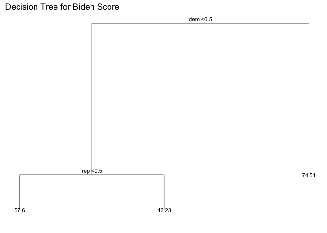

If someone is a democrat (dem = 1), then the tree predicts a biden score of 74.5. Otherwise, if someone is not a democrat, then we go to the next branch. If someone is not republican (i.e an independent in this case), then the tree predicts a biden score of 43.2, otherwise (if they are a republican), the tree predicts a biden score of 57.6.

The test MSE is 406.

1.  Now fit another tree to the training data with the following `control` options. Use cross-testation to determine the optimal level of tree complexity, plot the optimal tree, and interpret the results. Does pruning the tree improve the test MSE?

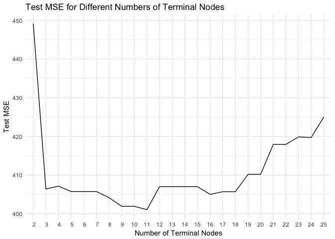

Looking at the graph, the minimum cross-testated test MSE occurs for 11 terminal nodes.

Pruning the tree helps a dramatic reduce of the test MSE. The original tree had 192 terminal nodes with a test MSE of 481, while the optimal tree only has 11 terminal nodes with a test MSE of 401.

Ploting optimal tree 

1.  Use the bagging approach to analyze this data. What test MSE do you obtain? Obtain variable importance measures and interpret the results.

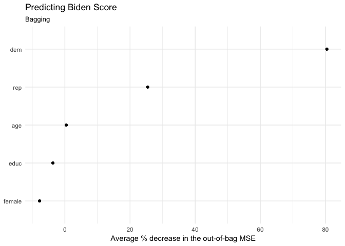

    ## [1] 484

Bagging returns a higher MSE of 484 (when setting seed to 1234). From the above plot of variable importance, we can see that Dem and Rep are the top two important predictors, and on the contrary, age is the most trivial that almost have no influence on out-of-bag MSE. In particular, education and gender will increase the MSE.

1.  Use the random forest approach to analyze this data. What test MSE do you obtain? Obtain variable importance measures and interpret the results. Describe the effect of *m*, the number of variables considered at each split, on the error rate obtained.

<!-- -->

    ## 
    ## Call:
    ##  randomForest(formula = biden ~ ., data = biden_split$train, importance = TRUE) 
    ##                Type of random forest: regression
    ##                      Number of trees: 500
    ## No. of variables tried at each split: 1
    ## 
    ##           Mean of squared residuals: 404
    ##                     % Var explained: 26

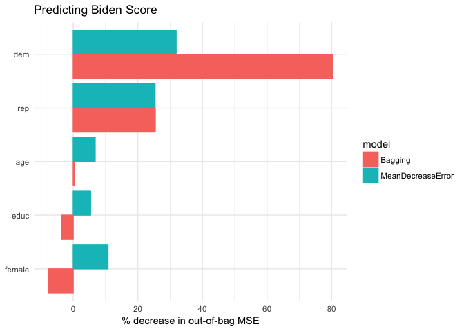

    ## [1] 410

MSE is now 409, which is much smaller than using bagging method(484). Thus we conclude that random forests indeed improves upon bagging by avoiding using single dominant predictor in the dataset.

Dem and Rep are still the most important variables, but there sees a significant drop in the importance of 'dem'.

From the plot above, when number of variables considered at each split equals to 2 the test MSE is the lowest. The higher the m, the more trees tend to be correlated thus the higher the MSE, as the result, averaging across the trees will not substantially reduce variance.

1.  Use the boosting approach to analyze the data. What test MSE do you obtain? How does the value of the shrinkage parameter *λ* influence the test MSE?

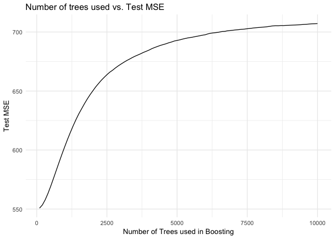

MSE is now 551, which is much higher than any of the previous test MSEs. test MSE as a function of the number of trees used in Boosting. And surprisingly, according to my plot, the more number of trees used in boosting, the larger the test MSE.

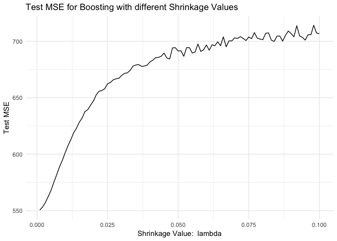

From the graph above, the lower the shrinkage value *λ*, the lower the test MSE.

Part 2: Modeling voter turnout \[3 points\]
===========================================

1.  Use cross-testation techniques and standard measures of model fit (e.g. test error rate, PRE, ROC curves/AUC) to compare and evaluate at least five tree-based models of voter turnout. Select the best model and interpret the results using whatever methods you see fit (graphs, tables, model fit statistics, predictions for hypothetical observations, etc.)

I chose 1) decision tree with no control value, 2) pruned decision tree with optimal number of terminal nodes, 3) bagging approach, 4) normal random forest, and and 5) random forest with optimal m. I here list the error rate for each of these models and plot their ROC curves to compare AUC.

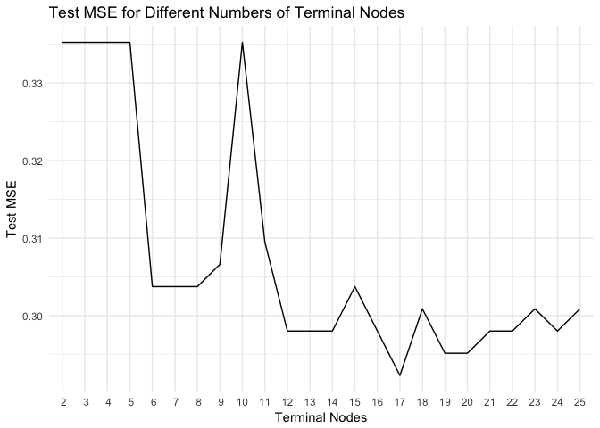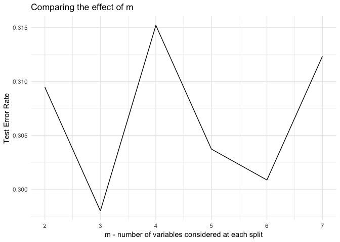

| objects | normaltree | prunedtree | bagging | normalrf | optrf |
|:-------:|:----------:|:----------:|:-------:|:--------:|:-----:|
|   err   |    0.304   |    0.304   |  0.301  |   0.307  | 0.292 |

The Optimal Random forest appears to have the lowest test MSE and the second highest AUC so I use this to predict test data.

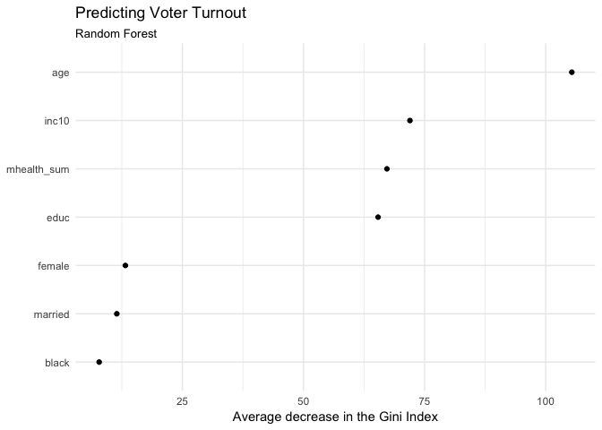

By plotting variable importance we can see age is the most important predictor for voter turnout; subsequently, family income, respondent's mental health and number of years of education also have significant effect on Gini index. On the contrary, gender, marriage and race have relatively small influence on voting pattern.

1.  Use cross-testation techniques and standard measures of model fit (e.g. test error rate, PRE, ROC curves/AUC) to compare and evaluate at least five SVM models of voter turnout. Select the best model and interpret the results using whatever methods you see fit (graphs, tables, model fit statistics, predictions for hypothetical observations, etc.)

I chose 1)linear kernel 2) 1-degree polynomial, 3) 2-degree polynomial, 4) 3-degree polynomial, and 5) radial kernel as my five SVM models. The table below illustrates the cost and error for each model.

|   objects  | linear | 2-degree poly | 3-degree poly | 4-degree poly | radial |
|:----------:|:------:|:-------------:|:-------------:|:-------------:|:------:|
|    cost    |  1.000 |     1.000     |     1.000     |     10.000    | 10.000 |
| error rate |  0.286 |     0.287     |     0.303     |     0.299     |  0.283 |

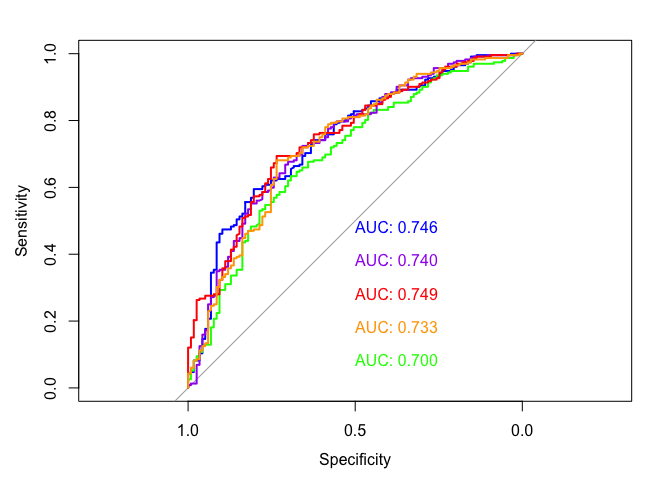

By plotting ROC curves for each model, we can see the third degree polynomial kernel has the largest AUC yet its corresponding error rate is also the highest. Thus I go to the next largest AUC owner - the linear kernel - who has a relatively small error rate according to the table above to fit the test data:

    ## 
    ## Call:
    ## best.tune(method = svm, train.x = vote96 ~ ., data = as_tibble(mh_split$train), 
    ##     ranges = list(cost = c(0.001, 0.01, 0.1, 1, 5, 10, 100)), 
    ##     kernel = "linear")
    ## 
    ## 
    ## Parameters:
    ##    SVM-Type:  C-classification 
    ##  SVM-Kernel:  linear 
    ##        cost:  1 
    ##       gamma:  0.125 
    ## 
    ## Number of Support Vectors:  508

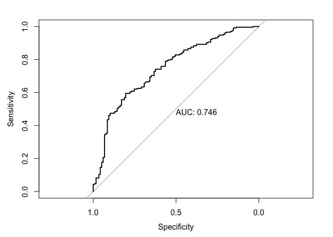

Part 3: OJ Simpson \[4 points\]
===============================

1.  What is the relationship between race and belief of OJ Simpson's guilt? Develop a robust statistical learning model and use this model to explain the impact of an individual's race on their beliefs about OJ Simpson's guilt.

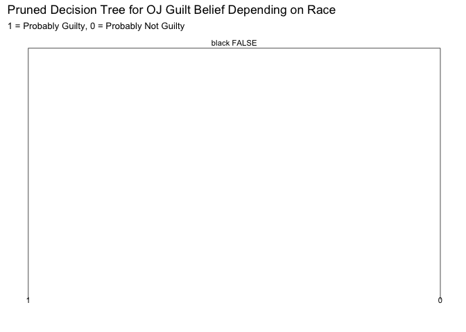

From the above decision tree, non-black are likely to think OJ is guilty (1), and blacks tend to think he is not guilty (0).

1.  How can you predict whether individuals believe OJ Simpson to be guilty of these murders?

I here evaluate logistic regression, optimal tree, linear SVM, polynomial SVM and radial SVM using cross-validation. Below are the error rates table and ROC curves of the models.

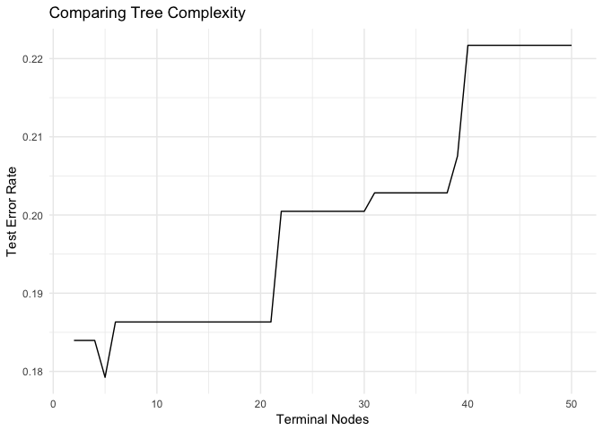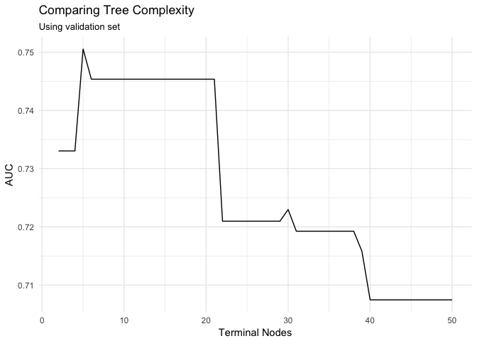

|   objects  | logisitic | decision tree | linear-SVM | poly-SVM | radial-SVM |
|:----------:|:---------:|:-------------:|:----------:|:--------:|:----------:|
| error rate |   0.182   |     0.179     |    0.185   |   0.195  |    0.185   |

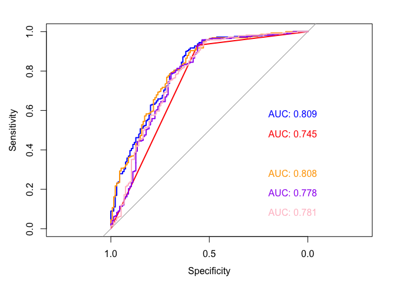

Decision tree and logistic regression both appear to have lowe error rate and larger AUC. I will use both of them to do prediction.

    ## 
    ## Call:
    ## glm(formula = guilt ~ ., family = binomial, data = as_tibble(oj_split$train))
    ## 
    ## Deviance Residuals: 
    ##    Min      1Q  Median      3Q     Max  
    ## -2.510  -0.529   0.516   0.666   2.167  
    ## 
    ## Coefficients:
    ##                                      Estimate Std. Error z value Pr(>|z|)
    ## (Intercept)                           0.99601    0.42024    2.37   0.0178
    ## dem1                                 -0.08888    0.28095   -0.32   0.7517
    ## rep1                                  0.24558    0.29039    0.85   0.3977
    ## age                                   0.01871    0.00517    3.62   0.0003
    ## educHIGH SCHOOL GRAD                 -0.29730    0.22455   -1.32   0.1855
    ## educNOT A HIGH SCHOOL GRAD           -0.67783    0.33693   -2.01   0.0442
    ## educREFUSED                          13.59817  471.15969    0.03   0.9770
    ## educSOME COLLEGE(TRADE OR BUSINESS)  -0.02299    0.24226   -0.09   0.9244
    ## female1                              -0.33523    0.17840   -1.88   0.0602
    ## black1                               -2.88446    0.22904  -12.59   <2e-16
    ## hispanic1                            -0.12167    0.31869   -0.38   0.7026
    ## income$30,000-$50,000                -0.05823    0.22884   -0.25   0.7991
    ## income$50,000-$75,000                 0.16567    0.29300    0.57   0.5718
    ## incomeOVER $75,000                    0.77818    0.39775    1.96   0.0504
    ## incomeREFUSED/NO ANSWER              -1.13843    0.36141   -3.15   0.0016
    ## incomeUNDER $15,000                  -0.40706    0.28408   -1.43   0.1519
    ##                                        
    ## (Intercept)                         *  
    ## dem1                                   
    ## rep1                                   
    ## age                                 ***
    ## educHIGH SCHOOL GRAD                   
    ## educNOT A HIGH SCHOOL GRAD          *  
    ## educREFUSED                            
    ## educSOME COLLEGE(TRADE OR BUSINESS)    
    ## female1                             .  
    ## black1                              ***
    ## hispanic1                              
    ## income$30,000-$50,000                  
    ## income$50,000-$75,000                  
    ## incomeOVER $75,000                  .  
    ## incomeREFUSED/NO ANSWER             ** 
    ## incomeUNDER $15,000                    
    ## ---
    ## Signif. codes:  0 '***' 0.001 '**' 0.01 '*' 0.05 '.' 0.1 ' ' 1
    ## 
    ## (Dispersion parameter for binomial family taken to be 1)
    ## 
    ##     Null deviance: 1229.06  on 991  degrees of freedom
    ## Residual deviance:  893.67  on 976  degrees of freedom
    ## AIC: 925.7
    ## 
    ## Number of Fisher Scoring iterations: 13

From logistic regression, age and race are the most significant predictors. In particular, age has a positive relationship in believing OJ is guilty whereas blackness has a negative impact on it, meaning, the older the responser is, the more likely he/she believes OJ is guilty; on the other hand, if the responser is black, he/she tend not to believe so.

Unsurprisingly, the decision tree, confirms that race is the most important predictor. African-americans, however old or educated, would tend to believe OJ. While most of over 37.5 years old non-blacks will tend to think OJ is guilty (guilt = 1), over 78.5 years old non-republicans tend to believe OJ is not guilty.
