Problem set \#9: nonparametric methods and unsupervised learning
================
Weijia Li

-   [Attitudes towards feminists \[3 points\]](#attitudes-towards-feminists-3-points)
    -   [Split the data into a training and test set (70/30%).](#split-the-data-into-a-training-and-test-set-7030.)
    -   [Calculate the test MSE for KNN models with *K* = 5, 10, 15, …, 100, using whatever combination of variables you see fit. Which model produces the lowest test MSE?](#calculate-the-test-mse-for-knn-models-with-k-5-10-15-dots-100-using-whatever-combination-of-variables-you-see-fit.-which-model-produces-the-lowest-test-mse)
    -   [Calculate the test MSE for weighted KNN models with *K* = 5, 10, 15, …, 100 using the same combination of variables as before. Which model produces the lowest test MSE?](#calculate-the-test-mse-for-weighted-knn-models-with-k-5-10-15-dots-100-using-the-same-combination-of-variables-as-before.-which-model-produces-the-lowest-test-mse)
    -   [Compare the test MSE for the best KNN/wKNN model(s) to the test MSE for the equivalent linear regression, decision tree, boosting, and random forest methods using the same combination of variables as before. Which performs the best? Why do you think this method performed the best, given your knowledge of how it works?](#compare-the-test-mse-for-the-best-knnwknn-models-to-the-test-mse-for-the-equivalent-linear-regression-decision-tree-boosting-and-random-forest-methods-using-the-same-combination-of-variables-as-before.-which-performs-the-best-why-do-you-think-this-method-performed-the-best-given-your-knowledge-of-how-it-works)
-   [Voter turnout and depression \[2 points\]](#voter-turnout-and-depression-2-points)
    -   [Split the data into a training and test set (70/30).](#split-the-data-into-a-training-and-test-set-7030.-1)
    -   [Calculate the test error rate for KNN models with *K* = 1, 2, …, 10, using whatever combination of variables you see fit. Which model produces the lowest test MSE?](#calculate-the-test-error-rate-for-knn-models-with-k-12dots10-using-whatever-combination-of-variables-you-see-fit.-which-model-produces-the-lowest-test-mse)
    -   [Calculate the test error rate for weighted KNN models with *K* = 1, 2, …, 10 using the same combination of variables as before. Which model produces the lowest test error rate?](#calculate-the-test-error-rate-for-weighted-knn-models-with-k-12dots10-using-the-same-combination-of-variables-as-before.-which-model-produces-the-lowest-test-error-rate)
    -   [Compare the test error rate for the best KNN/wKNN model(s) to the test error rate for the equivalent logistic regression, decision tree, boosting, random forest, and SVM methods using the same combination of variables as before. Which performs the best? Why do you think this method performed the best, given your knowledge of how it works?](#compare-the-test-error-rate-for-the-best-knnwknn-models-to-the-test-error-rate-for-the-equivalent-logistic-regression-decision-tree-boosting-random-forest-and-svm-methods-using-the-same-combination-of-variables-as-before.-which-performs-the-best-why-do-you-think-this-method-performed-the-best-given-your-knowledge-of-how-it-works)
-   [Colleges \[2 points\]](#colleges-2-points)
-   [Clustering states \[3 points\]](#clustering-states-3-points)
    -   [Perform PCA on the dataset and plot the observations on the first and second principal components.](#perform-pca-on-the-dataset-and-plot-the-observations-on-the-first-and-second-principal-components.)
    -   [Perform *K*-means clustering with *K* = 2. Plot the observations on the first and second principal components and color-code each state based on their cluster membership. Describe your results.](#perform-k-means-clustering-with-k2.-plot-the-observations-on-the-first-and-second-principal-components-and-color-code-each-state-based-on-their-cluster-membership.-describe-your-results.)
    -   [Perform *K*-means clustering with *K* = 4. Plot the observations on the first and second principal components and color-code each state based on their cluster membership. Describe your results.](#perform-k-means-clustering-with-k4.-plot-the-observations-on-the-first-and-second-principal-components-and-color-code-each-state-based-on-their-cluster-membership.-describe-your-results.)
    -   [Perform *K*-means clustering with *K* = 3. Plot the observations on the first and second principal components and color-code each state based on their cluster membership. Describe your results.](#perform-k-means-clustering-with-k3.-plot-the-observations-on-the-first-and-second-principal-components-and-color-code-each-state-based-on-their-cluster-membership.-describe-your-results.)
    -   [Perform *K*-means clustering with *K* = 3 on the first two principal components score vectors, rather than the raw data. Describe your results and compare them to the clustering results with *K* = 3 based on the raw data.](#perform-k-means-clustering-with-k3-on-the-first-two-principal-components-score-vectors-rather-than-the-raw-data.-describe-your-results-and-compare-them-to-the-clustering-results-with-k3-based-on-the-raw-data.)
    -   [Using hierarchical clustering with complete linkage and Euclidean distance, cluster the states.](#using-hierarchical-clustering-with-complete-linkage-and-euclidean-distance-cluster-the-states.)
    -   [Cut the dendrogram at a height that results in three distinct clusters. Which states belong to which clusters?](#cut-the-dendrogram-at-a-height-that-results-in-three-distinct-clusters.-which-states-belong-to-which-clusters)
    -   [Hierarchically cluster the states using complete linkage and Euclidean distance, after scaling the variables to have standard deviation 1. What effect does scaling the variables have on the hierarchical clustering obtained? In your opinion, should the variables be scaled before the inter-observation dissimilarities are computed? Provide a justification for your answer.](#hierarchically-cluster-the-states-using-complete-linkage-and-euclidean-distance-after-scaling-the-variables-to-have-standard-deviation-1.-what-effect-does-scaling-the-variables-have-on-the-hierarchical-clustering-obtained-in-your-opinion-should-the-variables-be-scaled-before-the-inter-observation-dissimilarities-are-computed-provide-a-justification-for-your-answer.)

Attitudes towards feminists \[3 points\]
========================================

#### Split the data into a training and test set (70/30%).

#### Calculate the test MSE for KNN models with *K* = 5, 10, 15, …, 100, using whatever combination of variables you see fit. Which model produces the lowest test MSE?

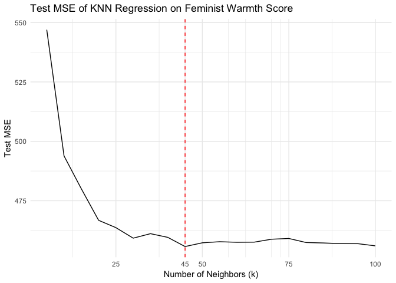

With all predictors use, minimum MSE is at 45 neighbors in KNN Regression.

#### Calculate the test MSE for weighted KNN models with *K* = 5, 10, 15, …, 100 using the same combination of variables as before. Which model produces the lowest test MSE?

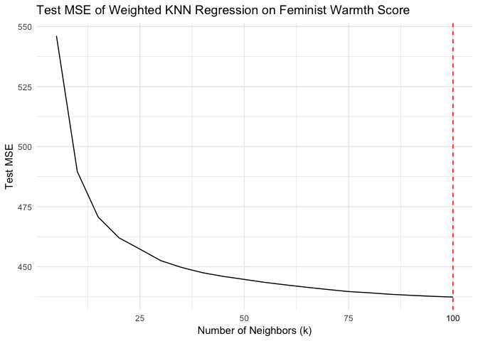

Test MSE is monotonically decreasing with k and the minimum MSE now at 100 neighbors in KNN Regression.

#### Compare the test MSE for the best KNN/wKNN model(s) to the test MSE for the equivalent linear regression, decision tree, boosting, and random forest methods using the same combination of variables as before. Which performs the best? Why do you think this method performed the best, given your knowledge of how it works?

    ## $min_mse
    ## [1] 435
    ## 
    ## $min_mse_model
    ## [1] "Linear Regression (lm) "

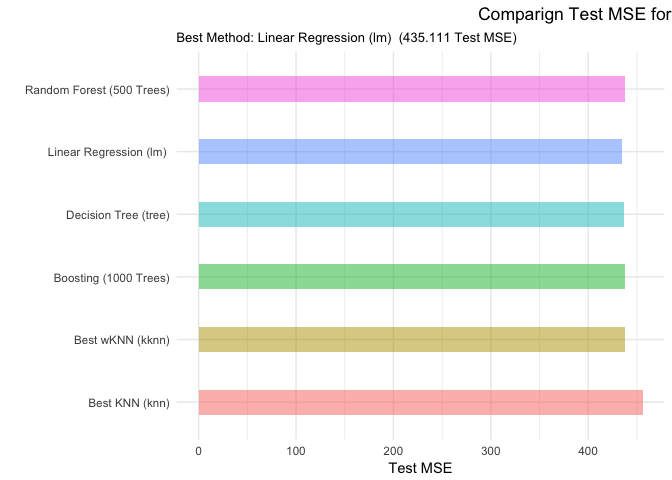

Linear regression has the lowest MSE of 435. But the numbers of linear regression, weighted KNN, Boosting with 1000 trees and random forest with 500 trees varies little around 435.

Voter turnout and depression \[2 points\]
=========================================

Estimate a series of models explaining/predicting voter turnout.

#### Split the data into a training and test set (70/30).

#### Calculate the test error rate for KNN models with *K* = 1, 2, …, 10, using whatever combination of variables you see fit. Which model produces the lowest test MSE?

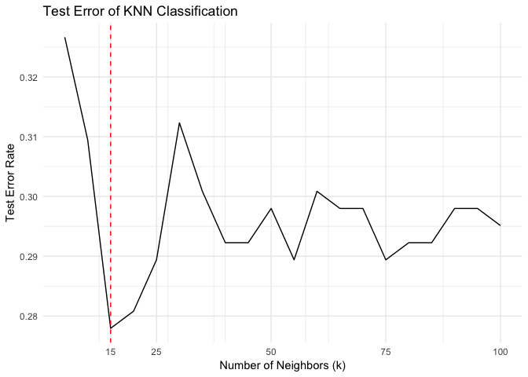

With all predictors used, when k equals to 15 the test error is minimum.

#### Calculate the test error rate for weighted KNN models with *K* = 1, 2, …, 10 using the same combination of variables as before. Which model produces the lowest test error rate?

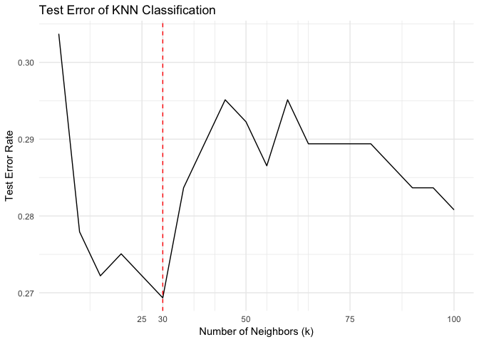

Minimum Test Error Rate now at 30 neighbors.

#### Compare the test error rate for the best KNN/wKNN model(s) to the test error rate for the equivalent logistic regression, decision tree, boosting, random forest, and SVM methods using the same combination of variables as before. Which performs the best? Why do you think this method performed the best, given your knowledge of how it works?

    ## $min_test_err
    ## [1] 0.269
    ## 
    ## $min_test_err_model_name
    ## [1] "Best wKNN (kknn)"

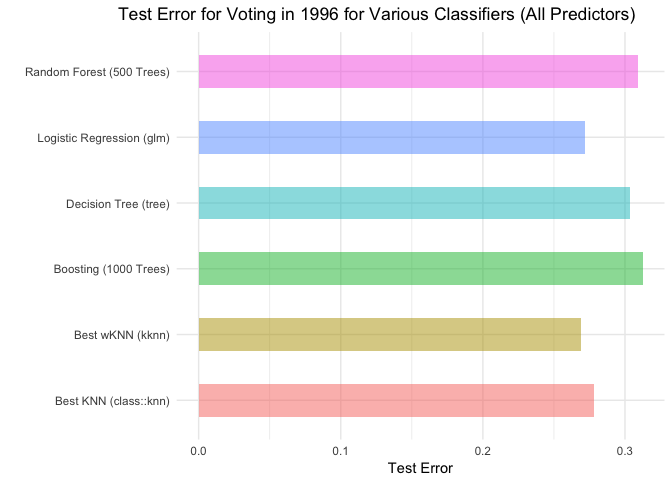

Weighted KNN has the minimum test error of 0.269. This may due to the fact that wKNN weights the nearest k in the training sample to make a prediction

Colleges \[2 points\]
=====================

Perform PCA analysis on the college dataset and plot the first two principal components. Describe the results. What variables appear strongly correlated on the first principal component? What about the second principal component?

    ## Importance of components:
    ##                          PC1   PC2    PC3    PC4   PC5    PC6    PC7
    ## Standard deviation     2.337 2.249 1.0907 1.0277 0.967 0.9210 0.7852
    ## Proportion of Variance 0.303 0.281 0.0661 0.0587 0.052 0.0471 0.0343
    ## Cumulative Proportion  0.303 0.584 0.6503 0.7090 0.761 0.8081 0.8423
    ##                           PC8    PC9   PC10   PC11   PC12   PC13    PC14
    ## Standard deviation     0.7666 0.7294 0.6402 0.5982 0.5541 0.4308 0.40935
    ## Proportion of Variance 0.0326 0.0296 0.0228 0.0199 0.0171 0.0103 0.00931
    ## Cumulative Proportion  0.8750 0.9045 0.9273 0.9472 0.9642 0.9745 0.98385
    ##                           PC15    PC16  PC17    PC18
    ## Standard deviation     0.37910 0.29649 0.190 0.15159
    ## Proportion of Variance 0.00798 0.00488 0.002 0.00128
    ## Cumulative Proportion  0.99184 0.99672 0.999 1.00000

The first two principal components account for 58.4% of the variance of the data. From the bi-plot, more universities have negative values of the principal components.

    ## [1] "First Principal Component"

    ##     Private        Apps      Accept      Enroll   Top10perc   Top25perc 
    ##     -0.0890     -0.1996     -0.1538     -0.1178     -0.3603     -0.3448 
    ## F.Undergrad P.Undergrad    Outstate  Room.Board       Books    Personal 
    ##     -0.0941      0.0175     -0.3277     -0.2665     -0.0572      0.0719 
    ##         PhD    Terminal   S.F.Ratio perc.alumni      Expend   Grad.Rate 
    ##     -0.3033     -0.3039      0.2103     -0.2367     -0.3330     -0.2731

    ## [1] "Second Principal Component"

    ##     Private        Apps      Accept      Enroll   Top10perc   Top25perc 
    ##      0.3459     -0.3436     -0.3726     -0.3997      0.0162     -0.0177 
    ## F.Undergrad P.Undergrad    Outstate  Room.Board       Books    Personal 
    ##     -0.4107     -0.2931      0.1915      0.0940     -0.0573     -0.1928 
    ##         PhD    Terminal   S.F.Ratio perc.alumni      Expend   Grad.Rate 
    ##     -0.1162     -0.1042     -0.2044      0.1941      0.0703      0.1178

Clustering states \[3 points\]
==============================

#### Perform PCA on the dataset and plot the observations on the first and second principal components.

The first principal component roughly corresponds to level of violent crime, and the second roughly corresponds with urban population.

#### Perform *K*-means clustering with *K* = 2. Plot the observations on the first and second principal components and color-code each state based on their cluster membership. Describe your results.

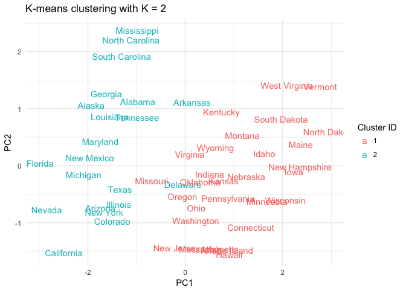

The plot shows a clear grouping of States. The clustering is a split on the first component vector, mostly the 1st Cluster ID states have lower violent crimes rate (Rape, Murder, and Assault) than those in the 2nd Cluster ID.

#### Perform *K*-means clustering with *K* = 4. Plot the observations on the first and second principal components and color-code each state based on their cluster membership. Describe your results.

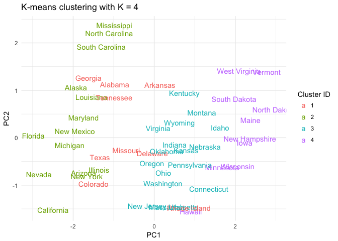

This graph shows 4 clear clusters. Again, the differences between the clusters are mostly on the first principal component.

#### Perform *K*-means clustering with *K* = 3. Plot the observations on the first and second principal components and color-code each state based on their cluster membership. Describe your results.

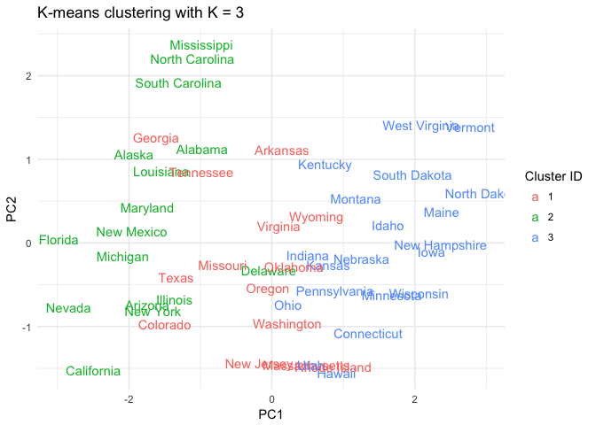

The graph shows 3 clusters, yet the second cluster mingles with the other two.

#### Perform *K*-means clustering with *K* = 3 on the first two principal components score vectors, rather than the raw data. Describe your results and compare them to the clustering results with *K* = 3 based on the raw data.

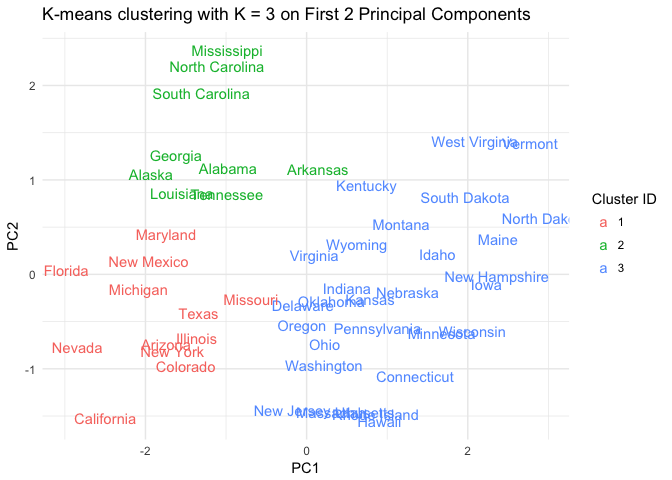

This graph shows 3 distinct clusters. Unlike previous graphs, the clusters also split on the 2nd principal componet rather than solely on the 1st principal component, more like the distribution seen on biplot of (PC1, PC2).

#### Using hierarchical clustering with complete linkage and Euclidean distance, cluster the states.

#### Cut the dendrogram at a height that results in three distinct clusters. Which states belong to which clusters?

    ## [1] "states belong to cluster 1:"

    ##  [1] "Alabama"        "Alaska"         "Arizona"        "California"    
    ##  [5] "Delaware"       "Florida"        "Illinois"       "Louisiana"     
    ##  [9] "Maryland"       "Michigan"       "Mississippi"    "Nevada"        
    ## [13] "New Mexico"     "New York"       "North Carolina" "South Carolina"

    ## [1] "states belong to cluster 2:"

    ##  [1] "Arkansas"      "Colorado"      "Georgia"       "Massachusetts"
    ##  [5] "Missouri"      "New Jersey"    "Oklahoma"      "Oregon"       
    ##  [9] "Rhode Island"  "Tennessee"     "Texas"         "Virginia"     
    ## [13] "Washington"    "Wyoming"

    ## [1] "states belong to cluster 3:"

    ##  [1] "Connecticut"   "Hawaii"        "Idaho"         "Indiana"      
    ##  [5] "Iowa"          "Kansas"        "Kentucky"      "Maine"        
    ##  [9] "Minnesota"     "Montana"       "Nebraska"      "New Hampshire"
    ## [13] "North Dakota"  "Ohio"          "Pennsylvania"  "South Dakota" 
    ## [17] "Utah"          "Vermont"       "West Virginia" "Wisconsin"

#### Hierarchically cluster the states using complete linkage and Euclidean distance, after scaling the variables to have standard deviation 1. What effect does scaling the variables have on the hierarchical clustering obtained? In your opinion, should the variables be scaled before the inter-observation dissimilarities are computed? Provide a justification for your answer.

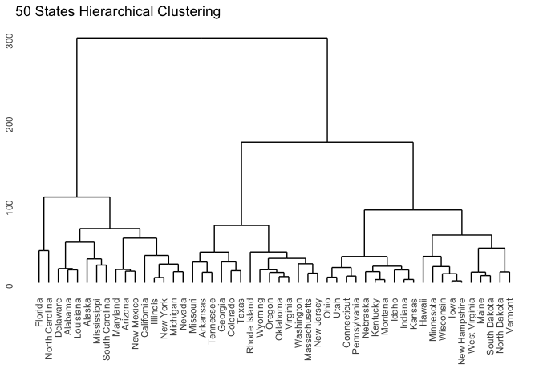

1.  Scaling the variables makes the Euclidean distance from the complete linkage method much smaller.
2.  The clusterings are different.

Larger standard deviation will overweight the variables, thus I would suggest the variables to be scaled before inter-observation dissimilarities are computed unless all variables are given the same standard deviation.
