PS7: Resampling and nonlinearity
================
Ningyin Xu
2/23/2017

-   [Part 1: Joe Biden](#part-1-joe-biden)
    -   [Problem 1. Traditional Approach](#problem-1.-traditional-approach)
    -   [Problem 2. Validation Set Approach](#problem-2.-validation-set-approach)
    -   [Problem 3. Validation Set Approach - 100 times](#problem-3.-validation-set-approach---100-times)
    -   [Problem 4. LOOCV Approach](#problem-4.-loocv-approach)
    -   [Problem 5. 10-fold Cross-validation Approach](#problem-5.-10-fold-cross-validation-approach)
    -   [Problem 6. 10-fold Cross-validation Approach 100 times](#problem-6.-10-fold-cross-validation-approach-100-times)
    -   [Problem 7. Bootstrap](#problem-7.-bootstrap)
-   [Part 2: College (bivariate)](#part-2-college-bivariate)
    -   [Predictor 1. Room and board costs.](#predictor-1.-room-and-board-costs.)
    -   [Predictor 2. Instructional expenditure per student](#predictor-2.-instructional-expenditure-per-student)
    -   [Predictor 3. Graduation rate](#predictor-3.-graduation-rate)
-   [Part 3: College (GAM)](#part-3-college-gam)
    -   [Problem 1. Split the data](#problem-1.-split-the-data)
    -   [Problem 2. OLS](#problem-2.-ols)
    -   [Problem 3. GAM](#problem-3.-gam)
    -   [Problem 4. Testing Model Performance](#problem-4.-testing-model-performance)
    -   [Problem 5. Non-linear Relationship](#problem-5.-non-linear-relationship)

Part 1: Joe Biden
=================

Problem 1. Traditional Approach
-------------------------------

    ## 
    ## ===============================================
    ##                         Dependent variable:    
    ##                     ---------------------------
    ##                                biden           
    ## -----------------------------------------------
    ## age                           0.048*           
    ##                               (0.028)          
    ##                                                
    ## female                       4.103***          
    ##                               (0.948)          
    ##                                                
    ## educ                          -0.345*          
    ##                               (0.195)          
    ##                                                
    ## dem                          15.424***         
    ##                               (1.068)          
    ##                                                
    ## rep                         -15.850***         
    ##                               (1.311)          
    ##                                                
    ## Constant                     58.811***         
    ##                               (3.124)          
    ##                                                
    ## -----------------------------------------------
    ## Observations                   1,807           
    ## R2                             0.282           
    ## Adjusted R2                    0.280           
    ## Residual Std. Error     19.914 (df = 1801)     
    ## F Statistic          141.150*** (df = 5; 1801) 
    ## ===============================================
    ## Note:               *p<0.1; **p<0.05; ***p<0.01

    ## [1] 395.2702

Using the entire dataset as training and testing set, the mean squared error is 395.27.

Problem 2. Validation Set Approach
----------------------------------

    ## [1] 399.8303

After spliting the dataset to training set and testing set, the MSE becomes larger: 399.83. This is reasonable since the model only fits on the training data and could not generalize the observations outside the traininng set so well comparing to the model fits on the whole dataset.

Problem 3. Validation Set Approach - 100 times
----------------------------------------------

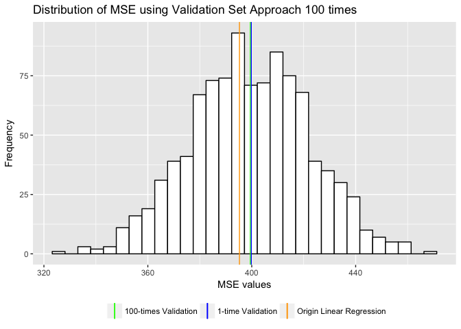

    ## [1] 399.4548

The histogram above shows the frequency of MSE values from running the validation set approach 100 times with 100 different splits. MSE values mostly fall into the range (360, 440). The mean MSE value we got from this method is 399.45, slightly smaller than the value we got from only do validation once. Doing the validation approach 100 times and averaging the results avoid the bias brought by doing sampling process only once for training/test sets, although the values are very close.

Problem 4. LOOCV Approach
-------------------------

    ## [1] 397.9555

The mean MSE value is 397.96 now, it's smaller than the value we got before from the 100-times validation approach. This is because LOOCV is relatively steady since it doesn't depend on the sampling process for training/test sets. Although the standard deviation of all the mse\_loocv we got is larger since each MSE is highly dependent on which observation is held out.

Problem 5. 10-fold Cross-validation Approach
--------------------------------------------

    ## [1] 397.8837

Using 10-fold cross-validation approach, we got 397.88, the value is slightly smaller than leave-one-out approach but is close enough. Since this approach repeat the validation approach 10 times rather than 1807 times before, the flexibility decreases. However the computational efficiency increases.

Problem 6. 10-fold Cross-validation Approach 100 times
------------------------------------------------------

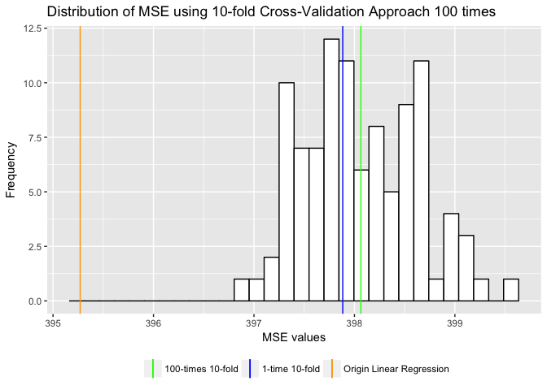

    ## [1] 398.0642

The MSE values are mostly in the range of (397, 399), the mean MSE value is 398.06. The values from 100 times are very close, unlike 100 values from validation set approach falling in the range (360, 440), 10-fold approach is steadier since it has already had randomness (independent of the dataset splitting process).

Problem 7. Bootstrap
--------------------

    ## # A tibble: 6 × 3
    ##          term     est.boot    se.boot
    ##         <chr>        <dbl>      <dbl>
    ## 1 (Intercept)  58.91756182 2.95872557
    ## 2         age   0.04770821 0.02873836
    ## 3         dem  15.43046545 1.09574547
    ## 4        educ  -0.34983254 0.19215462
    ## 5      female   4.08775648 0.96064834
    ## 6         rep -15.87295299 1.43674627

Recall the original model's outcome:

    ##                 Estimate Std. Error    t value     Pr(>|t|)
    ## (Intercept)  58.81125899  3.1244366  18.822996 2.694143e-72
    ## age           0.04825892  0.0282474   1.708438 8.772744e-02
    ## female        4.10323009  0.9482286   4.327258 1.592601e-05
    ## educ         -0.34533479  0.1947796  -1.772952 7.640571e-02
    ## dem          15.42425563  1.0680327  14.441745 8.144928e-45
    ## rep         -15.84950614  1.3113624 -12.086290 2.157309e-32

As one can tell, the estimates from bootstrap are very close to the original model. The standard deviation differs among variables, some are slightly larger, some are smaller since bootstrap doesn't rely on distributional assumptions and gives us a more robust estimate.

Part 2: College (bivariate)
===========================

Predictor 1. Room and board costs.
----------------------------------

From common sense, room and board costs and tuition have direct relationship, so \(Room.Board\) is the first predictor I chose.

    ## 
    ## ===============================================
    ##                         Dependent variable:    
    ##                     ---------------------------
    ##                              Outstate          
    ## -----------------------------------------------
    ## Room.Board                   2.400***          
    ##                               (0.100)          
    ##                                                
    ## Constant                      -17.445          
    ##                              (447.768)         
    ##                                                
    ## -----------------------------------------------
    ## Observations                    777            
    ## R2                             0.428           
    ## Adjusted R2                    0.427           
    ## Residual Std. Error    3,044.460 (df = 775)    
    ## F Statistic          580.017*** (df = 1; 775)  
    ## ===============================================
    ## Note:               *p<0.1; **p<0.05; ***p<0.01

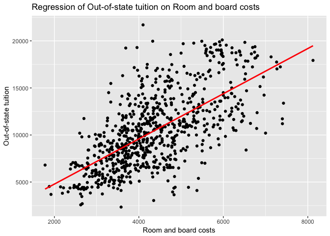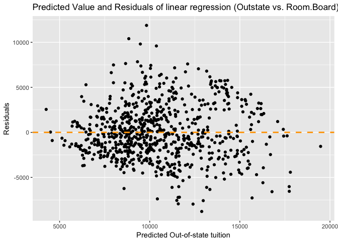

First I fitted a linear-regression model to the data. The model shows that Room.Board is significantly related to out-of-state tuition (with 95% significant level). And from two graphs above, one can tell the linear relationship can predict the relationship between out-of-state tuition and room-board cost well. The residuals seem to be randomly located around 0. To justify this, I use 10-fold cross-validation to see the MSE change between models with different order of Room-board cost.

The MSE of different orders shows that including the Room.board square would fit the data better. However, the difference between the MSE is not very large (comparing to the MSE size). From the first degree to second degree, the MSE only decreases -0.46%. Before including the square, let's see the results first.

    ## 
    ## ================================================
    ##                          Dependent variable:    
    ##                      ---------------------------
    ##                               Outstate          
    ## ------------------------------------------------
    ## poly(Room.Board, 2)1        73,321.380***       
    ##                              (3,037.357)        
    ##                                                 
    ## poly(Room.Board, 2)2        -6,534.815**        
    ##                              (3,037.357)        
    ##                                                 
    ## Constant                    10,440.670***       
    ##                               (108.965)         
    ##                                                 
    ## ------------------------------------------------
    ## Observations                     777            
    ## R2                              0.431           
    ## Adjusted R2                     0.430           
    ## Residual Std. Error     3,037.357 (df = 774)    
    ## F Statistic           293.681*** (df = 2; 774)  
    ## ================================================
    ## Note:                *p<0.1; **p<0.05; ***p<0.01

After adding the square term, the estimates changed a lot, yet they are all significant. However, the R-square, indicating the model's fitness, doesn't change too much. And from the graph one can see the 2-degree line is very close to the 1-degree straight line. It seems to me the 2-degree line fits the data better due to the effort on fitting several 'outlier' dots. And the estimates of 2-degree lines doesn't seem too reasonable when we use them to intepret the relationship between Room board cost and out-of-state tuition. So I decided to stick with 1-degree line.

Recall the results of the first model I use:

    ##               Estimate   Std. Error     t value     Pr(>|t|)
    ## (Intercept) -17.445254 447.76785808 -0.03896049 9.689319e-01
    ## Room.Board    2.400012   0.09965361 24.08354107 4.135091e-96

There is a positive relationship between Room-board cost and Out-of-state tuition. With one unit increase in room-board cost, the out-of-state tuition would increase about 2.4 unit.

Predictor 2. Instructional expenditure per student
--------------------------------------------------

Another factor that could influence tution is the instructional expenditure per student. With higher instructional expenditure, one would expect higher tuition.

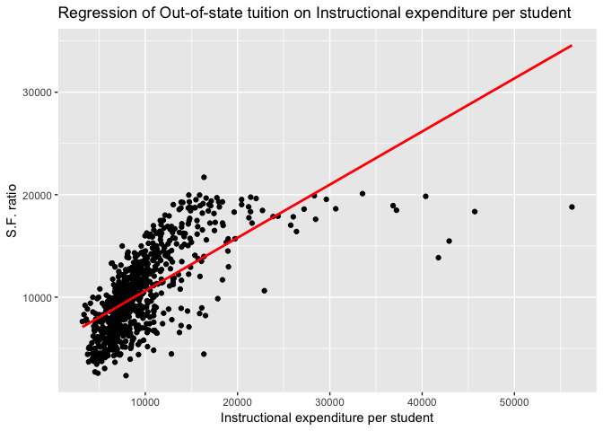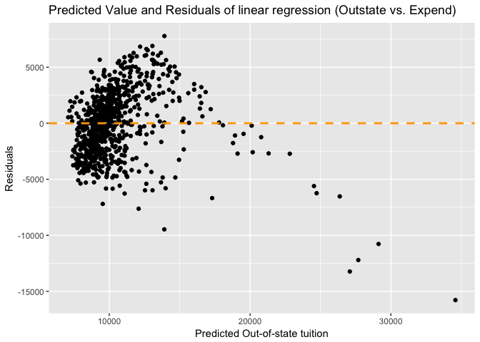

From the simplest regression of tuition on instructional expenditure, we got two graphs above. One can clearly see this model couldn't explain the relationship too well. From the scatter point and Tukey and Mosteller's "Bulging Rule", it seems we could transform x to log x.

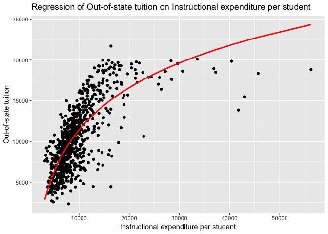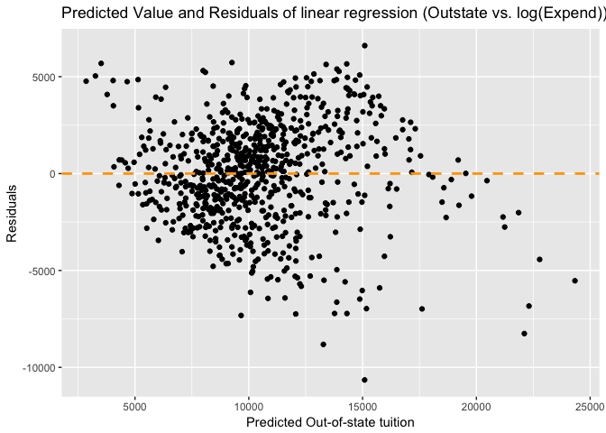

The line fits better and the residuals seem to be randomly located. To validate this model, I used 10-fold validation:

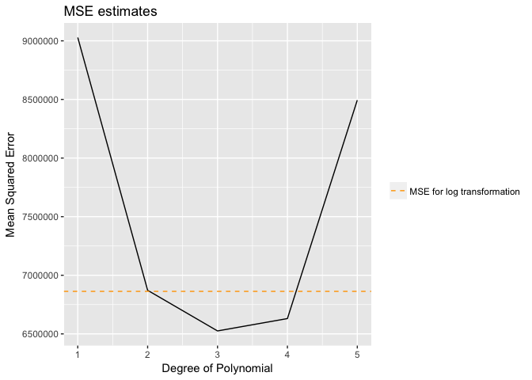

The 10-fold cross-validation between different degrees of polynomials and log transformation model shows that 3 or 4 degree of polynomial can actually generate lower estimate. However, from log transformation to 3 degree polynomial, the MSE decreases by only -0.05. I would stick with log transformation.

Recall the results of the log model:

    ##              Estimate Std. Error   t value      Pr(>|t|)
    ## (Intercept) -57502.04  2089.8876 -27.51442 8.347473e-117
    ## log(Expend)   7482.15   229.9153  32.54307 4.059156e-147

This means with one unit increase in log(Expend), the expected value will increase about 7482.15 unit. So for every one-unit change in instructional expenditure per student, we believe the expected value of out-of-state tuition will increase .

Predictor 3. Graduation rate
----------------------------

The third predictor I chose is graduation rate. Mainly because graduation rate can be seen as a measure of quality of the school, this is expected to be related to tuition, another measure of quality.

    ## 
    ## ===============================================
    ##                         Dependent variable:    
    ##                     ---------------------------
    ##                              Outstate          
    ## -----------------------------------------------
    ## Grad.Rate                   135.676***         
    ##                               (6.924)          
    ##                                                
    ## Constant                   1,569.395***        
    ##                              (467.976)         
    ##                                                
    ## -----------------------------------------------
    ## Observations                    776            
    ## R2                             0.332           
    ## Adjusted R2                    0.331           
    ## Residual Std. Error    3,293.174 (df = 774)    
    ## F Statistic          383.970*** (df = 1; 774)  
    ## ===============================================
    ## Note:               *p<0.1; **p<0.05; ***p<0.01

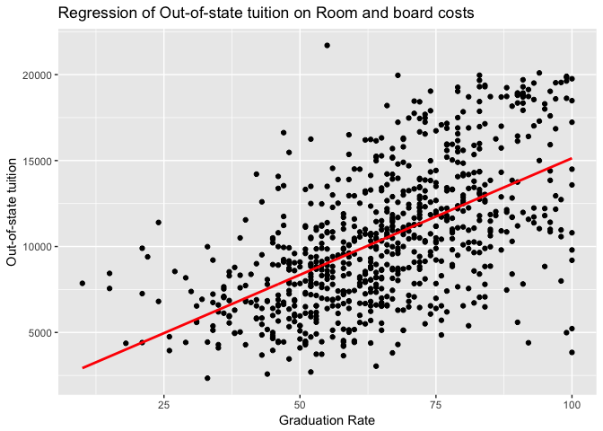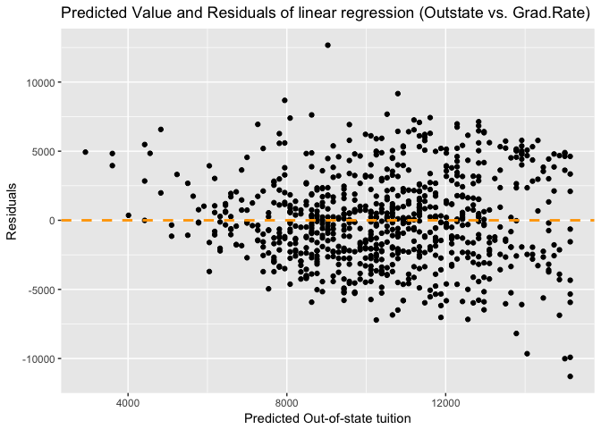

From the graphs above, one could see this simple linear regression model doesn't seem to perform so well. The residuals seem to have heteroscedastic variance. To improve my model, I plan to use splines. First I need to use cross-validation to choose number of knots and degree of the piecewise polynomial.

    ##          X1       X2       X3       X4        X5       X6       X7
    ## 1  10875974 10695991 10706778 10716255  10740827 10737054 10798749
    ## 2  10628976 10645930 10665623 10693880  10700240 10758594 10779767
    ## 3  10635899 10667098 10713693 10706837  10735935 10757692 10805331
    ## 4  10661972 10724157 10729831 10717343  10770994 10819609 10850358
    ## 5  10725980 10751000 10726824 10816475  10841111 10877307 10949973
    ## 6  10765932 10766943 10917694 10869587  10891637 11001799 11180797
    ## 7  10852911 11011724 10850717 10848759  10945146 10929447 11090270
    ## 8  11022088 10799878 10928291 10860053  11742085 13328038 30165428
    ## 9  10844442 11255066 10984537 17270126  21711489 60061621 30244669
    ## 10 11796253 11519684 32024877 35505535 103578054 32476633 22935879
    ##          X8       X9       X10
    ## 1  10794254 10793977  10787933
    ## 2  10783576 10780909  10800293
    ## 3  10822627 10853572  10881128
    ## 4  10876974 10890154  10921091
    ## 5  11070140 11136064  11134918
    ## 6  11069362 10924070  10968316
    ## 7  13957552 13464310  15202957
    ## 8  22075478 21848714  22878956
    ## 9  25182016 38812893  40697735
    ## 10 84179629 91649747 156947207

The above table shows the MSE of different polynomial degrees (row) and knots (column). The minimum value 1.062897610^{7} appears in the first column, second row, indicating we should use 2 degrees of polynomial and 1 knot.

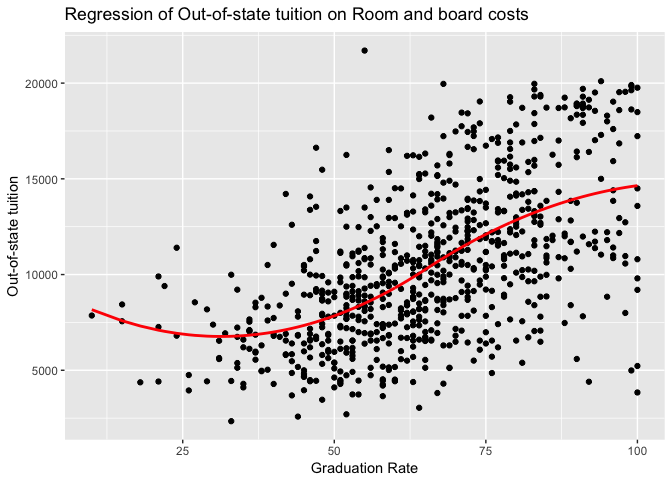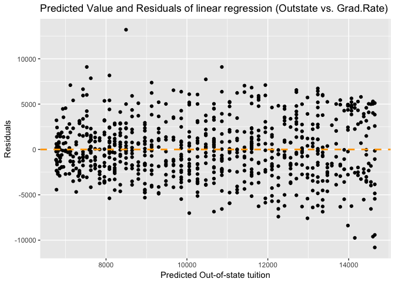

As one can see, now the line fits data very well, residuals are randomly located around 0. Before the knot (in this case, the value of the knot should be the median graduation rate that breaks the data into two parts), the out-of-state tuition has a 'reversed-U' shape relationship with graduation rate, i.e. first it decreases when graduation rate gets higher, but the decreasing speed is getting smaller, after the decreasing speed reaches 0, the out-of-state increases with graduation rate.

To sum up, the three predictors I chose, room and board costs, instructional expenditure per student, and graduation rate, all have statistically significant relationship with out-of-state tuition. While the room-board costs' relationship with it could be explained by a simple linear regression model, the instructional expenditure influence tuition in a exponential way, and graduation rate has a more completed relaionship with it (spline).

Part 3: College (GAM)
=====================

Problem 1. Split the data
-------------------------

Problem 2. OLS
--------------

    ## 
    ## ===============================================
    ##                         Dependent variable:    
    ##                     ---------------------------
    ##                              Outstate          
    ## -----------------------------------------------
    ## PrivateYes                 2,563.118***        
    ##                              (287.599)         
    ##                                                
    ## Room.Board                   0.819***          
    ##                               (0.122)          
    ##                                                
    ## PhD                          29.070***         
    ##                               (8.356)          
    ##                                                
    ## perc.alumni                  45.677***         
    ##                              (10.502)          
    ##                                                
    ## Expend                       0.274***          
    ##                               (0.029)          
    ##                                                
    ## Grad.Rate                    37.684***         
    ##                               (7.378)          
    ##                                                
    ## Constant                   -3,317.842***       
    ##                              (641.399)         
    ##                                                
    ## -----------------------------------------------
    ## Observations                    389            
    ## R2                             0.752           
    ## Adjusted R2                    0.749           
    ## Residual Std. Error    2,024.473 (df = 382)    
    ## F Statistic          193.466*** (df = 6; 382)  
    ## ===============================================
    ## Note:               *p<0.1; **p<0.05; ***p<0.01

As shown above, this model's R-square is 0.752, indicating it could explain about 75.2% of the variance in the training data. Without other comparison, this significance is okay. The 6 predictors and intercept are all significant. Being a private university would increse the tuition by 2563 dollars. With room-board costs increasing by 1 dollar, the out-of-state tuition would increase 0.819 dollar. Percent of faculty with Ph.D.'s also has a positive relationship with tuition, with this portion increasing 1 percent, tuition would get higher by 29 dollar. If the percent of alumni who donate increase by 1, the tuition would be 45.677 dollars more. The instructional expenditure per student would promote the tuition by 0.274 if it increase 1 unit. Finally, the graduation rate has positive influence on tuition, which would be 37.684 dollars more if the graduation rate increases by 1.

Problem 3. GAM
--------------

    ## 
    ## Call: gam(formula = Outstate ~ lo(PhD) + lo(perc.alumni) + log(Expend) + 
    ##     bs(Grad.Rate, degree = 2, df = 3) + Private + Room.Board, 
    ##     data = clg_split$train, na.action = na.fail)
    ## Deviance Residuals:
    ##      Min       1Q   Median       3Q      Max 
    ## -7108.90 -1229.71   -13.75  1284.98  4775.86 
    ## 
    ## (Dispersion Parameter for gaussian family taken to be 3787684)
    ## 
    ##     Null Deviance: 6323141044 on 388 degrees of freedom
    ## Residual Deviance: 1419246890 on 374.7004 degrees of freedom
    ## AIC: 7012.251 
    ## 
    ## Number of Local Scoring Iterations: 2 
    ## 
    ## Anova for Parametric Effects
    ##                                      Df     Sum Sq    Mean Sq F value
    ## lo(PhD)                             1.0  919988482  919988482 242.889
    ## lo(perc.alumni)                     1.0 1686371547 1686371547 445.225
    ## log(Expend)                         1.0 1261007095 1261007095 332.923
    ## bs(Grad.Rate, degree = 2, df = 3)   3.0  384744196  128248065  33.859
    ## Private                             1.0  358788834  358788834  94.725
    ## Room.Board                          1.0  125704961  125704961  33.188
    ## Residuals                         374.7 1419246890    3787684        
    ##                                      Pr(>F)    
    ## lo(PhD)                           < 2.2e-16 ***
    ## lo(perc.alumni)                   < 2.2e-16 ***
    ## log(Expend)                       < 2.2e-16 ***
    ## bs(Grad.Rate, degree = 2, df = 3) < 2.2e-16 ***
    ## Private                           < 2.2e-16 ***
    ## Room.Board                        1.747e-08 ***
    ## Residuals                                      
    ## ---
    ## Signif. codes:  0 '***' 0.001 '**' 0.01 '*' 0.05 '.' 0.1 ' ' 1
    ## 
    ## Anova for Nonparametric Effects
    ##                                   Npar Df  Npar F   Pr(F)  
    ## (Intercept)                                                
    ## lo(PhD)                               2.9 2.57290 0.05668 .
    ## lo(perc.alumni)                       2.4 0.64853 0.55323  
    ## log(Expend)                                                
    ## bs(Grad.Rate, degree = 2, df = 3)                          
    ## Private                                                    
    ## Room.Board                                                 
    ## ---
    ## Signif. codes:  0 '***' 0.001 '**' 0.01 '*' 0.05 '.' 0.1 ' ' 1

Based on my experience in Part 2, I used linear regression on Room.Board, log transformation on Expend, and spline with 3 degrees of freedom and 2 degrees polynomial on Grad.Rate. For other three predictors, I used local regression on PhD and perc.alumni, and simple linear regression on Private. The above table shows the results. From the p-value, one can tell all these variables are statistically significant. This is the same as OLS regression. To better present the relationship between these variables and the response, we need to plot.

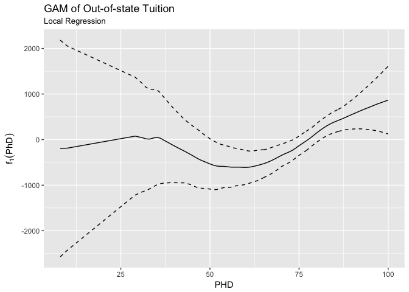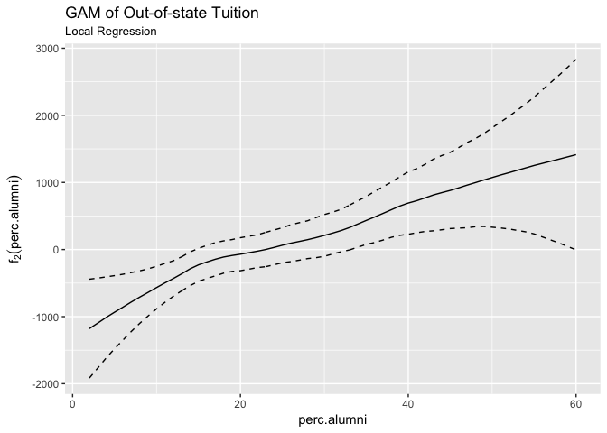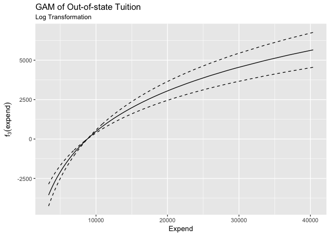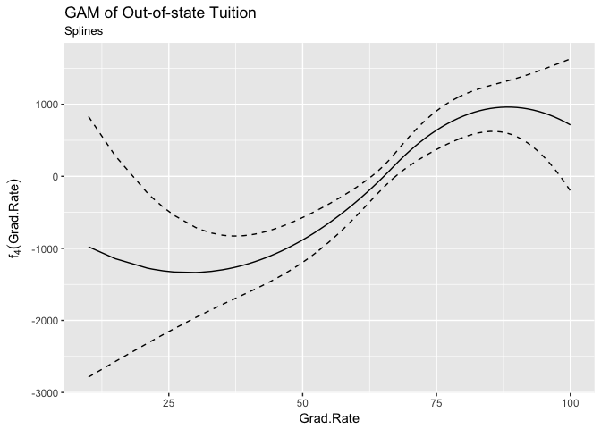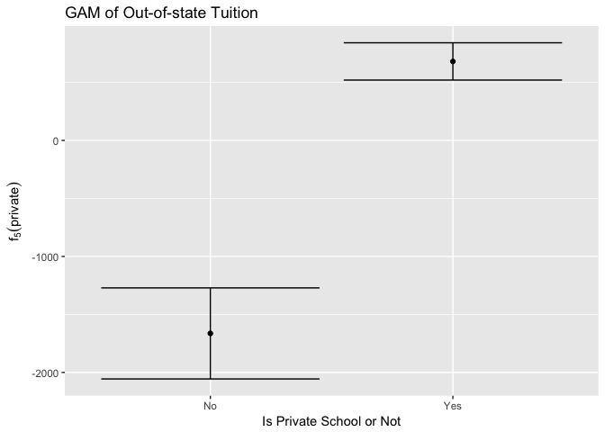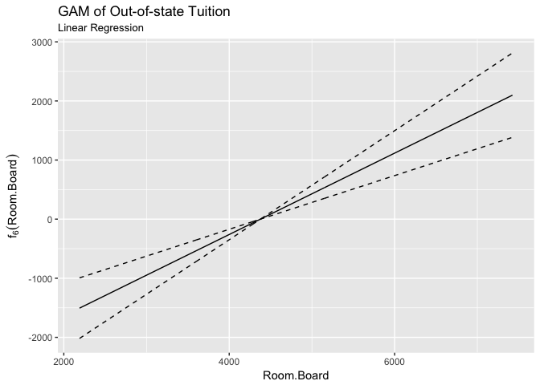

These six plots show that these variables all seem to have substantial and significant relationships with out-of-state tuition. For percent of faculty with Ph.D., it seems that in general there's a positive relationship. However, when the percentage is low (less than 50%), the relationship seems weaker (the 95% confidence interval is wide). For percent of alumnis who denote, there's a positive relationship, and its slope doesn't change too much, indicating this predictor has a nearly steadily increasing influence on tuition. For instructional expenditure per student, the log transformation well explained the relationship. With increment in students' instructional expenditure, the tuition would increase. For graduation rate, when it's lower than 50% or near 100%, the relationship doesn't seem to be substantive. While in other cases, with higher graduation rate, one could expect higher tuition. For whether the university is private, there's a clear and substantive positive influence because the difference between private and public schools is substantial and statistically distinguishable from 0. Private school would demand higher tuition. For room and board costs, the relationship is positive. The tuition would increase with higher room and board costs.

Problem 4. Testing Model Performance
------------------------------------

    ## [1] 4283633

    ## [1] 3753702

The MSE from OLS is 4.283633310^{6};

And the MSE from GAM is 3.753701710^{6}.

One can tell GAM's MSE is much smaller, indicating GAM fits the data better. This is because we included non-linear relationship in the model, which is closer to reality in terms of some predictors. This makes GAM's prediction more accurate.

Problem 5. Non-linear Relationship
----------------------------------

From the discussion above, one can say that the instructional expenditure per student has a non-linear relationship with the out-of-state tuition for sure. After the log-transformation for the linear function, the model fits much better. And for graduation rate, one can say the relationship with tuition is non-linear too, since their relationship has small change (from positive influence to negative) when graduation rate is closer to 100%.
